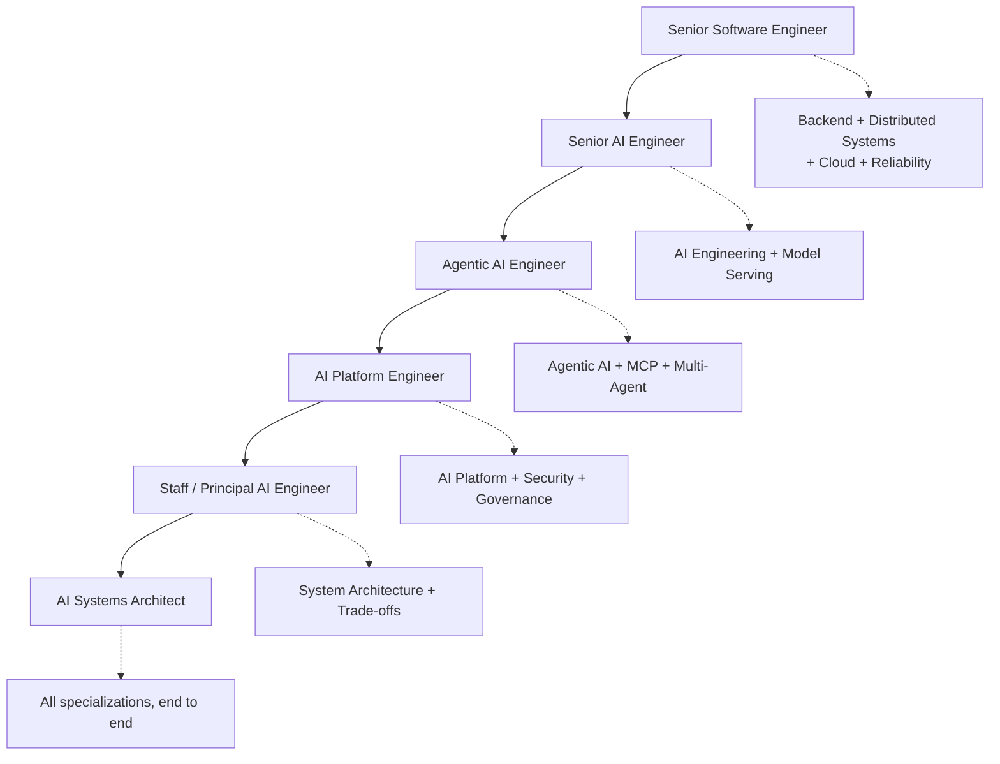

# Career Readiness — Roles and Specializations

> This page answers one question: what does "ready" actually mean at each step of the ladder, and how do the phases and projects prove it?

## Why this page exists

It is easy to finish a study book and still not know whether you are ready for the job you want. Knowledge is necessary but not sufficient: interviews and promotions test whether you can **make decisions, build systems, and explain trade-offs**.

This page maps the book to the career ladder and to the specializations this book targets. Use it as a gap analysis: for the role you want next, find the phase that teaches the skill and the project that proves it, then check the box only when you can demonstrate it.

## The role ladder

Each rung keeps everything below it and adds a new axis. You do not leave backend engineering behind to become an AI engineer; you add modelling and retrieval. You do not leave distributed systems behind to become a platform engineer; you add registries, tenancy, and governance.

## What each role actually tests

### Senior Software Engineer

**What it is.** You own a service end to end: design, code, tests, deployment, on-call.

**What you must be able to do.** Write clean typed Python; design a database schema; build an API; handle concurrency correctly; test and profile; containerise and ship; debug a production incident.

**Taught in.** Phase 1 (Production Python), Phase 6 (Distributed Systems).

**Proven by.** The foundation of Projects 1 and 4, and the shared requirements every project must meet (tests, Docker, migrations, observability).

**Self-check.**
- [ ] I can build a tested, containerised FastAPI service from scratch without a tutorial.
- [ ] I can explain the difference between threads, processes, and async and pick the right one.
- [ ] I can take a slow endpoint and find the bottleneck with evidence.

### Senior AI Engineer

**What it is.** You build AI features that work: retrieval, evaluation, provider integration, cost and latency control.

**What you must be able to do.** Explain how a transformer and sampling work; build and debug a RAG pipeline; choose and compare models; design structured outputs and tool calls; measure quality with real metrics; control cost.

**Taught in.** Phase 2 (LLM Fundamentals), Phase 3 (RAG Engineering), Phase 8 (Evaluation and Observability).

**Proven by.** Project 1 (RAG engine) and Project 5 (evaluation platform).

**Self-check.**
- [ ] I can explain attention, tokenization, the KV cache, and sampling without notes.
- [ ] I can debug "the answer is wrong" and say whether retrieval or generation is at fault.
- [ ] I can show retrieval and faithfulness metrics for my own system, and improve them.

### Agentic AI Engineer

**What it is.** You build agents that act safely: tool use, memory, planning, durable execution, human approval.

**What you must be able to do.** Design the agent loop; define tool schemas and permissions; manage state and memory; make runs durable and resumable; stop loops and deadlocks; wire in approvals and guardrails; evaluate agent behaviour.

**Taught in.** Phase 4 (Agentic AI Engineering), Phase 5 (MCP and Tool Ecosystems), Phase 12 (Multi-Agent Systems).

**Proven by.** Project 2 (autonomous workflow agent) and Project 6 (MCP gateway).

**Self-check.**
- [ ] I can explain why an agent is justified over a deterministic workflow (and when it is not).
- [ ] My agent survives a restart without duplicating side effects.
- [ ] I can show a run trace with every tool call, decision, and approval.

### AI Platform Engineer

**What it is.** You build the platform other teams use: registries, gateway, tenancy, policy, deployment.

**What you must be able to do.** Design control/data/runtime planes; version agents, models, and prompts; run a model gateway with routing and fallback; enforce RBAC/ABAC and policy; isolate tenants; operate on Kubernetes with IaC and CI/CD.

**Taught in.** Phase 7 (AI Platform Engineering), Phase 6 (Distributed Systems), Phase 9 (Security and Governance), Phase 10 (Model Serving).

**Proven by.** Project 3 (agent platform / control plane) and Project 4 (LLM gateway).

**Self-check.**
- [ ] I can register and version an agent, a model, and a prompt, and gate promotion on an evaluation.
- [ ] A tenant over budget is stopped, and cannot see another tenant's data.
- [ ] I can deploy the platform from Terraform and Helm through one pipeline.

### Staff / Principal AI Engineer

**What it is.** You set technical direction across teams: architecture, standards, reliability, cost, and risk.

**What you must be able to do.** Run a system-design discussion; estimate capacity, latency, and cost; choose build vs buy; define SLOs; run failure-mode analysis; make and record decisions (ADRs); mentor through design review.

**Taught in.** Phase 11 (AI Systems Architecture), Phase 8 (Reliability), Phase 9 (Security and Governance).

**Proven by.** Project 3 (the platform), plus the ADRs, failure-mode tables, and cost/latency reports that every project asks you to write.

**Self-check.**
- [ ] I can lead a design review and defend every major choice with a trade-off and a failure mode.
- [ ] I can state an SLO, its error budget, and what I do when the budget is spent.
- [ ] My ADRs show decisions I would make again — and one or two I would change.

### AI Systems Architect

**What it is.** You design whole systems across domains: data, models, agents, platform, cloud, security, and operations — and you can defend them to both engineers and executives.

**What you must be able to do.** Everything above, connected: requirements to estimates to architecture to trade-offs to failure analysis to a rollout plan, with reliability, security, cost, and compliance designed in rather than bolted on.

**Taught in.** Phase 11 above all, with Phase 9 (security/governance), Phase 10 (serving), and the cross-cutting reliability work in Phase 8.

**Proven by.** All six projects as one portfolio, plus a full architecture walkthrough of your largest one.

**Self-check.**
- [ ] I can take a vague brief and produce requirements, estimates, a target architecture, a rollout plan, and a risk register.
- [ ] I can explain where the design fails, how it degrades, and what it costs at each scale.
- [ ] I can present the same design to a principal engineer and to a non-technical stakeholder.

## The specializations

| Specialization | What "ready" means | Taught in | Proven by |
| --- | --- | --- | --- |
| **AI Engineering** | Can build, evaluate, and operate model-backed features | Phases 2, 3, 8 | Projects 1, 5 |
| **Agentic AI** | Can build safe, durable, evaluated agents | Phases 4, 5, 12 | Projects 2, 6 |
| **AI Platform Engineering** | Can run shared platform services with registries, gateway, and tenancy | Phases 7, 10 | Project 3 |
| **Backend Engineering** | Can design and ship reliable services, schemas, and APIs | Phase 1 | Projects 1, 4 |
| **Distributed Systems** | Can reason about consistency, delivery, and failure under load | Phase 6 | Project 3 |
| **Cloud Infrastructure** | Can deploy and operate on Kubernetes and AWS with IaC | Phase 7 | Projects 3, 4 |
| **AI Reliability** | Can define SLOs, trace, monitor, and recover AI systems | Phase 8 | Projects 2, 5 |
| **AI Security** | Can threat-model, least-privilege, and govern AI systems | Phase 9 | Projects 2, 6 |
| **System Architecture** | Can design end-to-end and defend trade-offs with evidence | Phase 11 | All projects |

## Leadership and architecture evidence

Staff and architect readiness is not a topic you read; it is evidence you produce. Phase 11 requires:

- An **RFC** for a real decision, with at least two alternatives and a recommendation.
- **ADRs** with a status, consequences, and a "revisit if" trigger.
- A **design review** you led, including the disagreement and how it was resolved.
- A **six-month roadmap** with milestones, risks, and adoption metrics.
- A **TCO** comparison and a build-versus-buy decision with an exit plan.
- A **migration and deprecation plan** with a compatibility window and a rollback.
- A **two-minute executive summary** of the same architecture you present technically.
- An **ownership model** naming who builds, who runs, who pays, and who decides.

See [RFCs, Design Reviews, and Technical Strategy](../phase-11-ai-systems-architecture/16-rfcs-design-reviews-and-technical-strategy.md), [TCO, Vendor Decisions, Migrations, and Deprecation](../phase-11-ai-systems-architecture/17-tco-vendor-decisions-migrations-and-deprecation.md), and [Operating Models, Stakeholders, and Platform Adoption](../phase-11-ai-systems-architecture/18-operating-models-stakeholders-and-platform-adoption.md).

## Interview evidence required

Interview readiness is proven by repetition, not by reading answers. Phase 13 requires you to produce:

- **30 timed coding solutions** with hidden tests.
- **15 SQL problems**, including indexes and a query plan.
- **10 backend/distributed design drills** using the 45-minute method.
- **10 AI system-design drills** with a quality metric, cost estimate, and fallback.
- **8 behavioural stories** in STAR-L, covering failure, conflict, ambiguity, leadership, mentoring, impact, and disagreement.
- **One recorded five-minute project presentation** and **one recorded system-design answer**.

Each drill has a prompt, a time limit, a rubric, expected evidence, and follow-up questions. See [Timed Coding, SQL, and Debugging Drills](../phase-13-interview-preparation/14-timed-coding-sql-and-debugging-drills.md), [Backend and Distributed System Design Drills](../phase-13-interview-preparation/15-backend-and-distributed-system-design-drills.md), [AI System Design and Incident Drills](../phase-13-interview-preparation/16-ai-system-design-and-incident-drills.md), and [Behavioural Stories and Project Deep Dives](../phase-13-interview-preparation/17-behavioral-stories-and-project-deep-dives.md).

## The readiness rubric

A role is not earned by reading. Score yourself honestly; check a box only when you can demonstrate it without notes.

- [ ] **Explain** — I can explain the core ideas of each phase out loud, with trade-offs and failure modes.
- [ ] **Build** — I have built at least one project end to end, not just the easy half.
- [ ] **Measure** — I can state real numbers for latency, cost, and quality *from my own system*.
- [ ] **Debug** — I have found and fixed a real failure, and I can tell the story.
- [ ] **Decide** — I have written ADRs with alternatives and consequences.
- [ ] **Operate** — I have run and recovered my system, not only deployed it.
- [ ] **Secure** — I can state the threat model and the least-privilege design of my system.
- [ ] **Communicate** — I can walk through my architecture and answer "why not X?" calmly.

## Role tracks

This page maps the roles; the [Role Tracks and Exit Gates](role-tracks.md) page turns that map into a finite study path — required phases, labs, primary project, and exit-gate questions for each role.

## How the projects map to the ladder

- **Senior Software Engineer:** finish the shared foundation and Project 1 or 4.
- **Senior AI Engineer:** add Project 5 and the evaluation/measurement work in Project 1.
- **Agentic AI Engineer:** build Project 2; add Project 6 for tools and security depth.
- **AI Platform Engineer:** build Project 3 on top of the gateway and registries.
- **Staff / Principal AI Engineer:** harden Project 3 (SLOs, DR, multi-region, capacity planning) and write its ADRs.
- **AI Systems Architect:** present all of your projects as one connected portfolio and defend the trade-offs.

## What will truly make you ready

The honest list, in order of impact:

1. **Build the projects yourself.** Read the brief, write your own plan, then build. Copying a finished implementation teaches you almost nothing.
2. **Measure everything.** A candidate who says "p95 is 1.9 s and cost is $0.004 per query, from these traces" is in a different category from one who says "it's fast."
3. **Break your own system.** Kill a worker, drop the network, exhaust a queue, exceed a budget. Recovery stories are the strongest interview material you own.
4. **Write the decisions down.** ADRs, a failure-mode table, and a cost/latency report turn your project into something you can defend under questioning.
5. **Rehearse out loud.** Phase 13 is worthless read silently. Say the answers, get the pauses out, and practise the "why not X?" follow-ups.
6. **Teach it.** Explaining a topic to someone else is the fastest way to find the gap that reading hides.

> **The one-line test.** If you can design it, build it, measure it, break it, fix it, and explain why you chose it — you are ready. Everything else is preparation for that conversation.
