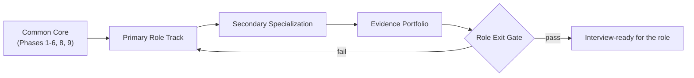

# Role Tracks and Exit Gates

> The book is large. A role track turns it into a **finite** path: a common core, one primary role track, one secondary specialization, an evidence portfolio, and an exit gate you can actually pass.

## Why this page exists

Reading every phase and building all six projects is not a plan; it is a way to finish nothing. Each target role needs a different subset, a different primary project, and a different bar for "ready". This page states, for each role, what is **required**, what is **supporting**, and what is **optional** — and the questions that tell you whether you are done.

## The path model

Five rules make it work:

1. **Common core first.** Everyone completes the core before specialising.
2. **One primary role track.** Pick the role you are targeting next, not the one after that.
3. **One secondary specialization.** Enough to be useful, not to be a second career.
4. **Evidence, not page count.** The portfolio is what proves the track.
5. **One primary project plus one secondary.** Completing all six projects is **optional** and rarely necessary.

## The common core

All roles complete these. They are the price of entry to any of them.

| Phase | Why it is core |
| --- | --- |
| 1 — Production Python / Software Engineering Core | A tested, typed, deployable service is the base of everything. |
| 2 — LLM Fundamentals (incl. statistics and reproducibility) | You cannot evaluate what you cannot measure. |
| 3 — RAG Engineering (incl. data lifecycle) | Retrieval and the data plane behind it. |
| 4 — Agentic AI Engineering | The agent loop, state, and durable execution. |
| 5 — MCP and Tool Ecosystems | Tools and their contracts. |
| 6 — Distributed Systems | Partial failure is the normal case. |
| 8 — Evaluation, Observability, Reliability | Quality, SLOs, and incidents. |
| 9 — Security and Governance | Identity, privacy, and least privilege. |

Phases **7 (Platform)**, **10 (Serving)**, **11 (Architecture)**, **12 (Multi-Agent)**, and **13 (Interview)** are completed as the chosen track requires.

## Choose your track

| Target role | Primary track phases | Primary project | Secondary |
| --- | --- | --- | --- |
| Senior Software Engineer | 1, 6, 8, 9 | 4 — LLM Gateway | 3 — Platform |
| Senior AI Engineer | 2, 3, 8 | 1 — RAG Engine | 5 — Evaluation |
| Agentic AI Engineer | 4, 5, 12, 9 | 2 — Workflow Agent | 6 — MCP Gateway |
| AI Platform Engineer | 7, 10, 6, 9 | 3 — Agent Platform | 4 — LLM Gateway |
| Staff / Principal AI Engineer | 11, 6, 7, 8, 9, 10 | 3 — Agent Platform | 5 — Evaluation |
| AI Systems Architect | 11 plus all | 3 connected to 1, 2, and 4 | any two capabilities |

Every track also completes **Phase 13** for interview practice.

## The role tracks

Each track lists the same seven things: required knowledge, required labs, primary project, secondary capability, operational evidence, interview evidence, and exit-gate questions.

### Senior Software Engineer

- **Required knowledge.** Phase 1 in full (algorithms and data structures are in the companion book), Phase 6, Phase 8 (SLOs and incidents), Phase 9 (identity and app sec basics).
- **Required labs.** Phase 1 checkpoint (typed service, versioned API, tests, load baseline, failure investigation) and Phase 6 checkpoint (load and chaos).
- **Primary project.** [Project 4 — Production LLM Gateway](../projects/04-production-llm-gateway.md), or Project 1.
- **Secondary capability.** Integrate the gateway into a second system, or build the Phase 1 service into Project 3.
- **Operational evidence.** A load baseline, one incident report, one runbook, and one profile.
- **Interview evidence.** 30 timed coding solutions, 15 SQL problems, 10 backend design drills, 8 behavioural stories.
- **Exit-gate questions.**
  - Can you build a tested, containerised service from a blank directory without a tutorial?
  - Can you design a schema and evolve an API without breaking a client?
  - Can you profile a slow endpoint and state the bottleneck with evidence?
  - Can you explain one production failure and the recovery?

### Senior AI Engineer

- **Required knowledge.** Phases 2 and 3 in full, Phase 8 (evaluation, drift), Phase 1 (service), Phase 9 (privacy).
- **Required labs.** Phase 2 experiment with lineage and a leakage fix; Phase 3 ingestion, backfill, and deletion; Phase 8 evaluation gate.
- **Primary project.** [Project 1 — Production Enterprise RAG Engine](../projects/01-production-enterprise-rag-engine.md).
- **Secondary capability.** [Project 5 — AI Evaluation Platform](../projects/05-ai-evaluation-platform.md), wired as Project 1's release gate.
- **Operational evidence.** A labelled evaluation set, a regression gate, a cost/latency report, and one measured quality improvement.
- **Interview evidence.** RAG debugging drills, AI system-design drills, SQL, and 8 behavioural stories.
- **Exit-gate questions.**
  - Can you decide whether a failure is retrieval, generation, data, or the evaluator?
  - Can you state quality, latency, and cost from your own system?
  - Can you explain why your metric and test are valid?
  - Can you ship a regression gate and explain the uncertainty?

### Agentic AI Engineer

- **Required knowledge.** Phases 4, 5, and 12; Phase 9 (agent security); Phase 3 (tools over data).
- **Required labs.** Phase 4 side-effect replay proof; Phase 5 MCP conformance suite; Phase 12 single-versus-multi comparison.
- **Primary project.** [Project 2 — Autonomous Enterprise Workflow Agent](../projects/02-autonomous-enterprise-workflow-agent.md).
- **Secondary capability.** [Project 6 — Enterprise MCP Gateway](../projects/06-enterprise-mcp-gateway.md) for tool contracts and security depth.
- **Operational evidence.** Run traces, a budget-enforcement proof, an adversarial test suite, and a no-duplicate-effect proof.
- **Interview evidence.** Agent and LangGraph drills, MCP interviews, incident drills, 8 behavioural stories.
- **Exit-gate questions.**
  - Can you draw the transition from effect intent to durable effect?
  - Does your agent survive a restart without duplicating a side effect?
  - Can you refuse an unauthorised tool call deterministically, not by prompt?
  - Can you show a poisoning or injection attack and the control that stops it?

### AI Platform Engineer

- **Required knowledge.** Phase 7 in full, Phase 10 (serving), Phase 6 (distributed ops), Phase 9 (security), Phase 4 (what the platform runs).
- **Required labs.** Phase 7 deploy-and-operate (Terraform, Helm, canary, secret rotation, restore, rollback); Phase 10 serving benchmark; Phase 6 chaos.
- **Primary project.** [Project 3 — Open-Source Agent Platform](../projects/03-open-source-agent-platform.md).
- **Secondary capability.** [Project 4 — LLM Gateway](../projects/04-production-llm-gateway.md) as the platform's model path.
- **Operational evidence.** SLOs with error budgets, a GitOps pipeline, a cost report with attribution, and a proved restore.
- **Interview evidence.** Infrastructure and system-design drills, serving and cost questions, 8 behavioural stories.
- **Exit-gate questions.**
  - Can a platform user deploy without manually changing cluster state?
  - Can you enforce tenancy, quotas, policy, and audit at a gateway?
  - Can you deploy from IaC and roll back safely?
  - Can you explain the difference between application scaling and work/queue scaling?

### Staff / Principal AI Engineer

- **Required knowledge.** Phase 11 in full plus breadth across Phases 6, 7, 8, 9, and 10.
- **Required labs.** Phase 11 architecture package: requirements, estimates, two alternatives, ADRs, TCO, migration plan, ownership model, roadmap, risk register, and two presentations.
- **Primary project.** Project 3, hardened: SLOs, disaster recovery, capacity planning, and multi-region thinking.
- **Secondary capability.** Project 5 as the organisation-wide release gate.
- **Operational evidence.** A design review you led, an RFC, a roadmap with adoption metrics, and a postmortem that changed a design.
- **Interview evidence.** 10 AI system-design drills, project deep dives with hostile follow-ups, 8 behavioural stories including leadership and mentoring.
- **Exit-gate questions.**
  - Can you lead a design review and defend every major choice with a trade-off and a failure mode?
  - Can you make a build-versus-buy decision using TCO and an exit plan?
  - Can you state what evidence would change your decision?
  - Can you show how the design improves more than one team?

### AI Systems Architect

- **Required knowledge.** Phase 11 above all, with working knowledge of every other phase.
- **Required labs.** The full architecture package, plus the evidence from at least two supporting projects.
- **Primary project.** Project 3 connected to at least two of Projects 1, 2, and 4 through shared contracts.
- **Secondary capability.** Any two capabilities integrated into the primary system.
- **Operational evidence.** A complete portfolio: one deployed system, one incident report, one threat model, one evaluation report, one architecture decision package, and one recorded walkthrough.
- **Interview evidence.** A five-minute technical walkthrough, a two-minute executive version, and a defensible answer to "why not X?" on every major decision.
- **Exit-gate questions.**
  - Can you turn an ambiguous brief into requirements, estimates, architecture, an operating model, a rollout, and a risk register?
  - Can you connect data, models, agents, platform, cloud, security, reliability, cost, and compliance?
  - Can you present the same design to a principal engineer and to a non-technical stakeholder?
  - Can you state which evidence would change the design?

## The exit-gate rubric

Use the readiness scale from the [competency and evidence contract](../projects/competency-evidence.md):

| Level | Meaning |
| --- | --- |
| 0 — Unfamiliar | Cannot explain it. |
| 1 — Aware | Can define it; no independent build. |
| 2 — Working | A guided lab passes. |
| 3 — Production-capable | Chosen, implemented, measured, secured, and operated, with a failure drill. |
| 4 — Senior-level | Can compare alternatives, debug failures, and teach the decision. |
| 5 — Staff/architect-level | Sets direction across teams and connects choices to business risk and cost. |

A role exit gate is passed when every required capability is at **level 3 or above**, and the role's headline skills are at **level 4** (Senior) or **level 5** (Staff/Architect).

## Optional: the secondary specializations

Pick one to go deeper without doubling the workload. Each maps to phases and a proof artifact.

| Specialization | Go deeper in | Proof |
| --- | --- | --- |
| Retrieval and knowledge systems | Phases 3, 8 | Project 1 with a measured retrieval improvement |
| Agent safety and tool ecosystems | Phases 4, 5, 9, 12 | Project 2 with attack tests and replay proofs |
| Inference and GPU serving | Phase 10 | A serving benchmark with memory and cost numbers |
| Platform and cloud infrastructure | Phases 6, 7 | Project 3 deployed, restored, and costed |
| Reliability and evaluation | Phase 8 | SLOs, an incident drill, and a postmortem |
| AI security and governance | Phase 9 | A threat model plus an exploit/mitigation lab |
| Backend and distributed systems | Phases 1, 6 | A service with duplicate-delivery and worker-death tests |

## You do not have to build all six projects

The default is **one primary project plus one secondary capability**. Completing all six is optional; a learner targeting one role should finish one system end to end rather than start six. See the [portfolio spine](../projects/portfolio-spine.md) for how the projects connect.

## Related pages

- [Career Readiness — Roles and Specializations](index.md) — the full role ladder and what each role tests.
- [Portfolio Spine](../projects/portfolio-spine.md) — how to build one coherent showcase.
- [Competency and Evidence Contract](../projects/competency-evidence.md) — the evidence each gate requires.
- [Definition of Done](../projects/definition-of-done.md) — the shared project bar.
