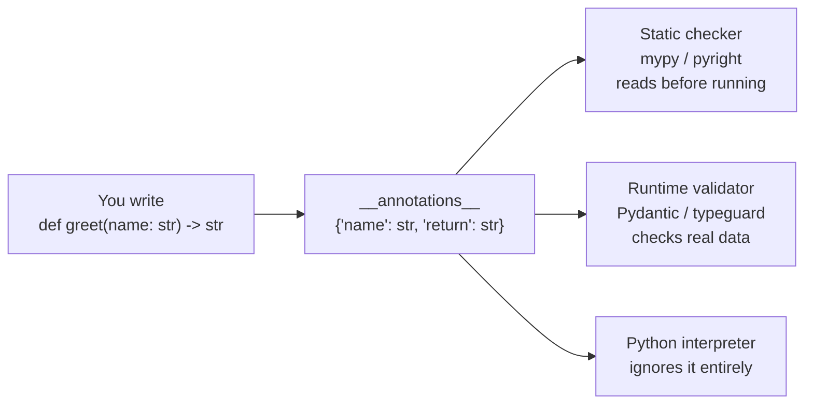

# Type Hints

> **Interview answer (say this first).** Type hints are optional metadata that describe what a function or variable is supposed to contain. Python stores them in `__annotations__` but does **not** enforce them at runtime — they are checked by static tools like mypy or pyright, and by runtime validators like Pydantic.

## Why this exists

To understand type hints, you first have to understand what is missing without them.

Python is **dynamically typed**. That means a variable is just a name pointing at an object, and the object's kind is only known while the program is running:

```python
x = 10        # x points at an int
x = "ten"     # now the same name points at a str — perfectly legal
```

The interpreter never asks you to declare what a name will hold. That is flexible and pleasant to write. But it creates a real problem as programs grow: **the intent of the code exists only in the author's head.**

Consider this function:

```python
def total_price(items):
    return sum(item["price"] for item in items)
```

Nothing here tells you what `items` should be. A list of dictionaries? A tuple? Where does `"price"` come from? Is it a number or a string? A new teammate has to read the whole function, then every caller, to find out.

Worse, mistakes are discovered late and far from their cause:

```python
cart = [{"price": 10}, {"price": 20}]
total_price(cart)          # 30 — fine

shipping = {"price": 5}    # someone passes a single dict by mistake
total_price(shipping)      # 25 — WRONG, but no error is raised!
```

The second call silently produces a wrong answer, because iterating a dict yields its **keys** (`"price"`), and `sum("price")` in this case never happens — the point is that Python happily accepts an argument of the wrong shape and fails much later, or not at all.

Type hints exist to write the missing intent down, in a form both humans **and tools** can read.

> **Note:**
>
> **The one-sentence purpose.** Type hints let you state what the code expects, so a tool can check it *before* the program runs.


## Start from zero

Before going further, here are the words this topic keeps using.

| Word | Plain meaning |
| --- | --- |
| **Type** | The kind of object a value is — `int`, `str`, `list`, a custom class. The type decides what operations make sense. |
| **Runtime** | The time while the program is actually running, executing lines. |
| **Static** | Before the program runs; while a tool is only *reading* the code text. |
| **Annotation** | The `: str` part you write in code. It is real data Python stores. |
| **Type hint** | The meaning of an annotation: "this is expected to be a `str`." |
| **Type checker** | A separate program (`mypy`, `pyright`) that reads your code and the annotations and reports contradictions. It never executes your code. |
| **Runtime validator** | A library (like `Pydantic`) that reads annotations and checks *actual data* while the program runs. It can raise an error. |
| **Nominal typing** | Asking "is this a `Dog`?" by checking the class or its inheritance chain. Java and C# work this way. |
| **Structural typing** | Asking "does this behave like a `Dog`?" by checking whether it has the needed methods. Python's natural style. |
| **Duck typing** | The informal version of structural typing: "if it walks like a duck and quacks like a duck, treat it as a duck." |

Two of these words cause most of the confusion, so pin them down now:

- **Runtime vs static** is about *when* checking happens. Static = reading, before running. Runtime = executing, while running.
- **Nominal vs structural** is about *how* sameness is decided. By name/inheritance, or by shape/behavior.

Type hints are **static**, and Python's typing is **structural**. Remembering those two facts will make the rest of this page obvious.

## The core idea

Think of a parcel in a warehouse. The label says *"fragile — this side up"*. Everyone who reads it benefits, but the label does not physically stop anyone from turning the box over. It is a **description**.

Type hints are the label. The **inspector** who reads the labels and complains is the static type checker. It checks the parcels before they ship.

Now the crucial part — what actually happens in the interpreter:

> Python reads each annotation once, stores it in a dictionary called `__annotations__`, and then **completely ignores it** when the function is called.

You can see the stored data directly:

```python
def greet(name: str, times: int = 1) -> str:
    return f"Hi {name}! " * times

print(greet.__annotations__)
# {'name': <class 'str'>, 'times': <class 'int'>, 'return': <class 'str'>}
```

Those annotations are ordinary Python objects. Nothing checks them. Nothing rejects bad input. The interpreter simply does not care.

So where does the value come from? **Three separate readers** can use that dictionary:



| Reader | Example tool | When | Does it enforce? |
| --- | --- | --- | --- |
| Static checker | mypy, pyright, your editor | before running | No, but it fails the build or shows a red squiggle |
| Runtime validator | Pydantic, typeguard | while running | Yes, it raises an error |
| Interpreter | `python` itself | every call | No enforcement at all |

That table *is* the topic. Everything else is detail about how each reader works.

## How it works

**Step 1 — You write annotations.** On parameters, return values, variables, and class attributes.

**Step 2 — Python evaluates and stores them.** By default (Python 3.13 and earlier) annotations are evaluated at the moment the `def` runs, and the results go into `__annotations__`. From **Python 3.14**, annotations are evaluated *lazily*: the values are still available, but they are only computed when something actually asks for them.

**Step 3 — A static checker reads them without running the program.** It builds a model of every name and every function, then walks your call sites looking for mismatches. Because it never runs the code, it can check branches you never execute.

**Step 4 — A runtime validator reads them when data arrives.** Pydantic inspects the annotations of a model (or a function), then, for each incoming value, checks and often converts it. `"3"` becomes `3` if the field says `int`. If a value cannot fit, it raises `ValidationError`.

**Step 5 — The interpreter calls the function and never looks at the annotations.** This is why `greet(123)` runs, and why a wrong type only crashes when something tries to use it wrongly.

> **Tip:**
>
> **The mental shortcut.** A type hint is a *fact you write down*. Whether a bug is caught depends entirely on **who reads the fact** — a checker before running, a validator during running, or nobody at all.


## The syntax you will use

This is a tour of the real forms, smallest to largest. Read it once now; you will return to it often.

**Basic parameters and return type.**

```python
def add(a: int, b: int) -> int:
    return a + b
```

**Variable annotations.** Hints can describe plain variables too.

```python
count: int = 0
names: list[str] = []
```

**Built-in generics.** Since Python 3.9 you can subscript built-in types directly.

```python
numbers: list[int]              # a list of ints
scores: dict[str, float]        # keys are str, values are float
tags: set[str]                  # a set of str
point: tuple[int, int]          # exactly two values: int, int
row: tuple[str, ...]            # any number of str
```

**Unions: "one of these types."** `X | Y` means the value may be `X` or `Y`.

```python
user_id: int | str              # may be an int or a str
name: str | None                # may be a str, or None
```

**`Optional[X]` is exactly the same as `X | None`.** The name is misleading: it does *not* mean "this argument is optional," only "`None` is allowed."

**`Callable`: functions as values.**

```python
from collections.abc import Callable

def apply(fn: Callable[[int], int], value: int) -> int:
    return fn(value)            # fn takes an int and returns an int
```

**`Any` vs `object`.** Both accept anything, but they behave very differently.

```python
from typing import Any

value: Any = fetch()            # checker gives up; anything is allowed
raw: object = fetch()           # checker keeps watching; you must narrow
                                # before using raw as a str or int
```

**`Literal`: one of a fixed set of values.**

```python
from typing import Literal

mode: Literal["read", "write"] = "read"
```

**`TypedDict`: the shape of a dictionary.**

```python
from typing import TypedDict

class Item(TypedDict):
    name: str
    price: float

def total(items: list[Item]) -> float:
    return sum(i["price"] for i in items)
```

That example is the fix for the bug from the start of the page: now `items` must be a list of dictionaries that contain `name` and `price`.

**Generics: the type depends on the input.**

```python
def first[T](items: list[T]) -> T:      # Python 3.12+ syntax
    return items[0]
```

Older code writes the same idea with a `TypeVar`:

```python
from typing import TypeVar

T = TypeVar("T")

def first(items: list[T]) -> T:
    return items[0]
```

**Class attributes.**

```python
class User:
    name: str
    age: int = 0

    def __init__(self, name: str) -> None:
        self.name = name
```

You do not need all of this on day one. But you should recognize every form, because production code uses all of them.

## Examples: simple to real

**Example 1 — the bug that hides.**

```python
def average(values):
    return sum(values) / len(values)

average([10, 20, 30])   # 20.0
average([])             # ZeroDivisionError — discovered at runtime
```

Nothing warns you that an empty list breaks this. The problem is real but invisible.

**Example 2 — hints plus a checker catch it early.**

```python
def average(values: list[float]) -> float:
    return sum(values) / len(values)

average("10,20")        # checker: expected list[float], got str
```

The hint does not stop the call. But your editor and `mypy` now know enough to flag the bad argument while you type, and to record "this can fail on an empty list" for whoever reviews the code.

**Example 3 — runtime validation at a trusted boundary.**

Static hints cannot help with data that arrives while the program runs — an HTTP request, a queue message, or an LLM's answer. For that, use a validator:

```python
from pydantic import BaseModel

class CreateUser(BaseModel):
    name: str
    age: int

CreateUser(name="Ada", age="36")   # age coerced to int 36
CreateUser(name="Ada", age="old")  # ValidationError — rejected
```

This is the pattern that matters in AI systems: **hints describe the inside of your program; validators guard the edges.**

**Example 4 — structural typing with `Protocol`.**

```python
from typing import Protocol

class Closable(Protocol):
    def close(self) -> None: ...

def shutdown(resource: Closable) -> None:
    resource.close()

class File:
    def close(self) -> None: ...

shutdown(File())    # works: File has a close() method, no inheritance needed
```

`Closable` is not a base class. It is a *description of a shape*. Any object with the right method fits. This is Python's duck typing, made checkable.

## In production

- **Run a checker in CI.** Without mypy or pyright, hints rot and quietly lie. This single step is what turns hints from decoration into a safety net.
- **Type the edges, not every line.** Public functions, module boundaries, and data models matter most. Annotating every local variable adds noise without adding safety.
- **Validate at the boundary, then trust inside.** Parse untrusted data once with Pydantic; internal code can then rely on the types. This is cheaper and clearer than checking the same data repeatedly.
- **Accept wide, return narrow.** Parameters should use abstract types like `Sequence[str]`, `Iterable[int]`, or `Mapping[str, int]` so callers are not forced to convert. Return types should be concrete, like `list[str]`, so callers know exactly what they get.
- **Treat every `Any` as a hole.** `Any` switches checking off for that value and quietly spreads through the code that touches it. Sometimes necessary, always worth a comment.
- **Adopt gradually on legacy code.** Turning on a strict checker across a large codebase at once fails. Start with one module, allow `Any`, and tighten over time.
- **Know your version.** `X | None` needs Python 3.10+. On older code use `Optional[X]` and add `from __future__ import annotations` to turn annotations into strings and avoid import cycles.
- **Runtime validation is not free.** Pydantic checks data on every call. That is the right trade at a boundary and the wrong trade inside a hot loop.
- **`get_type_hints()` resolves strings.** If annotations were stored as strings (via the future import or lazy evaluation), frameworks call `typing.get_type_hints(obj)` to turn them back into real types before using them.

## Interview questions

### 1. Does Python enforce type hints at runtime?

**Answer.** No. Annotations are stored in `__annotations__` and otherwise ignored by the interpreter. A function annotated `name: str` will accept an integer without complaint. Enforcement only exists if an external tool provides it: a static checker before running, or a runtime validator while running.

**Follow-up: "Then how do type hints reduce bugs?"** They move the discovery earlier. A static checker finds mismatches before deployment; a validator finds bad external data the moment it enters the system, close to its source.

**Trap.** Saying "modern Python enforces annotations." It does not, in any version. Equally wrong: calling hints "just comments." Annotations are real objects with structure, which is exactly why tools can read them.

### 2. What is the difference between a type hint and Pydantic validation?

**Answer.** A type hint is a *description*: static, optional, and free at runtime. Pydantic is a *validator*: it reads those hints and checks real data while running, raising `ValidationError` when data does not fit. Hints are for developers and checkers; Pydantic is for untrusted data entering the program.

**Follow-up: "Where do you use each?"** Hints everywhere the intent matters. Pydantic at every boundary you do not control — HTTP bodies, queue messages, third-party APIs, and LLM output.

**Trap.** Calling Pydantic "mypy at runtime." Pydantic also *coerces* (`"3"` to `3`) and expresses rules mypy cannot, such as "must be a valid email."

### 3. What does `from __future__ import annotations` do, and why use it?

**Answer.** It stores annotations as strings instead of evaluating them immediately. That lets you reference names not yet defined (forward references), avoids importing modules only for a type, and speeds up import time. From Python 3.14, annotations are lazy by default, so this becomes the standard behavior.

**Follow-up: "What can break?"** Code that reads `__annotations__` and expects real objects. Frameworks handle it by calling `typing.get_type_hints()` to resolve the strings.

**Trap.** Describing it as only a circular-import fix. Forward references and import-time cost are the actual reasons.

### 4. Why prefer `Sequence[str]` over `list[str]` in a parameter?

**Answer.** `Sequence[str]` describes only what you need — something ordered and indexable. It accepts a list, a tuple, and more, so callers are not forced to convert. `list[str]` over-specifies and rejects valid inputs.

**Follow-up: "When is `Iterable[str]` better?"** When you only loop once and do not need indexing or length. It is the widest useful contract, and it signals that the data is single-pass.

**Trap.** Using abstract types for *return* values. Return the concrete type you actually produce; `list[str]` tells the caller more than `Sequence[str]`.

### 5. How do you type a value that may be `None`?

**Answer.** `str | None` (Python 3.10+), which is identical to `Optional[str]`. It means "a `str` or `None`," and it forces the checker to make you handle the `None` branch before you use the value.

**Follow-up: "Is a parameter whose default is `None` the same thing?"** No. `def f(x: str = None)` is a type error, because `None` is not allowed by the hint. If `None` is valid, the type must include it.

**Trap.** Reading `Optional[str]` as "this argument is optional." It says nothing about whether the caller must pass it — only that `None` is an accepted value.

### 6. What is `Protocol` for?

**Answer.** `Protocol` describes the *shape* a value must have, without requiring inheritance. Any class with the right methods or attributes satisfies it. This is structural typing: duck typing that a checker can verify.

```python
from typing import Protocol

class SupportsClose(Protocol):
    def close(self) -> None: ...

def shutdown(resource: SupportsClose) -> None:
    resource.close()
```

**Follow-up: "How is that different from an abstract base class?"** An ABC requires explicit inheritance — nominal typing. A protocol is satisfied implicitly, so existing and third-party classes work without modification. That makes protocols ideal when you depend on a small behavior rather than a concrete class.

**Trap.** Forgetting that `isinstance()` on a protocol requires `@runtime_checkable`, and that this only checks method *names*, not their signatures.

### 7. What is the difference between `Any` and `object`?

**Answer.** Both accept any value, but `Any` switches checking *off*: it is compatible with everything in both directions, so mistakes flow through unchecked. `object` accepts any value but keeps checking *on*: you may store anything, but you must narrow the type before using it as a `str` or `int`.

**Follow-up: "When would you actually use `Any`?"** At genuinely dynamic boundaries — for example, the raw JSON value returned by a provider SDK before you validate it with Pydantic. Then convert it to a real type immediately.

**Trap.** Using `Any` as a convenience to silence the checker. That hides exactly the bugs the checker was hired to find.

### 8. What is the practical value of type hints beyond bug catching?

**Answer.** They are executable documentation, they power editor autocomplete and refactoring, and they are the input that frameworks like Pydantic, FastAPI, SQLAlchemy, and dataclasses use to generate behavior. In FastAPI, for example, the same annotation produces validation, serialization, and API documentation.

**Follow-up: "So are hints optional?"** Technically yes, and in modern Python frameworks practically no. Framework behavior depends on them, so missing hints mean missing features.

**Trap.** Believing hints are only for humans. In most modern stacks they are machine-read configuration.

## Remember this

- Type hints are **metadata, not enforcement**. Python stores them and moves on.
- Bugs are caught by **static checkers before running** and **validators at the boundary**.
- **Widen inputs, narrow outputs.** Type the edges, not every line.
- Python typing is **structural** (`Protocol`), and checking is **static**, not runtime.
- `Optional[X]` means `X | None`, not "the argument can be omitted."
