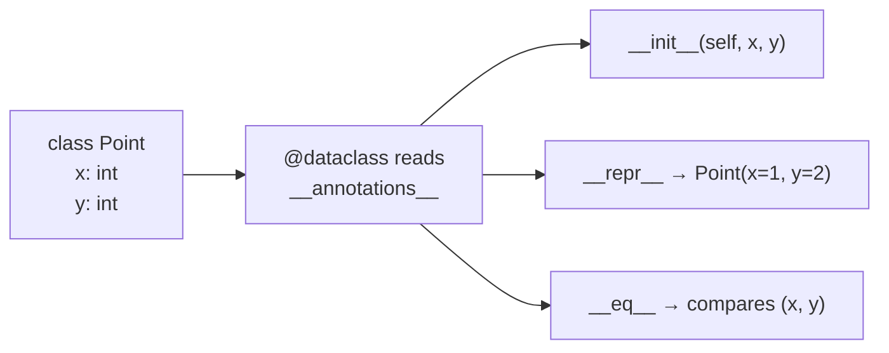

# Dataclasses

> **Interview answer (say this first).** A dataclass is a decorator that writes the boilerplate methods for a class whose main job is to hold data — `__init__`, `__repr__`, and `__eq__` — by reading the class's type annotations. It removes repetition, not behavior.

## Why this exists

A class that just holds data needs a surprising amount of code:

```python
class Point:
    def __init__(self, x, y):
        self.x = x
        self.y = y

    def __repr__(self):
        return f"Point(x={self.x}, y={self.y})"

    def __eq__(self, other):
        return isinstance(other, Point) and (self.x, self.y) == (other.x, other.y)
```

Look at what happened. You wanted to say *"a point has an x and a y."* Instead you wrote three methods and nine lines, and almost none of them express that idea.

Worse, this code is easy to break in ways that are hard to notice:

- Add a `z` field but forget to update `__eq__` — two different points now compare equal.
- Typo a field name in `__repr__` — your logs lie.
- Omit `__eq__` entirely — `Point(1, 2) == Point(1, 2)` becomes `False`, because the default is *identity*, not *value*.

None of that is the interesting part of your program, yet it has to be correct. This pattern is so common that Python provides a shortcut.

## Start from zero

**A class is a blueprint; an instance is one object built from it.** `Point` is the class; `Point(1, 2)` creates an instance.

**An attribute is a value stored on an object.** In `Point(1, 2)`, the `x` and `y` attributes hold `1` and `2`.

**`self` is the instance being worked on.** When you call `p.distance()`, Python passes `p` as the first argument, which the method receives as `self`. It is not a keyword; it is just a parameter name everyone agrees on.

**`__init__` is the setup method.** Python calls it automatically when you create an instance. Its job is to attach the starting attributes.

**A dunder method is a method with double underscores on both sides.** The name is short for "double underscore". They are hooks into Python's own syntax:

| Dunder | Triggered by | Purpose |
| --- | --- | --- |
| `__init__` | `Point(1, 2)` | set up a new instance |
| `__repr__` | `repr(p)`, the debugger, f-strings | a readable string for developers |
| `__eq__` | `p == q` | decide what "equal" means |

**Identity vs equality matters here.** `p is q` asks "are these the same object in memory?" `p == q` asks "should these count as equal?" By default, a plain class uses identity for `==`, so two separately created points are *not* equal. A dataclass changes that to compare values.

**A decorator is a function that takes a class or function and returns a modified version.** The `@` syntax applies it. When Python sees:

```python
@dataclass
class Point:
    ...
```

it is really doing `Point = dataclass(Point)`. The decorator runs once, at class-definition time, and can add methods to the class before you ever use it.

**Mutable vs immutable** describes whether a value can change in place. A `list` is mutable (`items.append(1)` changes it). A `tuple` and a `str` are immutable. This distinction becomes important later, because dataclasses treat mutable defaults specially.

**A field is one declared piece of data in a dataclass.** `x: int` declares a field named `x`.

## The core idea

Think of a **form template**. You write down the field names once:

```text
x: int
y: int
```

A machine then stamps out all the standard paperwork: a constructor that accepts those fields, a printer that shows them, and a comparison rule that checks them. You describe *what the data is*; the decorator writes *how to create, print, and compare it*.

There is a direct link to the previous topic. `@dataclass` finds the fields by reading the same class `__annotations__` that type hints use. That is the whole trick:

> **In a dataclass, the type annotation is not just a hint — it is the field definition. If you do not annotate a name, it is not a field.**



The result is exactly the hand-written `Point` from the start — except you did not write it, so you cannot typo it.

## How it works

1. **`@dataclass` runs at class-definition time.** Like every decorator, it executes once, before your code uses the class.
2. **It reads `__annotations__` in definition order.** Each annotated name becomes a field, in the order you wrote them.
3. **It generates `__init__`.** One parameter per field, in order, respecting any defaults.
4. **It generates `__repr__`.** It prints the class name and every field: `Point(x=1, y=2)`.
5. **It generates `__eq__`.** It compares the tuple of fields — but only against an object of the *same class*.
6. **Options change the output.** `frozen=True` adds immutability and hashing. `order=True` adds `<`, `<=`, `>`, `>=`. `slots=True` changes how attributes are stored.
7. **It never overwrites what you wrote.** If you define your own `__repr__`, dataclass leaves it alone. It fills gaps; it does not fight you.

> **Note:**
>
> **What a dataclass is not.** It is a code generator, not a validator. It does not check that the values you pass match the annotations. `User(name=123, age="old")` is accepted without complaint. For checking, you need Pydantic, which is the next topic.


## The syntax you will use

**The basic form.** Annotated attributes, nothing else.

```python
from dataclasses import dataclass

@dataclass
class Point:
    x: int
    y: int

Point(1, 2)          # __init__ generated
repr(Point(1, 2))    # 'Point(x=1, y=2)'
Point(1, 2) == Point(1, 2)   # True — generated __eq__
```

**Defaults.** A field can have a default, and callers may omit it.

```python
@dataclass
class User:
    name: str
    age: int = 0
```

Fields with defaults must come *after* fields without them, otherwise Python cannot build `__init__` (the same rule as ordinary function arguments).

**Mutable defaults need `default_factory`.** Never write `items: list = []`. A dataclass refuses it, and even if it did not, one shared list would be reused by every instance.

```python
from dataclasses import dataclass, field

@dataclass
class Cart:
    items: list[str] = field(default_factory=list)
```

`default_factory` is a function called fresh for each new instance — here, `list`, producing an empty list every time.

**`frozen=True`: read-only instances.** Assigning an attribute raises `FrozenInstanceError`. Frozen instances also become hashable, so they can go in a `set` or act as dictionary keys.

```python
@dataclass(frozen=True)
class Coord:
    x: int
    y: int

c = Coord(1, 2)
c.x = 9              # FrozenInstanceError
{Coord(1, 2): "start"}   # works: frozen is hashable
```

**`order=True`: comparison operators.** Adds `<`, `<=`, `>`, `>=`, comparing fields like a tuple, in order.

```python
@dataclass(order=True)
class Version:
    major: int
    minor: int

Version(1, 2) < Version(1, 10)   # True
```

**`slots=True`: less memory.** Instead of storing attributes in a dictionary, the class reserves fixed slots. This uses less memory and can be slightly faster, at the cost of no `__dict__`.

```python
@dataclass(slots=True)
class Event:
    name: str
```

**`kw_only=True`: keyword-only constructor.** Useful when several fields share a type, so positional calls would be confusing.

```python
@dataclass(kw_only=True)
class Range:
    start: int
    stop: int

Range(start=0, stop=10)   # Range(0, 10) would be a TypeError
```

**`__post_init__`: code that runs after `__init__`.** Use it for derived values and validation.

```python
@dataclass
class Rectangle:
    width: float
    height: float
    area: float = field(init=False)   # not accepted from the caller

    def __post_init__(self) -> None:
        self.area = self.width * self.height
```

**`ClassVar`: a class-level constant that is not a field.**

```python
from typing import ClassVar

@dataclass
class Job:
    kind: ClassVar[str] = "job"   # shared; not in __init__
    name: str
```

**`InitVar`: a parameter for setup that is not stored.** It is passed to `__init__` and then to `__post_init__`, but never becomes an attribute. It lives in `dataclasses` (in older versions it was also importable from `typing`).

```python
from dataclasses import dataclass, InitVar

@dataclass
class Account:
    email: str
    raw_password: InitVar[str]

    def __post_init__(self, raw_password: str) -> None:
        self.email = self.email.lower()          # stored
        self.password_hash = hash(raw_password)  # stored, raw not kept
```

**Field options.** `field()` can exclude a field from `repr`, exclude it from equality, or keep it out of `__init__`.

```python
@dataclass
class Session:
    token: str
    created_at: float = field(compare=False)          # ignore in ==
    secret: str = field(default="", repr=False)       # hide from repr
    internal: int = field(default=0, init=False)      # not a constructor arg
```

**Helpers.** `dataclasses.fields()`, `asdict()`, `replace()`, and `astuple()`.

```python
from dataclasses import asdict, replace, fields

p = Point(1, 2)
asdict(p)            # {'x': 1, 'y': 2} — a deep copy
replace(p, y=99)     # Point(x=1, y=99) — a new instance
[f.name for f in fields(p)]   # ['x', 'y']
```

**Inheritance.** A subclass keeps the base fields, and they come first.

```python
@dataclass
class Base:
    id: int

@dataclass
class Entity(Base):
    name: str = ""

Entity(1, "user")    # id=1, name='user'
```

## Examples: simple to real

**Example 1 — from six lines to one.**

```python
@dataclass
class Point:
    x: int
    y: int
```

You gain `__init__`, `__repr__`, and value-based `__eq__` for free. Deleting the hand-written versions removes three chances to make a mistake.

**Example 2 — a typical application record.**

```python
@dataclass
class User:
    id: int
    email: str
    roles: list[str] = field(default_factory=list)
    active: bool = True

u = User(1, "a@example.com")
u.roles.append("admin")          # safe: this instance has its own list
User(2, "b@example.com").roles   # [] — not shared
```

Without `default_factory`, every user would share one list — a classic production bug where one user's role appears on another account.

**Example 3 — immutable value objects.**

```python
@dataclass(frozen=True)
class Money:
    amount: int          # store cents, never floats
    currency: str

Money(500, "USD") == Money(500, "USD")     # True
{Money(500, "USD"), Money(500, "USD")}     # a set with one element
```

Frozen dataclasses are ideal for values that should never change after creation: money, coordinates, configuration snapshots, cache keys.

**Example 4 — derived data and validation.**

```python
@dataclass
class OrderLine:
    price: int
    quantity: int
    total: int = field(init=False)

    def __post_init__(self) -> None:
        if self.quantity < 0:
            raise ValueError("quantity cannot be negative")
        self.total = self.price * self.quantity
```

`total` is computed, never passed in, and always consistent with the other fields.

**Example 5 — the dataclass does not validate types.**

```python
User(id="one", email=42)   # accepted! no error
```

This is the key limitation and the reason Pydantic exists. Use a dataclass *inside* your program, where you control the data. Use a validator at the *edge*, where you do not.

## In production

- **Never use a mutable default directly.** `items: list = []` raises `ValueError` at import time. Use `field(default_factory=list)`. This is the single most common dataclass bug.
- **Dataclasses are not validators.** They do not check types. Validate untrusted input with Pydantic, then convert to a dataclass if you want a plain internal type.
- **`frozen=True` is shallow.** The reference cannot be reassigned, but a mutable field can still change: a frozen `Box` holding a list can have that list mutated. For real immutability, store immutable values (`tuple`, not `list`).
- **Equality changes hashing.** With the defaults (`eq=True`, `frozen=False`) the class is unhashable — `__hash__` is set to `None`. If you need it in a set or as a dict key, use `frozen=True`, or set `unsafe_hash=True` if you accept the risk.
- **Field order defines `__init__`.** Adding or reordering fields changes the constructor signature and can break callers and pickle. Prefer `kw_only=True` for classes with many fields.
- **`asdict()` deep-copies.** It recursively copies nested data, so it is convenient but not free. Avoid it in hot paths or for large objects.
- **Immutability and `slots` interact.** `@dataclass(slots=True)` returns a *new* class object, which can surprise code that holds a reference to the original class or relies on `__dict__`.
- **Keep behavior out.** A dataclass should describe data. Put business logic in services or functions, not in methods, or you will end up with an untestable god-object.
- **Do not put secrets in `repr`.** Passwords and tokens will show up in logs. Mark those fields `repr=False`.
- **Choose the right container.** Dataclass for mutable internal records, `NamedTuple` for small immutable tuples, `TypedDict` for plain dictionary shapes, Pydantic at boundaries.

## Interview questions

### 1. What exactly does `@dataclass` generate?

**Answer.** By default it generates `__init__`, `__repr__`, and `__eq__`, based on the class's annotated fields. Options add more: `frozen=True` adds immutability and a field-based `__hash__`; `order=True` adds the comparison operators; `slots=True` changes attribute storage. It never overrides methods you defined yourself.

**Follow-up: "How does it know what the fields are?"** It reads the class `__annotations__` in definition order. Each annotated name is a field; annotated names marked `ClassVar` are excluded.

**Trap.** Saying it "adds types" or "validates." It generates methods only. A dataclass will happily hold a value of the wrong type.

### 2. Why is a mutable default like `items: list = []` not allowed?

**Answer.** Because a default value is created once, when the class is defined, and shared by every instance. With a list default, every instance would point at the same list. Dataclasses call this out at class-definition time with `ValueError: mutable default <class 'list'> for field items is not allowed`.

**Follow-up: "What is the fix?"** Use `field(default_factory=list)`. The factory is called for each new instance, so each gets its own object.

**Trap.** Thinking the rule only applies to `list`. It applies to any unhashable default — `dict`, `set`, and custom mutable objects. Immutable defaults such as `0`, `""`, `None`, and tuples are fine.

### 3. Dataclass vs Pydantic model vs `NamedTuple` vs `TypedDict` — when do you use each?

**Answer.** A dataclass is a lightweight data container with generated methods and no validation, best for data you already trust. A Pydantic model validates and coerces data at runtime, best for untrusted input at the edges. A `NamedTuple` is a small immutable tuple with named fields, best for returning a fixed set of values. A `TypedDict` describes the shape of a plain dictionary for a type checker, adding no runtime behavior at all.

**Follow-up: "Can you combine them?"** Yes, and it is a common pattern: validate with a Pydantic model at the boundary, then convert to a dataclass for internal use.

**Trap.** Saying a dataclass is "Pydantic without the validation library." The difference is the purpose — code generation versus data validation.

### 4. What does `frozen=True` do, and is it truly immutable?

**Answer.** It makes instances read-only by generating `__setattr__` and `__delattr__` that raise `FrozenInstanceError`. It also makes the class hashable based on its fields. It is *shallow*: a field pointing at a mutable object can still be mutated.

**Follow-up: "How would you get real immutability?"** Store immutable values — tuples instead of lists, frozen dataclasses instead of mutable ones. Also note that `object.__setattr__` can bypass the protection, so frozen is a guardrail, not a security boundary.

**Trap.** Claiming a frozen dataclass is fully immutable. The reference is fixed; what it points to may not be.

### 5. Why did my dataclass become unhashable?

**Answer.** By default `eq=True` and `frozen=False`, so Python sets `__hash__` to `None` to keep the rule "equal objects must have equal hashes" consistent. A mutable object whose fields can change cannot have a stable hash. Use `frozen=True` for a safe field-based hash, or understand what you are doing before reaching for `unsafe_hash=True`.

**Follow-up: "What if a frozen dataclass holds a list?"** The class is hashable, but hashing it raises `TypeError`, because hashing the field tuple hits the unhashable list.

**Trap.** Reaching for `unsafe_hash=True` immediately. It works, but it lets you break the hash contract if fields later change.

### 6. What is `__post_init__` for?

**Answer.** It runs automatically at the end of the generated `__init__`. It is the place for derived values and validation that need all fields present — computing a total, normalizing an email, checking an invariant, or storing a hash instead of a raw password.

**Follow-up: "How do `InitVar` and `init=False` fit in?"** `InitVar` adds a constructor parameter that is passed to `__post_init__` but not stored as a field. `field(init=False)` is the opposite: a stored field that callers cannot pass in.

**Trap.** Trying to validate a single field in `__post_init__` when it could be enforced by construction. Use `__post_init__` for cross-field rules; keep simple rules close to the data.

### 7. What do `order=True`, `slots=True`, and `kw_only=True` do?

**Answer.** `order=True` generates `<`, `<=`, `>`, `>=`, comparing the field tuples in order. `slots=True` replaces the per-instance `__dict__` with fixed slots, saving memory and slightly speeding up attribute access. `kw_only=True` makes all fields keyword-only in the constructor, which prevents mistakes when several fields share a type.

**Follow-up: "Any downside to slots?"** Yes. Instances have no `__dict__`, so you cannot add attributes dynamically, and the decorator returns a new class object, which can matter with multiple decorators or inheritance.

**Trap.** Assuming `order=True` lets you compare with other classes. Comparisons with a different class return `NotImplemented`, so you get a `TypeError`.

### 8. Do dataclasses use type hints, and do they enforce them?

**Answer.** They use the annotations to find and order the fields, so a field must be annotated to exist. They do not enforce the types when you construct an instance.

**Follow-up: "So what happens if I pass the wrong type?"** Nothing at construction. The mistake surfaces later, wherever the value is used. That is why validation libraries exist.

**Trap.** Confusing "uses the hint" with "checks the hint." Reading the annotation and enforcing it are separate steps, and a dataclass only does the first.

## Remember this

- `@dataclass` **generates** `__init__`, `__repr__`, and `__eq__` from annotated fields. It does not validate.
- **Mutable defaults need `default_factory`.** `items: list = []` is a bug the class refuses to let you write.
- **`frozen=True` is shallow** but makes a class hashable; default dataclasses are unhashable.
- Use **dataclasses inside** your program and **Pydantic at the edges** where data is untrusted.
- **Data in the class, behavior in services.** Keep dataclasses small and honest.
