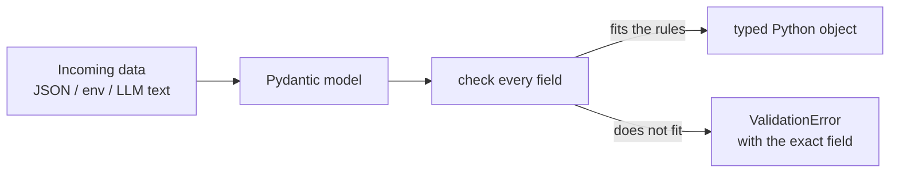

# Pydantic

> **Interview answer (say this first).** Pydantic is a runtime data-validation library. You declare a model with type annotations, and Pydantic checks the real data at runtime, converting compatible values and raising `ValidationError` when something does not fit. It is the validation layer at the edge of your system.

## Why this exists

The two previous topics left a gap. Type hints describe types but are never enforced. Dataclasses generate boilerplate but do not check values either. Both are designed for data you already trust.

So what happens when data comes from the outside world?

```python
@app.post("/users")
def create_user(payload: dict):
    name = payload["name"]        # KeyError if missing
    age = payload["age"]          # KeyError or wrong type
    if not isinstance(age, int):  # endless hand-written checks
        raise HTTPException(400, "age must be an int")
    ...
```

This style fails in several ways at once:

- **It is verbose.** Every field needs its own checks, repeated everywhere.
- **It is incomplete.** You forget the edge cases: negative ages, absurd lengths, missing fields, wrong nesting.
- **It is inconsistent.** Different endpoints validate differently.
- **It leaks details.** Callers get vague errors instead of knowing which field was wrong and why.

Worst of all, the checks are written in ordinary code, so the rules live in someone's head until they read the whole function — the same problem type hints were meant to solve.

Pydantic fixes this by letting you **declare the rules once** and getting validation, conversion, clear errors, and a JSON Schema for free.

## Start from zero

| Word | Plain meaning |
| --- | --- |
| **Model** | A class (subclass of `BaseModel`) that declares the shape of some data. |
| **Schema** | The description of allowed data: field names, types, and rules. |
| **Validation** | Checking that real data matches the schema. |
| **Coercion** | Converting a compatible value into the expected type, such as `"36"` into `36`. |
| **Strict mode** | Validation that does no coercion — the value must already be the right type. |
| **Serialization** | Turning an object into a transport format such as JSON. |
| **Deserialization** | The reverse: turning wire data such as JSON into an object. |
| **Boundary (or edge)** | Any place data crosses from outside your program to inside: an HTTP request, a queue message, a config file, an API response, or an LLM's output. |
| **Validator** | A function that checks or transforms a field (or the whole model) during validation. |
| **JSON Schema** | A standard JSON description of a data shape, used by tools, editors, and LLM function-calling APIs. |

The most important term is **boundary**. Pydantic is not something you sprinkle through your code. It is deployed at the edges, where untrusted data enters, and the rest of the program then trusts the validated result.

**Serialization vs deserialization** is worth separating in your mind: *deserialization* is the risky direction (parsing unknown input), and *serialization* is the safe direction (formatting data you already hold). Pydantic does both.

**Coercion** is the surprising one. By default Pydantic is *lenient*: it will turn the string `"36"` into the integer `36`, because that value clearly means an integer. This is convenient for things like HTML forms and environment variables, but it can hide upstream bugs, so Pydantic also offers a strict mode.

## The core idea

Think of a **customs checkpoint**. You write down what is allowed to enter the country: the permitted items, their quantities, their forms. Every parcel is checked against those rules. Legal parcels are converted into local currency and units, and illegal ones are rejected with a precise reason.

A Pydantic model is that checkpoint as code. The annotations are the rulebook; the model is the officer who applies it, every time, consistently.

The connection to the previous topics is deliberate:

> **Pydantic reads the same type annotations you already write — and this time, they are enforced at runtime.**



That is the whole idea. Now compare it with the container from the last topic:

| | Dataclass | Pydantic model |
| --- | --- | --- |
| Purpose | Generate boilerplate | Validate and convert data |
| Reads annotations | yes | yes |
| Enforces types at runtime | no | yes |
| Coerces values | no | yes (lax mode) |
| Error reporting | none | structured, per field |
| JSON Schema | no | yes |
| Best used for | trusted internal data | untrusted external data |

Both are useful. They answer different questions: *"how do I hold this data?"* versus *"can I trust this data?"*

## How it works

1. **You subclass `BaseModel`** and annotate fields.
2. **Pydantic builds a validator when the class is defined.** It analyzes the annotations and compiles a fast validation plan (in Pydantic v2, the core is written in Rust).
3. **You pass data in** by constructing the model, or with `model_validate()` / `model_validate_json()`.
4. **Each field is checked and converted.** In lax mode, compatible values are coerced (`"36"` becomes `36`). In strict mode nothing is coerced.
5. **Missing required fields fail.** A required field has no default, so its absence is an error.
6. **Extra fields are ignored by default.** Unknown keys do not raise; they are simply dropped. `extra="forbid"` changes that.
7. **On success you get a model instance**, with the fields typed and cleaned up.
8. **On failure you get a `ValidationError`** containing a list of errors, each with a location (`loc`), a message (`msg`), and a machine-readable type (`type`).
9. **You serialize back out** with `model_dump()` (a dictionary) or `model_dump_json()` (a JSON string). `model_json_schema()` produces the JSON Schema.

> **Note:**
>
> **Validation happens on the way in, not on the way through.** Once you have a valid model instance, Pydantic does not re-check it when you assign to a field — unless you turn on `validate_assignment=True`. That is a deliberate performance choice, and a very common source of surprise.


## The syntax you will use

**The basic model.** The default value is also the "not provided" signal.

```python
from pydantic import BaseModel

class User(BaseModel):
    name: str
    age: int = 0

User(name="Ada", age="36")   # age becomes int 36 (coercion)
User(name="Ada")             # age defaults to 0
User(age=5)                  # ValidationError: name is required
```

**Field constraints.** `Field()` adds rules beyond the type.

```python
from pydantic import BaseModel, Field

class Product(BaseModel):
    name: str = Field(min_length=1, max_length=100)
    price: int = Field(gt=0)                 # strictly greater than 0
    stock: int = Field(ge=0, le=1_000_000)   # between 0 and 1,000,000
    sku: str = Field(pattern=r"^[A-Z]{3}-\d{3}$")
```

**`Annotated` for reusable rules.** This keeps the type first and the metadata after it.

```python
from typing import Annotated
from pydantic import Field

PositivePrice = Annotated[int, Field(gt=0)]

class Line(BaseModel):
    unit_price: PositivePrice
```

**Optional values and defaults.** `None` is allowed only if the type says so.

```python
class Profile(BaseModel):
    nickname: str | None = None      # may be absent or None
    country: str = "US"              # has a default
```

**Nested models and collections.** Models compose naturally.

```python
class Address(BaseModel):
    city: str
    country: str

class Person(BaseModel):
    name: str
    addresses: list[Address] = []

Person(name="Ada", addresses=[{"city": "London", "country": "UK"}])
```

**Custom field validators.** `@field_validator` checks or transforms one field. The `mode="before"` variant runs on the raw input; the default `"after"` runs on the already-converted value.

```python
from pydantic import field_validator

class Signup(BaseModel):
    email: str

    @field_validator("email")
    @classmethod
    def normalize_email(cls, value: str) -> str:
        return value.strip().lower()
```

**Custom model validators.** `@model_validator(mode="after")` sees all fields and can enforce cross-field rules. It must return `self`.

```python
from pydantic import model_validator

class DateRange(BaseModel):
    start: int
    end: int

    @model_validator(mode="after")
    def check_order(self):
        if self.end < self.start:
            raise ValueError("end must be after start")
        return self
```

**Configuration with `ConfigDict`.** Model-wide behavior goes in `model_config`.

```python
from pydantic import ConfigDict

class Strict(BaseModel):
    model_config = ConfigDict(
        extra="forbid",            # reject unknown fields
        strict=True,               # no coercion
        frozen=True,               # immutable instances
        str_strip_whitespace=True, # trim strings automatically
    )
    name: str
```

**Aliases for external naming.** APIs often use camelCase while Python uses snake_case.

```python
class ApiUser(BaseModel):
    model_config = ConfigDict(populate_by_name=True)
    user_name: str = Field(alias="userName")

ApiUser(userName="ada")              # accepted by alias
ApiUser(user_name="ada")             # also accepted due to populate_by_name
ApiUser(userName="ada").model_dump(by_alias=True)   # {'userName': 'ada'}
```

**Serialization options.** Control exactly what leaves the model.

```python
user = User(name="Ada", age=36)
user.model_dump()                       # {'name': 'Ada', 'age': 36}
user.model_dump(exclude_unset=True)     # only fields explicitly provided
user.model_dump(exclude_defaults=True)  # drop values equal to their defaults
user.model_dump_json()                  # '{"name":"Ada","age":36}'
```

**Computed fields.** Derived values that appear in serialization but are not inputs.

```python
from pydantic import computed_field

class Rect(BaseModel):
    width: float
    height: float

    @computed_field
    @property
    def area(self) -> float:
        return self.width * self.height
```

**Validating a single type with `TypeAdapter`.** When you do not need a full model.

```python
from pydantic import TypeAdapter

parse_scores = TypeAdapter(list[int])
parse_scores.validate_python(["1", "2"])   # [1, 2]
```

**Generating JSON Schema.** This is the bridge to LLM function calling.

```python
User.model_json_schema()
# {'title': 'User', 'type': 'object',
#  'properties': {'name': {'type': 'string'}, 'age': {'type': 'integer'}},
#  'required': ['name']}
```

**Validating objects, not dictionaries.** When the data is an ORM row or any object with attributes, `from_attributes=True` lets Pydantic read attributes instead of keys.

```python
class UserOut(BaseModel):
    model_config = ConfigDict(from_attributes=True)
    id: int
    name: str

UserOut.model_validate(db_user)   # reads db_user.id and db_user.name
```

**Settings from the environment.** Configuration is a boundary too. In Pydantic v2 this moved to a separate package, `pydantic-settings`.

```python
from pydantic_settings import BaseSettings

class Settings(BaseSettings):
    database_url: str
    redis_url: str = "redis://localhost:6379"
    debug: bool = False

settings = Settings()   # reads environment variables, validated
```

## Examples: simple to real

**Example 1 — a model that catches a bad request.**

```python
class CreateUser(BaseModel):
    name: str = Field(min_length=1)
    age: int = Field(ge=0, le=150)

CreateUser(name="Ada", age="36")   # works: age coerced to 36
CreateUser(name="", age=200)       # ValidationError with two errors
```

The error is structured. Each entry has `loc`, `msg`, and `type`, so you can return a precise response:

```python
try:
    CreateUser(name="", age=200)
except ValidationError as e:
    for err in e.errors():
        print(err["loc"], err["type"])   # ('name',) string_too_short
                                         # ('age',) less_than_equal
```

**Example 2 — strict mode for internal data.**

```python
class Event(BaseModel):
    model_config = ConfigDict(strict=True)
    count: int

Event(count="5")   # ValidationError: strict mode does not coerce
```

Use strict mode when the data is produced by another service you control. Then a wrong type means a real bug, and coercion would only hide it.

**Example 3 — a cross-field rule.**

```python
class Payment(BaseModel):
    amount: int = Field(gt=0)
    currency: str
    discount: int = 0

    @model_validator(mode="after")
    def discount_not_larger_than_amount(self):
        if self.discount > self.amount:
            raise ValueError("discount cannot exceed amount")
        return self
```

This rule cannot be expressed on a single field, which is exactly what `model_validator` is for.

**Example 4 — validating LLM output.**

This is the pattern that matters most for agentic AI. A model returns free text that is *supposed* to be JSON. Sometimes it is wrong.

```python
class PlanStep(BaseModel):
    action: Literal["search", "summarize", "finish"]
    query: str | None = None

class Plan(BaseModel):
    steps: list[PlanStep] = Field(min_length=1, max_length=10)

def parse_plan(raw_text: str) -> Plan:
    return Plan.model_validate_json(raw_text)   # raises if malformed
```

Now the failures you actually care about are caught *before* the bad plan touches a tool:

- Invalid JSON — a parse error.
- A missing `steps` field — a required-field error.
- An invented action like `"delete_everything"` — a `Literal` error.
- Too many steps — a list-length error.

The cleaner alternative is to ask the provider for structured output and pass `Plan.model_json_schema()` as the schema. Then Pydantic still validates the result, as a second line of defence.

**Example 5 — layers, not one model for everything.**

```python
class UserCreate(BaseModel):      # what the API accepts
    name: str
    age: int

class UserInDB(BaseModel):        # what the database returns
    model_config = ConfigDict(from_attributes=True)
    id: int
    name: str
    age: int
    created_at: datetime

class UserPublic(BaseModel):      # what the API exposes
    model_config = ConfigDict(from_attributes=True)
    id: int
    name: str
```

Three small models beat one model doing three jobs. The input model must never be trusted as an output, and internal fields such as `password_hash` must never appear in a response model.

## In production

- **Validate only at the boundary.** Pydantic is fast, but re-validating the same object inside a hot loop wastes time. Convert once on the way in, then trust the typed object.
- **Separate input from output models.** An input model should never be reused as an output. This one habit prevents leaking password hashes, internal IDs, and flags.
- **Choose `extra` deliberately.** `extra="forbid"` catches typos in API calls but breaks clients when you add a field. `extra="ignore"` is more forgiving for consuming third-party APIs. There is no universal right answer; decide per boundary.
- **Prefer strict mode between services you own.** Coercion is a convenience for messy human input, and a bug-hider for machine-generated data. Use strict mode where the producer is another program you control.
- **Assignment is not validated by default.** Setting `model.age = "x"` after creation succeeds unless you enable `validate_assignment=True` or make the model frozen. Do not assume a valid instance stays valid if it is mutable and you keep assigning to it.
- **Never use `model_construct()` in normal code.** It skips validation entirely and produces an object that looks valid but is not. It exists for performance-critical deserialization where the data is already known good.
- **Return structured errors, not raw ones.** Map `ValidationError` to a clean response with field and reason. In FastAPI this becomes an automatic 422. Do not echo internal class names or stack traces.
- **Generate tool schemas from models.** For LLM function calling, derive the JSON Schema from the Pydantic model instead of hand-writing it. One source of truth means the schema and the validator cannot drift apart.
- **Settings are a boundary too.** Use `pydantic-settings` for environment configuration. It validates types at startup, so a missing `DATABASE_URL` fails immediately and loudly rather than halfway through a request.
- **Mind the v1-to-v2 migration.** v1 names are removed or renamed: `.dict()` → `.model_dump()`, `.json()` → `.model_dump_json()`, `parse_obj` → `model_validate`, `@validator` → `@field_validator`, `class Config` → `model_config = ConfigDict(...)`, and `orm_mode` → `from_attributes`. Recipes and Stack Overflow answers for v1 are now wrong.

## Interview questions

### 1. What is Pydantic, and why not just use type hints and dataclasses?

**Answer.** Pydantic is runtime validation. Type hints are static and never enforced; dataclasses generate methods but do not check values. Pydantic reads the same annotations and actually validates real data, converting compatible values and raising a structured `ValidationError` when data does not fit. It is designed for the untrusted edges of a system.

**Follow-up: "Where would a dataclass still be better?"** For data you already trust, inside your program. A dataclass is lighter and has no validation cost. A common pattern is Pydantic at the boundary, then a dataclass internally.

**Trap.** Saying Pydantic is "mypy at runtime." It also coerces values and enforces rules — length, ranges, patterns, and cross-field constraints — that a static checker cannot express.

### 2. Does Pydantic coerce types? What is strict mode?

**Answer.** By default, yes. In lax mode, `"36"` becomes `36`, and `"true"` becomes `True`, as long as the conversion is unambiguous. `model_config = ConfigDict(strict=True)` disables coercion, so the value must already have the right type.

**Follow-up: "When is coercion dangerous?"** When the data comes from another service you control. A type mismatch there is a real bug, and coercion hides it. Normalize messy human input leniently; validate machine data strictly.

**Trap.** Thinking coercion means anything is accepted. `"old"` still fails for an `int` field, and out-of-range values still fail.

### 3. What replaced `.dict()` and `.json()` in Pydantic v2?

**Answer.** They became `model_dump()` and `model_dump_json()`. The old names still exist but are deprecated and emit warnings. Field validation moved from `@validator` to `@field_validator` and `@root_validator` to `@model_validator`. `class Config` became `model_config = ConfigDict(...)`, and `orm_mode` became `from_attributes`.

**Follow-up: "How do you exclude unset or `None` fields?"** `model_dump(exclude_unset=True)` omits fields the caller did not provide; `exclude_none=True` omits fields whose value is `None`; `exclude_defaults=True` omits values equal to their defaults.

**Trap.** Following a v1 tutorial. Most older examples on the internet use removed or renamed APIs, and migrations that mix the two styles cause subtle bugs.

### 4. What does a `ValidationError` contain, and how do you handle it?

**Answer.** It is a subclass of `ValueError` with a structured `errors()` list. Each entry has `loc` (the path to the offending field), `msg` (a human-readable message), `type` (a stable machine-readable code such as `int_parsing` or `missing`), and the input value.

**Follow-up: "How does FastAPI use it?"** FastAPI validates request bodies with Pydantic and turns a failure into an automatic HTTP 422 response with the same structure. You can add a custom exception handler to reshape it.

**Trap.** Catching `ValidationError` and returning `str(e)`. That loses the per-field structure and can leak internal type names. Map `loc` and `msg` into your own error format instead.

### 5. What is the difference between `@field_validator` and `@model_validator`?

**Answer.** `@field_validator` runs for one named field and is right for normalizing or checking that value alone. `@model_validator` runs for the whole model and is required when a rule involves two or more fields, such as "the end date must be after the start date." A model validator with `mode="after"` receives an instance and must return it.

**Follow-up: "What does `mode="before"` do?"** It runs on the raw input, before Pydantic has converted it. It is useful when the incoming shape needs reshaping before normal validation can even begin.

**Trap.** Trying to write a cross-field rule in a field validator. At that point the other fields may not be available or trusted, so the check is fragile.

### 6. What does `extra="forbid"` do, and when would you use it?

**Answer.** By default Pydantic ignores unknown fields. `extra="forbid"` makes them an error; `extra="ignore"` keeps them but drops them; `extra="allow"` stores them. Use `forbid` for your own APIs so client typos are caught immediately. Use `ignore` when consuming third-party APIs that may add fields without warning.

**Follow-up: "Which default is safest?"** There is no universal answer. `forbid` is safest for your own contract but brittle for consumers; `ignore` is forward-compatible but silence can hide a misspelled field. Choose consciously per boundary.

**Trap.** Assuming unknown fields are an error by default. They are quietly dropped, which can hide a misspelled key until much later.

### 7. How do you validate an object that is not a dictionary, such as a database row?

**Answer.** Set `model_config = ConfigDict(from_attributes=True)` and use `model_validate(obj)`. Pydantic then reads attributes instead of dictionary keys. This is the v2 replacement for v1's `orm_mode`.

**Follow-up: "Why not just select the columns you need in the query?"** You should, and often do both. `from_attributes` lets you reuse a response model over an ORM object without a manual conversion layer, while a well-chosen query keeps the data minimal.

**Trap.** Forgetting `from_attributes=True` and passing an ORM object directly, then wondering why every field is reported as missing.

### 8. How does Pydantic help with LLM structured outputs and tool calling?

**Answer.** Two ways. First, `model_json_schema()` produces the JSON Schema that providers accept for structured output or function calling, so the schema and the validator come from one source and cannot drift. Second, the model validates the model's response, so malformed JSON, missing fields, or invented values are caught before they reach any tool.

**Follow-up: "What do you do when validation fails?"** Retry with the validation error included in the prompt, fall back to a safer path, or surface the failure for human review. Never pass unvalidated model output straight into a tool that has side effects.

**Trap.** Trusting the provider's structured-output guarantee by itself. Providers can still return content that violates your constraints, so validate on your side as well.

## Remember this

- Pydantic **enforces at runtime** what type hints only describe. It is the boundary layer.
- **Lax mode coerces** compatible values; **strict mode** does not. Choose per boundary.
- **`model_validate` in, `model_dump` out** — and never reuse an input model as an output.
- `ValidationError` is structured: **`loc`, `msg`, `type`**. Map it, do not stringify it.
- `model_json_schema()` makes Pydantic the single source of truth for **LLM tool schemas**.
