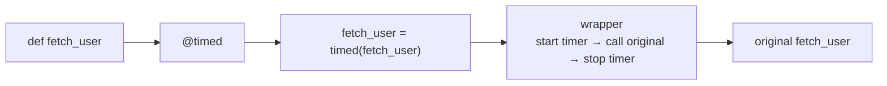

# Decorators

> **Interview answer (say this first).** A decorator is a function that takes another function and returns a replacement for it, so you can add behaviour around it without editing its body. The `@decorator` syntax is shorthand for `function = decorator(function)`.

## Why this exists

Some logic is needed in many places but does not belong to any one function. Timing, logging, caching, retrying, and permission checks are the usual examples.

Written by hand, it looks like this:

```python
def fetch_user(user_id):
    start = time.perf_counter()
    result = do_fetch_user(user_id)
    log.info("fetch_user took %.3fs", time.perf_counter() - start)
    return result

def fetch_orders(user_id):
    start = time.perf_counter()
    result = do_fetch_orders(user_id)
    log.info("fetch_orders took %.3fs", time.perf_counter() - start)
    return result
```

The interesting line is buried in identical padding. Copy this across fifty functions and three things go wrong:

- **Repetition.** The padding is duplicated, so a change to the log format means fifty edits.
- **Noise.** Readers must skip the padding to find the real logic.
- **Drift.** Someone forgets the timer in one function, and that timing data is silently missing.

This is called a **cross-cutting concern**: behaviour that cuts across many functions. A decorator lets you write it once and attach it.

```python
@timed
def fetch_user(user_id): ...

@timed
def fetch_orders(user_id): ...
```

Same behaviour, no repetition, and the intent is visible at a glance. This is exactly how frameworks are built: `@app.get("/users")` in FastAPI, `@lru_cache` in the standard library, `@pytest.fixture`, `@field_validator` in Pydantic, and `@retry` in resilience libraries are all decorators.

## Start from zero

**In Python, functions are objects.** A function is a value like any other: you can store it, pass it to another function, and return it.

```python
def shout(text):
    return text.upper()

say = shout          # say and shout point at the same function
say("hi")            # 'HI'
```

**Higher-order function.** A function that takes a function as an argument, returns one, or both. `sorted(items, key=len)` is a higher-order function: `len` is passed in.

**Closure.** An inner function can remember variables from the function that created it, even after that outer function has returned.

```python
def make_adder(n):
    def add(x):
        return x + n        # remembers n
    return add

add_five = make_adder(5)
add_five(10)                # 15
```

This is the mechanism decorators rely on: the wrapper remembers the original function.

**`*args` and `**kwargs`.** These collect extra arguments so a wrapper can accept anything and pass it through untouched. `*args` gathers positional arguments into a tuple; `**kwargs` gathers keyword arguments into a dictionary.

```python
def forward(*args, **kwargs):
    return target(*args, **kwargs)
```

**`functools.wraps`.** A helper that copies the original function's metadata — its name, docstring, and signature hints — onto the wrapper. Without it, the decorated function looks like the wrapper.

**Callable.** Anything that can be called with parentheses: a function, a method, a class, or an object with a `__call__` method.

## The core idea

Think of **gift wrapping**. The gift inside does not change. You wrap it so that the outside can do something extra — carry a card, look pretty, get inspected — and the recipient still receives the same gift. The wrapping is around the gift, not part of it.

A decorator wraps a function the same way:

> **`@decorator` is pure syntax for `function = decorator(function)`.**

That single line explains almost everything. The decorator receives the original function, and whatever it returns *becomes* the new value of that name. Usually it returns a wrapper that calls the original.



The name `fetch_user` now points at the wrapper. The original still exists, but only the wrapper holds a reference to it.

## How it works

1. **Python evaluates the decorator** — the name (and any arguments) after the `@` — before the function is bound.
2. **It calls the decorator with the function** as its argument.
3. **The decorator returns a value**, usually a new inner function. That value is bound to the original name.
4. **Stacked decorators apply bottom-up.** The decorator closest to `def` runs first, so it is the innermost wrapper. Execution then flows from the outermost wrapper inward.
5. **Calling the name calls the wrapper.** The wrapper runs its "before" code, calls the original with the forwarded arguments, then runs its "after" code.
6. **`functools.wraps` copies the metadata** so the wrapped function still reports the original `__name__`, `__doc__`, and signature. It also sets `__wrapped__`, pointing back to the original.
7. **A decorator with arguments needs one extra layer.** `@repeat(3)` first calls `repeat(3)`, which returns the actual decorator. That returned function is then applied to the function.

> **Note:**
>
> **The order rule, stated precisely.** For
>
> ```python
> @first
> @second
> def target(): ...
> ```
>
> the code is `target = first(second(target))`. So `second` wraps `target` first, and `first` wraps the result. At call time, `first`'s before-code runs first, then `second`'s, then the target. On the way out, it unwinds in reverse.


## The syntax you will use

**A basic decorator.** Always forward arguments with `*args, **kwargs` and always return the original result.

```python
import functools

def logged(fn):
    @functools.wraps(fn)
    def wrapper(*args, **kwargs):
        print(f"calling {fn.__name__}")
        return fn(*args, **kwargs)
    return wrapper

@logged
def add(a, b):
    return a + b

add(1, 2)     # prints "calling add", returns 3
```

**`functools.wraps` in every decorator you write.** It is not optional; it keeps the function's identity intact.

```python
# without wraps
print(logged(add_without).__name__)   # 'wrapper'  — wrong
# with wraps
print(add.__name__)                    # 'add'
```

**A decorator with arguments.** Add one layer so the arguments can be captured.

```python
def repeat(times):
    def decorator(fn):
        @functools.wraps(fn)
        def wrapper(*args, **kwargs):
            return [fn(*args, **kwargs) for _ in range(times)]
        return wrapper
    return decorator

@repeat(3)
def ping():
    return "pong"

ping()    # ['pong', 'pong', 'pong']
```

**A class-based decorator.** Any object with a `__call__` method can act as a decorator, which is handy when the decorator needs to keep state.

```python
class CountCalls:
    def __init__(self, fn):
        functools.update_wrapper(self, fn)
        self.fn = fn
        self.calls = 0

    def __call__(self, *args, **kwargs):
        self.calls += 1
        return self.fn(*args, **kwargs)

@CountCalls
def add(a, b):
    return a + b

add(1, 2)
add(3, 4)
add.calls      # 2
```

**Stacking decorators.** Order matters; reason about it as nested calls.

```python
@require_admin
@cached
def get_report(): ...
```

`cached` wraps the function, then `require_admin` wraps that. So the permission check runs first, and only authorised calls reach the cache. Swap them, and you would cache before checking permission — a security bug.

**Decorating methods.** Nothing special is needed; `self` arrives inside `*args` like any other positional argument.

```python
class Service:
    @logged
    def run(self, job_id):
        return job_id

Service().run(5)   # self is forwarded automatically
```

**Decorating async functions.** The wrapper must be `async` and must `await` the original. A plain function wrapper would return a coroutine object instead of running it.

```python
def traced(fn):
    @functools.wraps(fn)
    async def wrapper(*args, **kwargs):
        print(f"start {fn.__name__}")
        result = await fn(*args, **kwargs)
        print(f"end {fn.__name__}")
        return result
    return wrapper
```

**Preserving the signature for type checkers.** `functools.wraps` fixes runtime metadata; `ParamSpec` preserves the *types* so checkers and frameworks see the real signature.

```python
from typing import Callable, ParamSpec, TypeVar

P = ParamSpec("P")
R = TypeVar("R")

def traced(fn: Callable[P, R]) -> Callable[P, R]:
    @functools.wraps(fn)
    def wrapper(*args: P.args, **kwargs: P.kwargs) -> R:
        return fn(*args, **kwargs)
    return wrapper
```

**Standard-library decorators worth knowing.** You rarely need to invent these:

| Decorator | Purpose |
| --- | --- |
| `@functools.lru_cache` / `@functools.cache` | remember results to avoid recomputation |
| `@functools.wraps` | copy metadata onto a wrapper |
| `@property` | expose a method as an attribute |
| `@staticmethod` / `@classmethod` | change how a method receives its first argument |
| `@dataclass` | generate boilerplate (from the previous topic) |
| `@app.get(...)` (FastAPI) | register a function as a route handler |
| `@pytest.fixture` | mark a function as a test fixture |
| `@field_validator` (Pydantic) | register a validation rule |

## Examples: simple to real

**Example 1 — timing, the classic.**

```python
import functools, time

def timed(fn):
    @functools.wraps(fn)
    def wrapper(*args, **kwargs):
        start = time.perf_counter()
        try:
            return fn(*args, **kwargs)
        finally:
            elapsed = time.perf_counter() - start
            print(f"{fn.__name__}: {elapsed:.4f}s")
    return wrapper
```

Note the `try/finally`. The timer must stop even if the function raises, which is exactly the kind of detail hand-written timing code forgets.

**Example 2 — retry with arguments and backoff.**

```python
def retry(attempts: int = 3, delay: float = 0.5):
    def decorator(fn):
        @functools.wraps(fn)
        def wrapper(*args, **kwargs):
            last = None
            for attempt in range(1, attempts + 1):
                try:
                    return fn(*args, **kwargs)
                except Exception as exc:
                    last = exc
                    time.sleep(delay * attempt)
            raise last
        return wrapper
    return decorator

@retry(attempts=4, delay=0.2)
def call_flaky_api(): ...
```

In production you would use a library such as `tenacity`, which adds jitter, limits, and exception filtering. This is the shape it generates.

**Example 3 — authentication and authorisation.**

```python
def require_role(role: str):
    def decorator(fn):
        @functools.wraps(fn)
        def wrapper(*args, **kwargs):
            user = get_current_user()          # usually from request context
            if role not in user.roles:
                raise PermissionError(f"{role} required")
            return fn(*args, **kwargs)
        return wrapper
    return decorator

@require_role("admin")
def delete_account(account_id: int): ...
```

The check is declared next to the operation it protects, which makes audits far easier than hunting for a stray `if` inside the body.

**Example 4 — memoisation with `lru_cache`.**

```python
@functools.lru_cache(maxsize=1000)
def embedding_dim(model: str) -> int:
    ...
```

The arguments must be **hashable**, and the cache holds results in memory. Passing a list raises `TypeError`. `maxsize=None` means unbounded, which is a memory leak waiting to happen for a long-running service.

**Example 5 — an async decorator.**

```python
def with_logging(fn):
    @functools.wraps(fn)
    async def wrapper(*args, **kwargs):
        print(f"-> {fn.__name__}")
        try:
            return await fn(*args, **kwargs)
        finally:
            print(f"<- {fn.__name__}")
    return wrapper
```

Apply this to `async def` functions only. A sync wrapper around a coroutine returns the coroutine without running it, and you get a `coroutine was never awaited` warning.

## In production

- **Always use `functools.wraps`.** Frameworks inspect `__name__`, `__doc__`, and `__wrapped__`. FastAPI, for example, reads the signature to decide request parameters; a wrapper that hides the signature can break routing or documentation.
- **Forward `*args, **kwargs` and return the result.** A decorator that forgets to return silently turns every function into `None`. A decorator that drops `**kwargs` breaks keyword calls.
- **Use `try/finally` for cleanup work.** Timing, locks, spans, and context teardown must run even when the decorated function raises.
- **Know that decorators cost a call.** A wrapper adds a function-call frame. That is negligible for an HTTP handler and noticeable in a tight numeric loop. Measure before optimising.
- **`lru_cache` requires hashable arguments and holds memory.** Never cache on mutable or unhashable inputs, and always set a `maxsize` unless you truly want unbounded growth. It caches only successful results: if the function raises, nothing is stored, and the next call runs it again.
- **Order is behaviour.** Stacking a cache outside a permission check caches unauthorised attempts; stacking a tracer outside a retry inflates the measured time. State the intended order and reason about it.
- **Beware shared state in closures.** A decorator with a counter increments a value shared by all decorated functions created together, and is not thread-safe. For stateful decorators, prefer a class-based decorator and guard mutable state.
- **Prefer the standard library or a maintained package.** `functools`, `tenacity`, FastAPI, and Pydantic already solve the common cases. Hand-rolled retry and cache logic is where subtle bugs live.
- **Keep decorators honest.** If the added behaviour is complex, a decorator hides control flow. A plain function call can be clearer than a clever wrapper.

## Interview questions

### 1. What is a decorator, and what does the `@` syntax actually do?

**Answer.** A decorator is a callable that takes a function (or class) and returns a replacement. `@decorator` above `def f()` is exactly `f = decorator(f)`. It is syntax, not special machinery: understanding that line is understanding decorators.

**Follow-up: "Does the original function still exist?"** Yes. The decorator usually captures it in a closure, so the returned wrapper can call it. The original name now refers to the wrapper, not the original.

**Trap.** Describing decorators as "modifying the function." They do not change the function object; they replace the name with a new object that wraps it.

### 2. Why is `functools.wraps` important?

**Answer.** It copies the wrapped function's metadata — `__name__`, `__doc__`, `__module__`, `__annotations__` — onto the wrapper and sets `__wrapped__` back to the original. Without it, the decorated function reports the wrapper's name and docstring, which breaks introspection, logging, debuggers, and frameworks that read signatures.

**Follow-up: "Does `functools.wraps` change the runtime signature?"** It sets `__wrapped__` and copies metadata, and `inspect.signature` follows `__wrapped__` to report the original signature. For static checkers, pair it with `ParamSpec` so the types are preserved too.

**Trap.** Thinking metadata is cosmetic. In a framework like FastAPI, the signature drives request parsing and generated documentation, so losing it is a real bug.

### 3. How do you write a decorator that takes arguments?

**Answer.** Add one more layer. `@repeat(3)` calls `repeat(3)` first, and the function it returns is the actual decorator that receives the function.

```python
def repeat(times):          # receives the argument
    def decorator(fn):      # receives the function
        @functools.wraps(fn)
        def wrapper(*a, **k):
            return [fn(*a, **k) for _ in range(times)]
        return wrapper
    return decorator
```

**Follow-up: "Why can't you skip a layer?"** Because `@repeat(3)` evaluates `repeat(3)` immediately and expects the result to be callable with the function. Without the extra layer, `fn` would receive `3`.

**Trap.** Forgetting `functools.wraps` in the inner wrapper, which reintroduces the identity problem at exactly the point where it matters most.

### 4. If you stack decorators, in what order do they run?

**Answer.** They are applied bottom-up and executed top-down. `@first` above `@second` means `target = first(second(target))`: `second` wraps the function first, then `first` wraps that. At call time, `first`'s before-code runs first, then `second`'s, and the unwinding is reversed.

**Follow-up: "Give an example where order is a bug."** Caching outside a permission check: the unauthorised request is cached before it is rejected. Or logging outside a retry, which records one slow call instead of several attempts.

**Trap.** Assuming the topmost decorator runs closest to the function. It is the outermost wrapper, so it runs first on the way in and last on the way out.

### 5. How do decorators behave on methods and on async functions?

**Answer.** On methods, `self` arrives inside `*args`, so a well-written decorator forwards it automatically. On async functions, the wrapper must itself be `async` and must `await` the original; otherwise it returns a coroutine object that never runs.

**Follow-up: "What warning appears if you get the async case wrong?"** "coroutine was never awaited" — a `RuntimeWarning`, and the function's body never executes.

**Trap.** Using one decorator for both sync and async functions. The wrapper has to be written for the kind of function it wraps, or it must detect and delegate correctly.

### 6. How does `lru_cache` work, and what are its limits?

**Answer.** It stores results in a dictionary keyed by the function's arguments, returning the cached value when the same arguments appear again. `maxsize` limits how many results are kept, discarding the least recently used. Its limits: arguments must be hashable, results stay in memory, and it is not shared across processes.

**Follow-up: "When would `lru_cache` be wrong?"** For functions with side effects or time-dependent results, for unhashable arguments, or for anything unbounded in a long-running service. Also remember each worker process has its own cache.

**Trap.** Caching a function whose result depends on external state or time. It will keep serving a stale answer until the process restarts.

### 7. Can classes be decorated, or act as decorators?

**Answer.** Both. A decorator can wrap a class (dataclasses do exactly this, returning a modified class). And a class can be a decorator if its instances are callable via `__call__`, which is convenient when the decorator needs to hold state such as a counter or a cache.

**Follow-up: "Why use a class-based decorator?"** State and readability. `self` is a natural place for counters and configuration, and `__call__` is easier to read than nested closures.

**Trap.** Forgetting `functools.update_wrapper(self, fn)` in a class-based decorator, which loses the same metadata that `functools.wraps` preserves.

### 8. What is the performance cost of a decorator?

**Answer.** Each decorated call adds a wrapper call frame and the work the wrapper does. For an HTTP handler or a database call, the overhead is irrelevant compared with I/O. In a hot numeric loop, the extra frame can be measurable, and the real cost is usually whatever the wrapper itself does — logging, locking, or allocating.

**Follow-up: "How would you reduce it?"** Keep wrappers thin, avoid per-call allocations, and use caching where the work is repeated. If a decorator is in the hottest path, inline the behaviour or move it out of the loop.

**Trap.** Assuming decorators are free. They are cheap, not free, and a wrapper that logs on every call in a tight loop can dominate the runtime.

## Remember this

- `@decorator` is **`function = decorator(function)`**. Everything else follows from that.
- Always use **`functools.wraps`**, forward `*args/**kwargs`, and return the result.
- Decorators **stack bottom-up, run top-down**. Order is behaviour, so choose it deliberately.
- Use an **`async` wrapper for `async` functions**, or the coroutine never runs.
- **`lru_cache` needs hashable arguments** and its results live in memory, per process.
