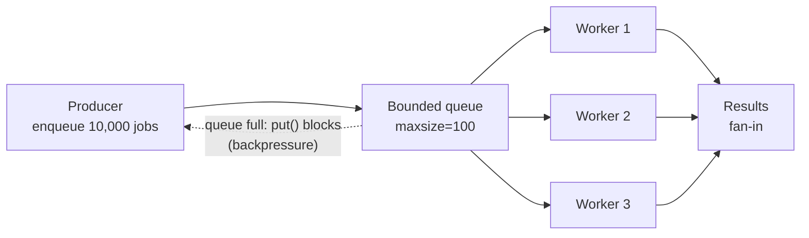

# Concurrency Patterns

> **Interview answer (say this first).** Concurrency means overlapping work, not "using threads". I choose the model from the workload: `asyncio` for many I/O waits, threads for blocking I/O in synchronous libraries, and processes for CPU-bound work. Then I **bound** the concurrency with a semaphore or a fixed worker pool, use a bounded queue for backpressure, add timeouts, and cancel or drain cleanly on shutdown.

## Why this exists

An agent usually does not run one slow thing. It runs many: a model call, three tool calls, a vector lookup, and a database read. Doing them one after another multiplies the latency.

```python
for query in queries:                # 10 queries, 1 second each
    answer = call_model(query)
# total: ~10 seconds, when the work could overlap
```

The naive fix is one task per item: `[asyncio.create_task(call_model(q)) for q in queries]`. That has two failure modes. First, memory: every task, coroutine, and response is held at the same time. Second, and worse, the **downstream** service is hit with thousands of simultaneous requests and starts rejecting or timing out. A retry storm then makes it worse.

The opposite mistake is just as common: putting CPU-bound work in a `ThreadPoolExecutor`. Threads do not give real parallelism for pure Python math, because of the **GIL**. This page is about choosing the right model, then controlling it so the system stays stable under load.

## Start from zero

| Word | Plain meaning |
| --- | --- |
| **Concurrency** | Making progress on several tasks by overlapping their waits. One worker can do it by switching. |
| **Parallelism** | Actually running several tasks at the same instant, on several CPU cores. |
| **I/O-bound** | Work that spends most time waiting on input/output: network, disk, database. The CPU is idle. |
| **CPU-bound** | Work that spends most time computing: parsing, hashing, numerical math. The CPU is busy. |
| **GIL** | The Global Interpreter Lock: a lock that lets only one thread run Python bytecode at a time. |
| **Thread** | A unit of execution inside one process. Threads share memory, so sharing data needs locks. |
| **Process** | A separate operating-system process with its own Python interpreter and its own memory. |
| **`asyncio`** | A library for concurrency on a single thread using an event loop and `async`/`await`. |
| **Event loop** | The scheduler that runs one coroutine at a time and switches when a coroutine `await`s. |
| **Coroutine** | A function defined with `async def`. Calling it returns a coroutine object, not a result. |
| **Task / Future** | A coroutine scheduled on the event loop (`asyncio.create_task`); a placeholder for a later value. |
| **Semaphore** | A counter that allows at most N holders at once. Used to bound concurrency. |
| **Queue** | A thread-safe or async-safe buffer between producers and consumers. |
| **Backpressure** | A way to slow down producers when consumers cannot keep up, instead of buffering forever. |
| **Producer / consumer, worker pool** | Producers enqueue work; a fixed number of workers pull it from a shared queue. |
| **Fan-out / fan-in** | Start many tasks (fan-out), then collect all their results (fan-in). |
| **Cancellation** | Asking a running task to stop at its next `await` point. |
| **Graceful shutdown** | Stop accepting work, finish or safely abandon in-flight work, then exit. |
| **Backoff / jitter** | Waiting longer after each retry, with a small random amount to avoid synchronized retries. |

Two distinctions matter most. **Concurrency vs parallelism**: concurrency is about structure (overlap waits), parallelism is about hardware (run at once). **Bounded vs unbounded**: bounded concurrency has a maximum number of in-flight operations; unbounded has none, and that is where outages come from.

## The core idea

Think of a restaurant kitchen. One cook doing everything in order is **sequential**. Many cooks, each with their own station, is **parallel**. One cook who puts a pot on the stove, and while it boils chops vegetables, is **concurrent** — the cook is never idle, but there is still only one cook.

The stove burners are a **semaphore**: even if 50 orders arrive, only 4 pots can be on the stove at once. Orders waiting on the counter are the **queue**. When the counter is full, the waiter stops taking orders: that is **backpressure**.

The first decision is always the model:

| Workload | Typical examples | Best model | Why |
| --- | --- | --- | --- |
| Many network waits | Model calls, HTTP tools, vector search | `asyncio` | Thousands of overlapping waits on one thread, small memory per task. |
| Blocking I/O in sync libraries | `requests`, `psycopg2`, file reads | Threads | The GIL is released during the blocking call, so threads overlap. |
| CPU-bound work | Embedding math, parsing, image work | Processes | Each process has its own interpreter, so real parallelism. |
| Mixed | Async service that also runs CPU work | `asyncio` + `to_thread` + process pool | Async for the waits, a thread or process for the blocking part. |
| Simple, low volume | A cron job with 3 calls | Sequential | Concurrency adds complexity that is not worth paying for. |

The second decision is always the bound:



A fixed number of workers plus a bounded queue caps three things at once: memory, downstream load, and the blast radius of a slow dependency. This is the pattern behind almost every production agent runner.

## How it works

1. **`asyncio` runs one coroutine at a time on one thread.** The event loop starts a coroutine, runs it until it hits `await`, and then parks it. If the awaited operation is not ready, the loop runs another coroutine. No two coroutines ever execute Python at the same instant.
2. **`await` is a yield point, not a thread switch.** It means "I am waiting; the loop may run someone else". If you never `await`, you block the whole loop.
3. **Threads overlap blocking calls because of the GIL's release rule.** Only one thread runs Python bytecode at a time, but the GIL is released during blocking I/O and many C extensions. So threads help I/O-bound code and do not help pure-Python CPU work.
4. **Processes give real parallelism by having separate interpreters.** Each process has its own GIL and memory. Arguments and results must be pickled and sent over a pipe, which costs time and rules out unpicklable objects.
5. **A semaphore bounds concurrency in async code.** `Semaphore(4)` allows four holders; a fifth `await sem.acquire()` waits until one is released. Wrap critical work in `async with sem:`.
6. **A fixed worker pool bounds concurrency with threads or processes.** `ThreadPoolExecutor(max_workers=4)` never runs more than four tasks at once; extra submitted work waits in an internal queue.
7. **A bounded queue creates backpressure.** `queue.Queue(maxsize=100)` makes `put()` block when full, so the producer's speed is tied to the consumer's speed. Without `maxsize`, the queue grows until memory runs out.
8. **Fan-out creates tasks; fan-in collects them.** `asyncio.gather` waits for all and returns results in input order. `as_completed` yields results in completion order.
9. **A timeout puts an upper bound on waiting.** `asyncio.timeout` and `Future.result(timeout=...)` raise `TimeoutError` if the work does not finish. Both are the built-in `TimeoutError` on 3.11+; before 3.11, `Future.result` raised `concurrent.futures.TimeoutError` instead.
10. **Cancellation is cooperative and happens at `await`.** `task.cancel()` schedules a `CancelledError` to be raised inside the task. Cleanup in a `finally` or `except CancelledError` runs, then the error is re-raised.
11. **Shutdown is ordered: stop intake, stop workers, drain, then close resources.** Hard-cancelling immediately can lose work that was in flight; a drain gives it a chance to finish.
12. **Retries are concurrency too.** Retrying inside each task is easy, but a thousand tasks retrying at the same moment creates a second traffic spike. Add exponential backoff with jitter, and only retry transient errors.

> **Tip:**
>
> **The one rule.** Unbounded concurrency is a denial-of-service attack you run against yourself. Every fan-out needs a bound, and every blocking wait needs a timeout.


## The syntax you will use

**Thread pool: the context manager waits for all tasks.**

```python
from concurrent.futures import ThreadPoolExecutor

with ThreadPoolExecutor(max_workers=4) as pool:      # named after the work
    results = list(pool.map(fetch, urls))            # results in input order
```

**Thread pool: submit and collect by completion.**

```python
from concurrent.futures import ThreadPoolExecutor, as_completed

with ThreadPoolExecutor(max_workers=4) as pool:
    futures = {pool.submit(fetch, url): url for url in urls}
    for future in as_completed(futures):
        url, value = futures[future], future.result()
```

**Timeout, cancel, and shut down.**

```python
future = pool.submit(slow_call)
try:
    value = future.result(timeout=2)               # raises TimeoutError
except TimeoutError:
    future.cancel()                                # only if it has not started

pool.shutdown(wait=True, cancel_futures=True)      # Python 3.9+
```

**Process pool: needs a module-level function and a main guard.**

```python
from concurrent.futures import ProcessPoolExecutor

def heavy(n: int) -> int: ...

if __name__ == "__main__":                          # required on spawn platforms
    with ProcessPoolExecutor() as pool:             # default: os.process_cpu_count() workers
        totals = list(pool.map(heavy, jobs))
```

**Async: fan-out and fan-in.**

```python
results = await asyncio.gather(*(call(q) for q in queries))                 # raises on first error
results = await asyncio.gather(*aws, return_exceptions=True)             # collect errors too
```

**Async: bound the concurrency with a semaphore.**

```python
sem = asyncio.Semaphore(4)

async def bounded(item):
    async with sem:                 # at most 4 of these run at once
        return await call_model(item)
```

**Async: a timeout, and structured concurrency with `TaskGroup`.**

```python
try:
    async with asyncio.timeout(2.0):          # Python 3.11+
        return await call_model(prompt)
except TimeoutError:
    return "timed out"

async with asyncio.TaskGroup() as tg:         # waits for all before exiting
    for item in items:
        tg.create_task(handle(item))          # a failure cancels the siblings
```

**Producer / consumer with a bounded thread queue.**

```python
import queue

work: queue.Queue = queue.Queue(maxsize=100)

def worker():
    while True:
        item = work.get()
        try:
            if item is None:        # sentinel: shut down this worker
                return
            process(item)
        finally:
            work.task_done()        # must run even for the sentinel
```

`queue.Queue` pairs `task_done()` with `join()`, and the sentinel tells an idle worker to stop. `asyncio.Queue(maxsize=100)` is the same idea: `await q.put(item)` blocks when full, and `q.task_done()` pairs with `await q.join()`.

**Move blocking code off the event loop.**

```python
value = await asyncio.to_thread(blocking_read, path)         # Python 3.9+
value = await loop.run_in_executor(process_pool, heavy, arg) # CPU work
```

**Cancellation with a required cleanup.**

```python
task = asyncio.create_task(worker())
task.cancel()
try:
    await task
except asyncio.CancelledError:
    raise                     # never swallow it
```

## Examples: simple to real

**Example 1 — the model matters: threads for I/O, processes for CPU.**

```python
def io_task(_):
    time.sleep(0.2)           # stands in for a network wait
    return "done"

def cpu_work(n):
    total = 0
    for i in range(n):
        total += i * i
    return total
```

Measured on a 10-core machine:

| Work | Serial | 4 threads | 4 processes |
| --- | --- | --- | --- |
| 4 I/O tasks (0.2 s each) | 0.81 s | **0.21 s** | overkill |
| 4 CPU jobs | 1.50 s | 1.53 s | **0.48 s** |

Threads win for I/O because the GIL is released during blocking calls. Threads do not help CPU work because the Python math is serialized; processes win because each has its own interpreter. Process pools also have startup cost and need picklable inputs, so for short jobs the overhead can exceed the gain.

**Example 2 — bound async concurrency with a semaphore.**

```python
sem = asyncio.Semaphore(4)

async def call(name):
    async with sem:
        await asyncio.sleep(0.1)
        return f"ok:{name}"

await asyncio.gather(*(call(n) for n in "abcdefgh"))
```

Eight calls at 0.1 s each with a limit of four finish in **0.20 s** (two waves), not 0.8 s (serial) and not an uncontrolled burst of eight.

**Example 3 — a bounded producer/consumer with backpressure.**

```python
import queue, threading, time

work: queue.Queue = queue.Queue(maxsize=5)
seen: list[int] = []

def producer():
    for i in range(20):
        work.put(i)          # blocks once 5 items are queued
    work.put(None)           # sentinel: one worker, one sentinel

def worker():
    while True:
        item = work.get()
        try:
            if item is None:
                return
            seen.append(item)
            time.sleep(0.001)
        finally:
            work.task_done()

t = threading.Thread(target=worker, daemon=True)
t.start()
producer()
work.join()                  # waits until every item has task_done()
t.join(timeout=2)
```

This consumes all 20 items and ends with an empty queue. Remove `maxsize`, and the producer fills memory with all 20 instantly instead of pacing itself.

**Example 4 — fan-out/fan-in with partial failure.**

```python
import asyncio

async def tool_a(): await asyncio.sleep(0.10); return "tool_a"
async def tool_b(): await asyncio.sleep(0.05); return "tool_b"
async def tool_c(): await asyncio.sleep(0.15); return "tool_c"
async def bad():    await asyncio.sleep(0.02); raise ValueError("boom")

async def gather_all():
    return await asyncio.gather(tool_a(), bad(), tool_c(), return_exceptions=True)

# ['str', 'ValueError', 'str'] — one failure does not lose the other results
```

Without `return_exceptions=True`, the first exception is raised immediately, and **the other tasks keep running uncancelled**. That is why an agent that gathers tool results usually wants `return_exceptions=True` and then decides per result.

**Example 5 — the real pattern: a bounded tool-call pool with timeout and retry.**

```python
import asyncio
from dataclasses import dataclass

@dataclass
class ToolCall:
    name: str
    latency: float = 0.01
    fail_times: int = 0

async def run_tool(call: ToolCall, attempts: int = 3, sem: asyncio.Semaphore | None = None) -> str:
    async with (sem or asyncio.Semaphore(1000)):
        for attempt in range(1, attempts + 1):
            try:
                async with asyncio.timeout(0.2):
                    await asyncio.sleep(call.latency)
                    if attempt <= call.fail_times:
                        raise ConnectionError("transient")
                    return f"{call.name}:ok(attempt={attempt})"
            except (TimeoutError, ConnectionError):
                if attempt == attempts:
                    raise
                await asyncio.sleep(0.01 * attempt)     # backoff, plus jitter in real code

async def run_all(calls, limit=2):
    sem = asyncio.Semaphore(limit)                      # bound applies to every attempt
    results = await asyncio.gather(*(run_tool(c, sem=sem) for c in calls), return_exceptions=True)
    return {c.name: r if isinstance(r, str) else f"FAILED:{type(r).__name__}"
            for c, r in zip(calls, results)}

calls = [
    ToolCall("search", fail_times=1),      # succeeds on attempt 2
    ToolCall("database"),                  # succeeds on attempt 1
    ToolCall("flaky", fail_times=2),       # succeeds on attempt 3
    ToolCall("slow", latency=5.0),         # always exceeds 0.2s -> fails
]
# {'search': 'search:ok(attempt=2)', 'database': 'database:ok(attempt=1)',
#  'flaky': 'flaky:ok(attempt=3)', 'slow': 'FAILED:TimeoutError'}
```

This one snippet contains most of the page: a bound (`Semaphore`), a timeout (`asyncio.timeout`), selective retries, backoff, and fan-in that tolerates partial failure. In a real agent, the retried call must be idempotent, or a timeout after the server did the work will duplicate the side effect.

**Example 6 — unbounded task creation is a memory bug.**

Running 50,000 tiny tasks two ways, measured with `tracemalloc`:

| Approach | Peak traced memory |
| --- | --- |
| `create_task` for all 50,000, then `gather` | 59.7 MB |
| 20 workers pulling from a shared queue | 2.0 MB |

The work is identical. Only the bounded version is safe to run at scale.

## In production

- **Match the model to the bottleneck.** `asyncio` for network waits, threads for blocking I/O in sync libraries, processes for CPU. Choosing wrong gives either no speedup (threads for CPU) or blocked loops (sync calls inside async).
- **Know the default pool sizes.** `ThreadPoolExecutor` defaults to `min(32, N + 4)`; on a 10-core machine that is 14. `ProcessPoolExecutor` defaults to `N`, where `N` is the CPU count available to the process. Since Python 3.13, `N` is `os.process_cpu_count()`, not `os.cpu_count()`. Set them explicitly for anything that talks to a rate-limited downstream.
- **Process pools need a `__main__` guard on spawn platforms.** macOS and Windows use `spawn`, which re-imports your module in every child. Without `if __name__ == "__main__":`, top-level benchmark code runs again in each child, and you can spawn processes recursively.
- **Only picklable work can cross a process boundary.** A submitted `lambda` or a local closure fails with `PicklingError`. Use module-level functions.
- **Never call blocking code directly in a coroutine.** `requests.get`, `time.sleep`, or a blocking DB driver stalls the whole event loop. Wrap them with `asyncio.to_thread` or `run_in_executor`.
- **Bound every fan-out, and add backpressure.** A semaphore or fixed worker pool caps in-flight work; a bounded queue makes producers wait instead of growing memory. Unbounded `create_task` across many requests exhausts memory and hammers the downstream — the classic cause of a retry storm.
- **Timeouts must cover the whole wait, not just the last step.** A queued task can sit waiting for a slot before its own work starts. Budget the queue wait and the execution separately, or bound the total.
- **`asyncio.CancelledError` is a `BaseException`, not an `Exception`.** A plain `except Exception` will not catch it, which is correct. Never swallow it: run cleanup, then re-raise. Swallowing it makes shutdown hang or lose tasks.
- **Cancellation can lose in-flight work.** In a verified test, three workers were cancelled mid-item and three dequeued items were never processed. For work you cannot lose, stop intake, let workers drain, then cancel. `ThreadPoolExecutor.__exit__` waits for every queued task; for a fast shutdown use `shutdown(wait=True, cancel_futures=True)`, and remember a future can only be cancelled before it starts.
- **`queue.Queue.task_done()` must run in `finally`, including for the sentinel.** Forget it once and `queue.join()` hangs forever. One sentinel per worker, or the remaining workers block on `get()`.
- **Retries need backoff, jitter, and a retry policy.** Retry only transient failures (`TimeoutError`, `ConnectionError`, 429/503), cap attempts, and make the retried operation idempotent. Retrying a `ValueError` wastes time and never helps.
- **Threads are not process-isolated.** Shared mutable state needs a `threading.Lock`; queues are already thread-safe. Async code is single-threaded, so a semaphore is enough — but do not touch an `asyncio.Semaphore` from another thread.

## Interview questions

### 1. When do you use `asyncio`, threads, and processes?

**Answer.** `asyncio` for many concurrent I/O waits on one thread — model calls, HTTP tools, vector lookups. Threads when the blocking I/O is in a synchronous library that cannot be made async, because the GIL is released during blocking calls. Processes for CPU-bound work, because each process has its own interpreter and therefore real parallelism. A mixed service uses async at the top, `to_thread` for blocking library calls, and a process pool for heavy CPU.

**Follow-up: "Can you use `asyncio` and threads together?"** Yes, and you often must. `await asyncio.to_thread(fn, arg)` runs the blocking function in the default thread pool and returns its result to the event loop. The loop stays responsive while the thread blocks.

**Trap.** Saying "async is faster than threads". `asyncio` is not faster per operation; it is more scalable for many waits because each task is cheap. For a single blocking call it is no faster, and for CPU work it is worse.

### 2. What is the GIL, and when do threads actually help?

**Answer.** The Global Interpreter Lock lets only one thread execute Python bytecode at a time. It is released during blocking I/O and inside many C extensions. So threads help I/O-bound work, because the waiting overlaps, and they do not help pure-Python CPU work, because the math is serialized. In a verified test, four CPU jobs took 1.50 s serial, 1.53 s with four threads, and 0.48 s with four processes.

**Follow-up: "Is the GIL going away?"** Python 3.13 introduced an optional free-threaded build, and free-threading has continued to mature, but the default build still has the GIL. Treat the GIL as present unless you explicitly run a free-threaded interpreter.

**Trap.** Claiming the GIL makes threads useless. They are the standard tool for blocking I/O in synchronous libraries such as `requests` or `psycopg2`, where the GIL is not held during the wait.

### 3. How do you bound concurrency?

**Answer.** For async code, an `asyncio.Semaphore(n)` wrapped around the work, so at most `n` operations are in flight. For threads and processes, a fixed-size executor, whose internal queue holds the rest. For pipelines, a bounded queue plus a fixed number of workers. The bound should be chosen from the downstream's capacity and your memory budget, not from the number of input items.

**Follow-up: "Where should the semaphore live?"** Scope decides. A per-request semaphore bounds one request; a module-level or per-host semaphore bounds the whole process. For a shared model endpoint, use one global bound so concurrent requests cannot exceed the provider's limit together.

**Trap.** Creating the semaphore inside a function called once per item, which gives every item its own limit of `n` and bounds nothing. The semaphore must be shared by the work it is meant to limit.

### 4. What is backpressure, and how do you implement it?

**Answer.** Backpressure is a signal that slows producers when consumers fall behind. Without it, the queue absorbs the difference and memory grows until the process dies. The simplest implementation is a bounded queue: `queue.Queue(maxsize=100)` or `asyncio.Queue(maxsize=100)` makes `put()` block when full, so the producer cannot outrun the consumer. Other forms are rejecting with 429, dropping low-priority work, or shrinking a task batch.

**Follow-up: "What if blocking the producer is unacceptable?"** Then you must either drop work (with a metric), degrade quality (smaller batches), or scale consumers. Buffering without a limit is not a solution; it only moves the failure later and makes it larger.

**Trap.** Confusing a large buffer with capacity. A queue of 100,000 items is still a queue that will eventually overflow; it just fails further from the cause.

### 5. How do timeouts work, and what do they not cover?

**Answer.** `asyncio.timeout(seconds)` wraps a block and cancels it if it overruns, raising `TimeoutError`. `Future.result(timeout=...)` raises the same built-in `TimeoutError` on 3.11+; before 3.11 it raised `concurrent.futures.TimeoutError`. A timeout bounds waiting, not the side effect: if the server received the request and completed it after your timeout, the work still happened. So a timed-out write must be retryable or idempotent.

**Follow-up: "Does `asyncio.wait_for` clean up?"** Yes. `wait_for` cancels the inner coroutine when the deadline passes and raises `TimeoutError`, so cleanup handlers run. The coroutine must not suppress `CancelledError`, or the timeout cannot stop it.

**Trap.** Thinking a timeout frees the resource. A timed-out task is cancelled, but a leaked connection or an unclosed HTTP client can live on. Timeouts belong with cleanup, not instead of it.

### 6. How does cancellation work in `asyncio`?

**Answer.** `task.cancel()` schedules a `CancelledError` to be raised at the task's next `await`. The task can catch it to run cleanup, but it must re-raise; then `await task` raises `CancelledError` and `task.cancelled()` is `True`. Because `CancelledError` inherits from `BaseException`, `except Exception` does not catch it.

**Follow-up: "What happens to the other tasks when one is cancelled or fails?"** Nothing automatic. `gather` without `return_exceptions=True` raises the first error immediately but leaves the siblings running. `TaskGroup` is the structured alternative: a failure cancels the whole group before the block exits.

**Trap.** Writing `except Exception: pass` around an `await` in a worker. It looks harmless but hides `CancelledError`-adjacent bugs and, if you catch `BaseException`, makes shutdown impossible.

### 7. How do you shut down gracefully without losing work?

**Answer.** In order: stop accepting new work, signal workers to finish (sentinel or queue shutdown), wait for the queue to drain with `queue.join()` or `await q.join()`, cancel anything still running with a deadline, then close resources. In `asyncio`, register SIGTERM with `loop.add_signal_handler` so the container's stop signal triggers that sequence instead of an abrupt exit.

**Follow-up: "Why not just cancel everything?"** Cancellation lands wherever a task is currently awaiting, which can be mid-write. A verified producer/consumer test cancelled three workers and lost three dequeued items. Draining is for work you cannot lose; cancelling after a timeout is the fallback.

**Trap.** Relying on `ThreadPoolExecutor.__exit__` as a shutdown strategy. It waits for every queued task, which under load can take longer than the orchestrator's kill timeout, and then you are killed abruptly anyway.

### 8. Why is creating one task per item dangerous, and how do you fix it?

**Answer.** Because it is unbounded. Every task holds a coroutine, a stack frame, and its result until fan-in completes. A verified comparison of 50,000 tasks used 59.7 MB unbounded versus 2.0 MB with 20 workers on a queue. Worse, all 50,000 hit the downstream at once, causing timeouts, retries, and a feedback loop. Fix it with a semaphore or a fixed worker pool, and add a timeout and retry policy.

**Follow-up: "How do you choose the bound?"** From the downstream's safe rate and your memory budget, not from the batch size. Measure the provider's limit, then set the pool a little below it. Make the bound configurable so you can lower it during an incident.

**Trap.** Bounding task creation but not retries. If each task can retry, the effective concurrency is `bound × attempts` in the worst case. The semaphore should wrap the attempt, or the retry should be inside the slot, as in Example 5.

## Remember this

- **Pick the model from the workload:** async for I/O waits, threads for blocking I/O, processes for CPU.
- **Bound everything.** A semaphore or fixed worker pool caps memory and downstream load; unbounded tasks are an outage.
- **Bounded queues give backpressure;** an unbounded queue just delays the failure.
- **Timeouts bound waiting, not side effects.** Make retried work idempotent, and use backoff with jitter.
- **Shutdown is ordered:** stop intake, drain or cancel with a deadline, then close. Re-raise `CancelledError`.
