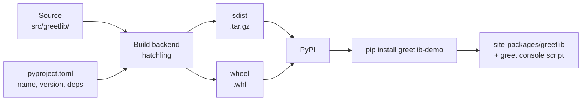

# Packaging and Virtual Environments

> **Interview answer (say this first).** A virtual environment is an isolated folder with its own Python interpreter and its own `site-packages`, so two projects can use different versions of the same library. Packaging turns source code into a distributable **wheel** or **sdist** described by `pyproject.toml`, which `pip` can install into any environment and expose as a console script.

## Why this exists

Python installs packages into one shared folder per interpreter, called `site-packages`. Without isolation, every project on the machine competes for that folder:

```text
Project A needs httpx==0.27
Project B needs httpx==0.28
# one machine, one site-packages -> one of them breaks
```

Even a single project drifts. "It works on my machine" usually means the machine has a package that was installed months ago and never recorded.

Modern systems now refuse to let you write to the shared folder at all:

```text
error: externally-managed-environment
× This environment is externally managed
```

That is **PEP 668**: the operating system marks its Python as externally managed, and `pip` refuses to install into it. The intended fix is a virtual environment per project.

The second half of the problem is shipping. A script that only works when run from its own folder is not a product. Packaging lets you build one artifact that installs the same way everywhere, with a real command name.

## Start from zero

| Word | Plain meaning |
| --- | --- |
| **Module** | A single `.py` file that can be imported, for example `utils.py`. |
| **Package** | A folder of modules that can be imported, normally with an `__init__.py`. |
| **Namespace package** | A folder without `__init__.py` that Python still imports. Useful, but subtle. |
| **Import name** | What you type after `import`, for example `greetlib`. |
| **Distribution** | The thing you publish and install, for example `greetlib-demo`. Its name can differ from the import name. |
| **`site-packages`** | The folder where installed distributions live. |
| **Virtual environment (venv)** | A folder with its own interpreter and its own `site-packages`. |
| **pip** | The standard tool that downloads and installs distributions into the active environment. |
| **PyPI** | The public Python Package Index, the default source pip installs from. |
| **sdist** | Source distribution: a `.tar.gz` archive of the source plus packaging metadata. |
| **wheel** | A built distribution: a `.whl` zip file that pip installs without running a build. |
| **`pyproject.toml`** | The standard file describing a project's metadata, dependencies, and build backend. |
| **Build backend** | The tool (`hatchling`, `setuptools`, `flit`) that turns your source into a wheel or sdist. |
| **Build frontend** | The command you run to invoke the backend, for example `uv build` or `python -m build`. |
| **Entry point** | A named hook declared in metadata. `console_scripts` creates a command-line command. |
| **`sys.path`** | The list of folders Python searches, in order, when you `import` something. |
| **Editable install** | Installing your project so imports point at your source folder, for development. |
| **PEP 668** | The rule that marks a system Python "externally managed" and blocks pip installs into it. |

The distinction people miss: a **module** and a **package** are about *importing*; a **distribution** is about *installing*. `pip install greetlib-demo` installs the distribution named `greetlib-demo`, which happens to provide the importable package named `greetlib`.

## The core idea

A virtual environment is a **separate kitchen per project**. Each kitchen has its own fridge (`site-packages`) and its own copy of the recipe book (the interpreter). Cooking in one kitchen cannot spill into another.

Packaging is a **sealed meal kit**. You write the recipe (`pyproject.toml`), the build backend follows it, and out comes either a recipe to cook later (`sdist`) or a ready meal (`wheel`). Both are uploaded to the shop (PyPI), and anyone can order the same meal.



A wheel unpacks into `site-packages` and adds a `.dist-info` folder with metadata. That metadata is what makes `importlib.metadata.version("greetlib-demo")` and the `greet` command work.

## How it works

1. **Python finds imports through `sys.path`, in order.** Built-in and frozen modules are checked first, then `sys.path` is searched in order: the directory of the running script (or the current working directory when using `-m`), then `PYTHONPATH`, then the standard library, then `site-packages`. The first match wins.
2. **A venv is just a folder with a marker file.** `python -m venv .venv` creates `.venv/bin/python` (a copy or symlink), a `.venv/lib/pythonX.Y/site-packages/`, and a `pyvenv.cfg`. The interpreter reads `pyvenv.cfg` to know it is inside a venv.
3. **Activation only edits shell variables.** `source .venv/bin/activate` puts `.venv/bin` first on `PATH` and sets `VIRTUAL_ENV`. It does not change what Python can see; the interpreter already knows from its own location.
4. **`pip` resolves, downloads, and unpacks.** It reads `pyproject.toml` or wheel metadata, chooses versions that satisfy the constraints, downloads a wheel (or builds one from an sdist), unpacks it into `site-packages`, and writes a `.dist-info` folder.
5. **`pyproject.toml` declares a build backend.** The `[build-system]` table names the backend and its own dependencies. The frontend creates an isolated build environment, installs them, and calls the backend.
6. **The backend produces an sdist and a wheel.** An sdist is the raw source plus metadata; it is what you rebuild from if no wheel fits the platform. A wheel is a zip whose tag (`py3-none-any`) says which Python and platform it supports.
7. **A wheel contains your packages plus a `.dist-info` folder.** The folder holds `METADATA` (name, version, dependencies), `WHEEL` (format and tag), `RECORD` (file hashes), and `entry_points.txt` if you declared commands.
8. **Entry points become executable scripts.** For `greet = "greetlib.cli:main"`, pip writes a small launcher to the environment's `bin/` folder that imports `greetlib.cli` and calls `main()`.
9. **Editable installs point at the source.** `pip install -e .` creates a link or a `.pth` file so imports resolve to your working copy; changes show up without reinstalling.
10. **Publishing is build, check, upload.** `twine check` validates the metadata, and `uv publish` or `twine upload` sends the artifacts to PyPI. Names on PyPI are first-come and permanent.

> **Warning:**
>
> **The trap that costs an afternoon.** Your distribution name and import name are different things, and build backends use heuristics to guess which folder to ship. A mismatch (`greetlib-demo` vs `greetlib`) makes the wheel build fail until you set `[tool.hatch.build.targets.wheel] packages = ["src/greetlib"]`.


## The syntax you will use

**Create, activate, and leave a venv.**

```bash
python -m venv .venv          # create it once
source .venv/bin/activate     # macOS/Linux
.venv\Scripts\activate        # Windows
deactivate
```

`uv venv` is a faster equivalent, and `uv run script.py` creates and uses `.venv` automatically.

**Always call pip through the interpreter for the project.** `python -m pip` guarantees you install into the same environment that will run the code.

```bash
python -m pip install -r requirements.txt
python -m pip install -e ".[dev]"      # editable, with the dev extra
```

**Declare the project in `pyproject.toml`.**

```toml
[build-system]
requires = ["hatchling"]
build-backend = "hatchling.build"

[project]
name = "greetlib-demo"          # the name on PyPI
version = "0.1.0"
requires-python = ">=3.11"
dependencies = ["httpx>=0.27"]

[project.optional-dependencies]
dev = ["pytest>=8"]

[project.scripts]
greet = "greetlib.cli:main"     # creates the `greet` command

[tool.hatch.build.targets.wheel]
packages = ["src/greetlib"]     # required when names differ
```

**Use a `src` layout so tests import the installed package, not a local folder.**

```text
greetlib-demo/
├── pyproject.toml
├── README.md
├── src/
│   └── greetlib/
│       ├── __init__.py
│       └── cli.py
└── tests/
    └── test_cli.py
```

**Build the artifacts.**

```bash
uv build                      # writes sdist and wheel into dist/
python -m build               # the same via the build frontend
ls dist/
# greetlib_demo-0.1.0-py3-none-any.whl
# greetlib_demo-0.1.0.tar.gz
```

**Inspect a wheel without installing it.**

```bash
python -c "import zipfile; print(zipfile.ZipFile('dist/greetlib_demo-0.1.0-py3-none-any.whl').namelist())"
```

**Run a module as a package member, not as a file.**

```bash
python -m greetlib.cli        # correct: uses the package context
python src/greetlib/cli.py    # fails on relative imports and on installed deps
```

**Read the installed version from metadata.** Never hard-code `__version__` in two places.

```python
from importlib.metadata import version
print(version("greetlib-demo"))          # '0.1.0'
```

**Check and publish.**

```bash
twine check dist/*            # validates README/metadata before upload
uv publish                    # uploads dist/* to PyPI
```

## Examples: simple to real

**Example 1 — module, regular package, and namespace package.**

```python
# onemodule.py                -> import onemodule   (a module)
# pkg/__init__.py + pkg/mod.py -> import pkg.mod      (a regular package)
# nspkg/mod.py (no __init__)   -> import nspkg.mod     (a namespace package)
```

A regular package has `__path__` as a plain list and a `__file__`. A namespace package has a `_NamespacePath` and no `__file__`. Namespace packages are how large projects split one import name across several distributions, but for a normal library add `__init__.py` and keep it simple.

**Example 2 — a venv changes `sys.prefix`, nothing else.**

```python
import sys
sys.prefix        # .../myproject/.venv     — where this interpreter lives
sys.base_prefix   # /opt/homebrew/.../3.14  — the interpreter it was built from
```

Inside a venv the two differ; outside one they are equal. `site-packages` is derived from `sys.prefix`, which is why each venv has its own installed packages. A fresh venv has `pip` but no project dependencies.

**Example 3 — `sys.path` order, and the shadowing bug.**

```python
# shadow/queue.py
print("LOCAL queue.py shadowed the stdlib!")
```

Running `python app.py` inside a folder that contains `queue.py` prints that message, and `import queue` resolves to the local file rather than the standard library. The script's own directory is on `sys.path` first. The same happens with `python -c` or `-m`, because the current directory is searched. Never name a file after a standard-library module.

**Example 4 — `python file.py` vs `python -m package.module`.**

```bash
$ python scripts/showpath.py
script sys.path[0]: '.../pathdemo/scripts'

$ python -m mypkg
python -m sys.path[0]: '.../pathdemo'
```

With a script, the script's folder is searched; with `-m`, the current directory is. This is why relative imports fail as a script:

```text
ImportError: attempted relative import with no known parent package
```

Run `python -m pkg.sub` and the relative import works, because Python knows the package it belongs to.

**Example 5 — build a real package and read its metadata.**

The wheel from the `pyproject.toml` above contains:

```text
greetlib/__init__.py
greetlib/cli.py
greetlib_demo-0.1.0.dist-info/METADATA
greetlib_demo-0.1.0.dist-info/WHEEL
greetlib_demo-0.1.0.dist-info/entry_points.txt
greetlib_demo-0.1.0.dist-info/RECORD
```

`METADATA` records what pip needs to resolve dependencies:

```text
Metadata-Version: 2.5
Name: greetlib-demo
Version: 0.1.0
Requires-Python: >=3.11
Requires-Dist: httpx>=0.27
Provides-Extra: dev
Requires-Dist: pytest>=8; extra == 'dev'
```

`entry_points.txt` is what creates the command:

```text
[console_scripts]
greet = greetlib.cli:main
```

**Example 6 — install the wheel into a clean venv and run the command.**

```bash
python -m venv venvtest
venvtest/bin/python -m pip install dist/greetlib_demo-0.1.0-py3-none-any.whl
venvtest/bin/greet
# Hello, world!
```

The import now resolves to the installed copy, not the source folder:

```text
greetlib.__file__ -> .../venvtest/lib/python3.14/site-packages/greetlib/__init__.py
```

An editable install points at the source instead, so a new attribute added to `__init__.py` is visible with no reinstall.

## In production

- **One virtual environment per project, never the system Python.** PEP 668 makes system installs fail on Homebrew and many Linux distributions, and even where it works it mixes versions across projects. Never commit `.venv/`: it is large and platform-specific, so rebuild it from the lockfile.
- **Prefer a `src/` layout.** With a flat layout, `import greetlib` in a test can silently pick up the source folder instead of the installed package, hiding packaging bugs until release.
- **Run code as a module or via an entry point, not as a file inside the package.** Script execution changes `sys.path` and breaks relative imports. `python -m package.module` is the reproducible form.
- **Ship console scripts instead of telling people to run a `.py` file.** An entry point works after `pip install`, gets a stable name, and does not depend on the current directory.
- **Set the wheel packages explicitly when the distribution and import names differ.** Build backends guess from the name; `hatchling` fails with "no directory that matches the name of your project" otherwise.
- **Keep `__init__.py` cheap.** Import-time side effects (network calls, logging setup) run for every importer and make tests slow. Re-export names, do not do work.
- **Do not rely on the current working directory for data files.** Use `importlib.resources` for files shipped inside a package; a relative path that works locally breaks once the package is installed.
- **Test the built artifact, not just the source tree.** Install the wheel into a clean venv in CI and run it. Editable installs can mask missing files, missing package data, and wrong entry points.
- **Declare non-Python files explicitly.** `pyproject.toml` does not ship arbitrary data by default; configure it, then verify the file is in the wheel.
- **Version from one place.** Either set `version` in `pyproject.toml` or mark it `dynamic` and read it from `__version__`. Two sources drift, and PyPI rejects a re-upload of an existing version.
- **Never publish to PyPI by accident.** Names are permanent, and uploads cannot be deleted. Use TestPyPI and a token with the narrowest scope; `twine check` catches broken README metadata first.
- **Guard `__main__` blocks.** Besides packaging hygiene, `if __name__ == "__main__":` matters for multiprocessing on macOS and Windows, where child processes re-import your module.

## Interview questions

### 1. Why do you use a virtual environment?

**Answer.** To isolate each project's dependencies. Without one, every project shares the interpreter's `site-packages`, so two projects needing different versions of the same library conflict, and installed packages are not recorded anywhere. A venv gives each project its own interpreter metadata and its own `site-packages`. Modern system Pythons also refuse writes entirely under PEP 668.

**Follow-up: "Does a venv copy the Python interpreter?"** Not fully. It creates a small `bin/python` (often a symlink or a launcher) and a `pyvenv.cfg` pointing at the base interpreter. The standard library is shared; only `site-packages` and the prefix are separate.

**Trap.** Committing `.venv/` to Git. It is platform-specific and large; the correct artifact to commit is the lockfile, and the environment is rebuilt from it.

### 2. What is the difference between a module, a package, and a distribution?

**Answer.** A module is one `.py` file. A package is a folder importable as a namespace, normally with `__init__.py`. A distribution is the installable artifact you publish, named in `pyproject.toml`, which may contain several packages. Installation deals in distributions; imports deal in modules and packages.

**Follow-up: "Can the names differ?"** Yes, and they often do. `pip install scikit-learn` provides the importable package `sklearn`. When they differ you must tell the build backend which package to ship.

**Trap.** Assuming `pip install greetlib` and `import greetlib` always refer to the same string. Check the distribution metadata if imports fail after a successful install.

### 3. What is the difference between a wheel and an sdist?

**Answer.** An sdist is a source archive (`.tar.gz`); pip may have to build it, which requires a compiler and build dependencies. A wheel (`.whl`) is a prebuilt zip with a compatibility tag, so pip can unpack it directly. Wheels install faster and more reliably; sdists exist for platforms and Python versions that have no wheel.

**Follow-up: "Why is `py3-none-any` a good wheel tag?"** It means pure Python, no platform-specific code: any Python 3 and any OS can install it. As soon as you add a C extension, the tag narrows and you must build per platform.

**Trap.** Publishing only an sdist for a package with native code, then discovering that users without a compiler cannot install it. Build wheels for the platforms you support.

### 4. What is `pyproject.toml`, and what is a build backend?

**Answer.** `pyproject.toml` is the standard project file. It declares metadata (`[project]`), dependencies, optional extras, entry points, and the `[build-system]` table that names the build backend and its requirements. The backend (hatchling, setuptools, flit) reads your source and produces the wheel and sdist; the frontend (`uv build`, `python -m build`) runs the backend in an isolated environment.

**Follow-up: "Why isolate the build environment?"** So the build uses the pinned build dependencies you declared, not whatever happens to be installed in your project. That is what makes a build reproducible on CI and on another machine.

**Trap.** Putting dependencies only in a `requirements.txt` and leaving `pyproject.toml`'s `dependencies` empty. Anyone installing your distribution gets no dependencies at all.

### 5. How do console scripts work?

**Answer.** You declare a dotted path under `[project.scripts]`, for example `greet = "greetlib.cli:main"`. The build backend writes it to `entry_points.txt` in the wheel metadata, and pip generates a launcher in the environment's `bin/` directory that imports the module and calls the function. The command is then available on `PATH` while the environment is active.

**Follow-up: "What does the launcher call?"** Exactly the named object, with no arguments. So `main` must read arguments itself (`argparse`, `click`) rather than expecting parameters.

**Trap.** Forgetting that the entry point runs in a fresh interpreter process, so module-level state is not shared with any running service. It is a CLI entry, not a hook into an existing process.

### 6. Why use a `src` layout?

**Answer.** With a `src/` directory, the importable package is not in the project root, so tests cannot import it by accident from the working directory; they must import the installed package. That makes tests exercise the same artifact users get, and it catches missing files or wrong package configuration before release. It also keeps the repository root clean.

**Follow-up: "Does it require an install?"** Yes, for tests to import the package you either install the project (editable is fine) or configure the test runner's path. The install is the point: it verifies the packaging.

**Trap.** Adding `src/` to `sys.path` in `conftest.py` to make imports work. That defeats the layout and reintroduces the shadowing problem.

### 7. How does Python decide which module to import, and what goes wrong?

**Answer.** Built-in and frozen modules are checked first, then `sys.path` is searched in order: the script's directory (or the working directory for `-m`), then `PYTHONPATH`, then the standard library, then `site-packages`. The first match wins. Problems come from the first entries: a file named `queue.py` shadows the standard library, a `src` layout prevents accidental local imports, and a stale editable install can point at an old source folder.

**Follow-up: "How do you see what is happening?"** Print `sys.path`, check `module.__file__` for the matching file, and use `python -X importtime` to see what is loaded and from where. `python -m site` shows the site directories.

**Trap.** Debugging an import error by reinstalling at random. The module may be resolving to an unexpected file; inspect the path before changing dependencies.

### 8. How do you version and publish a package?

**Answer.** Put a single version in `pyproject.toml`, or mark it `dynamic` and read it from `__version__` in one module. Build with `uv build` or `python -m build`, validate with `twine check`, and upload with `uv publish` or `twine upload`. Practice on TestPyPI first, because names and versions on PyPI are permanent and cannot be reused.

**Follow-up: "How do consumers read the version?"** `importlib.metadata.version("distribution-name")`. That reads the installed metadata, so it stays correct even when the code is installed as a wheel with no `__version__` variable.

**Trap.** Bumping the code's `__version__` but not the version in `pyproject.toml` (or the reverse). The uploaded artifact then lies about what it contains.

## Remember this

- **One venv per project.** Isolation prevents version conflicts and PEP 668 blocks system installs anyway.
- **A distribution is installed; a module or package is imported.** The names can differ.
- **`pyproject.toml` plus a build backend produces an sdist and a wheel;** the wheel is what installs quickly.
- **`sys.path` order explains import bugs.** A local file can shadow the standard library; prefer a `src` layout.
- **Test the built wheel in a clean venv, and version from one place.** Editable installs hide packaging mistakes.
