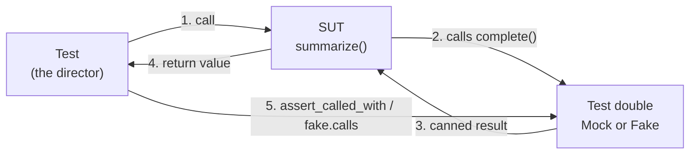

# Mocking

> **Interview answer (say this first).** A test double is a stand-in for a real dependency. `unittest.mock` gives you `Mock` and `MagicMock` to record calls and return canned values, and `patch` temporarily replaces a name in a module. Patch the object **where it is used**, prefer `autospec` to catch signature drift, and prefer a hand-written **fake** over a mock when you want a realistic, deterministic dependency.

## Why this exists

A unit test is supposed to check one piece of logic quickly and repeatably. Real dependencies make that hard.

Consider the smallest useful function in an AI service:

```python
def summarize(text: str) -> str:
    response = llm_client.complete(f"Summarize: {text}", model="small")
    return response.text.strip()
```

To test this for real you would need a network call, an API key, money, and luck. The result changes every time, so the test is slow, flaky, and expensive. Worse, when the test fails you cannot tell whether **your** logic broke or the model answered differently.

The same problem appears everywhere: a database write, a payment charge, the current time, a random number, an email send. Tests need those dependencies to be **fast, predictable, and under your control**.

Mocking is the set of techniques for replacing a real dependency with a stand-in. The stand-in does exactly what the test says, records what happened, and lets you assert on the interaction.

The danger is the opposite extreme. A test that mocks everything only proves that "the code calls the things I told it to call." It stops testing behaviour and starts testing your own assumptions. Good mocking is a scalpel, not a blanket.

## Start from zero

The literature uses five words for test doubles. They describe **what the stand-in does**, not which library you use.

| Word | Plain meaning | What it gives |
| --- | --- | --- |
| **Test double** | The general name for any stand-in object used in a test. | A replacement for a real dependency. |
| **Dummy** | An object passed only to satisfy a signature. It is never used. | Fills a slot. |
| **Stub** | Returns hard-coded answers. It does not record how it was called. | Controlled input. |
| **Spy** | Wraps the real object or records the calls made to it. | Observation of calls. |
| **Mock** | A stub plus recorded expectations. It is pre-programmed and can fail a test if calls do not match. | Controlled input plus verification. |
| **Fake** | A small working implementation with a shortcut, such as an in-memory database. | Realistic behaviour without the real cost. |

Other words used on this page:

| Word | Plain meaning |
| --- | --- |
| **System under test (SUT)** | The function or class the test is actually checking. |
| **Collaborator** | Any object the SUT talks to (client, repository, clock). |
| **Patch** | Temporarily replace an attribute or name with a double, then restore it. |
| **Spec** | A limit on which attributes a mock may have, copied from a real object. |
| **Autospec** | A spec plus a matching function signature, so wrong arguments fail. |
| **Dependency injection (DI)** | Passing a dependency into a function or class instead of creating it inside. |
| **Fixture** | Setup and teardown a test framework runs for you. |
| **Deterministic** | Same inputs always produce the same output. |

The key distinction: a **stub** answers, a **spy** watches, a **mock** does both and can fail the test. A **fake** is a real little object that happens to cut corners.

## The core idea

Think of a film stunt double. The actor is the real dependency — expensive, busy, and dangerous to use for every scene. The double is the same shape, does a controlled version of the action, and lets the director film the scene safely.

The director (your test) cares about two things:

1. Did the scene come out right? (the returned value)
2. Did the actor's lines get to the double correctly? (the recorded calls)



There are two ways to insert the double:

| Style | How the double arrives | Test cost |
| --- | --- | --- |
| **Patching** | The double is swapped in from outside with `patch`. The production code never changes. | Fast to add, couples the test to internal names. |
| **Dependency injection** | The dependency is a parameter. The test passes the double. | Slightly more code, much clearer and more robust. |

**Prefer injection when you control the code, and patch when you do not** (third-party imports, framework wiring, or code you cannot edit).

## How it works

1. **The test decides what to replace.** Usually a collaborator at a boundary: network, filesystem, clock, database, model API.
2. **A double is created.** `Mock()` makes an object that accepts any call, records it, and returns another `Mock` by default.
3. **The double is installed.** With `patch`, Python temporarily rebinds a module attribute and restores it when the block ends, even if the test raises.
4. **The SUT runs and calls the double.** Because the name lookup happens at call time, the SUT sees the double.
5. **`return_value` and `side_effect` control the answer.** `return_value` is what a call returns. `side_effect` can yield a sequence, call a function, or raise an exception.
6. **Calls are recorded.** `call_args`, `call_args_list`, `call_count`, and `method_calls` describe exactly what happened.
7. **The test asserts.** Assert on the returned value first (the behaviour), then on calls you genuinely care about (the contract).
8. **Cleanup runs.** `patch` restores the original object, so tests do not leak state into each other.

> **Tip:**
>
> **The shortcut.** A mock proves your code called something. A fake proves your code behaves correctly. Choose based on what the test is really about.


## The syntax you will use

**`Mock` and `MagicMock`.** `Mock` records calls. `MagicMock` is the same but also supports magic methods like `__len__`, `__iter__`, and `__enter__`.

```python
from unittest.mock import Mock, MagicMock

m = Mock()
m(1, key="v")
assert m.call_args.args == (1,)
assert m.call_args.kwargs == {"key": "v"}

mm = MagicMock()
mm.__len__.return_value = 3
assert len(mm) == 3          # plain Mock would raise TypeError here
```

**Return values and side effects.** Use `return_value` for a fixed answer, `side_effect` for sequences, real functions, or errors.

```python
m = Mock(return_value=42)
assert m() == 42

m = Mock(side_effect=[1, 2, 3])       # one value per call
assert [m(), m(), m()] == [1, 2, 3]

m = Mock(side_effect=TimeoutError("slow"))   # simulate failure
```

**Call assertions.** These read like the contract you expect.

```python
m = Mock()
m("prompt", model="small")
m.assert_called_once_with("prompt", model="small")
m.assert_any_call("prompt", model="small")
```

**`spec` and `spec_set`.** A spec stops typos from silently passing: the mock only exposes attributes the real object has.

```python
class LLMClient:
    def complete(self, prompt: str, *, model: str): ...

m = Mock(spec=LLMClient)
assert hasattr(m, "complete")
assert not hasattr(m, "compleet")     # typo is caught here
```

**`patch` as a context manager or decorator.** The context manager is the safest form; it restores the original when the block ends, even on failure.

```python
from unittest.mock import patch

with patch("app.service.complete", return_value="ok") as fake:
    assert use_complete() == "ok"

@patch("app.service.complete", return_value="ok")
def test_it(mock_complete):
    assert use_complete() == "ok"
```

**`patch.object` and `patch.dict`.** `patch.object` targets one attribute on an imported object. `patch.dict` swaps a whole mapping, often `os.environ`.

```python
with patch.object(LLMClient, "complete", return_value="ok"):
    ...

with patch.dict("os.environ", {"APP_MODE": "test"}):
    assert os.environ["APP_MODE"] == "test"
```

**`autospec` / `create_autospec`.** This is the safety belt. It copies the real signature so calling the mock the wrong way raises `TypeError` — exactly like the real function.

```python
from unittest.mock import create_autospec

fake = create_autospec(LLMClient)
fake.complete("p", model="m")     # fine

# patch(..., autospec=True) does the same for a patched name
with patch("app.service.LLMClient", autospec=True) as MockClient:
    ...
```

Beware: `Mock(autospec=func)` is **not** the API. That only sets an attribute named `autospec`. Use `create_autospec(func)` or `patch(..., autospec=True)`.

**`AsyncMock` for `async def`.** Awaiting a plain mock does not work; use `AsyncMock`.

```python
from unittest.mock import AsyncMock

async def test_it():
    m = AsyncMock(return_value="done")
    assert await m() == "done"
    m.assert_awaited_once_with()
```

**`monkeypatch`.** pytest's built-in fixture is often simpler than `patch` for small replacements, and it undoes everything automatically.

```python
def test_uses_fake(monkeypatch):
    monkeypatch.setattr("app.service.complete", lambda *a, **k: "ok")
    assert use_complete() == "ok"
```

## Examples: simple to real

**Example 1 — a dummy, a stub, and a spy.**

The three simplest doubles need no library at all.

```python
class DummyClock:
    def now(self):
        raise AssertionError("clock should not be used")

class StubClock:
    def now(self):
        return 0.0                     # always the same time

class SpyClock:
    def __init__(self):
        self.calls = 0
    def now(self):
        self.calls += 1
        return 0.0

spy = SpyClock()
assert spy.now() == 0.0 and spy.calls == 1
```

A dummy makes an accidental use fail loudly. A stub gives a fixed answer. A spy lets you assert that time was read exactly once.

**Example 2 — a mock, with call verification.**

```python
from unittest.mock import Mock

m = Mock()
m.complete.return_value = "summary"     # any attribute auto-creates a child mock

result = m.complete("text", model="small")
assert result == "summary"
m.complete.assert_called_once_with("text", model="small")
```

This is what a mock adds over a stub: it can fail the test if the call is wrong.

**Example 3 — `side_effect` drives stateful behaviour.**

Real model clients can be called more than once. `side_effect` lets a double behave differently each time.

```python
from unittest.mock import Mock

m = Mock(side_effect=[Mock(text="first"), Mock(text="second")])
assert m().text == "first"
assert m().text == "second"

m2 = Mock(side_effect=ConnectionError("network down"))
try:
    m2()
except ConnectionError:
    pass
else:
    raise AssertionError("expected ConnectionError")
```

**Example 4 — patch where it is used, not where it is defined.**

This is the number-one mocking mistake. Imagine two files:

```python
# app/llm.py
def complete(prompt, *, model):
    return real_network_call(prompt, model=model)

# app/service.py
from app.llm import complete

def summarize(text):
    return complete(f"Summarize: {text}", model="small").text
```

`service.py` copied the reference at import time. Patching `app.llm.complete` changes the original, but `service.py` still points at the real function. Patch the name **in the module under test**:

```python
# correct: what service.py looks up
with patch("app.service.complete", return_value=Mock(text="ok")):
    assert summarize("x") == "ok"

# wrong: changes app.llm, but service.py already holds a reference
with patch("app.llm.complete", return_value=Mock(text="ok")):
    ...   # summarize still calls the real network function
```

**Example 5 — `autospec` catches signature drift.**

```python
from unittest.mock import Mock, create_autospec

class LLMClient:
    def complete(self, prompt, *, model):
        return "real"

plain = Mock(spec=LLMClient)
plain.complete("p", "oops")          # accepted, even though model is keyword-only

auto = create_autospec(LLMClient)
auto.complete("p", "oops")           # TypeError: too many positional arguments
```

When the real signature changes, the autospec mock changes with it, so the test notices.

**Example 6 — a fake LLM client, injected, in pytest.**

A fake gives realistic behaviour with no network. This is the pattern most worth remembering for agentic AI tests.

```python
from dataclasses import dataclass
from unittest.mock import Mock

@dataclass
class ChatResult:
    text: str
    prompt_tokens: int
    completion_tokens: int

class FakeLLM:
    """A working in-memory client with canned replies."""
    def __init__(self, replies: list[str]):
        self._replies = list(replies)
        self.calls: list[dict] = []

    def complete(self, prompt: str, *, model: str) -> ChatResult:
        self.calls.append({"prompt": prompt, "model": model})
        text = self._replies.pop(0)
        return ChatResult(text, len(prompt.split()), len(text.split()))

class Summarizer:
    def __init__(self, llm):
        self._llm = llm
    def summarize(self, text: str) -> str:
        return self._llm.complete(
            f"Summarize in one line: {text}", model="small"
        ).text.strip()


def test_summarizer_with_fake():
    fake = FakeLLM(["Cats like boxes."])
    assert Summarizer(fake).summarize("Cats sit in boxes") == "Cats like boxes."
    assert fake.calls == [{"prompt": "Summarize in one line: Cats sit in boxes",
                           "model": "small"}]


def test_summarizer_with_mock():
    m = Mock()
    m.complete.return_value = ChatResult("mocked", 0, 0)
    assert Summarizer(m).summarize("x") == "mocked"
    m.complete.assert_called_once()
```

The fake is deterministic, records calls itself, and can be extended to simulate token limits or timeouts. The mock is shorter but asserts less.

## In production

- **Patch where the name is looked up, not where it is defined.** `from x import y` copies a reference; patching `x.y` then does nothing. This single rule prevents a large share of "the mock did not work" bugs.
- **Prefer `autospec=True` or `create_autospec`.** A plain mock accepts any arguments, so a test keeps passing after a signature change. Autospec turns that silent drift into a `TypeError`.
- **Assert on behaviour first, interactions second.** Start with the returned value. Add `assert_called_once_with` only where the call itself is the contract (for example, "must send exactly one request").
- **Do not assert on every internal call.** Tests that mirror the implementation break on every refactor and protect nothing. Assert on the boundary, not the private helpers.
- **Prefer fakes for stateful collaborators.** An in-memory repository or a fake LLM behaves like the real thing and is easier to reason about than a pile of chained mocks.
- **Never let a test hit the real network or a real model.** Slow, flaky, and paid. Fail fast in tests if a real client is called, so the leak is obvious.
- **Patch at the narrowest scope.** Prefer a `with` block or a fixture over a module-level `patch.start()` that leaks. pytest's `monkeypatch` fixture always cleans up.
- **Keep doubles honest.** A fake must raise for the same bad inputs the real dependency raises. A fake that always succeeds hides real error paths.
- **Control time and randomness explicitly.** Patch `time.time`, or inject a clock, and seed `random`. Otherwise tests pass locally and fail in CI at midnight.
- **Async code needs `AsyncMock`.** Awaiting a `Mock` fails with a confusing `TypeError`. Use `AsyncMock` for `async def` collaborators and `assert_awaited_once_with`.
- **Beware mocking what you do not own.** Mocking a third-party SDK internal means a library upgrade silently invalidates your test. Prefer a thin wrapper you own, then fake the wrapper.
- **A test full of mocks is a design smell.** If a function needs six doubles, it has six dependencies. Mocking is showing you a coupling problem; consider splitting the function instead.

## Interview questions

### 1. What is the difference between a mock and a fake?

**Answer.** A mock is a test framework object that records calls and returns pre-programmed values; it verifies interactions. A fake is a small working implementation, such as an in-memory repository, that behaves like the real thing but avoids the real cost. Mocks answer "did you call this?", fakes answer "did the logic work?".

**Follow-up: "Which do you prefer?"** Prefer a fake when the collaborator has state or real behaviour, because the test stays realistic and survives refactors. Use a mock when the interaction itself is the contract.

**Trap.** Saying "fake" and "mock" are interchangeable. The distinction is behaviour versus interaction verification.

### 2. Where do you patch a name, and why?

**Answer.** Patch the name in the module that **uses** it, not the module that defines it. Because `from x import y` binds a reference at import time, patching `x.y` does not affect the importer's copy. Patching `users_service.y` replaces exactly the reference the SUT looks up at call time.

**Follow-up: "How do you decide the string?"** Read the import in the code under test. `from app.llm import complete` means patch `app.service.complete` if the import lives in `service.py`.

**Trap.** Assuming `patch("app.llm.complete")` works everywhere. It only works for code that does `import app.llm` and calls `app.llm.complete(...)`.

### 3. What does `autospec` do, and why is it worth the extra typing?

**Answer.** `autospec` builds the mock from the real object: it copies the available attributes **and** the function signatures. Calling the mock with the wrong arguments then raises `TypeError`, just like the real function. Without it, a plain `Mock` accepts anything, so tests keep passing after a signature change.

**Follow-up: "How do you get it with `patch`?"** Pass `autospec=True`: `patch("app.service.complete", autospec=True)`. For a standalone double, use `create_autospec(LLMClient)`.

**Trap.** Writing `Mock(autospec=func)`. That parameter does not exist on the constructor; it is silently stored as an attribute. Use `create_autospec`.

### 4. When is dependency injection better than patching?

**Answer.** Injection is better when you control the code. Making the dependency a parameter (usually through the constructor) keeps the seam explicit, avoids string-based patch targets, and means the test just passes a fake. Patching is the fallback for code you cannot change or for values created deep inside a third-party call.

**Follow-up: "What is the cost of injection?"** A little more wiring, and callers must supply the dependency. In FastAPI you get this for free with `Depends` and `app.dependency_overrides`.

**Trap.** Claiming injection makes mocking unnecessary. You still choose a double; injection just delivers it cleanly.

### 5. What is the difference between `spec` and `autospec`?

**Answer.** `spec` restricts which attributes the mock has, so a typo fails immediately. `autospec` adds the real function signatures on top of that, so wrong call arguments also fail. `spec` catches attribute errors; `autospec` catches argument errors too.

**Follow-up: "What about `spec_set`?"** It is stricter: setting an attribute that does not exist on the spec raises `AttributeError`, instead of silently creating it.

**Trap.** Assuming `spec` validates arguments. It does not; only `autospec` copies signatures.

### 6. How do you test code that calls an LLM?

**Answer.** Put the model call behind a small interface you own, then inject a fake in tests. The fake returns canned responses, records prompts, and can simulate timeouts, rate limits, and malformed JSON. Assert on the text your code produces and on the fact that the right model or prompt was used. Never call the real provider in a unit test.

**Follow-up: "How do you test retries and error paths?"** Give the fake a scripted `side_effect`: fail twice, succeed the third time, then assert the function retried and eventually returned a value.

**Trap.** Mocking the provider SDK's internal HTTP client. That couples your test to the SDK's private structure; a thin wrapper you own is far more stable.

### 7. What is over-mocking, and how do you spot it?

**Answer.** Over-mocking is replacing so much of the real system that the test only checks your own assumptions about call order. It shows up as tests that break on every harmless refactor, that assert five `assert_called_with` lines, or that pass even when the feature is broken. The fix is to move the test boundary outward and use a fake or a real in-process dependency.

**Follow-up: "What is a good boundary?"** The edge of your own code: your service interface, your repository, your model wrapper. Below that, mocks stop describing real behaviour.

**Trap.** Treating high mock counts as thorough testing. Coverage goes up while confidence goes down.

### 8. How do you keep a suite that uses mocks deterministic?

**Answer.** Remove every source of variation: inject a clock instead of reading `time.time()`, seed `random`, replace the model with a fake that returns fixed responses, and never touch the network. `patch` and `monkeypatch` restore state automatically, so tests cannot leak into each other. Run the suite in a random order to prove it.

**Follow-up: "What breaks determinism most often?"** Real time, real randomness, real network, and shared module-level state mutated by one test and read by another.

**Trap.** Relying on `tearDown` to reset a global manually. If the test fails before `tearDown`, the leak survives; fixtures and patch contexts clean up reliably.

## Remember this

- A **stub answers, a spy watches, a mock does both**, and a fake is a small real implementation.
- **Patch where it is used**, not where it is defined; `from x import y` copies the reference.
- Use **`autospec`** so wrong arguments fail like the real function; `Mock(autospec=...)` is not the API.
- **Prefer fakes and injection** for stateful collaborators; assert behaviour first, interactions second.
- **Never let a test hit the real model or network**; a fake gives deterministic, free, fast tests.
