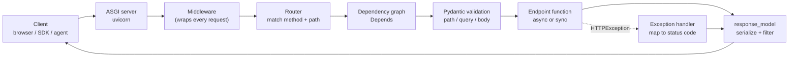

# FastAPI

> **Interview answer (say this first).** FastAPI is an ASGI web framework that turns Python type annotations into a validated HTTP API. You declare routes and Pydantic models; FastAPI does the parsing, validation, serialization, dependency injection, and generates OpenAPI docs automatically. It runs `async def` endpoints on the event loop and `def` endpoints in a threadpool.

## Why this exists

Before FastAPI, a small Python API looked like this:

```python
# A Flask-style endpoint, roughly how it was done before FastAPI.
@app.post("/users")
def create_user():
    payload = request.get_json()          # a raw dict, nothing checked
    if "name" not in payload:             # hand-written checks, per endpoint
        return {"error": "name is required"}, 400
    if not isinstance(payload["name"], str):
        return {"error": "name must be a string"}, 400
    name = payload["name"]
    ...
```

This works, but four problems repeat in every endpoint:

- **Validation is scattered.** Each route checks its own fields, in its own style, and forgets different edge cases.
- **The contract is invisible.** Nothing tells a client what the endpoint accepts or returns. No input schema, no output schema.
- **Documentation drifts.** You write docs by hand, and they are wrong within a week.
- **It is synchronous by default.** Each request occupies a worker for its whole lifetime, so slow I/O wastes capacity.

FastAPI's answer is to make the **type annotations the contract**. You already write types for yourself; FastAPI reads the same annotations to parse requests, validate data, generate JSON Schema, and serve interactive docs. One source of truth produces all four.

```python
# The same endpoint in FastAPI.
@app.post("/users", response_model=UserOut, status_code=201)
def create_user(payload: UserCreate) -> UserOut:
    ...
```

There is no manual parsing and no manual checking. The `UserCreate` model declares the input; `UserOut` declares the output; FastAPI enforces both.

## Start from zero

Assume you have never built a web service. Every term is defined here.

| Word | Plain meaning |
| --- | --- |
| **HTTP** | The request/response protocol of the web. A client sends a method, a path, and data; a server sends a status code and a body. |
| **Request** | One incoming HTTP message: `GET /items/5?q=hi`. |
| **Response** | The server's reply: a status code plus a body such as JSON. |
| **JSON** | A text format for structured data. `{"name": "Ada"}`. |
| **Endpoint (path operation)** | One handler function for one method plus one path, such as `POST /items`. |
| **Path parameter** | A value inside the URL path: the `5` in `/items/5`. |
| **Query parameter** | A value after `?`: the `q` in `/items?q=hi`. |
| **Request body** | Data sent in the request, usually JSON, usually with `POST`/`PUT`. |
| **Status code** | A number describing the result: `200` OK, `201` created, `404` not found, `422` validation failed, `500` server error. |
| **WSGI** | The older synchronous Python web-server interface. One request is handled at a time per worker thread. Flask and Django (historically) use it. |
| **ASGI** | The modern asynchronous Python web-server interface. It supports `async`/`await`, so one worker can handle many waiting requests. |
| **ASGI server** | The program that speaks HTTP and calls your app: **uvicorn** or **hypercorn**. |
| **Pydantic** | The validation library FastAPI uses for bodies and responses (see the Pydantic page). |
| **Dependency injection** | A way to declare "this endpoint needs this object" and let the framework build it, `Depends`. |
| **Router** | A group of related routes that you can mount under a shared prefix. |
| **Middleware** | Code that wraps every request and response, such as logging or timing. |
| **Lifespan** | Startup and shutdown code for shared resources, such as a database engine. |
| **Background task** | Work scheduled to run *after* the response is sent, in the same process. |
| **OpenAPI** | A standard JSON description of an HTTP API. FastAPI generates it from your code. |
| **TestClient** | A helper that calls your app directly in-process, without a real network, for tests. |

Two distinctions decide how you write every route:

- **Path/query vs body.** Path and query parameters are simple values in the URL. The body is structured JSON.
- **`def` vs `async def`.** This decides whether your function blocks an event loop or runs in a threadpool. It matters a lot.

## The core idea

Think of a well-run restaurant. The **app** is the restaurant. Each **path operation** is a dish on the menu. The **ASGI server** is the kitchen that can start many orders without standing idle while one boils. **Dependencies** are prep stations that hand the chef ready ingredients. **Middleware** is the host at the door who greets every guest and stamps every receipt. The **OpenAPI page** is the printed menu, generated from the kitchen's own records.

The single most important mental model is the request pipeline:



Every stage can stop the request with a controlled error, and FastAPI turns that error into a JSON response with the right status code.

Now the contrast that interviewers probe first — WSGI against ASGI:

| | WSGI | ASGI |
| --- | --- | --- |
| Model | Synchronous call, one at a time per worker | Asynchronous, many in flight per worker |
| Function style | Plain `def` | `async def` (and plain `def` too) |
| Concurrency | More processes or threads | `await` while waiting on I/O |
| Streaming, WebSockets | Streaming works (chunked iterables); WebSockets awkward | Native |
| Examples | Flask, Django (classic) | FastAPI, Starlette, Django (async) |

The key insight: **ASGI does not make CPU work faster.** It lets one worker keep serving while a request waits on the network or a database. That is exactly the workload of an AI service that calls model providers.

## How it works

1. **You build an application object.** `app = FastAPI()` creates an ASGI callable. When the server has a request, it calls `app(scope, receive, send)`.
2. **The server sends the request through middleware.** Each middleware is a wrapper. It can inspect, modify, or reject the request before the route runs.
3. **The router matches method and path.** Routes are checked **in the order they were declared**. The first match wins. A path like `/items/{item_id}` accepts anything, so declare literal paths such as `/items/latest` before it.
4. **FastAPI resolves the function signature.** It looks at every parameter and decides where it comes from: a name in the path is a path parameter, a parameter that is a Pydantic model is the body, and everything else is a query parameter.
5. **Dependencies are built first.** `Depends(...)` parameters are resolved, in order, before the endpoint runs. The same dependency is built once per request and cached by default.
6. **Pydantic validates and converts.** Incoming JSON is parsed into models. Invalid data stops here with a `422` and a structured error list.
7. **The endpoint runs.** If it is `async def`, it runs on the event loop. If it is plain `def`, FastAPI runs it in a threadpool so it does not block the loop. The default threadpool has **40 threads** (AnyIO's default limiter).
8. **The return value is serialized.** The `response_model` validates, filters, and converts the output. Extra keys are removed.
9. **The response travels back through middleware** in reverse order, then out through the server.
10. **Errors are mapped.** `HTTPException` becomes its status code and detail. `RequestValidationError` becomes `422`. Custom handlers can override either.

> **Note:**
>
> **Sync and async are two different worlds.** An `async def` endpoint that calls a blocking function (a synchronous database driver, `time.sleep`, `requests.get`) freezes the whole event loop for every other request on that worker. Either use `def` for blocking code, or `await` a truly async library.


## The syntax you will use

**The app and a first route.**

```python
from fastapi import FastAPI

app = FastAPI(title="My API", version="1.0.0")

@app.get("/")
def root():
    return {"ok": True}
```

**Path, query, and body parameters come from annotations.** No special parsing calls.

```python
from pydantic import BaseModel

class ItemIn(BaseModel):
    name: str
    price: float

@app.get("/items/{item_id}")
def get_item(item_id: int, q: str | None = None, limit: int = 10):
    # item_id is a path parameter (declared in the path)
    # q and limit are query parameters (simple types, not in the path)
    return {"item_id": item_id, "q": q, "limit": limit}

@app.post("/items")
def create_item(item: ItemIn):
    # ItemIn is a Pydantic model, so it is read from the request body
    return {"id": 1, **item.model_dump()}
```

**Constraints with `Annotated`, `Path`, and `Query`.** These add validation and appear in the docs.

```python
from typing import Annotated
from fastapi import Path, Query

@app.get("/items/{item_id}")
def item(
    item_id: Annotated[int, Path(ge=1, le=1000)],
    q: Annotated[str | None, Query(min_length=2, max_length=10)] = None,
):
    return {"item_id": item_id, "q": q}
```

**Input and output models are separate.** `response_model` also filters fields, so internal data cannot leak.

```python
class UserCreate(BaseModel):
    name: str

class UserOut(BaseModel):
    id: int
    name: str

@app.post("/users", response_model=UserOut, status_code=201)
def create_user(payload: UserCreate):
    return {"id": 1, "name": payload.name, "secret": "never sent"}
    # the "secret" key is stripped because it is not in UserOut
```

**Dependencies.** `Depends` builds an object and injects it. A function that uses `yield` is a dependency with cleanup.

```python
from fastapi import Depends

def get_settings():
    return {"env": "prod"}

def get_current_user(settings: dict = Depends(get_settings)):
    return {"user": "ada", "env": settings["env"]}

@app.get("/me")
def me(user: dict = Depends(get_current_user)):
    return user
```

**Routers.** Split a large API into files. `include_router` mounts them.

```python
from fastapi import APIRouter

router = APIRouter(prefix="/api/v2", tags=["v2"])

@router.get("/ping")
def ping():
    return {"pong": True}

app.include_router(router)      # final path: /api/v2/ping
```

**Middleware.** Code around every request. Middleware added **later is outermost**, so it runs first on the way in and last on the way out.

```python
from fastapi import Request

@app.middleware("http")
async def add_timing(request: Request, call_next):
    response = await call_next(request)
    response.headers["X-App"] = "my-api"
    return response
```

**Exception handlers.** Map your own exception type to a controlled response.

```python
from fastapi import Request, Response

class NotEnoughCredit(Exception):
    pass

@app.exception_handler(NotEnoughCredit)
async def credit_handler(request: Request, exc: NotEnoughCredit):
    return Response(status_code=402, content='{"error": "no credit"}',
                    media_type="application/json")
```

**Lifespan.** Build shared resources once at startup, release them at shutdown.

```python
from contextlib import asynccontextmanager

@asynccontextmanager
async def lifespan(app: FastAPI):
    app.state.db = connect_to_database()   # startup
    yield
    app.state.db.close()                    # shutdown

app = FastAPI(lifespan=lifespan)
```

**Background tasks.** Run after the response is sent, in the same process.

```python
from fastapi import BackgroundTasks

def write_audit(message: str) -> None:
    ...

@app.post("/notify")
def notify(background_tasks: BackgroundTasks):
    background_tasks.add_task(write_audit, "notified")
    return {"queued": True}
```

**Security dependencies.** These read credentials from the request. They do not verify them.

```python
from fastapi import Depends, HTTPException
from fastapi.security import HTTPAuthorizationCredentials, HTTPBearer

bearer = HTTPBearer(auto_error=False)

@app.get("/secure")
def secure(creds: HTTPAuthorizationCredentials | None = Depends(bearer)):
    if creds is None:
        raise HTTPException(status_code=401, detail="missing token")
    return {"token": creds.credentials}   # you still verify this yourself
```

## Examples: simple to real

**Example 1 — the smallest tested app.**

```python
from fastapi import FastAPI
from fastapi.testclient import TestClient

app = FastAPI()

@app.get("/")
def root():
    return {"ok": True}

client = TestClient(app)
assert client.get("/").json() == {"ok": True}
```

`TestClient` calls the app in-process. No server, no port, no network. That is why it belongs in ordinary unit tests.

**Example 2 — create and read with validation.**

```python
from fastapi import FastAPI
from fastapi.testclient import TestClient
from pydantic import BaseModel, Field

app = FastAPI()
client = TestClient(app)

class ItemIn(BaseModel):
    name: str = Field(min_length=1)
    price: float = Field(gt=0)

class ItemOut(BaseModel):
    id: int
    name: str
    price: float

@app.post("/items", response_model=ItemOut, status_code=201)
def create_item(item: ItemIn):
    return {"id": 1, **item.model_dump()}

client.post("/items", json={"name": "widget", "price": 9.99})  # 201
client.post("/items", json={"name": "", "price": -1})          # 422
```

A malformed body is rejected before your function runs. You never write an `if` for it.

**Example 3 — a dependency that opens and closes a resource.**

```python
from collections.abc import Iterator
from sqlalchemy.orm import Session

def get_db() -> Iterator[Session]:
    db = SessionLocal()
    try:
        yield db            # provide the session to the endpoint
    finally:
        db.close()          # always run after the response

@app.get("/users/{user_id}")
def get_user(user_id: int, db: Session = Depends(get_db)):
    return db.get(User, user_id)
```

This is the standard "session per request" pattern, and it connects to the next two chapters. The `finally` runs even when the endpoint raises.

**Example 4 — grouping with a router.**

```python
router = APIRouter(prefix="/api/v2", tags=["v2"])

@router.get("/ping")
def ping():
    return {"pong": True}

app.include_router(router)
# GET /api/v2/ping -> 200 {"pong": true}
```

Keep one router per resource file. It keeps the app object small and makes ownership clear.

**Example 5 — lifespan plus a background task.**

```python
@asynccontextmanager
async def lifespan(app: FastAPI):
    app.state.started = True      # startup: runs once
    yield
    app.state.started = False     # shutdown: runs once

app = FastAPI(lifespan=lifespan)

@app.post("/jobs")
def start_job(background_tasks: BackgroundTasks):
    background_tasks.add_task(run_report, "daily")   # after the response
    return {"status": "accepted", "started": app.state.started}
```

Startup and shutdown each run exactly once per app lifetime, which is the right place for connection pools and HTTP clients. Note that within a single request, FastAPI caches each dependency, so a dependency requested twice still runs once.

## In production

- **Never block the event loop inside `async def`.** A synchronous database driver or `requests.get` in an async endpoint stalls every other request on that worker. Use a `def` endpoint, `run_in_threadpool`, or a truly async client.
- **The sync threadpool is bounded.** FastAPI runs `def` endpoints and sync dependencies in AnyIO's default threadpool of **40 threads**. Forty slow blocking calls and the next request waits. Size it deliberately, or make the hot path async.
- **Declare literal routes before parameterised ones.** `/items/{item_id}` matches `/items/latest` if it is declared first. Route order is matching order, and the bug looks like a wrong response, not an error.
- **Always set a `response_model` on endpoints that return data.** It filters internal fields, so a password hash or a flag added later cannot leak by accident.
- **Use `response_model` plus separate input/output models.** Never reuse the input model as the output. The accepted shape and the returned shape change for different reasons.
- **One database session per request, closed in `finally`.** Do not create a global session. It is not thread-safe, and it accumulates stale objects and open transactions.
- **Dependencies are cached per request by default.** This is correct for settings and sessions. Use `use_cache=False` only when you genuinely need a fresh object each time.
- **Keep middleware light and order-aware.** Middleware runs on *every* request, including `/docs` and health checks. The last one added is the outermost, so add logging **last** (outermost) if you want it to see requests that authentication later rejects.
- **Do not leak exceptions.** A raw stack trace can expose paths, SQL, and secrets. Handle known domain errors and return a generic `500` for the rest, while logging the traceback server-side.
- **Background tasks are not durable.** They run in the same process after the response. If the process restarts, the work is lost, and there is no retry. Use a real queue (Celery, RQ, a cloud queue) for anything that must survive.
- **Validate configuration at startup, not per request.** Read settings once in lifespan or at import, so a missing `DATABASE_URL` fails immediately instead of mid-request.
- **Keep the OpenAPI schema accurate.** Docs and generated SDKs are only as good as your models. Type the responses, and the docs stop lying. FastAPI serves it at `/openapi.json`, with interactive pages at `/docs` and `/redoc`.

## Interview questions

### 1. What is the difference between ASGI and WSGI, and why does it matter?

**Answer.** WSGI is the older synchronous interface: a request occupies a worker for its entire lifetime, and you scale by adding workers. ASGI is asynchronous: a coroutine can `await` a network or database call, freeing the worker to serve other requests. FastAPI is ASGI, so it supports `async def`, WebSockets, and streaming.

**Follow-up: "Does ASGI make CPU-bound work faster?"** No. It improves I/O concurrency, not computation. CPU-heavy work still needs processes or a task queue.

**Trap.** Thinking ASGI automatically makes every endpoint concurrent. A blocking call inside `async def` still freezes the loop.

### 2. How does FastAPI use type hints and Pydantic?

**Answer.** FastAPI inspects each endpoint's signature. A parameter named in the path becomes a path parameter, a Pydantic model parameter is read from the body, and simple parameters become query parameters. Pydantic then validates and converts the data. The same models generate JSON Schema, so `/openapi.json` and `/docs` are derived from one source of truth.

**Follow-up: "What happens on invalid input?"** FastAPI returns HTTP `422` with a structured list of errors, each with `loc`, `msg`, and `type`. You can replace that response with a custom handler.

**Trap.** Assuming validation covers everything. Query parameters on a route with no model are validated only for the annotated types and constraints you declare.

### 3. What is the difference between an `async def` and a `def` endpoint?

**Answer.** An `async def` endpoint runs on the event loop and must not block, because blocking stops every other request on that worker. A plain `def` endpoint is run by FastAPI in a threadpool, so blocking code is acceptable but uses a bounded resource. Choose `async def` for awaitable I/O and `def` for synchronous libraries.

**Follow-up: "Why not make everything async?"** Because a synchronous driver called from `async def` blocks the loop. If the library is not async, `def` is the safer choice.

**Trap.** Writing `async def` and calling a blocking SDK inside it. It looks modern and performs badly under load.

### 4. What is dependency injection in FastAPI, and what does `Depends` do?

**Answer.** `Depends` declares that a parameter should be built by the framework. FastAPI resolves the dependency graph before the endpoint runs, injects the result, and caches each dependency once per request. A dependency that uses `yield` can also run cleanup after the response, which is how sessions and clients are closed.

**Follow-up: "How do you share a dependency across many endpoints?"** Put it in an `Annotated` alias, such as `Db = Annotated[Session, Depends(get_db)]`, and reuse it in every signature.

**Trap.** Forgetting that a `yield` dependency's cleanup runs after the response. Code that must run before the response, such as a commit, belongs in the endpoint or before the `yield`.

### 5. How do routers help organise a FastAPI application?

**Answer.** A router is a group of routes with a shared prefix, tags, and dependencies. You define routes on the router, then `app.include_router(...)` to mount them. This lets each module own its resources, and the app object stays a short composition list.

**Follow-up: "Can a router have its own dependencies?"** Yes. `APIRouter(dependencies=[Depends(verify_token)])` applies that dependency to every route in the group, which is a clean way to require authentication for a whole section.

**Trap.** Assuming router order does not matter. Mounted routes still match in declaration order, so a catch-all router can shadow later ones.

### 6. How do middleware, dependencies, and exception handlers differ?

**Answer.** Middleware wraps every request and response at the transport level and knows nothing about route signatures. Dependencies run per route, are part of the signature, and can be cached or cleaned up. Exception handlers translate raised exceptions into responses. Use middleware for cross-cutting transport concerns such as request IDs and timing, dependencies for resources and auth, and handlers for error mapping.

**Follow-up: "In what order do they run?"** Middleware wraps everything. Dependencies run after routing and before the endpoint. Exception handlers run when something raises, before the response leaves middleware.

**Trap.** Doing database work in middleware. It runs for static files and docs too, and it cannot access route parameters.

### 7. What is the difference between lifespan events and background tasks?

**Answer.** Lifespan runs startup code once when the application starts and shutdown code once when it stops; it is for shared, long-lived resources such as connection pools. Background tasks run after a single response is sent, in the same process. Lifespan is about the application, background tasks are about one request's follow-up work.

**Follow-up: "Are background tasks reliable?"** No. They are in-process and lost on restart, with no retries. Durable work belongs in a queue.

**Trap.** Putting per-request work in lifespan or shared resources in a request handler. Both create subtle lifecycle bugs.

### 8. How does FastAPI security work, and what do security dependencies actually do?

**Answer.** Security dependencies such as `HTTPBearer` and `OAuth2PasswordBearer` extract credentials from the request headers and report the expected scheme in OpenAPI. They do not verify the token. You still decode and validate it, check expiry and permissions, and raise `401` or `403` yourself.

**Follow-up: "Why use a security dependency instead of reading the header?"** It integrates with the OpenAPI docs so the "Authorize" button appears, and it centralises credential extraction in one place.

**Trap.** Treating a valid-looking token as authenticated. Signature, expiry, audience, and issuer all need checking.

## Remember this

- **Annotations are the API contract.** Path, query, and body all come from the function signature; Pydantic validates it.
- **`async def` runs on the loop; `def` runs in a 40-thread pool.** Never block the loop.
- **`Depends` builds and caches dependencies per request**, and `yield` gives them cleanup.
- **`response_model` filters output**, which protects internal fields from leaking.
- **OpenAPI docs are generated from the same models**, so keeping types accurate keeps docs accurate.
