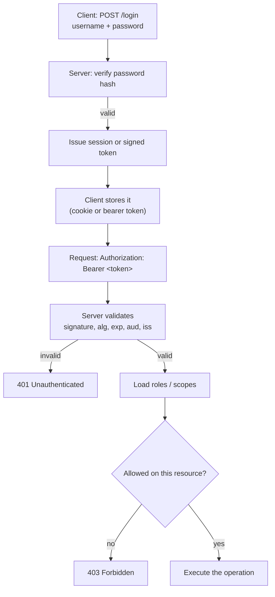

# Authentication and Authorization

> **Interview answer (say this first).** Authentication proves *who* is making a request; authorization decides *what* they are allowed to do. You authenticate once — with a password, API key, session cookie, or signed token like a JWT — then every request carries that proof, and the server validates it and checks permissions before doing any work. The two most common failures are weak token validation and missing per-resource authorization.

## Why this exists

Every service with more than one user eventually has to answer two questions: "Who is this?" and "Are they allowed to do this?" Skip either one and the failure is not cosmetic.

**Failure 1 — no authentication.** An internal admin endpoint is exposed with no check, so anyone who guesses the URL can read or delete every record.

**Failure 2 — authentication without authorization.** The user is logged in, so the server trusts any ID they send. This is **IDOR** (Insecure Direct Object Reference):

```text
GET /invoices/10042          # user 7's invoice -> 200 OK
GET /invoices/10043          # user 8's invoice -> 200 OK, leaked!
```

The user is authenticated. The server never checks that the invoice belongs to *this* user. Logging in is not the same as being allowed to read every row.

**Failure 3 — trusting the client.** The application reads a `role` field from the request body or a URL parameter. An attacker changes `role=user` to `role=admin` and promotes themselves.

**Failure 4 — broken token validation.** The server accepts any JWT it can parse, without verifying the signature, the algorithm, or the expiry. An attacker mints their own token and signs in as anyone.

Authentication and authorization exist to make identity and permission **server-verified facts**, never client claims.

> **Note:**
>
> **The one-sentence purpose.** Authentication is the gate; authorization is the rulebook. The server, not the client, decides both.


## Start from zero

| Word | Plain meaning |
| --- | --- |
| **Authentication (authn)** | Proving identity: "I am user 42." |
| **Authorization (authz)** | Deciding permission: "user 42 may read this invoice." |
| **Principal / subject** | The identity making a request: a user, a service, or an agent. |
| **Credential** | The secret used to prove identity: a password, key, or token. |
| **Session** | Server-side state that remembers a logged-in user across requests. |
| **Cookie** | A small value the browser stores and sends automatically with requests. |
| **Token** | A value that represents a granted identity or permission. |
| **JWT** | JSON Web Token: a signed, base64url-encoded JSON token with three parts. |
| **Claim** | A statement inside a token, such as `sub` (subject) or `exp` (expiry). |
| **Signature** | Cryptographic proof the token was issued by a trusted party and not altered. |
| **HMAC** | A shared-secret signature. The same secret signs and verifies. Symmetric. |
| **Asymmetric signing** | A private key signs; a public key verifies. Used by RSA and ECDSA. |
| **OAuth2** | A framework for granting an app limited access to a user's resources without their password. |
| **OIDC** | OpenID Connect: an identity layer on top of OAuth2 that adds login and an ID token. |
| **Scope** | A named permission attached to a token, such as `tools:search`. |
| **RBAC** | Role-Based Access Control: permissions come from roles. |
| **ABAC** | Attribute-Based Access Control: policies evaluate attributes of user, resource, action, and context. |
| **API key** | A long random secret that identifies a client or service. |
| **Password hashing** | One-way, slow transformation of a password into a stored verifier. |
| **Salt** | Random data added before hashing so identical passwords produce different hashes. |
| **Cost factor** | How slow the hash deliberately is: bcrypt rounds, or Argon2 time and memory. |
| **IDOR** | Insecure Direct Object Reference: accessing an object you do not own by guessing its ID. |
| **Least privilege** | Giving each principal the minimum access needed to do its job. |
| **Bearer token** | A token that grants access to whoever holds it; possession is the proof. |
| **Refresh token** | A longer-lived credential used to obtain new short-lived access tokens. |

Three distinctions to pin down:

- **Authn vs authz.** Authn answers "who"; authz answers "may they". A `401 Unauthorized` really means *unauthenticated*; a `403 Forbidden` means authenticated but not allowed.
- **Session vs token.** A session is server state referenced by an opaque ID. A token is self-contained state that the server verifies cryptographically. Neither is universally better.
- **Signing vs encryption.** A JWT is normally **signed, not encrypted**. Anyone can read its payload; only the signer can change it undetected.

## The core idea

Think of a music festival. At the gate, staff check your ticket and give you a **wristband** (authentication). Inside, different wristband colours unlock different areas: general admission, backstage, artist area (authorization). Security at each door checks the wristband, not your face.

The analogies map cleanly:

- The **door check** happens once per event; the **wristband** travels with you to every subsequent request — that is a token or session cookie.
- A wristband that anyone can forge is useless — that is the **signature**.
- A wristband that never expires lets a fired employee return forever — that is the **expiry**.
- A general-admission wristband does not unlock backstage, even though it is valid — that is **authorization**, and it is checked per resource, not once at login.



The important part is the second half. A valid token only gets you to the permission check. Every endpoint that touches a specific object must ask: *does this principal own or have rights to this object?*

## How it works

1. **A user proves identity once.** The server looks up the stored password verifier and checks the presented password against it using the hashing algorithm.
2. **The server issues a credential.** Either an opaque session ID stored server-side, or a signed token (often a JWT) that the client stores.
3. **The client sends the credential on every request.** A browser sends a cookie automatically; an API client sends `Authorization: Bearer <token>`.
4. **The server validates the credential before trusting it.** For a session, look up the ID and check it is not expired or revoked. For a JWT, verify the signature using an allow-listed algorithm, then check `exp`, `nbf`, `iss`, and `aud`.
5. **The server loads permissions.** From the token's scopes, from a database of roles, or from a policy engine.
6. **The server authorizes the specific action.** It checks both the required permission and, for object-level access, ownership or a share.
7. **The server acts and records an audit entry.** Deny by default: unknown actions and unknown resources are refused, not allowed.
8. **Credentials expire and refresh.** Short-lived access tokens limit the damage of a leak; refresh tokens obtain new ones. Revocation requires server-side state or a denylist, because a stateless JWT cannot be un-signed.

**Password hashing, precisely.** A password must never be stored in plain text or with a fast hash like SHA-256. The stored value is a slow, salted hash:

1. Generate a random **salt** per password.
2. Feed salt plus password into a slow key-derivation function, such as Argon2id, bcrypt, scrypt, or PBKDF2.
3. Store the algorithm, its parameters, the salt, and the hash together in one string.
4. To verify, recompute with the stored parameters and compare in constant time.

The slowness is the point: it makes offline guessing expensive, and a per-password salt stops attackers from hashing one guess against every user at once.

**JWT structure, precisely.** A JWT is three base64url segments joined by dots:

```text
header.payload.signature
  |        |         |
alg,typ  claims   HMAC or signature over "header.payload"
```

The header and payload are **encoded, not encrypted**. Anyone can decode and read them. The signature only proves integrity and origin. Never put secrets in a JWT payload.

**OAuth2 and OIDC at a high level.** OAuth2 is an *authorization delegation* framework: it lets an application obtain limited access to a user's resources on another service without seeing the user's password. The common flows are:

- **Authorization Code + PKCE** — for web and mobile apps. The user is redirected to the provider, logs in, and returns with a short-lived code. The app exchanges the code (plus a PKCE verifier) for tokens. This is the default choice.
- **Client Credentials** — for machine-to-machine access with no user involved.
- **Device Code** — for devices with no browser, such as a TV or CLI.
- **Implicit** and **Resource Owner Password** — legacy flows, now deprecated and best avoided.

OIDC adds an identity layer: an **ID token** (a JWT) describing who logged in, plus a `userinfo` endpoint and a discovery document. OAuth2 alone says "this app may call this API"; OIDC says "this is the user's identity".

## The syntax you will use

**Hash and verify a password with Argon2.** `argon2-cffi` uses Argon2id with sensible defaults.

```python
from argon2 import PasswordHasher
from argon2.exceptions import VerifyMismatchError

ph = PasswordHasher()                       # Argon2id, time_cost=3, memory_cost=64 MiB
stored = ph.hash("correct horse battery staple")   # includes salt and parameters

try:
    ph.verify(stored, "correct horse battery staple")   # True
except VerifyMismatchError:
    raise                                 # wrong password
```

The parameters (algorithm, memory, passes, parallelism, salt) are embedded in the string, so you can raise them later and still verify old hashes.

**Hash and verify with bcrypt.** bcrypt is older but still widely supported. Its cost is the `rounds` parameter.

```python
import bcrypt

stored = bcrypt.hashpw(b"correct horse battery staple", bcrypt.gensalt(rounds=12))
bcrypt.checkpw(b"correct horse battery staple", stored)   # True
bcrypt.checkpw(b"wrong", stored)                          # False
```

bcrypt hashes at most the first 72 bytes of input. Older implementations silently truncated longer input; the modern `bcrypt` library raises `ValueError` instead, so pre-hash long passwords if you must support them.

**Mint and verify a JWT with PyJWT.** Always pass an explicit `algorithms` list.

```python
import time
import jwt

SECRET = "a-very-long-secret-key-with-32-bytes!"   # HS256 keys should be >= 32 bytes

token = jwt.encode(
    {"sub": "42", "scopes": ["tools:search"],
     "iss": "https://auth.example.com", "aud": "my-api",
     "exp": int(time.time()) + 900},
    SECRET,
    algorithm="HS256",
)

claims = jwt.decode(
    token, SECRET,
    algorithms=["HS256"],                 # allow-list; never omit
    audience="my-api",                    # reject tokens for another API
    issuer="https://auth.example.com",    # reject tokens from another issuer
)
```

In the verified run, PyJWT raised `InvalidSignatureError` for a tampered token and for a wrong secret, `ExpiredSignatureError` for an expired token, `InvalidAudienceError` for the wrong audience, and `InvalidAlgorithmError` for both an `alg: none` token and an RS256 token presented where only HS256 was allowed.

**Issue and check a scope in FastAPI.** Dependencies compose: one validates the token, another enforces a scope.

```python
from fastapi import FastAPI, Depends, HTTPException, status
from fastapi.security import OAuth2PasswordBearer

oauth2_scheme = OAuth2PasswordBearer(tokenUrl="token")

def get_current_user(token: str = Depends(oauth2_scheme)) -> dict:
    try:
        return jwt.decode(token, SECRET, algorithms=["HS256"],
                          audience="my-api", issuer="https://auth.example.com")
    except jwt.ExpiredSignatureError:
        raise HTTPException(status_code=401, detail="token expired")
    except jwt.InvalidTokenError:
        raise HTTPException(
            status_code=status.HTTP_401_UNAUTHORIZED,
            detail="Could not validate credentials",
            headers={"WWW-Authenticate": "Bearer"},
        )

def require_scope(needed: str):
    def checker(user: dict = Depends(get_current_user)) -> dict:
        if needed not in user.get("scopes", []):
            raise HTTPException(status_code=403, detail=f"missing scope {needed}")
        return user
    return checker
```

Verified end to end: no token returns `401`, a valid token returns `200`, an expired token returns `401`, a token with the scope returns `200`, and a valid token without the scope returns `403`.

**Use the scope on a route.**

```python
@app.post("/tools/search")
def search(user: dict = Depends(require_scope("tools:search"))):
    return {"ok": True, "sub": user["sub"]}
```

**RBAC: roles map to permissions.**

```python
ROLE_PERMISSIONS = {
    "viewer": {"invoices:read"},
    "editor": {"invoices:read", "invoices:write"},
    "admin":  {"invoices:read", "invoices:write", "invoices:delete"},
}

def can(role: str, permission: str) -> bool:
    return permission in ROLE_PERMISSIONS.get(role, set())
```

**Object-level authorization (fixing IDOR).**

```python
def get_invoice(invoice_id: int, user: dict = Depends(get_current_user)):
    invoice = db.fetch_invoice(invoice_id)
    if invoice is None:
        raise HTTPException(status_code=404, detail="not found")
    if str(invoice.owner_id) != user["sub"]:
        raise HTTPException(status_code=403, detail="not your invoice")
    return invoice
```

The owner check is the authorization step. Without it, the endpoint leaks data even though the token is valid.

**API keys.** Generate high-entropy keys, store only a hash, and compare in constant time.

```python
import hashlib, secrets

api_key = secrets.token_urlsafe(32)          # e.g. 43 characters, ~256 bits
stored_hash = hashlib.sha256(api_key.encode()).hexdigest()   # store this, not the key

def check_key(presented: str, stored_hash: str) -> bool:
    digest = hashlib.sha256(presented.encode()).hexdigest()
    return secrets.compare_digest(digest, stored_hash)       # constant-time
```

`compare_digest` avoids leaking information through response timing. Hashing the key means a database leak does not expose usable keys.

## Examples: simple to real

**Example 1 — session vs token, side by side.**

```python
# Session: the server stores the truth; the cookie is only an opaque ID.
session_id = secrets.token_urlsafe(32)
redis.set(f"session:{session_id}", json.dumps({"sub": "42"}), ex=86400)
response.set_cookie("session_id", session_id, httponly=True, secure=True, samesite="lax")

# Token: the client holds a signed claim; the server verifies it. No lookup needed.
token = jwt.encode({"sub": "42", "exp": now + 900}, SECRET, algorithm="HS256")
```

Sessions are easy to revoke because the server owns the state. Tokens scale without a lookup but are hard to revoke before they expire. Many systems use both: a session that contains a short-lived access token and a refresh token.

**Example 2 — validate every part of a JWT.**

```python
try:
    claims = jwt.decode(
        token, SECRET,
        algorithms=["HS256"],               # 1. pin the algorithm
        audience="my-api",                  # 2. this API
        issuer="https://auth.example.com",  # 3. this issuer
        options={"require": ["exp", "sub"]},# 4. required claims
        leeway=10,                          # 5. tolerate small clock skew
    )
except jwt.ExpiredSignatureError:
    raise HTTPException(status_code=401, detail="expired")
except jwt.InvalidTokenError:
    raise HTTPException(status_code=401, detail="invalid")
```

Each parameter closes a known attack. Omitting `algorithms` or `audience` is how "it works in the demo" becomes a production incident.

**Example 3 — a Role-Based Access Control check on a route.**

```python
def require_permission(permission: str):
    def checker(user: dict = Depends(get_current_user)):
        if not can(user.get("role", "viewer"), permission):
            raise HTTPException(status_code=403, detail="forbidden")
        return user
    return checker

@app.delete("/invoices/{invoice_id}")
def delete_invoice(invoice_id: int,
                   user: dict = Depends(require_permission("invoices:delete"))):
    return db.delete_invoice(invoice_id)
```

Roles keep route code readable. The mapping from role to permission lives in one place, so audits are possible.

**Example 4 — scoping agent tools with least privilege.**

```python
TOOL_SCOPES = {
    "search_docs": "tools:read",
    "send_email":  "tools:send_email",
    "delete_file": "tools:delete",
}

def run_tool(name: str, args: dict, user: dict) -> dict:
    needed = TOOL_SCOPES[name]
    if needed not in user["scopes"]:
        raise PermissionError(f"missing scope {needed}")
    audit.log(user["sub"], name, args)          # record every call
    return TOOLS[name](**args)

@app.post("/agent/run")
def run(request: RunRequest, user: dict = Depends(get_current_user)):
    return {"result": run_tool(request.tool, request.args, user)}
```

The model may *choose* a tool, but it does not get to *authorize* the call. The server checks the user's scopes before execution, and destructive tools can require explicit confirmation.

**Example 5 — a downscoped token for a downstream service.**

```python
def call_downstream(user: dict):
    # Never forward the user's broad token. Mint a narrow, short-lived one.
    narrow = jwt.encode(
        {"sub": user["sub"], "scopes": ["search:read"],
         "aud": "search-service", "exp": now + 60},
        INTERNAL_SECRET, algorithm="HS256",
    )
    return httpx.post(SEARCH_URL, headers={"Authorization": f"Bearer {narrow}"}, timeout=5)
```

Passing a narrow token limits the blast radius if the downstream service is compromised. This is the opposite of the "confused deputy" problem, where a powerful service is tricked into acting on a weaker user's behalf.

## In production

- **Validate the signature and the algorithm, always.** Pin an allow-list such as `algorithms=["RS256"]`. Never trust the `alg` header, never accept `none`, and never let the server choose the algorithm from the token.
- **Check `exp`, `iss`, and `aud`.** A valid token from a different issuer or intended for a different audience must still be rejected. PyJWT raises `InvalidAudienceError` when this is configured.
- **Keep access tokens short and refresh tokens protected.** Fifteen minutes is typical for access tokens. Store refresh tokens server-side, rotate them on use, and detect reuse, which signals theft.
- **Stateless JWTs are hard to revoke.** You cannot "un-sign" one. Plan for a denylist keyed by `jti`, very short expiries, or server-side sessions when instant revocation matters.
- **Never put secrets in a JWT payload.** It is base64url, not encryption. Anyone holding the token can read every claim.
- **Store browser tokens where XSS cannot reach them.** `localStorage` is readable by any script on the page. Prefer `HttpOnly`, `Secure`, `SameSite` cookies, and add CSRF protection for cookie-based writes.
- **Do not leak tokens in logs or URLs.** Query strings end up in access logs, proxies, and the `Referer` header. Send tokens in the `Authorization` header, and redact them in logs.
- **Authorization must be per object, not just per route.** IDOR is the most common API vulnerability. Check ownership or sharing for every object read or written by ID.
- **Deny by default.** New roles, new scopes, and unknown permissions should grant nothing. Explicitly grant what is needed.
- **Hash passwords with Argon2id or bcrypt and raise the cost over time.** Argon2id defaults are about 64 MiB and three passes; bcrypt at `rounds=12` takes roughly 0.1–0.3 seconds on a laptop. Tune to your hardware and rehash on next login when you increase cost.
- **Rate-limit and lock out auth endpoints.** Without it, attackers can brute-force passwords or enumerate valid usernames. Return the same message for "unknown user" and "wrong password".

## Interview questions

### 1. What is the difference between authentication and authorization?

**Answer.** Authentication establishes identity: who is this? Authorization decides permission: what may they do? Authentication happens once per session or token issuance; authorization happens per request and often per object. A user can be fully authenticated and still forbidden from a resource.

**Follow-up: "What does a 403 mean versus a 401?"** `401 Unauthorized` actually means *not authenticated* (missing or invalid credentials) and should carry `WWW-Authenticate`. `403 Forbidden` means authenticated but not permitted.

**Trap.** Treating a successful login as blanket permission. That is exactly the IDOR bug.

### 2. Sessions versus JWTs: which do you choose?

**Answer.** A session stores state on the server, keyed by an opaque ID; it is easy to revoke and easy to reason about, but requires a shared store such as Redis. A JWT is self-contained and signed, so any server with the key can verify it without a lookup; it scales well but is hard to revoke and grows with its claims. Choose sessions when instant revocation matters; choose JWTs for stateless, service-to-service, or horizontally scaled verification.

**Follow-up: "Can you use both?"** Yes, and many do: a session cookie plus short-lived JWTs for downstream services. The session gives revocation; the JWT avoids a lookup per call.

**Trap.** Saying JWTs are "more secure." They are a different trade-off; a stolen JWT is valid until it expires, and there is often no way to revoke it.

### 3. What are the parts of a JWT, and what is actually protected?

**Answer.** A JWT is `header.payload.signature`. The header names the algorithm and type, the payload holds claims such as `sub`, `exp`, `iss`, and `aud`, and the signature covers the header and payload. Header and payload are base64url **encoded, not encrypted**: anyone can read them. The signature guarantees integrity and origin, not confidentiality.

**Follow-up: "Then how do you protect sensitive claims?"** Use JWE (encrypted tokens) if confidentiality is genuinely needed, but usually the right answer is not to put secrets in a token at all.

**Trap.** Assuming the payload is unreadable. Decoding a JWT requires no key.

### 4. Explain `alg` confusion and `alg: none`.

**Answer.** In an algorithm-confusion attack, a server that verifies with a public key also accepts HS256, letting an attacker sign a forged token using the public key as the HMAC secret. In the `none` attack, the attacker sets `alg` to `none` and removes the signature, hoping the server skips verification. Both are fixed by pinning an explicit algorithm allow-list and never choosing the algorithm from the token.

**Follow-up: "What did PyJWT do in your test?"** With `algorithms=["HS256"]`, it rejected both a `none` token and an RS256 token with `InvalidAlgorithmError`, and it detected a tampered payload with `InvalidSignatureError`.

**Trap.** Reading `alg` from the token and using it to pick the verification method. That is the vulnerability.

### 5. Why is bcrypt preferred over SHA-256 for passwords, and how does salting help?

**Answer.** SHA-256 is fast by design, so an attacker with a GPU can test billions of guesses per second. bcrypt (and Argon2) are deliberately slow and memory-hungry, making offline guessing expensive. Salting adds random data per password before hashing, so identical passwords produce different hashes and one cracking attempt cannot crack every user at once.

**Follow-up: "What is the 72-byte bcrypt limit?"** bcrypt's input is capped at 72 bytes: implementations reject longer input rather than silently truncating it, so you cannot rely on the extra entropy of a longer password with bcrypt.

**Trap.** "Hash the password twice for extra security." Double hashing does not add meaningful work for the attacker and can introduce bugs; choose a proper slow algorithm and tune its cost.

### 6. What is IDOR and how do you prevent it?

**Answer.** Insecure Direct Object Reference means the API exposes an object by a guessable ID and does not verify that the caller may access it. Authentication passes; authorization is missing. Prevent it by checking ownership or an explicit share for every object access, scoping database queries by principal, and testing cross-user access deliberately.

**Follow-up: "Does using UUIDs instead of integers fix it?"** No. It makes guessing harder but does nothing against a user who obtains or shares a valid ID. It is security by obscurity, not authorization.

**Trap.** Assuming a logged-in user is trustworthy for all data. Authorization is per object.

### 7. Walk through the OAuth2 authorization code flow with PKCE.

**Answer.** The app redirects the user to the authorization server with a client ID, requested scopes, a redirect URI, and a PKCE challenge. The user authenticates and consents. The server redirects back with a short-lived authorization code. The app exchanges that code plus the PKCE verifier for an access token and, in OIDC, an ID token. The access token is sent to the resource API; the ID token describes the user to the app.

**Follow-up: "Why PKCE?"** It binds the code to the client that started the flow, so an intercepted code cannot be exchanged by an attacker. It replaces the need for a client secret in public clients such as mobile apps.

**Trap.** Using the implicit flow, which returns tokens directly in the URL fragment and cannot use PKCE. It is deprecated for good reason.

### 8. How do you authorize an autonomous agent's tool calls?

**Answer.** Treat every tool as an API with a required scope, and check the end user's scopes on the server before the tool runs. The model may choose which tool to call, but it must not decide whether the call is permitted. Pass a narrowly scoped, short-lived identity to each downstream service, record an audit entry for every call, and require explicit user confirmation for destructive or high-impact actions.

**Follow-up: "What about prompt injection?"** The model can be tricked into requesting a dangerous tool. Server-side scope checks and human confirmation for destructive actions are the controls; never rely on the prompt to enforce policy.

**Trap.** Giving the agent a broad service account because "it needs to call many tools." That is ambient authority, and a single injection can then delete data.

## Remember this

- **Authn is who; authz is what.** Authentication once, authorization on every request and every object.
- **Always pin the algorithm and check `exp`, `iss`, and `aud`.** Never trust the token's own `alg`.
- **Hash passwords with Argon2id or bcrypt**, salted and deliberately slow; never store plaintext or fast hashes.
- **A valid token is not permission.** Check ownership per object to stop IDOR.
- **Give agents least privilege**, enforce tool scopes on the server, and confirm destructive actions.
