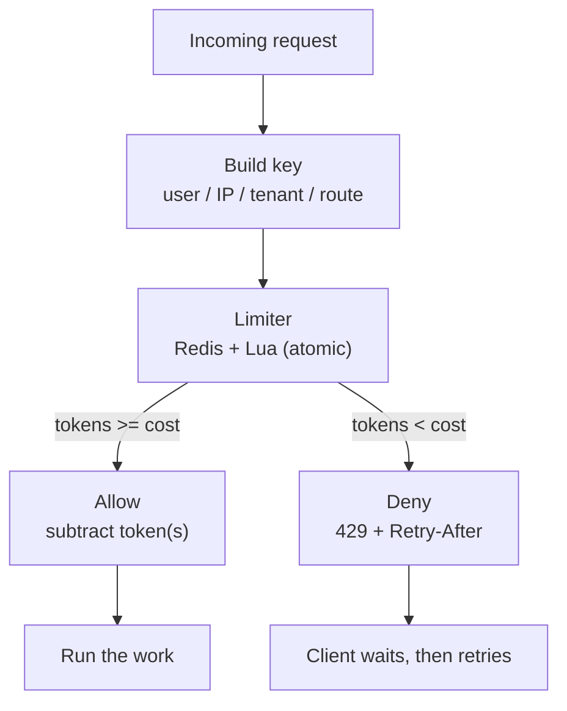

# Rate Limiting

> **Interview answer (say this first).** Rate limiting caps how many requests a caller may make in a time window, so one client cannot exhaust shared resources or run up a bill. The usual algorithms are fixed window, sliding window, token bucket, and leaky bucket; token bucket is the common default because it allows bursts. In a distributed system the counter must be shared and updated atomically — Redis with a Lua script — and the server returns `429 Too Many Requests` with a `Retry-After` header.

## Why this exists

Every service has a finite capacity: database connections, CPU, worker slots, and — for AI products — tokens and money. A limit is what stops one caller from consuming all of it.

Three failures happen constantly without rate limiting:

1. **A retry loop.** A client hits an error, retries immediately, and each retry makes the overload worse. The service spends all its time rejecting work and none doing it. This is a **retry storm**.
2. **A runaway agent.** An agent endpoint calls a paid model. A loop with no stop condition can spend thousands of dollars in minutes. Request limits alone do not help if each request is expensive.
3. **A noisy neighbour.** One tenant sends 10× the traffic of everyone else, saturates the database, and every other tenant sees timeouts.

Rate limiting is also a **fairness** mechanism and a **cost** mechanism. A per-tenant limit is a contract; a cost budget is a spending cap. Both are needed, because "requests" and "dollars" are different resources.

> **Note:**
>
> **The one-sentence purpose.** A rate limiter decides, before doing the work, whether this caller is allowed to do it right now.


## Start from zero

| Word | Plain meaning |
| --- | --- |
| **Rate limit** | The maximum number of requests allowed per unit of time. |
| **Window** | The time period the limit is measured over: 1 second, 1 minute, 1 day. |
| **Fixed window** | A counter that resets at a fixed boundary, such as each whole second. |
| **Sliding window** | A window that always looks back from *now*, so it never resets abruptly. |
| **Token bucket** | A bucket that holds tokens, refills at a constant rate, and spends one token per request. |
| **Leaky bucket** | A queue that drains at a constant rate, smoothing traffic into an even stream. |
| **Burst** | A short spike of requests above the steady rate. |
| **Capacity** | The maximum tokens a bucket can hold — that is, the largest allowed burst. |
| **Refill rate** | How fast tokens are added back, in tokens per second. |
| **429** | The HTTP status for "too many requests". Defined in RFC 6585. |
| **`Retry-After`** | A standard response header telling the client how long to wait before retrying. |
| **Backpressure** | Making the producer wait (queue) instead of rejecting it outright. |
| **Rejection** | Refusing the request immediately with a 429. |
| **Distributed limiter** | A limiter whose counter is shared by all app instances, usually in Redis. |
| **Atomic** | An operation that cannot be interleaved with another, so no update is lost. |
| **Race condition** | A bug where two readers update the same value and one update disappears. |
| **Lua script** | A small program Redis runs atomically inside the server. |
| **Thundering herd** | Many clients retrying at the same instant, causing a second spike. |
| **Cost budget** | A cap on money spent, tracked separately from request count. |
| **Rate-limit key** | What the limit is attached to: `user:42`, `ip:1.2.3.4`, `tenant:acme`. |

The two distinctions that matter most:

- **Burst vs steady rate.** A steady rate says "10 per second." A burst says "up to 30 at once, then refill." Token bucket can express both; fixed window cannot.
- **Rejection vs backpressure.** Rejection returns 429 now. Backpressure queues the work and slows the producer. For user-facing requests, reject; for internal producers you control, apply backpressure.

## The core idea

Picture a **bucket with a small hole in the bottom**. A tap drips tokens in at a constant rate. Each request must take one token out of the bucket. If the bucket is empty, the request waits or is rejected. If the bucket is full — nobody has made a request for a while — extra tokens are simply lost, which caps the burst.

That is the token bucket. Its two numbers are the **refill rate** (steady throughput) and the **capacity** (allowed burst). A limit of "5 per second with bursts up to 20" is one token bucket, not two rules.



Here is how the four algorithms compare. This table is the topic in one screen.

| Algorithm | Burst behaviour | Memory per key | Precision | Typical use |
| --- | --- | --- | --- | --- |
| **Fixed window** | Up to **2×** the limit at window boundaries | O(1), one counter | Coarse | Simple daily quotas |
| **Sliding window log** | No burst at boundaries | O(limit), one entry per hit | Exact | Small, strict limits |
| **Sliding window counter** | Nearly smooth | O(1), two counters | Approximate | High-volume APIs |
| **Token bucket** | Allows bursts up to capacity | O(1), two numbers | Exact | Public APIs, LLM calls |
| **Leaky bucket (queue)** | Smooths to a constant rate | O(capacity), queued items | Exact pacing | Protecting a slow downstream |

## How it works

**Fixed window counter.**

1. Build a key that includes the window: `rl:user:42:1710000000`.
2. `INCR` the key.
3. If the result is `1`, this is the first hit — set an expiry equal to the window.
4. If the result is greater than the limit, reject; otherwise allow.

It is one round trip and O(1) memory. Its flaw is the boundary: at 00:59.9 a client can send the full limit, and at 00:00.0 send it again, so nearly 2× the limit lands in a fraction of a second.

**Sliding window log.**

1. Store each hit in a sorted set with its timestamp as the score.
2. Remove entries older than `now - window`.
3. Count what remains. If below the limit, add this hit and allow.

It is exact and never has a boundary burst. The cost is memory: a limit of 1,000 per minute keeps up to 1,000 timestamps per key.

**Sliding window counter.** An approximation that keeps two fixed-window counters and blends them:

```text
estimate = previous_count * (1 - elapsed_fraction) + current_count
```

It costs O(1) memory, is nearly as smooth as the log, and is what many large APIs use. The trade is a small amount of over- or under-counting.

**Token bucket.**

1. Read the current token count and the timestamp of the last update.
2. Add `elapsed_seconds × refill_rate` tokens, capped at capacity.
3. If there are at least `cost` tokens, subtract them and allow. Otherwise reject.
4. Store the new count and timestamp.

Refill is computed lazily from the clock, so no background job is needed. Two numbers per key, exact burst control.

**Leaky bucket.** Requests join a queue that drains at a fixed rate. The queue depth is the capacity. If the queue is full, reject. Output is perfectly smooth, which is what a fragile downstream needs — at the price of added latency for queued requests. (Some systems call the "full bucket rejects" variant a leaky bucket too; the queue variant is the traffic-shaping one.)

**Making it distributed.** In-process counters only limit one process. With several app instances, each has its own counter, so the effective limit is `limit × instances`. Move the counter to Redis and make every update atomic. A **Lua script** runs as one atomic unit on the Redis server, so the read-modify-write cannot interleave.

> **Tip:**
>
> **The mental shortcut.** Pick by what you must protect. Need bursts for real users? Token bucket. Need perfectly even output for a slow downstream? Leaky bucket. Need a simple daily quota? Fixed window. Need exactness at small scale? Sliding window log.


## The syntax you will use

**In-memory fixed window (one process only).** The simplest possible limiter, for a single instance or a test.

```python
import time

class FixedWindow:
    def __init__(self, limit: int, window: float) -> None:
        self.limit, self.window = limit, window
        self.count, self.start = 0, time.monotonic()

    def allow(self) -> bool:
        now = time.monotonic()
        if now - self.start >= self.window:
            self.count, self.start = 0, now
        if self.count < self.limit:
            self.count += 1
            return True
        return False
```

**Redis fixed window, atomically.** `INCR` is atomic, and the first hit sets the expiry.

```lua
-- KEYS[1] = counter key, ARGV[1] = limit, ARGV[2] = window in ms
local current = redis.call('INCR', KEYS[1])
if current == 1 then
  redis.call('PEXPIRE', KEYS[1], ARGV[2])
end
if current > tonumber(ARGV[1]) then return 0 end
return 1
```

Call it with `redis.eval(script, 1, key, limit, window_ms)`. One script, one round trip, no race.

**Redis sliding window log.** The sorted set holds one member per allowed request.

```lua
-- KEYS[1] = key, ARGV[1] = limit, ARGV[2] = window_ms, ARGV[3] = now_ms, ARGV[4] = unique id
local key, limit = KEYS[1], tonumber(ARGV[1])
redis.call('ZREMRANGEBYSCORE', key, 0, ARGV[3] - ARGV[2])
if redis.call('ZCARD', key) < limit then
  redis.call('ZADD', key, ARGV[3], ARGV[4])
  redis.call('PEXPIRE', key, ARGV[2])
  return 1
end
return 0
```

Pass a unique member (a UUID or request id) so two requests in the same millisecond do not overwrite each other.

**Redis token bucket.** The production default. It returns whether the request is allowed and how many tokens remain.

```lua
-- KEYS[1] = bucket, ARGV = refill_rate, capacity, cost, ttl_seconds
local key = KEYS[1]
local rate, capacity = tonumber(ARGV[1]), tonumber(ARGV[2])
local cost, ttl = tonumber(ARGV[3]), tonumber(ARGV[4])

local clock = redis.call('TIME')
local now = tonumber(clock[1]) + tonumber(clock[2]) / 1000000  -- server time

local data = redis.call('HMGET', key, 'tokens', 'ts')
local tokens = tonumber(data[1])
local last = tonumber(data[2])
if tokens == nil then tokens, last = capacity, now end

tokens = math.min(capacity, tokens + math.max(0, now - last) * rate)
local allowed = tokens >= cost and 1 or 0
if allowed == 1 then tokens = tokens - cost end

redis.call('HSET', key, 'tokens', tokens, 'ts', now)
redis.call('EXPIRE', key, ttl)
return {allowed, tostring(tokens)}
```

Using `redis.call('TIME')` avoids trusting the app servers' clocks, which drift apart.

**Returning 429 with `Retry-After`.** Tell the client exactly how long to wait. A 429 without `Retry-After` invites instant retries.

```python
from fastapi import Request
from fastapi.responses import JSONResponse

@app.middleware("http")
async def rate_limit(request: Request, call_next):
    allowed, retry_after = limiter.check(key_for(request), cost=1)
    if not allowed:
        return JSONResponse(
            status_code=429,
            content={"error": "rate limit exceeded"},
            headers={"Retry-After": str(retry_after),
                     "X-RateLimit-Remaining": "0"},
        )
    response = await call_next(request)
    return response
```

`Retry-After` takes seconds or an HTTP date. Many clients and SDKs honour it automatically.

**Choosing the key.** Layer limits by trust and by who pays.

```python
def key_for(request: Request) -> str:
    api_key = request.headers.get("x-api-key")
    if api_key:
        return f"rl:key:{api_key}"        # authenticated caller
    client = request.client.host if request.client else "unknown"
    return f"rl:ip:{client}"              # anonymous fallback
```

Authenticated callers get per-key limits; anonymous traffic gets per-IP limits, which are weaker because many users share a NAT address.

**Limiting a provider, not just your users.** A token bucket alone does not cap concurrency. Pair it with a semaphore so you never exceed the provider's parallel-request ceiling.

```python
import asyncio, time

class Bucket:
    def __init__(self, rate: float, capacity: float) -> None:
        self.rate, self.capacity = rate, capacity
        self.tokens, self.updated = capacity, time.monotonic()

    async def acquire(self, cost: float = 1.0) -> None:
        while True:
            now = time.monotonic()
            self.tokens = min(self.capacity,
                              self.tokens + (now - self.updated) * self.rate)
            self.updated = now
            if self.tokens >= cost:
                self.tokens -= cost
                return
            await asyncio.sleep((cost - self.tokens) / self.rate)

bucket = Bucket(rate=10, capacity=20)
slots = asyncio.Semaphore(4)          # at most 4 calls in flight
```

The bucket limits requests per second; the semaphore limits concurrency. LLM providers need both.

**A cost budget.** Count dollars, not calls, and reject when the budget is gone. Like every other limiter here, the check-and-accumulate runs as one atomic Lua script, so two concurrent calls cannot both pass when only enough budget remains for one.

```lua
-- KEYS[1] = spend key, ARGV = cost_usd, budget_usd, ttl_seconds
local key = KEYS[1]
local cost, budget = tonumber(ARGV[1]), tonumber(ARGV[2])
local spent = tonumber(redis.call('GET', key) or 0)
if spent + cost > budget then
  return {0, tostring(spent)}
end
if redis.call('EXISTS', key) == 0 then
  redis.call('SET', key, 0, 'EX', ARGV[3])   -- TTL is set once, on first charge
end
local new_spent = redis.call('INCRBYFLOAT', key, cost)
return {1, tostring(new_spent)}
```

```python
CHARGE = """<the Lua script above>"""

def charge(tenant: str, cost_usd: float, budget: float) -> None:
    allowed, _spent = redis.eval(
        CHARGE, 1, f"spend:{tenant}", cost_usd, budget, 86400
    )
    if not allowed:
        raise HTTPException(status_code=429, detail="budget exhausted")
```

`INCRBYFLOAT` keeps a running spend. The TTL is set only on the first charge, so the budget is a 24-hour window measured from that first charge, not a window that slides forward on every call. If you need a strict midnight reset, key by calendar day (`spend:{tenant}:2026-09-13`) instead.

## Examples: simple to real

**Example 1 — fixed window, and its two flaws.** It is simple, and in one process it is correct.

```python
limiter = FixedWindow(limit=5, window=1.0)
[limiter.allow() for _ in range(7)]
# [True, True, True, True, True, False, False]
```

Two flaws. With four app instances and no shared counter, the effective limit is 20 per second. And across a window boundary a fixed window can allow nearly 2× the limit: with `limit=2`, two requests pass at `t=0.99 s` and two more at `t=1.01 s`. Token bucket removes both flaws.

**Example 2 — token bucket allows a real burst, then throttles.** The bucket starts full, so the first `capacity` requests pass at once.

```python
class TokenBucket:
    def __init__(self, rate: float, capacity: float) -> None:
        self.rate, self.capacity = rate, capacity
        self.tokens, self.updated = capacity, time.monotonic()

    def allow(self, cost: float = 1.0) -> bool:
        now = time.monotonic()
        self.tokens = min(self.capacity,
                          self.tokens + (now - self.updated) * self.rate)
        self.updated = now
        if self.tokens >= cost:
            self.tokens -= cost
            return True
        return False

bucket = TokenBucket(rate=2, capacity=2)
# t = 0.00: allow, allow  -> 0 tokens
# t = 0.50: 1 token refilled -> allow
# t = 0.75: only 0.5 token -> reject
```

This is exactly the behaviour a public API wants: a short burst for a human, then a steady drip. `capacity` controls the burst; `rate` controls the sustained load.

**Example 3 — the distributed token bucket.** The same maths, moved into a Lua script so every instance shares one bucket.

```python
TOKEN_BUCKET = """<the Lua script from the syntax section>"""

def check(key: str, rate: float, capacity: float,
          cost: float = 1.0, ttl: int = 3600) -> tuple[bool, float]:
    allowed, tokens = redis.eval(TOKEN_BUCKET, 1, key, rate, capacity, cost, ttl)
    return bool(allowed), float(tokens)
```

Now ten app instances still enforce one global limit, because the read-modify-write happens atomically inside Redis.

**Example 4 — per-user 429 with `Retry-After`.** The user-facing contract.

```python
@app.post("/agent/run")
async def run_agent(request: Request):
    allowed, remaining = check(f"rl:user:{request.state.user_id}",
                               rate=1, capacity=5)
    if not allowed:
        raise HTTPException(
            status_code=429,
            headers={"Retry-After": "1"},
            detail="too many runs; retry in a moment",
        )
    return {"status": "queued"}
```

Return `Retry-After` as a whole number of seconds. A client that respects it will not add to the pile.

**Example 5 — provider limit plus cost budget for an agent.** The realistic production shape: a per-tenant request limit, a provider concurrency cap, and a dollar budget.

```python
async def call_model(tenant: str, prompt: str) -> str:
    if not check(f"rl:tenant:{tenant}", rate=5, capacity=10)[0]:
        raise HTTPException(429, "tenant rate limit")
    charge(tenant, estimate_cost(prompt), budget=DAILY_BUDGET_USD)
    async with slots:                      # provider concurrency cap
        await bucket.acquire()             # provider requests-per-second cap
        response = await provider.complete(prompt)
    charge(tenant, actual_cost(response), budget=DAILY_BUDGET_USD)
    return response.text
```

Three different limits protect three different things: the tenant limit protects fairness, the semaphore protects the provider, and the budget protects your bank account.

## In production

- **Use a distributed counter.** In-process limiters multiply the real limit by the number of instances. Put the state in Redis (or a gateway) and update it atomically with a Lua script.
- **Prefer token bucket as the default.** It expresses both a sustained rate and a burst, needs O(1) memory, and is easy to explain. Reach for sliding window log only when exactness matters at small limits.
- **Always send `Retry-After`.** A 429 without it triggers immediate retries and turns a limit into a self-inflicted denial of service.
- **Add jitter to client retries.** Even with `Retry-After`, many clients waking at the same second create a new spike. Jitter spreads the retries.
- **Fail open or fail closed deliberately.** If Redis is down, failing closed rejects all traffic; failing open removes the protection. For user-facing APIs, fail open with a local in-memory fallback; for cost controls, fail closed.
- **Beware the Redis round trip.** A limiter adds a network call to every request. Pipeline it, keep Redis close to the app, and cache "definitely allowed" decisions in memory for a few milliseconds when the limit is high.
- **Layer limits by key.** Global circuit breaker, per-tenant fairness, per-user fairness, and per-IP abuse control are four different limits, not one.
- **Rate is not concurrency.** A requests-per-second limit does not stop 50 slow calls being in flight at once. Add a semaphore for provider and database concurrency.
- **A cost budget is not a request limit.** One expensive agent run can cost more than a thousand cheap reads. Track spend per tenant per day and reject before the call, not after.
- **Guard the reset path.** Fixed-window counters without an expiry leak keys forever if the `EXPIRE` is skipped. Set the TTL in the same atomic script.
- **Watch the boundary burst.** A fixed window can allow almost twice the limit across the reset. If that matters, use token bucket or sliding window.
- **Rate limit before you do expensive work.** Check at the edge, before parsing large bodies or opening database connections, or the limiter itself becomes the load.

## Interview questions

### 1. What is the difference between fixed window and sliding window?

**Answer.** A fixed window resets on a boundary — each whole minute, for example — and uses a single counter, so it is cheap but can allow nearly 2× the limit across the reset. A sliding window looks back from the current instant, so the effective limit never jumps. The log version is exact but stores every hit; the counter version blends two windows and is approximate but O(1).

**Follow-up: "Why not always use sliding window?"** Cost. The exact log stores one entry per allowed request, which is heavy at high limits. Fixed window is fine for daily quotas where a boundary burst is harmless.

**Trap.** Saying fixed window "allows exactly twice the limit." It can allow up to 2×, and only when the client times its requests around the reset.

### 2. Explain the token bucket algorithm.

**Answer.** A bucket holds up to `capacity` tokens and refills at `rate` tokens per second. Each request removes one token (or more, if it is expensive). If the bucket has enough tokens, the request proceeds; otherwise it is rejected. Refill is computed lazily from the timestamp, so no background process runs. `capacity` sets the allowed burst and `rate` sets the sustained throughput.

**Follow-up: "How is that different from leaky bucket?"** Token bucket allows a burst and then throttles; leaky bucket drains at a constant rate and smooths traffic. Token bucket is better for user-facing APIs; leaky bucket is better before a fragile downstream.

**Trap.** Confusing capacity with the rate limit. With `rate=10` and `capacity=100`, a client can fire 100 requests at once and then continue at 10 per second.

### 3. Why do you need Redis for rate limiting, and why Lua?

**Answer.** With multiple app instances, an in-process counter gives each instance its own limit, so the real limit is multiplied by the instance count. Redis centralises the state. A plain `GET` then `SET` is a race: two requests can both read the same value and each write back, losing one update. A Lua script executes atomically on the Redis server, so the read-modify-write is one indivisible step.

**Follow-up: "What about Redis Cluster?"** Keys for one limit must live in one slot. Use a hash tag, such as `rl:{user:42}`, so related keys hash to the same slot, and avoid scripts that touch keys in different slots.

**Trap.** Using a transaction (`MULTI`/`EXEC`) as if it were atomic read-modify-write. `MULTI` queues commands; it does not prevent another client from reading between your read and your write unless you use `WATCH` or Lua.

### 4. What should a rate-limited response look like?

**Answer.** HTTP `429 Too Many Requests` with a `Retry-After` header giving the number of seconds (or an HTTP date) until the client may retry. Include remaining-quota information as a courtesy, such as `X-RateLimit-Remaining` and `X-RateLimit-Reset` (or the newer `RateLimit` header fields). The body should be a small, machine-readable error.

**Follow-up: "Why is `Retry-After` important?"** Without it, clients either give up or retry immediately. Immediate retries turn the limit into a retry storm, which is the exact overload the limiter was meant to prevent.

**Trap.** Returning `503` instead of `429`. `503` means the whole service is unavailable and may trigger failover; `429` means this caller is over its limit.

### 5. How do you rate limit calls to an upstream LLM provider?

**Answer.** Use two controls. A token bucket limits requests per second to the provider's published rate, and an `asyncio.Semaphore` (or a worker-pool size) limits how many calls are in flight at once. Also add retry with backoff and jitter for 429s and 5xx from the provider, and honour the provider's `Retry-After` if it sends one. For batch work, you additionally cap total spend.

**Follow-up: "Why not just one limit?"** They protect different things. The rate limit stops you exceeding requests per minute; the semaphore stops you exceeding concurrent connections. A provider can reject you for either.

**Trap.** Retrying provider 429s immediately. Provider limits are often global to your account, so instant retries amplify the problem across every worker.

### 6. What is the difference between backpressure and rejection?

**Answer.** Rejection refuses the request now with a 429; backpressure accepts it into a bounded queue and makes the producer wait. Rejection is right for interactive, user-facing requests where waiting is worse than a clear error. Backpressure is right for internal producers you control, because it slows them down without losing work.

**Follow-up: "What happens when the queue is full?"** You must reject anyway, usually with 503 or 429, and apply backpressure upstream. An unbounded queue is not backpressure; it is delayed memory exhaustion.

**Trap.** Adding an unbounded queue and calling it backpressure. It hides overload until the process runs out of memory.

### 7. Which key should you rate limit on?

**Answer.** Layer them. Per-IP catches anonymous abuse but is unfair behind NAT; per-user (or per-API-key) is fair and works with authentication; per-tenant is a billing and fairness boundary; a global limit is a circuit breaker for the whole service. Authenticated callers should be limited by identity, not by IP.

**Follow-up: "What about a shared corporate network?"** All those users share one IP, so an IP limit punishes them together. Prefer identity; use IP only as a fallback for unauthenticated traffic, with a more generous limit.

**Trap.** Trusting a client-supplied header such as `X-Forwarded-For` without validating the proxy chain. An attacker can spoof it and evade the IP limit.

### 8. How do you handle a thundering herd after a limit resets?

**Answer.** Add jitter to client retry delays, send an explicit `Retry-After`, and spread resets using a token bucket rather than a fixed boundary so there is no single instant when everyone becomes eligible. If many clients are waiting on the same expensive result, use a cache with a lock so only one recomputes it, and let the rest wait. For providers, combine backoff, jitter, and a semaphore.

**Follow-up: "What is cache stampede?"** When a popular cache entry expires and many requests recompute it at once. A short lock or a "serve stale while revalidating" policy prevents it.

**Trap.** Believing a rate limiter alone prevents thundering herds. The limiter decides who gets through; jitter and caching decide whether the retry wave is survivable.

## Remember this

- Rate limiting protects **shared resources, fairness, and money**; request limits and cost budgets are different controls.
- **Token bucket** is the default: `capacity` sets the burst, `rate` sets the sustained throughput, memory is O(1).
- **Fixed window** is cheapest but can allow ~2× at boundaries; **sliding window** removes that at a memory or precision cost.
- Distributed limits need a **shared, atomic counter** — Redis with a **Lua script** — not a per-process dictionary.
- Return **429 with `Retry-After`**, add **jitter**, and treat **rate and concurrency** as separate limits.
