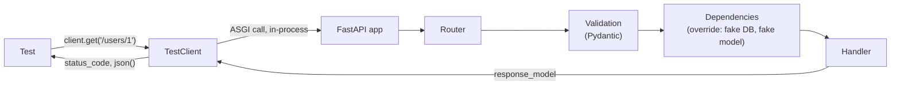

# API Testing

> **Interview answer (say this first).** API testing exercises the running service through its real HTTP contract: routing, validation, serialization, authentication, and error shapes. In FastAPI, `TestClient` drives the app in-process with no server, `app.dependency_overrides` swaps the database or auth dependency, fixtures give each test an isolated database, and external model calls are replaced with fakes or `monkeypatch`.

## Why this exists

A FastAPI handler looks easy to test on its own:

```python
@app.post("/summaries", response_model=SummaryOut)
def create_summary(payload: SummaryIn, db: Session = Depends(get_db)):
    ...
```

You could import `create_summary` and call it with a fake session. But that skips everything that makes it an **API**:

- Does the route actually exist at `/summaries` with method `POST`?
- Does a missing field produce `422`, and in what body shape?
- Does the response model really serialise the fields the client expects?
- Does authentication actually run before the handler?
- Does an exception become a clean JSON error, or a stack trace?

None of that lives in the function body. It lives in the wiring — the router, the Pydantic models, the dependencies, and the exception handlers. Only a test that goes through the front door can check it. That is what an API test is: **a request through the real HTTP contract, with the slow or external parts swapped out.**

Agentic AI services are especially exposed here. A chat endpoint often has streaming, auth, database reads for conversation history, an external model call, and token accounting. A handler-only unit test proves none of that works together.

## Start from zero

| Word | Plain meaning |
| --- | --- |
| **API** | A defined set of requests a service accepts, such as `POST /summaries`. |
| **Endpoint** | One URL plus method combination, like `GET /users/{id}`. |
| **Status code** | A number describing the result: `200` OK, `201` created, `401` unauthenticated, `404` missing, `422` invalid input, `500` server error. |
| **Request body** | JSON sent by the client, parsed into a Pydantic model. |
| **Response body** | JSON returned by the service, shaped by `response_model`. |
| **ASGI** | The async interface between Python web apps and servers. FastAPI is an ASGI app. |
| **`TestClient`** | A FastAPI helper that sends requests directly into an ASGI app in the same process, with no network. |
| **`httpx`** | The HTTP library `TestClient` is built on. It can also talk to a real server or an in-process app. |
| **`ASGITransport`** | An `httpx` transport that routes requests straight to an ASGI app, used for async tests. |
| **Dependency** | A callable FastAPI runs and injects (database session, current user, settings). |
| **`dependency_overrides`** | A dictionary on the app that replaces a dependency during tests. |
| **Fixture** | Setup and teardown a test framework provides, such as a client or a fresh database. |
| **Factory** | A helper that creates valid test data with sensible defaults and overrides. |
| **Contract test** | A test that checks a request/response shape against an agreed schema. |
| **OpenAPI** | The machine-readable schema FastAPI generates for your API at `/openapi.json`. |
| **Integration test** | A test that exercises several real pieces together, such as app plus real database. |
| **Unit test** | A test of one small function in isolation, with its collaborators replaced. |
| **Test isolation** | Each test starts from a known state and cannot affect another test. |

## The core idea

Testing an API is like checking a restaurant by **ordering at the counter**. You do not walk into the kitchen and inspect the pan; you place a real order and judge what comes back: did it arrive, was the order recorded, was it right, and was the bill correct?



Two things make this practical:

1. **No server.** `TestClient` calls the ASGI app directly. No port, no network, no race with startup.
2. **Dependency overrides.** You replace the real database or model client with a test double at the single wiring point FastAPI already provides.

The request path above validation, routing, and serialization stays real, so the test catches contract bugs. Only the slow edges are swapped.

## How it works

1. **Build the app as an importable object.** The tests import `app` from your package, the same object a server would run.
2. **Create a client.** `TestClient(app)` wraps the ASGI app; `with TestClient(app) as client:` also runs the lifespan startup and shutdown.
3. **Override dependencies.** Put replacements in `app.dependency_overrides` before the request and clear them afterwards.
4. **Send a request.** `client.post("/users", json={...})` goes through routing and validation exactly like a real call.
5. **Let the app run.** FastAPI resolves dependencies, validates input into Pydantic models, calls the handler, and serialises the response.
6. **Assert the status code first.** A wrong code means the request never reached the logic you meant to test.
7. **Assert the body shape and values.** Check required keys, types, and error details, not just that something came back.
8. **Assert side effects.** For a write, read it back through a second request, or query the test database directly.
9. **Clean up.** Overrides clear, the transaction rolls back, and the next test starts clean.

> **Note:**
>
> **Why the context manager matters.** `TestClient(app)` can send requests immediately, but lifespan startup and shutdown only run when you use `with TestClient(app) as client:`. If your app opens connections on startup, always use the context manager in a fixture.


## The syntax you will use

**The client.** Synchronous tests use `TestClient`; it is an `httpx.Client` underneath.

```python
from fastapi.testclient import TestClient
from app.main import app

client = TestClient(app)
response = client.get("/health")
assert response.status_code == 200
assert response.json() == {"status": "ok"}
```

**Sending every common shape.**

```python
client.get("/items", params={"q": "cat"})          # query string
client.post("/items", json={"name": "widget"})      # JSON body
client.post("/token", data={"username": "alice"})   # form body
client.get("/me", headers={"Authorization": "Bearer t"})
```

**Reading the response.**

```python
response.status_code          # 201
response.json()               # parsed JSON
response.headers["content-type"]
```

**Named status constants.** They read better than magic numbers.

```python
from fastapi import status
assert response.status_code == status.HTTP_201_CREATED
```

**A `conftest.py` with an app fixture.** Put shared fixtures here so every test file can use them.

```python
import pytest
from fastapi.testclient import TestClient
from app.main import app
from app.db import get_db

@pytest.fixture()
def client(db_session):
    app.dependency_overrides[get_db] = lambda: db_session
    with TestClient(app) as c:
        yield c
    app.dependency_overrides.clear()
```

**`dependency_overrides`.** The key is the dependency callable, the value is a callable returning the replacement.

```python
app.dependency_overrides[get_db] = lambda: fake_session
app.dependency_overrides[get_current_user] = lambda: "test-user"
app.dependency_overrides.clear()      # always restore
```

**Async tests with `httpx.ASGITransport`.** For `async` code paths or streaming, use an async client.

```python
import httpx
import pytest

@pytest.mark.anyio
async def test_async():
    transport = httpx.ASGITransport(app=app)
    async with httpx.AsyncClient(transport=transport, base_url="http://test") as ac:
        response = await ac.get("/ping")
        assert response.json() == {"ok": True}
```

**Parameterised happy and error paths.** One test, many inputs.

```python
@pytest.mark.parametrize("payload,expected", [({}, 422), ({"name": "w"}, 422)])
def test_invalid(client, payload, expected):
    assert client.post("/items", json=payload).status_code == expected
```

## Examples: simple to real

**Example 1 — the smallest useful test.**

```python
from fastapi.testclient import TestClient
from fastapi import FastAPI

app = FastAPI()

@app.get("/health")
def health():
    return {"status": "ok"}

def test_health():
    client = TestClient(app)
    response = client.get("/health")
    assert response.status_code == 200
    assert response.json() == {"status": "ok"}
```

Even this catches real bugs: a typo in the path, a wrong method, or a response that is not JSON.

**Example 2 — CRUD, validation, and error shapes.**

```python
from fastapi import FastAPI, HTTPException
from fastapi.testclient import TestClient
from pydantic import BaseModel

class Item(BaseModel):
    name: str
    price: float

app = FastAPI()

@app.post("/items", status_code=201)
def create_item(item: Item):
    return {"name": item.name}

@app.get("/items/{item_id}")
def read_item(item_id: int):
    if item_id != 1:
        raise HTTPException(status_code=404, detail="Item not found")
    return {"id": 1, "name": "widget", "price": 9.99}

def test_create_and_read():
    client = TestClient(app)
    assert client.post("/items", json={"name": "w", "price": 1.0}).status_code == 201

    bad = client.post("/items", json={"name": "w", "price": "free"})
    assert bad.status_code == 422
    assert isinstance(bad.json()["detail"], list)      # validation errors are a list

    missing = client.get("/items/2")
    assert missing.status_code == 404
    assert missing.json() == {"detail": "Item not found"}
```

FastAPI returns `422` for a body that fails Pydantic validation. The `detail` is a list of per-field errors, so assert on the shape before asserting on messages.

**Example 3 — isolate the database with a fixture.**

The test database is a fresh in-memory SQLite that no other test can see. `TestClient` runs the app in a worker thread, so in-memory SQLite needs a shared connection and threads allowed.

```python
import pytest
from collections.abc import Iterator
from sqlalchemy import create_engine
from sqlalchemy.orm import Session
from sqlalchemy.pool import StaticPool
from fastapi.testclient import TestClient
from app.main import app
from app.db import get_db, Base

engine = create_engine(
    "sqlite://",
    connect_args={"check_same_thread": False},   # TestClient uses a worker thread
    poolclass=StaticPool,                         # one shared in-memory connection
)
Base.metadata.create_all(engine)

@pytest.fixture()
def db_session() -> Iterator[Session]:
    connection = engine.connect()
    transaction = connection.begin()
    session = Session(bind=connection)
    try:
        yield session
    finally:
        session.close()
        transaction.rollback()     # every test starts clean
        connection.close()

@pytest.fixture()
def client(db_session: Session):
    app.dependency_overrides[get_db] = lambda: db_session
    with TestClient(app) as c:
        yield c
    app.dependency_overrides.clear()

def test_users_are_isolated(client):
    assert client.get("/users/1").status_code == 404   # no data leaks in
```

The rollback is the isolation mechanism: each test gets a transaction that is thrown away, so tests can run in any order.

**Example 4 — test authentication without testing auth.**

Override the auth dependency so a test about business logic does not need to log in. Keep one separate test that exercises the real auth path.

```python
from fastapi import Depends, FastAPI, HTTPException
from fastapi.security import HTTPBearer, HTTPAuthorizationCredentials
from fastapi.testclient import TestClient

security = HTTPBearer()          # auto_error=True: missing header -> 401
app = FastAPI()

def get_current_user(creds: HTTPAuthorizationCredentials = Depends(security)) -> str:
    if creds.credentials != "valid-token":
        raise HTTPException(status_code=401, detail="Invalid token")
    return "alice"

@app.get("/me")
def me(user: str = Depends(get_current_user)):
    return {"user": user}

def test_auth_really_runs():
    client = TestClient(app)
    assert client.get("/me").status_code == 401
    assert client.get("/me", headers={"Authorization": "Bearer nope"}).status_code == 401
    ok = client.get("/me", headers={"Authorization": "Bearer valid-token"})
    assert ok.status_code == 200 and ok.json() == {"user": "alice"}

def test_business_logic_ignores_auth():
    app.dependency_overrides[get_current_user] = lambda: "test-user"
    try:
        assert TestClient(app).get("/me").json() == {"user": "test-user"}
    finally:
        app.dependency_overrides.clear()
```

A subtlety worth knowing: `HTTPBearer()` with the default `auto_error=True` returns **401** with `{"detail": "Not authenticated"}` when the header is missing. With `auto_error=False` it passes `None` to your code, and you choose the status.

**Example 5 — mock the external model call.**

The endpoint stays real; only the paid, slow, non-deterministic part is replaced. Use `monkeypatch` so the change is undone automatically.

```python
import sys
from unittest.mock import MagicMock
from fastapi import FastAPI
from fastapi.testclient import TestClient

app = FastAPI()

def call_model(text: str) -> str:
    raise RuntimeError("real model call not allowed in tests")

@app.get("/classify")
def classify(q: str):
    return {"label": call_model(q)}

def test_classify_uses_model(monkeypatch):
    fake = MagicMock(side_effect=lambda text: "spam" if "buy now" in text else "ham")
    monkeypatch.setattr(sys.modules[__name__], "call_model", fake)

    client = TestClient(app)
    assert client.get("/classify", params={"q": "buy now"}).json() == {"label": "spam"}
    assert client.get("/classify", params={"q": "hello"}).json() == {"label": "ham"}
    fake.assert_any_call("buy now")
```

The fake is deterministic and free, and the test still proves the endpoint passed the query to the model and serialised the label.

**Example 6 — a lightweight contract test from OpenAPI.**

FastAPI already publishes the response schema. Validate a real response against it so a field rename cannot silently break clients.

```python
import jsonschema
from referencing import Registry, Resource
from referencing.jsonschema import DRAFT202012
from fastapi.testclient import TestClient
from app.main import app

OPENAPI_URI = "https://app.example.com/openapi.json"

def test_user_response_matches_openapi():
    client = TestClient(app)
    document = client.get("/openapi.json").json()

    # Register the whole document so every $ref resolves, including refs from
    # UserOut to nested component schemas such as Address. An isolated
    # components.schemas.UserOut sub-schema cannot resolve those refs.
    registry = Registry().with_resource(
        OPENAPI_URI,
        resource=Resource.from_contents(
            document, default_specification=DRAFT202012
        ),
    )
    validator = jsonschema.Draft202012Validator(
        {"$ref": f"{OPENAPI_URI}#/components/schemas/UserOut"},
        registry=registry,
    )
    body = client.get("/users/1").json()
    validator.validate(body)   # raises on mismatch
```

Rename a field in `UserOut` and the real response no longer matches the documented shape. Validating the isolated `components.schemas.UserOut` sub-schema looks simpler, but it breaks as soon as `UserOut` contains a nested model: FastAPI emits a `$ref` to another component, and a sub-schema has no document to resolve it against. Registering the full OpenAPI document is what lets those nested refs resolve. For deeper coverage, tools such as Schemathesis can generate requests from the whole OpenAPI document.

## In production

- **`TestClient` is in-process.** It does not test the ASGI server, the reverse proxy, TLS, or real network timeouts. Keep a small number of true end-to-end tests against a deployed environment for those.
- **Always clear `dependency_overrides`.** It is app-global state. A leftover override silently changes every later test in the same process. Clear it in a `finally` or a fixture teardown.
- **Never point tests at the production database.** Use in-memory SQLite, a throwaway schema, or a container. A configuration mistake should not be able to delete real data.
- **Isolate with a transaction, not a delete.** `DELETE FROM` between tests is slow and can leave sequences and caches behind. Begin a transaction per test and roll it back.
- **In-memory SQLite needs `check_same_thread=False` and `StaticPool`.** `TestClient` runs the app in a worker thread, and SQLite connections are thread-bound by default. Without these, you get `ProgrammingError`.
- **Assert error bodies, not just 4xx.** `404` with the wrong JSON still breaks clients. Check `detail` and the status code together.
- **Auth has its own test.** The auth override is convenient but it hides the login path. Keep at least one test that sends no token, a bad token, and a valid token. Know that `HTTPBearer(auto_error=True)` returns 401 for a missing header so a test cannot pass for the wrong reason.
- **Form and OAuth2 password routes need `python-multipart`.** FastAPI raises a clear `RuntimeError` at import time if it is missing. Add it to your test dependencies.
- **Use factories, not shared sample rows.** A `user_factory` with unique emails prevents order-dependence and accidental collisions between tests.
- **Freeze time and seed randomness.** Token expiry, rate limits, and retries depend on clocks and jitter. Inject a clock and seed `random`, or the suite will fail at midnight.
- **Contract tests rot with the schema.** They prove the response matches today's OpenAPI, not that clients are compatible. Version the API and run contract checks in CI when schemas change.

## Interview questions

### 1. How do you test a FastAPI endpoint?

**Answer.** Import the `app`, wrap it in `TestClient`, and send real requests. Assert the status code and the JSON body. Swap the database and external services through `app.dependency_overrides`, give each test an isolated database with a fixture, and clear overrides afterwards. The router, validation, and serialization stay real, so the test covers the actual contract.

**Follow-up: "Why not call the handler function directly?"** That skips routing, validation, dependency injection, and response serialization — the parts most likely to break. The handler is the easy part.

**Trap.** Importing the handler and testing it as a plain function, then claiming the endpoint is tested.

### 2. What is `TestClient`, and how does it differ from a real HTTP client?

**Answer.** `TestClient` is a subclass of `httpx.Client` that sends requests directly into the ASGI app in the same process. It exercises the real application code with no server and no network, which is fast and deterministic. A real client over a network additionally tests the server, proxy, and transport, but is slower and needs a running deployment.

**Follow-up: "What does it not cover?"** The ASGI server, TLS, DNS, timeouts, and any middleware added outside the app. Keep a few smoke tests on a deployed environment for those.

**Trap.** Assuming `TestClient` tests concurrency or streaming behaviour over the wire. It is in-process, so timing and buffering differ.

### 3. How does `dependency_overrides` work?

**Answer.** FastAPI stores a mapping from a dependency callable to a replacement callable. Before a request, it checks this mapping and uses the replacement instead of the original. Tests set it before the request and clear it afterwards. It is app-global, so cleanup is essential.

**Follow-up: "What is a good key?"** The exact function passed to `Depends`, such as `get_db`, not the returned object.

**Trap.** Forgetting to clear overrides, so one test's fake leaks into every later test.

### 4. How do you isolate the test database?

**Answer.** Use a database that only tests can see — in-memory SQLite or a throwaway schema — and wrap each test in a transaction that is rolled back. The app's `get_db` dependency is overridden to hand out that session. For in-memory SQLite with `TestClient`, allow cross-thread use and share one connection with `StaticPool`.

**Follow-up: "Why not truncate tables between tests?"** It is slower, and it does not reset sequences, caches, or anything outside the tables. A transaction is atomic and complete.

**Trap.** Sharing a database across tests and relying on test order, which makes failures depend on which test ran first.

### 5. How do you test authentication and authorization?

**Answer.** Test the auth path directly: no token, malformed token, expired token, valid token. Assert the exact status codes. Then, for tests about other behaviour, override the auth dependency so the test is not coupled to login. Add separate tests for roles and permissions, such as a normal user getting `403` on an admin route.

**Follow-up: "Where do tokens come from in tests?"** Generate one with the same code the login endpoint uses, or mint a test token with a test secret. Never call the real identity provider.

**Trap.** Only testing the happy path with a valid token, which misses the failure modes that actually matter in production.

### 6. What is the difference between a unit test and an integration test for an API?

**Answer.** A unit test checks one function with its collaborators replaced; it is fast and points precisely at a bug. An integration test runs several real pieces together, such as the app plus a real database, and checks they fit. API tests through `TestClient` sit in between: the app is real, the external services are replaced.

**Follow-up: "How many of each?"** Mostly unit tests, some integration tests, a few end-to-end tests. That is the test pyramid. API tests are the cheap integration layer that catches most contract regressions.

**Trap.** Calling every `TestClient` test an end-to-end test. It never leaves the process.

### 7. What is contract testing, and why does it matter?

**Answer.** A contract test checks that the request and response shapes match an agreed schema — here, the OpenAPI document FastAPI generates. It catches breaking changes such as a renamed field or a changed status code before consumers find out. You can validate a real response against the generated schema, or generate requests from the whole document with a tool like Schemathesis.

**Follow-up: "When do you run it?"** In CI, on every change to a request or response model. A migration that changes a field name is exactly the change that should fail the build.

**Trap.** Treating OpenAPI as documentation only. It is an executable contract if you actually assert against it.

### 8. How do you keep API tests fast and deterministic when they call a model?

**Answer.** Put the model behind a small interface and replace it in tests with a fake or a mock that returns canned responses. Seed randomness, inject a clock, and give the fake scripted failures for retry tests. The test then asserts on your logic, the request the model received, and the response you returned — no network, no cost, no flakiness.

**Follow-up: "How do you test streaming or timeouts?"** Use a fake that yields chunks with delays, and `httpx.AsyncClient` with `ASGITransport` for async streaming. Test the timeout path with a fake that raises.

**Trap.** Mocking the provider SDK's internal HTTP layer, which couples tests to private implementation; a wrapper you own is stable.

## Remember this

- **Test through the front door:** status code first, then body shape, then side effects.
- **`dependency_overrides`** swaps the database, auth, or model at the wiring point; always clear it.
- **Isolate the database** with an in-memory or throwaway DB and a per-test transaction rollback.
- **Test auth explicitly** (no token, bad token, valid token), then override it for unrelated tests.
- **Replace the model with a deterministic fake**; keep `TestClient` in-process and tests fast.
