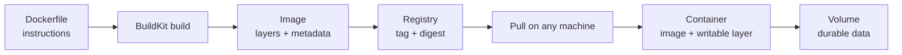

# Dockerizing Python Applications

> **Interview answer (say this first).** A container packages your app together with its interpreter, system libraries, and dependencies into one immutable **image**, so it runs the same on your laptop and in production. A good Python `Dockerfile` pins a slim base image, copies `requirements.txt` before the source so layers cache, builds wheels in a **multi-stage** build, runs as a **non-root** user, and starts the process in **exec form** so it is PID 1 and receives shutdown signals.

## Why this exists

"It works on my machine" is a real bug class, not a joke. A Python app depends on much more than Python code:

- The interpreter version (`3.12` vs `3.9`).
- System libraries (`libpq`, `libssl`, `libffi`, a C compiler for some wheels).
- OS packages and their versions.
- The exact set of installed dependencies.

Ship the source to a server that lacks one of these and the app dies at import time:

```text
ImportError: libpq.so.5: cannot open shared object file
```

The usual fixes are worse than the problem: a long prose "deploy guide", a hand-configured server that drifts, or "install these apt packages first" that nobody can reproduce six months later.

A container replaces the prose with an artifact. The **image** contains the app and its whole runtime. Build it once, and every environment runs the identical bytes. That gives you:

- **Parity.** Dev, CI, staging, and production use the same image.
- **Reproducibility.** The build is described in a file and stored in git.
- **Rollback.** Deploying the previous image is a tag change, not a rebuild.
- **Isolation.** Two services on one host cannot break each other's dependencies.

> **Note:**
>
> **The one-sentence purpose.** A container image is your application plus its runtime, frozen into one versioned file you can run anywhere.


## Start from zero

| Word | Plain meaning |
| --- | --- |
| **Image** | A read-only template made of layers: the filesystem plus metadata such as the start command. |
| **Container** | A running (or stopped) instance of an image, with a thin writable layer on top. |
| **Dockerfile** | The text file of instructions used to build an image. |
| **Layer** | One filesystem change produced by one Dockerfile instruction. Layers are cached and shared. |
| **Base image** | The image you start `FROM`, such as `python:3.12-slim`. |
| **Build context** | The files sent to the builder at build time — usually the project directory. |
| **BuildKit** | The modern build engine; it enables cache mounts and build secrets. |
| **Registry** | A server that stores and serves images, such as Docker Hub or GHCR. |
| **Tag** | A human-readable label, such as `myapp:1.2.3`. Mutable. |
| **Digest** | The content hash, `sha256:...`. Immutable and exact. |
| **Volume** | Storage that outlives the container, mounted from the host or a named volume. |
| **Port mapping** | Publishing a container port to the host, `-p 8000:8000`. |
| **`ENTRYPOINT` / `CMD`** | The default program and its default arguments. `ENTRYPOINT` is the executable; `CMD` supplies arguments or a fallback. |
| **Exec form** | `["python", "app.py"]` — starts the program directly. |
| **Shell form** | `python app.py` — wraps the command in `/bin/sh -c`. |
| **`ARG`** | A build-time variable. Visible in image history; not for secrets. |
| **`ENV`** | An environment variable baked into the image. |
| **Build secret** | A value mounted only during one build step and never stored in a layer. |
| **`.dockerignore`** | Files excluded from the build context. |
| **Multi-stage build** | Several `FROM` stages in one Dockerfile; copy only the results forward. |
| **`HEALTHCHECK`** | An in-image command that reports whether the container is healthy. |
| **PID 1** | The first process in the container. It receives signals and must reap children. |
| **Compose** | A tool that runs several containers together from one YAML file for local dev. |

Two pairs cause most confusion:

- **Image vs container.** An image is the recipe; a container is one dish cooked from it. You can run many containers from one image.
- **`ARG` vs `ENV` vs secret.** `ARG` is build-time input, `ENV` is runtime configuration, and a secret should come from a mounted secret or the environment at run time — never from a layer, because layers are readable by anyone with the image.

## The core idea

Think of an image as a stack of transparent sheets. Each Dockerfile instruction adds a sheet with the file changes it made. Sheets are **shared and cached**: if two images both start from `python:3.12-slim` and run the same `pip install`, they reuse the same sheet.

Starting a container adds one more transparent sheet on top — the writable layer — that lasts only as long as the container. That is why data written inside a container disappears when it is replaced, and why databases need a **volume**.



The caching rule is the single most important thing to internalise: **a layer is reused only if the instruction and every parent layer are unchanged.** So order matters. Put things that change rarely (system packages, dependencies) early, and things that change often (your source code) late.

## How it works

1. **The client sends the build context** — the files in the directory, minus `.dockerignore` entries — to the builder.
2. **The builder walks the Dockerfile top to bottom.** `FROM` pulls the base image; each other instruction runs and produces a layer.
3. **After each instruction, the builder looks for a cached layer** whose parent and instruction match. `COPY`/`ADD` also compare file checksums. On a hit, the instruction is skipped entirely.
4. **The first cache miss invalidates every later layer.** That is why `COPY . .` before `pip install` forces a full reinstall on every code change.
5. **The final image is the last stage**, plus metadata: the working directory, exposed ports, user, entrypoint, and healthcheck.
6. **The image is tagged and pushed** to a registry. Pushing uploads only the layers the registry does not already have.
7. **A runtime pulls the image** by tag or, better, by digest, and starts a container. The writable layer is created on top.
8. **The entrypoint becomes PID 1.** In exec form it is your program directly; signal handling and child reaping become its responsibility. `--init` (or Compose `init: true`) inserts a tiny init such as `tini` to handle signals and zombies.
9. **The container is disposable.** Stop it, and the writable layer is gone; only volumes survive.

> **Tip:**
>
> **The mental shortcut.** Cache is king. Read your Dockerfile from top to bottom and ask: "if I edit one line of application code, how many layers below it get rebuilt?" The answer should be "one".


## The syntax you will use

**A naive first Dockerfile.** This works and is wrong in four ways: a huge base image, no layer caching, root user, and shell-form `CMD`.

```dockerfile
FROM python:3.12
WORKDIR /app
# Any file change invalidates the cached layer below it.
COPY . .
RUN pip install -r requirements.txt
# Shell form: Docker runs /bin/sh -c "python app.py".
CMD python app.py
```

**A better Dockerfile: slim base, cached deps, non-root, exec form.**

```dockerfile
FROM python:3.12-slim
ENV PYTHONDONTWRITEBYTECODE=1 \
    PYTHONUNBUFFERED=1
WORKDIR /app
# Dependencies change rarely, so this layer stays cached.
COPY requirements.txt .
RUN pip install --no-cache-dir -r requirements.txt
# Source changes often, so it comes last.
COPY . .
RUN useradd --create-home --uid 10001 app
USER app
EXPOSE 8000
# Exec form: Python becomes PID 1 and receives signals.
CMD ["python", "-m", "app.main"]
```

`PYTHONUNBUFFERED=1` makes logs appear immediately, which matters when logs are collected from stdout. Copying `requirements.txt` first means editing source code does not reinstall dependencies.

**A production multi-stage build.** Build wheels with compilers in the `builder` stage, then copy only the wheels into a clean runtime stage.

```dockerfile
# syntax=docker/dockerfile:1
FROM python:3.12-slim AS builder
WORKDIR /build
COPY requirements.txt .
RUN --mount=type=cache,target=/root/.cache/pip \
    pip wheel --wheel-dir /wheels -r requirements.txt

FROM python:3.12-slim AS runtime
ENV PYTHONDONTWRITEBYTECODE=1 \
    PYTHONUNBUFFERED=1 \
    PIP_NO_CACHE_DIR=1
WORKDIR /app
COPY --from=builder /wheels /wheels
COPY requirements.txt .
RUN pip install --no-index --find-links=/wheels -r requirements.txt \
    && rm -rf /wheels
COPY . .
RUN useradd --create-home --uid 10001 app && chown -R app:app /app
USER app
EXPOSE 8000
HEALTHCHECK --interval=30s --timeout=3s --start-period=10s --retries=3 \
    CMD ["python", "-c", "import urllib.request; urllib.request.urlopen('http://127.0.0.1:8000/health')"]
ENTRYPOINT ["python", "-m", "app.main"]
```

The `--mount=type=cache` keeps pip's download cache between builds without adding it to the image, so rebuilds are fast and the final image stays small. The runtime stage has no compilers.

**Build secrets.** Never bake a private index token into a layer. Mount it for one instruction only.

```dockerfile
# syntax=docker/dockerfile:1
FROM python:3.12-slim
WORKDIR /app
COPY requirements.txt .
RUN --mount=type=secret,id=netrc,target=/root/.netrc \
    pip install --no-cache-dir -r requirements.txt
COPY . .
```

Build with `docker build --secret id=netrc,src=$HOME/.netrc -t myapp .`. The secret is visible only inside that `RUN` and is not saved in the image.

**`.dockerignore`.** Keep the context small and stop secrets from entering the image.

```text
.git
.venv
__pycache__
*.pyc
.env
.pytest_cache
.mypy_cache
tests/
docs/
```

Without this, `COPY . .` can bake `.env` and a local virtualenv into the image.

**Environment variables at run time.** Configure the app when the container starts; do not rebuild for each environment.

```bash
docker run --rm -p 8000:8000 \
  -e DATABASE_URL=postgresql://user:pass@db:5432/app \
  -e LOG_LEVEL=info \
  myapp:1.2.3
```

The image stays identical across environments; only the injected configuration changes.

**Compose for local development.** One command brings up the API, PostgreSQL, and Redis with the right wiring.

```yaml
services:
  api:
    build: .
    ports: ["8000:8000"]
    env_file: .env
    depends_on:
      db:
        condition: service_healthy
    init: true                       # forward signals, reap zombies
  db:
    image: postgres:16
    environment:
      POSTGRES_PASSWORD: devpassword
    volumes: ["pgdata:/var/lib/postgresql/data"]
    healthcheck:
      test: ["CMD-SHELL", "pg_isready -U postgres"]
      interval: 5s
      retries: 5
  redis:
    image: redis:7
volumes:
  pgdata:
```

`condition: service_healthy` waits for the database healthcheck before starting the API, which removes the classic "API starts before the database" race.

**Graceful shutdown inside the container.** Because the process is PID 1, install signal handlers.

```python
import signal, threading

stop = threading.Event()

def handle(signum, frame):
    stop.set()

signal.signal(signal.SIGTERM, handle)
signal.signal(signal.SIGINT, handle)
stop.wait()          # then close connections and finish in-flight work
```

Precisely: a process running as PID 1 in a container does not receive the default action for signals it has not handled. `docker stop` sends `SIGTERM`, waits a grace period (10 seconds by default), then sends `SIGKILL`. Handle `SIGTERM`, or every stop becomes a hard kill.

**Building for the right platform.** Build and push multi-architecture images, and pin by digest for reproducibility.

```bash
docker buildx build \
  --platform linux/amd64,linux/arm64 \
  -t ghcr.io/acme/myapp:1.2.3 \
  --push .
```

On an Apple-silicon laptop this builds `linux/arm64` by default; a production `linux/amd64` host needs `--platform linux/amd64`, or it may run slowly under emulation or fail on native extensions.

## Examples: simple to real

**Example 1 — the naive Dockerfile, and what breaks.** It runs, but every code edit reinstalls all dependencies, the image is around a gigabyte, and the app runs as root.

```dockerfile
FROM python:3.12
COPY . .
RUN pip install -r requirements.txt
CMD python app.py
```

**Example 2 — reorder for caching.** Only the last two layers rebuild when application code changes.

```dockerfile
FROM python:3.12-slim
WORKDIR /app
COPY requirements.txt .
RUN pip install --no-cache-dir -r requirements.txt
COPY . .
CMD ["python", "-m", "app.main"]
```

This one change usually turns a two-minute rebuild into a few seconds.

**Example 3 — add a non-root user.** Containers run as root by default, which amplifies any escape and writes root-owned files into volumes.

```dockerfile
RUN useradd --create-home --uid 10001 app && chown -R app:app /app
USER app
```

Use a high UID (`10001`) to avoid clashing with host users. Ports below 1024 need root, so listen on `8000`.

**Example 4 — multi-stage with a pip cache mount.** Compilers and build tools stay in the `builder` stage; the runtime image carries only installed packages.

```dockerfile
# syntax=docker/dockerfile:1
FROM python:3.12-slim AS builder
WORKDIR /build
COPY requirements.txt .
RUN --mount=type=cache,target=/root/.cache/pip \
    pip wheel --wheel-dir /wheels -r requirements.txt

FROM python:3.12-slim AS runtime
WORKDIR /app
COPY --from=builder /wheels /wheels
COPY requirements.txt .
RUN pip install --no-cache-dir --no-index --find-links=/wheels -r requirements.txt && rm -rf /wheels
COPY . .
CMD ["python", "-m", "app.main"]
```

The final image is often 40–60% smaller than a single-stage build with a compiler installed, and the cache mount makes CI rebuilds fast.

**Example 5 — a healthcheck the orchestrator can trust.** Return a real readiness signal, not just "the process is up".

```python
from fastapi import FastAPI

app = FastAPI()

@app.get("/health")
async def health() -> dict[str, str]:
    await db.execute("SELECT 1")          # dependency is reachable
    return {"status": "ok"}
```

Pair it with the `HEALTHCHECK` instruction for plain Docker and Compose. Be precise here: **Kubernetes ignores Docker's `HEALTHCHECK`** and uses its own `readinessProbe` and `livenessProbe`, so define both when you move to Kubernetes.

**Example 6 — Compose for the whole local stack.** Developers get a real database and Redis with one command and no local installs.

```yaml
services:
  api:
    build: .
    ports: ["8000:8000"]
    env_file: .env
    depends_on:
      db: { condition: service_healthy }
    init: true
  db:
    image: postgres:16
    environment: { POSTGRES_PASSWORD: devpassword }
    volumes: ["pgdata:/var/lib/postgresql/data"]
    healthcheck:
      test: ["CMD-SHELL", "pg_isready -U postgres"]
      interval: 5s
      retries: 5
volumes:
  pgdata:
```

Run it with `docker compose up --build`. The same `Dockerfile` is used here and in production, which is the point.

## In production

- **Pin the base image by digest for reproducibility.** `python:3.12-slim` is a mutable tag; `python@sha256:...` is exact. Mutable tags drift and change behavior between builds.
- **Copy dependency files before source.** `requirements.txt` (or a lockfile) first, application code last, so code edits reuse the dependency layer.
- **Always write a `.dockerignore`.** Excluding `.git`, `.venv`, `__pycache__`, and `.env` cuts build context size and prevents secrets and stale bytecode from entering the image.
- **Never bake secrets into a layer.** `ARG` and `ENV` values are visible in image history and `docker inspect`. Use runtime environment variables, mounted files, or BuildKit secrets.
- **Build dependencies in a builder stage, not the runtime image.** Compilers add hundreds of megabytes and attack surface that the running app never needs.
- **Prefer `python:3.12-slim` over `alpine` for data and ML work.** Alpine uses musl, so many `manylinux` wheels do not apply and pip falls back to compiling from source, which is slow and failure-prone.
- **Run as a non-root user and use a high UID.** Root in a container is still root on the host kernel and produces root-owned files in shared volumes.
- **Use exec-form `ENTRYPOINT`.** Shell form wraps the process in `/bin/sh -c`, which can swallow signals. Add `--init` or Compose `init: true` so PID 1 forwards signals and reaps zombies.
- **Handle `SIGTERM` deliberately.** Docker sends `SIGTERM`, waits 10 seconds by default, then kills. A process that ignores it is always killed hard, and in-flight requests or jobs are lost.
- **Do not run migrations on every container start.** With several replicas they race. Run migrations as a separate one-off job before the rollout.
- **Keep containers stateless; put data in volumes or object storage.** The writable layer disappears with the container. Anything you must keep belongs in a database, a volume, or object storage.
- **Smaller is safer and faster, but size is not the goal.** Faster pulls, fewer CVEs, and a smaller attack surface are the goals. Remove build caches in the same `RUN` that created them, because deleting a file in a later layer does not shrink the image.

## Interview questions

### 1. What is the difference between an image and a container?

**Answer.** An image is a read-only, layered template containing the filesystem and metadata — the start command, user, ports, and so on. A container is a running or stopped instance of that image, with one thin writable layer on top. Many containers can run from one image, and the writable layer disappears when the container is removed.

**Follow-up: "Then where does the database's data go?"** Into a volume or a bind mount, which lives outside the container's writable layer and survives replacement.

**Trap.** Saying a container is "a lightweight VM." A VM has its own kernel; a container shares the host kernel and uses namespaces and cgroups for isolation. That is why containers start in milliseconds and why a kernel exploit is a serious risk.

### 2. How does Docker layer caching work, and how do you exploit it?

**Answer.** Each instruction produces a layer. The builder reuses a cached layer only if the instruction and every parent layer are unchanged; `COPY` also checksums the copied files. The first miss invalidates all later layers. So copy `requirements.txt` and install dependencies before copying source code, which changes on every commit.

**Follow-up: "What is a cache mount?"** With BuildKit, `RUN --mount=type=cache,target=/root/.cache/pip` persists pip's download cache between builds without storing it in the image, so a cache miss does not re-download every package.

**Trap.** Putting `COPY . .` before `pip install`. It makes the dependency layer rebuild on every source change and is the most common Dockerfile performance bug.

### 3. What is a multi-stage build and why use one?

**Answer.** A Dockerfile can have several `FROM` stages. The final image is the last stage, and `COPY --from=builder` brings over only the files you need — typically installed packages or built wheels. Build tools, compilers, and test dependencies stay behind. The result is a smaller image with a smaller attack surface.

**Follow-up: "Can you build wheels in the builder and install them in the runtime?"** Yes; `pip wheel` in the builder, then `pip install --no-index --find-links=/wheels` in the runtime stage. That is the standard pattern for compiled dependencies.

**Trap.** Copying a virtualenv from the builder. A venv contains absolute paths and can break when moved. Install into a prefix or copy wheels, not the venv.

### 4. How do you pass secrets into a build safely?

**Answer.** Use BuildKit build secrets: `RUN --mount=type=secret,id=netrc,target=/root/.netrc ...` with `docker build --secret id=netrc,src=...`. The secret exists only for that instruction and is not stored in any layer. Never use `ARG` or `ENV` for secrets, because both are recorded in image metadata and readable with `docker history` or `docker inspect`.

**Follow-up: "What about secrets at run time?"** Inject them as environment variables from a secret manager, or mount them as files. Environment variables are visible to any process in the container, so prefer mounted files or a short-lived token for sensitive values.

**Trap.** Adding a secret in one layer and deleting it in the next. The secret is still in the earlier layer and can be extracted from the image.

### 5. What does `ENTRYPOINT` do versus `CMD`?

**Answer.** `ENTRYPOINT` is the executable that always runs; `CMD` provides default arguments or a default command. If both are present, `CMD` values are passed to `ENTRYPOINT`. At `docker run`, arguments after the image name replace `CMD` but not `ENTRYPOINT` (unless `--entrypoint` is used). Use exec form for both so no shell wraps the process.

**Follow-up: "Why does the difference matter for signals?"** With shell form, the shell becomes PID 1 and may not forward `SIGTERM` to your program, so `docker stop` can only kill it after the timeout. Exec form makes your program PID 1 and lets it handle signals.

**Trap.** Writing `CMD python -m app.main` and assuming it is the same as `["python", "-m", "app.main"]`. The shell form is different and matters for signal handling.

### 6. What is PID 1 in a container, and why is it special?

**Answer.** PID 1 is the first process in the container, which is your entrypoint unless you use an init. On Linux, PID 1 has special signal semantics: signals whose default action would terminate the process are not delivered unless PID 1 installs a handler. It is also expected to reap orphaned child processes. So a Python app as PID 1 must handle `SIGTERM` and either avoid spawning zombies or run under `tini` via `--init`.

**Follow-up: "How do you add an init easily?"** `docker run --init`, or `init: true` in Compose, or set `ENTRYPOINT ["tini", "--", "python", "-m", "app.main"]`. Kubernetes runs a pause/init process that handles some of this.

**Trap.** Saying signals "always work in containers." Without a handler, `SIGTERM` has no default termination effect on PID 1, so the process is killed by `SIGKILL` after the grace period.

### 7. How do you make a Docker build reproducible?

**Answer.** Pin the base image by digest, pin dependencies with a lockfile or pinned `requirements.txt`, install with `--no-cache-dir`, avoid `apt-get upgrade`, and keep the build free of external state that changes over time. Tag images with the git commit SHA, and deploy by digest so the running artifact is exact.

**Follow-up: "Why not use the `latest` tag in production?"** It is mutable. Two nodes can pull different images from the same tag, and a rollback has no fixed target. Deploy by digest or an immutable tag.

**Trap.** Confusing "the same source" with "the same image." Even deterministic Dockerfiles depend on base images and package indexes; pinning by digest is what makes the image itself reproducible.

### 8. Why do many Python teams avoid Alpine base images?

**Answer.** Alpine uses the musl C library, but the Python ecosystem publishes binary wheels built for glibc (`manylinux`). On Alpine, pip cannot use those wheels and must compile many packages from source, which needs build tools, slows the build, and sometimes fails outright. The slim Debian images are slightly larger but use glibc and get binary wheels.

**Follow-up: "When is Alpine fine?"** For pure-Python services with no compiled dependencies, and when image size is critical. Even then, measure the result rather than assuming.

**Trap.** Choosing Alpine only for size and then adding a full compiler toolchain to make wheels build, producing an image larger than a slim one.

## Remember this

- An **image** is a layered read-only template; a **container** is a running instance with a writable layer that disappears when the container is removed.
- **Layer order is performance.** Copy dependency files before source, and build tools in a **multi-stage** builder so the runtime stays small.
- **Never put secrets in `ARG` or `ENV`.** Use BuildKit **build secrets** at build time and injected environment or mounted files at run time.
- Run as **non-root**, start with **exec-form** `ENTRYPOINT`, and handle **`SIGTERM`** because your process is **PID 1**.
- Pin the base image by **digest**, deploy by immutable tag, and prefer `python:3.12-slim` over Alpine for compiled dependencies.
