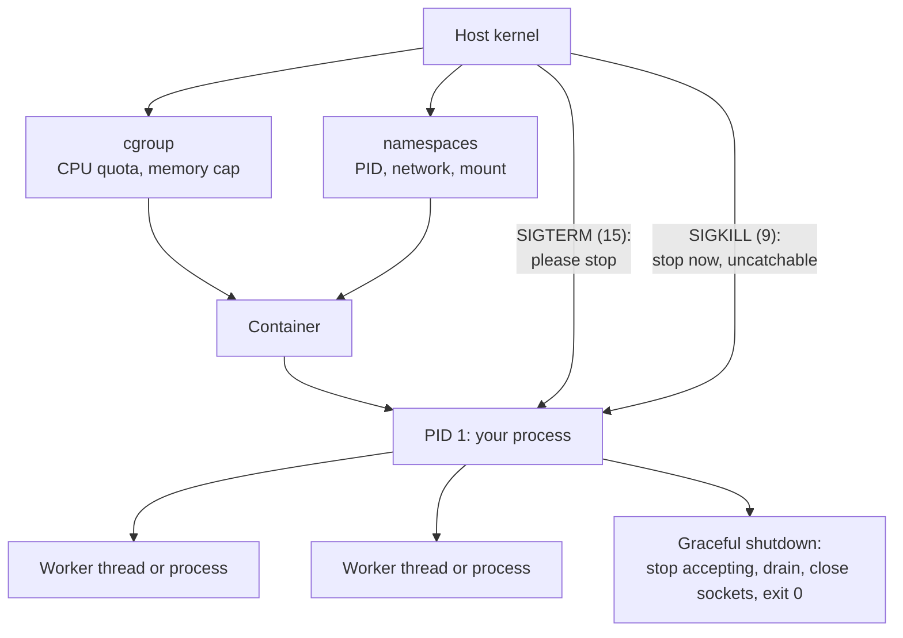

# Linux Runtime and Networking Fundamentals

> **Interview answer (say this first).** A production service is a process with hard limits: a file-descriptor budget, a memory cgroup, a CPU quota, and a network identity. Most "the app is broken" incidents are one of those limits, a signal, or the network path underneath — DNS, the TCP handshake, TLS, a connection pool, or a timeout that was never set. Debug from the kernel outwards with `ss`, `lsof`, `dig`, and `strace` before you change Python.

## Why this exists

An on-call page reads "the service died at 3 a.m." There are two common shapes, and both are invisible in application logs.

**Shape 1 — the file-descriptor leak.** A Python service opens a socket per request, and on one error path forgets to close it. After about a thousand leaks, every new connection raises `OSError: [Errno 24] Too many open files`. The process is not out of memory and not out of CPU. It is out of *handles*, so it cannot open a socket, a log file, or a database connection. A restart fixes it for an hour, which is exactly what makes it look like a flaky service rather than a bug.

**Shape 2 — the request that hangs for fifteen minutes.** A worker calls a downstream dependency with no timeout. The dependency's load balancer drops the packet silently instead of replying with a reset. TCP retransmits the packet with exponential backoff, for roughly thirteen to fifteen minutes on default Linux settings, before it gives up. Meanwhile the worker thread is blocked. Under load every worker blocks, the queue fills, and the service stops answering. The logs are empty, because no exception has been raised yet.

A third shape is the container that exits with code `137`, which means `128 + 9`: the kernel sent `SIGKILL`, usually because the process passed its memory limit and the OOM (out-of-memory) killer acted. The application never saw it coming and never logged a thing.

All three are OS and network problems. You cannot debug them from Python tracebacks. This page gives you the vocabulary and the tools.

## Start from zero

| Word | Plain meaning |
| --- | --- |
| **Process** | A running program. It has its own virtual memory, its own file descriptors, and at least one thread. |
| **Thread** | A path of execution inside a process. Threads share the process's memory and file descriptors. |
| **PID** | Process ID. A number the kernel assigns to each process, unique while the process lives. |
| **Signal** | A short asynchronous message from the kernel or another process, such as "terminate now". Identified by a small number. |
| **File descriptor (fd)** | A small non-negative integer that names an open resource — a file, a socket, a pipe, a device. `0`, `1`, `2` are stdin, stdout, stderr. |
| **Socket** | One end of a communication channel. To a program it is just a file descriptor you can read, write, and close. |
| **Port** | A 16-bit number (0–65535) that identifies which service on a host a TCP or UDP packet belongs to. |
| **Inode** | The kernel's metadata record for a file: owner, permissions, size, timestamps, and where the data blocks live. A filename points at an inode. |
| **Permission bit** | One of nine read/write/execute bits, in three groups: owner, group, other. Written in octal, such as `644` or `755`. |
| **umask** | A mask that is subtracted from the default permissions when a new file or directory is created. `022` removes group and other write. |
| **Environment variable** | A `KEY=value` string in a process's environment, inherited by child processes. Configuration and secrets arrive this way. |
| **cgroup** | Control group. A kernel feature that puts a ceiling and accounting on CPU, memory, and I/O for a set of processes. |
| **Namespace** | A kernel feature that gives a process its own private view of something: PIDs, network interfaces, mounts, hostnames. |
| **Container** | A normal process (or set of processes) run under cgroups and namespaces, so it is limited and isolated but shares the host kernel. |
| **DNS** | Domain Name System. The global lookup service that turns a hostname such as `api.example.com` into IP addresses. |
| **TCP handshake** | The three packets — SYN, SYN-ACK, ACK — that open a TCP connection before any data can flow. |
| **TLS handshake** | The exchange that negotiates encryption, verifies the server certificate, and derives session keys, before HTTP bytes flow. |
| **Connection pool** | A cache of already-open connections that are reused instead of paying for a new handshake per request. |
| **Ephemeral port** | A short-lived local port (roughly 32768–60999 on Linux) the kernel assigns as the *source* port of an outgoing connection. |
| **TIME_WAIT** | The state a closed socket sits in for about 60 seconds so late packets cannot be confused with a new connection reusing the same ports. |
| **Load balancer** | A component that receives traffic and spreads it across several backends, and usually health-checks them. |
| **Reverse proxy** | A server that sits in front of your application and forwards requests to it, often terminating TLS and adding headers. |

Two facts to fix now. First, **a socket is a file descriptor**. Every network connection your Python service holds consumes one slot in the same table as opened files, so a socket leak and a file leak are the same failure. Second, **the container is not a small virtual machine**. It is your process, on the host kernel, with limits and a restricted view. There is no guest kernel to buffer you from an OOM kill.

## The core idea

Think of a building. The **kernel** is the building's facilities: water, power, and the front desk. A **process** is a tenant with a room. A **file descriptor** is a key on the tenant's key ring — one key per door it has opened. A **cgroup** is the electricity meter and breaker for that room: exceed the budget and the breaker trips (`SIGKILL`). A **namespace** is the tinted window: the tenant sees its own view of the city but lives in the same building. A **signal** is the front desk knocking on the door.

Now follow one HTTPS request from a client to your database.


The same path, seen from the machine, where limits and signals decide what survives.



A **reverse proxy** and a **load balancer** are often the same box (nginx, Envoy, an AWS ALB). It terminates TLS, picks a backend, and forwards the request over a *separate* connection. That second connection is the one your Python service owns, and it can be reused by a pool.

Signals worth memorising:

| Signal | Number | Default action | Catchable? | Typical use |
| --- | --- | --- | --- | --- |
| `SIGTERM` | 15 | Terminate | Yes | Graceful shutdown request |
| `SIGKILL` | 9 | Terminate | No | The kernel or `kill -9`; cannot be handled |
| `SIGINT` | 2 | Terminate | Yes | Ctrl-C |
| `SIGHUP` | 1 | Terminate | Yes | Reload configuration |
| `SIGQUIT` | 3 | Terminate with core dump | Yes | Debug a hang |
| `SIGUSR1` / `SIGUSR2` | 10 / 12 | Terminate | Yes | Application-defined, e.g. reopen logs |

`SIGKILL` and `SIGSTOP` are the only two signals a process cannot catch or ignore.

## How it works

1. **A process starts by `fork` and `exec`.** `fork` makes a near-copy of the parent; `exec` replaces that copy's memory with a new program. The child gets a new PID, inherits the parent's open file descriptors and environment, and becomes its own process.
2. **Every process except PID 1 has a parent.** When a child exits it does not disappear at once. It becomes a **zombie**: it keeps its PID and exit status until the parent calls `wait()` to read that status. A parent that never waits accumulates zombies.
3. **If a parent dies first, the child is orphaned** and reparented to PID 1 (or to a subreaper), which reaps it.
4. **Signals are delivered asynchronously.** A signal handler runs between Python bytecodes. Only the main thread may install one with `signal.signal(...)`. If no handler is installed, the kernel applies the default action from the table above.
5. **PID 1 is special.** Inside a container, PID 1 ignores the *default* actions of signals, including `SIGTERM`, unless it installs a handler. This is why a Python process launched as PID 1 can be slow or refuse to shut down: nobody is handling `SIGTERM`. Use the exec form in `ENTRYPOINT`/`CMD` so the app *is* PID 1, and install a handler.
6. **A file has two parts: a name and an inode.** The name lives in a directory; the inode holds the metadata and the data location. Two names can point to one inode (a hard link); deleting a name removes the directory entry, and the data is freed only when the last name and the last open descriptor are gone. This is why a deleted-but-open log file keeps consuming disk.
7. **Permissions are nine bits plus special bits.** Owner, group, and other each get read (`4`), write (`2`), execute (`1`). A directory's execute bit means "may enter/traverse", and its write bit means "may create or delete names inside". Ownership is a user and a group, changed with `chown`.
8. **`umask` tunes new-file defaults.** The kernel starts from `666` for files and `777` for directories and clears the bits in the umask. With `umask 022`, a new file is `644` and a new directory is `755`. In containers this matters: an image built as `root` and run as a non-root user often cannot write to its own working directory.
9. **Each process has a file-descriptor table**, an array indexed by the fd integer. The kernel keeps system-wide limits, and each process has a **soft limit** (the current ceiling) and a **hard limit** (the most it may raise the soft limit to). When the table is full, `open` and `accept` fail with `EMFILE`, `[Errno 24] Too many open files`.
10. **cgroups enforce limits, namespaces enforce isolation.** cgroup v2 lives under `/sys/fs/cgroup`: `memory.max` is the memory ceiling and `memory.current` is current use; `cpu.max` encodes quota per period. Exceed `memory.max` and the cgroup OOM killer sends `SIGKILL` to a task in the group. Namespaces give the process its own PID numbering, network stack, mount table, hostname, and inter-process communication.
11. **DNS resolution is a chain, not a single call.** The application calls the system resolver (`getaddrinfo`), which consults `/etc/nsswitch.conf`, then `/etc/hosts`, then the servers in `/etc/resolv.conf`. Results carry a **TTL** (time to live), the number of seconds a cache may keep the answer. `dig` queries DNS servers directly and ignores `/etc/hosts`; `getent hosts` goes through the same resolver your application uses, so it is the honest test.
12. **TCP opens with a three-way handshake.** The client sends SYN with a random sequence number, the server answers SYN-ACK, the client sends ACK. Only then can data flow. The connection is identified by a four-tuple: source IP, source port, destination IP, destination port.
13. **Closing leaves TIME_WAIT.** Whoever closes first spends about 60 seconds in `TIME_WAIT` so a delayed packet from the old connection cannot be mistaken for the new one. The four-tuple is held during that time, which matters when a busy client cycles through ephemeral ports.
14. **TLS wraps TCP.** After the TCP handshake, the client and server negotiate a version and cipher suite, the server proves its identity with a certificate, and both sides derive session keys. TLS 1.3 (RFC 8446) completes in one round trip. This adds latency to every *new* connection, which is the main reason connection reuse pays off.
15. **Keep-alive and pools reuse connections.** HTTP/1.1 connections are persistent by default. A client library keeps a pool of open sockets per host and reuses one for the next request, skipping DNS, TCP, and TLS. A pool has a maximum size; when it is exhausted, requests queue, and a queue timeout is what stops the queue growing without bound.
16. **A pooled connection pins the IP it was opened to.** DNS is resolved when the connection is created, not per request. If DNS changes (a failover, a load balancer swap), existing pooled connections keep talking to the old IP until they close or fail. New connections pick up the new answer. This is why short TTLs alone do not guarantee fast failover.
17. **Timeouts have kinds.** A **connect timeout** bounds the handshake; a **read timeout** bounds each read after the request is sent; a **pool timeout** bounds waiting for a free connection; a **total timeout** bounds the whole call. A missing read timeout is the classic hang: the connect succeeds, the peer goes silent, and the read waits for TCP to give up.
18. **Retries multiply load.** A retry on a timeout re-sends work the server may still be doing. Without a cap, budgets, and jitter, retries turn a slow dependency into a self-inflicted outage.

## The syntax you will use

**Inspect processes.** `ps` shows a snapshot; `top` is live. `RSS` is resident memory actually held in RAM, `VSZ` is virtual size, and `STAT` codes include `R` running, `S` sleeping, `D` uninterruptible I/O wait, `Z` zombie, `T` stopped.

```bash
ps -eo pid,ppid,stat,rss,cmd --sort=-rss | head -15   # biggest memory users
top -b -n 1 -o %MEM | head -20                        # one batch of top, by memory
```

**See sockets.** `ss` replaces the older `netstat` (which now comes from the `net-tools` package). `-l` listening, `-t` TCP, `-n` numeric, `-p` show the owning process.

```bash
ss -ltnp                     # which process listens on which port
ss -tnp state established    # every established TCP connection and its owner
ss -s                        # a summary of socket states, including TIME_WAIT counts
```

**See open files and sockets for one process.** `lsof` lists everything a process has open, which is how you find a descriptor leak.

```bash
lsof -p 4321                 # all open files, sockets, and pipes for PID 4321
lsof -i -P -n                # network files; -P keeps port numbers, -n keeps IPs
```

**Trace system calls.** `strace` shows the exact kernel calls a process makes. `-f` follows child processes; `-e` filters. It slows the target, so use it briefly and never on a latency-critical path.

```bash
strace -f -e trace=network -p 4321      # network syscalls of a running process
strace -c -f ./app.py                   # summary: time and count per syscall
```

**Send signals.** `kill` sends any signal, not only termination. `kill -l` lists them all.

```bash
kill -15 4321        # SIGTERM: ask the process to shut down gracefully
kill -9 4321         # SIGKILL: kernel kills it, no cleanup, no handlers
```

**Permissions and ownership.** Octal `644` is `rw-r--r--`; `755` is `rwxr-xr-x`. `chmod` with a letter form is often shorter for one change.

```bash
chmod 640 /etc/app/secrets.env     # owner read/write, group read, other nothing
chmod u+x deploy.sh                # add the execute bit for the owner only
chown app:app /var/lib/app         # set owner and group together
```

**Limits and environment.** `ulimit -n` is the file-descriptor soft limit, `-Hn` the hard limit. `ulimit -u` bounds processes. `env` prints the environment; `env K=V cmd` sets one for a single command.

```bash
ulimit -n                  # current soft limit for file descriptors
ulimit -n 4096             # raise the soft limit for this shell (up to the hard limit)
env DATABASE_URL=postgres://localhost/app python app.py
```

**DNS.** `dig` talks to DNS servers and bypasses `/etc/hosts`; `getent` uses the same resolver the application does. `nslookup` still works but is older.

```bash
dig +short api.example.com          # just the IP addresses
dig api.example.com A               # the full answer, including the TTL
getent hosts api.example.com        # exactly what getaddrinfo would return
```

**HTTP and TLS debugging.** `curl -v` prints the connection, TLS, and header exchange. `--max-time` sets a total deadline.

```bash
curl -v --max-time 5 https://api.example.com/health
curl -v --resolve api.example.com:443:10.0.0.7 https://api.example.com/health
```

**Inspect a TLS endpoint.** `s_client` performs a handshake and prints the certificate chain; pipe the certificate into `x509` to read dates.

```bash
openssl s_client -connect api.example.com:443 -servername api.example.com </dev/null
openssl s_client -connect api.example.com:443 -servername api.example.com </dev/null 2>/dev/null \
  | openssl x509 -noout -subject -dates -issuer
```

**Give a container limits.** Without flags a container may use all host CPU and memory; with them the kernel enforces the same limits you would set on any process.

```bash
docker run --rm --cpus=1.5 --memory=512m myapp:latest
docker stats --no-stream        # live CPU and memory use per container
```

**Python: sockets and timeouts.** A socket with no timeout blocks forever. Set one on every socket you create.

```python
import socket

s = socket.create_connection(("api.example.com", 443), timeout=5.0)
s.settimeout(2.0)          # bounds every later recv/send on this socket
s.close()
```

**Python: TLS with verification on.** `create_default_context()` verifies the hostname and the certificate chain against the system trust store. Never disable it in production code.

```python
import socket, ssl

ctx = ssl.create_default_context()
with socket.create_connection(("api.example.com", 443), timeout=5.0) as raw:
    with ctx.wrap_socket(raw, server_hostname="api.example.com") as tls:
        print(tls.version())          # e.g. TLSv1.3
```

**Python: HTTP timeouts and pools.** `requests` has **no default timeout** — it can wait forever. `httpx` defaults to a five-second timeout. Both reuse connections when you use a `Session` or `Client`.

```python
import requests, httpx

requests.get(url, timeout=(3.05, 10))                 # (connect, read) seconds
with httpx.Client(timeout=httpx.Timeout(5.0, connect=2.0)) as client:
    client.get(url)                                    # one pooled connection
```

**Python: process, environment, and signals.** These read the same state the shell commands do.

```python
import os, signal

print(os.getpid(), os.getppid(), os.cpu_count())
print(len(os.listdir("/proc/self/fd")))               # approximate open descriptor count
signal.signal(signal.SIGTERM, lambda *_: print("draining"))
```

## Examples: simple to real

**Example 1 — inspect a process's open sockets.** Start a tiny server, then look at it from outside.

```bash
python -c "
import socket
s = socket.socket()
s.setsockopt(socket.SOL_SOCKET, socket.SO_REUSEADDR, 1)
s.bind(('127.0.0.1', 9000))
s.listen(5)
print('listening on 9000, pid', __import__('os').getpid())
input()
"
```

In another shell, find the listener and its process:

```bash
ss -ltnp | grep 9000        # shows 127.0.0.1:9000 LISTEN and the pid=... of the server
lsof -p "$(pgrep -f 'bind.*9000' | head -1)" -a -i   # only this pid's network files
```

`ss` tells you the listening socket exists and which PID owns it. `lsof` confirms the socket is, to the kernel, an entry in that process's descriptor table. If a port is already taken, `bind` fails with `[Errno 98] Address already in use`; `SO_REUSEADDR` lets you rebind through a lingering `TIME_WAIT`.

**Example 2 — reproduce a file-descriptor leak.** This is the leak from "Why this exists", made visible.

```python
# leak.py — deliberately never closes its sockets
import socket, time

socks = []
for _ in range(2000):
    s = socket.socket(socket.AF_INET, socket.SOCK_STREAM)
    s.connect(("127.0.0.1", 9000))   # consumes one descriptor each
    socks.append(s)                  # kept for ever: the leak
time.sleep(60)
```

Run it against the Example 1 server, then watch the count grow and the limit hit:

```bash
PID=$(pgrep -f leak.py)
ls /proc/"$PID"/fd | wc -l        # climbs past 1000, then the process raises EMFILE
cat /proc/"$PID"/limits | grep -i 'open files'   # the soft and hard limits
```

The exception is `OSError: [Errno 24] Too many open files`. The fix is ownership: use `with` blocks or `contextlib.ExitStack` so every accepted socket is closed on every path, including the error path. Counting `/proc/<pid>/fd` is the fastest way to prove a leak, and `lsof -p <pid>` names the type of resource being leaked.

**Example 3 — prove that a missing timeout hangs for ever.** A server that accepts but never replies, and a naive client.

```python
# silent_server.py
import socket, time
srv = socket.socket()
srv.setsockopt(socket.SOL_SOCKET, socket.SO_REUSEADDR, 1)
srv.bind(("127.0.0.1", 9001))
srv.listen(5)
conn, _ = srv.accept()      # accept the connection...
time.sleep(3600)            # ...then say nothing at all
```

```python
import requests
requests.get("http://127.0.0.1:9001/")                 # no timeout: blocks for ever
```

The connect succeeds, so there is no error to catch. The read waits until TCP itself gives up — roughly thirteen to fifteen minutes with default `tcp_retries2` — or until a load balancer closes the idle connection. Add an explicit timeout and the failure becomes immediate and loggable:

```python
requests.get("http://127.0.0.1:9001/", timeout=(2, 3))
# requests.exceptions.ReadTimeout: HTTPConnectionPool(host='127.0.0.1', port=9001): Read timed out.
```

The first number is the connect timeout, the second the read timeout per read. Always set both. Make the read timeout short enough to fail fast but long enough for a legitimately slow response, because a peer that accepts and then stalls is the hard case.

**Example 4 — watch a connection pool reuse connections, and see DNS pinning.** A minimal HTTP server that counts how many TCP connections it accepts.

```python
# counting_server.py
from http.server import BaseHTTPRequestHandler, ThreadingHTTPServer

count = 0

class Handler(BaseHTTPRequestHandler):
    def setup(self):
        global count
        super().setup()          # runs once per TCP connection, not per request
        count += 1
        print(f"connection #{count}")

    def do_GET(self):
        self.send_response(200)
        self.send_header("Content-Length", "0")
        self.end_headers()

    def log_message(self, *args):   # keep the console readable
        pass

ThreadingHTTPServer(("127.0.0.1", 9002), Handler).serve_forever()
```

Now make three requests through one `httpx` client, then three through separate calls:

```python
import httpx

with httpx.Client(timeout=5.0) as client:      # one connection pool
    for _ in range(3):
        client.get("http://127.0.0.1:9002/")   # prints "connection #1" once, not thrice
```

The server logs one accepted connection, and all three requests reuse it. A fresh `httpx.get(...)` per request, by contrast, opens and closes a connection each time, paying the handshake on every call. This is why services create one long-lived `Client` per dependency.

The DNS consequence is the subtle part. The hostname is resolved once, when the connection is created. If DNS then changes to a new IP, the pooled connection keeps talking to the old one. Inspect what a name currently resolves to, and what address a live connection is actually using:

```bash
getent hosts api.example.com                 # the resolver's current answer
ss -tnp state established                    # the address live sockets are really using
```

The production fix is not "lower the TTL". It is to let connections age out and be replaced (an idle timeout on the pool), and to let the load balancer or service discovery redirect new connections to healthy backends. A pool that lives for ever pins a dead IP.

**Example 5 — diagnose a TLS error.** Point `curl` at a deliberately broken certificate and read the error.

```bash
curl -v --max-time 5 https://expired.badssl.com/
# curl: (60) SSL certificate problem: certificate has expired

openssl s_client -connect expired.badssl.com:443 -servername expired.badssl.com </dev/null 2>/dev/null \
  | openssl x509 -noout -dates
# notAfter is in the past: the certificate really has expired
```

The same failure in Python is loud and specific:

```python
import ssl, socket

ctx = ssl.create_default_context()
with socket.create_connection(("expired.badssl.com", 443), timeout=5) as raw:
    ctx.wrap_socket(raw, server_hostname="expired.badssl.com")
# ssl.SSLCertVerificationError: [SSL: CERTIFICATE_VERIFY_FAILED] certificate has expired
```

`SSLCertVerificationError` covers several distinct causes, so read the message and check the certificate: **expired** (`notAfter` in the past), **hostname mismatch** (`subject` or SAN does not include the name you asked for — `-servername` sets SNI so a shared host knows which certificate to present), or an **untrusted issuer** (your container lacks the corporate CA). Fix untrusted issuers by pointing at the right bundle, never by disabling verification:

```bash
curl --cacert /etc/ssl/certs/corporate-ca.pem -v https://internal.example.com/
# or: CURL_CA_BUNDLE=/etc/ssl/certs/corporate-ca.pem curl -v https://internal.example.com/
```

In Python the equivalent is `httpx.Client(verify="/etc/ssl/certs/corporate-ca.pem")` or `ssl.create_default_context(cafile=...)`. `verify=False` turns a security control off; it belongs only in a throwaway debug session.

## In production

- **File-descriptor exhaustion looks like a random outage.** A leaked socket or file consumes one of a fixed number of slots. Every request path that opens a resource must close it, including the exception path. Raise `ulimit -n` and set the container's `nofile` limit, but treat that as headroom, not a fix.
- **OOM kill is `SIGKILL` and cannot be caught.** Exit code `137` and `OOMKilled: true` in `docker inspect` both mean the kernel killed the process, usually for exceeding the cgroup memory limit. The application gets no chance to log, so correlate memory graphs, not stack traces. A memory leak needs a heap profile; a sudden spike needs a request-size limit.
- **Zombies signal a missing `wait()`.** A zombie (`Z` in `ps`) holds a PID but no memory, so a few are harmless and thousands exhaust the PID space. In Python, `subprocess` reaps automatically; hand-rolled `fork()` does not. Use a proper init such as `tini` when your app spawns children in a container.
- **Permission errors often appear only in the container.** The image may be built as `root` but run as a non-root user, and `umask` may differ. Mounted volumes arrive with the host's ownership. Set the user in the Dockerfile, `chown` the writable paths at build time, and never `chmod 777`.
- **DNS TTL does not move existing connections.** A client caches the resolved address implicitly by holding the socket open; glibc does not cache answers between lookups. Short TTLs help new connections only. Add an idle timeout to pools and health checks to the load balancer so dead backends drain out.
- **Connection lifetime must be managed.** Each closed client connection holds its four-tuple for about 60 seconds (`TIME_WAIT`), so a service making thousands of short-lived connections per second to one host can exhaust its ephemeral source ports; the cure is reuse (pools), not endless widening of `ip_local_port_range`. And order the timeouts: a load balancer with a 60-second idle timeout must have an idle timeout *shorter* than the application's keep-alive timeout (equivalently, the app's keep-alive must be longer), or the balancer will reuse a connection the app just closed and emit intermittent `502`s.
- **MTU problems look like random hangs, not errors.** When a large packet exceeds the smallest link MTU (maximum transmission unit — the largest packet a link can carry), path MTU discovery relies on ICMP (Internet Control Message Protocol) "fragmentation needed" messages. Firewalls that drop ICMP black-hole the path: small requests work, large ones hang. Test with `ping -M do -s 1472 <host>` (1472 + 28 bytes of headers = 1500).
- **No timeout is a production bug.** `requests` waits for ever by default, so a stalled peer blocks a worker indefinitely. Set connect and read timeouts on every outbound call, and make the read timeout shorter than the caller's own deadline.
- **`SIGTERM` then grace, then `SIGKILL`.** Kubernetes sends `SIGTERM`, waits `terminationGracePeriodSeconds` (default 30), then sends `SIGKILL`. Handle `SIGTERM`: stop accepting, let in-flight requests finish, close the connection pool, flush logs and metrics, exit `0`. A process that ignores `SIGTERM` loses its in-flight work at the kill.
- **Sticky sessions fight horizontal scaling.** Pin a client to one backend and traffic cannot be rebalanced, and a rolling deploy drops those users. Prefer stateless services with a shared session store.
- **Certificates expire on a date you did not choose.** Monitor `notAfter` for every endpoint and automate renewal and reload. A certificate that expires at midnight takes down TLS everywhere it is used, including internal service-to-service calls.
- **Trust forwarded headers only from your own proxy.** `X-Forwarded-For` is client-controlled unless your proxy overwrites it. Log the reverse proxy's view, and never make a security decision on a header an arbitrary client can set.

## Interview questions

### 1. Walk me through what happens after a client requests `https://api.example.com/health`.

**Answer.** The resolver turns the name into an IP, consulting `/etc/hosts` and then DNS with a TTL. The client opens a TCP connection with the SYN / SYN-ACK / ACK handshake, then performs a TLS handshake (TLS 1.3 costs one round trip) that verifies the server certificate. The load balancer or reverse proxy terminates TLS and forwards the request over a second connection to a backend. The application process accepts it on a listening socket, handles it in a worker, possibly reusing a pooled database connection, and writes the response back.

**Follow-up: "Where does the latency come from on a cold request?"** DNS if uncached, one round trip for TCP, one or two for TLS, then the application and database time. On a warm connection all three network costs are gone, which is why pools matter.

**Trap.** Claiming TLS comes before TCP. It cannot; TLS runs inside an established TCP connection.

### 2. A container exits with code 137. What happened, and how do you find out?

**Answer.** `137` is `128 + 9`, so the process was killed by `SIGKILL`, which cannot be caught. The usual cause is the kernel OOM killer because the process exceeded its cgroup memory limit; another cause is a liveness probe or an operator killing it. Check `docker inspect` for `OOMKilled: true` and the cgroup v2 counters `memory.events` for `oom_kill`, then correlate with memory graphs and add a heap profile.

**Follow-up: "It is not OOM. What else gives 137?"** A `kill -9`, a Kubernetes eviction, or a parent deciding the child is unhealthy. The exit code identifies the signal, not the sender.

**Trap.** Saying the process "crashed". A crash is an unhandled exception and a normal exit; `SIGKILL` is an external kill with no application-level record.

### 3. A request hangs and eventually times out after many minutes. How do you debug it?

**Answer.** First confirm it is the network, not the application: check whether the worker is blocked in a read. `ss -tnp state established` shows the connection and its send and receive queues; a full send queue or a zero receive window points at the peer. `strace -p <pid> -f -e trace=network` shows whether the process is sitting in `recv` or `send`. `dig` and `getent` rule out DNS. Then check the chain of timeouts: a missing read timeout means TCP's own retransmission backoff decides, which is roughly thirteen to fifteen minutes on default Linux.

**Follow-up: "Why is there no exception in the logs?"** Because nothing has failed yet. The read is still waiting. That is exactly why a missing timeout is so hard to see.

**Trap.** Restarting the service. That clears the symptom without revealing whether the cause was DNS, a dead peer, an MTU black hole, or no timeout.

### 4. What is a file descriptor, and what happens when a process runs out?

**Answer.** A file descriptor is a small integer indexing a per-process table of open resources: files, sockets, pipes, devices. `open` and `accept` return one; `close` releases it. Each process has a soft limit and a hard limit, checked from `/proc/<pid>/limits`. When the table is full, `open` and `accept` fail with `EMFILE`, `[Errno 24] Too many open files`, and the service fails on unrelated-looking paths such as opening a log file.

**Follow-up: "How do you find the leak?"** Count descriptors over time (`ls /proc/<pid>/fd | wc -l`) and list them (`lsof -p <pid>`). If the count grows with requests, you have a leak on a request path; the fix is deterministic cleanup, usually a `with` block around every socket and file.

**Trap.** Raising `ulimit -n` and calling it fixed. The limit only delays the failure; the leak still grows.

### 5. Explain `TIME_WAIT`, and how it can exhaust ports.

**Answer.** After a connection closes, the side that closed first stays in `TIME_WAIT` for about 60 seconds, roughly twice the maximum segment lifetime. This stops a delayed packet from the old connection being delivered to a new connection that happens to reuse the same four-tuple. During that period the tuple is reserved, so a client making a high rate of short-lived connections can run out of ephemeral ports and fail to connect.

**Follow-up: "How do you fix it?"** Reuse connections with a pool, so a few sockets serve many requests. Widening `ip_local_port_range` or lowering the timeout is a workaround for a design that opens too many connections.

**Trap.** Confusing the two sides. `TIME_WAIT` normally sits on the side that initiates the close, which is often your service, so a server full of `TIME_WAIT` means the server is the side doing the closing — usually because its keep-alive timeout is shorter than the client's — not a kernel misconfiguration.

### 6. How does a connection pool interact with DNS TTL?

**Answer.** DNS is resolved when the connection is created, not per request. The pool then holds that socket open, which pins the resolved IP for the connection's lifetime, regardless of the TTL. If DNS changes — a failover or a replacement backend — existing pooled connections keep using the old address until they are closed or fail, while new connections resolve again.

**Follow-up: "Then why not cache DNS for ever?"** Because a cached dead IP causes errors on every new connection. You want a short TTL, connection aging so stale sockets retire, and health checks at the load balancer so traffic moves away from unhealthy backends.

**Trap.** Believing a low TTL gives instant failover. It changes only what *new* connections resolve to; the pool decides when that happens.

### 7. What is the difference between `SIGTERM` and `SIGKILL`, and how do you shut down gracefully?

**Answer.** `SIGTERM` (`15`) is a request to terminate; a process can catch it, run cleanup, and exit. `SIGKILL` (`9`) is enforced by the kernel and cannot be caught or ignored, so no cleanup runs. Graceful shutdown means handling `SIGTERM`: stop accepting new work, let in-flight requests finish within a deadline, close the connection pool and flush logs, then exit `0`. The orchestrator waits its grace period and escalates to `SIGKILL`, so the deadline must be shorter than that grace period.

**Follow-up: "Why does a Python container sometimes ignore `SIGTERM`?"** If it is PID 1, the kernel does not apply default signal actions, so an unhandled `SIGTERM` is ignored. Install a handler, and use the exec form so signals reach the app rather than a shell wrapper.

**Trap.** Assuming `SIGKILL` is safe because "it is just a restart". In-flight requests are dropped, and a non-idempotent job may be left half-done.

### 8. How do cgroups and namespaces make a container, and why does that matter for debugging?

**Answer.** A container is an ordinary process; the kernel is shared. cgroups limit and account for resources — `memory.max` kills the process on breach, `cpu.max` throttles it — while namespaces give it private PIDs, network interfaces, mounts, and hostname. That is why `ps` inside a container shows only a few processes, why PID 1 behaves specially, and why the host's `top` is the true resource view.

**Follow-up: "Where do you look when a container is throttled rather than out of memory?"** Read the cgroup v2 CPU statistics under `/sys/fs/cgroup` (for example `cpu.stat`, which reports throttling) or the container runtime's metrics, and compare the CPU quota with actual usage.

**Trap.** Treating a container as a virtual machine with its own kernel. It has no kernel of its own, so host-level settings — kernel parameters, the OOM behaviour, and the shared network device — still apply to it.

## Remember this

- **A socket is a file descriptor.** Sockets, files, and pipes share one per-process limit, so a leak anywhere surfaces as `EMFILE: Too many open files`.
- **No timeout means wait for ever.** Set connect and read timeouts on every outbound call; TCP's own retry timeout is roughly thirteen to fifteen minutes, and a peer that accepts and stalls is the worst case.
- **cgroups limit, namespaces isolate.** `SIGKILL` from the OOM killer (exit `137`) cannot be caught, so memory limits must be sized and monitored, not discovered in production.
- **Pools reuse sockets and pin IPs.** Connection reuse removes DNS, TCP, and TLS cost per request, but a pooled connection keeps its old IP until it closes — TTL changes only affect new connections.
- **Handle `SIGTERM` and shut down inside the grace period.** Stop accepting, drain in flight, close resources, exit `0`; the orchestrator escalates to `SIGKILL` after its grace period.
