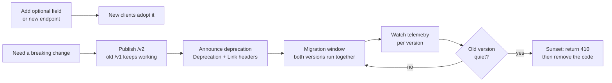

# API Lifecycle and Software Design

> **Interview answer (say this first).** An API is a published contract, not a function call: clients you cannot redeploy depend on the exact field names, types, enum values, status codes, and error shapes you return. Design for change by making only additive changes, having clients tolerate unknown fields and unknown enum values, and using cursors and stable error codes instead of leaking your internals. Keep the business rules in modules that import neither the web framework nor the ORM, behind small interfaces ("ports") that adapters implement, so you can evolve storage and providers without touching the contract.

## Why this exists

A team ships a mobile app. One day a backend engineer opens a pull request called "tidy up the order model". It renames the JSON field `total_cents` to `total`, and it adds a new value `partially_shipped` to the `status` enum. The tests pass. The web dashboard, which is deployed from the same repository, is updated in the same commit. Everyone is happy.

The mobile app is not. It was built against `total_cents`. On the next request it reads a missing key and shows a blank price, or crashes. Its `switch` on `status` has no branch for `partially_shipped`, so it throws or renders an empty screen. The engineer did nothing wrong by internal standards — the code is cleaner — but the change broke a client that they could not rebuild. Mobile releases go through app-store review, and many users are on old phones that will never update. A rename that looked like a five-minute change becomes a support incident.

Three lessons fall out of that story.

- **A field rename is a breaking change**, even when your own code stops using the old name.
- **A new enum value is a compatibility decision**, because the client has to understand it.
- **You cannot force an upgrade** on clients you do not control. The contract must bend, not the client.

The second problem is quieter. Suppose the same service puts its business rules directly inside FastAPI route functions, and those functions call SQLAlchemy models directly. Now:

- You cannot test a pricing rule without a database and a running web framework.
- A database column rename silently changes the API, because the ORM object *is* the response.
- Swapping the model provider or the payment provider means editing the route, and every route that touches it.
- Import groups become circular: the route imports the model, the model imports settings that import the route.

Tangled modules turn every design change into a risky, cross-cutting edit. Clean boundaries are what make the API contract safe to evolve.

## Start from zero

| Word | Plain meaning |
| --- | --- |
| **Interface** | The small set of operations one part of the system exposes to another, and the shapes of the data crossing it. |
| **Contract** | The interface plus its promises: field names, types, enum values, status codes, error shapes, and behaviour. |
| **Backwards compatible** | An old client keeps working against the new server. |
| **Forwards compatible** | An old client keeps working against a newer server, because it ignores fields it does not recognise. |
| **Additive change** | You only add: a new optional field, a new endpoint, a new optional parameter. Nothing existing moves. |
| **Versioning** | Labelling a contract so two shapes can exist at once, for example `/v1/` and `/v2/`. |
| **Deprecation** | Announcing that a resource is no longer recommended while it still works. |
| **Sunset** | The date a deprecated resource will stop responding. |
| **Semantic versioning** | `MAJOR.MINOR.PATCH`: major allows breaking changes, minor adds features, patch fixes bugs. |
| **Pagination** | Splitting a long list into pages. Offset uses "skip N"; cursor uses "continue after this exact row". |
| **Idempotency key** | A client-supplied unique string so that a repeated request has the effect of one request. |
| **Error contract** | The stable shape and codes of your error responses, which clients switch on. |
| **Problem details (RFC 9457)** | A standard JSON error format: `type`, `title`, `status`, `detail`, `instance`, plus extensions. |
| **Coupling** | How much one module must know about another. Low coupling is good. |
| **Cohesion** | How well the parts of one module belong together. High cohesion is good. |
| **Dependency inversion** | Business rules define the interface; the database and framework implement it, not the other way round. |
| **Port and adapter** | A port is the interface the domain owns; an adapter is a concrete implementation of it. |
| **Bounded context** | A boundary inside which one model and one vocabulary apply; outside it, words mean something else. |
| **Feature flag** | A runtime switch that enables behaviour without a new deployment or version. |
| **Migration window** | The period when the old and new contract both work, so clients can move on their own schedule. |

The one term to internalise first is **contract**. An interface tells you the shape; a contract also tells you the rules. A contract is a promise you make to strangers, and strangers can be mobile apps, partner systems, or an AI agent holding a tool schema.

## The core idea

Think of a wall socket. The shape of the plug is the contract. You can add a new appliance, and the socket still works. You cannot change the shape of the pins without a global recall of every device. Software design is about where you put the sockets, and API design is about never changing the pins.

Two properties make a contract safe to evolve:

1. **Servers add, clients tolerate.** The server adds only optional things; the client ignores fields and enum values it does not recognise.
2. **Changes are announced, not silent.** Deprecation and sunset tell clients when something will stop working, long before it does.

The lifecycle of a change looks like this. Additive changes go live immediately. Breaking changes need a new version and a migration window.



The compatibility table is the thing to memorise. It answers the question that interviewers ask first.

| Change | Breaking? | Why |
| --- | --- | --- |
| Add an optional response field | No | Tolerant clients ignore keys they do not know. Strict-schema clients can still fail. |
| Add an optional request field | No | Old clients simply do not send it; the server supplies a default. |
| Remove a field | Yes | Clients read it and now get nothing. Your code ignoring it is irrelevant. |
| Rename a field | Yes | It is a remove plus an add with a new name. Treat it as a break. |
| Add an enum value | Depends on the client | A client with a default branch is fine; a client that rejects unknown values breaks. |
| Change a field's type | Yes | `"12"` becomes `12`; parsers and validators differ. |
| Add a required request field | Yes | Old clients do not send it, so every old request now fails validation. |
| Relax validation (accept more) | Usually safe | A request that was invalid and rejected now succeeds. Check for downstream assumptions. |
| Tighten validation (accept less) | Breaking | A request that used to work is now rejected. |
| Change an error code or status | Breaking | Clients branch on codes. New codes are additive; changed codes are not. |
| Reorder fields in JSON | No | JSON objects are unordered by specification. |
| Change a default value | Usually breaking | Behaviour changes without the client changing anything. |

## How it works

**1. Define the contract before the code.** Write down the request and response shapes, the status codes, the error format, the pagination rules, and whether a write is idempotent. In FastAPI this is the Pydantic models plus the OpenAPI document they generate. If the contract is not explicit, it still exists — it is just hidden in whatever the ORM happened to serialise that week.

**2. Choose a version strategy.** There are three common ways to expose versions:

- **URI versioning:** `/v1/orders`, `/v2/orders`. Visible, easy to route, easy to log, easy to document. The version is part of the URL, which some purists dislike.
- **Header versioning:** a custom header such as `API-Version: 2`. The URL stays stable, but the version is invisible in a browser and easy to forget in logs.
- **Media-type versioning:** a custom `Accept` type such as `application/vnd.acme.v2+json`. The most "correct" by HTTP semantics and the hardest to operate.

Whichever you pick, **additive plus tolerance is usually better than a new version.** A new version doubles the surface you must maintain and fragments your clients. Reserve versions for genuine breaks. Most "breaking" changes can be reframed as additive: add `total` and keep `total_cents` until the old one is quiet, then remove it in a later version.

**3. Get pagination and filtering right.** Offset pagination is `?offset=40&limit=20`: the server skips forty rows. It is simple and supports jumping to a page. It is also unstable: if someone inserts a row near the start while a client is paging, every later page shifts and the client sees a duplicate or skips a record. Cursor pagination is `?cursor=<opaque token>&limit=20`: the token encodes the sort key of the last row seen, and the query becomes `WHERE (created_at, id) > (?, ?) ORDER BY created_at, id LIMIT 20`. It is stable under concurrent writes and stays fast on large tables. Use cursors for feeds and exports; use offsets only for small, mostly-static lists.

**4. Define the error contract once.** Errors are part of the contract even though we usually forget them. A client needs a stable machine-readable code to branch on. Do not make clients parse a human sentence. RFC 9457 problem details gives you a standard shape: `type` (a URI identifying the problem class), `title` (short human summary), `status`, `detail` (this occurrence), and `instance` (this occurrence's URI). Return it with the `application/problem+json` media type. New problem types are additive; changing an existing `type` URI or its meaning is breaking.

**5. Announce deprecation and sunset.** Deprecation says "stop using this". Sunset says "it stops working on this date". Two standards cover them:

- **RFC 9745** defines the `Deprecation` response header. Its value is an HTTP structured-field date, written as `@<unix seconds>`, for example `Deprecation: @1767225600`.
- **RFC 8594** defines the `Sunset` response header. Its value is an HTTP-date, for example `Sunset: Fri, 01 Jan 2027 00:00:00 GMT`.

Both are hints, so publish them everywhere and link to a migration guide with `Link: <...>; rel="deprecation"`. The endpoint keeps behaving exactly as before during the migration window. Deprecation is an announcement, not a behaviour change.

**6. Draw module boundaries.** A module should have one reason to change (high cohesion) and know as little as possible about its neighbours (low coupling). A useful split for a service is: the **domain** (entities and business rules), the **application layer** (use cases that orchestrate the domain), and the **adapters** (HTTP, database, model providers, queues). Dependencies point inward: adapters may import the domain, never the reverse.

**7. Invert the dependencies.** Business logic must not import FastAPI or SQLAlchemy. Instead, the domain declares the ports it needs as small interfaces — "get an order", "save an order", "call the model". Concrete adapters implement them. The dependency arrow and the import arrow point in opposite directions, which is why it is called **dependency inversion**. This is what lets you test a rule with an in-memory fake and swap Postgres for another store without editing the rule.

**8. Put configuration on a boundary.** Settings are read once at startup and passed inward as plain values. A domain object should never call `os.environ` mid-request; that makes it untestable and hides a required input.

**9. Put validation in two places, for two reasons.** At the **edge**, Pydantic validates shape: types, lengths, ranges, required fields. In the **domain**, you enforce invariants: "an order total must be positive", "a refund cannot exceed the charge". Edge validation protects your code from malformed input; domain validation protects your data from illegal states. Neither replaces the other, and the database constraint is a third, last line of defence.

## The syntax you will use

**A versioned router with a prefix.** Each resource lives in its own module; the app is a short composition list.

```python
from fastapi import APIRouter

v1 = APIRouter(prefix="/v1", tags=["v1"])
v2 = APIRouter(prefix="/v2", tags=["v2"])

@v1.get("/orders")
def list_orders_v1():
    return {"orders": []}

app.include_router(v1)
app.include_router(v2)
```

**Response models, with `None` fields hidden.** `response_model` filters output so internal fields cannot leak, and `response_model_exclude_none=True` omits fields whose value is `None`.

```python
from pydantic import BaseModel

class OrderOut(BaseModel):
    id: str
    total_cents: int
    estimated_delivery: str | None = None   # additive: optional, safe to add

@v1.get("/orders/{order_id}", response_model=OrderOut,
        response_model_exclude_none=True)
def get_order(order_id: str) -> OrderOut:
    return OrderOut(id=order_id, total_cents=2500)
    # JSON omits "estimated_delivery" when it is None
```

**Status codes and the `Response` object.** Use named constants, and inject `Response` when you need to set headers while still returning a model.

```python
from fastapi import Response, status

@v1.post("/orders", response_model=OrderOut,
         status_code=status.HTTP_201_CREATED)
def create_order(response: Response) -> OrderOut:
    response.headers["Location"] = "/v1/orders/123"
    return OrderOut(id="123", total_cents=2500)
```

**A `ProblemDetail` model.** This model makes `type`, `title`, and `status` required; RFC 9457 itself treats all members as optional (with `type` defaulting to `about:blank`). `exclude_none` keeps the JSON small.

```python
from pydantic import BaseModel

class ProblemDetail(BaseModel):
    type: str = "about:blank"
    title: str
    status: int
    detail: str | None = None
    instance: str | None = None
```

**An error handler that emits problem details.** Map your domain error once, centrally, instead of repeating it in every route.

```python
from fastapi import FastAPI, Request
from fastapi.responses import JSONResponse

class DomainError(Exception):
    def __init__(self, code: str, detail: str, status: int = 400) -> None:
        self.code = code
        self.detail = detail
        self.status = status

app = FastAPI()

@app.exception_handler(DomainError)
async def domain_error_handler(request: Request, exc: DomainError) -> JSONResponse:
    problem = ProblemDetail(
        type=f"https://errors.example.com/{exc.code}",
        title=exc.code.replace("_", " ").title(),
        status=exc.status,
        detail=exc.detail,
        instance=str(request.url.path),
    )
    return JSONResponse(
        status_code=exc.status,
        content=problem.model_dump(exclude_none=True),
        media_type="application/problem+json",
    )
```

**Pagination query parameters.** `limit` is bounded so one client cannot ask for a million rows; `cursor` is opaque and optional.

```python
from fastapi import Query

@v1.get("/orders")
def list_orders(
    limit: int = Query(20, ge=1, le=100),
    cursor: str | None = None,
):
    ...
```

**`Depends` injecting a port.** The endpoint depends on an interface, not on a concrete database.

```python
from fastapi import Depends

def get_order_service() -> OrderService:
    return OrderService(SqlOrderRepository(session_factory()))

@v1.get("/orders/{order_id}", response_model=OrderOut)
def get_order(order_id: str, service: OrderService = Depends(get_order_service)):
    return service.get(order_id)
```

**Deprecation and sunset headers on a live endpoint.** `deprecated=True` also marks the route in the OpenAPI document.

```python
from datetime import datetime, timezone

DEPRECATED_AT = int(datetime(2026, 1, 1, tzinfo=timezone.utc).timestamp())
SUNSET_AT = "Fri, 01 Jan 2027 00:00:00 GMT"

@v1.get("/legacy/orders", deprecated=True)
def legacy_orders(response: Response):
    response.headers["Deprecation"] = f"@{DEPRECATED_AT}"
    response.headers["Sunset"] = SUNSET_AT
    response.headers["Link"] = '<https://api.example.com/deprecation>; rel="deprecation"'
    return {"orders": []}
```

**Python `warnings` and `DeprecationWarning`.** Deprecation is not only an HTTP idea. When you mark your own Python function as deprecated, issue a warning and turn warnings into errors in tests so callers migrate.

```python
import warnings

def old_pricing_rule(total: int) -> int:
    warnings.warn(
        "old_pricing_rule is deprecated; use pricing_rule",
        DeprecationWarning,
        stacklevel=2,
    )
    return pricing_rule(total)

# In a test, make any deprecated call fail loudly.
warnings.simplefilter("error", DeprecationWarning)
```

**A Protocol-based port.** `Protocol` gives structural typing: any object with the right methods satisfies it, with no inheritance.

```python
from typing import Protocol

class OrderRepository(Protocol):
    def add(self, order: Order) -> None: ...
    def get(self, order_id: str) -> Order | None: ...
    def list_after(self, cursor: tuple[str, str] | None, limit: int) -> list[Order]: ...
```

## Examples: simple to real

**Example 1 — add an optional field safely.** The smallest useful change: the dashboard needs an order's estimated delivery, and the old mobile client must keep working.

```python
from pydantic import BaseModel

class OrderOut(BaseModel):
    id: str
    total_cents: int
    estimated_delivery: str | None = None    # new, optional

@v1.get("/orders/{order_id}", response_model=OrderOut,
        response_model_exclude_none=True)
def get_order(order_id: str) -> OrderOut:
    return OrderOut(id=order_id, total_cents=2500, estimated_delivery="2026-01-03")
```

The old client ignores `estimated_delivery` because it never reads that key. The new client reads it. Nothing was renamed, removed, or made required, so both clients work against the same endpoint. This is the change you should reach for first. **Never rename; add the new name, migrate consumers, then remove the old one in a later version.**

**Example 2 — cursor pagination.** An offset drifts when rows are inserted; a cursor encodes the position in the data itself. The cursor is the last row's sort key, base64-encoded so it is opaque to clients.

```python
import base64
import json
from datetime import datetime

def encode_cursor(created_at: datetime, order_id: str) -> str:
    raw = json.dumps({"created_at": created_at.isoformat(), "id": order_id})
    return base64.urlsafe_b64encode(raw.encode()).decode()

def decode_cursor(cursor: str) -> tuple[str, str]:
    data = json.loads(base64.urlsafe_b64decode(cursor.encode()))
    return data["created_at"], data["id"]

@v1.get("/orders")
def list_orders(
    limit: int = Query(20, ge=1, le=100),
    cursor: str | None = None,
):
    after = decode_cursor(cursor) if cursor else None
    rows = repo.list_after(after, limit + 1)     # fetch one extra to detect more
    has_more = len(rows) > limit
    page = rows[:limit]
    next_cursor = encode_cursor(page[-1].created_at, page[-1].id) if has_more else None
    return {"orders": page, "next_cursor": next_cursor}
```

The query behind `list_after` orders by `(created_at, id)` and filters with `WHERE (created_at, id) > (?, ?)`. Because the position is anchored to a real row, inserting or deleting rows does not shift the page. Clients follow `next_cursor` until it is `None`. **Do not let clients construct cursors or treat them as offsets**; the moment they parse the token, it stops being an implementation detail.

**Example 3 — one error contract everywhere.** Domain code raises a typed error; one handler turns it into RFC 9457 problem details. Clients branch on `type`, which is stable.

```python
from fastapi import FastAPI, Request
from fastapi.responses import JSONResponse
from pydantic import BaseModel

class ProblemDetail(BaseModel):
    type: str = "about:blank"
    title: str
    status: int
    detail: str | None = None
    instance: str | None = None

class DomainError(Exception):
    def __init__(self, code: str, detail: str, status: int = 400) -> None:
        self.code, self.detail, self.status = code, detail, status

app = FastAPI()

@app.exception_handler(DomainError)
async def handle_domain_error(request: Request, exc: DomainError) -> JSONResponse:
    problem = ProblemDetail(
        type=f"https://errors.example.com/{exc.code}",
        title=exc.code.replace("_", " ").title(),
        status=exc.status,
        detail=exc.detail,
        instance=str(request.url.path),
    )
    return JSONResponse(
        status_code=exc.status,
        content=problem.model_dump(exclude_none=True),
        media_type="application/problem+json",
    )

@v1.post("/orders")
def create_order():
    raise DomainError("out_of_stock", "Item 42 is out of stock", 409)
```

A client checks `type == ".../out_of_stock"` and reacts. `title` and `detail` are for humans and may be reworded or translated at any time, so never parse them. Adding a new `type` is additive; changing what an existing `type` means is breaking.

**Example 4 — a service behind a Protocol port, with a fake and a real adapter.** The domain owns the interface; the database plugs in behind it.

```python
from dataclasses import dataclass
from typing import Protocol

@dataclass(frozen=True)
class Order:
    id: str
    total_cents: int

class OrderRepository(Protocol):
    def add(self, order: Order) -> None: ...
    def get(self, order_id: str) -> Order | None: ...

class OrderService:
    def __init__(self, repo: OrderRepository) -> None:
        self._repo = repo

    def place(self, order: Order) -> Order:
        if order.total_cents <= 0:
            raise DomainError("invalid_total", "total must be positive", 422)
        self._repo.add(order)
        return order
```

The service imports nothing from FastAPI or SQLAlchemy. The in-memory fake makes tests fast and database-free.

```python
class InMemoryOrderRepository:
    def __init__(self) -> None:
        self._orders: dict[str, Order] = {}

    def add(self, order: Order) -> None:
        self._orders[order.id] = order

    def get(self, order_id: str) -> Order | None:
        return self._orders.get(order_id)

def test_place_rejects_a_zero_total():
    service = OrderService(InMemoryOrderRepository())
    import pytest
    with pytest.raises(DomainError):
        service.place(Order(id="1", total_cents=0))
```

The real adapter translates domain objects to database rows, so a column rename never leaks into the API.

```python
class SqlOrderRepository:
    def __init__(self, session: Session) -> None:
        self._session = session

    def add(self, order: Order) -> None:
        self._session.add(OrderRow(id=order.id, total_cents=order.total_cents))
        self._session.flush()

    def get(self, order_id: str) -> Order | None:
        row = self._session.get(OrderRow, order_id)
        return None if row is None else Order(id=row.id, total_cents=row.total_cents)
```

FastAPI wires the real adapter at the edge. Tests wire the fake, either by constructing `OrderService` directly or by overriding the dependency.

```python
def get_order_service(session: Session = Depends(get_session)) -> OrderService:
    return OrderService(SqlOrderRepository(session))

app.dependency_overrides[get_order_service] = lambda: OrderService(
    InMemoryOrderRepository()
)
```

This is **ports and adapters** (also called hexagonal architecture). The dependency arrow points inward, so the storage choice is a detail, not a foundation.

**Example 5 — deprecate an endpoint while the old client keeps working.** `/v1/orders` is replaced by `/v2/orders`. During the window, `/v1` still returns the old shape, and every response announces the end date.

```python
from datetime import datetime, timezone

DEPRECATED_AT = int(datetime(2026, 1, 1, tzinfo=timezone.utc).timestamp())
SUNSET_AT = "Fri, 01 Jan 2027 00:00:00 GMT"

@v1.get("/orders", response_model=list[OrderOut], deprecated=True)
def list_orders_v1(response: Response):
    response.headers["Deprecation"] = f"@{DEPRECATED_AT}"
    response.headers["Sunset"] = SUNSET_AT
    response.headers["Link"] = '<https://api.example.com/deprecation>; rel="deprecation"'
    return repo.list_all()
```

The headers are the machine-readable signal. A logging client can alert its owners; a human can read the linked guide. The endpoint behaves identically until the sunset date, so a client that ignores the headers still works. When the sunset arrives, return `410 Gone` with a problem-details body for a short period, then remove the route. **Do not sunset before the data shows the old version is quiet**, or you are guessing about your own clients.

## In production

- **Never break a contract silently.** A rename or removal in a pull request is invisible to your tests if the tests were updated in the same commit. Require an explicit version or migration plan for any change to an existing response shape.
- **Make clients tolerant, and do not set `additionalProperties: false`.** A client schema that forbids unknown fields turns every additive server change into a break. Ignore unknown fields; ignore unknown enum values by falling back to a safe default.
- **You cannot force a mobile upgrade.** App-store review, old operating systems, and offline devices mean some clients stay on old versions for years. Design as if every client you have ever shipped is still calling you.
- **Add enum values before clients need them, and never remove one.** Instruct clients to treat an unknown value as "unknown", not as an error. If a client cannot handle unknowns, gate the new value behind a new version.
- **Run database migrations and API versions as one plan.** Use expand-and-contract: add the new column, dual-write or backfill, switch reads, keep serving the old API version, and only drop the old column after the old version is sunset. Dropping a column that an old API version still reads is an outage.
- **Removing a field is breaking even if your code ignores it.** The server does not decide compatibility; the client does. Check the OpenAPI diff for removals and renames, not just your own imports.
- **Cursor pagination survives concurrent writes; offset does not.** A feed with `?offset=` will show duplicates and skipped rows as soon as data changes under the client. Prefer keyset cursors for anything that can grow.
- **Error codes are part of the contract.** A stable `type` URI is an API; a human message is not. Version a problem type's meaning the same way you version a response field.
- **Test the contract in CI, not just your own code.** Validate real responses against the published OpenAPI schema, and fail the build when a documented field is removed, renamed, or made required. A generated client compiles against the schema, so generate one in CI.
- **Feature flags are not versions.** A flag changes behaviour for a subset of traffic without changing the contract; a version changes the contract. Use flags to decouple deploy from release, and versions to run two contracts side by side.
- **Deprecation needs telemetry.** You cannot know when a version is safe to remove unless you can answer "who still calls it, how often, and how important are they?". Log the API version, the client identifier, and the user agent per request from day one.
- **Do not leak the ORM through the API.** Never return a SQLAlchemy model directly. Use a separate output model, so a database column rename is an internal refactor rather than a client-facing break.

## Interview questions

### 1. Which API changes are breaking, and which are safe?

**Answer.** Additive changes are safe: a new optional response field, a new optional request field with a default, a new endpoint. Breaking changes change something a client already relies on: removing or renaming a field, changing a type, adding a required request field, tightening validation, or changing a status code. Adding an enum value depends on the client — tolerant clients ignore it, strict ones break. Relaxing validation is usually safe.

**Follow-up: "Is adding a field always safe?"** Not against a client that forbids unknown properties, such as a JSON Schema with `additionalProperties: false` or a generated parser in strict mode. That is why you advise clients to be tolerant as part of the contract.

**Trap.** Judging compatibility by your own codebase. If your dashboard uses the field and you update it in the same commit, you conclude the rename is safe — and the mobile app proves you wrong.

### 2. How do you shape error responses, and why does RFC 9457 matter?

**Answer.** Return a stable, machine-readable error object with a `type` URI that identifies the problem class, a short `title`, the `status`, an occurrence `detail`, and an `instance`. RFC 9457 standardises exactly this shape and the `application/problem+json` media type, so you do not invent a new format and your clients can use off-the-shelf tooling. Clients branch on `type`; humans read `title` and `detail`.

**Follow-up: "How do you evolve errors?"** Add new `type` URIs freely; they are additive. Never change what an existing `type` means or remove one without a version, because a client's error handling depends on it.

**Trap.** Putting an error message string in a field named `code` and telling clients to switch on the text. The first translation or wording fix silently breaks them.

### 3. URI, header, or media-type versioning — which do you choose?

**Answer.** URI versioning (`/v1/orders`) is visible, trivially routable, easy to log, and easy to document; it is the pragmatic default. Header versioning keeps URLs stable but hides the version from browsers and logs. Media-type versioning is the most semantically pure and the most operationally expensive. Choose one, apply it consistently, and use it only for genuine breaks — additive-plus-tolerance covers most changes without a new version.

**Follow-up: "What is the cost of a version?"** Every version is another contract to maintain, test, document, and eventually sunset. Version proliferation fragments clients and doubles surface area.

**Trap.** Adding a version for every change. That is version pollution; most changes should be additive, not versioned.

### 4. Why is cursor pagination better than offset for a feed?

**Answer.** Offset pagination says "skip the first forty rows". If a row is inserted or deleted while a client is paging, every later page shifts, so the client can see a record twice or miss one entirely. A cursor encodes the sort key of the last row seen, and the next query asks for rows strictly after that key, so concurrent writes do not disturb the page. Cursors also stay fast deep into large tables, where a large offset makes the database scan and discard many rows.

**Follow-up: "When is offset acceptable?"** Small, stable, or admin-facing lists where users want to jump to page five. Feeds and exports should use cursors.

**Trap.** Calling a cursor "just the offset encoded". A cursor is a position in the data, and clients must treat it as opaque.

### 5. What is dependency inversion, and what are ports and adapters?

**Answer.** Dependency inversion means high-level policy defines the interface it needs, and low-level details implement it. A **port** is an interface the domain owns, such as `OrderRepository`; an **adapter** is a concrete implementation, such as a Postgres or in-memory repository. The domain imports neither the web framework nor the ORM, so business rules are testable without infrastructure and the storage or model provider can change without touching the rules.

**Follow-up: "Why does this matter for an AI service?"** Model providers change frequently, and they are slow and costly to call in tests. A `ModelPort` with a fake adapter keeps tests fast and dependencies swappable.

**Trap.** Defining the interface in the adapter package. Then the domain still depends on infrastructure, and the arrow points the wrong way.

### 6. How do you deprecate an endpoint without breaking clients?

**Answer.** Add the replacement first, then keep the old endpoint working and unchanged. Announce the deprecation with the `Deprecation` header (RFC 9745), the end date with the `Sunset` header (RFC 8594), and a link to a migration guide with `Link: <...>; rel="deprecation"`. Watch per-version telemetry until the old version is quiet, then return `410 Gone` for a short period, then remove it.

**Follow-up: "What if traffic never drops?"** You have found a client you did not know about or that cannot migrate. Talk to its owners before forcing the date; the alternative is an outage you chose.

**Trap.** Deprecating by changing behaviour. A `Deprecation` header on an unchanged endpoint is safe; rejecting requests with a `Deprecation` warning is a break, not a warning.

### 7. Is adding an enum value a breaking change?

**Answer.** It depends entirely on the client. A client that treats an unknown value as "unknown" or falls back to a default is fine. A client that switches exhaustively, validates against a closed list, or uses a strict generated type will fail. Since you cannot audit every client, treat a new enum value as a coordinated change: announce it, give clients time to add tolerance, and use a new version if you cannot.

**Follow-up: "What is the safe server rule?"** Never remove an enum value, and never add one before clients can handle it. Removing an in-use value is always breaking.

**Trap.** Assuming JSON is self-describing. A new string is just a string; the client decides whether it is valid.

### 8. How do you decide between a feature flag and a new API version?

**Answer.** A feature flag changes behaviour for selected traffic without changing the contract, so it decouples deploy from release and gives you a kill switch. A new version changes the contract itself, so old and new clients can coexist for a migration window. If the wire format is unchanged and only behaviour differs, use a flag. If fields, types, or semantics change for clients, use a version.

**Follow-up: "How do you verify you have not broken a client?"** Contract tests in CI: validate real responses against the OpenAPI schema, diff the schema against the previous release, and fail on removals or renames.

**Trap.** Using a flag as a permanent version. Flags accumulate and their combinations multiply; clean them up after the rollout.

## Remember this

- **An API is a contract with strangers you cannot redeploy.** Add, never rename; make optional, never required; announce, never surprise.
- **The compatibility table is the answer.** Adding optional things is safe, removing or renaming is breaking, and a new enum value depends on client tolerance.
- **Clients tolerate, servers add.** Ignore unknown fields and enum values; never forbid additional properties.
- **Deprecate with headers and telemetry, sunset only when the old version is quiet.** RFC 9745 for `Deprecation`, RFC 8594 for `Sunset`, and a `Link` to the migration guide.
- **Invert your dependencies:** business rules own Protocol ports, adapters implement them, and the ORM never leaks through the API.
