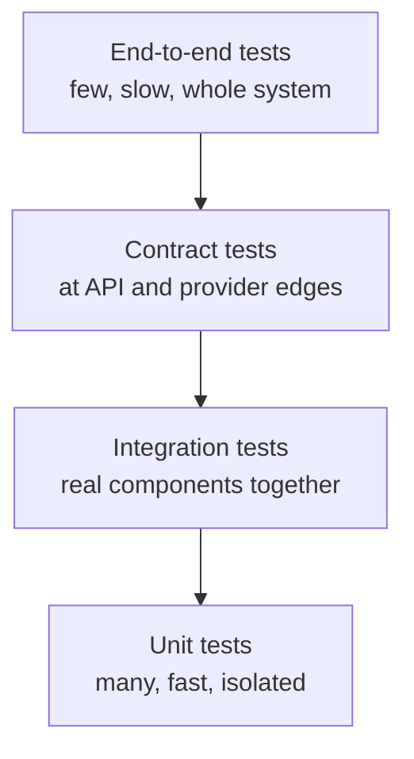
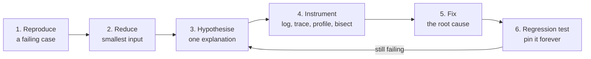

# Testing, Debugging, and Performance Engineering

> **Interview answer (say this first).** Testing is a strategy, not a folder of files: many fast unit tests, fewer integration tests, a handful of contract and end-to-end tests, and no tolerance for flaky tests. Debugging is a loop — reproduce, reduce, hypothesise, instrument, fix, then keep the regression test. Performance work is measurement first: define a latency budget, measure p95, profile to find the bottleneck, fix that one thing, and re-measure.

## Why this exists

Two failures teach this page, and they look unrelated until you see the same missing step behind both.

**The bug the unit tests blessed.** A team shipped an order price using this code:

```python
# app/pricing.py
def apply_discount(amount: Decimal, percent: float) -> Decimal:
    factor = Decimal(1) - Decimal(str(percent)) / Decimal(100)
    return (amount * factor).quantize(Decimal("0.01"), rounding=ROUND_HALF_UP)
# app/orders.py
class Order:
    def total(self) -> Decimal:
        return apply_discount(self.subtotal, self.discount_percent)
# app/api.py
def order_response(order: Order) -> dict:
    total = apply_discount(order.total(), order.discount_percent)   # applied twice
    return {"id": order.id, "total": str(total)}
```

Every test for `apply_discount` passed. Every test for `Order.total` passed. The defect lived in the **wiring**: the endpoint discounted a value that was already discounted, so customers were charged less than they should have been. Unit tests replace the boundaries, so they are blind to exactly this class of bug.

**The slow endpoint nobody could explain.** `GET /orders` had a p95 latency of 4.2 seconds. The team guessed the database and added an index. Nothing changed. A profile told a different story: the report builder (`build_report`) fetched each order's customer with one query, inside a loop. That is an **N+1 query** — one query for the page plus one per row. A page of 400 orders ran 401 queries. The fix was a single batched lookup, and p95 fell to about 180 ms.

The common missing step in both stories is **evidence before change**. The tests proved the pieces, not the system. The index was a guess, not a measurement. Testing, debugging, and performance are one discipline, and it answers three questions: Does it work? Why is it broken? Why is it slow?

## Start from zero

| Word | Plain meaning |
| --- | --- |
| **Unit test** | A fast, in-process test of one small piece of logic, with its dependencies replaced. |
| **Integration test** | A test of several real components together, such as a service plus a database or an HTTP layer. |
| **Contract test** | A test that a request or response matches an agreed schema, so consumers do not break. |
| **End-to-end test** | A test that drives the whole deployed system the way a user does, across every real layer. |
| **Property-based test** | A test that states a rule that must hold for all inputs, and lets a tool generate inputs looking for a counterexample. |
| **Mutation testing** | A tool makes small changes ("mutants") to your code and checks that some test fails; a surviving mutant is code no test really checks. |
| **Load test** | Many concurrent requests sent to measure throughput, latency percentiles, and error rate under realistic traffic. |
| **Flaky test** | A test that passes and fails with no code change, usually from shared state, time, ordering, or the network. |
| **Fixture** | Setup and teardown the test framework runs for a test: a client, a database session, a temp directory. |
| **Test double** | Any stand-in for a real dependency. |
| **Stub** | A double that returns fixed answers and records nothing. |
| **Fake** | A small working implementation, such as an in-memory repository. |
| **Spy** | A double that records how it was called, often wrapping the real object. |
| **Mock** | A double pre-programmed with expectations that can fail the test if a call does not match. |
| **Coverage** | The fraction of lines or branches executed while tests ran. It measures what ran, not what is correct. |
| **Test pyramid** | The guidance to want many cheap unit tests, fewer integration tests, and very few end-to-end tests. |
| **Hypothesis** | A proposed explanation for a symptom; a guess specific enough to be tested. |
| **Falsification** | Trying to prove a hypothesis wrong. A test that cannot fail proves nothing. |
| **Bisection** | Halving a range of commits (or lines) repeatedly to find the exact change that introduced a bug. |
| **Profiling (CPU / memory / IO)** | Measuring where a program spends CPU time, allocates memory, or waits on input/output. |
| **Flame graph** | A stacked chart where each bar is a function and its width is time; the widest bars are where the time goes. |
| **p50 / p95 / p99** | Percentile latencies: the value below which 50%, 95%, or 99% of requests fall. |
| **Saturation** | How full a resource is (CPU, a connection pool, a queue). Near 100%, latency rises sharply. |
| **Bottleneck** | The one resource or step that limits the whole system; speeding up anything else buys nothing. |

Two conventions to internalise:

- **A test's value is its ability to fail.** If it cannot fail, it is documentation. A test that passes for the wrong reason is a liability.
- **Report percentiles, not the mean.** An endpoint with a 50 ms mean and a 3 second p95 feels broken to one user in twenty.

## The core idea

A test suite is a net woven at different heights. Unit tests are the fine mesh near the ground: cheap, close to the code, and good at catching small local mistakes. Integration tests are the wider mesh above: they catch wiring between parts. End-to-end tests are the few strong ropes: they catch "the whole thing is down". Contract tests guard the edges where other people's code meets yours.



| Level | Scope | Typical speed | Catches | Blind spot |
| --- | --- | --- | --- | --- |
| **Unit** | One function or class, I/O faked | milliseconds | Logic errors, edge cases, pure computation | Wiring, configuration, serialisation |
| **Integration** | Several real parts (app plus database) | 0.1–5 s | Queries, transactions, routing, serialisation | The full user journey, third parties |
| **Contract** | Response against an agreed schema | milliseconds | Breaking field, type, or status changes | Whether the data is correct |
| **End-to-end** | The deployed system | seconds to minutes | Environment and config failures | Localising the root cause |

The second core idea is the **debugging loop**. Debugging is not staring at code; it is the scientific method with a syntax theme.



The third core idea is **measure before you optimise**. A performance change without a baseline number and a target number is a guess, and a fix that is not re-measured is a rumour. Define a budget, measure, locate the bottleneck, change one thing, measure again.

## How it works

**What each test level is for, and what it costs.** A unit test is fast and points precisely at a broken function, but only because it replaced reality with doubles — so it cannot see how the parts fit. An integration test runs real components together and catches wiring, query shape, migrations, and serialisation, at the cost of speed and setup. A contract test pins the shape you publish, which protects consumers you cannot redeploy; the cost is that you must update it deliberately when the shape changes on purpose. An end-to-end test proves the deployed system works, but it is slow, flaky, and bad at telling you *where* it broke. The guiding rule: **a bug that reaches production should be pinned by the cheapest test level that can see it.**

**What makes a test trustworthy.** Four properties:

1. **Deterministic.** The same code gives the same result every run. No real clock, no unseeded randomness, no live network.
2. **Isolated.** It cannot affect another test and does not depend on test order. Its data is its own; files go in `tmp_path`; a database transaction is rolled back.
3. **Fast.** Unit tests finish in milliseconds, so they run on every save. Slow tests are marked and run separately.
4. **Fails for one reason.** One behaviour per test, with an assertion that names the cause. A test that fails for five reasons tells you nothing.

A test that lacks these is worse than no test, because it teaches the team to re-run CI and ignore red.

**Contract tests.** A contract is the shape you promise: field names, types, status codes, and error bodies. A contract test validates a real response against that shape — for example, against the OpenAPI document FastAPI generates. It catches a renamed field or a changed enum before a consumer does. The same idea works between services: a consumer-driven contract records what the consumer expects, and the provider fails its build if it breaks that promise.

**Property-based testing.** Instead of listing example inputs, you state a property that must hold for *all* inputs — "merging intervals never grows the total covered length". A tool such as `hypothesis` generates many inputs trying to falsify the rule, and when it finds a counterexample it **shrinks** it to the smallest failing case. Good properties are round-trips (`decode(encode(x)) == x`), invariants (length preserved), idempotence (`f(f(x)) == f(x)`), and agreement with a slow but obviously correct reference. Use it when the input space is large or an "always true" rule is easy to state; keep example tests for known bugs.

**Debugging: from symptom to root cause.**

1. **Reproduce.** A bug you cannot reproduce is a bug you can only guess about. Capture the smallest input that fails, and write a failing test if you can.
2. **Reduce.** Delete everything irrelevant. The smaller the reproduction, the fewer places the cause can hide.
3. **Hypothesise.** Write one sentence: "The total is wrong because each line is rounded before it is summed." A vague hypothesis cannot be tested.
4. **Instrument.** Read the traceback **bottom-up**: the last line is the error; the frames above show the call path, and the bug is usually in your frame, not the deepest library frame. Add a log or a breakpoint, or **bisect** with `git bisect run <test>` to find the offending commit in log₂(N) runs.
5. **Fix the root cause.** Guarding a `None` that should never occur hides the defect instead of removing it.
6. **Add a regression test.** The test that reproduced the bug stays in the suite, so the same bug cannot return.

**Performance: define, measure, profile, fix, re-measure.**

1. **Define a budget.** "`GET /orders` p95 under 200 ms at 50 requests per second."
2. **Measure a baseline.** Record p50, p95, p99, throughput, error rate, and how full the key resources are.
3. **Profile.** CPU with `cProfile` or `py-spy`; memory with `tracemalloc`; IO with query logs and traces. A flame graph shows the widest bar.
4. **Find the bottleneck.** It is the resource near saturation — CPU, a connection pool, a queue, the database. Speeding up anything else changes nothing.
5. **Fix one thing.** The biggest cost. Usually an algorithm, a missing index, or an N+1 query.
6. **Re-measure.** If the number moved, keep it; if not, revert and return to step 4. Stop when the budget is met.

If CPU time is low while wall time is high, the system is waiting on IO, and rewriting Python will not help. Change the IO pattern instead: batch calls, add a cache, or add concurrency.

## The syntax you will use

**A fixture with setup and teardown.** Code after `yield` runs even when the test fails; annotations throughout use modern unions such as `Order | None`.

```python
import pytest

@pytest.fixture
def sample_order():
    order = Order(id=1, amount=Decimal("100.00"))
    yield order
    order.cancel()
```

**`parametrize`: one test, many cases.** Each tuple is reported separately.

```python
@pytest.mark.parametrize("percent,expected", [(0, "100.00"), (25, "75.00"), (100, "0.00")])
def test_discount(sample_order, percent, expected):
    assert str(sample_order.discounted(percent)) == expected
```

**`monkeypatch`: reversible changes.** Everything is restored after the test.

```python
def test_uses_test_key(monkeypatch):
    monkeypatch.setenv("API_KEY", "test-key")
    assert settings().api_key == "test-key"
```

**`tmp_path`: a private directory per test.**

```python
def test_writes_report(tmp_path):
    out = tmp_path / "report.csv"
    write_report(out)
    assert out.read_text().startswith("order,")
```

**`pytest.approx`: compare floats.** Do not compare floats with `==`.

```python
def test_mean():
    assert mean([1.0, 2.0, 3.0]) == pytest.approx(2.0, rel=1e-9)
```

**Markers: `skip`, `xfail`, and `slow`.**

```python
@pytest.mark.slow
def test_full_pipeline(): ...

@pytest.mark.skip(reason="needs a real database")
def test_migration(): ...

@pytest.mark.xfail(reason="known bug #482")
def test_rounding(): ...
```

**`hypothesis` with `@given`.** It generates inputs and shrinks any failure.

```python
from hypothesis import given, strategies as st

@given(st.lists(st.integers(min_value=0, max_value=1000)))
def test_sorted_is_ordered(values):
    result = my_sort(values)
    assert all(a <= b for a, b in zip(result, result[1:]))
```

**Coverage.** `--cov-branch` checks both directions of each `if`; `term-missing` lists lines no test ran.

```bash
pytest --cov=app --cov-branch --cov-report=term-missing
```

**CPU profile and `pstats`.** Sort by `tottime` (time inside the function) to find work, and by `cumtime` to find the path.

```python
import cProfile
import pstats

with cProfile.Profile() as profile:
    build_report(orders, repo)

pstats.Stats(profile).sort_stats("tottime").print_stats(5)
```

**A wall-clock stopwatch with `time.perf_counter`.** It is monotonic, so it cannot jump backwards like `time.time()`.

```python
import time

start = time.perf_counter()
build_report(orders, repo)
elapsed_ms = (time.perf_counter() - start) * 1000
print(f"build_report took {elapsed_ms:.1f} ms")
```

**Memory with `tracemalloc`.**

```python
import tracemalloc

tracemalloc.start()
rows = build_report(orders, repo)
current, peak = tracemalloc.get_traced_memory()
tracemalloc.stop()
print(f"peak {peak / 1024:.1f} KiB")
```

**API tests with `TestClient` and `httpx`.** `TestClient` drives the ASGI app (ASGI, the Asynchronous Server Gateway Interface, is the async interface FastAPI implements) in-process; the `with` block runs lifespan startup and shutdown.

```python
from fastapi.testclient import TestClient
import httpx
import pytest

def test_health():
    with TestClient(app) as client:
        response = client.get("/health")
    assert response.status_code == 200

@pytest.mark.anyio                 # needs an async plugin: anyio or pytest-asyncio
async def test_async_endpoint():
    transport = httpx.ASGITransport(app=app)
    async with httpx.AsyncClient(transport=transport, base_url="http://test") as client:
        response = await client.get("/orders")
    assert response.status_code == 200
```

Without the marker (and an async plugin such as `anyio` or `pytest-asyncio`), pytest *skips* an `async def` test with a warning. A skipped test is not a pass, so treat an unexpected skip as a failure.

## Examples: simple to real

**Example 1 — a parametrised unit test.** One function, several inputs, each reported on its own.

```python
# app/pricing.py
from decimal import Decimal, ROUND_HALF_UP

def apply_discount(price: Decimal, percent: float) -> Decimal:
    if not 0 <= percent <= 100:
        raise ValueError("percent must be between 0 and 100")
    factor = Decimal(1) - Decimal(str(percent)) / Decimal(100)
    return (price * factor).quantize(Decimal("0.01"), rounding=ROUND_HALF_UP)

# tests/test_pricing.py
from decimal import Decimal
import pytest
from app.pricing import apply_discount

@pytest.mark.parametrize(
    "price,percent,expected",
    [
        (Decimal("10.00"), 0, Decimal("10.00")),
        (Decimal("10.00"), 25, Decimal("7.50")),
        (Decimal("9.99"), 10, Decimal("8.99")),     # 8.991 rounds half up
    ],
)
def test_apply_discount(price, percent, expected):
    assert apply_discount(price, percent) == expected

def test_apply_discount_rejects_bad_percent():
    with pytest.raises(ValueError, match="between 0 and 100"):
        apply_discount(Decimal("10.00"), 120)
```

The parameters are the test cases: if the `9.99` case breaks, the report names it. The `pytest.raises` test proves the guard exists, not just that some error occurs. Note the money is `Decimal`, not `float`, so `8.991` rounds predictably.

**Example 2 — an integration test with a fake at the boundary.** The service and the template renderer are real; only the email gateway is a fake.

```python
# app/notify.py
from dataclasses import dataclass
from decimal import Decimal
from typing import Protocol

class EmailGateway(Protocol):
    def send(self, to: str, subject: str, body: str) -> None: ...

@dataclass
class Order:
    email: str
    total: Decimal

def render_receipt(order: Order) -> str:
    return f"Order total: £{order.total}"

class Notifier:
    def __init__(self, gateway: EmailGateway) -> None:
        self._gateway = gateway

    def send_receipt(self, order: Order) -> None:
        self._gateway.send(order.email, "Your receipt", render_receipt(order))

# tests/test_notify.py
from decimal import Decimal
from app.notify import Notifier, Order

class FakeGateway:
    def __init__(self) -> None:
        self.sent: list[tuple[str, str, str]] = []

    def send(self, to: str, subject: str, body: str) -> None:
        self.sent.append((to, subject, body))

def test_send_receipt_uses_the_rendered_body():
    gateway = FakeGateway()
    Notifier(gateway).send_receipt(Order(email="ada@example.com", total=Decimal("12.50")))
    assert gateway.sent == [("ada@example.com", "Your receipt", "Order total: £12.50")]
```

This catches wiring the unit tests miss: that the notifier passes the rendered body, not the raw order, and addresses it to the customer. A fake records what really crossed the boundary, and it is deterministic and free.

**Example 3 — a property-based test that finds an edge case.** Here is a plausible-looking interval merge with a real bug.

```python
# app/intervals.py
def merge_intervals(intervals: list[tuple[int, int]]) -> list[tuple[int, int]]:
    ordered = sorted(intervals)
    merged: list[tuple[int, int]] = []
    for start, end in ordered:
        if merged and start <= merged[-1][1]:
            merged[-1] = (merged[-1][0], end)      # BUG: ignores a larger previous end
        else:
            merged.append((start, end))
    return merged
```

The property: every input interval must still be covered by some merged interval.

```python
# tests/test_intervals.py
from hypothesis import given, strategies as st
from app.intervals import merge_intervals

_point = st.integers(min_value=0, max_value=100)
_interval = st.builds(lambda a, b: (min(a, b), max(a, b)), _point, _point)

@given(st.lists(_interval, max_size=8))
def test_merged_covers_every_input_interval(intervals):
    merged = merge_intervals(intervals)
    for start, end in intervals:
        assert any(m_start <= start and end <= m_end for m_start, m_end in merged)
```

It finds the bug and shrinks it to a tiny counterexample, something like:

```text
Falsifying example: test_merged_covers_every_input_interval(
    intervals=[(0, 10), (1, 2)],
)
```

The nested interval `(1, 2)` inside `(0, 10)` triggers the bug: the code replaces the end with `2`, shrinking the interval. The fix is `max(merged[-1][1], end)` when extending. No hand-written example would have thought of nesting, which is exactly the value of generating inputs.

**Example 4 — a debugging session: reproduce, bisect, root cause.** Invoices started rounding to the wrong total for customers with many small lines.

First, reproduce it in a failing test:

```python
# tests/test_invoices.py
from decimal import Decimal
from app.invoices import Invoice, Line, total_for

def test_total_matches_sum_of_lines():
    invoice = Invoice(lines=[
        Line(unit_price=Decimal("0.004"), quantity=1),
        Line(unit_price=Decimal("0.004"), quantity=1),
    ])
    assert total_for(invoice) == Decimal("0.01")
```

Two lines of `0.004` sum to `0.008`, which rounds to `0.01` at the end. The test fails with `0.00`, so the code is rounding each line first. The suite passed at the last release and there are 120 commits since, so bisect instead of reading diffs:

```bash
$ git bisect start HEAD v2.3.0
$ git bisect run pytest -q tests/test_invoices.py::test_total_matches_sum_of_lines
# ... 7 runs later ...
<sha> is the first bad commit
```

The commit changed the helper:

```python
# before: round once, on the total
def line_total(line): return line.unit_price * line.quantity
def total_for(invoice):
    return round(sum((line_total(l) for l in invoice.lines), Decimal("0")), 2)

# after (buggy): round every line, then sum
def line_total(line): return round(line.unit_price * line.quantity, 2)
def total_for(invoice):
    return sum((line_total(l) for l in invoice.lines), Decimal("0"))
```

Root cause: rounding at the wrong stage. The fix rounds once at the end, and `test_total_matches_sum_of_lines` stays in the suite as the regression test. Reading a traceback bottom-up would not have helped here — there was no exception, just a wrong number — which is why bisection exists.

**Example 5 — profiling a slow function and fixing the real bottleneck.** The `/orders` endpoint from the opening story. The report builder looks innocent; its repository method is `get(customer_id: int) -> Customer | None`, so the loop must also handle a missing customer.

```python
# app/report.py
def build_report(orders: list[Order], repo: CustomerRepo) -> list[dict]:
    rows = []
    for order in orders:
        customer = repo.get(order.customer_id)     # one query per order
        rows.append({"order": order.id, "customer": customer.name if customer else None})
    return rows
```

A `cProfile` run points at the loop:

```text
   ncalls  tottime  cumtime  filename:lineno(function)
        1    0.002    0.184  app/report.py:8(build_report)
      400    0.180    0.180  app/report.py:21(get)
```

Four hundred calls to `get` for a page of 400 orders is the N+1 signature. The profiler charges overhead to every call, so the time column is misleading here; the call count is the evidence. Against a real database each call is a network round trip, and the APM (application performance monitoring) dashboard shows 401 queries for one request. The fix batches the lookup:

```python
def build_report(orders: list[Order], repo: CustomerRepo) -> list[dict]:
    customers = repo.get_many({order.customer_id for order in orders})   # one query
    return [
        {"order": order.id, "customer": customers[order.customer_id].name if order.customer_id in customers else None}
        for order in orders
    ]
```

Re-measure with `time.perf_counter` and the query count, and check the budget you defined: queries drop from 401 to 2, and p95 falls from 4.2 s to about 180 ms. The index the team added first was optimising the wrong thing; the bottleneck was the number of round trips, not the speed of each one.

## In production

- **A flaky test is worse than no test.** It teaches the team that red does not mean broken, so real failures get ignored. A flake is nearly always shared state, real time, ordering, or the network — fix it or delete it, never retry it into silence.
- **Reproduction is the first debugging step.** If you cannot reproduce the bug, you are guessing. Capture the smallest failing input, ideally as a test, before you change any code.
- **Test behaviour, not implementation.** Asserting private helpers and call order makes the suite break on every refactor while catching nothing. Assert the observable result.
- **Avoid over-mocking.** A mock proves a call happened, not that the behaviour is correct. Chained mocks and piles of `assert_called_with` lines only confirm your own assumptions. Mock at a boundary you do not own, and prefer a fake for stateful collaborators.
- **Integration tests catch what unit tests cannot.** Wiring, configuration, migrations, transaction boundaries, and serialisation all live *between* the pieces. If every test fakes the boundary, nothing checks the boundary.
- **Coverage is a weak signal.** It shows which lines ran, never whether the assertions were meaningful. Use `--cov-report=term-missing` to find untested branches; never chase a percentage.
- **Contract tests protect consumers.** A renamed field or a new enum value breaks clients you cannot redeploy. Pin the response shape and run the contract test whenever a request or response model changes.
- **Load-test with realistic concurrency, and judge p95, not the mean.** Ten sequential requests on a laptop prove nothing. The mean hides the tail; the p95 is the experience of your slowest common user, and it is the first thing to break as a system nears saturation.
- **Optimise the bottleneck, not the obvious — and watch for the N+1 query.** The most obvious code is often not the constraint; one query per row inside a loop turns a constant into O(n) round trips. Profile first, batch with a single `IN` query or a join, then confirm the query count dropped.
- **Cache invalidation is the hard part of caching.** A cache that is never invalidated serves stale answers after a write; a cache keyed on the wrong fields collides. Cache pure, repeated work, give every entry a key that includes everything it depends on, and set a maximum size.
- **CI must be able to skip network tests.** Tests that need the internet or a paid provider are slow, flaky, and cannot run on every commit. Mark them, replace the provider with a fake in the default run, and exercise the real integration on a schedule or before release.

## Interview questions

### 1. What is the test pyramid, and how does it guide the mix of tests?

**Answer.** Many fast unit tests at the base, fewer integration tests above them, very few end-to-end tests at the top, with contract tests guarding the edges. Each level trades speed and precision for realism: unit tests localise logic bugs in milliseconds, integration tests catch wiring, and end-to-end tests prove the deployed system works but are slow and vague. The pyramid is a default, not a law — a codebase with lots of untested wiring needs more integration tests.

**Follow-up: "What if the end-to-end tests are slow and flaky?"** Keep very few, run them on a schedule or before release, and push coverage down to a cheaper level. A flaky end-to-end suite is a signal that the assertions are too broad.

**Trap.** Treating the pyramid as a fixed ratio, or calling every `TestClient` test "end-to-end". It never leaves the process.

### 2. What makes a test trustworthy?

**Answer.** Four properties: deterministic, isolated, fast, and failing for one reason. Deterministic means no real clock, randomness, or network. Isolated means order-independent, with its own data and state. Fast means unit tests run on every save. Failing for one reason means one behaviour per test with an assertion that names the cause. A test missing these is worse than no test, because it trains people to ignore red.

**Follow-up: "How do you prove order independence?"** Run the suite in random order and in parallel — `pytest-randomly` and `pytest-xdist` will expose shared state quickly.

**Trap.** Assuming a passing test is trustworthy. A flaky test passes sometimes, which is exactly what makes it dangerous.

### 3. When does mocking hurt?

**Answer.** When it replaces so much of the system that the test only checks your own assumptions. A mock proves a call happened, not that the behaviour is correct, and chained mocks mirror the implementation so they break on refactors. Mock only at a boundary you do not own; prefer a fake for stateful collaborators and dependency injection over string-based patch targets.

**Follow-up: "Where is a good boundary?"** The edge of your own code: your repository, your model wrapper, your email gateway. Below that, mocks stop describing real behaviour.

**Trap.** Treating a high mock count and high coverage as thorough testing. Coverage can rise while confidence falls.

### 4. What is property-based testing, and what does `hypothesis` add?

**Answer.** You state a property that must hold for all inputs, and the tool generates many inputs trying to falsify it, then shrinks any failure to a minimal counterexample. It finds edge cases you would not write by hand — empty lists, nested ranges, duplicates. Good properties are round-trips, invariants, and idempotence. It complements example tests; keep examples for known bugs.

**Follow-up: "What makes a bad property?"** One that restates the implementation, so it can never find a real bug. A property should come from the specification, not the code.

**Trap.** Believing random inputs replace understanding. You still have to choose a property that means something.

### 5. Walk me through debugging a failing test.

**Answer.** Reproduce it reliably, reduce it to the smallest failing input, form one hypothesis, then instrument to test that hypothesis — read the traceback bottom-up, add a log or a breakpoint, or bisect commits. Fix the root cause, not the symptom, and keep the failing test as a regression test. Change one variable at a time so the evidence is unambiguous.

**Follow-up: "How do you find which commit broke it?"** `git bisect run pytest -q path::test_name` halving the history, so a range of N commits takes about log₂(N) runs.

**Trap.** Changing several things at once, or adding a `None` guard that hides the defect instead of fixing it.

### 6. A bug reached production even though the unit tests passed. How?

**Answer.** The unit tests covered the pieces, not the wiring. Each function was correct, but the combination — a handler applying a discount the service had already applied, or a response model serialising the wrong field — was untested. Unit tests fake the boundaries, so they cannot see integration, configuration, or serialisation defects. The fix is an integration or contract test at the level where the bug actually lives.

**Follow-up: "Where should the new test go?"** At the cheapest level that would have caught it, usually an API or integration test rather than another unit test.

**Trap.** Adding another unit test for the same function. It will not see the wiring bug, and it grows the suite without adding confidence.

### 7. How do you approach a slow endpoint?

**Answer.** Define a budget, measure a baseline with percentiles, then profile to find the bottleneck. CPU profiles find hot code; query logs and traces find N+1 queries and waits; saturation metrics show which resource is full. Fix the single biggest cost, then re-measure against the budget. If CPU time is low while wall time is high, you are waiting on IO, so change the IO pattern rather than the code constants.

**Follow-up: "Why p95 and not the mean?"** The mean hides the tail. One slow request in twenty is what users complain about, and p95 is the first metric to move when a resource nears saturation.

**Trap.** Optimising the most obvious code without measuring. It is often not the bottleneck, as the added index that changed nothing shows.

### 8. How do you know your tests are worth anything?

**Answer.** Ask whether they can fail. Mutation testing changes the code in small ways and checks that a test fails; surviving mutants point at code no test really checks. Coverage is a weak signal: it shows lines ran, not that the assertions meant anything. Prefer a small suite of strong, trustworthy tests over a large suite of weak ones.

**Follow-up: "Would you enforce a coverage gate?"** A low, stable gate can stop regressions, but a high gate invites tests that execute lines without asserting behaviour. Review the missing branches instead of chasing a number.

**Trap.** Treating 100% coverage as proof of correctness. Lines can run while every assertion is wrong.

## Remember this

- **The pyramid guides the mix:** many fast isolated unit tests, fewer integration tests, a handful of contract and end-to-end tests — always at the cheapest level that can see the bug.
- **A trustworthy test is deterministic, isolated, fast, and fails for one reason.** A flaky test is worse than none.
- **Debug in a loop:** reproduce → reduce → hypothesise → instrument → fix the root cause → keep a regression test. Read tracebacks bottom-up; bisect to find the commit.
- **Measure before you optimise:** define a budget, measure p50/p95/p99, profile, fix the bottleneck (often an N+1 query), and re-measure.
- **Mock at boundaries, test behaviour, and treat coverage as a smell-detector** — never as proof of correctness.
