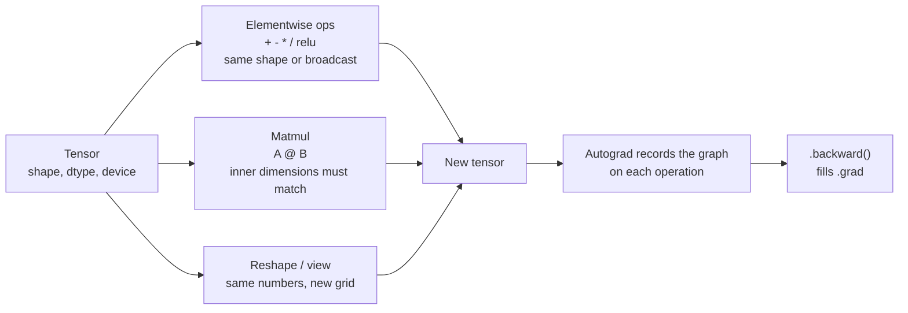

# Tensors and PyTorch

> **Interview answer (say this first).** A tensor is an n-dimensional array of numbers with three key attributes: **shape** (the size of each dimension), **dtype** (the kind of number), and **device** (where it lives — CPU, CUDA, or MPS). PyTorch is the library that builds tensors, runs fast array maths on them, and records the operations so gradients can be computed automatically. Nearly every operation inside an LLM is a tensor reshape or a matrix multiplication.

## Why this exists

Everything a neural network does is arithmetic on arrays of numbers.

```text
text  →  token ids  →  embedding matrix  →  hidden states  →  next-token scores
        each arrow is just array maths on tensors
```

If you tried to do that with plain Python lists, two problems appear immediately.

First, **speed**. A single transformer layer multiplies matrices with millions of numbers. A Python loop over every number would take minutes instead of milliseconds.

Second, **shape discipline**. A language model tracks dozens of tensors at once: batch size, sequence length, hidden size, number of heads, head size. Getting one dimension wrong produces either a crash or, worse, a silently wrong answer.

PyTorch solves both. It stores the numbers in one contiguous block, dispatches the maths to optimised C++ and GPU kernels, and checks the shapes of every operation. And it does one more thing that makes training possible at all: it **remembers which operations you performed**, so it can later compute the gradient automatically. That feature is what the next chapter, forward pass and backpropagation, is built on.

## Start from zero

Every term below appears in every model file you will ever read.

| Word | Plain meaning |
| --- | --- |
| **Tensor** | A container of numbers arranged in a grid of any number of dimensions. A scalar is 0-D, a vector 1-D, a matrix 2-D, a batch of images 4-D. |
| **Rank / ndim** | How many dimensions the tensor has. `torch.randn(2, 3)` has rank 2. |
| **Shape** | The length of each dimension, written `torch.Size([2, 3])`. |
| **Axis / dimension** | One direction of the grid. Axis 0 is rows, axis 1 is columns, and so on. |
| **Scalar** | A single number: `torch.tensor(3.0)`, shape `()` and rank 0. |
| **Vector** | A 1-D tensor, shape `(n,)`. |
| **Matrix** | A 2-D tensor, shape `(rows, cols)`. |
| **dtype** | The numeric type: `float32`, `float16`, `bfloat16`, `int64`, `bool`. It decides precision and memory per number. |
| **device** | Where the data physically lives: `cpu`, `cuda` (NVIDIA GPU), or `mps` (Apple GPU). |
| **Elementwise op** | An operation applied number by number, such as `a + b` or `torch.relu(a)`. Shapes must broadcast. |
| **Broadcasting** | Rules that let tensors of different shapes combine by stretching size-1 dimensions. |
| **Matrix multiplication** | The weighted-sum operation `A @ B`, also called **matmul** or **GEMM**. |
| **Contiguous** | The numbers are stored in one unbroken block in memory, in logical order. |
| **Autograd** | PyTorch's automatic differentiation engine. It records operations and computes gradients. |
| **Gradient** | How much the final loss changes when a tensor changes. Written `.grad`. |
| **Module** | A reusable block of layers with parameters, subclassing `torch.nn.Module`. |
| **Parameter** | A tensor the model learns, registered so the optimizer can update it. |
| **Buffer** | A tensor that is part of the model but is not trained, such as running statistics. |
| **Optimizer** | The object that reads gradients and updates parameters. |

The most important distinction is **shape vs dtype vs device**: three independent properties, and a bug in any one of them breaks the whole model. Mixing a `float32` and a `float64` tensor behaves differently by operation: an elementwise op silently **promotes** the result to `float64` (`float64` wins), which is easy to miss, while matmul and `nn.Linear` raise a dtype error. A CPU tensor and an MPS tensor raise on every operation, because the data lives in different memory. Getting a shape wrong can either raise or quietly produce nonsense.

## The core idea

A tensor is a **spreadsheet with any number of dimensions**. A 2-D tensor is a normal spreadsheet. A 3-D tensor is a stack of spreadsheets. A 4-D tensor is a box of stacks of spreadsheets.

That is the whole data model. Everything else is rules about how to combine them.



The mental model to keep: **a tensor is numbers plus metadata**. The numbers are the data. The metadata is shape, dtype, and device. Operations either create a new tensor or, for speed, sometimes reuse memory — and autograd silently builds a graph of everything you did so it can reverse it later.

| | Python list | NumPy array | PyTorch tensor |
| --- | --- | --- | --- |
| Maths | loops | fast C loops | fast C/GPU kernels |
| Shape checking | none | yes | yes |
| GPU support | no | no | yes |
| Gradients | no | no | **yes** |
| Typical use | generic code | data analysis | neural networks |

The table explains why we do not just use NumPy for deep learning: NumPy is fast, but PyTorch adds the GPU and autograd.

## How it works

1. **You create a tensor.** From a Python list, a NumPy array, or a factory function such as `torch.zeros`, `torch.ones`, `torch.randn`, or `torch.arange`. At creation you choose the dtype and device, or accept the defaults (`float32` on CPU).
2. **PyTorch stores a header plus a data block.** The header holds shape, dtype, device, and a **stride** for each dimension. The strides tell PyTorch how many memory slots to jump to move one step along each axis.
3. **An operation reads the header and the data.** For elementwise ops, it checks that shapes are compatible under broadcasting, then runs one kernel across all numbers.
4. **Broadcasting stretches size-1 dimensions.** Comparing shapes from the right, each dimension must be equal, or one of them must be 1, or one tensor must be missing that dimension. The size-1 side is logically repeated.
5. **Matmul applies the weighted-sum rule.** For `A` of shape `(m, k)` and `B` of shape `(k, n)`, the result has shape `(m, n)`, and `C[i, j] = sum(A[i, :] * B[:, j])`. Batched matmul adds leading batch dimensions.
6. **If any input needs a gradient, autograd records the operation.** It stores enough information to compute the local derivative later, forming a graph whose nodes are tensors and edges are operations.
7. **`loss.backward()` walks that graph backward.** It multiplies local derivatives using the chain rule and writes the result into each leaf tensor's `.grad`.
8. **The optimizer reads `.grad` and updates the parameters.** It does not know or care how the gradient was produced; it only sees numbers.

> **Note:**
>
> **Why device matters.** CPU and GPU memory are separate. A tensor on the GPU cannot be combined with one on the CPU. You move data with `.to("cuda")`, `.to("mps")`, or `.to("cpu")`. Moving is slow, so you move a whole model once and keep batching on the same device.


## The syntax you will use

**Create a tensor.** From a list, or with a factory. `torch.tensor` guesses the dtype.

```python
import torch

a = torch.tensor([[1.0, 2.0, 3.0], [4.0, 5.0, 6.0]])  # shape (2, 3), float32
b = torch.zeros(2, 3)        # all zeros
c = torch.ones(2, 3)         # all ones
d = torch.arange(6)          # [0, 1, 2, 3, 4, 5]
e = torch.randn(2, 3)        # values from a standard normal distribution
f = torch.eye(3)             # identity matrix
```

**Inspect the three attributes.** Every debugging session starts here.

```python
a.shape      # torch.Size([2, 3])
a.dtype      # torch.float32
a.device     # device(type='cpu')
a.ndim       # 2
a.numel()    # 6  (total number of elements)
```

**Choose a dtype explicitly.** Integer literals default to `int64`; float literals default to `float32`.

```python
torch.tensor([1, 2, 3]).dtype          # torch.int64
torch.tensor([1.0, 2.0]).dtype         # torch.float32
torch.tensor([1.5, 2.5]).to(torch.int64)   # [1, 2]  (truncates toward zero)
torch.tensor([1, 2], dtype=torch.float16)  # half precision
```

**Index and slice.** The rules are the same as Python lists, applied per dimension, and `:` means "all of this dimension".

```python
t = torch.arange(12).reshape(3, 4)
t[0]          # first row:  [0, 1, 2, 3]
t[:, 1]       # second column: [1, 5, 9]
t[1:, 2:]     # bottom-right block
t[-1]         # last row
t[:, ::2]     # every other column
t[t > 5]      # boolean mask, returns a flat tensor of matches
```

**Reshape, add, and remove dimensions.** The number of elements must stay the same.

```python
t = torch.arange(12)
t.view(3, 4)          # same memory, new shape
t.reshape(2, 6)       # flexible version, copies only if needed
t.unsqueeze(0)        # shape (1, 12)  — add a dimension
t.unsqueeze(0).squeeze(0)   # back to (12,)
```

**Broadcasting.** Combine different shapes without copying.

```python
x = torch.ones(3, 4)
x + torch.arange(4)          # (3,4) + (4,)   -> (3,4)
x + torch.ones(3, 1)         # (3,4) + (3,1)  -> (3,4)
torch.ones(2, 1, 4) + torch.ones(3, 1)   # -> (2, 3, 4)
```

**Elementwise operations.** Shape in, same shape out.

```python
e = torch.tensor([1.0, 4.0, 9.0])
e.sqrt()      # [1.0, 2.0, 3.0]
torch.exp(torch.tensor(0.0))   # 1.0
torch.relu(torch.tensor([-2.0, 0.0, 3.0]))   # [0.0, 0.0, 3.0]
```

**Matmul.** `@` is the weighted sum over the inner dimension.

```python
m = torch.randn(2, 3)
n = torch.randn(3, 4)
(m @ n).shape          # (2, 4)
(m @ torch.randn(3)).shape   # (2,)  — matrix times vector
```

**Autograd.** Set `requires_grad=True` on the values you want gradients for.

```python
w = torch.tensor(3.0, requires_grad=True)
y = w * w + 2 * w    # y = 15
y.backward()         # dy/dw = 2w + 2 = 8
w.grad               # tensor(8.)
```

**A module.** A class with parameters, a forward method, and automatic registration.

```python
class Tiny(torch.nn.Module):
    def __init__(self):
        super().__init__()
        self.weight = torch.nn.Parameter(torch.ones(2, 2))
        self.bias = torch.nn.Parameter(torch.zeros(2))
        self.register_buffer("running", torch.zeros(1))

    def forward(self, x):
        return x @ self.weight.T + self.bias
```

**An optimizer step.** Zero the old gradients, compute new ones, then update.

```python
model = torch.nn.Linear(2, 1)
opt = torch.optim.SGD(model.parameters(), lr=0.1)

pred = model(torch.tensor([[1.0, 2.0]]))
loss = ((pred - 3.0) ** 2).mean()
loss.backward()
opt.step()          # apply the update
opt.zero_grad()     # clear gradients for the next step
```

**Move to a device.** Build on CPU, then move the whole model and each batch.

```python
device = "cuda" if torch.cuda.is_available() else "mps" if torch.backends.mps.is_available() else "cpu"
model = model.to(device)
batch = batch.to(device)
```

## Examples: simple to real

**Example 1 — inspect a tensor.** Three attributes explain almost every PyTorch error message you will ever see.

```python
a = torch.tensor([[1.0, 2.0, 3.0], [4.0, 5.0, 6.0]])
# shape torch.Size([2, 3])  dtype torch.float32  device cpu  ndim 2
```

`torch.tensor([1, 2, 3])` prints `torch.int64`, while `torch.tensor([1.0, 2.0])` prints `torch.float32`. Model weights are floats, so integer inputs must be converted before matmul.

**Example 2 — indexing and slicing.** Reading one row or column is how you inspect attention head outputs and embeddings.

```python
t = torch.arange(12).reshape(3, 4)
# t[0]        -> [0, 1, 2, 3]
# t[:, 1]     -> [1, 5, 9]
# t[1:, 2:]   -> [[6, 7], [10, 11]]
# t[t > 5]    -> [6, 7, 8, 9, 10, 11]
```

**Example 3 — broadcasting a bias.** A bias vector is added to every row. Broadcasting makes that one line instead of a loop.

```python
x = torch.ones(3, 4)
x + torch.arange(4)             # (3,4) + (4,)   -> (3,4)
torch.ones(2, 1, 4) + torch.ones(3, 1)   # -> (2,3,4)
torch.ones(2, 3) + torch.ones(2, 4)      # RuntimeError: size 3 vs 4
```

The error message names the mismatched dimension, which is why reading shapes is the first debugging skill.

**Example 4 — matmul is many weighted sums at once.** A linear layer applies `x @ W.T + b` to a whole batch.

```python
x = torch.randn(4, 8)     # 4 examples, 8 features
W = torch.randn(16, 8)    # 16 output units
b = torch.randn(16)
out = x @ W.T + b
# out.shape -> torch.Size([4, 16])   one weighted sum per example and unit
```

This is why GPUs dominate AI: a single matmul replaces millions of Python-level multiply-adds.

**Example 5 — `view` vs `reshape`.** Both change the shape. Only `view` demands that the memory already be laid out as the new shape expects.

```python
base = torch.arange(12)
base.view(3, 4)              # works; shares memory with base
base.view(3, 4).t()          # transposed; no longer contiguous
base.view(3, 4).t().view(12) # RuntimeError: view size is not compatible
base.view(3, 4).t().reshape(12)  # works; reshape copies when needed
```

Use `reshape` when unsure; use `view` only when you know the tensor is contiguous and you want the zero-copy guarantee.

**Example 6 — a full training step.** This is the loop from Chapter 1 expressed in tensors.

```python
model = torch.nn.Linear(2, 1)
opt = torch.optim.SGD(model.parameters(), lr=0.1)

x = torch.tensor([[1.0, 2.0]])
y = torch.tensor([[3.0]])

pred = model(x)
loss = ((pred - y) ** 2).mean()
loss.backward()
before = model.weight.detach().clone()
opt.step()
opt.zero_grad()

# model.weight changed after step(): True
# after zero_grad() the default is set_to_none=True, so model.weight.grad is None
```

That last detail trips people up: `zero_grad()` does not write zeros into `.grad`, it sets `.grad` to `None` by default. Use `zero_grad(set_to_none=False)` if you need zero tensors.

## In production

- **Read shapes before reading maths.** When a model crashes, print the shapes of every tensor around the failing line. Most PyTorch bugs are shape bugs, not algorithm bugs.
- **Know the stride tricks.** Transposing or slicing can make a tensor **non-contiguous**; `view` then fails while `reshape` copies. The copy costs memory bandwidth, so prefer layouts that keep tensors contiguous.
- **`.to(device)` is not free.** On a discrete CUDA GPU every transfer crosses the PCIe bus and stalls the GPU; on Apple silicon (MPS) memory is unified, so the copy is cheaper but still not zero-cost. Either way, move the model and the whole batch once, not tensor by tensor inside the loop.
- **Keep dtypes consistent.** A `float32` model with a `float64` input raises a dtype error; mixed precision training uses `bfloat16` or `float16` deliberately, with a `float32` master copy of the weights.
- **`zero_grad()` defaults to `set_to_none=True`.** Gradients accumulate by default. Forgetting `zero_grad()` between steps means each step uses the sum of all previous gradients and training silently diverges.
- **Non-leaf gradients are `None`.** Intermediate tensors do not store `.grad` unless you call `.retain_grad()`. Only leaf tensors that required grad keep it.
- **In-place edits break autograd.** `x += 1` on a leaf that requires grad raises an error, because the value autograd saved is gone. Use `x = x + 1`, or wrap the block in `with torch.no_grad():` when you truly do not need gradients.
- **A second `backward()` on the same graph fails.** The saved intermediate values are freed after the first call. Pass `retain_graph=True` only when you genuinely need two passes, and expect it to cost memory.
- **`detach()` and `no_grad()` stop gradients on purpose.** Use `detach()` to treat a tensor as a constant (for example, a target), and `no_grad()` around evaluation to save memory and time.
- **Parameters, not attributes.** A plain tensor assigned as `self.foo = torch.ones(3)` is invisible to the optimizer. Wrap it in `torch.nn.Parameter` or call `register_buffer`. This mistake produces a model that "does not learn".
- **Module-list repetition shares objects.** `[torch.nn.Linear(8, 8)] * 4` creates four references to **one** layer. Use `torch.nn.ModuleList([...])` or a comprehension so each layer is distinct.
- **Batch dimension first is the common convention.** `nn.MultiheadAttention` defaults to `(seq, batch, dim)`; pass `batch_first=True` to use `(batch, seq, dim)`, which matches the rest of modern code.

## Interview questions

### 1. What is a tensor, and what are its three key attributes?

**Answer.** A tensor is an n-dimensional array of numbers. Its three key attributes are shape (the size of every dimension), dtype (the numeric type such as `float32` or `int64`), and device (where the data lives: CPU, CUDA, or MPS). The data block is shared across views; the metadata describes how to interpret it.

**Follow-up: "Why not just use NumPy?"** NumPy is fast but CPU-only and has no automatic differentiation. PyTorch gives GPU execution and autograd, which are the two things deep learning needs.

**Trap.** Calling a tensor "just a matrix". Rank 0, 3, and 4 tensors are common; a batch of 8 sequences of 16 tokens with hidden size 64 is a rank-3 tensor `(8, 16, 64)`.

### 2. How does broadcasting work?

**Answer.** Align shapes from the right. Each dimension must match, one of them must be 1, or one tensor must lack that dimension. Size-1 dimensions are logically stretched, but no memory is actually copied. For example `(3, 4) + (4,)` gives `(3, 4)`, and `(2, 1, 4) + (3, 1)` gives `(2, 3, 4)`.

**Follow-up: "When does it fail?"** When a pair of dimensions are different and neither is 1, for example `(2, 3) + (2, 4)`. The error names the offending dimension, which tells you which axis to fix.

**Trap.** Assuming broadcasting copies data. It is a stride trick: the same value is read repeatedly, so it is fast but can hide unintended alignment, especially when a size-1 dimension is silently stretched across a batch.

### 3. What is the difference between `view` and `reshape`?

**Answer.** Both change the shape while keeping the number of elements. `view` returns a view and requires the tensor to be contiguous in the requested layout; it fails otherwise. `reshape` returns a view when possible and copies when not, so it always succeeds (given the same element count).

**Follow-up: "Why does `t()` break `view`?"** Transpose changes the strides, so rows no longer sit contiguously in memory. `view(12)` then cannot map the new shape onto the existing layout, but `reshape(12)` copies into a contiguous block first.

**Trap.** Thinking `reshape` always copies. It shares memory when it can, which is why mutating the original can change the reshaped tensor in surprising ways.

### 4. What does `requires_grad=True` do?

**Answer.** It tells autograd to track the tensor as a leaf that needs a gradient. Every operation on it builds graph nodes, and after `backward()` the result is stored in `.grad`. Tensors without it are treated as constants and break the chain unless they are parameters of a module.

**Follow-up: "How do you stop tracking?"** Use `with torch.no_grad():` around inference or target computation, or call `.detach()` on a tensor to get a version that shares data but has no graph history.

**Trap.** Expecting `.grad` to be populated on intermediate tensors. Non-leaf tensors do not keep gradients unless you call `.retain_grad()`.

### 5. What is the difference between a parameter and a buffer?

**Answer.** A parameter is a tensor the optimizer learns; it is created with `torch.nn.Parameter` and appears in `model.parameters()`. A buffer is part of the model's state but is not trained, such as running statistics or a fixed mask; it is registered with `register_buffer` and appears in `state_dict()` but not in `parameters()`.

**Follow-up: "What happens if you assign a plain tensor as an attribute?"** It is not registered at all. It will not move with `.to(device)`, will not be saved in `state_dict()`, and will not be updated by the optimizer.

**Trap.** Assuming `self.x = tensor` registers something. Only `nn.Parameter`, `register_buffer`, and child modules are registered.

### 6. Why do shapes have to match for matmul?

**Answer.** Matmul sums over the inner dimensions: `(m, k) @ (k, n) -> (m, n)`. The `k` dimensions must be equal because each output is a dot product of a row and a column. Batched matmul keeps leading dimensions aligned and applies the same rule to the last two.

**Follow-up: "What is the most common fix?"** Transpose one operand, often with `.T` or `.transpose(-2, -1)`. A linear layer computes `x @ W.T + b` precisely to align the feature dimension.

**Trap.** Forgetting the batch dimension. `(batch, m, k) @ (k, n)` broadcasts to `(batch, m, n)`, but `(batch, m, k) @ (n, k)` fails or produces the wrong pairing.

### 7. Why does PyTorch store strides instead of just a shape?

**Answer.** Strides let one data block be interpreted in many ways without copying: transposing swaps strides, slicing adjusts offsets and strides, and broadcasting sets a stride of zero. That is how `view`, `transpose`, and elementwise broadcasting stay cheap. It also explains why some tensors are non-contiguous.

**Follow-up: "How do you make a tensor contiguous?"** Call `.contiguous()`, which copies the elements into the standard layout when needed. Many ops call it internally.

**Trap.** Believing every tensor owns its memory. Slicing and transposing produce views onto the same storage, so editing one can edit another.

### 8. Why is matrix multiplication the core operation of an LLM?

**Answer.** Every dense layer and every attention projection is a matmul. A linear layer is `x @ W.T + b`; attention scores are `Q @ K.T`; the attention output is `weights @ V`. On a GPU these become a few large **GEMM** kernels, which is exactly what the hardware is built to do. That is why batching and efficient matmul matter more than almost anything else for throughput.

**Follow-up: "What limits attention matmul?"** The score matrix is `(seq, seq)`, so its size grows quadratically with sequence length. That quadratic term is why long-context models need memory-efficient attention kernels.

**Trap.** Saying matmul is "just a loop". It is a loop mathematically, but on hardware it is a tiled, cache-aware, parallel kernel, and its performance depends on shapes, dtypes, and memory layout.

## Remember this

- A tensor is **numbers plus metadata**: shape, dtype, device.
- **Broadcasting** stretches size-1 dimensions using strides, without copying; `view` demands contiguity while `reshape` falls back to a copy.
- **Autograd records operations** and `.backward()` fills `.grad`; gradients **accumulate** until `zero_grad()`.
- **Parameters train, buffers do not.** A plain tensor attribute is invisible to the model and the optimizer.
- Nearly all LLM compute is **matmul**, and matmul of `(seq, seq)` scores is what makes attention cost grow quadratically.
