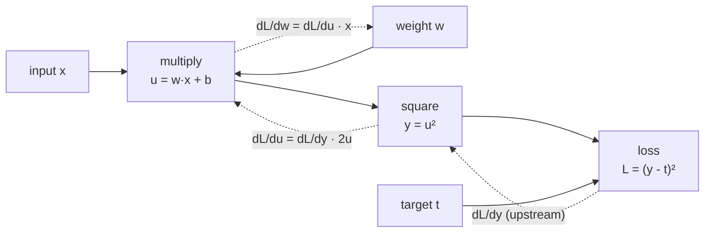

# Forward Pass and Backpropagation

> **Interview answer (say this first).** The forward pass runs the input through the network to produce a prediction and records every operation in a **computation graph**. Backpropagation then walks that graph backward, applying the chain rule to compute the gradient of the loss with respect to every parameter. PyTorch's autograd does this automatically: you call `loss.backward()`, each parameter's `.grad` is filled, and the optimizer uses those gradients to update the weights. The whole backward pass costs about the same as one extra forward pass.

## Why this exists

Chapter 1 said training adjusts parameters to reduce a loss. That raises the only question that matters: **how do you know which way to move each parameter?**

The naive answer is to nudge each parameter and measure the effect. For a parameter \(w\), estimate the gradient with a finite difference:

```text
dLoss/dw  ≈  ( loss(w + ε) - loss(w - ε) ) / (2ε)
```

That works, and we will use it as a correctness check. But as a training method it is hopeless. A model with one billion parameters would need two billion forward passes for a single update. At even one millisecond per pass, one step takes weeks.

Backpropagation is the efficient answer. It computes the gradient for **all** parameters in one backward sweep, using information the forward pass already computed. The insight is the **chain rule**: if the loss depends on the output, the output on the last layer, and so on back to the input, then the derivative of the loss with respect to any earlier value is just the product of the local derivatives along the path. Doing that multiplication from the end backward reuses intermediate results instead of recomputing them.

This is why deep learning became practical. Without backpropagation there is no cheap gradient, and without cheap gradients there is no training.

## Start from zero

| Word | Plain meaning |
| --- | --- |
| **Forward pass** | Running inputs through the network to get outputs. |
| **Computation graph** | The record of operations the forward pass performed: nodes are tensors, edges are operations. |
| **Chain rule** | The calculus rule for differentiating a composition: multiply the local derivatives along the chain. |
| **Local gradient** | The derivative of one operation's output with respect to its own input, for example `d(tanh)/dz`. |
| **Upstream gradient** | The gradient arriving from later in the graph, with respect to this operation's output. |
| **Backward pass** | Walking the graph in reverse, multiplying local and upstream gradients to get gradients for earlier values. |
| **Autograd** | PyTorch's engine that builds the graph and runs the backward pass. |
| **Leaf tensor** | A tensor you created directly, such as a model parameter. Gradients are stored on leaves. |
| **`.grad`** | The gradient tensor attached to a leaf after a backward pass. |
| **`backward()`** | The call that starts the reverse sweep from a scalar loss. |
| **`zero_grad()`** | The call that clears stored gradients before the next step; by default it sets them to `None`. |
| **Gradient accumulation** | Deliberately summing gradients from several backward passes before one optimizer step. |
| **Micro-batch** | A small slice of a large batch, used so each forward pass fits in memory. |
| **Vanishing gradient** | Gradients shrink toward zero as they travel back through many layers, so early layers barely learn. |
| **Exploding gradient** | Gradients grow without bound, producing `NaN` weights. |
| **Gradient clipping** | Rescaling gradients when their norm is too large, to keep steps stable. |
| **Numeric gradient** | A finite-difference estimate of a gradient, used to check that autograd is correct. |
| **Retain graph** | Keep the saved forward values so a second backward pass can reuse them. |

The pair to keep straight is **forward vs backward**. The forward pass computes values and saves what it needs; the backward pass computes derivatives using those saved values. Confusing which one stores memory is the source of most out-of-memory surprises.

## The core idea

Think of a row of gears. You turn the first gear; each gear turns the next; the last gear shows a speed. Backpropagation answers: *if I want the final speed to change, how much should I adjust the first gear?* It traces the train of gears backward, multiplying the ratio of each gear pair.



The solid arrows are the forward pass. The dashed arrows are the backward pass. Each backward arrow multiplies the upstream gradient by a local gradient. That is the entire algorithm.

Why it is efficient: the forward pass already computed `u`, `x`, and `y`. The backward pass reuses them, so each edge costs one small multiplication instead of a fresh forward evaluation.

| | Numeric gradient | Backpropagation |
| --- | --- | --- |
| Cost per parameter | two forward passes | shared, ~one extra backward pass total |
| Accuracy | approximate, depends on ε | exact (up to floating point) |
| Use | checking correctness | all real training |
| Scale | tiny models only | billions of parameters |

The table is the reason training uses backpropagation and only ever uses numeric gradients as a test.

## How it works

1. **Mark the leaves.** Model parameters are created with `requires_grad=True`. Anything else is a constant unless you say otherwise.
2. **Run the forward pass.** Each operation takes its inputs, computes its output, and, if any input requires grad, attaches a `grad_fn` that knows how to differentiate the operation.
3. **Store what backward will need.** For `y = x * w`, the backward step needs `x` to compute `dL/dw`; autograd saves the values (or a way to recompute them) as it goes.
4. **Reach a scalar loss.** `backward()` requires a scalar (or an explicit gradient for non-scalars), because a gradient is defined per output element. Losses are reduced to one number with `mean()` or `sum()`.
5. **Seed the backward pass.** The derivative of the loss with respect to itself is 1. From there autograd walks the graph backward from the loss toward the inputs in reverse topological order — every operation is visited only after the operations that consume its output, so its upstream gradient is already available when it is needed.
6. **Multiply upstream by local.** At each node, `grad_input = grad_output * local_derivative`. If a tensor feeds several operations, autograd **adds** the contributions, because a value that influences the loss through two paths contributes its effect through both.
7. **Store on leaves.** When the walk reaches a leaf such as a weight, the accumulated value is written to `weight.grad`. Intermediate tensors get no `.grad` by default.
8. **Update.** The optimizer reads `.grad`, computes a step, and adjusts the parameters. Then `zero_grad()` clears the gradients for the next iteration.

> **Warning:**
>
> **Gradients accumulate by default.** Every `backward()` adds into `.grad`. That is what makes gradient accumulation possible, and also why forgetting `zero_grad()` silently poisons training: step two would use the sum of step one and step two gradients.


## The syntax you will use

**A minimal backward pass.** The gradient of `w² + 2w` is `2w + 2`, which is 8 at `w = 3`.

```python
import torch

w = torch.tensor(3.0, requires_grad=True)
y = w * w + 2 * w
y.backward()
print(w.grad)          # tensor(8.)
```

**Scalar loss from a batch.** Reduce to one number before calling `backward()`.

```python
pred = model(x)
loss = ((pred - target) ** 2).mean()   # mean makes it a scalar
loss.backward()
```

**Zero the gradients.** By default this sets `.grad` to `None`, not to zeros.

```python
optimizer.zero_grad()                  # .grad becomes None
optimizer.zero_grad(set_to_none=False) # .grad becomes a zero tensor
```

**Stop tracking.** `detach()` returns a tensor sharing data but with no graph history.

```python
with torch.no_grad():
    pred = model(x)          # no graph is built; faster, less memory

target = pred.detach()       # treat pred as a constant
```

**Gradient accumulation.** Sum gradients over several micro-batches, then step once.

```python
optimizer.zero_grad()
for i, micro_batch in enumerate(batches):
    loss = compute_loss(model, micro_batch) / accumulation_steps
    loss.backward()          # gradients add up
    if (i + 1) % accumulation_steps == 0:
        optimizer.step()
        optimizer.zero_grad()
```

**Gradient clipping.** Rescale when the gradient norm is too large.

```python
torch.nn.utils.clip_grad_norm_(model.parameters(), max_norm=1.0)   # clip by total norm
torch.nn.utils.clip_grad_value_(model.parameters(), clip_value=1.0)  # clip each element
```

**Gradients on demand.** Get a gradient without calling `backward()` on the loss.

```python
grads = torch.autograd.grad(loss, [w1, w2])   # returns a tuple
```

**Correctness check.** `gradcheck` compares autograd against numeric gradients.

```python
torch.autograd.gradcheck(fn, inputs)   # True if they agree within tolerance
```

## Examples: simple to real

**Example 1 — forward as function composition.** Two operations, two local derivatives.

```python
x = torch.tensor(2.0)
w = torch.tensor(3.0, requires_grad=True)
b = torch.tensor(1.0, requires_grad=True)

u = w * x + b     # u = 7
y = u ** 2        # y = 49
y.backward()

# dy/dw = 2·u·x = 2·7·2 = 28
# dy/db = 2·u   = 14
# w.grad -> 28.0, b.grad -> 14.0
```

The computation is small enough to check by hand, which is exactly why it is a good first example.

**Example 2 — the chain rule by hand.** Two layers, one ReLU, squared error.

```python
x = torch.tensor(1.0)
W1 = torch.tensor(2.0, requires_grad=True)
W2 = torch.tensor(3.0, requires_grad=True)

z1 = W1 * x          # 2
h = torch.relu(z1)   # 2
y = W2 * h           # 6
loss = (y - 1.0) ** 2   # 25

loss.backward()
# dL/dy  = 2(y-1) = 10
# dL/dW2 = dL/dy · h = 10 · 2 = 20
# dL/dh  = dL/dy · W2 = 10 · 3 = 30
# dL/dW1 = dL/dh · relu'(z1) · x = 30 · 1 · 1 = 30
# W2.grad -> 20.0, W1.grad -> 30.0
```

Reading the comments top to bottom **is** backpropagation: each line multiplies the gradient so far by one local derivative.

**Example 3 — numeric check of autograd.** Compare the analytic gradient with a finite difference.

```python
import torch

x = torch.tensor(2.0)   # re-set from Example 2, where x was 1.0
loss_fn = lambda w, b: (w * x + b) ** 2
eps = 1e-4

num_dw = (loss_fn(torch.tensor(3.0 + eps), torch.tensor(1.0))
          - loss_fn(torch.tensor(3.0 - eps), torch.tensor(1.0))) / (2 * eps)
# numeric dw ≈ 27.96   vs autograd 28.0
# numeric db ≈ 14.02   vs autograd 14.0
```

They agree to about two decimal places. The small gap is float32 rounding and the size of `ε`; shrinking `ε` too far makes cancellation worse. This is why real checks use `float64` and a tolerance.

**Example 4 — `gradcheck` on a real module.** The same idea, automated across every parameter.

```python
import torch

model = torch.nn.Sequential(
    torch.nn.Linear(4, 5), torch.nn.Tanh(), torch.nn.Linear(5, 2)
).double()
x = torch.randn(3, 4, dtype=torch.float64)

def net(*params):
    # replay the module forward pass using the supplied parameter tensors
    w1, b1, w2, b2 = params
    h = torch.tanh(x @ w1.T + b1)
    return h @ w2.T + b2

torch.autograd.gradcheck(net, tuple(model.parameters()))
# True
```

If `gradcheck` fails, your custom backward is wrong. Frameworks run it in their test suites for exactly this reason.

**Example 5 — gradient accumulation.** Two micro-batches can act like one larger batch.

```python
import torch

torch.manual_seed(0)
model = torch.nn.Linear(3, 1)
x1, x2 = torch.randn(4, 3), torch.randn(4, 3)
y1, y2 = torch.randn(4, 1), torch.randn(4, 1)

# path A: two backward passes, each micro-batch loss weighted by 1/2
model.zero_grad()
loss1 = ((model(x1) - y1) ** 2).mean()
loss2 = ((model(x2) - y2) ** 2).mean()
(0.5 * loss1).backward()
(0.5 * loss2).backward()
accumulated = model.weight.grad.clone()

# path B: one combined loss over the full batch
model.zero_grad()
combined = ((model(torch.cat([x1, x2])) - torch.cat([y1, y2])) ** 2).mean()
combined.backward()

# gradients match to float32 rounding: True (measured max difference ~3e-8)
```

This is how you train with a batch larger than GPU memory. The gradients are mathematically identical; only the peak memory differs.

**Example 6 — vanishing, exploding, clipping.** These are not three topics; they are three symptoms of the same multiplication.

```python
# vanishing: 20 sigmoids in a row, each derivative ≤ 0.25
# sigmoid^20 gradient at the input: 1.14e-13

# a 10-layer sigmoid network: first-layer grad norm 1.2e-09, last-layer 1.2e-01
# ratio ≈ 1e-8 — the early layers barely move

# exploding: multiply by 3 twenty times
# gradient of x·3^20: 3.49e+09 (exactly 3^20)

# clipping a huge gradient
# norm before: 3.48e+06   ->   norm after clip_grad_norm_(..., 1.0): 1.0 (total, across params)
# clip_grad_value_ caps every element at 0.59 in this example
```

The fix for vanishing is architectural (residual connections, better activations, normalisation) or training-related (shorter paths, careful initialisation). The fix for exploding is clipping plus a smaller learning rate.

## In production

- **Always call `zero_grad()` before `backward()`.** Gradients accumulate by default; a missing clear makes each step combine several gradients and training diverges without an obvious error.
- **Gradients accumulate for a reason.** Deliberately accumulating over micro-batches gives you a large effective batch on small hardware. Divide each loss by the accumulation count so the scale matches a true large batch.
- **`retain_graph=True` costs memory.** The default backward frees the saved activations. Keep the graph only when you need a second pass, and free it as soon as you can.
- **A second `backward()` on the same graph raises.** The error says the saved tensors were freed. This usually means you accidentally called `backward()` twice in one iteration, or reused a graph across steps.
- **Non-leaf `.grad` is `None`.** If you need an intermediate gradient, call `.retain_grad()` on it before the backward pass.
- **Detach what should not learn.** Targets, cached embeddings, and reward signals should be `.detach()`-ed or produced under `torch.no_grad()`, or gradients leak into parts of the graph you did not intend to train.
- **Vanishing gradients get worse with depth and with saturating activations.** Sigmoid and `tanh` squash their input; stacked, they shrink the gradient by a factor below 1 per layer. ReLU, GELU, residual connections, and normalisation are the standard mitigations.
- **Exploding gradients show up as `NaN` loss.** If the loss goes to `NaN`, clip the gradients and lower the learning rate before changing anything else. Mixed precision makes this more likely, which is why loss scaling exists.
- **Clip before `optimizer.step()`.** Clipping after the step does nothing for that step. `clip_grad_norm_` scales the whole parameter group by one factor, preserving the gradient direction; `clip_grad_value_` clips element by element and can change direction.
- **Module lists must contain distinct objects.** `[torch.nn.Linear(8, 8)] * 4` repeats one module four times, so all four "layers" share weights and backprop accumulates into the same parameters. Use `torch.nn.ModuleList` or a loop that builds a new layer each time.
- **Gradient values are per-batch, not per-sample.** With a mean-reduced loss, each parameter's gradient is the average over the batch. Changing batch size changes the effective learning rate, so retune it when you change batch size.
- **Checkpointing trades compute for memory.** Gradient checkpointing recomputes activations during the backward pass instead of storing them, cutting memory at the cost of roughly one extra forward pass.

## Interview questions

### 1. What is backpropagation?

**Answer.** Backpropagation is an efficient algorithm for computing the gradient of a scalar loss with respect to every parameter, using the chain rule over the computation graph the forward pass recorded. It walks the graph backward, multiplying each operation's local derivative by the upstream gradient, and reuses values saved during the forward pass. The total cost is about one extra forward pass, regardless of the number of parameters.

**Follow-up: "Why not compute gradients numerically?"** A numeric gradient needs two forward passes per parameter, which is billions of times too slow for a real model. Numeric gradients are only used to check that backpropagation is implemented correctly.

**Trap.** Calling backpropagation a learning algorithm. It only computes gradients; the parameter update is the optimizer's job (SGD, Adam, and so on).

### 2. What is a computation graph?

**Answer.** It is the record of operations from the forward pass: tensors are nodes, operations are edges, and each edge knows how to compute its local derivative. It exists only while gradients are required. Autograd uses it to do the reverse sweep and frees it afterward unless you pass `retain_graph=True`.

**Follow-up: "Why is the graph freed?"** The saved intermediate activations are the main memory cost of training. Keeping them alive after backward would waste GPU memory, so PyTorch releases them by default.

**Trap.** Thinking the graph is built at model definition time. It is created fresh on every forward pass, which is why you must call `zero_grad()` each iteration.

### 3. Why does `loss` have to be a scalar for `backward()`?

**Answer.** A gradient is defined for a scalar output. When the loss is a vector, `backward()` needs an external gradient saying how each element contributes, because there is no single "the derivative". In practice this is handled by reducing with `.mean()` or `.sum()`, which is why every training loss ends in one of those.

**Follow-up: "Can you call `backward()` on a non-scalar?"** Yes, by passing a `gradient` argument of the same shape: `out.backward(torch.ones_like(out))` means "sum the outputs". That is what happens implicitly after a `.sum()`.

**Trap.** Forgetting that `backward()` on a non-scalar without a gradient argument raises, and assuming the loss must be a Python float. It must be a scalar tensor, not a float.

### 4. What does `optimizer.zero_grad()` do, and what happens if you skip it?

**Answer.** It clears the gradients stored on the parameters. By default it sets `.grad` to `None` (`set_to_none=True`); with `set_to_none=False` it writes zeros. If you skip it, the next backward pass adds to the previous gradients, so each step uses the sum of all gradients since the last clear and training diverges.

**Follow-up: "Why does accumulation exist at all?"** Because summing gradients across micro-batches is how you simulate a large batch on limited memory. The default accumulation behavior makes that free; you just step and clear less often.

**Trap.** Saying `zero_grad()` writes zeros. In current PyTorch the default is `None`, which is slightly faster and saves memory.

### 5. What is the difference between gradient accumulation and a larger batch?

**Answer.** Mathematically they are the same when the per-micro-batch losses are scaled by `1/accumulation_steps`: the summed gradients equal the gradient of the combined batch. The practical difference is memory and speed: accumulation needs less peak GPU memory but runs more forward passes serially, so it is slower than a true large batch.

**Follow-up: "Does batch normalisation behave the same?"** No. Batch norm computes statistics per forward pass, so micro-batches give different statistics than one large batch. Layer norm, used in transformers, has no such problem.

**Trap.** Forgetting to divide by the accumulation count, which silently multiplies the effective learning rate.

### 6. What are vanishing and exploding gradients?

**Answer.** Both come from multiplying many local derivatives in a long chain. If each factor is below 1, the gradient shrinks toward zero as it travels back and early layers barely learn — vanishing. If each factor is above 1, it grows exponentially and produces `NaN` — exploding. Saturating activations like sigmoid contribute factors below 1, while large weights and deep multiplicative chains push factors above 1.

**Follow-up: "How do you fix them?"** Vanishing: residual connections, ReLU/GELU, normalisation, and careful initialisation. Exploding: gradient clipping, a smaller learning rate, and mixed-precision loss scaling. Architecture matters more than hyperparameters for vanishing.

**Trap.** Treating them as unrelated problems. They are the same phenomenon, and both are diagnosed by looking at per-layer gradient norms.

### 7. How does gradient clipping work?

**Answer.** `clip_grad_norm_` computes the total norm of all gradients in the group and, if it exceeds `max_norm`, scales every gradient by `max_norm / total_norm`. That preserves the direction of the update and only reduces its length. `clip_grad_value_` instead clips each element independently, which is simpler but can change the direction.

**Follow-up: "When do you clip?"** Before `optimizer.step()`, every iteration, especially with recurrent networks, transformers, and mixed precision. A common `max_norm` is 1.0.

**Trap.** Clipping after the optimizer step, or assuming clipping fixes a bad learning rate. Clipping bounds rare spikes; it does not fix a systematically too-large step.

### 8. How do you verify a backpropagation implementation?

**Answer.** Compare the analytic gradient with a numeric one using central differences, ideally in `float64`, and assert they agree within a tolerance. PyTorch automates this with `torch.autograd.gradcheck`. If they disagree, the custom backward is wrong. This is the standard test for any hand-written layer or loss.

**Follow-up: "Why is `float64` used?"** Finite differences subtract two nearly equal numbers, so `float32` rounding dominates the estimate. Double precision keeps the cancellation error small enough to detect real bugs.

**Trap.** Picking `ε` that is too small. Below roughly `1e-6`, floating-point cancellation makes the numeric gradient worse, not better.

## Remember this

- The forward pass computes values and builds a graph; the backward pass applies the **chain rule** to that graph.
- Backpropagation costs about **one extra forward pass**, no matter how many parameters exist.
- Gradients **accumulate** in `.grad`; `zero_grad()` clears them, by default to `None`.
- **Vanishing and exploding gradients** are the same multiplication, differing only in whether the factors are below or above 1.
- **Clip before the step**, and use `gradcheck` or a numeric gradient to verify any hand-written backward.
