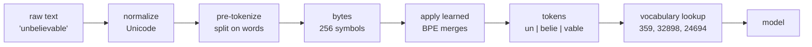

# Tokenization and Tokens

> **Interview answer (say this first).** Tokenization splits text into small pieces called **tokens** and maps each one to an integer ID using a fixed **vocabulary**. Models never see characters or words — they see these IDs. Tokenization matters because you pay per token, the context window is measured in tokens, and different models use different tokenizers, so the same text costs a different amount depending on the model.

## Why this exists

A language model is a mathematical function. It multiplies matrices and adds numbers. It cannot multiply the string `"cat"`. At some point, text has to become numbers.

The obvious first attempt is **one number per character**. The English alphabet is small, so the vocabulary would be tiny. But a 1,000-word document becomes roughly 5,000–6,000 character positions. The model would have to learn meaning across a huge number of steps, and a single stray character shifts everything.

The other obvious attempt is **one number per word**. Now the vocabulary explodes. English has hundreds of thousands of words, plus names, typos, code identifiers, product names, and words from every other language. Any word the builder never listed gets no ID at all. That is the **out-of-vocabulary** problem.

Subword tokenization is the compromise that won. Break text into pieces that are often whole common words, but can also be fragments:

```text
"unbelievable"  →  "un" + "belie" + "vable"
"Strawberry"    →  "Str" + "aw" + "berry"
```

Common words become one token. Rare words are assembled from a handful of reusable pieces. Nothing is ever impossible, because the fallback is a single byte.

This is not a minor preprocessing detail. It explains several things that surprise people:

- Why a model asked to count the letters in `"strawberry"` can fail: it never sees the letters, only the IDs `[496, 675, 15717]`.
- Why the same prompt costs more in one language than another.
- Why one emoji can be two or three tokens.

> **Note:**
>
> **The one-sentence purpose.** Tokenization turns text into a short sequence of integers from a fixed vocabulary, so a model can do math on language.


## Start from zero

Every word below is used for the rest of this page.

| Word | Plain meaning |
| --- | --- |
| **Token** | One piece of text from the vocabulary. It may be a word, part of a word, a character, or even part of one character. |
| **Tokenizer** | The program that turns text into token IDs and back. |
| **Vocabulary** | The fixed set of all tokens the model knows. Its size is written `V`. |
| **Token ID** | The integer that stands for a token. `"cat"` might be `9246`. |
| **Subword** | A token that is smaller than a word but usually bigger than a character. |
| **Byte** | One of 256 possible values that make up UTF-8 text. `"A"` is one byte; `"é"` is two. |
| **Byte-level** | A tokenizer that works on raw bytes, so any input is representable. |
| **BPE** | Byte-Pair Encoding. An algorithm that repeatedly merges the most common neighbouring pair of symbols. |
| **WordPiece** | A similar merge algorithm used by BERT. It merges pairs that most improve the data likelihood. |
| **Unigram / SentencePiece** | SentencePiece is a tokenizer library. Its Unigram mode starts with many candidate pieces and removes the least useful. Used by T5 (Unigram) and Llama (SentencePiece BPE). |
| **Pre-tokenization** | The first split, usually on spaces and punctuation, before merges are applied. |
| **Special token** | A token with a control meaning, like "start of document" or "end of chat turn". Not normal text. |
| **BOS** | Beginning Of Sequence. A special token added before the first real token. |
| **EOS** | End Of Sequence. A special token marking the end; the model can emit it to stop. |
| **PAD** | A filler token used to make all sequences in a batch the same length. |
| **Role token** | A special token that marks who is speaking in a chat: system, user, or assistant. |
| **Out-of-vocabulary (OOV)** | A word the vocabulary has no entry for. Byte-level tokenizers avoid this by construction. |

Two contrasts are worth pinning down now:

- **Segment vs symbol.** A *token* is a piece of text; a *token ID* is the number assigned to it. Interviews often use the two words loosely, but the distinction matters.
- **Model vocabulary vs tokenizer vocabulary.** They are normally identical, but a chat API may add role tokens on top. If tokenizer and model disagree, the model reads garbage.

## The core idea

Think of a box of LEGO bricks. The box has a fixed set of pieces. Common words are single large bricks. Rare words are built by snapping several small bricks together. You never need a new mould for a new word, and you never run out of bricks.



The level of granularity is a deliberate design choice with three trade-offs:

| Level | Vocabulary size | Sequence length for a page | Handles new words? | Example |
| --- | --- | --- | --- | --- |
| Character | ~100 | Very long | Yes | early models |
| Word | 100k+ | Short | No (OOV) | classic NLP |
| Subword | 30k–200k | Short | Yes | GPT, Llama, BERT |

Subword wins because it keeps sequences short **and** handles anything. The vocabulary size is the dial: a bigger vocabulary means fewer tokens per sentence, but a bigger embedding table and a bigger softmax to train.

## How it works

Here is the pipeline, step by step.

1. **Normalize the text.** Apply Unicode normalization and decide how to treat whitespace, accents, and case. Different tokenizers make different choices, which is why the same string can tokenize differently.
2. **Pre-tokenize.** Split the text into rough word-sized chunks, usually with a regular expression. Punctuation and spaces are separated so merges cannot cross word boundaries.
3. **Go to bytes.** Each chunk is converted to UTF-8 bytes. There are only 256 possible byte values, so every possible input — any language, any emoji, any binary junk — is representable. This is why modern tokenizers rarely have a true OOV token.
4. **Count adjacent pairs.** For each word, count how often each neighbouring pair of symbols appears across the whole training corpus.
5. **Merge the most frequent pair.** Replace every occurrence of that pair with a new single symbol. Record the merge rule.
6. **Repeat.** Do steps 4–5 thousands of times. Each merge is one new token added to the vocabulary. Frequent strings like `" the"` or `"ing"` become single tokens; rare strings stay split.
7. **Build the vocabulary.** The final symbols become the vocabulary. Assign each an integer ID.
8. **At inference, replay the merges.** The tokenizer applies the learned merge rules in the recorded order. The result is a list of IDs.
9. **Add special tokens.** Insert BOS/EOS/role tokens where the model expects them, then feed the ID list to the model's embedding table.

The key insight of **byte-level BPE**: because the base alphabet is all 256 bytes, there is no such thing as an unknown character. A Chinese character that has no merged token gets split into its three bytes. It costs more tokens, but it always works.

> **Note:**
>
> **Merges are greedy, not optimal.** BPE merges whichever pair is most frequent at that moment and never reconsiders. A different merge order produces a different, equally valid vocabulary. This is why two tokenizers trained on similar data can still disagree, and why token counts are never something you can derive from first principles — you always measure.


A useful mental model for vocabulary size: a bigger vocabulary shifts work from the sequence dimension to the parameter dimension.

```text
small vocab  ->  more tokens per sentence  ->  shorter embedding table, longer attention
large vocab  ->  fewer tokens per sentence  ->  longer embedding table, shorter attention
```

At 100k tokens and 4096 dimensions, the embedding table alone is `100000 * 4096 = 409,600,000` parameters. At 200k tokens it doubles. Since attention cost grows with the square of sequence length, a large vocabulary is often the better trade for long-context models.

## The syntax you will use

**Encode and decode with a real tokenizer.** `tiktoken` is OpenAI's tokenizer library.

```python
import tiktoken

enc = tiktoken.get_encoding("cl100k_base")   # GPT-4 / GPT-3.5 family
ids = enc.encode("Hello, world!")            # [9906, 11, 1917, 0]
text = enc.decode(ids)                       # "Hello, world!"
```

`encode` returns a list of integers; `decode` turns them back into text. A round trip always returns the original string. The pieces here are `b'Hello'`, `b','`, `b' world'`, and `b'!'`.

**See the pieces, not just the IDs.** Each token ID maps to a byte sequence, not necessarily a whole character.

```python
toks = enc.encode("unbelievable")
pieces = [enc.decode_single_token_bytes(t) for t in toks]
# [b'un', b'belie', b'vable'] — three byte fragments
```

`decode_single_token_bytes` shows what each token really contains. This is how you discover that an emoji is split across tokens.

**Vocabulary size.** Useful for reasoning about the model's output layer and embedding table.

```python
enc.n_vocab        # 100277 for cl100k_base
enc.max_token_value  # 100276, the largest valid ID
```

**Special tokens.** They are in the vocabulary but are not ordinary text. `encode` refuses to guess what you meant.

```python
enc.special_tokens_set
# {'<|endoftext|>', '<|fim_prefix|>', '<|fim_middle|>',
#  '<|fim_suffix|>', '<|endofprompt|>'}

enc.encode("hello<|endoftext|>world")          # raises ValueError
enc.encode("hello<|endoftext|>world",
           allowed_special={"<|endoftext|>"})  # [15339, 100257, 14957]
```

This is a safety feature: if a user types the literal text `<|endoftext|>`, you do not want it silently treated as a control token.

**A character tokenizer, for understanding.** This is the simplest possible tokenizer, and it makes the idea concrete.

```python
chars = sorted(set("the cat sat"))
stoi = {c: i for i, c in enumerate(chars)}
ids = [stoi[c] for c in "cats"]
```

`stoi` means "string to integer". This is a real (if weak) tokenizer: a fixed vocabulary and a lookup.

**A tiny BPE trainer.** Real BPE is this loop repeated thousands of times.

```python
from collections import Counter

def get_pairs(word_counts):
    pairs = Counter()
    for word, count in word_counts.items():
        syms = word.split()
        for i in range(len(syms) - 1):
            pairs[(syms[i], syms[i + 1])] += count
    return pairs

pairs = get_pairs(vocab)
best = max(pairs, key=pairs.get)          # most common pair
# then replace "a b" with "ab" everywhere and repeat
```

`word_counts` (here `vocab`) maps a spaced-out word like `"l o w </w>"` to how often it appears. `</w>` marks the end of a word. The most frequent pair becomes the next merge.

## Examples: simple to real

**Example 1 — character tokenizer.** The smallest useful tokenizer.

```python
text = "the cat sat"
chars = sorted(set(text))          # [' ', 'a', 'c', 'e', 'h', 's', 't']
stoi = {c: i for i, c in enumerate(chars)}
ids = [stoi[c] for c in text]
# 11 tokens for 11 characters
```

Short vocabulary, but long sequences and no notion of words.

**Example 2 — word tokenizer and its failure.** Split on whitespace and look up each word in a fixed vocabulary.

```python
vocab = {"the": 0, "cat": 1, "sat": 2, "on": 3, "mat": 4}
ids = [vocab[w] for w in "the cat sat".split()]
# [0, 1, 2] — all words are known

ids = [vocab[w] for w in "the chatgpt sat".split()]
# KeyError: 'chatgpt' — the fixed vocabulary has no entry
```

Word tokenizers are short and readable, but every new or misspelled word is a failure.

**Example 3 — BPE learns merges.** Running the trainer above on a tiny corpus produces this exact sequence of merges:

```text
start: l o w </w>, l o w e r </w>, n e w e s t </w>, w i d e s t </w>
merge 1: (e, s)   count=9   -> n e w es t </w>
merge 2: (es, t)  count=9   -> n e w est </w>
merge 3: (est, </w>) count=9 -> n e w est</w>
merge 4: (l, o)   count=7   -> lo w </w>
merge 5: (lo, w)  count=7   -> low </w>
merge 6: (n, e)   count=6   -> ne w est</w>
```

Notice `"est"` becomes a single token because it appears in `"newest"` and `"widest"`. That is exactly how a real tokenizer ends up with pieces like `"ing"`, `"tion"`, and `"able"`.

**Example 4 — real token counts vs characters and words.** This is the table to remember.

| Text | Chars | Words | cl100k tokens |
| --- | --- | --- | --- |
| `Hello, world!` | 13 | 2 | 4 |
| `unbelievable` | 12 | 1 | 3 |
| `tokenization` | 12 | 1 | 2 |
| `Strawberry` | 10 | 1 | 3 |
| `agentic AI engineering` | 22 | 3 | 4 |
| `     ` (5 spaces) | 5 | 0 | 1 |
| `I love you` | 10 | 3 | 3 |
| `😀` | 1 | 1 | 2 |
| `I 👍 this` | 8 | 3 | 4 |
| `Namaste नमस्ते` | 14 | 2 | 9 |
| `你好世界` | 4 | 1 | 5 |

Two lessons jump out. English text is usually close to **one token per word** for common words, but the ratio is not fixed. And a single emoji or four Chinese characters cost several tokens.

**Example 5 — a token is not a character.** Decoding each token to raw bytes shows why.

```text
'😀'        n=2  bytes=[b'\xf0\x9f\x98', b'\x80']
'你好世界'   n=5  bytes=[b'\xe4\xbd\xa0', b'\xe5\xa5\xbd',
                        b'\xe4\xb8', b'\x96', b'\xe7\x95\x8c']
```

The emoji is four UTF-8 bytes, split 3 + 1. The Chinese text splits one character (`世`) across two tokens. The whole sequence still round-trips perfectly, because the bytes are reassembled before decoding.

**Example 6 — the same text, two tokenizers.** `cl100k_base` (GPT-4) and `o200k_base` (GPT-4o) disagree:

```text
'unbelievable':                  cl100k=3, o200k=3
'antidisestablishmentarianism':  cl100k=6, o200k=6
'你好世界':                       cl100k=5, o200k=2
```

The newer, larger vocabulary handles Chinese in 2 tokens instead of 5. That means lower cost and more room in the context window for the same text. The tokenizer is not a detail you can ignore when comparing models.

## In production

- **Cost is per token, in both directions.** You pay for input tokens (the prompt) and output tokens (the completion), usually at different rates. A long system prompt is paid on every single call.
- **The context window is measured in tokens, not words.** A model with a 128k-token limit may hold fewer than 100k English words. Always count with the model's own tokenizer, not `len(text.split())`.
- **Tokenizer and model are a matched pair.** Sending `cl100k` IDs to a model that expects another tokenizer produces nonsense, often without an error. Use the tokenizer that ships with the model.
- **Non-English text costs more.** Languages poorly represented in the training data, and languages without spaces, need more tokens per meaning. Budget more context and money for them.
- **Special tokens are a security boundary.** If user input can contain a role token string, a naive pipeline may inject a fake `system` turn. Sanitize or use the provider's structured message API instead of building prompts by string concatenation.
- **`max_tokens` limits the output, not the input.** The context window must fit prompt **plus** completion. Reserve room for the answer or requests fail with a context-length error.
- **Token counts change when you change the tokenizer.** Caching, cost estimates, and unit tests that hard-code token counts break when a model family updates its tokenizer.
- **Streaming arrives in pieces, not words.** A chunk may contain half a word because a token can be a fragment. Buffer before rendering if you need whole words.
- **Whitespace tokenization surprises people.** Trailing spaces, newlines, and indentation are tokens and cost money. Code with deep indentation is token-expensive.
- **Different roles for different jobs.** Embedding models and LLMs often use different tokenizers. Never compare token counts across them; they are not the same unit.
- **Tokenization is a common interview probe.** "Why can't GPT count letters in strawberry?" is really asking whether you know that tokens, not characters, are the model's input.
- **Estimate before you send.** Rough English rule: about 0.75 words per token, or 1.3 tokens per word. Then verify with the real tokenizer — especially for code, JSON, and other languages.

## Interview questions

### 1. What is a token, and why not use characters or words?

**Answer.** A token is a piece of text from a fixed vocabulary, mapped to an integer ID. Characters make sequences very long and force the model to learn meaning far from the original characters. Words make the vocabulary enormous and fail on any word not listed. Subword tokens are the middle ground: common words are one token, rare words are assembled from reusable pieces, and byte-level fallback means nothing is truly unknown.

**Follow-up: "What determines the vocabulary size?"** A trade-off. A larger vocabulary means fewer tokens per sentence, so shorter sequences and cheaper attention, but a larger embedding table and softmax, and rarer tokens are trained on less data.

**Trap.** Saying the model "reads letters." It reads integer IDs. `"strawberry"` becomes `['str', 'aw', 'berry']`, so the individual `r`s are not available to count.

### 2. What is byte-pair encoding?

**Answer.** BPE is a compression algorithm used to build a vocabulary. Start with words broken into characters (or bytes). Repeatedly count adjacent symbol pairs and merge the most frequent pair into one new symbol. Each merge adds a token. Frequent strings like `"ing"` or `" the"` become single tokens, and rare words stay as several pieces.

**Follow-up: "Why byte-level BPE rather than character-level?"** Starting from the 256 byte values guarantees that any input — emoji, code, any script — can be represented without an out-of-vocabulary token, while still learning multi-byte merges for common sequences.

**Trap.** Calling BPE a semantic algorithm. It is statistical and language-agnostic; it knows nothing about meaning, only about frequency in the training corpus.

### 3. How does tokenization affect cost, latency, and context?

**Answer.** Cost is charged per token in and out, so more tokens cost more. Latency grows with the number of tokens: prompt tokens are processed in the prefill pass and each output token is a separate decode step. The context window is a token budget, so a tokenizer that uses more tokens per sentence reduces how much text fits.

**Follow-up: "Why does input feel different from output?"** Input tokens are processed together during prefill, so you wait once for the first token rather than watching it arrive piece by piece. But that single pass grows faster than linearly with prompt length because attention is quadratic, so very long prompts have a heavy first-token delay. Output tokens arrive one decode step at a time, so users notice each one.

**Trap.** Estimating tokens by counting words. The ratio varies from about 1 token per word for common English to several tokens per character for other scripts and code.

### 4. Why can a model struggle to count letters or spell a rare word?

**Answer.** Because its input is token IDs, not characters. If `"strawberry"` is three tokens, the model does not receive the ten individual letters as separate symbols. Any letter-level task must be inferred from the token pieces, which is unreliable. Giving the model the letters explicitly, or using a tool, is the fix.

**Follow-up: "Is this fixed by bigger models?"** Partly. Bigger models see more data and can learn the spellings of common words, but the fundamental limitation remains for arbitrary strings, which is why agents use code execution for exact string work.

**Trap.** Thinking the model "sees" the same string you do. The mapping from text to tokens is lossy in structure, even though it round-trips in bytes.

### 5. What are special tokens, and what are BOS, EOS, PAD, and role tokens for?

**Answer.** Special tokens are control symbols in the vocabulary that are not ordinary text. **BOS** marks the beginning of a sequence. **EOS** marks the end, and the model can emit it to stop generating. **PAD** fills shorter sequences so a batch has a uniform length. **Role tokens** mark who is speaking in a chat, such as `system`, `user`, or `assistant`, so the model can tell turns apart.

**Follow-up: "What happens if a user types a special token string?"** A careful tokenizer refuses to encode it as a special token unless you explicitly allow it, because otherwise a user could forge a role boundary. This is a real prompt-injection vector.

**Trap.** Assuming special token strings work the same in every model. `<|endoftext|>` belongs to one tokenizer; Llama uses `<s>` and `</s>`; chat formats differ. Never hard-code another family's control tokens.

### 6. Do all models use the same tokenizer?

**Answer.** No. GPT-2, GPT-4, and GPT-4o use three different vocabularies. BERT uses WordPiece, Llama and T5 use SentencePiece, and many models use byte-level BPE. The same sentence can be 5 tokens in one model and 2 in another, so token counts, costs, and context usage are not comparable across models.

**Follow-up: "Can I swap tokenizers to save money?"** No. The model's embedding table and output layer are indexed by its own vocabulary. Feeding IDs from another tokenizer produces wrong embeddings silently.

**Trap.** Treating "token" as a universal unit. It is always "token **for this model**."

### 7. Why does non-English text cost more?

**Answer.** Tokenizers are trained on a corpus that is dominated by English. Merges for English words and common substrings are learned thoroughly, while other scripts are split into smaller pieces, often bytes. The same meaning therefore needs more tokens, which costs more and fills the context window faster.

**Follow-up: "Does a newer tokenizer help?"** Yes. A larger, more balanced vocabulary reduces the gap. `你好世界` is 5 tokens in `cl100k_base` and 2 tokens in `o200k_base`. But no tokenizer removes the gap entirely.

**Trap.** Assuming a character is a token. For many scripts a single character is several bytes and several tokens.

### 8. How do you count tokens in production?

**Answer.** Use the exact tokenizer for the model, through a library like `tiktoken` or the provider's count-tokens endpoint. Count the full prompt, including system messages, tool definitions, and formatting tokens, and reserve output tokens within the same budget. Cache counts for expensive or repeated prompts.

**Follow-up: "What about a rough estimate before you have the tokenizer?"** A common English heuristic is about 1.3 tokens per word, or 0.75 words per token. Treat it as a planning number only; code, JSON, and other languages break it badly.

**Trap.** Using `len(prompt)` or word count as a token budget. Both are wrong by unpredictable factors, and the error only shows up as a failed request or a surprise bill.

## Remember this

- A **token** is a vocabulary piece mapped to an integer ID; the model sees IDs, not letters.
- **Subword, byte-level BPE** is the standard compromise: short sequences, small vocabulary, no true OOV.
- **Tokens drive everything**: cost, latency, and the context window are all token budgets.
- **Tokenizers are model-specific.** The same text is a different number of tokens in different models.
- **Special tokens are control, not text**, and untrusted input containing them is a security risk.
