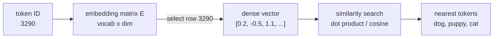

# Embeddings

> **Interview answer (say this first).** An embedding is a learned vector of floating-point numbers that represents a token, word, sentence, or document. It replaces an arbitrary ID with a position in space, so that things with similar meaning end up close together. Embeddings are how a model turns discrete symbols into geometry it can do math on, and they are the same vectors that power semantic search and retrieval.

## Why this exists

A model receives token IDs. An ID is just a label: `"cat"` might be `9246` and `"dog"` might `3290`. Those numbers have no relationship to each other. If the model only ever saw IDs, it would have to learn from scratch that 9246 and 3290 are related, and it would have no way to say *how* related.

The first fix people tried is a **one-hot vector**. If the vocabulary has 50,000 tokens, token 9246 becomes a vector of 50,000 numbers that is all zeros except a 1 at position 9246.

```text
# vocab size 5, for illustration
"cat"  -> [0, 0, 1, 0, 0]
"dog"  -> [0, 0, 0, 1, 0]
"car"  -> [0, 0, 0, 0, 1]
```

This is unambiguous, but it has two fatal problems:

1. **It is enormous.** With a 100k vocabulary the vector has 100,000 numbers, almost all zero.
2. **Every pair is equally unrelated.** The dot product of any two different one-hot vectors is exactly zero. `"cat"` is as unrelated to `"dog"` as it is to `"carburetor"`. There is no similarity to learn from.

Embeddings solve both. Instead of a 100,000-dimension sparse vector, each token gets a short, dense vector of, say, 768 or 4096 learned numbers. Tokens used in similar contexts are pushed toward similar vectors during training, so the geometry itself carries meaning.

This is the idea that makes modern AI work: **meaning becomes distance.** Once meaning is distance, you can search by it, cluster by it, and let the model do arithmetic on it.

## Start from zero

| Word | Plain meaning |
| --- | --- |
| **Vector** | An ordered list of numbers, like `[0.2, -0.5, 1.1]`. |
| **Dimension** | How many numbers are in the vector. Written `D`. |
| **Dense** | Most numbers are non-zero. Embeddings are dense. |
| **Sparse** | Most numbers are zero. One-hot vectors are sparse. |
| **One-hot** | A vector of all zeros with a single 1 marking one category. |
| **Embedding** | A dense vector learned to represent an item. Also the act of producing it. |
| **Embedding matrix** | The table of shape `vocab_size × dimension` holding one row per token. Written `E`. |
| **Embedding model** | A model that turns text into a vector, used for search, clustering, and retrieval. |
| **Dot product** | Multiply matching entries and add them: `sum(a[i] * b[i])`. Measures alignment. |
| **Norm / magnitude** | The length of a vector: `sqrt(sum(x[i] ** 2))`. |
| **Cosine similarity** | Dot product divided by both norms. Measures the angle between vectors, ignoring length. |
| **Static embedding** | One fixed vector per word, regardless of context. |
| **Contextual embedding** | A vector for a token that changes with the surrounding text. |
| **Nearest neighbour** | The stored vector with the highest similarity to a query vector. |
| **Vector search / ANN** | Finding nearest neighbours efficiently in a large vector collection. |
| **Vector database** | A store built for vector search, like pgvector, FAISS, or Qdrant. |

Two ideas cause most confusion, so separate them now:

- **Similarity is about direction, not length.** Two vectors pointing the same way are similar even if one is ten times longer. Cosine similarity deliberately ignores length.
- **Static vs contextual is about when the vector is fixed.** A word's *initial* embedding is static; the model then transforms it using context, producing a contextual vector.

## The core idea

Imagine every word pinned to a point on a giant map. On this map, `"king"` is near `"queen"`, `"cat"` is near `"dog"`, and `"Paris"` is near `"France"`. The map has hundreds of dimensions, so you cannot draw it, but the idea is ordinary geography: nearby means similar.

The famous illustration is that the *directions* on this map capture relationships:

```text
vector("king") - vector("man") + vector("woman")  ≈  vector("queen")
```

The "royalty" direction and the "gender" direction are consistent enough that adding and subtracting vectors moves you to sensible places. This is not a trick the engineers coded; it falls out of training on text.

Now the machine view. An embedding is implemented as a **table lookup**.



That matrix is the model's **input** embedding layer. A dedicated embedding model is a different component: it runs the whole text through a transformer and returns one pooled sentence vector for search, not a row from this table.

Here is the central comparison:

| Property | One-hot | Embedding |
| --- | --- | --- |
| Shape | `vocab_size` (e.g. 100,000) | `dim` (e.g. 768) |
| Values | all 0 except one 1 | mostly non-zero floats |
| Learns meaning? | No | Yes |
| Similarity between tokens | always 0 | meaningful |
| Lookup cost | none, it *is* the ID | one row read from a matrix |

## How it works

1. **Fix a vocabulary and a dimension.** Say `V = 100,000` tokens and `D = 768` dimensions. These are design choices, not learned.
2. **Create the embedding matrix `E`.** It has shape `V × D`. Every token owns exactly one row.
3. **Initialise randomly.** Small random values, so no two tokens start identical. This is the same symmetry-breaking as any neural network.
4. **Look up a token.** Take its ID and read row `ID` from `E`. That is the whole "embedding layer". It is a gather, not a multiplication.
5. **Train.** Backpropagation sends a gradient to every row that appeared in the batch. Rows for tokens used in similar contexts receive similar nudges, so they drift together.
6. **Use similarity.** Compare two vectors with the dot product or cosine similarity to score how related they are.
7. **Make embeddings contextual.** A transformer takes the static rows, then mixes them with attention, so the vector for `"bank"` depends on whether the sentence is about rivers or money.
8. **Serve them.** A dedicated embedding model returns vectors for documents; a vector database stores them and answers nearest-neighbour queries.

The reason token embeddings and output predictions are often tied together: the final layer needs one score per vocabulary item, and the embedding matrix already has one vector per vocabulary item. Reusing it (**weight tying**) saves parameters and usually improves quality.

## The syntax you will use

**Dot product and cosine similarity with numpy.** These two functions are the heart of semantic comparison.

```python
import numpy as np

a = np.array([1.0, 2.0, 3.0])
b = np.array([2.0, 4.0, 6.0])

dot = float(np.dot(a, b))                                  # 28.0
cos = float(np.dot(a, b) / (np.linalg.norm(a) * np.linalg.norm(b)))
# 1.0 — same direction, so maximum similarity
```

`np.dot` measures alignment and grows with length. Dividing by both norms removes length, leaving only the angle.

**An embedding matrix and a lookup.** The lookup is a row selection; a one-hot multiply is the same thing in matrix form.

```python
rng = np.random.default_rng(0)
V, D = 6, 4
E = rng.normal(size=(V, D))          # 6 tokens, 4 dimensions

vocab = ["cat", "dog", "kitten", "puppy", "car", "truck"]
word_to_id = {w: i for i, w in enumerate(vocab)}

vector = E[word_to_id["dog"]]         # shape (4,) — the row for "dog"

one_hot = np.zeros(V)
one_hot[word_to_id["dog"]] = 1.0
assert np.allclose(one_hot @ E, E[word_to_id["dog"]])   # True
```

`one_hot @ E` selects the row, which is why lookup is cheap.

**Ranking neighbours.** Compute similarity to every row, then sort.

```python
q = E[word_to_id["cat"]]
sims = E @ q / (np.linalg.norm(E, axis=1) * np.linalg.norm(q))
best = np.argsort(-sims)              # indices from most to least similar
[vocab[i] for i in best[:3]]
```

`argsort(-sims)` sorts descending. Real systems replace this linear scan with an approximate index.

**A trainable embedding layer in PyTorch.** Framework code is just the matrix from above.

```python
import torch.nn as nn

embedding = nn.Embedding(num_embeddings=100_000, embedding_dim=768)
out = embedding(torch.tensor([3290, 11, 9246]))   # shape (3, 768)
```

`nn.Embedding` stores an `E` matrix and does the gather; its parameters are learned by the optimiser.

**A sentence embedding model.** For search you usually want one vector for a whole sentence.

```python
from sentence_transformers import SentenceTransformer
model = SentenceTransformer("all-MiniLM-L6-v2")
vectors = model.encode(["a cat sat", "a dog slept", "the stock market fell"])
# shape (3, 384) — one dense vector per sentence
```

The three vectors are 384-dimensional. The first two are close; the third is far.

**Choosing an embedding model.** The model is a separate decision from the LLM, and it fixes the dimension of your whole index.

| Model family | Typical dimension | Notes |
| --- | --- | --- |
| `all-MiniLM-L6-v2` | 384 | Small, fast, good default for prototypes |
| `all-mpnet-base-v2` | 768 | Stronger general-purpose sentence model |
| `text-embedding-3-small` | 1536 | Hosted, cheap, strong baselines |
| `text-embedding-3-large` | 3072 | Higher quality, larger index and cost |
| BGE / E5 family | 768–1024 | Popular open retrieval models |
| Cohere `embed` | 1024 | Hosted, supports compression |

Pick one, version it, and store the model name next to the index. Changing it later means re-embedding everything.

**Vector search.** A database query returns the nearest stored vectors.

```sql
SELECT id, content, embedding <=> :query_vector AS distance
FROM documents
ORDER BY distance
LIMIT 5;
```

`<=>` is pgvector's cosine-distance operator. This one query is the retrieval step at the heart of RAG.

## Examples: simple to real

**Example 1 — one-hot vectors are useless for similarity.** Two different one-hot vectors are always orthogonal.

```python
cat = np.array([0, 0, 1, 0, 0])
dog = np.array([0, 0, 0, 1, 0])
np.dot(cat, dog)      # 0 — "cat" and "dog" look as unrelated as anything
np.dot(cat, cat)      # 1
```

With one-hot, every distinct pair scores zero. There is no gradient of similarity to exploit.

**Example 2 — dot product versus cosine.** Dot product rewards both alignment and length; cosine rewards alignment only.

```text
a = [1, 2, 3], b = [2, 4, 6]     (b is 2x a)
dot(a, b)  = 28.0     cos(a, b) = 1.0000
a = [1, 2, 3], c = [-1, -2, -3]  (c is -1x a)
dot(a, c)  = -14.0    cos(a, c) = -1.0000
d = [1, 0, 0], e = [0, 1, 0]     (perpendicular)
dot(d, e)  = 0.0      cos = 0.0000
```

Cosine always lands in `[-1, 1]`, which makes it easy to threshold: near 1 is similar, near 0 unrelated, near -1 opposite.

**Example 3 — semantic neighbourhood.** Given learned vectors, the nearest neighbours of `"dog"` are the other animals, and far away are vehicles. Using a small hand-made matrix:

```text
nearest neighbours of 'dog':
  puppy   0.9975
  cat     0.9899
  kitten  0.9754
  car     0.3887
  truck   0.2401
```

No rules were written. The geometry alone says `"dog"` is close to `"puppy"` and far from `"truck"`. Real embeddings show exactly this pattern.

**Example 4 — the parameter cost of an embedding table.** Embeddings are not free; the vocabulary multiplies the dimension.

```text
vocab=  50,000 dim= 768 ->  38,400,000 floats = 0.077 GB in fp16
vocab= 100,000 dim=1536 -> 153,600,000 floats = 0.307 GB in fp16
vocab= 200,000 dim=4096 -> 819,200,000 floats = 1.638 GB in fp16
```

A 200k-token vocabulary at 4096 dimensions is over 1.6 GB of parameters before counting the rest of the model. This is why vocabulary size and model size are tuned together.

**Example 5 — static versus contextual.** A static embedding gives `"bank"` one vector forever. A contextual model gives it different vectors depending on the sentence.

```text
cos(vector("bank"), vector("river"))  = 0.9648   # river-side sense
cos(vector("bank"), vector("money"))  = 0.3032   # financial sense
```

Same word, different context, different vector. This resolves the classic failure where `"river bank"` and `"savings bank"` retrieve each other's documents. Contextual embedding models are why modern semantic search handles polysemy.

**Example 6 — from embeddings to retrieval.** The RAG loop is entirely embedding arithmetic:

```text
1. embed every document chunk once, store the vectors
2. embed the user question with the same model
3. find the stored vectors nearest the question vector
4. put those chunks in the prompt
```

Everything hinges on step 2 using the **same** model as step 1. Embeddings from two different models live in different spaces and cannot be compared.

## In production

- **Never mix embedding models.** A query embedded with model A cannot be searched against an index built with model B. The spaces are unrelated, and the failure is silent — you get plausible but wrong neighbours.
- **Cosine is the default for text; dot product is faster.** If vectors are normalized to length 1, the two are identical, so many systems normalize once and use dot product.
- **Dimension is a cost/quality trade.** 384 dimensions is cheap and fast; 1536 or 3072 captures more nuance. Bigger is not always better if your data is small.
- **Chunking dominates retrieval quality.** A document chopped badly produces an embedding that means nothing. Chunk on natural boundaries and keep some overlap.
- **Normalize before storing if you use cosine distance.** It avoids recomputing norms and keeps comparisons consistent.
- **Embedding models have a max input length.** Text beyond it is silently truncated, so a long chunk may be embedded only from its first part.
- **Static embeddings still exist and are useful.** Word2Vec and GloVe are small and fast; they just cannot disambiguate senses.
- **Re-embedding is expensive and disruptive.** Changing the model means re-embedding the whole corpus. Version your embedding model with the index.
- **Beware of anisotropy.** Raw transformer vectors often cluster in a narrow cone, so even unrelated pairs have high cosine similarity. Re-ranking or normalization helps.
- **Nearest neighbour is not truth.** Similarity finds related text, not correct text. A retrieved chunk can be topically close and factually wrong.
- **Cache embeddings.** Embedding the same document or query repeatedly is pure waste; cache by content hash.
- **Evaluate retrieval separately from generation.** If answers are bad, check whether the right chunk was even retrieved before blaming the model.

## Interview questions

### 1. What is an embedding, and why does a model need one?

**Answer.** An embedding is a dense vector of learned numbers that represents a token or text. It replaces an arbitrary ID with a position in a continuous space, so similar items land close together and the model can compute relationships with ordinary math. Without embeddings, token IDs carry no notion of similarity.

**Follow-up: "Why not just use one-hot vectors?"** They are huge and every distinct pair is orthogonal, so there is no similarity signal. Embeddings are short and dense, and training shapes the geometry to reflect meaning.

**Trap.** Saying embeddings "store the meaning of a word." They store a learned numerical representation useful for prediction; meaning is an interpretation we place on the geometry.

### 2. What is the difference between dot product and cosine similarity?

**Answer.** The dot product sums the products of matching entries and reflects both direction and magnitude. Cosine similarity divides the dot product by both vector norms, leaving only the angle, and always lies in `[-1, 1]`. For text, cosine is the usual choice because vector length is often an unhelpful artefact. If vectors are normalized, the two are the same.

**Follow-up: "When would dot product be better?"** When magnitude genuinely carries information, or when vectors are pre-normalized for speed. Some models are trained specifically for dot-product scoring.

**Trap.** Assuming a high dot product always means high similarity. A long vector can outscore a short one even if it points in a less relevant direction.

### 3. What is the embedding matrix, and how does the lookup work?

**Answer.** It is a table of shape `vocab_size × dimension`, with one row per token. A lookup reads the row whose index is the token ID. Multiplying a one-hot vector by the matrix produces the same result, which shows that the embedding layer is a selection, not a real transformation. Backpropagation trains only the rows that appear in the batch.

**Follow-up: "How does that interact with the output layer?"** Often the same matrix is reused to score the next token — weight tying. It saves parameters because the output layer needs one vector per vocabulary item anyway.

**Trap.** Thinking the embedding layer does matrix multiplication on a dense input. The input is an ID; the operation is a gather.

### 4. What is the difference between static and contextual embeddings?

**Answer.** A static embedding gives each word one fixed vector forever, so `"bank"` is the same vector in every sentence. A contextual embedding is produced by a transformer that mixes in surrounding tokens, so the vector changes with context. Contextual embeddings resolve polysemy and are the basis of modern semantic search.

**Follow-up: "Then why does a model even have static embeddings?"** The first layer still needs an initial vector per token. The transformer turns those static inputs into contextual outputs layer by layer.

**Trap.** Saying one is strictly better. Static embeddings are small, fast, and often good enough for simple keyword-like similarity.

### 5. Why do two vectors point in similar directions if words are related?

**Answer.** Training adjusts the vectors so that they help predict text. Words that appear in similar contexts make similar predictions useful, so their vectors receive similar gradients and drift together. Relatedness is a by-product of the training objective, not a rule anyone wrote.

**Follow-up: "Does word order matter?"** Not to a bag-of-words embedding, which loses order. Contextual models encode order through attention and positional information.

**Trap.** Believing the famous `king - man + woman ≈ queen` arithmetic is exact or universal. It is an approximate, dataset-dependent illustration.

### 6. How do embeddings power RAG and vector search?

**Answer.** You embed every document chunk and store the vectors in an index. At query time you embed the question with the same model and ask for the nearest stored vectors — the retrieval step. Those chunks are inserted into the prompt as context. The quality of the answer depends heavily on the quality of this retrieval.

**Follow-up: "Why not search by keywords instead?"** Keyword search misses synonyms and paraphrases but is precise for exact identifiers. Production systems often combine both in a hybrid search.

**Trap.** Forgetting that query and documents must use the *same* embedding model. A mismatch returns wrong neighbours without any error.

### 7. What does the dimension of an embedding control?

**Answer.** Dimension is the amount of space available to encode distinctions. More dimensions can capture finer structure but cost more memory, more compute per comparison, and a larger index. Fewer dimensions are faster and cheaper but blur similar items together.

**Follow-up: "How do you choose?"** Start from a strong off-the-shelf model, measure retrieval quality on your own data, and only then consider a smaller or larger dimension. Model quality matters more than dimension alone.

**Trap.** Assuming a larger dimension always retrieves better. Without enough training or data, extra dimensions add noise and cost.

### 8. Why can an embedding model return a high similarity for unrelated text?

**Answer.** Embeddings are trained for a task, not for truth. Two passages can be topically related yet contradict each other, and the model will still place them close. Some spaces are also anisotropic, so all vectors sit in a narrow cone and even unrelated pairs score high. Normalization, a better model, or a cross-encoder re-ranker usually helps. A **cross-encoder** scores a query and a document together in one pass; that is more accurate than the bi-encoder that produced the vectors but far too slow to run over the whole corpus, so it is used only to re-rank a short candidate list.

**Follow-up: "How would you improve retrieval quality?"** Improve chunking, use a model trained for retrieval, normalize, add hybrid keyword search, and re-rank the top candidates with a cross-encoder before sending them to the LLM.

**Trap.** Treating cosine similarity as a probability or a measure of correctness. It measures vector alignment, nothing more.

## Remember this

- An **embedding** replaces an arbitrary ID with a dense vector, so similar meanings become nearby points.
- The **embedding matrix** is `vocab_size × dimension`; a lookup is a row selection, and training adjusts the rows.
- **Cosine similarity** compares direction and ignores magnitude; normalize and it equals the dot product.
- **Static vs contextual**: the first layer is static per token; attention makes the final vectors depend on context.
- **RAG retrieval is embedding arithmetic**, and query and documents must always use the same embedding model.
