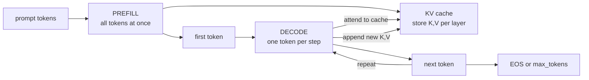

# Context Windows and the KV Cache

> **Interview answer (say this first).** The context window is the maximum number of tokens a model can attend to at once, counting prompt plus response. It is limited because attention work grows with the square of the sequence length and because the **KV cache** — the stored keys and values for past tokens — grows linearly with tokens and occupies GPU memory. The KV cache trades memory for speed: without it, every generated token would recompute the entire prefix, so generation would be dramatically slower.

## Why this exists

A language model is a stateless function. It has no memory between calls. Every request carries the full conversation: system prompt, chat history, retrieved documents, tools, and the new question.

That input has a hard ceiling, the **context window**. Two separate costs create the ceiling.

The first cost is **compute**. Attention compares every token with every other token. A prompt of `n` tokens produces an `n × n` grid of comparisons. Double the tokens and the work roughly quadruples. This is why long prompts take noticeably longer before the first word appears.

The second cost is **memory**. To generate the next token without redoing work, the model stores the intermediate **keys** and **values** for every token it has already seen. That store is the **KV cache**. It grows with the number of tokens, and it sits in the same GPU memory as the model weights. Long contexts therefore consume memory that would otherwise serve other requests.

A concrete number makes it real. Llama 2 7B stores about **512 KiB of KV cache per token**. At its 4,096-token limit, a single conversation needs about **2 GiB** of cache. At 8,192 tokens that doubles to **4 GiB**. An 80 GB GPU with ~16 GB of weights has roughly 58 GiB left for cache, which is about **14** concurrent 8k-token conversations at 4 GiB each — and that number halves every time you double the context. Long-context traffic directly reduces how many users you can serve in parallel.

This is why context is expensive, why providers charge more for long prompts, and why "just put everything in the prompt" is a strategy with a real bill.

## Start from zero

| Word | Plain meaning |
| --- | --- |
| **Context window** | The maximum number of tokens the model can process in one call, prompt plus completion. |
| **Attention** | The mechanism where each token looks at other tokens and mixes in their information. |
| **Query, key, value (Q, K, V)** | Three projections of each token. A query is compared with keys to decide what to read from values. |
| **KV cache** | Stored keys and values from earlier tokens, reused instead of recomputed. |
| **Prefill** | The first pass: all prompt tokens processed together in parallel. Compute-heavy. |
| **Decode** | The generation phase: one token at a time, reading the KV cache. Memory-heavy. |
| **TTFT** | Time To First Token. Dominated by prefill and queuing. |
| **TPOT / ITL** | Time Per Output Token / Inter-Token Latency. Dominated by decode. |
| **Layer** | One transformer block; each layer has its own KV cache. |
| **Head** | One parallel attention sub-computation inside a layer. |
| **head_dim** | The number of features per head. K and V each have `head_dim` numbers per token per head. |
| **MHA** | Multi-Head Attention: every query head has its own key/value head. Largest cache. |
| **MQA** | Multi-Query Attention: all query heads share one key/value head. Smallest cache. |
| **GQA** | Grouped-Query Attention: query heads share a small number of key/value heads. The common middle ground. |
| **fp16 / bf16** | Number formats using 2 bytes. The usual cache precision. |
| **Concurrency** | How many requests are served at the same time. |
| **Throughput** | Total tokens generated per second across all requests. |
| **PagedAttention** | Serving technique that stores the cache in fixed-size blocks to reduce fragmentation. |

Two contrasts to hold onto:

- **Prefill vs decode.** Prefill is parallel and compute-bound; decode is sequential and memory-bandwidth-bound. They have different bottlenecks, so optimising one does not fix the other.
- **Compute cost vs memory cost.** Attention is the compute story (roughly quadratic). The cache is the memory story (roughly linear). Both grow with tokens.

## The core idea

Picture a desk. The **context window** is how large the desk is. The **KV cache** is a pad of sticky notes where you write down everything said so far, so you never have to reread the whole conversation to answer the next question.

Without the notes, every new sentence forces you to reread the entire transcript from the beginning. That is the no-cache case. With the notes, you read the new sentence, glance at the pad, and answer. Much faster — but the pad grows with the conversation, and the desk can only hold so many pads.



The cache size is not a mystery. Each token contributes one key vector and one value vector, for every layer and every key/value head:

```text
KV bytes per token = 2  x  n_layers  x  n_kv_heads  x  head_dim  x  bytes_per_number
                     ^
              K and V, one each
```

The `2` is for the two tensors. Multiply by the number of tokens and you have the whole cache. That single formula explains why different models are so different:

| Attention type | KV heads | KV per token (32 layers, head_dim 128, fp16) | Used by |
| --- | --- | --- | --- |
| MHA | 32 | 512 KiB | Llama 2 7B |
| GQA | 8 | 128 KiB | Llama 3 8B, Mistral 7B |
| GQA | 8 (80 layers) | 320 KiB | Llama 3 70B |
| MQA | 1 | 16 KiB | some serving-optimised models |

GQA exists precisely to shrink this cache. By letting groups of query heads share a few key/value heads, it cuts cache memory by 4x or more while keeping most of the quality of full attention.

## How it works

1. **Count the input.** Tokenize the full request and check it against the context window. The limit covers prompt **and** completion, not just the prompt.
2. **Prefill.** Run all prompt tokens through the network in one parallel forward pass. Every token attends to every earlier token, so the work is about `n × n` comparisons across the sequence. Cache the keys and values produced at every layer.
3. **Emit the first token.** The prefill pass produces logits for the first output token. The time spent here plus queuing is the **TTFT**.
4. **Decode one token.** Take the newly generated token, compute its query, key, and value. Compare its query with all cached keys, read the matching values, and produce the next token.
5. **Append to the cache.** Add the new key and value. The cache now has one more entry per layer.
6. **Repeat.** Steps 4–5 run once per output token. This is the **autoregressive loop**.
7. **Stop.** Generation ends when the model emits an end-of-sequence token or hits `max_tokens`.
8. **Enforce the limit.** If the conversation exceeds the context window, the server truncates, summarises, or evicts old tokens. Silent truncation is a common source of "the model forgot" bugs.

The memory size after step 6 is exactly:

```text
cache_bytes = 2 * n_layers * n_kv_heads * head_dim * n_tokens * bytes_per_number
```

Concurrency follows directly. If a GPU has `M` bytes free for cache and each request at length `n` needs `cache_bytes`, then about `M / cache_bytes` requests fit. Longer contexts mean fewer concurrent users, which means lower throughput and higher cost per request.

> **Note:**
>
> **Why the third limit is training, not just hardware.** A model learns its positional patterns only up to the length it was trained on. Beyond that length, the position signals are out of distribution and quality can drop even if memory and compute allow it. That is why "128k context" usually means the model was trained or fine-tuned with long-context data, sometimes using techniques like RoPE scaling (rescaling the rotary position embeddings so the model can extrapolate to positions beyond its training length) or sliding-window attention.


**PagedAttention** is the trick that makes cache memory practical. A naive server pre-allocates cache for the maximum sequence length of each request, so a request that might generate 4,000 tokens reserves room for 4,000 even if it stops at 200. Memory is wasted and fragmented. PagedAttention stores the cache in small fixed-size blocks allocated on demand, much like virtual memory pages. It reduces fragmentation dramatically and is a big part of why modern servers handle many concurrent requests.

**Sliding-window attention** is another lever. Instead of every token attending to all earlier tokens, each token attends only to the last `w` tokens. The cache becomes constant-size rather than growing with the sequence, at the cost of forgetting far-away context. Some models mix a few global-attention layers with many local ones to get both.

### What attention actually costs

To see why context is expensive, count the comparisons. For a sequence of `n` tokens, attention builds a score for every ordered pair: `n` queries against `n` keys, so `n × n` scores per head per layer.

```text
n = 1,024  ->      1,048,576 scores  (1x)
n = 2,048  ->      4,194,304 scores  (4x)
n = 4,096  ->     16,777,216 scores  (16x)
n = 8,192  ->     67,108,864 scores  (64x)
```

Doubling the context quadruples the score matrix. This is the quadratic that sets the compute ceiling. Decode is gentler per step: the new query attends to `n` cached keys, so one step is `O(n)`. But summed over `n` generated tokens, the total is still quadratic.

## The syntax you will use

**Compute the cache size.** This formula is worth memorising; you will use it in capacity planning.

```python
def kv_bytes_per_token(n_layers, n_kv_heads, head_dim, bytes_per=2):
    return 2 * n_layers * n_kv_heads * head_dim * bytes_per

kv_bytes_per_token(32, 32, 128)   # 524288   -> Llama 2 7B, 512 KiB/token
kv_bytes_per_token(32, 8, 128)    # 131072   -> Llama 3 8B, 128 KiB/token
```

`2` is the K and V pair; `bytes_per=2` is fp16.

**Scale it to a context length.**

```python
per_token = kv_bytes_per_token(32, 8, 128)
ctx = 8192
total = per_token * ctx            # 1073741824 bytes = 1.0 GiB
print(total / 1024**3, "GiB")      # 1.0
```

**Count tokens against the window.** Always use the model's own tokenizer.

```python
import tiktoken
enc = tiktoken.get_encoding("cl100k_base")
prompt = "What is the capital of France?"
n = len(enc.encode(prompt))        # 7 tokens
reserve_for_answer = 500
fits = n + reserve_for_answer <= 128_000
```

**Reason about the cache tensor shape.** In a framework the cached keys have a shape like this.

```python
# (batch, n_kv_heads, cached_tokens, head_dim)
# one tensor for K and one for V, per layer
# growing the last-but-one dimension by 1 per decode step
```

**Cap the output, not the input.** `max_tokens` is the completion budget.

```python
response = client.chat.completions.create(
    model="gpt-4o",
    messages=messages,
    max_tokens=500,          # completion limit
    # prompt tokens + 500 must fit in the model's context window
)
```

**Serving knobs.** Inference servers expose the memory trade-off directly.

```python
# vLLM-style configuration (conceptual)
# gpu_memory_utilization=0.90   # fraction of GPU used for weights + cache
# max_model_len=8192            # cap on sequence length per request
# max_num_seqs=64               # cap on concurrent sequences
```

Lower `max_model_len` allows more concurrent requests. That is the central serving trade-off.

## Examples: simple to real

**Example 1 — cache per token for a classic model.** Llama 2 7B uses full MHA, which is why its cache is large.

```text
2 x 32 layers x 32 KV heads x 128 head_dim x 2 bytes = 524,288 B/token = 512.0 KiB
```

Half a megabyte **per token**. A 4,096-token conversation already costs 2 GiB.

**Example 2 — GQA cuts the cache.** Llama 3 8B and Mistral 7B share keys and values across groups of query heads.

```text
Llama 2 7B  (MHA, 32 KV heads): 512.0 KiB/token
Llama 3 8B  (GQA,  8 KV heads): 128.0 KiB/token   # 4x smaller
Llama 3 70B (GQA,  8 KV heads, 80 layers): 320.0 KiB/token
```

The 70B model has more layers, so its per-token cache is larger despite GQA.

**Example 3 — a full context costs real memory.** Same models, scaled to their context:

| Model | 4,096 tokens | 8,192 tokens | 32,768 tokens | 131,072 tokens |
| --- | --- | --- | --- | --- |
| Llama 2 7B (MHA) | 2.0 GiB | 4.0 GiB | 16.0 GiB | 64.0 GiB |
| Llama 3 8B (GQA) | 0.5 GiB | 1.0 GiB | 4.0 GiB | 16.0 GiB |
| Llama 3 70B (GQA) | 1.25 GiB | 2.5 GiB | 10.0 GiB | 40.0 GiB |

A 131k-token conversation on Llama 2 7B would need **64 GiB of cache** — more than the model weights themselves. This is why GQA and cache compression exist.

**Example 4 — cache size caps concurrency.** On an 80 GiB GPU with 16 GiB of weights and 6 GiB of overhead, about 58 GiB is left for cache.

```text
at 8,192 tokens:  1.0 GiB per request  -> ~58 concurrent requests
at 32,768 tokens: 4.0 GiB per request  -> ~14 concurrent requests
```

Four times the context means roughly one quarter of the users. Long context is not just slower per request; it lowers total capacity.

**Example 5 — without a cache, generation is far slower.** Generating `N` tokens without a cache means re-running the model on the whole prefix each step.

```text
N=  100: with cache=      100 passes, without=          5,050 passes (50x)
N= 1000: with cache=    1,000 passes, without=        500,500 passes (500x)
N= 8192: with cache=    8,192 passes, without=     33,558,528 passes (4096x)
```

The pass count alone grows quadratically, and each pass also does attention over its whole input. The cache exists to remove this recomputation.

**Example 6 — prefill dominates the wait, decode dominates the stream.** Suppose prefill runs at 2,000 tokens/s and decode at 50 tokens/s (illustrative rates):

```text
prompt=   500, generate=100: prefill 0.25s + decode 2.00s = 2.25s  (TTFT 0.25s)
prompt= 4,000, generate=100: prefill 2.00s + decode 2.00s = 4.00s  (TTFT 2.00s)
prompt=16,000, generate=100: prefill 8.00s + decode 2.00s = 10.00s (TTFT 8.00s)
```

A long prompt hurts **time to first token**, which users feel as "it is thinking". The output length hurts the total time and the cost.

**Example 7 — context windows vary widely by model.** The advertised limit is a starting point for planning, not a promise of useful recall:

| Model family | Context window | Cache note |
| --- | --- | --- |
| Llama 2 7B | 4,096 | MHA, 512 KiB/token is painful |
| Mistral 7B | 32,768 | GQA keeps it practical |
| Llama 3.1 8B | 131,072 | GQA plus long-context training |
| GPT-4o class | 128,000 | hosted; per-token pricing |
| Claude 3.x class | 200,000 | hosted |
| Gemini 1.5 class | up to 1,000,000 | specialised long-context serving |

A bigger window is not automatically better. Filling it raises cost and latency, and quality often declines before the hard limit is reached. Decide what to include; do not simply include everything.

## In production

- **The context window includes the output.** Reserve room for the completion, or requests fail. `max_tokens` is the completion budget, not the prompt budget.
- **Context is not free or neutral.** Every extra token raises cost, raises latency, and lowers the number of concurrent requests. Retrieval should return a few relevant chunks, not everything.
- **Long context does not mean perfect recall.** Models can lose information in the middle of a long prompt. Retrieval quality beats raw length for most tasks.
- **Truncation is silent by default.** If a request exceeds the limit, many pipelines drop the oldest tokens without telling anyone. Log and test your truncation policy.
- **Serve at a sane max length.** Capping `max_model_len` and `max_num_seqs` protects the GPU and keeps tail latency predictable.
- **Cache memory is shared with weights.** On a fixed GPU, more context per request means fewer requests. Capacity planning must use the KV formula, not just model size.
- **Prefix caching pays off for repeated prompts.** If many requests share a long system prompt, reuse its cached keys and values instead of recomputing prefill each time.
- **GQA and quantised caches are the main levers.** Smaller KV heads and int8/int4 caches shrink memory, sometimes with a small quality cost.
- **Prefill and decode fail differently.** Prefill spikes from huge prompts create latency spikes; long decode phases consume memory for a long time. Monitor TTFT and inter-token latency separately.
- **Streaming helps perceived latency, not total cost.** It does not reduce tokens; it just shows the first ones sooner.
- **Context limit errors are the top integration bug.** Count tokens with the model's tokenizer before sending, including tool schemas and chat formatting overhead.
- **Beware context rot.** As the prompt fills with low-value text, answer quality can degrade even when everything still "fits". Curate the context.

## Interview questions

### 1. What is a context window, and why is it limited?

**Answer.** It is the maximum number of tokens a model can attend to in one call, counting prompt plus completion. It is limited by three things: attention compute grows roughly with the square of the sequence length, the KV cache grows linearly with tokens and consumes GPU memory, and models are trained at a fixed length so they generalise poorly far beyond it.

**Follow-up: "Why not train at unlimited length?"** Attention cost makes long-sequence training very expensive, and long-range dependencies are hard to learn. Researchers do extend context with better positional methods, but it is a real engineering cost.

**Trap.** Thinking the limit is an arbitrary product decision. It follows from the mathematics and memory of attention.

### 2. What is the KV cache, and why is it needed?

**Answer.** During generation each token produces a key and a value at every layer. The KV cache stores those for all earlier tokens so the model does not recompute them. Without it, generating token `t` would require a full forward pass over the entire prefix, so generation would slow down dramatically as the answer grows.

**Follow-up: "What does the cache cost?"** Memory proportional to layers, key/value heads, head dimension, and token count. That memory competes with model weights and other requests on the same GPU.

**Trap.** Calling the cache "the model's memory". It only stores attention intermediates for the current sequence; it is discarded when the request ends, and it is not training or long-term memory.

### 3. Write the formula for KV cache memory.

**Answer.** `2 × n_layers × n_kv_heads × head_dim × n_tokens × bytes_per_number`. The `2` is for the separate key and value tensors, and `bytes_per_number` is 2 for fp16. For Llama 2 7B in fp16 that is `2 × 32 × 32 × 128 × 2 = 524,288` bytes per token, or 512 KiB.

**Follow-up: "Where does the `2` come from?"** One factor for K and one for V. If you forget it you under-estimate memory by half, which is a serious capacity-planning error.

**Trap.** Using the number of **query** heads when the model uses grouped-query attention. GQA stores keys and values only for the KV heads, not all query heads.

### 4. What is the difference between prefill and decode?

**Answer.** Prefill processes the whole prompt in one parallel pass, computes and caches all keys and values, and produces the first token. It is compute-bound, and it dominates time to first token. Decode generates one token per step, reading the cache and appending to it. It is memory-bandwidth-bound and dominates inter-token latency.

**Follow-up: "Why can't prefill and decode be optimised the same way?"** Prefill likes large matrix multiplications and high compute utilisation; decode is limited by reading the cache from memory. Serving systems batch them differently and sometimes separate the two phases onto different hardware.

**Trap.** Treating them as one measurement. A slow first token and slow streaming have different causes and different fixes.

### 5. How does context length affect concurrency and cost?

**Answer.** The cache per request grows linearly with tokens. On a fixed GPU, longer sequences mean fewer requests fit at once, so throughput drops and the cost per request rises. Providers pass that through as higher prices for long inputs.

**Follow-up: "What are the levers?"** Use GQA models, quantise the cache to int8 or int4, cap `max_model_len`, use prefix caching for shared prompts, and keep retrieved context small.

**Trap.** Assuming batching makes everything free. Batching improves GPU utilisation, but memory per sequence still limits how many sequences fit.

### 6. What is grouped-query attention?

**Answer.** GQA is a middle ground between multi-head attention (one key/value head per query head) and multi-query attention (a single shared key/value head). Query heads are divided into groups, and each group shares one key/value head. This cuts the KV cache by the group factor while preserving most quality.

**Follow-up: "Why not just use MQA everywhere?"** Sharing a single key/value head can hurt quality, especially for harder tasks. GQA keeps most of the memory saving with less quality loss, which is why most modern open models use it.

**Trap.** Saying GQA reduces attention compute. It mainly reduces cache memory and the work of storing and loading keys and values; the query-side computations remain.

### 7. What happens when a conversation exceeds the context window?

**Answer.** The application must decide: truncate old turns, summarise them, or evict less important content. The model itself only sees the tokens it is given, so the quality of this policy directly determines whether the conversation "remembers" correctly. Many stacks truncate silently, which surprises users.

**Follow-up: "What is a good policy?"** Keep the system prompt and the most recent turns, summarise older history, and reserve space for retrieved documents and the answer. Then log when truncation happens so you can tune it.

**Trap.** Assuming the provider handles it gracefully. Some APIs error out; others truncate from the start, dropping your system prompt, which changes behaviour badly.

### 8. Why does a long prompt feel slow even though generation is fast?

**Answer.** Because the prompt is processed by prefill, and prefill work grows with the square of the prompt length. A 16,000-token prompt does far more attention work than a 1,000-token prompt, so time to first token grows sharply. The decode speed for the answer is a separate measurement.

**Follow-up: "How would you reduce that?"** Trim the prompt, retrieve fewer but better chunks, cache the shared prefix, and use a model or server optimised for long-prompt prefill.

**Trap.** Fixing the wrong end. Adding more retrieved context to "help" can make the user wait longer and can even lower answer quality.

## Remember this

- The **context window** counts prompt **plus** completion, and it is limited by quadratic attention compute and linear cache memory.
- The **KV cache** stores past keys and values; it trades memory for speed and makes decode linear in tokens per step.
- **Memory formula:** `2 × layers × KV heads × head_dim × tokens × bytes`. For Llama 2 7B that is **512 KiB per token**.
- **GQA** cuts the cache by sharing key/value heads, enabling longer context or more concurrency.
- **Prefill sets TTFT; decode sets streaming speed and steady memory.** Optimise and monitor them separately.
