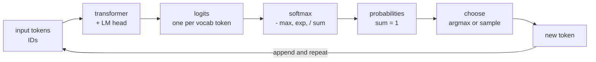

# Logits, Softmax, and Next-Token Prediction

> **Interview answer (say this first).** A language model outputs one raw score called a **logit** for every token in its vocabulary. **Softmax** turns those scores into a probability distribution, subtracting the maximum first so the exponentials do not overflow. Generation picks a token from that distribution, appends it to the input, and repeats — that autoregressive loop is all text generation is. Training compares the predicted distribution with the true next token using **cross-entropy loss**.

## Why this exists

The whole product is "predict the next token". Everything a model appears to do — answering, coding, summarising, calling a tool — comes out of that one operation repeated.

So look closely at the operation. After the transformer has processed the input, it has one vector of hidden numbers for the current position. That vector has to become a **choice among tens of thousands of vocabulary tokens**. The network produces a raw score for each candidate. The scores are arbitrary real numbers, positive or negative, large or small. They are not probabilities: they do not sum to one, and a score of `5.0` does not mean "five times as likely" as `1.0`.

Without a normalisation step, you could not:

- Report a confidence.
- Compare two different positions fairly.
- Sample sensibly, because there is no "chance of winning".
- Train with a loss that measures surprise.

**Softmax** is that normalisation step. It converts the raw scores into a proper probability distribution: every value is between 0 and 1, and they sum to 1. Then you either take the largest (greedy) or sample from it (with temperature and other controls).

This one page explains the model's output, how training measures error, and why generation is a loop rather than a single answer. It is the bridge between the mathematics of the network and the text you actually see.

## Start from zero

| Word | Plain meaning |
| --- | --- |
| **Logit** | A raw, unnormalised score for one class or token. Can be any real number. |
| **Logits vector** | One score per vocabulary token, of length `V`. |
| **Softmax** | The function that turns a vector of scores into probabilities that sum to 1. |
| **Probability distribution** | A list of non-negative numbers that sum to 1. |
| **Argmax** | The index of the largest value. Picking it is **greedy decoding**. |
| **Sampling** | Drawing a token randomly according to the probabilities. |
| **Temperature** | A number that divides the logits before softmax. Lower = sharper, higher = flatter. |
| **Top-k** | Keep only the `k` highest-probability tokens; discard the rest. |
| **Top-p (nucleus)** | Keep the smallest set of tokens whose probabilities add up to at least `p`. |
| **Cross-entropy** | A loss that measures how much probability the model gave the true answer. Lower is better. |
| **Negative log-likelihood (NLL)** | `-log(p)` for the true token. Cross-entropy is the average NLL. |
| **Perplexity** | `exp(cross-entropy)`. Roughly, how many equally likely options the model is torn between. |
| **Autoregressive** | Each output token is fed back as input to predict the next one. |
| **Generation loop** | The repeated "predict, pick, append" cycle that produces text. |
| **Teacher forcing** | Training with the true previous token as input, instead of the model's own prediction. |
| **Prompt** | The input tokens you supply. |
| **Completion** | The tokens the model generates. |
| **EOS** | The end-of-sequence token; emitting it stops generation. |
| **LM head** | The final linear layer that projects the hidden state to vocabulary-sized logits. |
| **Weight tying** | Reusing the embedding matrix as the LM head, saving parameters. |

Two contrasts matter:

- **Logits vs probabilities.** Logits are scores; probabilities are their softmax. Raw logits can be negative or greater than 1; probabilities cannot.
- **Training vs inference conditioning.** Training feeds the true previous token (teacher forcing). Inference feeds the model's own previous token. That difference is called **exposure bias**.

## The core idea

Think of a horse race. Each horse has a **strength rating** — that is the logit. The ratings are not probabilities; they are arbitrary numbers. To turn them into **winning chances**, you need a rule that maps strengths to shares that add up to 100%.

Softmax is that rule. It exponentiates each rating and divides by the total. A horse rated much higher gets a much larger share, but no horse ever has a negative or zero chance.



That loop, top to bottom and back, is how every chat response is produced. Here is the same idea numerically:

| Stage | Value |
| --- | --- |
| Logits | `[2.0, 1.0, 0.1]` |
| After softmax | `[0.659, 0.242, 0.099]` |
| Sum | `1.000` |
| Greedy pick | index `0` (value `2.0`) |

The model is not "deciding" in any human sense. It is computing a distribution and drawing from it.

## How it works

1. **Run the forward pass.** The transformer produces a hidden vector for the current position, of size `hidden_dim` (for example 4096).
2. **Project to vocabulary size.** The LM head is a linear layer with shape `hidden_dim × vocab_size`. It produces one logit per token in the vocabulary.
3. **Stabilise.** Subtract the maximum logit from every logit. This leaves the probabilities unchanged because softmax is invariant to adding or subtracting the same constant, but it prevents overflow.
4. **Exponentiate and normalise.** Compute `exp` of each adjusted logit, then divide by the sum. Now you have a probability distribution.
5. **Choose a token.** Greedy takes `argmax`. Sampling draws according to the probabilities, optionally after temperature, top-k, or top-p reshaping.
6. **Append.** Add the chosen token ID to the input sequence.
7. **Repeat.** Steps 1–6 run once per output token. This is the autoregressive loop. Stop at EOS or a token limit.
8. **Train.** During training, run one forward pass over a whole text sequence. At every position the model produces logits for the next token. Compare each with the true next token using cross-entropy, average over positions, backpropagate, and update the weights. Because the inputs are the true tokens, the whole sequence can be scored in parallel — that is teacher forcing.

The training objective in one line: make the probability assigned to the **actual** next token as high as possible. Equivalently, minimise the negative log probability of the true token. Cross-entropy is exactly that average.

> **Note:**
>
> **Logits are unnormalised log-probabilities.** Because `log(softmax(z)[i]) = z[i] - logsumexp(z)`, where `logsumexp(z) = log(sum(exp(z)))`, cross-entropy can be computed straight from logits as `logsumexp(z) - z[target]`. Frameworks use this log-sum-exp form, which avoids materialising probabilities and stays numerically stable.


> **Note:**
>
> **Softmax is invariant to shifts, not to scale.** Subtracting the max is mathematically exact — it changes nothing about the result. Dividing the logits by a temperature `T` **does** change the result, deliberately: `T < 1` sharpens the distribution and `T > 1` flattens it. That is the subject of the next topic, sampling.


## The syntax you will use

**A numerically stable softmax.** This is the function to know by heart.

```python
import numpy as np

def softmax(z):
    z = np.asarray(z, dtype=float)
    z = z - np.max(z)        # subtract max: exact, and prevents overflow
    e = np.exp(z)
    return e / np.sum(e)
```

Subtracting the max keeps the largest exponent at `exp(0) = 1`, so nothing overflows.

**Why the max matters.** Without it, large logits overflow.

```python
def softmax_naive(z):
    e = np.exp(z)
    return e / np.sum(e)

softmax_naive([1000.0, 1000.0, 1000.0])   # [nan, nan, nan]
softmax([1000.0, 1000.0, 1000.0])         # [0.333, 0.333, 0.333]
```

`exp(1000)` is `inf`, and `inf / inf` is `nan`. The stable version gives the correct uniform distribution.

**Cross-entropy from logits.** The loss for one position is the negative log probability of the true token.

```python
def cross_entropy(logits, target_index):
    p = softmax(logits)
    return -np.log(p[target_index])

cross_entropy([2.0, 1.0, 0.1], 0)   # 0.4170 — true token was likely
cross_entropy([2.0, 1.0, 0.1], 2)   # 2.3170 — true token was unlikely
```

The loss is small when the model gave the true token a high probability, and large when it did not.

**Greedy decoding with `argmax`.** The simplest possible generation.

```python
next_id = int(np.argmax(logits))          # most likely token
```

**A minimal generation loop.** This is the shape of every LLM call.

```python
def generate(next_logits_fn, start_ids, max_new_tokens, eos_id):
    ids = list(start_ids)
    for _ in range(max_new_tokens):
        logits = next_logits_fn(ids)      # forward pass
        token = int(np.argmax(logits))    # greedy choice
        if token == eos_id:
            break
        ids.append(token)                 # append and continue
    return ids
```

`next_logits_fn` stands in for the model. The loop does not change when the model gets bigger.

**Temperature.** Divide the logits before softmax.

```python
logits = np.asarray(logits, dtype=float)   # elementwise math needs an array
p_hot  = softmax(logits / 0.5)   # sharper, more deterministic
p_base = softmax(logits / 1.0)   # unchanged
p_cold = softmax(logits / 2.0)   # flatter, more random
```

**Top-k and top-p, in one line each.** Both reshape the distribution before sampling.

```python
logits = np.asarray(logits, dtype=float)   # elementwise math needs an array
k = 50
top_k = np.argsort(logits)[-k:]            # keep the k largest logits
p = softmax(logits[top_k])                 # sample only among these
```

Top-p keeps the smallest set of tokens whose cumulative probability reaches `p`. Both remove the long tail of low-probability tokens that causes bizarre outputs.

**The decoding strategies side by side.** These are the options you choose between in every API call:

| Strategy | Rule | Typical effect |
| --- | --- | --- |
| Greedy | take `argmax` | deterministic, can loop |
| Temperature | divide logits by `T` | lower sharpens, higher flattens |
| Top-k | keep the `k` largest | removes the tail, fixed size |
| Top-p | keep smallest set reaching `p` | adapts to confidence |
| Beam search | keep `B` best sequences | better for translation, slower |

Temperature, top-k, and top-p all operate on the same logits and can be combined. They do not change the model, only how you read its distribution.

## Examples: simple to real

**Example 1 — from scores to probabilities.** A small, ordinary case.

```text
logits  = [2.0, 1.0, 0.1]
softmax = [0.659001, 0.242433, 0.098566]
sum     = 1.0
```

The largest logit gets the largest probability, but the gap is softened by the exponential. A logit difference of 1.0 is meaningful but not overwhelming.

**Example 2 — numerical stability is not optional.** Three equal logits should give three equal probabilities.

```text
naive softmax([1000, 1000, 1000])  = [nan, nan, nan]
stable softmax([1000, 1000, 1000]) = [0.333333, 0.333333, 0.333333]
```

This is why every real implementation subtracts the max. In `float32`, overflow starts around `exp(89)`, because the largest float32 is about `3.4e38` and `ln(3.4e38) ≈ 88.7`.

**Example 3 — cross-entropy measures surprise.**

```text
logits=[2, 1, 0.1]  target=0 -> loss=0.4170
logits=[2, 1, 0.1]  target=2 -> loss=2.3170
logits=[10, 0, 0]   target=0 -> loss=0.0001   (very confident and right)
logits=[0, 10, 0]   target=0 -> loss=10.0001  (very confident and wrong)
```

Confident and wrong is punished hardest. That asymmetry is what forces the model to be calibrated, and it is why cross-entropy dominates language-model training.

**Example 4 — a tiny model and real greedy generation.** Build a character-level bigram model by counting which character follows which in a small corpus. The normalised counts are the probabilities for the next character (equivalently, the log-counts act as the logits).

```python
corpus = "the cat sat on the mat. a rat ran to the man. a man sat on a mat. the cat ran to the man. a rat sat on the mat. the area has a cat. the sea has a name. the three cats sat on the mat."
counts = {}
for a, b in zip(corpus, corpus[1:]):
    counts.setdefault(a, {})[b] = counts.get(a, {}).get(b, 0) + 1

def greedy(start, n):
    out = start
    for _ in range(n):
        out += max(counts[out[-1]], key=counts[out[-1]].get)
    return out
```

```text
alphabet size: 12   chars: " .acehmnorst"
after 'a', the next-char distribution is:
   't': 0.4516
   ' ': 0.2581
   'n': 0.1613
   's': 0.0645
   'r': 0.0323
   'm': 0.0323

greedy from 't': 'the the the the the the th'
greedy from 'a': 'athe the the the the the t'
```

The model learned nothing but local frequencies, yet the greedy loop produces plausible-looking text. That is the same loop GPT-class models run; only the function producing logits is bigger.

**Example 5 — teacher forcing versus free running.** Training conditions on the true previous token; inference conditions on the model's own output. Using the bigram counts from Example 4:

```text
reference sentence      : 'the cat sat on the mat.'
teacher-forced loss     : 0.9711    (average CE over true prefixes)
log P(reference)        : -21.3641  (sum over true prefixes)
free-running generation : greedy('t', 25) = 'the the the the the the th'
P(next='c' | prefix ends in a space) = 0.0870
```

The greedy loop produces a different, repetitive sentence. This toy bigram only looks at the previous character, so one mistake does not fully cascade. In a real transformer every generated token becomes part of the context for all later tokens, so a single wrong token can send the whole continuation off course. Training never shows the model these self-generated prefixes, which is **exposure bias**; in production it appears as repetition, drift, and self-correction.

**Example 6 — perplexity makes the loss readable.** Perplexity is `exp(loss)`.

```text
loss=0.4170  -> perplexity=1.52
loss=10.0001 -> perplexity=22028.47
```

A perplexity of 1.52 means the model is nearly certain; 22,028 means it is spread across a huge number of nearly equally likely options. Lower is better, and the scale is comparable across models that share a tokenizer — which is another reason tokenizers matter.

## In production

- **Always subtract the max before `exp`.** A naive softmax returns `nan` on large logits, and a `nan` loss destroys training. This is a real bug people ship.
- **Temperature is not a quality knob.** Lower temperature makes output more repetitive and deterministic; higher makes it more creative and more likely to hallucinate. Pick per task and test.
- **Greedy decoding is reproducible but bland.** Always taking `argmax` removes randomness and often loops. Most chat products sample with temperature above 0.
- **Cross-entropy is not the product metric.** A lower training loss does not guarantee more useful answers. Evaluate on real tasks.
- **The vocabulary is huge, so the LM head is expensive.** A 200k vocabulary produces 200k logits per position. Weight tying and efficient kernels reduce the cost.
- **Numerical precision changes results.** The same logits in fp16 vs fp32 can produce slightly different probabilities, and occasionally different tokens. Reproducibility across hardware is not guaranteed.
- **Sampling needs a seed for tests.** Temperature and top-p make outputs nondeterministic. Record the seed, or use temperature 0 for deterministic checks.
- **Top-p usually beats fixed top-k.** The nucleus adapts to how confident the model is. A fixed `k` can cut off good options when the model is uncertain and include bad ones when it is sure.
- **EOS handling is a common bug.** If the stop token is not handled, generation runs to the token limit, costing money and producing trailing junk.
- **Confidence is not correctness.** A high-probability token can still be factually wrong. Softmax probabilities reflect the model's training distribution, not truth.
- **Tokenizer and logits are coupled.** The index of a token in the logits vector is its ID in that model's tokenizer. Mixing them silently produces the wrong text.
- **Batch generation changes latency, not the math.** Serving many requests at once uses the same softmax and picking, but scheduling and the KV cache decide the user-visible speed.

## Interview questions

### 1. What is a logit, and how is it different from a probability?

**Answer.** A logit is the raw, unnormalised score the model produces for a token. It can be any real number, and the logits do not sum to one. A probability is the result of applying softmax to the logits; probabilities are non-negative and sum to one. The model computes logits; the application converts them to probabilities to sample or report confidence.

**Follow-up: "Can you read meaning directly from logits?"** Only their relative order and spacing. The softmax conversion is what makes them comparable as chances, and even then they reflect the training distribution, not truth.

**Trap.** Calling logits "probabilities" or treating a logit of 5 as five times more likely than 1. The exponential in softmax makes the relationship nonlinear.

### 2. Why does softmax subtract the maximum?

**Answer.** For numerical stability. `exp` of a large number overflows to infinity, and dividing infinity by infinity gives `nan`. Subtracting the maximum keeps the largest exponent at `exp(0) = 1`. Because softmax is invariant to adding or subtracting the same constant from all logits, the result is mathematically identical to the naive version.

**Follow-up: "Does it change the distribution?"** No. It is an exact algebraic identity, not an approximation. It only changes floating-point behaviour.

**Trap.** Thinking the max subtraction is a normalisation that changes the answer. It is purely a numerical safeguard.

### 3. What is cross-entropy loss in language modelling?

**Answer.** It is the negative log probability the model assigned to the true next token, averaged over positions. Minimising it pushes the model to give the actual next token a high probability. A confident wrong prediction is penalised very heavily, which keeps the model calibrated.

**Follow-up: "How does it relate to perplexity?"** Perplexity is `exp(cross-entropy)`. It translates the loss into an interpretable "effective number of equally likely choices".

**Trap.** Confusing cross-entropy with accuracy. Accuracy only cares whether the top token was right; cross-entropy also punishes being confidently wrong about the rest.

### 4. Describe the autoregressive generation loop.

**Answer.** Run a forward pass to get logits, apply softmax, pick a token (greedy or by sampling), append it to the input, and repeat. Each new token conditions on all previous tokens. Generation stops at an end-of-sequence token or a maximum length. This loop is the only thing a text LLM does at inference.

**Follow-up: "Why can the model produce long coherent text from one-token steps?"** Because each step conditions on the gradually growing context, and the KV cache lets it reuse earlier computations instead of recomputing the prefix.

**Trap.** Thinking the model generates a whole sentence at once. It emits exactly one token per step.

### 5. What is teacher forcing, and what problem does it cause?

**Answer.** Teacher forcing means training on the true previous token at each position, so the whole sequence can be scored in one parallel forward pass. The problem is exposure bias: at inference the model sees its own possibly-wrong outputs, a situation it never saw in training. Errors can then compound.

**Follow-up: "How is it mitigated?"** Scheduled sampling, reinforcement learning from human feedback, and careful decoding all reduce the gap. Large-scale pretraining also makes the model robust to small prefix errors.

**Trap.** Saying teacher forcing is used at inference. It cannot be; the future tokens are unknown then.

### 6. What do temperature, top-k, and top-p change?

**Answer.** Temperature divides the logits before softmax: below 1 sharpens the distribution toward the top token, above 1 flattens it. Top-k keeps only the `k` most likely tokens. Top-p keeps the smallest set of tokens whose probabilities sum to at least `p`. All three reshape the distribution before sampling; none of them change the model's logits.

**Follow-up: "Which do you use?"** Often temperature plus top-p. Top-p adapts to model confidence, while fixed top-k can be too restrictive or too loose.

**Trap.** Believing temperature 0 is always best for factual work. Greedy output is deterministic but can be repetitive and is not necessarily more correct.

### 7. Why is the LM head a bottleneck, and what is weight tying?

**Answer.** The LM head projects the hidden state to one logit per vocabulary token, so its cost scales with vocabulary size. Weight tying reuses the embedding matrix as the LM head, since both are `vocab_size × hidden_dim`. This removes a large parameter matrix and usually improves quality, especially for smaller models.

**Follow-up: "Are there downsides?"** Tying assumes embeddings and output logits should share a space, which is usually but not always best. Very large models sometimes untie for a small quality gain.

**Trap.** Forgetting that vocabulary size affects the final layer, not just the input. A bigger vocabulary raises compute on both ends.

### 8. Does a high softmax probability mean the answer is correct?

**Answer.** No. Softmax reflects the model's learned distribution over text, not truth. A model can be confidently wrong if its training data or reasoning is flawed, and probabilities are often poorly calibrated. Confidence is a signal about the model's internal state, not a guarantee.

**Follow-up: "Then how do you improve reliability?"** Ground the model with retrieval, validate outputs, ask it to produce structured data, and use tools for anything that requires exactness. Treat probability as one input to a decision, not a proof.

**Trap.** Using "the model was 99% sure" as evidence. Softmax has no notion of factual truth.

## Remember this

- The model outputs **logits** (raw scores); **softmax** turns them into probabilities that sum to 1.
- **Subtract the max** before `exp` — it is exact and prevents `nan` from overflow.
- **Generation is an autoregressive loop**: forward pass, softmax, pick, append, repeat.
- **Cross-entropy** is the negative log probability of the true next token; **perplexity** is its exponential.
- **Teacher forcing** trains on true tokens and creates **exposure bias** because inference feeds the model its own output.
