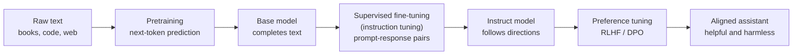

# Pretraining, Fine-Tuning, and Instruction Tuning

> **Interview answer (say this first).** Pretraining teaches a base model to predict the next token on enormous amounts of raw text using self-supervision, and that is where language ability and world knowledge come from. Supervised fine-tuning then trains the model on curated input-output pairs, and instruction tuning is supervised fine-tuning on many diverse instructions and chat-formatted conversations, usually with the loss computed only on the assistant's tokens. Instruction tuning changes behaviour — the model learns to follow directions and answer in a chat format — while pretraining supplies the underlying capability. Fine-tuning is best for behaviour, format, and domain style; prompt and RAG are usually better for adding changing facts.

## Why this exists

A model straight out of pretraining is called a **base model**. It is extremely good at one thing: continuing text. It is not trying to help you.

```text
Prompt:  "List three healthy breakfast ideas in a numbered list."
Base model: "List three unhealthy breakfast ideas in a numbered list. List three healthy
             lunch ideas... 1. 2. 3. What about snacks?"
```

The base model treats your instruction as text to continue, because that is all it was trained to do. It has seen millions of lists and questions, so it produces more of them. It has no notion that it should *answer* you.

Now the same prompt to an **instruct model**:

```text
Prompt:  "List three healthy breakfast ideas in a numbered list."
Instruct: "1. Oatmeal with berries and nuts.
           2. Greek yoghurt with fruit and seeds.
           3. Whole-grain toast with avocado and egg."
```

The knowledge was already there after pretraining. The *behaviour* — answering, following the format, staying on task — was added by fine-tuning on examples of instructions and good responses.

This distinction matters because most engineering mistakes around fine-tuning come from confusing the two. If a base model does not know a fact, fine-tuning on a few hundred examples will not reliably add it. If an instruct model knows a fact but answers in the wrong format, fine-tuning is exactly the right tool. Pretraining, instruction tuning, and preference alignment are three different stages with three different goals, and knowing which stage does what is the core of this topic.

A note on vocabulary, because the industry is loose with it. "Fine-tuning" is sometimes used to mean adding knowledge, and that is where confusion starts. Keep the stages separate: pretraining builds the model, instruction tuning makes it helpful, and preference tuning (the next page) makes it preferred. When someone says "we fine-tuned our docs in", ask which stage they mean and what data they actually used.

## Start from zero

Every term below is used for the rest of the page.

| Word | Plain meaning |
| --- | --- |
| **Pretraining** | The first, largest training stage: learn to predict the next token from raw text. |
| **Self-supervised** | The label comes from the data itself, so no humans need to label it. |
| **Next-token prediction** | Given the tokens so far, predict the token that comes next. |
| **Corpus** | The large body of text used for pretraining. |
| **Base model** | A model after pretraining only. It completes text but does not follow instructions. |
| **Foundation model** | A general base model intended to be adapted for many downstream tasks. |
| **Checkpoint** | A saved copy of the model's weights at a point in training. |
| **Fine-tuning** | Continuing to train a pretrained model on a smaller, task-specific dataset. |
| **Supervised fine-tuning (SFT)** | Fine-tuning on input-output pairs, using ordinary supervised learning. |
| **Demonstration** | An example (input, correct output) pair used in SFT. |
| **Instruction tuning** | SFT on many tasks phrased as instructions, so the model learns to follow directions. |
| **Chat template** | The exact formatting, including special tokens, used to present a conversation to the model. |
| **Role** | A label on a message, such as `system`, `user`, or `assistant`. |
| **Loss masking** | Excluding some tokens from the loss, so only the part you care about is trained. |
| **Catastrophic forgetting** | Losing general skills after fine-tuning narrowly. |
| **RAG** | Retrieval-augmented generation: fetch relevant text at request time and put it in the prompt. |
| **In-context learning** | Teaching by putting examples in the prompt, with no weight updates. |
| **Zero-shot / few-shot** | Asking with no examples, or with a handful of examples in the prompt. |
| **Preference tuning** | A later stage (RLHF or DPO) that shapes answers toward what people prefer. See the next page. |
| **Adapter / LoRA** | A small set of extra weights trained instead of the whole model. Covered later in this phase. |

Two distinctions to hold on to:

- **Pretraining teaches capability; fine-tuning teaches behaviour.** Facts, language, and reasoning come from pretraining. Format, tone, and task behaviour come from fine-tuning.
- **In-context learning changes the prompt; fine-tuning changes the weights.** The first is instant and temporary. The second is slow, persistent, and shared by everyone using the model.

## The core idea

Think of a new employee.

- **Pretraining** is reading the entire library. They absorb vocabulary, facts, and how writing works, but nobody has told them what their job is.
- **Instruction tuning** is an apprenticeship. They watch thousands of examples of a request followed by a good answer, and they learn the shape of a good response: address the ask, follow the format, be brief or detailed as asked.
- **Preference tuning** is feedback from a manager saying "this answer is better than that one", which nudges style and safety. That is the next page.

The pipeline is usually three stages, and each stage uses different data.



The stages differ in more than data:

| Stage | Data | Training signal | Relative cost | What it changes |
| --- | --- | --- | --- | --- |
| Pretraining | Raw text, trillions of tokens | Predict the next token | Largest by far | Language, knowledge, raw capability |
| Instruction tuning (SFT) | Curated prompt-response pairs | Predict the response tokens | Small | Instruction following, format, tone |
| Preference tuning | Human or AI preference pairs | Prefer chosen over rejected | Small | Helpfulness, harmlessness, style |

The jump from base to instruct is the one that surprises people. The base model is not broken; it is doing exactly what it was trained to do. Instruction tuning does not add knowledge in any reliable way. It adds the **habit** of responding to requests.

> **Note:**
>
> **The one sentence to remember.** Pretraining minimises next-token loss on everything; instruction tuning minimises response loss on good answers; preference tuning moves the model toward answers people prefer.


**Why the order matters.** You cannot instruction-tune a network that has no knowledge, because there is nothing to steer. You cannot preference-tune a base model usefully, because it does not yet follow instructions, so there is no sensible pair of responses to compare. Each stage assumes the one before it. A model trained from scratch on a small instruction dataset simply imitates that dataset; it never develops broad capability. This is also why the later stages are cheap: they steer an expensive capability instead of rebuilding it.

## How it works

1. **Collect a pretraining corpus.** Web pages, books, code, and other text, filtered and deduplicated. Quality and diversity here shape the model's ceiling.
2. **Predict the next token.** For each position, the model outputs logits for the next token, and the loss is cross-entropy against the actual next token. Because the label is just the following word, no human labelling is needed — that is what makes it self-supervised.
3. **Train for a very long time.** The same forward-loss-backward-update loop as any neural network. Training compute is often approximated as about `6 × parameters × tokens` floating-point operations for a dense transformer.
4. **Get a base model.** It can complete text fluently. It has no reliable instruction-following behaviour.
5. **Build an SFT dataset.** Collect demonstrations: a prompt or conversation, and a high-quality response. Sources include human writers, existing datasets, and outputs from stronger models (distillation).
6. **Format each example with the chat template.** Wrap messages in the special tokens the model expects, for example a `system` message, then `user`, then `assistant`. The template must match what was used at inference, or the model sees a different shape.
7. **Mask the loss.** In the common setup, the loss is computed only on the assistant's response tokens, and the prompt tokens are ignored. This teaches the model to produce answers, not to reproduce questions.
8. **Fine-tune with a small learning rate and few epochs.** SFT runs are short compared with pretraining, often one to three passes over the data. Too many epochs causes overfitting and forgetting.
9. **Optionally run preference tuning.** Use RLHF or DPO to align helpfulness and harmlessness. That is the next page.
10. **Evaluate on held-out tasks.** Check both the target task and general tasks the fine-tune could have degraded.

The loss-masking step is the one interviewers probe. If you train on the whole conversation, the model also learns to generate user turns, which it was never meant to do. Masking says: the prompt is context, the response is the target.

Where instruction data comes from matters as much as how it is trained:

| Source | Example | Strength | Risk |
| --- | --- | --- | --- |
| Human writers | Contracted annotators | High quality, on-brand | Expensive and slow |
| Public datasets | Open instruction collections | Cheap and diverse | Noisy, inconsistent, possibly stale |
| Stronger model outputs | Distillation | Fast and scalable | Bakes in the teacher's errors |
| Real usage | Logged conversations | Matches real traffic | Needs filtering, consent, and privacy care |

## The syntax you will use

**Next-token prediction as a loss, in numpy.** This is pretraining's objective in a few lines.

```python
import numpy as np

def log_softmax(x):
    x = x - x.max(axis=-1, keepdims=True)
    return x - np.log(np.exp(x).sum(axis=-1, keepdims=True))

# logits[t] predicts the token at position t+1
logits = np.array([[2.0, 1.0, 0.1], [0.5, 2.5, 0.2],
                   [1.0, 0.2, 3.0], [0.1, 3.0, 0.5]])
targets = np.array([1, 2, 0, 2])        # the actual next tokens

loss = -log_softmax(logits)[np.arange(4), targets].mean()
```

**A chat format with roles.** This is the shape SFT data takes before it is serialised.

```python
messages = [
    {"role": "system", "content": "You are a concise assistant."},
    {"role": "user", "content": "What is the capital of France?"},
    {"role": "assistant", "content": "Paris."},
]
```

Many open models expect a specific template, such as ChatML's `<|im_start|>` and `<|im_end|>` tokens, or Llama's header tokens. The tokenizer's `apply_chat_template` inserts them.

```python
prompt = tok.apply_chat_template(messages, tokenize=False, add_generation_prompt=False)
```

**Loss masking in Hugging Face.** The convention is `-100`, which the loss function ignores.

```python
# labels equal the input ids, except prompt positions are set to -100
labels = input_ids.clone()
labels[:prompt_length] = -100          # train only on the assistant's tokens
```

> **Warning:**
>
> **Verify the mask on a tiny example before a long run.** Decode the label tensor for one batch and confirm that the prompt positions are `-100` and the assistant tokens are real ids. A mask bug does not raise an error; it silently trains the wrong thing, and you discover it only after a full run.


**Fine-tuning with TRL's `SFTTrainer`.** TRL handles templating and masking.

```python
from datasets import load_dataset
from trl import SFTTrainer, SFTConfig

trainer = SFTTrainer(
    model="meta-llama/Llama-3.1-8B-Instruct",
    train_dataset=load_dataset("my-org/my-instructions", split="train"),
    args=SFTConfig(output_dir="out", num_train_epochs=2, learning_rate=1e-5),
)
trainer.train()
```

**The OpenAI fine-tuning format.** One JSON object per line, in the same `messages` shape the API uses.

```jsonl
{"messages": [{"role": "system", "content": "You are a support agent."},
              {"role": "user", "content": "How do I reset my password?"},
              {"role": "assistant", "content": "Use the reset link on the login page."}]}
```

## Examples: simple to real

**Example 1 — the next-token shift.** A language model does not have a separate label for every position. The tokens do double duty: the input is the tokens shifted left, and the target is the same sequence shifted right.

```python
# full token sequence: [10, 11, 20, 21, 22]
# logits at positions 0..3 predict tokens at positions 1..4
# measured: logits[0:4] should predict [11, 20, 21, 22]
```

That shift is the entirety of self-supervision. One sequence provides four training signals for free.

**Example 2 — loss masking changes what is learned.** Four positions, three vocabulary tokens. Positions 0 and 1 are the prompt; positions 2 and 3 are the assistant's answer.

```python
# measured per-position cross-entropy: [1.4170, 2.5116, 2.1791, 2.6285]
# loss over ALL positions:        2.1840
# loss over assistant only:       2.4038
# HF-style labels: [-100, -100, 0, 2]  -> 2 positions counted
```

The unmasked loss is lower here only because those particular prompt tokens happened to be easier. The numbers are not the point; the *target* is. Masked training optimises the assistant's tokens, which is what you want it to produce at inference. The `-100` labels are how Hugging Face marks "ignore this position".

**Example 3 — base versus instruct, same knowledge, different behaviour.** Instruction tuning does not usually teach the fact; it teaches the model to answer.

```text
Base model given "Q: What is 2 + 2? A:"  -> may continue with more questions
Instruct model given "What is 2 + 2?"     -> "4"
```

If the instruct model gets the fact wrong, fine-tuning on that one fact is an unreliable fix. Retrieval is usually the right tool. If it gets the *format* wrong, fine-tuning is the right tool.

**Example 4 — instruction tuning data is diverse by design.** Early instruction datasets covered many task types so the model would generalise "follow the instruction" rather than memorise one task. A modern SFT mix looks like a portfolio.

| Task type | Example | What it teaches |
| --- | --- | --- |
| Open question answering | "Explain photosynthesis." | Answering from knowledge |
| Extraction | "Return the dates as JSON." | Following a schema |
| Summarisation | "Summarise in two bullets." | Length and format control |
| Refusal | "Help me break into a car." | Safety behaviour |
| Tool use | "Call the weather tool for Paris." | Structured function calls |
| Multi-turn chat | A conversation | Maintaining context and role |

Diversity is the point. A narrow SFT set teaches a narrow assistant. Real SFT mixes combine public instruction datasets, domain demonstrations, and synthetic examples generated and filtered by stronger models. The mix ratio is itself a design choice: too much of one task type and the model tilts toward it.

**Example 5 — catastrophic forgetting.** Fine-tune a general model on nothing but medical question answering, and it can get better at that task while getting worse at general conversation and reasoning.

```text
Before fine-tuning: general chat good, medical QA fair
After narrow fine-tuning: medical QA good, general chat degraded
```

The narrow data pulls the weights away from the broad distribution they learned during pretraining. The standard mitigations are: use a small learning rate, train for few epochs, mix in some general data, and prefer a small adapter such as LoRA over full fine-tuning. Always evaluate on general tasks, not just the target task.

**Example 6 — choosing between prompt, RAG, and fine-tune.** The decision is about what is missing.

| Need | Best first tool | Why |
| --- | --- | --- |
| Add a fact that changes often | RAG | Facts live in a database, not in weights |
| Add private documents with citations | RAG | The source can be shown and updated |
| Change style, tone, or format | Fine-tune | Behaviour is exactly what SFT shapes |
| Teach a narrow task reliably | Fine-tune | Patterns are baked into the weights |
| Reduce prompt length and cost | Fine-tune | The instructions can be internalised |
| Try something today | Prompt | Instant, reversible, cheap |

A useful rule: **prompt for behaviour you are still designing, RAG for knowledge you cannot freeze, fine-tune for behaviour you have finished designing and need at scale.**

These tools are complements, not alternatives. A production system often uses all three: the prompt defines the task, RAG supplies current facts, and a small fine-tune enforces the output contract. Choosing one does not mean abandoning the others.

> **Tip:**
>
> **Ask what is missing before reaching for fine-tuning.** If the model does not know something, retrieve it. If it knows but formats it wrong, fine-tune. If you are still deciding what "right" even means, keep prompting. This order saves weeks of wasted training runs.


## In production

- **Fine-tune for form, retrieve for facts.** Fine-tuning can make a model answer in your JSON schema every time. It does not reliably add a new policy number or today's prices; retrieval does.
- **Always hold out evaluation data.** If you train and evaluate on the same examples, you measure memorisation. Keep a test set the model never saw, including general-capability tasks.
- **Mask the prompt in SFT.** Training on user turns teaches the model to write user messages. Use the `-100` label convention or an equivalent mask, and verify it with a tiny batch.
- **Match the chat template exactly.** A template mismatch between training and inference produces a model that looks fine on the training loss and fails in production. Use the tokenizer's own `apply_chat_template`.
- **Few epochs, low learning rate.** SFT is a nudge, not a rewrite. One to three epochs at a small learning rate is typical; more causes forgetting and overfitting.
- **Watch for catastrophic forgetting.** Evaluate general tasks after every fine-tune. A model that aces your task but cannot hold a normal conversation is not shippable.
- **Prefer LoRA when possible.** Parameter-efficient fine-tuning trains a small adapter, is cheaper, and usually forgets less. Full fine-tuning is for when you need maximum change and can afford the risk.
- **Version everything.** Record the base checkpoint, dataset version, template, hyperparameters, and seed. Without these, a behaviour change is impossible to reproduce or debug.
- **Instruction data quality beats quantity.** A few thousand clean, consistent examples often beat hundreds of thousands of noisy ones. Inconsistent answers teach inconsistency.
- **Distillation is fine-tuning on a teacher's outputs.** It is legal, common, and effective, but it may bake in the teacher's mistakes and may have licence or terms-of-service constraints. Check before shipping.
- **Do not fine-tune to fix a prompt bug.** If the model ignores an instruction, first fix the prompt, add examples, or use a schema. Fine-tuning is slow to iterate and expensive to undo.
- **The deployment cost is real.** A fine-tuned model must be hosted or served by a provider, versioned, and re-evaluated on every base-model upgrade. Prompt and RAG changes ship in minutes.

## Interview questions

### 1. What is pretraining, and why is it called self-supervised?

**Answer.** Pretraining is the first and largest training stage, where the model learns to predict the next token in raw text. It is self-supervised because the label is simply the next word in the text, so no human annotation is needed. The result is a base model with broad language and world knowledge but no reliable instruction-following behaviour.

**Follow-up: "What does the model actually learn from this?"** It learns statistical structure: grammar, facts, styles, and some reasoning patterns that are useful for predicting text. Those patterns are what later stages shape into an assistant.

**Trap.** Saying self-supervised means "unsupervised". There is a label — the next token — so it is supervised learning with automatically generated labels.

### 2. What is the difference between a base model and an instruct model?

**Answer.** A base model continues text; an instruct model follows instructions. The base model was trained only on next-token prediction, so an instruction is just more text to continue. The instruct model has been fine-tuned on prompt-response pairs, so it has learned the behaviour of answering, following formats, and refusing some requests. The underlying knowledge is largely the same.

**Follow-up: "Can a base model be prompted into good behaviour?"** Sometimes, with few-shot examples, but it is unreliable. Instruction tuning makes the behaviour consistent without prompt tricks.

**Trap.** Thinking instruction tuning adds knowledge. It mostly adds behaviour and format; facts and reasoning come from pretraining.

### 3. What is instruction tuning, and how does it differ from ordinary fine-tuning?

**Answer.** Instruction tuning is supervised fine-tuning on a large, diverse set of tasks phrased as instructions. Ordinary task-specific fine-tuning trains on one narrow task. Instruction tuning aims for general instruction-following, so the model generalises to instructions it has never seen rather than memorising one task.

**Follow-up: "Why does diversity matter?"** A narrow dataset teaches a narrow assistant and increases the chance of forgetting. Diverse data teaches the abstract behaviour "follow the instruction".

**Trap.** Treating instruction tuning as a way to install facts. It is a behavioural stage, not a knowledge stage.

### 4. Why is the loss masked during supervised fine-tuning?

**Answer.** In a chat example, only the assistant's tokens are the target. If you compute loss over the user and system tokens as well, you train the model to generate user messages and system prompts, which is not its job. Masking sets the loss on prompt positions to zero (commonly with the label `-100` in Hugging Face) so only the response is learned.

**Follow-up: "Is masking always used?"** Not universally. Some recipes train on the full sequence, especially for base-model style tuning. But for assistant behaviour, masking the prompt is the standard and usually correct choice.

**Trap.** Assuming masking is automatic. Many training scripts require you to build the labels yourself; a bug here is silent and only shows up as odd behaviour in production.

### 5. What is catastrophic forgetting, and how do you prevent it?

**Answer.** It is the loss of general capabilities after fine-tuning on narrow data, because the weights move away from the broad pretraining distribution. You prevent it with a small learning rate, few epochs, mixing general data into the fine-tuning set, using parameter-efficient methods like LoRA, and evaluating on held-out general tasks after training.

**Follow-up: "How do you detect it?"** Run the same general benchmark before and after the fine-tune. If the target task improves but the general score drops sharply, you have forgotten too much.

**Trap.** Measuring only the target task. A model can look excellent on your benchmark while becoming unusable for everything else.

### 6. When should you fine-tune instead of using prompt engineering or RAG?

**Answer.** Fine-tune when the missing thing is behaviour: a consistent format, a tone, a domain style, or a narrow task pattern that must run at scale. Use prompt engineering while you are still designing the behaviour, and RAG when you need knowledge that changes, private documents, or citations. Fine-tuning is poor at adding or updating facts.

**Follow-up: "Can they be combined?"** Yes, and often that is best: RAG supplies current knowledge, and a fine-tune enforces the answer format and style.

**Trap.** Fine-tuning to inject facts, then finding the model hallucinates the old ones anyway. Facts belong in retrieval.

### 7. What is the chat template, and why does it matter?

**Answer.** It is the exact formatting, including special tokens, that the model expects for a conversation. Each model family uses its own roles and delimiters. If training and inference use different templates, the model sees a different input shape than it was tuned on, and quality drops even though nothing errors. Use the tokenizer's `apply_chat_template` in both places.

**Follow-up: "What breaks if it is wrong?"** The model may ignore the system prompt, fail to stop, or produce malformed turns. The failure is behavioural, not a crash, so it is easy to miss.

**Trap.** Hand-rolling the prompt string and assuming it matches training. Template drift is a common and expensive bug.

### 8. How much data and compute does each stage need?

**Answer.** Pretraining uses vastly more data and compute than the later stages — trillions of tokens and large clusters over weeks. Instruction tuning uses far less, often thousands to millions of examples, and can run in hours on modest hardware. Preference tuning is similar in scale to instruction tuning. A common rule of thumb for pretraining compute is about six times the model parameters times the number of training tokens, in floating-point operations.

**Follow-up: "So why is instruction tuning enough to change behaviour so much?"** Because it is steering an already capable model. A small amount of high-quality, well-formatted data can redirect behaviour that the pretraining already made possible.

**Trap.** Assuming you need pretraining-scale resources to improve a model. The later stages are small, and most teams only ever touch them.

## Remember this

- **Pretraining = capability, instruction tuning = behaviour.** They solve different problems with different data.
- **The label is the next token.** Self-supervision is what makes pretraining possible at scale.
- **Mask the prompt.** Train the loss on assistant tokens, not on the user's words.
- **Match the chat template** between training and inference, always.
- **Fine-tune for form, retrieve for facts**, and prefer prompt or RAG while the behaviour is still changing.
