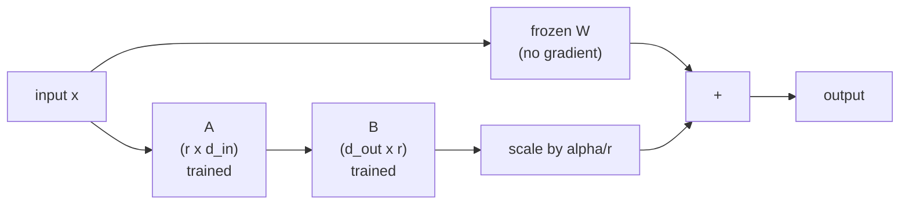

# Parameter-Efficient Fine-Tuning: LoRA, QLoRA, PEFT

> **Interview answer (say this first).** Full fine-tuning updates every weight and needs enough memory for gradients and optimizer state, which is several times the model size. PEFT freezes the base model and trains a tiny number of new parameters. LoRA is the main method: it learns a low-rank update `B @ A` for chosen weight matrices. QLoRA adds a 4-bit frozen base to cut memory further. Adapters are small files that can be served separately or merged into the base weights.

## Why this exists

Pretraining a large language model costs millions of dollars. Most teams never do it. Instead they take a pretrained model and adapt it to one task, tone, or domain. That step is **fine-tuning**.

The simplest way to fine-tune is to update every parameter. This is called **full fine-tuning**. It works, but it is expensive in a way that is easy to underestimate. Fine-tuning is training, so you need more than the weights:

- the weights themselves,
- a gradient for every weight,
- optimizer state (Adam keeps two extra numbers per weight),
- and often a full-precision master copy of the weights.

For a 7-billion-parameter model in bf16, the weights alone are 14 GB. Add the rest and you cross 100 GB. A single consumer GPU cannot hold it. You also get a new full-size checkpoint for every task:

```text
fine-tune for support replies   -> 14 GB checkpoint
fine-tune for legal summaries   -> 14 GB checkpoint
fine-tune for code review       -> 14 GB checkpoint
```

Three tasks, three giant copies, and each one can only serve its own task. Serving them together means loading several models.

There is a second problem: full fine-tuning can **forget** general ability. Push every weight toward a narrow dataset and the model may get worse at everything else. The model overfits the new task and loses the broad behavior you paid for.

Parameter-efficient fine-tuning (PEFT) exists to fix both problems: adapt the model with **far fewer trainable parameters**, store that adaptation as a **small file**, and leave the base model untouched.

> **Note:**
>
> **The one-sentence purpose.** PEFT trains a small add-on instead of the whole model, so you can adapt many tasks cheaply and keep one shared base model.


## Start from zero

| Word | Plain meaning |
| --- | --- |
| **Pretraining** | The first, massive training run on general text. Produces the base model. |
| **Fine-tuning** | Continuing training on a smaller, task-specific dataset. |
| **Parameter** | One number inside the model. Also called a weight. |
| **Weight matrix** | A rectangular grid of parameters used in a layer. Written `W`. |
| **Frozen** | Marked so training will not change it. Its gradient is not computed. |
| **PEFT** | Parameter-Efficient Fine-Tuning: adapt a model by training very few new parameters. |
| **Adapter** | The small set of trained parameters added by a PEFT method. Saved as its own file. |
| **Rank** | In LoRA, how many numbers describe each update. Small rank = fewer parameters. |
| **Low-rank** | A matrix that can be built from a much smaller pair of matrices. |
| **LoRA** | Low-Rank Adaptation: the update to `W` is `B @ A` with small inner size `r`. |
| **Alpha** | A scale factor that controls how strongly the LoRA update is applied. |
| **Target modules** | Which weight matrices get a LoRA update, for example the attention projections. |
| **Quantization** | Storing numbers in fewer bits, for example 4-bit instead of 16-bit. |
| **QLoRA** | Quantized LoRA: a 4-bit frozen base model plus LoRA adapters. |
| **Merge** | Permanently add the LoRA update into the base weights. |
| **Serving** | Running the model to answer user requests. |
| **Catastrophic forgetting** | Losing old skills after training hard on a new task. |

Two distinctions matter for the rest of this page:

- **Weights vs adaptation.** The base weights hold general knowledge and stay frozen. The adapter holds the task change and is trained.
- **Training vs serving.** LoRA changes what you train. QLoRA changes how much memory training and serving use. Merging is a serving-time decision.

## The core idea

Imagine a thick reference book, thousands of pages, that took years to write. You want a version specialized for your company. Rewriting the book is absurd. Instead you print a short **insert**: a few pages of corrections and additions that sit on top of the original. The book is unchanged; the insert does the adapting. You can print a different insert per department and keep one book.

LoRA is that insert, expressed as maths. For a weight matrix `W`, instead of learning a new full-size `W`, you learn two skinny matrices `A` and `B` and add their product:

```text
W_new = W + (alpha / r) * (B @ A)
```

- `W` is the frozen original, shape `(d_out, d_in)`.
- `A` has shape `(r, d_in)`. `B` has shape `(d_out, r)`.
- `r` (the rank) is tiny, for example 8, compared with `d_in` of 4096.
- `B @ A` has the same shape as `W`, but it can only express "low-rank" changes.

The claim LoRA makes is that the change needed to adapt a model is itself close to low-rank: it does not need a full-size matrix to describe it.



At the very start of training `B` is set to zero, so `B @ A` is zero and the model behaves exactly like the base model. Training then moves away from that safe starting point. That is why LoRA never makes the model worse on day zero.

Here is why the parameter count drops so much. For one square matrix of width 4096, full training changes `4096 x 4096 = 16,777,216` weights. LoRA with `r = 8` changes `8 x 4096 + 4096 x 8 = 65,536` weights. That is **0.39%** of the original, and the frozen base is untouched.

| | Full fine-tuning | LoRA |
| --- | --- | --- |
| Weights trained | every weight | small `A` and `B` only |
| Checkpoint size | full model | a few MB per task |
| Optimizer memory | for every weight | only for adapters |
| One base, many tasks | no | yes |
| Risk of forgetting | higher | lower |
| Trainable share (7B, q+v, r=8) | 100% | about 0.39% of q+v, ~0.06% of the model |

## How it works

1. **Pick a pretrained base model and freeze it.** Every base parameter gets `requires_grad = False`. Gradients are never computed for it, so its optimizer state is never allocated.
2. **Choose the target modules.** LoRA is usually added to the attention projection matrices (`q_proj`, `k_proj`, `v_proj`, `o_proj`) and often the feed-forward layers. Targeting more modules increases capacity and cost.
3. **Insert an `A` and a `B` next to each target.** `A` is initialized with small random values. `B` is initialized to zero, so the initial update is exactly zero.
4. **Scale by `alpha / r`.** The forward output becomes `x @ W.T + (alpha / r) * x @ (B @ A).T`. Raising `r` increases capacity, and the `alpha / r` factor keeps the effective strength steady, so you can change `r` without retuning the learning rate from scratch.
5. **Forward and backward as usual.** During backpropagation the base weights receive no update, but `A` and `B` do. Because the base is frozen, the backward pass is cheaper and the optimizer memory is tiny.
6. **Train only the adapters.** The optimizer (for example AdamW) holds state only for `A` and `B`.
7. **Save the adapter, not the model.** LoRA weights are a few megabytes. The base model is loaded once and shared.
8. **Serve either way.** Keep the adapter separate and apply it per request, or **merge** `(alpha / r) * B @ A` into `W` to get a normal model with no extra latency.

Two details make this work in practice:

- **Rank is a capacity dial.** Rank 4–16 suits style or format changes; rank 32–128 suits learning a new domain with more data. Higher rank means more trainable parameters and more overfitting risk.
- **Only adapters have optimizer state.** Adam keeps two numbers per trained parameter. Since you train only about 0.39% of the targeted q+v projection parameters — roughly 0.06% of the whole 7B model — the optimizer memory falls by the same factor.

**QLoRA** changes the memory picture again. It loads the frozen base in **4-bit** precision instead of 16-bit, then trains normal LoRA adapters on top. The base cannot be updated (it is frozen anyway), so representing it in 4 bits costs almost nothing in quality. QLoRA also uses three extras:

- **NF4**, a 4-bit format tuned for the roughly normal distribution of weights.
- **Double quantization**, which quantizes the quantization constants themselves.
- **Paged optimizers**, which move optimizer state to CPU memory when the GPU is momentarily full.

The memory result is dramatic. A 7B model in 4 bits is about **3.5 GB** of weights, versus 14 GB in bf16. With small adapters, a 7B QLoRA run fits on a single modest GPU.

| Method | Base weights | Trainable params | Typical 7B training memory |
| --- | --- | --- | --- |
| Full fine-tuning (Adam mixed precision) | bf16 | all | about 112 GB + activations |
| LoRA | bf16 | adapters | tens of GB |
| QLoRA | 4-bit | adapters | under about 10 GB |

The 112 GB number is arithmetic: at 7B, mixed-precision Adam costs about 16 bytes per parameter (2 for bf16 weights, 2 for gradients, 4 for fp32 master weights, 8 for the two Adam moments). `7e9 * 16 = 112 GB`, before activations.

## The syntax you will use

Modern practice uses the `peft` library from Hugging Face. The base model comes from `transformers`.

**Define the adapter configuration.** This is the whole contract: rank, scale, dropout, and where to attach.

```python
from peft import LoraConfig

config = LoraConfig(
    r=8,                        # rank: size of the low-rank update
    lora_alpha=16,              # scale; commonly 2*r
    lora_dropout=0.05,          # dropout on the LoRA path
    bias="none",                # do not train bias terms
    target_modules=["q_proj", "v_proj"],   # which layers get adapters
)
```

**Wrap the base model.** `get_peft_model` freezes the base and inserts the adapters.

```python
from peft import get_peft_model

model = get_peft_model(base_model, config)
model.print_trainable_parameters()
```

On a small test module, this prints real output of the form:

```text
trainable params: 256 || all params: 1,792 || trainable%: 14.2857
```

On a 7B model with `r=8` targeting `q` and `v`, the trainable parameters are about **0.39% of the targeted q+v projection parameters**, which is about **0.06% of the whole 7B model** (4,194,304 of 6,742,609,920).

**Train with the usual loop.** Nothing else changes; the optimizer only sees the adapters because everything else is frozen.

```python
from transformers import Trainer, TrainingArguments

trainer = Trainer(
    model=model,
    args=TrainingArguments(output_dir="out", learning_rate=2e-4),
    train_dataset=dataset,
)
trainer.train()
```

**Save and load only the adapter.** The output folder is a few MB, not gigabytes.

```python
model.save_pretrained("adapter-support")     # adapter_config.json + adapter weights
```

```python
from peft import PeftModel

base = load_base_model()                      # the same base model
model = PeftModel.from_pretrained(base, "adapter-support")
```

**Merge for zero-overhead serving.** After merging, the model is an ordinary model again and the adapter disappears.

```python
merged = model.merge_and_unload()
```

**QLoRA: quantize the base before wrapping.** `BitsAndBytesConfig` describes the 4-bit load. This code requires a CUDA GPU to actually run.

```python
import torch
from transformers import BitsAndBytesConfig

bnb = BitsAndBytesConfig(
    load_in_4bit=True,
    bnb_4bit_quant_type="nf4",             # NF4 format
    bnb_4bit_use_double_quant=True,        # quantize the constants too
    bnb_4bit_compute_dtype=torch.bfloat16, # compute in bf16
)

base = load_base_model(quantization_config=bnb)
model = get_peft_model(base, config)        # normal LoRA on top
```

**Choosing targets by name pattern.** When a model names layers inconsistently, match with a regex.

```python
config = LoraConfig(r=16, lora_alpha=32, target_modules=r".*(q_proj|v_proj)$")
```

| Setting | Typical values | Effect |
| --- | --- | --- |
| `r` | 4, 8, 16, 32, 64 | capacity of the update |
| `lora_alpha` | equal to `r` or `2*r` | strength of the update |
| `lora_dropout` | 0.0–0.1 | regularisation on the adapter |
| `target_modules` | attention projections, plus MLP | what can change |

## Examples: simple to real

**Example 1 — build LoRA by hand and confirm it starts as a no-op.** We use a tiny layer so the numbers are inspectable.

```python
import torch

torch.manual_seed(0)
d_in, d_out, r, alpha = 8, 6, 2, 4.0
scale = alpha / r

W = torch.randn(d_out, d_in)        # frozen base weight
x = torch.randn(1, d_in)
A = torch.randn(r, d_in) * 0.01     # small random
B = torch.zeros(d_out, r)           # zero init
delta = (B @ A) * scale

base_out = x @ W.T
lora_out = base_out + x @ delta.T

# measured:
# delta nonzero at init: 0
# max |lora - base| at init: 0.0
```

The zero initialization of `B` is not a detail: it guarantees the adapted model starts identical to the base, so training never begins from a degraded state.

**Example 2 — count the parameters.** The tiny example has a misleadingly high ratio because the matrix is small. Real dimensions show the point. For a 4096-wide model at rank 8:

```text
base q+v params: 33,554,432
LoRA q+v params: 131,072
percent:         0.3906%
```

**Example 3 — train only `B` and watch the loss fall.** We freeze `W` and `A`, train `B`, and check that `A` never gets a gradient.

```python
B = B.clone().requires_grad_(True)
opt = torch.optim.Adam([B], lr=0.05)
target = torch.randn(1, d_out)

for step in range(1000):
    out = x @ W.T + x @ ((B @ A) * scale).T
    loss = ((out - target) ** 2).mean()
    opt.zero_grad()
    loss.backward()
    opt.step()

# measured:
# loss at start: 6.44460869
# loss at end:   0.2109143
# grad on A is None: True
```

The loss fell because `B` changed. `A.grad` is `None`, which is exactly what "frozen" means in PyTorch.

**Example 4 — merging is exact.** Merging should give the same outputs, so there is no quality cost for the serving speedup.

```python
Bd = B.detach()
merged = W + (Bd @ A) * scale
out_merged = x @ merged.T
out_unmerged = x @ W.T + x @ ((Bd @ A) * scale).T

# measured: max |merged - unmerged| = 4.17e-07
```

The difference is float rounding only. After `merge_and_unload`, the adapter keys are gone and the model has exactly the base parameter count.

**Example 5 — the real `peft` library confirms the story.** Wrapping a tiny module with `r=4` on `q_proj` and `v_proj`:

```text
base total params: 1536
trainable params: 256 || all params: 1,792 || trainable%: 14.2857
adapter names: base_model.model.q_proj.lora_A.default.weight, ... lora_B ...
max |peft - base| at init: 0.0
merged params: 1536
max |merged - adapter model|: 0.0
```

The adapter names show `lora_A` and `lora_B` attached to each target. The forward pass is identical to the base at initialization, and after `merge_and_unload` the model is back to its original size with identical output.

**Example 6 — memory math decides the hardware.** For 7B parameters:

```text
FP32 weights       28.00 GB
FP16/BF16 weights  14.00 GB
INT8 weights        7.00 GB
INT4 weights        3.50 GB
full FT (Adam mp) 112.00 GB
```

Full fine-tuning needs the 112 GB figure plus activations and cannot fit on one 24 GB GPU. QLoRA replaces the 14 GB base with a 3.5 GB base and trains megabytes of adapters, so the same 7B model becomes trainable on a single card.

## In production

- **LoRA is not automatically better than full fine-tuning.** With a large dataset and a big compute budget, full fine-tuning can reach higher quality. LoRA wins when data, memory, or many per-task checkpoints are the constraint.
- **Rank and `alpha` are the two dials that matter.** Start with `r=8` and `lora_alpha=16`. Increase rank only when the model underfits. Raising rank also raises overfitting risk and optimizer memory.
- **Target more than `q` and `v` when quality stalls.** Adding `k_proj`, `o_proj`, and the MLP layers often helps more than raising rank, because it gives the adapter more places to act.
- **Do not train the base by accident.** If you construct the optimizer before `get_peft_model`, or forget to freeze, you pay full training cost silently. Check `print_trainable_parameters()` before a long run.
- **Merge decisions are irreversible in the file you keep.** Merging produces a task-specific model with no adapter to remove. Keep the unmerged adapter as the artifact of record, and treat merged copies as build outputs.
- **One base, many adapters beats many full models.** Load the base once and switch adapters per request. This is the main serving win, and it also means one set of base upgrades benefits every task.
- **Adapters can still overfit.** A small adapter on a small dataset will memorize. Watch held-out loss, use `lora_dropout`, and stop early. Lower rank is also a regularizer.
- **Quantized bases need a compatible runtime.** 4-bit model loading depends on `bitsandbytes` and a supported GPU. Plan for CPU-only fallbacks, because some environments cannot run the quantized path.
- **Quantization is not free quality.** 4-bit bases can lose a little accuracy on hard tasks. Measure on your own evaluation set; do not assume the loss is invisible.
- **Merge when latency matters, keep separate when flexibility matters.** Merged weights have no adapter overhead; unmerged adapters allow hot-swapping and rollback. Many systems do both: a merged model for the hot path and adapters for experimentation.
- **Track the base model version with the adapter.** An adapter trained on one base checkpoint may not work on another. Record the base model name, revision, and tokenizer alongside the adapter.
- **Serving many adapters has batching costs.** Groups of requests using different adapters cannot always share a batch efficiently. Measure throughput, not just memory.

## Interview questions

### 1. What problem does LoRA solve?

**Answer.** It makes fine-tuning affordable. Full fine-tuning updates every weight, so memory holds gradients and optimizer state for the whole model, and each task produces a full-size checkpoint. LoRA freezes the base and trains a small low-rank update `B @ A`, cutting trainable parameters to a fraction of a percent, slashing optimizer memory, and producing a small adapter file per task.

**Follow-up: "How much smaller is the checkpoint?"** Orders of magnitude. For a 7B model with `r=8` on `q` and `v`, the trainable share is about 0.39% of the targeted q+v projection parameters, which is only about 0.06% of the whole 7B model — roughly 4.2 million trainable parameters out of 6.7 billion.

**Trap.** Saying LoRA "fine-tunes only the last layer." It attaches new trainable matrices throughout the network at chosen modules; the base is what stays frozen.

### 2. What is rank, and how do you choose it?

**Answer.** Rank `r` is the inner dimension of the update: `A` is `(r, d_in)` and `B` is `(d_out, r)`. It sets how much the adapter can express. Low rank (4–16) suits style, format, and tone; higher rank (32–128) suits new domains with more data.

**Follow-up: "Why does the `alpha / r` scale exist?"** Because it keeps the effective magnitude of the update roughly constant as you change `r`, so you can tune rank without re-tuning the learning rate from scratch.

**Trap.** Assuming higher rank is always better. It adds parameters, memory, and overfitting risk, and often the better move is to add more target modules instead.

### 3. Why is `B` initialized to zero?

**Answer.** So the initial LoRA update is exactly zero and the adapted model starts identical to the base. Training departs from that safe point and can only improve on it. It also avoids adding random noise into a pretrained network at the start.

**Follow-up: "What if both `A` and `B` were random?"** The model would begin with a random perturbation, the loss would start higher, and early training would partly waste steps undoing that noise.

**Trap.** Thinking zero initialization prevents learning. `B` receives gradients as long as the path is not symmetric; `A` is random, so the two matrices do not stay identical.

### 4. What does QLoRA add on top of LoRA?

**Answer.** It loads the frozen base model in 4-bit precision, typically NF4, and trains ordinary LoRA adapters on top. Because the base is frozen, quantizing it costs little quality. QLoRA also uses double quantization and paged optimizers to squeeze memory further, which lets a 7B model be fine-tuned on a single small GPU.

**Follow-up: "Why not quantize when full fine-tuning?"** You cannot easily update 4-bit weights; quantization is lossy and gradients through it are unstable. QLoRA works precisely because the quantized part is frozen and all learning happens in the separate adapters.

**Trap.** Saying QLoRA makes the model faster at inference. Training memory is the target. Unless the serving stack also uses the 4-bit base, inference speed and memory are unchanged.

### 5. What does merging an adapter do, and when would you not merge?

**Answer.** Merging folds `(alpha / r) * B @ A` into `W`, producing a standard model with no extra latency and no adapter to load. You would not merge when you need to keep many tasks swappable on one base, roll back an adapter, or continue training it, because merging destroys the separate adapter and bakes in one task.

**Follow-up: "Is merging lossy?"** Only in floating-point rounding. Verified in a tiny model, the merged and unmerged outputs differed by about `4e-07`.

**Trap.** Merging your only copy of an adapter. Keep the unmerged adapter as the source artifact and treat merged weights as a derived build.

### 6. Can LoRA adapters be combined or stacked?

**Answer.** Yes, in practice. Because adapters are additive low-rank updates, several can be applied to the same base, and methods exist to combine or route them. In serving, a common pattern is one base with many named adapters selected per request.

**Follow-up: "What is the risk?"** Adapters trained independently may conflict, and naive combining can degrade quality. Validate combinations on real tasks rather than assuming they compose.

**Trap.** Claiming any two LoRA adapters compose perfectly. Addition is exact mathematically, but the resulting behavior is not guaranteed to be the union of the two skills.

### 7. What are the main trade-offs between full fine-tuning and PEFT?

**Answer.** Full fine-tuning has the highest ceiling when you have large, high-quality data and full compute, but costs the most memory, trains the slowest, and yields one large checkpoint per task. PEFT is far cheaper, supports many tasks per base, and usually matches full fine-tuning on narrow tasks, but may underperform for large domain shifts that need to change the model deeply.

**Follow-up: "When is full fine-tuning the right call?"** When you are adapting to a very different domain or modality with enough data to justify it, and when a single specialized model, not many swappable ones, is what you need.

**Trap.** Treating PEFT as strictly superior. It is a trade of peak quality for cost and flexibility, and the right choice depends on the data and deployment shape.

### 8. How does LoRA connect to quantization and serving cost?

**Answer.** They attack different costs. LoRA reduces the number of trainable parameters and the size of the artifact you ship. Quantization reduces the bytes each weight occupies, cutting memory and often bandwidth-bound inference time. QLoRA combines them: a 4-bit frozen base for memory plus LoRA adapters for cheap training. For serving, merging removes adapter latency; quantizing the merged model lowers memory but may cost a little accuracy.

**Follow-up: "How do you decide what to deploy?"** Measure quality on your evaluation set and latency on your hardware. A common pattern is a merged, quantized model for the hot path and separate adapters for new tasks under test.

**Trap.** Assuming that because QLoRA saves training memory, the deployed model is automatically smaller or faster. Deployment is a separate decision about which artifact and precision you load.

## Remember this

- **Full fine-tuning costs several times the model size** because of gradients and Adam state: about 16 bytes per parameter in mixed precision.
- **LoRA learns `W_new = W + (alpha/r) * B @ A`** with the base frozen and `B` started at zero.
- **Rank and target modules are the two real dials.** Rank sets capacity; modules set where change can happen.
- **QLoRA = 4-bit frozen base + LoRA adapters.** It makes a 7B fine-tune fit on one small GPU.
- **Adapters ship as small files, merge for latency, keep unmerged for flexibility.**
