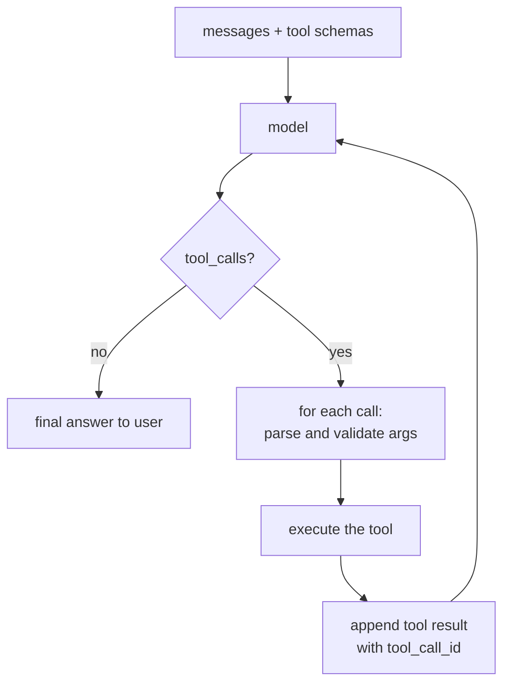

# Function and Tool Calling

> **Interview answer (say this first).** A model can only produce text, so to let it act you describe your functions as JSON Schema and send those descriptions with the request. The model responds with a structured tool call: a tool name plus JSON arguments. Your code validates the arguments, runs the function, appends the result, and calls the model again. That loop repeats until the model answers without asking for a tool.

## Why this exists

A language model has two hard limits. It only produces text, and it only knows what it learned during training. So it cannot tell you the current weather, read your database, or send an email. It can, however, *write down* that someone should check the weather.

The naive approach is to ask for that in prose:

```text
User:  What is the weather in Paris?
Model: You should call the weather API for Paris.
```

Now your program has to read that English sentence and guess at `get_weather(city="Paris")`. That is fragile, language-dependent, and breaks the moment the model phrases it differently. Worse, a model can invent a function that does not exist, or produce arguments with the wrong types.

A second bad approach is to make the model emit a JSON blob you parse yourself. This partly works, but it is just structured output with no shared contract; the tool names, descriptions, and argument schemas live in your prompt, where they drift.

**Tool calling** (also called **function calling**) makes the contract explicit. You send a machine-readable list of tools with the request. The model replies with a structured call naming one of *your* tools and providing arguments that match *your* schema. You run it and hand back the result. The model never executes anything; **your code is always the executor**.

This matters for the rest of the book because tool calling is the mechanism that turns a chatbot into an **agent**. An agent is, at its core, a loop: model decides, code acts, result goes back, model decides again.

> **Note:**
>
> **The one-sentence purpose.** Tool calling lets a model request a specific function with structured arguments, while your code stays in control of execution.


## Start from zero

| Word | Plain meaning |
| --- | --- |
| **Tool** | A function your program can run on the model's behalf, such as `get_weather`. |
| **Function calling** | The provider feature that lets the model return a structured request to call a tool. |
| **Tool schema** | A JSON Schema describing the tool's name, purpose, and arguments. |
| **Arguments** | The JSON object the model produces for a tool, for example `{"city": "Paris"}`. |
| **Tool call** | One structured request: an id, a tool name, and arguments. |
| **`tool_call_id`** | An identifier tying a tool result back to the request that produced it. |
| **Tool result** | The output of running the tool, sent back to the model as a message. |
| **Dispatch** | Looking up the named tool in a registry and calling it. |
| **Tool choice** | A control for whether, and which, the model may call: `auto`, `none`, `required`, or a specific tool. |
| **Parallel tool calls** | The model returns several independent tool calls in one turn. |
| **Turn** | One request to the model plus its reply. |
| **Agent loop** | Repeating model and tool steps until a stopping condition. |
| **ReAct** | A classic pattern of alternating reasoning and acting, a forerunner of modern tool loops. |
| **Side effect** | An action that changes the world, such as sending email or charging a card. |
| **Idempotent** | Safe to run twice with the same effect as once. Important for retries. |
| **Hallucinated tool** | A tool name the model invented that is not in your list. |
| **Sandbox** | An isolated environment for running untrusted or risky code. |

Three terms cause the most confusion:

- **Tool vs tool call.** The tool is your function. The tool call is the model's request to run it. The model can request a tool that is broken or forbidden; that is your problem to handle.
- **Arguments are a JSON string in the OpenAI API.** You must `json.loads` them before use. Passing them straight to a function is a bug.
- **The model does not execute anything.** It produces a request. Execution, permissions, and side effects are entirely your code's responsibility.

## The core idea

Picture a restaurant. You, the customer, cannot enter the kitchen. Instead you fill in a standard order form: a dish name and its options. The kitchen checks the form, cooks the dish, and the waiter brings the result back. You may order two dishes at once. The waiter never lets you write "make me something surprising" on the form.

In this picture:

- **Your code is the kitchen and the waiter.** It owns ingredients and does the work.
- **The model is the customer.** It chooses from a fixed menu.
- **The tool schemas are the menu.** They describe what can be ordered and with which options.
- **The tool call is the completed order form.**
- **The tool result is the dish served back.**

The loop is the heart of every agent:



That arrow going back from the result to the model is what separates tool calling from an ordinary API call. The model gets to see what happened and decide what to do next.

## How it works

1. **Describe your tools as JSON Schema.** Each tool has a name, a description, and a parameters schema. Most teams generate the schema from a Pydantic model or a dataclass so it cannot drift from the code.
2. **Send the tools with the messages.** The tool list and the conversation go in the same request.
3. **The model replies with either content or tool calls.** If it can answer directly, it returns text. Otherwise it returns one or more tool calls, each with an id, a name, and arguments.
4. **Parse the arguments.** In the OpenAI API the arguments arrive as a JSON **string**, so you `json.loads` it first.
5. **Validate the arguments against the schema.** Do this before touching the tool. A missing or wrong-typed field is a validation error, not a crash inside your function.
6. **Execute the tool through a registry.** Look up the name in a dictionary of allowed tools. If the name is unknown, return an error result instead of guessing.
7. **Append one `tool` message per call, carrying the `tool_call_id`.** The id is how the model matches a result to the request. Getting it wrong confuses the model.
8. **Call the model again with the extended conversation.** It now sees the results and decides whether it needs more tools or can answer.
9. **Repeat until either no tool calls are returned or you hit a turn limit.** The turn limit is essential; without it a confused model can loop forever.
10. **Return the final assistant message.** Log the whole trajectory: which tools ran, with what arguments, and what they returned.

Three controls shape this loop:

- **Tool choice.** `auto` lets the model decide, `none` forbids tools, `required` forces at least one call, and naming a specific tool forces that tool. `required` is how you turn a tool into a structured-output mechanism.
- **Parallel calls.** One turn can contain several independent calls, which saves round trips. Dependencies do not work this way; the model must call the second tool in a later turn after seeing the first result.
- **Errors as results.** If a tool fails, return an error message as the tool result rather than raising. The model can then correct itself, retry with different arguments, or explain the failure.

## The syntax you will use

**Declare tools with Pydantic.** The schema comes from the model, so validation and description stay in sync.

```python
from pydantic import BaseModel, Field

class GetWeather(BaseModel):
    city: str = Field(description="City name, e.g. 'Paris'")
    unit: str = Field(default="celsius", description="'celsius' or 'fahrenheit'")

tools = [{
    "type": "function",
    "function": {
        "name": "get_weather",
        "description": "Get the current weather for a city.",
        "parameters": GetWeather.model_json_schema(),
    },
}]
```

**Send a request with tools (OpenAI shape).**

```python
from openai import OpenAI

client = OpenAI()
response = client.chat.completions.create(
    model="<a-tool-calling-model>",
    messages=[{"role": "user", "content": "What is the weather in Paris?"}],
    tools=tools,
    tool_choice="auto",
)
message = response.choices[0].message
```

**Read the tool calls.** They may be `None` when the model answers directly, or there may be several. Guard before iterating.

```python
if message.tool_calls:
    for call in message.tool_calls:
        print(call.id)                  # "call_abc123"
        print(call.function.name)       # "get_weather"
        print(call.function.arguments)  # '{"city": "Paris"}'  <- a JSON string
```

**Run one and send the result back.** The `tool` message must carry the matching id.

```python
import json

result = get_weather(city="Paris")
messages.append({
    "role": "tool",
    "tool_call_id": call.id,
    "content": json.dumps(result),
})
```

**Force a specific tool.** Useful when you want a guaranteed call, for example structured extraction.

```python
tool_choice = {"type": "function", "function": {"name": "get_weather"}}
```

**Allow any tool but require one.**

```python
tool_choice = "required"     # at least one call this turn
```

**Control the loop with a turn limit.**

```python
MAX_TURNS = 6
for turn in range(MAX_TURNS):
    reply = call_model(messages)
    messages.append(reply)
    if not reply.get("tool_calls"):
        break
    handle_calls(reply["tool_calls"], messages)
else:
    raise RuntimeError("tool loop did not finish")
```

**Dispatch through a registry, with validation.** This is the pattern that keeps execution safe.

```python
REGISTRY = {"get_weather": (get_weather, GetWeather)}

def execute(name: str, args: dict):
    if name not in REGISTRY:
        return {"error": f"unknown tool {name}"}
    fn, schema = REGISTRY[name]
    validated = schema.model_validate(args)     # raises on bad args
    return fn(**validated.model_dump())
```

**Anthropic shape.** Tools use `input_schema`, and results come back as `tool_result` blocks.

```python
resp = client.messages.create(
    model="<a-claude-model>",
    max_tokens=1024,
    tools=[{"name": "get_weather", "description": "Get weather.",
            "input_schema": GetWeather.model_json_schema()}],
    messages=[{"role": "user", "content": "What is the weather in Paris?"}],
)

# reply.content holds blocks; a tool request is a tool_use block
messages.append({"role": "assistant", "content": resp.content})
messages.append({
    "role": "user",
    "content": [{"type": "tool_result", "tool_use_id": block.id,
                 "content": json.dumps(result)}],
})
```

**Streaming tool calls.** Providers stream the arguments in pieces, so you accumulate the string and parse it only when the call is complete.

```python
# across chunks, for each tool call index, concatenate:
#   tool_calls[i].function.arguments += delta.function.arguments
# parse with json.loads only after the call is marked finished
```

## Examples: simple to real

**Example 1 — the tool schema your code hands to the model.** Real output from `GetWeather.model_json_schema()` inside the tool wrapper:

```text
get_weather params: {"properties": {"city": {"description": "City name, e.g. 'Paris'",
  "title": "City", "type": "string"}, "unit": {"default": "celsius",
  "description": "'celsius' or 'fahrenheit'", "title": "Unit", "type": "string"}},
  "required": ["city"], "title": "GetWeather", "type": "object"}
```

The argument descriptions are not decoration. They are the model's main clue about what to put in each field.

**Example 2 — a full loop with parallel tool calls.** The user asks for the weather in two cities. The model returns two independent `get_weather` calls in one turn; the code runs both and the model then answers.

```text
system    -> Use tools when needed.
user      -> What is the weather in Paris and in Tokyo?
assistant -> tool_calls: ['get_weather', 'get_weather']
tool      -> {"city": "Paris", "temp": 18, "unit": "celsius"}
tool      -> {"city": "Tokyo", "temp": 27, "unit": "celsius"}
assistant -> Paris is 18C and Tokyo is 27C.

turns used: 2
```

Two independent calls in one turn saved a round trip. Neither call needed the other's result, which is exactly when parallel calls are correct. Converting Paris to Fahrenheit, by contrast, would depend on the weather result and must wait for a later turn.

**Example 3 — bad arguments are caught before the tool runs.** The model sends a number for `city`, and validation rejects it.

```text
bad args -> string_type at ('city',)
```

The tool never executes. Without this check a `TypeError` would surface deeper in the code, far from the model output that caused it.

**Example 4 — a direct answer with no tool at all.** Not every question needs a tool, and the model should return plain content.

```text
User: 2 + 2?
Model content: 4.  | tool_calls: None
```

Detecting "no tool calls" is the loop's stopping condition. A model that calls a tool for a trivial question wastes latency and money.

**Example 5 — an error result lets the model recover.** When a tool fails, return the error as the result instead of raising.

```python
from pydantic import ValidationError
import json

try:
    result = execute(name, args)
except (ValidationError, ValueError, KeyError) as e:
    result = {"error": str(e)}
messages.append({"role": "tool", "tool_call_id": call.id,
                 "content": json.dumps(result)})
```

The model now sees `{"error": "unsupported conversion..."}` and can choose a different tool or explain the limitation. Raising instead kills the loop and loses the context that made the failure understandable.

**Example 6 — refusing an unknown tool.** If the model invents a tool, the registry lookup returns an error rather than executing something unexpected.

```python
execute("delete_all_users", {})
# {"error": "unknown tool delete_all_users"}
```

This allowlist is a security boundary: only tools you registered can ever run, no matter what the model names.

## In production

- **Validate arguments before execution.** The model's JSON is untrusted input. Validate it against the tool's schema, then call the function. This is the same boundary rule as any external API.
- **Use an allowlist registry.** Never `eval` or dynamically import a tool name from model output. A fixed dictionary is the simplest and safest dispatch.
- **Bound the loop.** Set a maximum number of turns and a maximum number of tool calls. A confused model can otherwise loop indefinitely, burning tokens and money.
- **Put timeouts and retries on tools.** A hanging HTTP call stalls the whole agent. Give every tool a timeout, and make retries safe by designing mutations to be idempotent.
- **Keep results small.** Tool output is injected back into the context and costs tokens on every later turn. Truncate large responses and return only the fields the model needs.
- **Treat tool output as untrusted.** A web page or database row can contain instructions aimed at the model. A tool result is a prompt-injection vector, so never let it change what the agent is allowed to do.
- **Require confirmation for destructive actions.** Sending email, deleting data, and spending money should need explicit approval or a separate, tightly scoped tool. Do not give an autonomous loop an unguarded `delete`.
- **Separate read tools from write tools.** Read tools can run freely; write tools should be narrower, audited, and often gated. This limits the blast radius of a bad decision.
- **Return errors as data, not exceptions.** An error message gives the model a chance to correct itself. Crashing gives it nothing.
- **Log the full trajectory.** Record every tool name, argument object, result, and turn. Debugging an agent without the trajectory is guesswork.
- **Watch out for parallel calls with dependencies.** The model may issue calls that look independent but are not. If order matters, say so in the tool descriptions or force sequential turns.
- **Do not over-tool.** Fewer, well-described tools outperform dozens of overlapping ones. Ambiguous descriptions cause wrong tool selection, which looks like a model failure but is a design failure.

## Interview questions

### 1. What is function calling, and why is it needed?

**Answer.** Function calling lets the model return a structured request to run one of your functions, with arguments matching a JSON Schema you supplied. It is needed because a model can only emit text and cannot act or fetch live data. Tool calling turns "someone should check the weather" into `get_weather(city="Paris")`, which your code can safely execute.

**Follow-up: "Does the model run the function?"** No. It only produces the request. Your code validates and executes. That separation is what keeps control, permissions, and side effects in your hands.

**Trap.** Saying the model "calls APIs". It emits a proposal; the program calls the API.

### 2. Where do tool definitions live, and what do they contain?

**Answer.** They are sent with the request, usually as a list of objects with a name, a description, and a parameters JSON Schema. Most teams generate the schema from a typed model to prevent drift. The description and per-argument descriptions are the model's guidance for when and how to use the tool.

**Follow-up: "Why generate schemas instead of writing them by hand?"** A hand-written schema can disagree with the function signature, so the model sends arguments the function cannot accept. Generating from a Pydantic model or dataclass keeps them identical.

**Trap.** Treating descriptions as optional. Poor descriptions cause wrong tool selection, which people often misdiagnose as a weak model.

### 3. Walk through the tool-calling loop.

**Answer.** Send the messages and tool schemas. The model replies with either content or tool calls. For each call, parse the JSON arguments, validate them, execute the tool, and append a tool message with the matching `tool_call_id`. Send the extended conversation back. Repeat until the model returns no tool calls or the turn limit is reached.

**Follow-up: "Why is the `tool_call_id` required?"** It links each result to the request that produced it, which matters most when the model makes several calls in one turn. Mismatched ids make the model misread which result belongs to which call.

**Trap.** Forgetting to append the assistant's tool-call message before the tool results. Providers expect the conversation to contain the request as well as the response.

### 4. What is `tool_choice`, and when would you use `required`?

**Answer.** `tool_choice` controls whether tools may be used. `auto` lets the model decide, `none` forbids tools, `required` forces at least one call, and naming a tool forces that specific one. Use `required` or a named tool when you need a guaranteed structured call, such as extracting fields with a single `emit_record` tool.

**Follow-up: "What breaks with `required`?"** The model must call a tool even when it should ask a clarifying question or answer directly. Use it when structure is mandatory, not as a default.

**Trap.** Assuming `auto` guarantees sensible tool use. It permits tools; it does not ensure the model picks the right one.

### 5. How do you handle a tool that fails?

**Answer.** Return the error as the tool result, tagged with the right id, instead of raising. The model can then retry with different arguments, choose another tool, or explain the problem to the user. Also keep a hard failure path: if retries and turns are exhausted, surface the error and stop.

**Follow-up: "Which failures should not go back to the model?"** Infrastructure faults like a timeout often should be retried by your code first, not narrated to the model. Distinguish transient failures from bad-argument failures.

**Trap.** Letting exceptions escape the loop. An uncaught error ends the conversation and discards the context that would let the model recover.

### 6. What are parallel tool calls, and what is the pitfall?

**Answer.** The model can return several tool calls in one turn when they are independent, and the runtime executes them in parallel to save round trips. The pitfall is dependencies: if the second call needs the first call's output, parallel execution is wrong, and the model must use a later turn.

**Follow-up: "How do you signal a dependency?"** Describe the tools so the dependency is obvious, or restrict to one call per turn for that workflow. Do not rely on the model inferring order from prose.

**Trap.** Assuming the model always knows which calls depend on which. Treat ordering as a design concern, not a model guarantee.

### 7. What are the main safety risks of tool calling?

**Answer.** Letting untrusted model output trigger side effects. The model can be manipulated by prompt injection in tool results or user content to call a destructive tool, pass dangerous arguments, or exfiltrate data. Mitigations are an allowlist of tools, argument validation, least-privilege credentials, confirmation for destructive actions, and sandboxing for code execution.

**Follow-up: "How is a tool result a risk?"** The result is text inserted into the model's context, and it can contain instructions. If the agent treats them as commands, a malicious web page can hijack the loop.

**Trap.** Trusting the tool name because it came from the model. Validate the name against your registry and the arguments against the schema, every time.

### 8. How does tool calling relate to structured outputs and agents?

**Answer.** Tool calling uses the same JSON Schema machinery as structured outputs: a tool definition is a schema for its arguments, and a tool call is a structured object. The difference is purpose. Structured output returns data to your program; tool calling triggers an action. An agent is the loop that combines them: the model plans, requests tools, reads results, and continues until it can answer.

**Follow-up: "What makes an agent rather than a single call?"** The loop and the autonomy to choose the next step. The model's decisions change the sequence of actions, which is why limits, validation, and observability matter so much.

**Trap.** Equating an agent with a model plus tools. Without a bounded loop, validated dispatch, and a stopping condition, it is just a fragile API wrapper.

## Remember this

- **The model proposes, your code executes.** A tool call is a request, never an action.
- **Tools are JSON Schema.** Generate them from typed models so the contract cannot drift.
- **Validate before you run**, keep an allowlist registry, and return errors as tool results.
- **The loop is the agent**: model, tool calls, results, model again, until no calls or a turn limit.
- **Bound everything**: turns, timeouts, retries, result size, and what each tool is allowed to touch.
