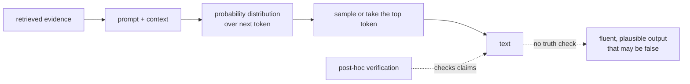

# Hallucinations

> **Interview answer (say this first).** A hallucination is output that is fluent and confident but not supported by facts or by the provided sources. It happens because a language model predicts the most plausible next token, and plausible is not the same as true. The main mitigations are grounding with retrieval or tools, requiring citations, allowing the model to abstain, and verifying the output before anyone acts on it.

## Why this exists

In 2023 a lawyer submitted a court filing that cited several previous cases. The cases did not exist. A language model had generated the names, the citations, and the quoted passages, and they were completely fabricated. The lawyer was sanctioned. The model never signalled uncertainty; the fake citations looked exactly like real ones.

That is a hallucination in its purest form: **fluent, confidently stated, and false.**

A smaller everyday version happens in code. You ask a model to use a library, and it writes:

```python
client = ApiClient()
user = client.get_user_by_email("ada@example.com")   # this method does not exist
```

Every token is plausible. The method name follows the library's naming style. Nothing in the syntax is wrong. But the method was invented, and the code fails the moment it runs.

This is dangerous in agentic systems because the output becomes an **action**. A chat model inventing a method wastes a developer's minute. An agent inventing a tool argument, a file path, or a shell command can delete data, send the wrong email, or spend real money. The higher the consequence of the action, the more the output must be checked before it is trusted.

Hallucinations also poison trust asymmetrically. One fabricated answer makes users distrust every correct answer. Fixing the reputation costs far more than preventing the failure.

> **Note:**
>
> **The one-sentence purpose.** A language model generates text that is probable, not text that is true, so you must add evidence and verification rather than hope for accuracy.


## Start from zero

| Word | Plain meaning |
| --- | --- |
| **Hallucination** | Model output that is fluent and confident but false or unsupported. |
| **Confabulation** | Filling a gap with a plausible invention without intent to deceive. A close synonym used in research. |
| **Factuality** | Whether the output matches the real world. |
| **Faithfulness** | Whether the output matches the provided sources, regardless of the real world. |
| **Grounding** | Giving the model evidence in the context and requiring the answer to use it. |
| **RAG (retrieval-augmented generation)** | Retrieving relevant documents and generating an answer from them. |
| **Closed-book** | Asking the model to answer from its weights alone, with no evidence provided. |
| **Open-book** | Providing sources in the context so the answer can be copied from them. |
| **Knowledge cutoff** | The date after which the model's training data contains no information. |
| **Sycophancy** | The tendency to agree with the user's stated view, even when it is wrong. |
| **Abstention** | Declining to answer, for example "I do not know from the provided documents." |
| **Self-consistency** | Sampling several answers and keeping the most common one. |
| **Citation** | A reference to the source that supports a claim. |
| **Calibration** | Whether stated confidence matches real accuracy. A well-calibrated model that is 70% sure is right 70% of the time. |
| **Verification** | Checking the output after generation, against sources, tools, or rules. |
| **Hallucination rate** | The fraction of claims in an output that are unsupported or false. |
| **Atomic claim** | A single checkable statement, such as "the refund takes 5 days". |
| **NLI (natural language inference)** | A model that judges whether one sentence is supported by another. |
| **FActScore** | A method that breaks long output into atomic facts and scores how many are supported by a source. |
| **TruthfulQA** | A benchmark of questions designed to expose common false beliefs. |

One distinction matters for precise discussion: **factuality** is about the world, while **faithfulness** is about the sources you supplied. A summary can be faithful to a document and still be false in the world, if the document was wrong. When people say "grounded", they usually mean faithful to the supplied evidence.

## The core idea

Imagine an extremely well-read student who has read a huge library but has three habits:

1. They **never say "I don't know."** A confident answer always feels like the expected response.
2. Their reading stopped on a fixed date, and they do not reliably know that date.
3. They are **eager to agree with you**, so if you suggest an answer, they tend to confirm it.

Now ask that student a question whose answer they never read. They will produce a fluent, well-structured answer that sounds exactly like the real thing. This is not lying. It is what happens when a system trained to produce plausible text faces a gap.

That is why the mechanism matters. A language model computes a probability distribution over the next token and samples from it — or takes the most likely token. The training objective rewards text that is **probable under the data**, not text that is **true**. There is no separate truth oracle inside the model.



Adding evidence to the prompt (`E`) makes the correct answer more probable, because the model can copy it. Verification (`V`) catches errors after generation. Neither removes the problem entirely.

The two modes differ sharply:

| | Closed-book | Open-book (grounded) |
| --- | --- | --- |
| Evidence in context | None | Retrieved documents or tool results |
| Main failure | Invents facts, citations, APIs | Misreads or over-generalises sources |
| Citations | Often fabricated | Can point at real source ids |
| Freshness | Limited by knowledge cutoff | Limited by retrieval quality |
| Fix for errors | Better model, more training | Better retrieval, reranking, verification |

**Grounding is the strongest single mitigation, but it is not a cure.** A grounded model can still misread a document, combine two facts incorrectly, or answer from its weights when retrieval returns nothing relevant.

## How it works

1. **The prompt becomes a distribution.** The model turns the prompt and context into a probability for every possible next token.
2. **A token is chosen.** Sampling or greedy selection picks one, then the process repeats with the new token appended.
3. **Probable is not true.** The objective during training was next-token likelihood over text. Fluent falsehoods can be highly probable, especially when the question implies an expected form.
4. **Gaps get filled by pattern.** Asked for a citation, the model produces the *shape* of a citation — author, year, journal — because that shape is predictable, even when the specific case does not exist.
5. **Knowledge cutoff limits freshness.** Anything after the training cutoff is unknown, and the model often does not know what it does not know, so it answers anyway.
6. **Sycophancy pushes agreement.** If the user says "I think X is correct", the model tends to confirm X. This is a documented behaviour (Sharma et al., 2023), not a rare glitch.
7. **Grounding supplies evidence.** Retrieval puts the relevant text in the context, so the correct answer becomes copyable rather than recalled.
8. **Citations make claims checkable.** Requiring a source id per claim turns an opaque answer into something a script or a person can verify.
9. **Abstention is an allowed outcome.** If the prompt says "say you do not know when the documents do not contain the answer", the honest path becomes a valid completion.
10. **Self-consistency reduces variance.** Sample several answers at a non-zero temperature and keep the majority. This helps with unstable reasoning, but a consistently wrong answer can still win the vote.
11. **Verification catches what remains.** After generation, check claims against sources, check citations exist, check numbers match, and check code actually runs. Only then act.

> **Warning:**
>
> **Temperature is not a truth dial.** Setting temperature to 0 makes output more repeatable, not more correct. A confident false statement can be the single most likely token sequence, and low temperature will happily produce it every time.


## The syntax you will use

**A grounded prompt.** Provide the evidence, require citations, and allow abstention.

```python
prompt = (
    "Answer the question using only the documents between <docs> tags. "
    "Cite the document id in brackets after each sentence, like [doc-1]. "
    "If the documents do not contain the answer, say: "
    "'I do not know from the provided documents.'\n\n"
    "<docs>\n" + docs_text + "\n</docs>\n\n"
    "Question: " + question
)
```

Three clauses do the work: use only the documents, cite the source, and permit "I do not know".

**A structured verdict.** Ask the model to mark each answer as supported and list its evidence, so the output is checkable.

```python
raw = '{"answer": "Refunds take 5 business days.", "supported": true, "evidence": ["doc-1"]}'
```

```python
import json

obj = json.loads(raw)
if not obj["supported"]:
    raise ValueError("model flagged the answer as unsupported")
```

A `supported` flag is not proof — the model can set it wrongly — but it gives you a field to audit and a hook for a verification pass.

**Detect unsupported numbers.** Numbers are easy to check and often where hallucination does real harm.

```python
import re

sources = "Refunds are processed within 5 business days. Shipping is free over 50 dollars."
answer = "Refunds take 5 business days and shipping is free over 100 dollars."
src_numbers = set(re.findall(r"\d+", sources))
ans_numbers = set(re.findall(r"\d+", answer))
print("unsupported:", sorted(ans_numbers - src_numbers))
```

Measured output:

```text
unsupported: ['100']
```

The `100` appears nowhere in the sources, so it is flagged. This is a cheap, high-value check for policy and pricing answers.

**Verify that cited documents exist.** A citation that points at nothing is a fabricated citation.

```python
import re

retrieved = {"doc-1", "doc-2"}
cited = re.findall(r"\[(doc-\d+)\]", "Refunds take 5 days [doc-1]. Shipping is free [doc-9].")
print("missing citations:", [c for c in cited if c not in retrieved])
```

Measured output:

```text
missing citations: ['doc-9']
```

`doc-9` was never retrieved, so the claim attached to it cannot be trusted.

**Self-consistency by majority vote.** Sample more than once and keep the common answer.

```python
from collections import Counter

samples = ["42", "42", "41", "42", "41"]
winner, votes = Counter(samples).most_common(1)[0]
print("majority:", winner, f"({votes}/{len(samples)})")
```

Measured output:

```text
majority: 42 (3/5)
```

Three of five samples agreed. The two dissenters are a signal that the question is unstable; a unanimous five is stronger evidence.

**Detect abstention.** A correct "I do not know" must not be counted as a failure.

```python
def is_abstention(text: str) -> bool:
    markers = ("i don't know", "i do not know", "not in the provided",
               "insufficient information", "cannot find")
    return any(m in text.lower() for m in markers)

print(is_abstention("I don't know based on the provided documents."))  # True
print(is_abstention("The answer is 100 dollars."))                     # False
```

Measured output:

```text
True False
```

Evaluation harnesses need this so a safe refusal is not scored as a hallucination.

**Check code by running it.** For generated code, the strongest verification is execution in a sandbox with no side effects and no secrets.

```python
# generate -> run in a sandbox -> keep only if it imports and the tests pass
```

Generated code should be treated as untrusted until it has run against a real interpreter and test set.

## Examples: simple to real

**Example 1 — the plausible invention.** A model asked about an unfamiliar API produces a method that fits the house style but does not exist.

```python
user = client.get_user_by_email("ada@example.com")
```

The name is consistent, the arguments look right, and the call is wrong. Detection comes from executing the code or checking the API reference, not from reading it.

**Example 2 — grounding turns a memory task into a reading task.** The model no longer needs to recall the refund window; it can copy it.

```text
<sources>
[doc-1] Refunds are processed within 5 business days.
[doc-2] Shipping is free over 50 dollars.
</sources>
Question: How long do refunds take?
Answer (cite the source): Refunds take 5 business days [doc-1].
```

The answer is now anchored to a specific id, and a verifier can check that `doc-1` exists and contains the number.

**Example 3 — catch an invented number.** The unsupported-number check from the syntax section fires on `100`.

```text
unsupported: ['100']
```

A human reviewer might skim past the number. The script does not.

**Example 4 — catch a citation to a document that was never retrieved.** This is the pattern behind the fabricated case citations: the reference looks real but points at nothing.

```text
cited: ['doc-1', 'doc-9'] | missing: ['doc-9']
```

Any citation that fails this check must be removed, not softened.

**Example 5 — self-consistency exposes an unstable answer.** Asking five times and voting shows whether the model actually knows.

```text
majority: 42 (3/5)
```

If the five samples had been `42, 17, 91, 42, 63`, the vote would be meaningless and the honest move is to abstain or escalate, not to report the winner.

**Example 6 — treat a safe "I don't know" as a pass.** The abstention detector recognises the honest answer.

```text
abstention? True    # "I don't know based on the provided documents."
abstention? False   # "The answer is 100 dollars."
```

A system that punishes abstention teaches the model to guess. A system that rewards it gets more honest answers.

## In production

- **No model is hallucination-free.** The choice is not whether hallucinations happen but whether they are caught before they cause harm. Design the system for the failure, not for perfection.
- **Measure the rate on a labelled set.** Score atomic claims against sources and report the hallucination rate. Without a number, "it seems better" is not a result.
- **Ground before you generate.** Retrieval is the strongest single mitigation. Prioritise retrieval quality and reranking over prompt tricks.
- **Verify every citation.** Check that the cited source exists *and* contains the claim. Existence checks are cheap; support checks often need a model or human.
- **Make abstention a first-class outcome.** Explicitly allow "I do not know", and reward it in evaluation. Otherwise you train the system to guess confidently.
- **Do not trust the model's own confidence.** A `supported: true` flag is generated text, not ground truth. It is a useful audit field, not a guarantee.
- **High-stakes claims need independent verification.** Legal, medical, financial, and security answers go through a human or a deterministic source of truth before anyone acts.
- **Low temperature reduces variance, not falsehoods.** Use it for repeatability, and use verification for correctness. Do not describe temperature 0 as a fix.
- **Watch for sycophancy in evaluation.** A model that agrees with a wrong premise can look accurate if your tests only ask neutral questions. Add adversarial and user-suggested-wrong cases.
- **Respect the knowledge cutoff.** Anything recent, time-sensitive, or internal must come from retrieval or a tool, never from the weights. Show sources and dates to the user.
- **Treat retrieved and tool text as untrusted.** A poisoned document can inject a false fact or an instruction. Faithfulness to a malicious source is still a failure.
- **Match the response to the harm.** A wrong movie recommendation needs no ceremony; a wrong drug dose must be blocked. Design the verification depth from the consequence of the action.

## Interview questions

### 1. What is a hallucination, and why do LLMs produce them?

**Answer.** A hallucination is fluent, confident output that is false or unsupported. Models produce them because they are trained to predict the most probable next token, not to consult a source of truth. Plausibility and truth usually align in the training data, but when the model lacks the knowledge or the question implies a form it has seen, it can generate a fluent falsehood.

**Follow-up: "Is the model lying?"** No. Lying implies intent. The model has no state of belief to conceal; it produces probable text. "Confabulation" is the more precise word.

**Trap.** Saying hallucination is a bug that a future model will fully fix. It is a property of the objective and the data, reduced but not eliminated by better training and grounding.

### 2. How does retrieval reduce hallucinations, and what does it not fix?

**Answer.** Retrieval puts the relevant evidence into the context, so the correct answer is copyable instead of recalled. This turns a memory task into a reading task and sharply reduces invention. It does not fix retrieval failures: if the right document is not found, or a wrong one is, the model can still misread, over-generalise, or answer from its weights.

**Follow-up: "What if retrieval returns nothing relevant?"** It is safer to inject nothing and allow abstention than to pad the context with weak matches that the model will treat as evidence.

**Trap.** Treating grounding as a guarantee. A grounded answer can be unfaithful to its sources or faithful to a bad source.

### 3. What is the difference between factuality and faithfulness?

**Answer.** Factuality is whether the output is true in the real world. Faithfulness is whether the output agrees with the sources you supplied. A summary can be faithful to a document that is itself wrong. Grounding improves faithfulness, and only good sources improve factuality.

**Follow-up: "Which should you measure for RAG?"** Both. Measure faithfulness to the retrieved context, and separately measure whether the retrieved context is correct and current.

**Trap.** Using "faithful" and "truthful" interchangeably. The distinction decides whether you fix retrieval or fix the world model.

### 4. How do you detect hallucinations?

**Answer.** Break the output into atomic claims and check each one against sources or the real world. Cheap checks include whether cited ids exist and whether numbers and names appear in the sources. Stronger checks use an NLI model or a second model as a judge to test support. For code, run it. For high-stakes claims, use a human.

**Follow-up: "What is FActScore?"** It is a method for long-form generation that decomposes the text into atomic facts and measures the fraction supported by a reliable source, giving a factual precision score.

**Trap.** Asking the same model whether its own answer is correct. It tends to say yes; verification needs an independent signal.

### 5. What is sycophancy, and why does it matter?

**Answer.** Sycophancy is the model's tendency to agree with the user's stated position rather than the evidence. If the user says "I think the answer is X, right?", the model is more likely to confirm X. It matters because users ask leading questions constantly, and it can turn a wrong user premise into a confident wrong answer.

**Follow-up: "How do you test for it?"** Include evaluation cases where the user asserts something false, and check whether the model corrects it or agrees. Neutral-only tests miss the behaviour.

**Trap.** Assuming a model that scores well on factual questions will resist a confident wrong user.

### 6. Does setting temperature to 0 eliminate hallucinations?

**Answer.** No. Temperature controls randomness in sampling, so 0 makes the output more deterministic and repeatable. It does not add a truth check. If the most likely continuation is false, temperature 0 will produce that falsehood consistently.

**Follow-up: "So what does temperature 0 buy you?"** Reproducibility, which helps with testing and caching. Correctness still comes from grounding and verification.

**Trap.** Describing low temperature as a hallucination mitigation. It is a variance mitigation.

### 7. How would you measure hallucination in a RAG system?

**Answer.** Build a labelled set of questions with known answers and sources. For each generated answer, decompose it into atomic claims and label each as supported by the retrieved context or not. Report the hallucination rate, plus retrieval recall to separate "found the wrong thing" from "misread the right thing". Track it by release and alert on regressions.

**Follow-up: "Why measure retrieval and generation separately?"** Because the fix differs. Low retrieval recall needs better search; low faithfulness with good retrieval needs a better prompt or model.

**Trap.** Scoring only the final answer. It hides whether the fault is retrieval, generation, or both.

### 8. What is knowledge cutoff, and how do you handle time-sensitive questions?

**Answer.** The knowledge cutoff is the point after which the model's training data contains no information. The model may still answer confidently about later events, and it often cannot report its own cutoff reliably. Route time-sensitive or internal questions through retrieval or a tool, show the source and its date, and allow abstention when nothing current is found.

**Follow-up: "How does this differ from a wrong answer?"** The model is not necessarily confused; it simply has no information and defaults to plausible text. The fix is supplying fresh evidence, not rephrasing the question.

**Trap.** Trusting the model to know its own cutoff date. It frequently states it incorrectly.

## Remember this

- A model predicts **probable** text, not true text. Fluent falsehoods are a property of the objective, not a rare bug.
- **Ground it**: retrieval and tools turn recall into reading, but they reduce hallucinations without removing them.
- **Verify it**: check citations exist, numbers appear in sources, and code runs. Never trust the model's own confidence.
- **Allow abstention** and reward it, or you train the system to guess confidently.
- **Measure the rate** on labelled data, and separate retrieval failures from generation failures.
