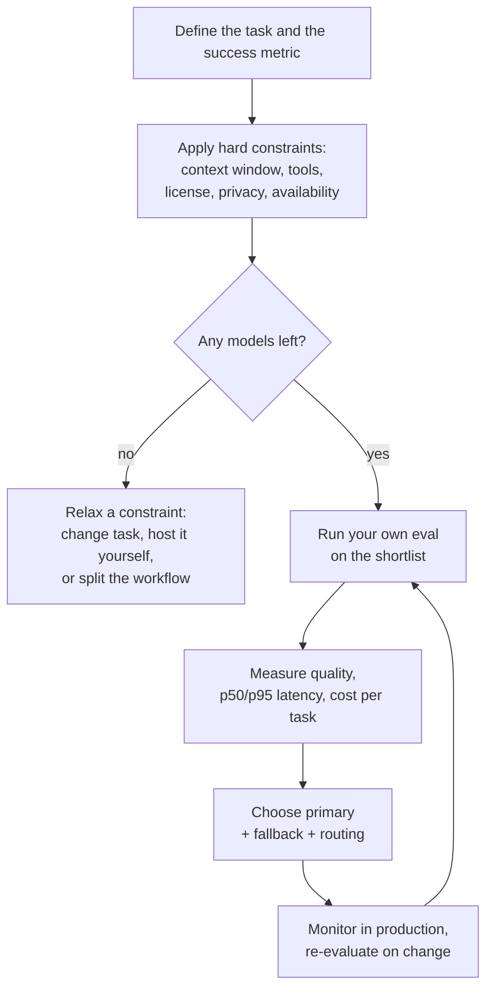

# Model Comparison and Selection

> **Interview answer (say this first).** Model selection is a constrained optimisation, not a leaderboard lookup. You first filter by hard constraints — context window, tool and structured-output support, license, privacy, and availability — then compare the survivors on your own task-specific eval, measured on quality, latency, and cost. Public benchmarks are a weak signal, because they are often contaminated and rarely match your task. Pick a primary model, add a fallback and routing, and re-evaluate as models and prices change.

## Why this exists

Almost every team gets this wrong in one of two directions.

The first mistake is choosing purely on reputation. The biggest, newest model wins a public leaderboard, so it becomes the default. Then the bill arrives and it costs many times more per request, it is slower, and on the actual task — say, extracting three fields from an invoice — a much smaller model is just as accurate.

The second mistake is choosing purely on price. The cheapest model is fast and cheap, until you discover it cannot reliably emit a valid JSON object, or it ignores a tool schema, or its context window is too small for your retrieval payload. Now you have built a whole system around a model that cannot do the job.

The real world is a **Pareto frontier**: no single model is best on quality, latency, cost, context, and licensing at the same time. Selection is the work of finding the best trade-off *for your task under your constraints*, and proving it with your own measurements.

This page gives you the axes, the honest limits of benchmarks, and the practical machinery — evals, routing, fallback, and total cost of ownership — that interviewers expect you to know.

## Start from zero

| Word | Plain meaning |
| --- | --- |
| **Model** | The trained network you call to generate text. |
| **Checkpoint / version** | A specific snapshot of a model. `gpt-x-2024-08` style names pin behaviour. |
| **Parameters** | The learned numbers inside the model. Bigger is not automatically better for your task. |
| **Quality** | How often the model produces a correct, useful answer for your task. Always task-specific. |
| **Latency** | Wall-clock time for a request. Usually split into **time to first token (TTFT)** and total time. |
| **TTFT** | How long before the first streamed token appears. Drives perceived speed in chat UIs. |
| **Throughput** | Tokens produced per second once generation starts. |
| **p50 / p95 / p99** | Percentiles of a latency distribution. p95 = 95% of requests were at least this fast. |
| **Cost per token** | Price for input and output tokens, quoted per million tokens by most providers. |
| **Context window** | Maximum tokens the model can attend to in one call. Input plus output. |
| **Max output tokens** | The cap on how much the model may generate in one response. |
| **Tool calling** | The model can emit a structured request to run a function you defined. |
| **Structured output** | The model can be constrained to follow a JSON schema or grammar. |
| **License** | The legal terms for using the model or its weights. |
| **Privacy / data residency** | Where data is processed and whether the provider trains on it. |
| **Availability** | Uptime, rate limits, and regional deployment. |
| **Benchmark** | A fixed test set used to compare models across versions. |
| **Contamination** | Benchmark data leaking into a model's training data, inflating its score. |
| **Leaderboard** | A public ranking, often built from benchmarks or human votes. |
| **Eval** | Your own test set and scoring for *your* task. The only signal that truly matters. |
| **Golden set** | A curated, human-verified eval set with known-correct answers. |
| **Routing** | Sending each request to the model best suited for it. |
| **Fallback** | A backup model used when the primary fails or times out. |
| **TCO** | Total cost of ownership: inference, engineering, hosting, and on-call. |

The distinction that decides most arguments is **benchmark vs eval**. A benchmark is someone else's task. An eval is your task. Interviewers want to hear that you trust your own eval over a public ranking.

## The core idea

Think of a model as a point in a multidimensional space. Each axis is a property you care about.

```text
quality ↑   ·  flagship
        │        ·  mid
        │   ·  small-fast
        └──────────────────→ cost →
```

There is a **Pareto frontier**: the set of models where you cannot improve one axis without giving up another. Your job is not to find the single best model in the universe. Your job is to find the best point **for your task, under your constraints**.

Start by eliminating, not by ranking. Hard constraints create a feasible set:



The comparison axes, grouped by what kind of decision they inform:

| Axis | What to ask | Where it bites |
| --- | --- | --- |
| Quality | Does it get *my* task right? | Wrong answers, rework, trust |
| Latency | Is TTFT and total time acceptable? | Users abandon slow UIs; timeouts |
| Throughput | Tokens per second | Long generations feel stuck |
| Cost | Price per input and output token | Margin, abuse, scale surprises |
| Context window | Does my payload fit? | Truncated retrieval, silent errors |
| Max output | Can it finish the answer? | Cut-off responses, failed JSON |
| Tool calling | Does it emit valid tool calls? | Agents loop or stall |
| Structured output | Can it follow a schema? | Parsing failures downstream |
| License | Can I use it commercially? | Legal risk, forced rework |
| Privacy | Where does my data go? | Compliance, customer trust |
| Availability | Uptime, limits, regions | Outages, throttling |
| Ecosystem | SDKs, docs, community | Slower delivery, hard debugging |

The benchmarks you will hear named, and what each one is actually good for:

| Benchmark | What it measures | Main limit |
| --- | --- | --- |
| MMLU | Multiple-choice knowledge across many school subjects | Widely saturated; contamination inflates scores |
| GPQA | Hard graduate-level science questions | Small set; still multiple-choice, not free-form |
| HumanEval | Writing small Python functions from docstrings | Tiny and Python-only; very likely in training data |
| SWE-bench | Resolving real GitHub issues end to end | Expensive to run; repository mix changes over time |
| LMArena | Human pairwise preference votes from a public crowd | Crowd taste, not your task; style can beat correctness |
| LiveBench / LiveCodeBench | Freshly rotated, contamination-resistant sets | Narrower coverage than older suites |

Two habits separate strong candidates from weak ones. First, **weight the axes for your product**: for an interactive copilot, latency and quality dominate; for an overnight batch summarizer, cost dominates and p95 latency barely matters. Second, **measure cost per completed task**, not cost per token, because retries and failures are part of the real cost.

## How it works

1. **Define the task and the success metric.** "Extract line items from receipts" with an accuracy target and a latency budget. Vague goals produce vague comparisons.
2. **Build a representative eval set.** Collect real, varied examples, including hard and adversarial ones, and have a human verify the expected answers. Fifty to a few hundred good examples beat thousands of sloppy ones.
3. **Apply hard constraints first.** Filter the catalog by context window, tool and schema support, license, privacy, region, and current availability. This is a yes/no filter, not a score.
4. **Run a blind bake-off.** Send the *same* prompts to every shortlisted model and score the outputs with the same rubric. Do not let the model's brand influence the grader; where possible, grade automatically with a deterministic check.
5. **Measure latency as percentiles.** Record TTFT and total time per request and report p50 and p95. Averages hide the slow tail that users actually complain about.
6. **Compute cost per completed task.** Include input tokens (which can dwarf output when you paste large contexts), output tokens, retries, and failed calls. Use real traffic, not a guess.
7. **Check the non-model costs.** Engineering time to integrate, evaluation harness maintenance, prompt tuning, and ongoing monitoring all count toward total cost of ownership.
8. **Choose a primary plus a fallback.** A fallback in a different failure domain (another provider or region) protects you from an outage. Define the trigger and the timeout.
9. **Add routing if the traffic is mixed.** Easy requests to a small cheap model, hard ones to the flagship. Routing can cut cost substantially with little quality loss.
10. **Pin versions and monitor.** Record the exact model version in every log. Providers deprecate and silently update models; your eval is how you notice quality drift.
11. **Re-evaluate on change.** New model release, new price, new prompt, new data distribution. Re-run the same eval so the comparison stays fair.

> **Tip:**
>
> **The one sentence to remember.** Constraints filter; your eval decides; cost, latency, and quality break the tie — and you re-run it all when anything changes.


## The syntax you will use

**1. Cost per request from token prices.** Prices are quoted per million tokens, and input and output are priced differently.

```python
from dataclasses import dataclass

@dataclass(frozen=True)
class Price:
    input_per_mtok: float    # USD per 1,000,000 input tokens
    output_per_mtok: float

def request_cost(price: Price, input_tokens: int, output_tokens: int) -> float:
    return (input_tokens / 1_000_000) * price.input_per_mtok \
         + (output_tokens / 1_000_000) * price.output_per_mtok
```

**2. Percentiles for latency.** Never rely on the mean.

```python
def percentile(values: list[float], p: float) -> float:
    ordered = sorted(values)
    if not ordered:
        raise ValueError("no samples")
    index = min(len(ordered) - 1, int(round((p / 100) * (len(ordered) - 1))))
    return ordered[index]
```

**3. A weighted score across axes.** Normalise each axis to 0–1, invert "lower is better" axes such as cost and latency, then weight by product priority.

```python
def score(model: dict, weights: dict[str, float]) -> float:
    return sum(model[axis] * weight for axis, weight in weights.items())
```

**4. A routing decision.** Rules, not magic: cheap model for easy tasks, flagship for hard ones.

```python
def choose_model(task: str, tokens: int, needs_tools: bool) -> str:
    if needs_tools and tokens > 100_000:
        return "long-context-tool-model"
    if task in {"classify", "extract"} and tokens < 8_000:
        return "small-fast"
    if task in {"code", "reason"}:
        return "flagship"
    return "mid"
```

**5. A fallback chain.** Try in order; move on when a provider fails.

```python
def call_with_fallback(call, chain: list[str]) -> str:
    errors = []
    for name in chain:
        try:
            return call(name)
        except RuntimeError as exc:
            errors.append(f"{name}: {exc}")
    raise RuntimeError("all providers failed: " + "; ".join(errors))
```

**6. Rough token estimation.** Useful for capacity planning before you have real usage.

```python
def estimate_tokens(text: str) -> int:
    # Very rough English heuristic: about 4 characters per token.
    # Use a real tokenizer when accuracy matters.
    return max(1, len(text) // 4)
```

## Examples: simple to real

**Example 1 — cost arithmetic across two models.** The numbers below are round, made-up prices used only to show the arithmetic, not real quotes.

```python
cheap = Price(0.15, 0.60)
premium = Price(3.00, 15.00)

request_cost(cheap, 2000, 500)    # 0.0006
request_cost(premium, 2000, 500)  # 0.0135
round(request_cost(cheap, 2000, 500) * 100_000, 2)    # 60.0 (raw float: 59.99999999999999)
request_cost(premium, 2000, 500) * 100_000  # 1350.0
```

Same task, same tokens, a 22.5x difference at this volume. This is the number that decides many selections.

**Example 2 — why percentiles matter.** Ten requests, one slow outlier.

```python
latencies = [0.42, 0.51, 0.47, 0.60, 1.10, 0.55, 0.49, 0.53, 0.58, 2.40]

percentile(latencies, 50)   # 0.53
percentile(latencies, 95)   # 2.4
sum(latencies) / len(latencies)  # 0.765 — the mean hides the outlier
```

The mean says "under a second". The p95 says "one user in twenty waits 2.4 seconds". Report both, and set timeouts from the tail.

**Example 3 — a weighted shortlist.** With weights reflecting a balanced product, the mid model wins even though the flagship is best on quality.

```python
weights = {"quality": 0.5, "latency": 0.2, "cost": 0.2, "tools": 0.1}

candidates = {
    "small-fast": {"quality": 0.62, "latency": 0.95, "cost": 0.98, "tools": 0.60},
    "mid":        {"quality": 0.82, "latency": 0.75, "cost": 0.70, "tools": 0.90},
    "flagship":   {"quality": 0.95, "latency": 0.45, "cost": 0.30, "tools": 0.95},
}

# Verified ranking:
# mid         0.790
# small-fast  0.756
# flagship    0.720
```

Change the weights and the winner changes. That is the point: the right model is a function of the product, not a universal truth. Always sanity-check the score against your eval; a weighting scheme can hide a model that fails a must-have.

**Example 4 — routing by request shape.** Mixed traffic rarely needs one model.

```python
choose_model("classify", 500, False)      # 'small-fast'
choose_model("code", 20_000, True)        # 'flagship'
choose_model("summarize", 150_000, True)  # 'long-context-tool-model'
```

A single classifier call and a 150k-token agent task have nothing in common. Routing them to the same model wastes money on one and quality on the other.

**Example 5 — fallback keeps the product up.** Availability is an axis you cannot ignore.

```python
availability = {"primary": False, "secondary": False, "tertiary": True}

def fake_call(name: str) -> str:
    if not availability[name]:
        raise RuntimeError("503 unavailable")
    return f"answered by {name}"

call_with_fallback(fake_call, ["primary", "secondary", "tertiary"])
# 'answered by tertiary'
```

Two providers down, the request still succeeds. Prefer a fallback in a different failure domain; if both run on the same cloud region, one outage takes both.

**Example 6 — total cost of ownership, not just tokens.** Self-hosting is not automatically cheaper.

```python
def api_cost(requests: int, unit_cost: float) -> float:
    return requests * unit_cost

def self_host_cost(gpu_hours: float, gpu_price: float,
                   engineer_hours: float, rate: float) -> float:
    return gpu_hours * gpu_price + engineer_hours * rate

api_cost(1_000_000, 0.003)                       # 3000.0
self_host_cost(24 * 30, 2.50, 40, 75)            # 4800.0
self_host_cost(24 * 30, 2.50, 4, 75)             # 2100.0
```

One million API calls can cost less than renting one GPU for a month once you count engineering time. Self-hosting wins on privacy, control, and very high steady volume — not by default on price. And a rented GPU bills even when idle.

## In production

- **Benchmarks are a screening tool, not a decision.** They help you build a shortlist. Your eval decides. Saying this clearly is often the whole interview answer on model choice.
- **Watch for contamination.** If a benchmark's questions appeared in training data, the score measures memorization. Prefer fresh or private eval sets, or contamination-resistant benchmarks that rotate their data.
- **Leaderboards reflect crowds, not your users.** Human-preference rankings reward pleasant prose; your users may need exact numbers, strict JSON, or a specific tone. Popularity is a weak proxy.
- **Beware benchmark saturation and Goodhart's law.** Once everyone optimizes a benchmark, it stops discriminating. When scores cluster near the ceiling, build a harder, task-specific set.
- **Pin exact model versions.** Providers update models behind aliases. Without a pinned version in your logs, a quality regression is impossible to diagnose.
- **Measure cost per *completed* task.** Retries, invalid structured output, and human fallbacks are real costs that per-token math misses.
- **Latency is a distribution, not a number.** Track p50, p95, and p99; set timeouts and fallbacks from the tail. Streaming changes perceived latency by lowering TTFT even when total time is unchanged.
- **Route before you downgrade.** Sending easy traffic to a small model usually beats forcing everyone onto a smaller model, and it keeps quality where it matters.
- **Fallbacks must be exercised.** An untested fallback is a plan, not a capability. Run it in staging and periodically in production via a canary.
- **Prices and models change fast.** Treat selection as a recurring process with a standing eval harness, not a one-off decision made at kickoff.
- **Total cost includes people.** Integration, prompt maintenance, eval upkeep, and on-call can exceed inference cost. Self-hosting shifts spend from tokens to salaries and GPUs.
- **Check privacy and licensing before the bake-off.** A model that wins on quality but cannot legally or contractually serve your data is not on the shortlist at all.

## Interview questions

### 1. How do you choose a model for a production feature?

**Answer.** Start from the task and a success metric. Filter by hard constraints — context window, tool and structured-output support, license, privacy, region, availability — then run the surviving models on your own eval set. Compare quality, p95 latency, and cost per completed task, and ship a primary with a fallback and optional routing.

**Follow-up: "What if two models are close on quality?"** Let cost, latency, and operational risk break the tie. Prefer the simpler, cheaper, more available option, and keep the stronger model as a fallback or for routed hard cases.

**Trap.** Answering with a model name. The correct answer is always a process plus the constraints and measurements that drove the choice.

### 2. Why can a public benchmark score be misleading?

**Answer.** Benchmarks are fixed test sets, so they can leak into training data (contamination) and inflate scores. They may not resemble your task, they can saturate as models improve, and they reward whatever they measure, which invites overfitting. A high score is weak evidence that a model is right for you.

**Follow-up: "So why use them at all?"** As a cheap filter to build a shortlist, and to spot obvious capability gaps. Then confirm with a private, task-specific eval.

**Trap.** Treating a leaderboard rank as a quality guarantee. Rankings also depend on the metric, the prompt format, and who voted.

### 3. What makes a good eval set?

**Answer.** Real, representative examples with human-verified expected answers, covering common cases and hard edge cases. It should be large enough to separate close models, versioned so comparisons stay stable, and scored by a defined metric — exact match where possible, a rubric or LLM judge where not.

**Follow-up: "How do you keep scoring honest?"** Prefer deterministic checks for structured output. If you use a judge model, calibrate it against human labels and watch for position and style bias.

**Trap.** Using the same examples to tune prompts and to report quality. That leaks the answer key; hold out a test slice.

### 4. How do latency and cost interact with quality?

**Answer.** They trade off on a frontier. The largest model usually gives the best quality per call but costs and waits the most. You can move along the frontier with routing, caching, batching, streaming, and shorter prompts, or off it by choosing a model that fits the task better.

**Follow-up: "Where would you optimize first?"** Usually the input side. Long retrieval contexts multiply input-token cost and TTFT, so trimming context often improves both cost and speed with no quality loss.

**Trap.** Assuming the flagship is always safest. Extra quality you cannot measure for your task is just extra cost and latency.

### 5. Explain routing and fallback.

**Answer.** Routing sends each request to the model best suited to it — easy ones to a small cheap model, hard ones to a flagship — often using a classifier or simple rules. Fallback is the backup path when the primary errors, times out, or is throttled. Routing optimizes the average; fallback protects the worst case.

**Follow-up: "What is the risk of routing?"** A misrouted hard request gets a worse answer. Measure quality per route, and give yourself a way to escalate when confidence is low.

**Trap.** Confusing the two. Routing changes which model serves a healthy request; fallback reacts to failure.

### 6. What is total cost of ownership for an LLM feature?

**Answer.** Everything it takes to run the feature: inference tokens, retries, evaluation compute, engineering time to integrate and maintain prompts, hosting or GPU rental if self-hosted, observability, and on-call. Token price is only the visible part.

**Follow-up: "When does self-hosting pay off?"** At high, steady volume, with privacy or latency requirements that a hosted API cannot meet, or when you need to fine-tune and control the weights. Below that, the engineering and idle-GPU cost usually dominates.

**Trap.** Comparing a token price to a GPU price directly. The self-hosted side also carries salaries, utilization risk, and maintenance.

### 7. How do you handle a provider outage or rate limit?

**Answer.** Treat the provider as unreliable by design. Add timeouts and bounded retries with exponential backoff and jitter, cap concurrency to stay under rate limits, and keep a fallback model in a different failure domain. Queue non-urgent work instead of failing it, and surface a degraded mode to users.

**Follow-up: "What about a fallback model with different output shape?"** Normalize the outputs behind one internal interface so the rest of the app does not care which provider answered. That is the provider-agnostic interface from the APIs page.

**Trap.** Retrying without jitter. Synchronized retries create a thundering herd and make the rate limit worse.

### 8. How do you keep a model choice from going stale?

**Answer.** Version your prompts and evals, pin model versions, and log model, version, tokens, latency, and cost for every call. Monitor quality and cost dashboards, and re-run the standing eval whenever a model, price, prompt, or data distribution changes. Selection is a continuous process.

**Follow-up: "What would trigger a re-evaluation?"** A new model release, a price change, a quality or cost regression in monitoring, a latency shift, or a change in traffic mix.

**Trap.** Assuming a pinned version is permanent. Providers deprecate models; plan migrations and keep the eval ready to run against replacements.

## Remember this

- **Constraints filter, your eval decides.** Benchmarks build the shortlist; task-specific measurement picks the winner.
- **A leaderboard is not your task.** Contamination, saturation, and differing goals make public scores weak evidence.
- **Measure cost per completed task, and latency as p95.** Averages and per-token prices hide the real experience.
- **Ship a primary, a fallback, and routing.** Optimize the average with routing; protect the worst case with fallback.
- **Re-evaluate on every change.** Models, prices, prompts, and data all drift; selection is a loop, not a decision.
