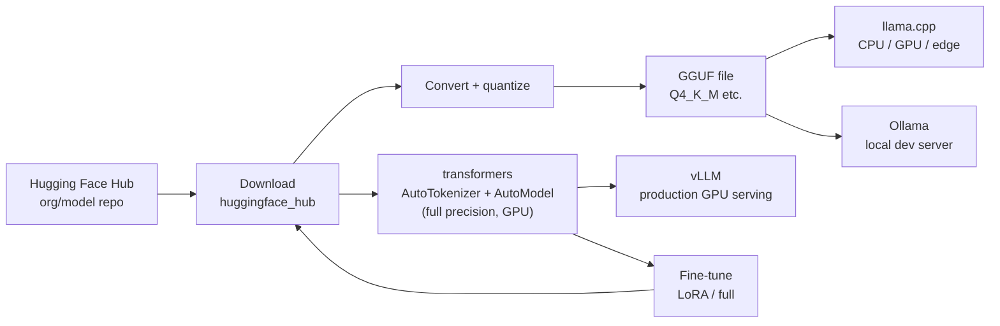

# Open-Source Models and Hugging Face

> **Interview answer (say this first).** "Open weights" means you can download and run the model; true "open source" also means the training code, the data information, and the freedom to use, study, modify, and share it, which many popular models do not fully grant. Hugging Face is the main hub for weights, datasets, and demos, and the `transformers` library gives you `AutoTokenizer`, `AutoModel`, and `pipeline` to run them. You can self-host with llama.cpp/GGUF on a laptop, Ollama for a local developer server, or vLLM for high-throughput serving. Choose self-hosting for privacy, control, offline use, or very high steady volume — and choose a hosted API when you would rather not run GPUs.

## Why this exists

The first question about any open model is a legal and practical one that people often skip: **what does the license actually allow, and what do I have to run it?**

A team downloads a popular model, builds a product around it, and later finds that the license has a commercial restriction or an acceptable-use policy they did not read. Another team assumes "open source" means they can do anything, fine-tune, and redistribute — then discovers the release only gives them the weights, not the training code or the data information. A third team picks a 70-billion-parameter model and discovers it needs more GPU memory than they own.

There is also the operational reality. A hosted API is one function call. Self-hosting means downloading tens of gigabytes, choosing a quantization, sizing memory for weights *plus* the KV cache, serving requests efficiently, and keeping GPUs busy enough to justify the cost. Done well, it buys you privacy, control, offline capability, and predictable unit economics at scale. Done casually, it buys you a large bill and an on-call rotation.

This page gives you the vocabulary, the license reality, the toolchain, and the decision framework you need to reason about open models in an interview.

## Start from zero

| Word | Plain meaning |
| --- | --- |
| **Open weights** | The trained parameters are downloadable, but the license or release may restrict use. |
| **Open source (AI)** | The OSI Open Source AI Definition: use, study, modify, and share, with access to weights, training code, and data information. |
| **Checkpoint** | A saved set of weights, usually a file or a folder of shards. |
| **Model card** | The README for a model: what it is, how it was trained, intended use, limits, and license. |
| **Hugging Face Hub** | The main public platform for hosting models, datasets, and demos. |
| **Repository (repo)** | A named collection on the Hub, such as `org/model-name`. |
| **`transformers`** | The Python library that loads and runs most open models. |
| **`AutoTokenizer`** | A class that picks the right tokenizer for a checkpoint automatically. |
| **`AutoModel`** | A family of classes that pick the right architecture for a checkpoint. |
| **Pipeline** | A one-line wrapper that combines tokenizer, model, and generation for a task. |
| **Tokenizer** | Turns text into token IDs and back. Every model has its own. |
| **Quantization** | Storing weights in fewer bits (INT8, INT4) to shrink memory and speed inference. |
| **GGUF** | The file format used by llama.cpp for quantized models. |
| **llama.cpp** | A C/C++ engine that runs GGUF models efficiently on CPUs and GPUs. |
| **Ollama** | A friendly local server and CLI that manages and runs GGUF models. |
| **vLLM** | A high-throughput Python serving engine using paged attention and batching. |
| **Serving** | Running the model behind an HTTP API that your app calls. |
| **Throughput** | Tokens per second across all concurrent requests. |
| **KV cache** | Memory saved during generation so the model does not recompute past tokens. |
| **VRAM** | GPU memory. Weights, KV cache, and activations all live here. |
| **Fine-tuning** | Continuing training on your data to adapt the model. |
| **Distillation** | Training a smaller model to imitate a larger one. |
| **Perplexity** | A measure of how surprised a model is by text. Lower is better. |

The single most important distinction is **open weights vs open source**. Most "open" LLMs are open weights: you get the parameters and a license, not the full training pipeline and data. That difference is exactly what an interviewer probes.

## The core idea

Think of two things people call "open":

1. **The recipe and the ingredients.** You get the code, the description of the data, and the freedom to cook, change, and share the dish. This is open source.
2. **The cake itself.** You get the finished cake to eat, copy, or serve, under terms the baker sets. This is open weights.

Most downloadable LLMs are case 2. The terms vary a lot: permissive licenses like Apache-2.0 and MIT allow commercial use and modification; community licenses for models like Llama and Gemma add conditions and acceptable-use policies; and some research models are non-commercial only. **Read the model card and the license before you build.**

Once you decide to run one, the toolchain splits by where the model will live:



And the choice between self-hosting and an API is a trade, not a default:

| Dimension | Self-host open weights | Hosted API |
| --- | --- | --- |
| Data privacy | Full control; data never leaves | Depends on provider terms |
| Cost shape | Fixed GPU cost, cheap at high utilization | Pay per token, scales with use |
| Latency | You control it; may be lower or higher | Provider-dependent, often good |
| Model quality | Best open model, usually behind the frontier | Access to the strongest models |
| Control | Quantize, fine-tune, pin versions | Limited to provider options |
| Operations | You run GPUs, serving, scaling, on-call | Provider runs it |
| Availability | Your problem | Provider SLA, shared outages |
| Time to first version | Days to weeks | Minutes |
| Best when | Privacy, offline, high volume, fine-tuning | Speed of delivery, peak quality, spiky traffic |

## How it works

1. **Pick a model and read the card.** Check the architecture, size, context window, training data summary, intended use, limitations, and license. The card is the contract and the warning label.
2. **Check the license for your use.** Confirm commercial use, redistribution, and any acceptable-use terms. Keep a record of the license and version you relied on.
3. **Download the weights and tokenizer.** `huggingface_hub` fetches files into a local cache; large models come in shards.
4. **Load the tokenizer.** It converts text to token IDs using the exact vocabulary the model was trained with. A mismatched tokenizer produces nonsense.
5. **Load the model.** `AutoModel` reads the config and instantiates the right architecture. This needs a backend such as PyTorch, and enough memory for the weights.
6. **Generate.** Run the forward pass and sampling loop to produce tokens. The KV cache grows with sequence length and batch size, so memory scales with context, not just weights.
7. **Quantize if memory is tight.** Convert weights to 8-bit or 4-bit to cut size several-fold, trading a little quality for much lower memory and often faster CPU inference.
8. **Serve it.** For one user, a Python script is enough. For a team, run a server: Ollama for local development, vLLM for batched production traffic.
9. **Measure and iterate.** Track throughput, time to first token, memory, and quality on your own eval. Quantization and batching change all four.

> **Tip:**
>
> **The memory rule of thumb.** Weights + KV cache + overhead must fit in VRAM. A 7B model in FP16 is roughly 13 GiB of weights before any cache; in 4-bit it is roughly 3.3 GiB. The KV cache can add several GiB at long context, so size for the worst case, not the demo.


## The syntax you will use

**1. Download from the Hub.** `huggingface_hub` caches files and resolves shards for you.

```python
from huggingface_hub import hf_hub_download, snapshot_download

path = hf_hub_download(repo_id="org/model", filename="config.json")
folder = snapshot_download(repo_id="org/model")   # whole repo
```

**2. Tokenize text.** The tokenizer is mandatory and model-specific.

```python
from transformers import AutoTokenizer

tok = AutoTokenizer.from_pretrained("org/model")

plain = tok("Hello, tokens!")                          # Python lists
tensors = tok("Hello, tokens!", return_tensors="pt")   # needs a torch backend

print(plain["input_ids"], plain["attention_mask"])
```

**3. Load a causal language model and generate.**

```python
from transformers import AutoModelForCausalLM, AutoTokenizer

tok = AutoTokenizer.from_pretrained("org/model")
model = AutoModelForCausalLM.from_pretrained("org/model")   # needs a torch backend

inputs = tok("The capital of France is", return_tensors="pt")
output = model.generate(**inputs, max_new_tokens=20)
print(tok.decode(output[0], skip_special_tokens=True))
```

> **Note:**
>
> **Verified in this environment.** Importing `AutoModelForCausalLM` without a PyTorch backend *succeeds* but logs a warning: "PyTorch was not found. Models won't be available and only tokenizers, configuration and file/data utilities can be used." The explicit error comes later, from `from_pretrained`, which raises `ImportError: AutoModelForCausalLM requires the PyTorch library but it was not found in your environment...`. The plain tokenizer call works without PyTorch; I ran it against the tiny Hub model `hf-internal-testing/tiny-random-gpt2` and got `input_ids` `[40, 416, 79, 12, 227, 75, 579, 1]` and `attention_mask` of eight `1`s. The `return_tensors="pt"` path fails with `ImportError: ... PyTorch is not installed`, and the `AutoModelForCausalLM` plus `generate` snippet above is illustrative and was not executed, because this environment has no PyTorch or GPU.


**4. A pipeline is the shortest path.**

```python
from transformers import pipeline

generator = pipeline("text-generation", model="org/model")
print(generator("The capital of France is", max_new_tokens=20))
```

**5. Run a quantized GGUF with llama.cpp (command line).**

```bash
# Download a GGUF file from a repo, then:
llama-cli -m model-Q4_K_M.gguf -p "The capital of France is" -n 20
```

**6. Serve locally with Ollama.**

```bash
ollama pull llama-example     # download a model
ollama run llama-example      # interactive chat
ollama serve                  # HTTP API on localhost:11434
```

**7. Serve at throughput with vLLM.**

```bash
vllm serve org/model --port 8000
# then call the OpenAI-compatible endpoint at http://localhost:8000/v1
```

## Examples: simple to real

**Example 1 — license check before anything else.** A small allowlist makes the decision explicit.

```python
# License keys below are illustrative; real Hub cards use tags such as
# "llama3" or "gemma" rather than these friendly names.
PERMISSIVE = {"apache-2.0", "mit", "bsd-3-clause"}
COMMUNITY = {"llama-community", "gemma-terms"}
NON_COMMERCIAL = {"cc-by-nc-4.0"}

def commercial_ok(license_id: str) -> str:
    key = license_id.lower()
    if key in PERMISSIVE:
        return "yes (permissive)"
    if key in NON_COMMERCIAL:
        return "no (non-commercial only)"
    if key in COMMUNITY:
        return "check the terms (community license)"
    return "unknown — review before shipping"

# Verified output:
# apache-2.0         -> yes (permissive)
# MIT                -> yes (permissive)
# Llama-Community    -> check the terms (community license)
# cc-by-nc-4.0       -> no (non-commercial only)
# proprietary-x      -> unknown — review before shipping
```

The allowlist is deliberately conservative because this is a legal decision, not a performance one. When in doubt, a human checks the actual license text.

**Example 2 — how much memory do the weights need?** Precision is a direct multiplier.

```python
BYTES_PER_PARAM = {"fp32": 4, "fp16": 2, "int8": 1, "int4": 0.5}

def weights_gib(params_billions: float, precision: str) -> float:
    return params_billions * 1e9 * BYTES_PER_PARAM[precision] / (1024 ** 3)

# Verified output:
# 7B fp32 : 26.08 GiB
# 7B fp16 : 13.04 GiB
# 7B int8 :  6.52 GiB
# 7B int4 :  3.26 GiB
# 70B fp16: 130.39 GiB
```

A 70B FP16 model does not fit on a single common 80 GB GPU with room for the cache. Quantization is what makes large open models practical for smaller hardware.

**Example 3 — the KV cache is memory you must not forget.** It grows with context length and batch size.

```python
def kv_cache_gib(layers: int, kv_heads: int, head_dim: int,
                 seq_len: int, batch: int, bytes_per_value: int = 2) -> float:
    # 2 because both keys and values are cached; fp16 = 2 bytes per value
    return (2 * layers * kv_heads * head_dim * seq_len * batch * bytes_per_value) / (1024 ** 3)

# Verified output (32 layers, 8 KV heads, head_dim 128, fp16):
# seq 8k          : 1.0 GiB
# seq 32k         : 4.0 GiB
# seq 32k, batch 8: 32.0 GiB
```

At 32k context with a batch of eight, the cache alone needs 32 GiB. This is why serving systems use grouped-query attention (fewer KV heads) and paged memory — and why long context is expensive.

**Example 4 — estimating a GGUF file size.** Bits per weight decide the download and the memory footprint.

```python
def gguf_gib(params_billions: float, bits_per_weight: float) -> float:
    return params_billions * 1e9 * (bits_per_weight / 8) / (1024 ** 3)

# Verified output for a 7B model (approximate bits per weight):
# Q8_0    ~ 6.93 GiB
# Q5_K_M  ~ 4.48 GiB
# Q4_K_M  ~ 3.91 GiB
# Q3_K_S  ~ 2.77 GiB
```

Smaller quantizations fit more easily on a laptop but lose quality. Q4_K_M is a common default because it keeps much of the quality at roughly a quarter of the FP16 size (about 15% of FP32).

**Example 5 — parse a model card's front matter.** The YAML at the top of a card holds the license and metadata.

```python
CARD = """---
license: apache-2.0
language:
- en
library_name: transformers
base_model: example/base
---
# My Fine-Tuned Model
"""

def front_matter(text: str) -> dict[str, str]:
    if not text.startswith("---"):
        return {}
    body = text.split("---", 2)[1]
    meta = {}
    for line in body.splitlines():
        if not line.strip() or line.startswith(("-", " ")):
            continue
        key, sep, value = line.partition(":")
        if sep:
            meta[key.strip()] = value.strip()
    return meta

# Verified output:
# {'license': 'apache-2.0', 'language': '', 'library_name': 'transformers',
#  'base_model': 'example/base'}
# license: apache-2.0 -> yes (permissive)
```

Reading the card programmatically is useful when you are inventorying many models, but this toy parser handles scalar values only — YAML list values such as `language:` followed by `- en` are silently dropped (note the empty string in the output above). Use a real YAML parser, or `huggingface_hub`'s `ModelCard` class, for production inventory work.

**Example 6 — self-host versus API break-even.** The GPU bill does not stop when traffic does.

```python
def api_cost(req_per_hour: int, unit_cost: float) -> float:
    return req_per_hour * 24 * 30 * unit_cost

def self_host_cost(gpu_hours: float, gpu_price: float,
                   engineer_hours: float, rate: float) -> float:
    return gpu_hours * gpu_price + engineer_hours * rate

# Verified output (one GPU, 24/7, $2.50/GPU-hour, 40 engineer hours at $75/h):
api_cost(18_000, 0.0005)                       # 6480.0
self_host_cost(24 * 30, 2.50, 40, 75)          # 4800.0
# break-even volume: about 13,333 requests/hour
```

Below the crossover, the API is usually cheaper once you count engineering time. Above it, self-hosting wins on unit cost and gives you privacy and control as a bonus.

## In production

- **Read the license, not the label.** "Open source" on a blog post is not a license. Check the model card, keep the version you relied on, and get legal review for commercial use.
- **Open weights are not open source.** Most popular models release parameters under custom terms, not the full training pipeline and data information the OSI definition requires. Say this precisely in interviews.
- **Size for weights *and* KV cache.** Long context and large batches multiply the cache. A model that fits at 2k context can run out of memory at 32k.
- **Quantization is a quality trade, not free.** INT8/INT4 shrink memory and often speed up CPU inference, but they can degrade reasoning and structured output. Measure on your eval before and after.
- **Tokenizer and model must match.** Using the wrong tokenizer produces fluent-looking garbage. Always `AutoTokenizer.from_pretrained` with the same repo as the model.
- **Pin the revision.** A Hub repo can change. Download by commit hash or snapshot the files so a model update does not silently change production behaviour.
- **Choose the runtime for the job.** llama.cpp/GGUF for CPU, laptop, edge, and single-user use; Ollama for local development and small internal tools; vLLM for concurrent production GPU serving with continuous batching (continuous batching: new requests join a batch already running, at each decoding step, instead of waiting for the whole batch to finish).
- **Throughput and latency trade off.** Batching raises tokens per second overall but can raise the time to first token for each request. Tune for the product, not the benchmark.
- **Cold starts are real.** Loading tens of gigabytes takes time. Keep warm replicas or preload weights, and expect slow scale-up.
- **GPU idle time is wasted money.** Rented GPUs bill by the hour regardless of traffic. Self-hosting only pays off at high, steady utilization — or when privacy and control justify the cost on their own.
- **Self-hosting moves the failure mode to you.** You now own model quality regression, serving crashes, capacity, security patches, and on-call. Budget for it.
- **Fine-tuning is a separate project.** LoRA makes it cheaper, but you still need a clean dataset, an eval, and a way to serve the merged or adapter weights. Do not treat it as a checkbox.

## Interview questions

### 1. What is the difference between open weights and open source?

**Answer.** Open weights means the trained parameters are downloadable, often under a custom license. Open source, per the OSI Open Source AI Definition, additionally grants the freedom to use, study, modify, and share, and provides access to the training code and data information. Many popular "open" LLMs are open weights only.

**Follow-up: "Why does it matter?"** Because it changes what you may legally and practically do: commercial use, redistribution, auditing, and reproducing the training. For a product, the license terms are the deciding factor.

**Trap.** Treating the two terms as synonyms, or assuming a downloadable model is automatically commercially usable. Some are research-only, and community licenses add conditions.

### 2. What is on the Hugging Face Hub, and how do you use it?

**Answer.** The Hub hosts model repositories, dataset repositories, and Spaces (hosted demos), plus metadata in model cards. You use `huggingface_hub` to download files or snapshot a repo, and `transformers` to load a checkpoint by its repo ID. It is the default distribution channel for open models and datasets.

**Follow-up: "How do you handle large models?"** Download by snapshot, pin a revision or commit hash, and cache locally. Large checkpoints are sharded, and the Hub client resolves the shards for you.

**Trap.** Assuming a Hub repo is immutable. It can be updated, so pin the revision you validated.

### 3. Walk through loading and running a model with `transformers`.

**Answer.** Load the tokenizer with `AutoTokenizer.from_pretrained(repo)`, load the model with `AutoModelForCausalLM.from_pretrained(repo)` (or the right `AutoModel` class), tokenize the prompt into tensors, call `model.generate(...)` with a token cap, and decode the output with `skip_special_tokens=True`. `pipeline` wraps all of that for a single task.

**Follow-up: "What does `Auto` mean?"** The class reads the checkpoint's config to pick the correct architecture and tokenizer implementation, so one API works across many model families.

**Trap.** Forgetting that the model classes need a backend such as PyTorch installed. Without it, importing the class succeeds but warns, and `from_pretrained` fails with an `ImportError`; the tokenizer and config utilities still work.

### 4. What is quantization, and what does it trade?

**Answer.** Quantization stores weights in fewer bits — INT8 or INT4 instead of FP16 — which shrinks memory and can speed inference, especially on CPU. The trade is quality: aggressive quantization degrades reasoning, long-context behaviour, and structured output. Use the smallest quantization that still passes your eval.

**Follow-up: "What is GGUF?"** The file format used by llama.cpp for quantized models. Names like Q4_K_M and Q5_K_M encode the number of bits and the quantization recipe.

**Trap.** Assuming 4-bit always halves quality, or that it is lossless. The effect is task-dependent; measure it rather than guess.

### 5. When would you self-host instead of using an API?

**Answer.** Self-host for data privacy or residency, offline or edge deployment, very high steady volume where unit cost matters, deep control such as fine-tuning or custom quantization, or to avoid vendor lock-in. Use a hosted API for speed of delivery, frontier quality, spiky traffic, and when you do not want to run GPUs.

**Follow-up: "What is the hidden cost?"** Engineering time, GPU idle hours, serving infrastructure, scaling, security, and on-call. The break-even is usually at high, sustained utilization.

**Trap.** Comparing a token price to a GPU price directly. The self-hosted side also carries salaries, utilization risk, and maintenance.

### 6. Compare llama.cpp, Ollama, and vLLM.

**Answer.** llama.cpp is a C/C++ engine that runs GGUF models efficiently on CPU and GPU, ideal for laptops, edge devices, and single users. Ollama wraps that experience into a local CLI and HTTP server for easy development. vLLM is a Python server designed for concurrent production traffic, using paged attention and continuous batching for high throughput.

**Follow-up: "Which for a production API?"** vLLM, unless the workload is tiny or the hardware is unusual. Ollama is for development and small internal tools; llama.cpp is for embedded and CPU-only cases.

**Trap.** Benchmarking a single local chat and assuming the same throughput under concurrency. Batching changes the picture completely.

### 7. What belongs on a model card, and why care?

**Answer.** The model card states what the model is, how it was trained, intended uses, limitations, evaluation results, and license. It is both your due-diligence document and a debugging aid: it tells you the context window, training cut-off, and known biases, which shape how you can safely use the model.

**Follow-up: "What if the card is thin?"** Treat missing information as risk. Lack of data and evaluation detail makes legal review and reliability assessment harder.

**Trap.** Trusting benchmark numbers on the card without checking your own task. Cards report the author's evals, not yours.

### 8. How do you decide between fine-tuning and prompting for an open model?

**Answer.** Try prompting and retrieval first: they are fast, cheap, and reversible. Fine-tune when you need a consistent style or format, a domain the base model lacks, or lower cost by shrinking the model, and when you have enough clean, representative data plus an eval. LoRA adapts a model cheaply by training small added matrices instead of all weights.

**Follow-up: "What does fine-tuning not fix?"** Knowledge gaps and hallucinations. Use retrieval for factual grounding; fine-tuning shapes behaviour and format.

**Trap.** Fine-tuning before you have an eval. Without measurement you cannot tell whether it helped, and you have added a model artifact to maintain.

## Remember this

- **Open weights is not open source.** Check the license; most LLMs grant weights under custom terms.
- **Hugging Face is the distribution layer**, and `transformers`, `AutoTokenizer`, `AutoModel`, and `pipeline` are the standard tools.
- **Memory is weights plus KV cache.** Quantization (GGUF Q4_K_M and friends) is what makes big models fit small hardware.
- **Pick the runtime for the job.** llama.cpp for CPU/edge, Ollama for local dev, vLLM for production throughput.
- **Self-host for privacy, control, and high steady volume** — and pay for the GPUs, engineering, and on-call it brings.
