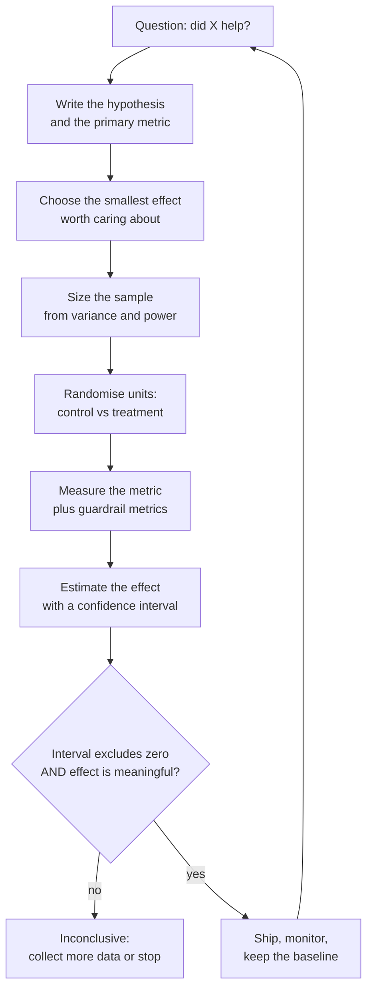

# Statistics and Experiment Design

> **Interview answer (say this first).** A metric is a sample from a distribution, so a single number is not a result — you need the variance and an interval around it. To make an honest claim, state the hypothesis and the metric before you look at the data, keep a randomised control, size the sample from the effect you care about, report the effect size next to the p-value, correct for multiple comparisons, and read a p-value as the probability of the data under the null hypothesis — not the probability that your change works.

## Why this exists

A team runs a 30-question eval. The baseline scores 0.72 and the candidate prompt scores 0.76. That is a four-point gain, so they ship it. Two weeks later, quality complaints rise. They re-run on 500 questions: baseline 0.72, candidate 0.73. The "gain" was sampling noise. They have spent a rollout, a rollback, and their credibility on a number that was never real.

A second team compares two embedding models on 20 requests. Model B has a lower **mean** latency, so they migrate. In production the **p95** latency is worse, because the samples happened to miss B's slow tail. They were comparing a summary of 20 draws and calling it a property of the system.

A third team tests 12 prompt variants against one baseline and finds variant 7 is "significantly better, p < 0.05". They ship it. It is not better. With 12 comparisons at a 5% threshold, the chance of at least one false positive is high — this is the multiple-comparisons problem, and it is the most common way LLM experiments fool their own authors.

| The claim | What was missing | What happened |
| --- | --- | --- |
| "Prompt B is +4 points" | Variance and a confidence interval on 30 questions | Shipped noise, rolled back |
| "Model B has lower latency" | Percentiles and enough samples for the tail | p95 got worse in production |
| "Variant 7 wins, p < 0.05" | Correction for 12 comparisons | Shipped a false positive |

The purpose of statistics here is not mathematical elegance. It is to stop a team from making a decision the data does not support — in either direction. A test that fires on noise gets ignored, and a test that misses a real regression ships it.

## Start from zero

| Word | Plain meaning |
| --- | --- |
| **Random variable** | A quantity whose value depends on chance. A single request's latency is one. |
| **Distribution** | The rule describing which values a random variable takes and how often. |
| **Mean** | The arithmetic average, the sum divided by the count. Sensitive to extreme values. |
| **Expectation** | The long-run average of a random variable — what the mean converges to as samples grow. |
| **Variance** | The average squared distance from the mean. Measures spread, in squared units. |
| **Standard deviation (SD)** | The square root of the variance, back in the original units. Same units as the data. |
| **Standard error (SE)** | The standard deviation of an estimate, usually `SD / sqrt(n)`. Shrinks as samples grow. |
| **Covariance** | How two variables move together. Positive means they rise and fall together. |
| **Correlation** | Covariance normalised to the range −1 to +1, so it is comparable across units. |
| **Population** | Every case you care about — all traffic, all users, all future requests. |
| **Sample** | The finite subset you actually measured. You reason about the population through it. |
| **Estimator** | A formula that turns a sample into a guess about the population, such as the sample mean. |
| **Bias** | A systematic error: the estimate is wrong in the same direction every time, not just noisy. |
| **Bayes' theorem** | A rule for updating a belief with new evidence: posterior ∝ likelihood × prior. |
| **Prior** | Your belief about a quantity before seeing the data, encoded as a distribution. |
| **Posterior** | Your updated belief after seeing the data. |
| **Sampling** | Choosing which cases to measure. Random sampling keeps the choice free of bias. |
| **Sampling error** | The difference between a sample estimate and the true population value, caused by luck of the draw. |
| **Confidence interval (CI)** | A range built from the sample that, in repeated sampling, would contain the true value a set fraction of the time. |
| **Significance** | A threshold-based claim that a result is unlikely under the null hypothesis. |
| **p-value** | The probability of seeing data at least this extreme **if the null hypothesis were true**. |
| **Hypothesis test** | A procedure that compares data to a null hypothesis and returns a p-value. |
| **Null hypothesis** | The default "no effect, no difference" assumption a test tries to reject. |
| **Effect size** | How large the difference is on a meaningful scale — a lift, a Cohen's d, a ratio. |
| **Power** | The probability a test detects a real effect of a given size. Convention is 0.80. |
| **Multiple comparisons** | Testing many hypotheses at once, which inflates the chance of a false positive. |
| **A/B test** | An experiment that assigns units at random to a control and a treatment, then compares them. |
| **Control** | The group that keeps the current behaviour. The baseline arm. |
| **Treatment** | The group that receives the change being tested. |
| **Guardrail metric** | A metric you are not trying to improve but refuse to harm, such as error rate or cost. |

Two activities hide behind the word "statistics". **Estimation** asks "what is the value, and how sure are we?" and produces an interval. **Testing** asks "is this difference bigger than noise?" and produces a p-value. A third question — "does the difference matter?" — is answered by the **effect size**. Confusing the three is the root of most bad experiment write-ups.

## The core idea

Imagine each metric you measure as one draw from an urn. The urn is the **distribution** of all possible values. You never see the urn; you see a handful of marbles. The sample mean is your guess at the urn's mean, and it moves every time you take a new handful. That movement is **sampling error**, and it is not a bug — it is the thing a confidence interval describes.

So a single number is never a result. "0.77 accuracy" means nothing without "on 30 questions, with a 95% interval of 0.59 to 0.88" (a Wilson interval, a confidence interval for a proportion that behaves well with small samples, for 23 of 30). The interval may be so wide that it is consistent with your baseline, your target, and a regression all at once.



The most useful distinction in practice is **statistically detectable** versus **practically meaningful**. A result can be one without the other, and the right response differs each time.

| Situation | Detectable? | Meaningful? | What to do |
| --- | --- | --- | --- |
| Tiny effect, huge sample | Yes | No | Do not ship for quality; ship only if the gain is free and safe |
| Large effect, small sample | Not yet | Yes | Collect more data before deciding |
| Real effect, underpowered test | No | Unknown | Resize the experiment; absence of proof is not proof of absence |
| Large effect, clear interval | Yes | Yes | Ship, monitor, and keep the baseline for the next change |

Two distributions can overlap heavily and still have different means. With a small sample you will often draw a difference in the wrong direction. With a large enough sample, even a difference too small to matter becomes "significant". The p-value tells you about detectability; the effect size and the interval tell you about importance. Report all three.

## How it works

1. **Describe the data as a distribution.** Before any test, look at the shape. Plot a histogram and read the centre, the spread, and the tails. Latency and token counts are **skewed**: a long right tail of slow requests. Accuracy on a fixed set is a proportion. Mixing shapes without looking is how people apply the wrong test.

2. **Estimate the quantity and its uncertainty.** Decide what you are estimating: a mean, a median, a p95, or a difference between two arms. Every estimate has a **standard error**, which shrinks with the square root of the sample size. To halve the error you need four times the data. This is the single most useful number in experiment planning.

3. **Build a confidence interval.** For a mean with enough samples, `mean ± 1.96 × SE` gives a 95% interval. For anything non-normal — a median, a p95, a difference of ratios — use the **bootstrap**: resample your data with replacement many times, recompute the statistic, and take the 2.5th and 97.5th percentiles. The interval is the honest form of the result. A 95% interval means that if you repeated the whole procedure many times, 95% of the intervals would contain the true value; it does not mean "a 95% chance the true value is in this one".

4. **Run a hypothesis test and read the p-value correctly.** State a **null hypothesis** (the change does nothing), then ask how surprising the data is under it. A small p-value means the data would be unlikely if the null were true. It is **not** the probability that the null is true, and it is **not** the probability that your change works. A large p-value does not prove "no effect"; it may just mean your test is underpowered.

5. **Measure the effect size.** Convert the difference into a scale people can judge: absolute lift (`0.74 − 0.71 = +0.03`), relative lift (`+4%`), or standardised, such as **Cohen's d** (difference divided by pooled standard deviation). Cohen's d near 0.2 is small, 0.5 medium, 0.8 large. A tiny d with a small p means "real but small"; a large d with a large p means "possibly important, not yet proven".

6. **Design the experiment before you run it.** Write down the **hypothesis**, the **primary metric** (one), the **guardrail metrics** (error rate, cost, p95 latency), the **unit of randomisation** (request, user, or tenant), the **control** and **treatment**, the **sample size**, and the **stopping rule**. Pre-registering this stops you from moving the goalposts after seeing the data.

7. **Correct for multiple comparisons.** Every extra test is another chance to be fooled. The **family-wise error rate** is the chance of at least one false positive across a family of tests. Bonferroni divides the threshold by the number of tests (`0.05 / 12 ≈ 0.004`). The Benjamini–Hochberg procedure controls the **false discovery rate** instead, which is less strict and better when you are screening many candidates.

8. **Decide, record, and keep the baseline.** Ship only when the interval excludes zero **and** the effect clears your practical threshold **and** no guardrail regressed. Record the metric version, dataset version, model version, and seed so the next person can reproduce the number. Keep the previous configuration as the standing baseline.

> **Tip:**
>
> **Peeking is not free.** If you check the test every hour and stop when p < 0.05, you will stop early on noise. The threshold assumes you looked once. Either fix the sample size in advance or use a method designed for sequential looks.

## The syntax you will use

**1. The standard library `statistics` module.** Good for small samples and exact definitions. `stdev` is the **sample** standard deviation (divides by `n − 1`); `pstdev` is the **population** version (divides by `n`).

```python
import statistics

latencies = [0.42, 0.51, 0.47, 0.60, 1.10, 0.55, 0.49, 0.53, 0.58, 2.40]

statistics.mean(latencies)       # 0.765
statistics.median(latencies)     # 0.54
statistics.stdev(latencies)      # 0.6050757528332024 (sample, n - 1)
statistics.quantiles(latencies, n=4)   # [0.485, 0.54, 0.725]
```

The mean (0.765) sits well above the median (0.54) because two slow requests pull it up. That gap is the signature of a skewed distribution.

**2. `numpy` for arrays, percentiles, and random draws.** `np.std` defaults to the **population** convention (`ddof=0`), unlike `statistics.stdev`; pass `ddof=1` for the sample version.

```python
import numpy as np

rng = np.random.default_rng(seed=42)          # modern, reproducible generator
latency = rng.lognormal(mean=0.0, sigma=0.8, size=100_000)   # lognormal: right-skewed, like real latency

np.mean(latency)            # 1.377...
np.median(latency)          # 0.992...
np.percentile(latency, 95)  # 3.732...
latency.std(ddof=1)         # 1.330... (sample SD)
np.corrcoef([1, 2, 3, 4], [2, 4, 6, 8])   # [[1., 1.], [1., 1.]]
```

Always create randomness from `np.random.default_rng(seed)` rather than the legacy `np.random.seed`, so runs are reproducible and independent generators do not interfere.

**3. A bootstrap confidence interval.** Pass any function of an array; the function receives all resampled columns at once and must accept `axis=1`.

```python
import numpy as np

def bootstrap_ci(values, statistic=np.mean, n=10_000, alpha=0.05, seed=0):
    rng = np.random.default_rng(seed)
    data = np.asarray(values, dtype=float)
    draws = rng.choice(data, size=(n, data.size), replace=True)  # resample with replacement
    estimates = statistic(draws, axis=1)
    lo, hi = np.percentile(estimates, [100 * alpha / 2, 100 * (1 - alpha / 2)])
    return float(lo), float(hi)

def p95(a, axis):
    return np.percentile(a, 95, axis=axis)
```

The bootstrap assumes only that your sample is representative. It does not assume a particular distribution shape, which is why it is the default tool for LLM metrics.

**4. A two-sample t-test.** `equal_var=False` is Welch's test: it does **not** assume the two arms have equal variance. That assumption is rarely true, so prefer Welch.

```python
from scipy import stats

baseline = [0.70, 0.74, 0.69, 0.77, 0.72]
candidate = [0.75, 0.78, 0.74, 0.80, 0.77]

t_stat, p_value = stats.ttest_ind(candidate, baseline, equal_var=False)
# p_value ≈ 0.0417 — the means differ more than noise would explain
```

**5. A rank test for skewed data.** When the distribution is clearly non-normal, or the metric is ordinal, the Mann–Whitney U test compares ranks instead of means — it tests whether one group tends to produce larger values, not whether the means are equal. That makes it robust to skew, but if the decision is about a *mean* difference, use a bootstrap or permutation test on the mean.

```python
result = stats.mannwhitneyu(candidate, baseline, alternative="two-sided")
result.statistic   # 22.0
result.pvalue      # 0.0586 — just above the 0.05 threshold
```

**6. A proportion test.** For pass/fail counts, the two-proportion z-test compares two rates using a pooled standard error.

```python
import numpy as np
from scipy import stats

def two_proportion_z_test(success_a, n_a, success_b, n_b):
    p_a, p_b = success_a / n_a, success_b / n_b
    p_pool = (success_a + success_b) / (n_a + n_b)
    se = np.sqrt(p_pool * (1 - p_pool) * (1 / n_a + 1 / n_b))
    z = (p_a - p_b) / se
    p_value = 2 * stats.norm.sf(abs(z))          # two-sided
    return p_a - p_b, float(z), float(p_value)

two_proportion_z_test(82, 100, 88, 100)          # (-0.06, -1.188..., 0.2347...)
```

**7. A contingency-table test.** `chi2_contingency` is the general form of the proportion test. It applies **Yates' continuity correction by default** for 2×2 tables, which is why its p-value differs from the z-test above; set `correction=False` to match.

```python
table = [[82, 18], [88, 12]]                     # [[successes, failures], ...]
result = stats.chi2_contingency(table)
result.statistic   # 0.980... with Yates' correction
result.pvalue      # 0.322... (the pooled z-test gives 0.235)
result.dof         # 1
result.expected_freq  # [[85., 15.], [85., 15.]]
```

**8. Sample size from variance and power.** Turn "I want to detect a 0.05 lift" into a number of samples per arm. This is an approximation for a two-sample test with equal arms.

```python
from scipy import stats

def samples_per_arm(delta, sigma, alpha=0.05, power=0.80):
    z_alpha = stats.norm.ppf(1 - alpha / 2)       # 1.959... for 95%
    z_beta = stats.norm.ppf(power)                # 0.841... for 80% power
    return 2 * ((z_alpha + z_beta) * sigma / delta) ** 2

samples_per_arm(delta=0.05, sigma=0.15)   # 141.28...  → about 142 per arm
samples_per_arm(delta=0.02, sigma=0.15)   # 882.998... → about 883 per arm
```

Halving the effect you want to detect roughly quadruples the sample. The sample size grows with the square of the precision you want, which is the inverse of the square-root rule for the standard error.

**9. A Bayesian view with a Beta prior.** For a pass/fail rate, start from a **Beta** prior and update it with the counts. `Beta(1, 1)` is a flat, uninformative prior.

```python
from scipy import stats

posterior = stats.beta(1 + 82, 1 + 18)           # 82 passes, 18 fails → Beta(83, 19)
posterior.mean()                                 # 0.8137...
posterior.ppf([0.025, 0.975])                    # [0.733, 0.883] credible interval
```

A **credible interval** is the Bayesian cousin of a confidence interval, and its direct reading is the one people wrongly give to a CI: "given the data and the prior, there is a 95% probability the value lies here".

## Examples: simple to real

**Example 1 — mean versus median on skewed latency.** One slow request moves the mean a long way and the median hardly at all.

```python
latencies = [0.21, 0.23, 0.22, 0.25, 0.24, 0.26, 0.28, 0.27, 0.30, 0.31,
             0.29, 0.33, 0.35, 0.34, 0.38, 0.40, 0.36, 0.42, 0.45, 0.44,
             0.48, 0.50, 0.47, 0.55, 0.58, 0.52, 0.61, 0.66, 0.63, 0.70,
             0.75, 0.82, 0.90, 0.95, 1.10, 1.25, 1.40, 1.80, 2.40, 3.50]

import numpy as np
values = np.asarray(latencies)
values.mean()               # 0.6725
np.median(values)           # 0.46
np.percentile(values, 95)   # 1.83
```

The mean is 46% higher than the median because the top few requests are far from the rest. A dashboard that shows only the mean will describe a system nobody experiences; most users get 0.46 seconds and the mean says 0.67. Report the median and a high percentile next to the mean.

**Example 2 — a bootstrap confidence interval for a p95.** The tail percentile is much harder to pin down than the mean, because it depends on very few observations.

```python
import numpy as np

def bootstrap_ci(values, statistic, n=10_000, alpha=0.05, seed=0):
    rng = np.random.default_rng(seed)
    data = np.asarray(values, dtype=float)
    draws = rng.choice(data, size=(n, data.size), replace=True)
    estimates = statistic(draws, axis=1)
    return np.percentile(estimates, [100 * alpha / 2, 100 * (1 - alpha / 2)]).tolist()

def p95(a, axis):
    return np.percentile(a, 95, axis=axis)

bootstrap_ci(latencies, np.mean)   # [0.502, 0.888]  width 0.39
bootstrap_ci(latencies, p95)       # [0.957, 3.500]  width 2.54
```

On 40 samples the mean interval is already wide, and the p95 interval is more than six times wider. Both intervals shrink as you add data, but the percentile needs far more. A rough rule: the mean uses every observation, while the p95 is driven by the top 5%, so a p95 estimate effectively rests on `0.05 × n` points. Forty samples means about two. To tighten a p95, collect hundreds or thousands, or model the tail explicitly.

**Example 3 — comparing two model variants with a t-test and an effect size.** The same true improvement looks different at two sample sizes.

```python
import numpy as np
from scipy import stats

def cohens_d(a, b):
    a, b = np.asarray(a, float), np.asarray(b, float)
    n_a, n_b = a.size, b.size
    pooled_var = ((n_a - 1) * a.var(ddof=1) + (n_b - 1) * b.var(ddof=1)) / (n_a + n_b - 2)
    return float((a.mean() - b.mean()) / np.sqrt(pooled_var))

rng = np.random.default_rng(23)
cand_40  = rng.normal(0.74, 0.15, 40)
base_40  = rng.normal(0.72, 0.15, 40)
cand_400 = rng.normal(0.74, 0.15, 400)
base_400 = rng.normal(0.72, 0.15, 400)

for name, c, b in (("n=40", cand_40, base_40), ("n=400", cand_400, base_400)):
    t = stats.ttest_ind(c, b, equal_var=False)
    se = np.sqrt(c.var(ddof=1) / c.size + b.var(ddof=1) / b.size)   # Welch standard error
    lo, hi = stats.t.interval(0.95, df=t.df, loc=c.mean() - b.mean(), scale=se)
    print(name, round(c.mean() - b.mean(), 4), round(float(t.pvalue), 4),
          round(cohens_d(c, b), 3), (round(float(lo), 3), round(float(hi), 3)))

# n=40  diff +0.0423  p 0.2728  d 0.247  CI (-0.034, 0.118)
# n=400 diff +0.0301  p 0.0040  d 0.204  CI (0.010, 0.051)
```

At 40 samples per arm the interval spans −0.034 to +0.118, so it includes zero and cannot separate the models. At 400 samples the interval is +0.010 to +0.051 and the p-value is 0.004 — **detectable**. But Cohen's d is 0.204, a small effect: the candidate wins by three points on average, which may not be worth the migration.

Now compare that with a genuinely large improvement at the same small sample size:

```python
rng2 = np.random.default_rng(1000)
cand_big = rng2.normal(0.82, 0.15, 40)
base_big = rng2.normal(0.72, 0.15, 40)
t = stats.ttest_ind(cand_big, base_big, equal_var=False)
# diff +0.109, p 0.00073, d 0.786 — just under the 0.8 "large" convention, and clear even at n=40
```

The lesson: the p-value answers "could this be noise?", and the effect size answers "does it matter?". Decide with both. If the metric is skewed per-query (a score, not a pass/fail), prefer `stats.mannwhitneyu` or bootstrap the difference, because the t-test assumes roughly symmetric data.

**Example 4 — the multiple-comparison trap across 12 prompt variants.** This is the failure that ships most often, because every individual test looks legitimate.

```python
import numpy as np
from scipy import stats

def two_proportion_p(success_a, n_a, success_b, n_b):
    p_a, p_b = success_a / n_a, success_b / n_b
    p_pool = (success_a + success_b) / (n_a + n_b)
    se = np.sqrt(p_pool * (1 - p_pool) * (1 / n_a + 1 / n_b))
    return 2 * float(stats.norm.sf(abs((p_a - p_b) / se)))

rng = np.random.default_rng(8)
control = rng.binomial(100, 0.6)                       # the true rate is the same everywhere
p_values = [two_proportion_p(rng.binomial(100, 0.6), 100, control, 100) for _ in range(12)]

# one run found by seed 8:
# [0.8850, 0.4627, 0.8845, 0.5652, 0.6656, 0.2532, 0.8850, 0.0335, 0.3900, 1.0000, 0.4730, 0.8850]
min(p_values)                                          # 0.0335 — "significant" at 0.05
```

Variant 8 is declared a winner. But all 12 variants were drawn from the same true rate, so it is a false positive. The analytic shape of the problem, and a simulation of it:

```python
# Analytic, if the tests were independent and continuous:
1 - (1 - 0.05) ** 12          # 0.4596 — a 46% chance of at least one false positive

# Simulate 20,000 experiments. Every variant has the same true rate as the control.
rng = np.random.default_rng(11)
hits = 0
for _ in range(20_000):
    control = rng.binomial(100, 0.6)
    variant_p_values = [two_proportion_p(rng.binomial(100, 0.6), 100, control, 100) for _ in range(12)]
    if min(variant_p_values) < 0.05:
        hits += 1

hits / 20_000                 # 0.3255 — a "winner" appears in about a third of runs by luck
```

The simulation gives about 33%, below the 46% analytic figure only because the normal approximation to a discrete count is slightly conservative here. Either way, the naive 5% is badly wrong.

Corrections handle this. Bonferroni is the simplest and controls the family-wise error. Benjamini–Hochberg controls the false discovery rate and rejects more hypotheses, which suits screening many candidates before a confirmatory run.

```python
import numpy as np

def benjamini_hochberg(p_values, alpha=0.05):
    p = np.asarray(p_values, dtype=float)
    m = p.size
    order = np.argsort(p)
    ranked = p[order]
    threshold = alpha * (np.arange(1, m + 1) / m)
    passed = ranked <= threshold
    k = int(np.max(np.nonzero(passed)[0])) + 1 if passed.any() else 0
    rejected = np.zeros(m, dtype=bool)
    rejected[order[:k]] = True
    return rejected

benjamini_hochberg(p_values).tolist()   # all False — nothing survives
```

Apply **none** of these if you only planned one test. The trap is planning one test after the fact; the fix is to say how many variants you tried.

**Example 5 — a Bayesian view of "the new model is probably better".** Frequentist and Bayesian answers to the same data look different because they answer different questions.

```python
import numpy as np
from scipy import stats

post_a = stats.beta(1 + 82, 1 + 18)   # baseline: 82/100 → Beta(83, 19)
post_b = stats.beta(1 + 88, 1 + 12)   # candidate: 88/100 → Beta(89, 13)

post_a.mean(), post_b.mean()                    # (0.8137..., 0.8725...)
post_a.ppf([0.025, 0.975])                      # [0.733, 0.883]
post_b.ppf([0.025, 0.975])                      # [0.802, 0.930]

rng = np.random.default_rng(0)
a = rng.beta(83, 19, size=200_000)
b = rng.beta(89, 13, size=200_000)
float(np.mean(b > a))                           # 0.879 — P(candidate better)
float(np.mean(b - a))                           # 0.0588 — expected gain
```

The Bayesian summary is "there is an 88% probability the candidate is better, and we expect a gain of about six points". The two-proportion z-test on the same counts gives p = 0.235, which says "the data are not surprising if the rates are equal" — it does **not** say the rates are equal. Both are correct. The Bayesian view is often better for decisions, because it reports the quantity a product owner actually wants and it handles small samples gracefully. Its cost is that it needs a **prior**, and different priors give different answers on little data.

## In production

- **Variance hides in small samples.** Twenty questions can swing several points from noise alone. Before trusting a delta, compute the interval; if it straddles zero, you have no result yet.
- **A p95 needs far more samples than a mean.** The mean uses every observation; the 95th percentile rests on the top 5%. Size tail metrics separately, or you will "prove" a latency regression that is just an unlucky sample.
- **A p-value is not the probability the hypothesis is true.** It is the probability of the data under the null. Report the effect size and the interval alongside it, and never write "95% likely to be better" on the strength of p = 0.05.
- **Multiple comparisons inflate false positives.** Twelve variants at α = 0.05 give roughly a 46% chance of at least one winner by luck (about 33% in a discrete simulation). Correct with Bonferroni or Benjamini–Hochberg, and state how many comparisons you ran.
- **Do not peek and stop early.** Checking a test repeatedly and stopping at the first p < 0.05 inflates the false-positive rate well above 5%. Fix the sample size up front, or use a sequential method built for multiple looks.
- **Traffic is non-stationary.** Models, prompts, caches, and users change during an experiment. Running for weeks can mix regimes; a Monday sample is not a Friday sample. Randomise continuously and analyse time as a covariate if the mix shifts.
- **Beware Simpson's paradox across tenants.** A change can win in every tenant and still lose overall when tenant sizes and baselines differ. Stratify or weight the analysis, and always slice the effect by tenant before claiming a global win.
- **Latency is skewed, so prefer medians and quantiles.** The mean is dragged upward by a few slow requests and describes nobody's experience. Report median, p95, and p99, and say which one your SLO is based on.
- **Significance is not importance.** With enough traffic a 0.3-point gain is significant and worth nothing. Decide the smallest effect worth shipping before the experiment, and evaluate the interval against it.
- **Correlation is not causation.** A prompt with better scores may also run on easier questions. Only randomisation (an A/B test) supports a causal claim; observational dashboards suggest hypotheses, not conclusions.
- **Guardrail metrics stop a win from being a loss.** A quality gain that doubles cost, raises p95 latency, or increases harmful output is a regression. Track guardrails with the same rigour as the primary metric.
- **Always keep a baseline.** A stored, versioned baseline with its own interval makes every future comparison cheap and fair. Without one, teams compare against memory and call it progress.

## Interview questions

### 1. A prompt change raises your eval metric by two points. How do you decide whether to ship?

**Answer.** Ask three questions in order: what is the interval around each score, what is the effect size, and what does the interval mean for the decision. Two points on 30 questions with an interval of ±5 is noise; two points on 500 questions with an interval that excludes zero is real. Then compare the effect to the smallest improvement worth shipping, check guardrail metrics such as cost, latency, and failure rate, and confirm the comparison used the same dataset, model version, and seed for both arms.

**Follow-up: "The interval excludes zero but the effect is only one point."** That is a statistically detectable but practically small result. Ship only if it is free and safe; otherwise keep it as a candidate to combine with a larger change and re-measure.

**Trap.** Treating the eval score as a fixed property of the prompt. It is one sample from a distribution, and a different sample would give a different number.

### 2. What does a p-value actually mean, and what does it not mean?

**Answer.** A p-value is the probability of observing data at least as extreme as yours **if the null hypothesis were true**. It measures how surprising the data are under "no effect". It is not the probability that the null is true, not the probability that your change works, and not a measure of effect size. A small p with a huge sample can accompany an effect too small to care about.

**Follow-up: "So what would you report instead of just p?"** The effect size with a confidence interval, plus the sample size and the test used. The interval carries the same decision information and states the uncertainty honestly.

**Trap.** Saying "p = 0.05 means there is a 95% chance the result is real". The p-value is about the data given the hypothesis, not the hypothesis given the data.

### 3. What is a confidence interval, and how do you interpret a 95% one?

**Answer.** A confidence interval is a range computed from the sample. A 95% interval comes from a procedure that, if repeated on many fresh samples, would contain the true population value 95% of the time. It tells you the precision of the estimate: narrow means well measured, wide means not enough data. A difference whose interval includes zero is not established.

**Follow-up: "How do you build one without assuming normality?"** Bootstrap it: resample the data with replacement many times, recompute the statistic each time, and take the 2.5th and 97.5th percentiles. It works for medians, percentiles, ratios, and differences where the normal approximation fails.

**Trap.** Reading it as "there is a 95% probability the true value is inside this interval". That is the Bayesian credible interval, and only under a particular prior does it coincide.

### 4. Why do multiple comparisons matter, and how do you correct for them?

**Answer.** Each test carries a 5% chance of a false positive under the null, so a family of 12 independent tests has about a 46% chance of at least one. Testing 12 prompt variants and shipping the winner is therefore likely to ship noise. Bonferroni divides the threshold by the number of tests and controls the family-wise error rate. Benjamini–Hochberg controls the false discovery rate, which is less conservative and better for screening many candidates.

**Follow-up: "Which would you use?"** Bonferroni for a small, confirmatory family where any false positive is costly. Benjamini–Hochberg when screening many candidates and you can tolerate a controlled fraction of false leads before a confirmatory run.

**Trap.** Believing you can avoid the problem by "just trying one more prompt". Every variant you try is a comparison, even the ones you abandon quietly.

### 5. How do you decide how many samples an experiment needs?

**Answer.** Start from the smallest effect worth detecting, the variance of the metric, the significance level, and the power you want (usually 0.80). The formula `n ≈ 2 × ((z_α/2 + z_β) × σ / δ)²` per arm approximates it for a two-sample test. Halving the detectable effect roughly quadruples the sample. If you cannot afford that sample, say so and either accept a larger detectable effect or do not run the experiment.

**Follow-up: "What if you do not know the variance?"** Estimate it from a pilot or historical data, then add margin. For proportions, use the baseline rate to get the variance, and remember that the sample needed is largest when the rate is near 50%.

**Trap.** Sizing from the number of questions you happen to have. That fixes the detectable effect to whatever the data allow, which is usually too large to be useful.

### 6. What is the difference between statistical and practical significance?

**Answer.** Statistical significance says the difference is unlikely under the null. Practical significance says the difference is large enough to change a decision. They are independent. A huge sample makes a 0.2-point gain significant; a tiny pilot can hide a large gain behind a wide interval. Define the minimum practically important effect in advance and judge the confidence interval against it, not just against zero.

**Follow-up: "How do you set that threshold?"** From the business or product: the lift that pays for the migration, the latency budget users notice, the error rate the team will tolerate. It is a product decision, not a statistical one.

**Trap.** Using "significant" as a synonym for "important" in a report. It invites over-claiming and, eventually, over-correction to "ignore all tests".

### 7. How would you design an A/B test for an LLM feature change?

**Answer.** State one hypothesis and one primary metric, then pick the randomisation unit — request for stateless changes, user or tenant when the effect can carry over. Randomise to control and treatment, keeping the model version and prompt fixed except for the change. Fix the sample size from the minimum detectable effect and the metric's variance, and pre-commit the stopping rule. Track guardrail metrics (cost, p95 latency, error and refusal rates) and correct for multiple comparisons if you test several variants. Analyse with an interval and an effect size, then decide.

**Follow-up: "What breaks randomisation for an LLM feature?"** Caching and shared context: if the treatment's answers are cached and served to control users, the arms leak into each other. Session or user-level assignment and cache-key segregation prevent it.

**Trap.** Randomising per request when the change acts per session or per user. A user's later requests then switch arms mid-conversation, and context or caching carries the treatment into the control. Match the randomisation unit to the unit the change acts on.

### 8. Explain Simpson's paradox with a multi-tenant example.

**Answer.** Simpson's paradox is when a change wins within every subgroup but loses overall, because the subgroups have different sizes and baselines. Suppose tenant A is large and already scores 0.90, and tenant B is small and scores 0.60. Last month you served 900 requests to A and 100 to B: the overall score is 0.87. This month B's traffic grew, so you served 100 to A and 900 to B. The new prompt helps each tenant by one point, yet the overall score is `(100×0.91 + 900×0.61) / 1000 = 0.64` — an apparent collapse that is really a traffic-mix change. The aggregate hides a real, positive effect.

**Follow-up: "How do you guard against it?"** Randomise within strata so the mix cannot drift, or weight the aggregate by a fixed traffic mix. Always report the effect per tenant or segment before the global number, because the unweighted average can mislead in either direction.

**Trap.** Concluding that the overall metric is "the" truth. For a multi-tenant product, the per-tenant effect plus the weighting scheme is the result. Simpson's paradox is also the reason a before/after comparison across time is weaker evidence than a randomised A/B test.

## Remember this

- **A single number is not a result.** Report the estimate with its variance and a confidence interval, and treat an interval that includes zero as no result.
- **Detectable and meaningful are different questions.** The p-value measures surprise under the null; the effect size and interval decide whether the change is worth shipping.
- **A p-value is not the probability the hypothesis is true.** It is the probability of the data if the null held, and it depends on sample size as much as on effect size.
- **Design before you measure.** Hypothesis, one primary metric, guardrails, randomisation, sample size, and stopping rule — all fixed before the data arrive.
- **Correct for multiple comparisons and keep a baseline.** Twelve uncorrected tests make a chance winner likely (about 46%); a versioned baseline makes every future comparison fair.
