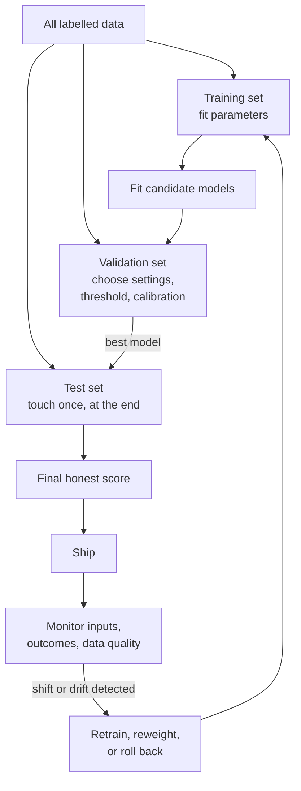

# Classical ML, Generalisation, and Data Quality

> **Interview answer (say this first).** Most AI failures are data and evaluation failures, not model failures. Classical machine learning gives you the rules that still govern every modern system: keep a test set you touch once, fit preprocessing inside cross-validation so nothing leaks, choose a metric that matches the cost of each error when classes are imbalanced, calibrate probabilities before you present them as confidence, and treat labels and data quality as artifacts that drift and must be measured.

## Why this exists

A team builds a fraud detector. The dataset has 10,000 transactions, and 100 of them are fraudulent — 1%. The model is trained, and the held-out accuracy is 99%. The team ships it. It catches no fraud at all.

Here is why the number looked good and the product was useless:

```text
Test set: 10,000 transactions, 100 fraudulent (base rate = 1%).

The model predicts "not fraud" for every single transaction.
accuracy      = 9,900 / 10,000 = 0.99    ← looks excellent
fraud caught  = 0 / 100                  ← the only thing that matters
```

Accuracy counts every example equally, so a model that ignores the rare class still scores 99%. Nothing was wrong with the model's mathematics. The **metric** and the **threshold** were wrong for the problem.

A second, quieter failure is worse because it hides until production. A team adds a feature called `customer_refund_issued` and the offline score jumps from 0.74 to 0.92. In production the score collapses back. The feature is recorded *after* a fraud case is confirmed, so it encodes the answer. That is **leakage**: the model learned from information it will never have at prediction time.

Both failures are classical machine-learning problems, and they reappear in every LLM and agent system. If your retrieval evaluation leaks the answer into the prompt, or your classifier's confidence is really just an uncalibrated score, the same mistakes are back under new names. This page teaches the small set of ideas that prevent them.

## Start from zero

Every word below is used later in the book, so pin them down now.

| Word | Plain meaning |
| --- | --- |
| **Supervised learning** | Learning a mapping from inputs to outputs using examples that have a known correct answer. |
| **Unsupervised learning** | Finding structure in data that has no labels, such as clustering or dimensionality reduction. |
| **Feature** | One input value the model looks at, such as an amount, a word count, or an embedding. |
| **Label** | The correct output for an example. Also called the **target**. |
| **Training set** | The examples used to fit the model's parameters. |
| **Validation set** | Examples used to choose settings, compare models, and pick a threshold. Not used to fit parameters. |
| **Test set** | Examples used once, at the very end, for the final honest score. |
| **Cross-validation** | Splitting the training data into *k* folds; train on *k−1* and validate on the held-out fold, repeated so every fold is held out once. |
| **Overfitting** | Fitting the noise in the training data instead of the real pattern: excellent on train, worse on new data. |
| **Underfitting** | The model is too simple or undertrained: poor on both training and new data. |
| **Bias–variance trade-off** | **Bias** is error from wrong assumptions (underfitting); **variance** is error from sensitivity to the particular training sample (overfitting). Reducing one usually increases the other, so you balance them. |
| **Regularisation** | Any penalty or constraint that discourages a complex fit. |
| **L1 regularisation** | Adds the sum of absolute weights to the loss; can push weights to exactly zero, so it also selects features. |
| **L2 regularisation** | Adds the sum of squared weights; shrinks weights smoothly towards zero. |
| **Dropout** | Randomly disabling units during training so the network cannot rely on any single one. |
| **Generalisation** | Performance on new data drawn from the same distribution as the training data. |
| **Data leakage** | Information available during training that will not be available at prediction time, or that has already seen the test data. |
| **Target leakage** | A feature that directly encodes the label, such as `case_closed` when predicting default. |
| **Class imbalance** | One class is far rarer than another, so a naive model can ignore it and still score well. |
| **Precision** | Of the examples predicted positive, the share that are actually positive: `TP / (TP + FP)`. |
| **Recall** | Of the real positives, the share the model found: `TP / (TP + FN)`. Also called **sensitivity**. |
| **F1** | The harmonic mean of precision and recall: one number that balances both. |
| **ROC-AUC** | The probability that a random positive scores above a random negative. Threshold-free, but can look flattering under heavy imbalance. |
| **PR-AUC** | The area under the precision–recall curve. More informative than ROC-AUC when positives are rare. |
| **Calibration** | Whether a predicted probability matches the observed frequency: among cases scored 0.8, about 80% should be positive. |
| **Brier score** | The mean squared difference between predicted probabilities and the 0/1 outcomes. Lower is better. |
| **Annotation agreement** | How consistently two or more labellers assign the same label. |
| **Cohen's kappa** | Agreement between two labellers after correcting for agreement that would happen by chance. 0 is chance, 1 is perfect. |
| **Dataset shift** | The distribution of production data differs from the training data. |
| **Covariate shift** | The input distribution `P(X)` changes while the relationship `P(y \| X)` stays the same. |
| **Concept drift** | The relationship `P(y \| X)` itself changes, so the same input now needs a different answer. |

Two pairs are easy to confuse. **Train/validation/test** are three different jobs: fit, choose, and certify. **Bias/variance** are two different errors: being systematically wrong and being unstable.

## The core idea

Think of a student sitting an exam.

- **Training** is homework, where the answers are visible. Getting every homework question right proves nothing if the student memorised the answer key.
- **Validation** is a practice exam, used to find weak spots and choose an approach.
- **The test set** is the real exam. The moment the teacher reads it out in class, it stops being a test.

The same rule applies to a model: **the test set loses its value the moment you use it to make a decision.** Every peek is information that leaks into your choices, so the final number is no longer an unbiased estimate. Touch it once.

Now the second half of the idea. A model can fail in two directions:

- **High bias (underfitting).** The model is too rigid. It misses the pattern in training and in production.
- **High variance (overfitting).** The model is too flexible. It fits the noise in training and fails in production.

More capacity and fewer constraints move you towards high variance. More regularisation and less capacity move you towards high bias. The art is finding the middle, and the validation set is how you find it.



The bias–variance diagnosis is always read from two numbers:

| Regime | Training error | Validation error | What it looks like | Usual fix |
| --- | --- | --- | --- | --- |
| **Underfitting (high bias)** | High | High | The model cannot even fit the data it saw | More features, a larger model, less regularisation, longer training |
| **Good fit** | Low | Low, close to training | It generalises | Ship it, with monitoring |
| **Overfitting (high variance)** | Very low | Much higher | It memorised, including the noise | More data, regularisation, early stopping, a simpler model |

When accuracy is the wrong question, reach for a different metric:

| Situation | Why accuracy misleads | Use instead |
| --- | --- | --- |
| Rare positive class (1% fraud) | Predicting all-negative scores 99% | PR-AUC, recall at a fixed precision, F1 |
| Missing a positive is costly (screening) | Accuracy hides low recall | Recall, PR-AUC, F-beta with beta > 1 |
| A false alarm is costly (spam filter) | Accuracy hides low precision | Precision, F-beta with beta < 1 |
| You must choose a decision point | Accuracy collapses the trade-off to one number | Precision–recall curve plus the cost of each error |
| You show a confidence to a user | Accuracy says nothing about the probability itself | Calibration curve, Brier score |
| You publish a ranking | Accuracy needs a threshold | ROC-AUC and PR-AUC |
| Classes are balanced and errors cost the same | Accuracy is honest here | Accuracy or F1 |

Accuracy is not a bad metric. It is a **context-free** metric, and most real problems have context.

## How it works

1. **Split the data correctly, and split it first.** Hold out the test set before you look at anything else. Split the rest into training and validation. Use `stratify=y` so every split keeps the class ratio. For time-ordered data, split by time, never randomly: a random split lets the model train on the future. For grouped data (several rows per patient or user), split by group so one group never spans train and test.
2. **Why the test set is sacred.** Every choice you make after seeing test results — a feature, a hyperparameter, a threshold — is information leakage. The test set is the only unbiased estimate you will ever get, and it works exactly once. If you need to compare models repeatedly, use the validation set or cross-validation.
3. **Fit on training, measure generalisation on validation.** Always compare against a trivial baseline such as `DummyClassifier`. If a model cannot beat "predict the majority class", it has learned nothing useful. Report the mean **and** the variance across folds; a single number hides how unstable the result is.
4. **Regularise what overfits.** Add L1 or L2 weight penalties, use dropout, stop training early, or limit model capacity (tree depth, number of leaves). Choose the strength on validation, not on test. More clean data is the best regulariser of all.
5. **Handle class imbalance on three fronts.** **Resampling** changes the training data: oversample the minority, undersample the majority, or synthesise minority points (SMOTE, Synthetic Minority Oversampling Technique). **Class weights** tell the loss function that a minority mistake costs more. **Threshold choice** decides when a score becomes a positive prediction. Resampling and weights change what the model learns; the threshold changes how you use it. The default 0.5 threshold is arbitrary and almost never right.
6. **Choose the threshold from costs, not from 0.5.** Build the precision–recall curve on validation, then pick the point that minimises expected cost: `cost = FP × cost(FP) + FN × cost(FN)`. A missed fraud at £5,000 and a blocked payment at £5 produce a completely different threshold from the one accuracy would choose.
7. **Calibrate before showing confidence.** A high score is not automatically a probability. Check the calibration curve: group predictions into bins and compare the average predicted probability with the actual positive rate. Fix it with Platt scaling (a sigmoid fit) or isotonic regression, fitted on held-out data or via internal cross-validation. Calibration does not change ranking, so ROC-AUC stays the same while the Brier score improves.
8. **Measure label quality and agreement.** Double-label a sample and compute Cohen's kappa. Low agreement means the rubric is ambiguous. Fix the definition, add concrete examples, and adjudicate disagreements before training. Labels are measurements with error, and that error is a ceiling on the model.
9. **Detect and handle shift.** Monitor the input distribution and the outcome rate in production, and score a labelled live sample against the frozen model. Covariate shift may be fixable by reweighting or retraining on recent data; concept drift needs new labels and a new model. If you cannot detect it, assume it is happening.
10. **Record everything, then touch the test set once.** Log the seed, the data version, the code version, and the metric definition. Reproduce the number. Only then report it.

## The syntax you will use

These are the real `scikit-learn` forms. Keep them in one place and reuse them.

**A stratified split, with a held-out test set.**

```python
from sklearn.model_selection import train_test_split

X_train, X_test, y_train, y_test = train_test_split(
    X, y, test_size=0.2, stratify=y, random_state=0
)
```

`test_size=0.2` holds back 20%. `stratify=y` keeps the class ratio in both halves. `random_state=0` makes the split reproducible, so a teammate gets the same rows.

**Stratified k-fold cross-validation, with the spread reported.**

```python
from sklearn.model_selection import StratifiedKFold, cross_val_score

cv = StratifiedKFold(n_splits=5, shuffle=True, random_state=0)
scores = cross_val_score(model, X, y, cv=cv, scoring="roc_auc")
print(scores.mean(), scores.std())
```

Five folds give five scores. Always report the standard deviation as well as the mean; `0.90 ± 0.01` and `0.90 ± 0.15` are very different claims. Use `StratifiedKFold` so each fold keeps the class ratio.

**A Pipeline, which is how you avoid leakage in preprocessing.**

```python
from sklearn.pipeline import Pipeline
from sklearn.preprocessing import StandardScaler
from sklearn.linear_model import LogisticRegression

model = Pipeline([
    ("scaler", StandardScaler()),
    ("clf", LogisticRegression(max_iter=1000)),
])
```

Inside cross-validation, the pipeline fits the scaler on each training fold and applies it to the matching validation fold. If you scale the whole matrix first, the scaler learns the mean and spread of the validation rows, and that information leaks into training.

**Per-class metrics, not just one number.**

```python
from sklearn.metrics import classification_report

print(classification_report(y_test, y_pred, digits=3, zero_division=0))
```

The report gives precision, recall, F1, and support (the number of examples) for every class, plus macro and weighted averages. `zero_division=0` stops a warning when a class is never predicted.

**Threshold-free ranking metrics.**

```python
from sklearn.metrics import roc_auc_score, average_precision_score

y_score = model.predict_proba(X_test)[:, 1]   # probability of the positive class
print(roc_auc_score(y_test, y_score))         # ranking quality
print(average_precision_score(y_test, y_score))  # PR-AUC, better for rare positives
```

Use `predict_proba`, not `predict`, for these: the scores contain the ranking information that a hard 0/1 prediction throws away. For a rare positive class, quote PR-AUC and the base rate together.

**Calibration, checked as a curve.**

```python
from sklearn.calibration import calibration_curve

frac_pos, mean_pred = calibration_curve(y_test, y_score, n_bins=10)
```

Each pair is one bin: `mean_pred` is the average predicted probability, `frac_pos` is the actual positive rate. Points on the diagonal mean the model is calibrated. `brier_score_loss(y_test, y_score)` turns the whole curve into one number where lower is better.

**Labeller agreement.**

```python
from sklearn.metrics import cohen_kappa_score

kappa = cohen_kappa_score(labeller_a, labeller_b)
```

`0` means chance-level agreement and `1` means perfect. Many teams treat anything below about `0.6` as a sign that the labelling rubric needs rewriting.

## Examples: simple to real

**Example 1 — 99% accuracy, zero fraud caught.** We build a rare-event dataset with a 1% positive rate and train a plain logistic regression.

```python
from sklearn.datasets import make_classification
from sklearn.linear_model import LogisticRegression
from sklearn.model_selection import train_test_split
from sklearn.metrics import (accuracy_score, classification_report,
                             roc_auc_score, average_precision_score)

X, y = make_classification(
    n_samples=10_000, n_features=20, n_informative=5,
    weights=[0.99, 0.01], flip_y=0.0, random_state=0,
)
X_train, X_test, y_train, y_test = train_test_split(
    X, y, test_size=0.3, stratify=y, random_state=0,
)

clf = LogisticRegression(max_iter=1000).fit(X_train, y_train)
y_pred = clf.predict(X_test)
y_score = clf.predict_proba(X_test)[:, 1]

print("accuracy:", round(accuracy_score(y_test, y_pred), 3))
print(classification_report(y_test, y_pred, digits=3, zero_division=0))
print("roc_auc:", round(roc_auc_score(y_test, y_score), 3))
print("pr_auc:", round(average_precision_score(y_test, y_score), 3))
print("base rate:", round(float(y_test.mean()), 4))
```

Measured output:

```text
accuracy: 0.989
              precision    recall  f1-score   support
           0      0.990     0.999     0.995      2970
           1      0.000     0.000     0.000        30
   macro avg      0.495     0.500     0.497      3000
roc_auc: 0.897
pr_auc: 0.079
base rate: 0.01
```

Accuracy is 98.9%, and precision and recall for the fraud class are both **zero**. The model predicts "not fraud" every time. Notice that ROC-AUC is 0.897 and looks respectable, while PR-AUC is 0.079 against a base rate of 0.01. ROC-AUC does not depend on the base rate, so it stays optimistic even when almost every positive prediction is wrong; PR-AUC falls with the base rate, so it tells the truth. That gap is exactly why PR-AUC is the honest metric here. The fix is not a better model. It is `class_weight="balanced"`, a cost-based threshold, and a metric that actually sees the rare class.

**Example 2 — leakage from preprocessing before the split.** A common mistake is to clean or scale the whole dataset, then cross-validate. Every fold now contains information from the rows it is supposed to be predicting.

```python
from sklearn.datasets import make_classification
from sklearn.linear_model import LogisticRegression
from sklearn.model_selection import cross_val_score
from sklearn.pipeline import Pipeline
from sklearn.preprocessing import StandardScaler
from sklearn.feature_selection import SelectKBest, f_classif

X2, y2 = make_classification(
    n_samples=300, n_features=200, n_informative=8,
    n_redundant=0, flip_y=0.05, random_state=0,
)

# Wrong: the scaler sees every row, including the held-out fold.
scaler = StandardScaler().fit(X2)
wrong = cross_val_score(
    LogisticRegression(max_iter=1000), scaler.transform(X2), y2,
    cv=5, scoring="roc_auc",
).mean()

# Right: the scaler is refit inside each fold.
pipe = Pipeline([
    ("scaler", StandardScaler()),
    ("clf", LogisticRegression(max_iter=1000)),
])
right = cross_val_score(pipe, X2, y2, cv=5, scoring="roc_auc").mean()
```

Measured on `X2` (300 rows, 200 features):

```text
scale before split:  roc_auc 0.743
pipeline:            roc_auc 0.745
```

For scaling alone the leak is tiny, which is exactly why it is dangerous: it is easy to ignore. The same structural mistake with a *selection* step is not tiny, because selection uses the labels:

```text
select features before split:  roc_auc 0.887   ← inflated
pipeline with selection:       roc_auc 0.853   ← honest
```

Selection looks at the label to pick the best 10 of 200 features. Done before the split, it has already seen the held-out labels and smuggled them into the feature set. The number is 0.034 too high, and it would collapse in production. The lesson is not "scaling leaks a lot". The lesson is **every fitted step belongs inside the Pipeline**, because the leak is structural and only sometimes large.

**Example 3 — accurate but overconfident.** An unpruned decision tree splits until every leaf is pure, so it predicts 0 or 1 with total confidence. Here it is 80% accurate, which sounds reasonable.

```python
from sklearn.datasets import make_classification
from sklearn.model_selection import train_test_split
from sklearn.tree import DecisionTreeClassifier
from sklearn.calibration import CalibratedClassifierCV, calibration_curve
from sklearn.metrics import accuracy_score, brier_score_loss

X3, y3 = make_classification(
    n_samples=4000, n_features=20, n_informative=8,
    weights=[0.6, 0.4], flip_y=0.10, random_state=0,
)
X3_train, X3_test, y3_train, y3_test = train_test_split(
    X3, y3, test_size=0.3, stratify=y3, random_state=0,
)

tree = DecisionTreeClassifier(random_state=0).fit(X3_train, y3_train)
p = tree.predict_proba(X3_test)[:, 1]

print("accuracy:", round(accuracy_score(y3_test, tree.predict(X3_test)), 3))
print("brier:", round(brier_score_loss(y3_test, p), 4))

frac_pos, mean_pred = calibration_curve(y3_test, p, n_bins=10)
print("predicted:", mean_pred, "actual:", frac_pos)

cal = CalibratedClassifierCV(tree, method="sigmoid", cv=5).fit(X3_train, y3_train)
p_cal = cal.predict_proba(X3_test)[:, 1]
print("calibrated brier:", round(brier_score_loss(y3_test, p_cal), 4))

from sklearn.metrics import accuracy_score, roc_auc_score, average_precision_score
print("calibrated accuracy:", round(accuracy_score(y3_test, cal.predict(X3_test)), 3))
print("roc before/after:", round(roc_auc_score(y3_test, p), 3), round(roc_auc_score(y3_test, p_cal), 3))
print("pr  before/after:", round(average_precision_score(y3_test, p), 3), round(average_precision_score(y3_test, p_cal), 3))
```

Measured output (the actual positive rate is 0.415):

```text
accuracy: 0.804    brier: 0.1958
predicted: [0.0, 1.0]   actual: [0.164, 0.760]
calibrated brier: 0.1299
calibrated accuracy: 0.856
roc before/after: 0.799 0.895
pr  before/after: 0.681 0.855
```

Every prediction was made with full confidence, but the group given a score of 0.0 was positive only 16% of the time, and the group scored 1.0 only 76% of the time. The model's "100%" means "76%". `CalibratedClassifierCV` with a sigmoid fit drops the Brier score from 0.196 to 0.130, so the same model now reports probabilities you can act on. Accuracy also rises, from 0.804 to 0.856, so calibration is not cosmetic.

Note what `CalibratedClassifierCV` actually does by default: it refits several clones of the base estimator (`ensemble=True`) and averages their calibrated probabilities, so it changes the decision surface — here ROC-AUC rises from 0.799 to 0.895 and average precision from 0.681 to 0.855. Only a **monotone recalibration of one fixed model's scores** (for example `ensemble=False`, or fitting Platt/isotonic on that model's own scores) provably preserves the ranking and leaves ROC-AUC unchanged; it reshapes the probability scale, which is what threshold-based decisions and displayed confidences depend on.

**Example 4 — two labellers who cannot agree.** You are building a toxicity classifier and ask two people to label ten comments.

```python
from sklearn.metrics import cohen_kappa_score

labeller_a = ["toxic", "toxic", "clean", "clean", "toxic",
              "clean", "clean", "toxic", "clean", "clean"]
labeller_b = ["toxic", "clean", "clean", "clean", "toxic",
              "clean", "toxic", "clean", "clean", "clean"]

print(round(cohen_kappa_score(labeller_a, labeller_b), 3))  # 0.348
```

Raw agreement is 70%, which sounds fine. Kappa is **0.35**, because the expected agreement by chance is 54%. The two labellers disagree on the second, seventh, and eighth comments, and the pattern is obvious once you look. Where A says "toxic" but B says "clean" (comments 2 and 8), A is counting mild hostility. Where B says "toxic" but A says "clean" (comment 7), B is counting a direct threat. The labels are not noisy measurements of one concept; they are measurements of two different concepts.

The correct response is not to tell the labellers to concentrate. It is to fix the rubric: write a definition with positive and negative examples, decide explicitly whether sarcasm and profanity count, have a third person adjudicate the disputed cases, and re-measure kappa. If two trained humans settled at 0.35, no model can learn a stable target, and any high accuracy it reports is partly luck about which definition it happened to fit. Fix the target before you improve the model.

## In production

- **The test set must be touched once.** Every decision you make after seeing it turns it into a second validation set and inflates your final number. If you need repeated comparison, use cross-validation.
- **Preprocessing must be fit on train only.** Scaling, imputation, encoding, feature selection, and target encoding all learn from data. Put each one inside a `Pipeline` so cross-validation refits it per fold. Leakage is usually in the data pipeline, not in the model.
- **Class imbalance makes accuracy a vanity metric.** At a 1% positive rate, a useless model scores 99%. Report PR-AUC, precision, recall, and the base rate together, never accuracy alone.
- **Choose the threshold from costs, not 0.5.** The model produces a score; the threshold is a business decision. Compute the expected cost of false positives and false negatives on validation and pick the cheapest point on the precision–recall curve.
- **Calibration matters whenever you show confidence.** "82% likely" must mean roughly 82%. Tree ensembles and neural networks are often overconfident, and class weighting skews probabilities further. Check the curve, and recalibrate on held-out data.
- **Labels drift.** Spam, fraud, and language change. A label that was correct last year may be wrong now, so a frozen model decays even when the code does not change. Re-audit a sample of labels on a schedule.
- **Low kappa means the rubric is ambiguous, not that labellers are lazy.** Rewrite the guideline, add positive and negative examples, adjudicate disagreements, then re-measure. The ceiling on your model is the ceiling on your labels.
- **Shift breaks silently.** A shifted model still returns confident answers; it just returns more wrong ones. Watch the input distribution and the outcome rate, and score a labelled live sample against the frozen model.
- **Monitoring data quality catches what tests cannot.** Track null rates, ranges, category frequencies, duplicate IDs, and pipeline failures. A broken upstream join can change the meaning of a feature without changing its column name.
- **Report variance, not a single number.** A metric from one split is an estimate. Give the mean and standard deviation across folds, and a confidence interval where you can.
- **Never split time-ordered or grouped data at random.** Random time splits train on the future; random grouped splits put the same user on both sides. Use forward-chaining splits for time and group-aware splits for repeated entities.
- **A baseline makes a result meaningful.** Compare against the majority class, the previous model, and a simple rule. A number on its own is not a result.

## Interview questions

### 1. What is generalisation, and how do you measure it honestly?

**Answer.** Generalisation is performance on new data drawn from the same distribution as the training data. You measure it on data the model never saw: the validation set for choosing settings and the test set, once, for the final number. Compare against a trivial baseline and report the variance across folds so a lucky split cannot fool you.

**Follow-up: "Why not just report training accuracy?"** Training accuracy measures memory, not generalisation. A flexible enough model can fit the training set perfectly and still fail on every new example. The gap between training and validation is the signal.

**Trap.** Calling a high validation score production performance. The validation set is still data you made decisions on, so it is optimistically biased. Only the untouched test set is honest.

### 2. What is data leakage, and where does it usually hide?

**Answer.** Leakage is any information available at training time that will not be available at prediction time, including preprocessing that has already seen the test rows. The two common cases are a feature that encodes the label (such as `case_closed` when predicting default) and a scalar or selector fitted on the full dataset before splitting. It shows up as a score that is too good and then collapses in production.

**Follow-up: "How do you find it?"** Ablate suspicious features and re-measure, confirm every fitted step sits inside the cross-validation pipeline, and treat any score that jumps unexpectedly as a bug until proven otherwise.

**Trap.** Blaming the model. Leakage is almost always in the data collection or the pipeline, not the algorithm. A more complex model will happily exploit a leaked feature harder.

### 3. Why is accuracy a poor metric on an imbalanced dataset?

**Answer.** Accuracy weights every example equally, so with 1% positives a model that predicts the majority class scores 99% while catching nothing. The rare class that matters contributes almost nothing. Use precision, recall, F1, or PR-AUC, and always quote them next to the base rate so the reader can judge.

**Follow-up: "Would balanced accuracy help?"** Yes, balanced accuracy averages recall across classes and stops the majority class dominating. But if you only care about the positive class, precision and recall are more direct.

**Trap.** Fixing imbalance once and leaving accuracy in the report. Sampling, class weights, the metric, and the threshold all need to match the cost of each type of error.

### 4. When would you prefer precision, recall, or F1?

**Answer.** Precision is the share of predicted positives that are right; recall is the share of real positives found; F1 is their harmonic mean. Prefer recall when missing a positive is costly, such as cancer screening or fraud. Prefer precision when a false alarm is costly, such as blocking a legitimate payment. Use F1 when you want a single balanced number, and the threshold sets where on the curve you sit.

**Follow-up: "What is F-beta?"** A generalisation of F1 that weights recall more heavily as beta grows. Beta above 1 favours recall, beta below 1 favours precision, and beta equal to 1 is F1.

**Trap.** Tuning for F1 when the real cost is asymmetric. F1 assumes precision and recall matter equally, which is rarely true in business.

### 5. What is calibration, and why does it matter more than accuracy?

**Answer.** A model is calibrated when its predicted probability matches the observed frequency: among cases scored 0.8, roughly 80% should be positive. Accuracy says nothing about this. If you show a user or a downstream system a confidence, miscalibration causes bad decisions. Measure with a calibration curve and the Brier score, and fix with Platt scaling or isotonic regression.

**Follow-up: "Does calibration change the ranking?"** Only if it refits the model. A monotone recalibration of one fixed model's scores (Platt scaling or isotonic regression, `ensemble=False`) leaves the ranking and ROC-AUC unchanged and only reshapes the probabilities. But `CalibratedClassifierCV` defaults to `ensemble=True`, which refits and averages several clones and *can* change the ranking and ROC-AUC. Either way the Brier score and any threshold-based decision improve.

**Trap.** Assuming a tree ensemble or a neural network is calibrated out of the box. Many are overconfident, and class weighting or resampling skews the probabilities further.

### 6. What is cross-validation, and why put preprocessing in a Pipeline?

**Answer.** Cross-validation splits the training data into k folds, trains on k−1 and validates on the held-out fold, and averages the k scores so the estimate uses every row. A Pipeline couples each preprocessing step with the model, so the step is refitted on every training fold. Fitting a scaler or selector on the whole dataset first leaks validation information into training and inflates the score.

**Follow-up: "When is plain k-fold wrong?"** For time series, where a random split trains on the future — use forward-chaining splits. For grouped data, where several rows belong to one patient or user — keep each group in a single fold.

**Trap.** Believing cross-validation removes the need for a test set. It tunes your choices on the same data repeatedly, so it is still biased. You need a final untouched test set.

### 7. What is Cohen's kappa, and what does low agreement mean?

**Answer.** Kappa measures agreement between two labellers after subtracting the agreement expected by chance. Zero is chance, one is perfect. The common Landis–Koch bands call 0.41–0.60 moderate, 0.61–0.80 substantial, and above 0.80 almost perfect, but the right cut-off is task-dependent: for a safety label, 0.6 is too low. Low kappa usually means the labelling rubric is ambiguous, not that the labellers are careless.

**Follow-up: "What do you do about it?"** Rewrite the guideline with concrete positive and negative examples, add an adjudication step for disagreements, and re-measure. If trained humans cannot agree, the model cannot learn a stable target.

**Trap.** Treating labels as ground truth. They are measurements with error, and that error is a ceiling on what any model can achieve.

### 8. What is dataset shift, and how do you detect it?

**Answer.** Shift is any difference between production data and training data. Covariate shift is a change in the input distribution `P(X)` while the relationship `P(y | X)` is stable. Concept drift is a change in `P(y | X)`, so the same input now needs a different answer. Both break a model silently because it keeps producing confident output. Detect by monitoring input distributions and outcome rates, and by scoring a labelled live sample against the frozen model.

**Follow-up: "What do you do after detection?"** Retrain on newer data, reweight or drop unstable features, adjust the threshold, or fall back to a rule or an earlier version, and alert on the drifting signal so the next occurrence is caught sooner.

**Trap.** Waiting for an offline metric to drop. Without production monitoring and a labelled sample, shift is invisible until users complain.

## Remember this

- **Generalisation is measured on data the model never saw.** Use validation to choose and the test set once; a high training score measures memory.
- **Fit every preprocessing step on training folds only.** Use a `Pipeline`. Leakage is usually in the data pipeline, not the model, and it is easier to spot in a score than in the code.
- **Accuracy lies on imbalanced data.** Report PR-AUC, precision, recall, and the base rate, and set the threshold from the cost of each error rather than from 0.5.
- **Calibration is separate from accuracy.** Check the calibration curve and the Brier score before you show a probability as confidence; recalibrate on held-out data.
- **Labels and data drift.** Low kappa means the rubric is ambiguous, and shift breaks models silently, so monitor inputs, outcomes, and data quality in production.
