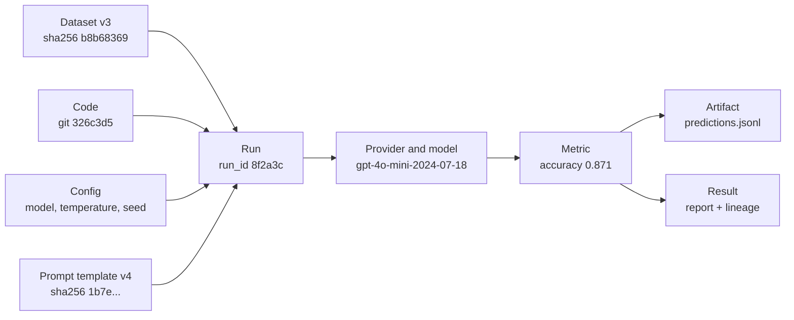

# Experiment Tracking and Reproducibility

> **Interview answer (say this first).** An AI experiment is reproducible when the record of it — code commit, environment, dataset version, configuration, seed, provider and model version, prompt template, metrics, and artifacts — is enough for a different person to re-run it and get the same result, or the same result within a stated tolerance. Experiment tracking means logging that record automatically on every run, not writing it in a notebook afterwards. The core rule is: if it is not recorded, it did not happen.

## Why this exists

A team improves a retrieval-augmented generation (RAG) pipeline from 71% to 84% accuracy with a better prompt. Everyone is excited. The next week, a colleague tries the same prompt and gets 72%. Nobody can explain the difference.

When they dig in, the cause is mundane. Four things changed and none were recorded:

- The evaluation dataset was edited in place: twelve low-quality examples were replaced. There is no dataset version.
- The prompt was tested at `temperature=0.7`, not `0.0`. Higher temperature makes sampling random.
- No seed was set, so each provider call could draw different tokens.
- The provider alias `gpt-4o-mini` now points at a newer snapshot than the one used in the original test.

The result was real, but the evidence was gone. This is the most common failure in applied AI: a number nobody can defend, because the conditions that produced it were never written down.

The problem is sharper for AI than for ordinary code. A REST service is deterministic: same input, same output. An LLM pipeline has randomness in sampling, floating-point arithmetic that depends on GPU kernels and batch size, a remote model that the provider can update without telling you, and a dataset that someone edits under your feet. Reproducibility is not a nice-to-have; it is the only way to know whether a change actually helped.

## Start from zero

| Word | Plain meaning |
| --- | --- |
| **Experiment** | A controlled comparison that answers one question, such as "does prompt v4 beat prompt v3 on the same data?". |
| **Run** | One execution of an experiment with one configuration. A single experiment usually has many runs. |
| **Configuration** | Every input that you control: model, prompt, temperature, retrieval settings, and so on. |
| **Hyperparameter** | A configuration value set before a run rather than learned from data, such as temperature, top-p, or the number of retrieved documents. |
| **Seed** | The starting number for a pseudorandom generator. The same seed reproduces the same sequence of random numbers. |
| **Determinism** | The property that the same inputs always produce the same output. |
| **Reproducibility** | The same team, data, code, and environment produces the same result again. |
| **Replicability** | A different team, with an independent implementation or different data, reaches the same conclusion. |
| **Artifact** | A file a run produces or consumes: predictions, an index, a report, model weights. |
| **Lineage (provenance)** | The record of where every input came from and how every output was produced. |
| **Metadata** | Data about the run: who ran it, when, on which commit, with which configuration. |
| **Model registry** | A catalogue of trained models with versions and stages (staging, production), so you can fetch the exact model behind a metric. |
| **Dataset versioning** | Giving a dataset a fixed identity (a version plus a content hash) so it cannot change unseen. |
| **Environment lockfile** | A file that pins exact dependency versions and hashes, such as `uv.lock` or a hashed `requirements.txt`. |
| **Git SHA** | The unique hash of one commit, such as `326c3d5`, identifying the exact code that ran. |
| **Model card** | A short document describing a model: training, intended use, limits, licence. |
| **Data card** | A short document describing a dataset: origin, collection method, composition, licence, known biases. |
| **Immutable artifact** | An artifact addressed by content hash (digest), never overwritten in place. |

**Reproducibility and replicability are not the same.** The words are used loosely in industry, but the useful distinction is:

| Term | Who | What changes | What must match |
| --- | --- | --- | --- |
| **Reproducibility** | Same team | Nothing | The exact result, from the same data and code. |
| **Replicability** | A different team | The implementation and sometimes the data | The scientific conclusion, not the exact number. |

Reproducibility is an engineering property you can guarantee with a good record. (Some fields call the same-team case **repeatability**; the useful axis is same-team versus independent, not the label.) Replicability is a scientific property: a result that only appears in your lab, with your exact setup, is not yet a finding.

## The core idea

Think of an experiment as a **recipe with a shopping receipt**. The finished dish is the metric. The recipe is the configuration. The receipt lists the exact ingredients — which dataset version, which code commit, which model snapshot. If someone else can buy the same ingredients and follow the same recipe, they get the same dish.

The receipt is the part teams skip. The mental model that fixes this is the **lineage graph**: every result is the endpoint of a chain of inputs. If you can draw the chain, you can reproduce the result.



The arrows point from cause to effect. To reproduce the result, you re-supply the left side of the graph and re-run the middle. If any node on the left is unknown, the result is not reproducible — full stop.

This leads to the practical rule. For every experiment, record the following:

| Item | Example | Why it is needed |
| --- | --- | --- |
| **Git SHA** | `326c3d5`; note if the tree was dirty | Identifies the exact code, including the evaluation code. |
| **Environment** | `uv.lock` hash, Python 3.12.4, CUDA 12.4 | Library versions change numerics and APIs. |
| **Dataset + version** | `eval-set` v3, `sha256:b8b68369...` | The data is half the experiment; it must be frozen. |
| **Config** | `temperature=0.0`, `top_k=5`, `max_tokens=512` | Defines what was actually tested. |
| **Seed** | `seed=42` | Reproduces sampling and shuffling. |
| **Provider + model version** | `openai/gpt-4o-mini-2024-07-18` | An alias can silently move to a new snapshot. |
| **Prompt template** | `answer-v4`, `sha256:1b7e...` | Prompt text changes behaviour more than any hyperparameter. |
| **Metrics** | `accuracy=0.871`, `p95_latency_ms=820` | The result, plus the uncertainty around it. |
| **Artifacts** | `predictions.jsonl`, `report.html` | Lets a reviewer re-score without re-running. |

> **Tip:**
>
> **The one-line test.** If you cannot hand a colleague a single link and say "this re-runs this exact result", the experiment is not tracked. Build towards that link.

## How it works

1. **Pin the environment.** Install from a lockfile, not loose version ranges. Record the lockfile hash and the Python version. If you use a GPU, record the driver and CUDA version. "Python 3.12 and whatever pip resolved today" is not an environment.
2. **Version the code.** Read the git SHA at the start of the run and store it. Record whether the working tree was dirty, because uncommitted changes are not in any SHA. The evaluation code belongs in the same repository as the model code.
3. **Version the data.** Give the dataset a human version (`v3`) and a content hash. A hash is the real identity: if two files have the same hash, they are the same bytes. Store the dataset immutably, or fetch it by version, so a later edit cannot change past runs.
4. **Capture configuration as code.** Define the run's inputs as a typed object, validate it, and serialise it into the run. Configuration in a notebook cell or a shell history is invisible to review and to git.
5. **Fix seeds — and know where determinism breaks.** Seed Python, NumPy, and any deep-learning framework at the start of every process. Then accept that some randomness no longer depends on your seed: GPU kernels, parallel reductions, and provider batching all change results. Record what you cannot control and measure the variation rather than pretending it is zero.
6. **Log metrics and artifacts.** Emit metrics as numbers and artifacts as files, both attached to the run. Include the cost and latency you saw, not only the quality score.
7. **Store the result and its lineage.** Write one record that links run ID, code, data, config, model version, metrics, and artifacts. This is what a tracking tool such as MLflow or Weights & Biases does for you; a JSON file next to the run does it too.
8. **Reproduce by re-running from the record.** A reproduction script reads the record, rebuilds the exact inputs, re-runs, and compares against the stored metric within a tolerance. If it cannot, the record is incomplete.

## The syntax you will use

**1. Set seeds at the top of every entry point.** A seed makes a pseudorandom sequence repeatable.

```python
import random

import numpy as np
import torch

random.seed(42)                          # Python's global generator
rng = np.random.default_rng(42)          # a local NumPy Generator, preferred over the global seed
torch.manual_seed(42)                    # CPU and all CUDA devices
```

`np.random.seed(42)` still works but seeds a hidden global. A local `default_rng(42)` is easier to reason about and pass around.

**2. Tighten determinism where the framework allows it.**

```python
import torch

torch.use_deterministic_algorithms(True)   # non-deterministic ops raise instead of drifting
torch.backends.cudnn.deterministic = True
torch.backends.cudnn.benchmark = False
```

`use_deterministic_algorithms(True)` makes an operation raise an error if it has no deterministic implementation, so you find the problem instead of shipping a flaky metric. It can slow training, so many teams use it in tests and evaluation, not in the training loop.

**3. Log a run with MLflow.** The context manager attaches everything to one run ID.

```python
import mlflow

mlflow.set_experiment("rag-answer-quality")

with mlflow.start_run(run_name="baseline") as run:
    mlflow.log_params({"model": "gpt-4o-mini", "temperature": 0.0, "seed": 42})
    mlflow.log_param("dataset_version", "v3")
    mlflow.log_metrics({"accuracy": 0.871, "p95_latency_ms": 820})
    mlflow.log_artifact("predictions.jsonl")
    mlflow.set_tag("git_sha", "326c3d5")
    print(run.info.run_id)          # e.g. 8f2a3c...
```

**4. The same idea with Weights & Biases.** The configuration dict is logged with the run automatically.

```python
import wandb

run = wandb.init(project="rag-answer-quality", config={"temperature": 0.0, "seed": 42})
wandb.log({"accuracy": 0.871})
run.log_artifact("predictions.jsonl")
run.finish()
```

**5. Hash a dataset.** A content hash is the dataset's real version.

```python
import hashlib
import json

def hash_records(records: list[dict]) -> str:
    canonical = "\n".join(
        json.dumps(r, sort_keys=True, separators=(",", ":"))
        for r in sorted(records, key=lambda r: r["id"])
    )
    return hashlib.sha256(canonical.encode("utf-8")).hexdigest()
```

Sorting the keys and the rows, and serialising with compact separators (so insignificant whitespace *between* tokens is dropped while whitespace *inside* string values is preserved), means the same logical dataset always hashes to the same value, even if it was written in a different order.

**6. Capture the git SHA with `subprocess`.**

```python
import subprocess

def git_sha() -> str:
    result = subprocess.run(
        ["git", "rev-parse", "HEAD"],
        capture_output=True,      # capture stdout and stderr instead of printing
        text=True,                # decode bytes to str
        check=True,               # raise CalledProcessError if git fails
    )
    return result.stdout.strip()
```

`check=True` matters: without it a failed `git` call returns an empty string and you silently log a blank SHA.

**7. A typed configuration that is serialised with the run.** Pydantic validates types and ranges before the expensive call.

```python
from pydantic import BaseModel, Field

class ExperimentConfig(BaseModel):
    model: str
    temperature: float = Field(ge=0.0, le=2.0)
    seed: int
    dataset_version: str
    prompt_template_id: str
    max_tokens: int = Field(gt=0, default=512)

config = ExperimentConfig(
    model="gpt-4o-mini",
    temperature=0.0,
    seed=42,
    dataset_version="v3",
    prompt_template_id="answer-v4",
)
payload = config.model_dump_json()                 # a JSON string, ready to store
assert ExperimentConfig.model_validate_json(payload) == config
```

Because the config is a type, an invalid value fails at construction, before you spend money or time on the run.

## Examples: simple to real

**Example 1 — a run record that captures everything needed to reproduce.** This is the minimum honest record. A tracking tool stores it for you, but the fields are the same.

```python
from dataclasses import asdict, dataclass

@dataclass(frozen=True)
class RunRecord:
    run_id: str
    git_sha: str
    environment_lockfile_hash: str
    dataset_version: str
    dataset_hash: str
    config: dict
    provider_model: str
    prompt_template_id: str
    metrics: dict
    artifacts: list[str]

record = RunRecord(
    run_id="8f2a3c",
    git_sha="326c3d5",
    environment_lockfile_hash="sha256:ab12...",
    dataset_version="v3",
    dataset_hash="sha256:b8b68369...",
    config={"temperature": 0.0, "seed": 42, "top_k": 5},
    provider_model="openai/gpt-4o-mini-2024-07-18",
    prompt_template_id="answer-v4",
    metrics={"accuracy": 0.871},
    artifacts=["predictions.jsonl"],
)
print(asdict(record))
```

If `git_sha` or `dataset_hash` is missing, the record cannot be replayed. The `frozen=True` dataclass stops you rebinding a field (`record.git_sha = ...` raises `FrozenInstanceError`), but its `dict` fields are still mutable in place; for true immutability use frozen mappings or tuples.

**Example 2 — a dataset hash and version.** The hash is what makes "v3" trustworthy.

```python
import hashlib
import json

def dataset_manifest(path: str) -> dict[str, str]:
    with open(path, "rb") as handle:
        raw = handle.read()
    digest = hashlib.sha256(raw).hexdigest()
    return {"path": path, "version": "v3", "sha256": digest}

# Verified on a two-row JSONL file containing:
#   {"id": 1, "text": "hello"}
#   {"id": 2, "text": "world"}
# Output:
# {'path': 'eval.jsonl', 'version': 'v3',
#  'sha256': 'b8b683696e6e48bc5a2aee89ed6e129625670b374d11fd25de00c04d58998398'}
```

The version is a label a human chooses; the hash is proof of content. If someone edits `eval.jsonl` without bumping the version, the hash changes and the mismatch is visible.

**Example 3 — a config object serialised into the run.** The config travels with the result, so a reviewer can see exactly what was tested.

```python
import json

from pydantic import BaseModel, Field

class ExperimentConfig(BaseModel):
    model: str
    temperature: float = Field(ge=0.0, le=2.0)
    seed: int
    dataset_version: str
    prompt_template_id: str
    max_tokens: int = Field(gt=0, default=512)

config = ExperimentConfig(
    model="gpt-4o-mini",
    temperature=0.0,
    seed=42,
    dataset_version="v3",
    prompt_template_id="answer-v4",
)

# Store the config next to the metrics.
run_payload = {
    "run_id": "8f2a3c",
    "config": json.loads(config.model_dump_json()),
    "metrics": {"accuracy": 0.871},
}
print(json.dumps(run_payload, indent=2))
```

Because the config is JSON, it is diffable and searchable. Two runs can be compared field by field in review.

**Example 4 — a reproduction script that re-runs from the record and asserts the metric matches within tolerance.**

```python
import json
from pathlib import Path

from pydantic import BaseModel

def reproduce(record_path: Path, tolerance: float = 0.01) -> None:
    record = json.loads(record_path.read_text())
    config = ExperimentConfig.model_validate(record["config"])

    observed = run_evaluation(config)              # your evaluation entry point: rebuilds the exact inputs, then re-runs
    expected = record["metrics"]["accuracy"]

    if abs(observed - expected) > tolerance:
        raise AssertionError(
            f"reproduction failed: expected {expected:.3f}, got {observed:.3f}"
        )
    print(f"reproduced accuracy {observed:.3f} within +/- {tolerance}")

# reproduce(Path("runs/8f2a3c.json"))
```

The tolerance is the honest part. For a deterministic pipeline the tolerance can be `0.0`. For a pipeline that calls a model at `temperature > 0`, an exact match is the wrong test; the script should assert the metric lands inside the recorded interval.

**Example 5 — a nondeterminism case, and how to report variance instead of a single number.** When the temperature is above zero, or GPU kernels are involved, the same code gives different numbers. Report the distribution.

```python
import statistics

def summarise(scores: list[float]) -> dict[str, float]:
    return {
        "n": float(len(scores)),
        "mean": statistics.mean(scores),
        "stdev": statistics.stdev(scores),
        "min": min(scores),
        "max": max(scores),
    }

scores = [0.79, 0.81, 0.82, 0.83, 0.84]   # five runs of the same evaluation at temperature=0.7
print(summarise(scores))
# {'n': 5.0, 'mean': 0.818, 'stdev': 0.019, 'min': 0.79, 'max': 0.84}
```

A single `accuracy=0.82` hides the spread. The mean plus standard deviation tells the reader whether a change of `0.01` is signal or noise. The same reasoning applies to GPU nondeterminism: run the evaluation three times and report the range.

## In production

- **"Works on my machine" is the failure mode.** If the result exists only on one laptop, it is not evidence. Every claim should point at a run ID that anyone on the team can open.
- **Pin dependencies and record the lockfile hash.** A version range resolves differently next month. A lockfile plus its hash turns "some version of `transformers`" into an exact, checkable environment.
- **Providers silently update models.** The alias `gpt-4o-mini` can move to a new snapshot with no announcement. Record the dated model name and the date you called it, so a behaviour change is detectable.
- **`temperature=0` is not fully deterministic at scale.** Greedy decoding still varies across GPU kernels, batch composition, and provider hardware. Treat "deterministic" as a claim to verify, not a setting to assume.
- **Seed every process, not just the parent.** Worker processes, data-loader workers, and retried jobs each need their own seed, set inside the worker. A seed set once in the main process is not inherited reliably: with the `spawn` start method the child starts fresh and must be seeded again, and with `fork` the child inherits the parent's generator state (so it repeats the parent's sequence rather than getting a fresh one).
- **Datasets change under you.** Someone fixes labels, adds rows, or regenerates a split. Pin a version and a hash, and fail loudly when the hash does not match what the record expects.
- **Keep artifacts immutable.** Write predictions to a content-addressed path, never overwrite last run's file. If a reviewer cannot trust that the artifact still matches the metric, the record is decorative.
- **A metric without a baseline and a config is an anecdote.** "84% accuracy" means nothing alone. It needs a baseline run on the same data, the same harness, and a recorded configuration.
- **Store config as code so diffs are reviewable.** "We changed one prompt line and gained two points" is only provable if the prompt lives in git and the run records the commit.
- **Write a model card and a data card.** They capture intended use, limits, and provenance. In an audit or an incident, they are the first documents requested.
- **Lineage is needed for audits and incidents.** When a model misbehaves, you must answer "which data trained it, which prompt produced this, which version served it?". Reproduce the problem before you fix it.
- **Reproduction is a test, so run it in CI.** A nightly job that replays a pinned run and asserts the metric catches drift from an environment or provider change before it reaches users.

## Interview questions

### 1. What is the difference between reproducibility and replicability?

**Answer.** Reproducibility means the same team, with the same data, code, and environment, gets the same result again. Replicability means a different team, often with an independent implementation or a fresh dataset, reaches the same conclusion. Reproducibility is an engineering property you guarantee with a complete record; replicability is a scientific property that shows the finding is not an accident of your setup.

**Follow-up: "Which do you promise to a stakeholder?"** Reproducibility, as a concrete engineering guarantee backed by a run record. Replicability is the stronger claim, and it belongs to the research question, not the deployment.

**Trap.** Using the two words as synonyms. If an interviewer asks for reproducibility and you describe a second team rerunning everything, you have answered the wrong question.

### 2. What must you record to reproduce an LLM experiment?

**Answer.** The code commit, the environment lockfile, the dataset version plus content hash, the full configuration, the seed, the provider and dated model version, the prompt template, the metrics, and the artifacts. If any of those is missing, a future run cannot be shown to be the same experiment. A tracking tool attaches them to one run ID.

**Follow-up: "What about cost and latency?"** Record them too. A change that improves quality but doubles latency or cost is a different trade-off, and you need the numbers to decide.

**Trap.** Recording only the metric and the prompt. Without the dataset hash and model version, two runs that look identical can differ underneath.

### 3. Why is `temperature=0` not fully deterministic?

**Answer.** At temperature zero the model picks the highest-probability token greedily, which removes sampling randomness. It does not remove numerical randomness. Floating-point addition is not associative, so summing values in a different order gives a slightly different result. GPU kernels and batch composition change that order, and providers may batch your request differently each time. A provider can also update the model behind an alias. So the output can still change between runs.

**Follow-up: "How do you handle it?"** Treat close-but-not-equal as expected: report variance across a few runs, and pin a dated model version. For a hard determinism guarantee, use a local model with fixed kernels and record that fact.

**Trap.** Claiming `temperature=0` gives bit-identical output. That is a setting, not proof. Measure it.

### 4. How do you version a dataset?

**Answer.** Give it a human version such as `v3` and a content hash such as `sha256:...`. The hash is the true identity: identical bytes give an identical hash. Store the dataset immutably, or fetch it by version, so later edits cannot silently change past runs. Record both in the run, and fail the run if the hash does not match.

**Follow-up: "Why not just a version label?"** A label can be edited or reused. The hash is proof. Labels help humans; hashes stop accidents.

**Trap.** Versioning only the training split and forgetting the evaluation set. If the eval set changes, every historical metric becomes incomparable.

### 5. What does an experiment-tracking tool give you?

**Answer.** It records each run automatically: parameters, metrics, artifacts, and often source code and environment, all under a run ID. It lets you compare runs, filter by metric, and store the model and its lineage in a registry. You can build the same thing with JSON files beside each run; the tool makes it consistent and searchable.

**Follow-up: "What must the tool not replace?"** Discipline. A tracker logs whatever you tell it. If you never log the dataset hash, the tool happily stores a run that cannot be reproduced.

**Trap.** Logging too late, from a notebook, after the run. Logging must be inside the run so metrics and artifacts attach to the right run ID.

### 6. A metric varies run to run. What do you report?

**Answer.** Report the distribution, not one number: the mean, the standard deviation, and the range over several reruns, with the number of runs stated. Then compare the change against that spread. A two-point gain when the standard deviation is three points is noise. For a deterministic pipeline, report the single reproducible value and the tolerance you asserted.

**Follow-up: "How many runs is enough?"** Enough that the interval is stable: commonly three to five for a quick check, more for a decision. State the sample size so the reader can judge.

**Trap.** Reporting the best run. Cherry-picking the maximum makes every change look positive and destroys trust in the metric.

### 7. Why store configuration as code instead of in a notebook?

**Answer.** Configuration as code is typed, validated, versioned in git, and diffable. A notebook cell is invisible to review, cannot be easily compared between runs, and often depends on execution order. A typed `ExperimentConfig` fails fast on a bad value and can be serialised straight into the run record, so the exact configuration is part of the evidence.

**Follow-up: "What is a hyperparameter?"** A configuration value set before the run rather than learned from data, such as temperature or the number of retrieved chunks. It belongs in the config, not in a prompt string or a code branch.

**Trap.** Keeping the prompt as a Python f-string in the code path. The prompt is a first-class input; version it and hash it like data.

### 8. What is lineage, and why does it matter for audits and incidents?

**Answer.** Lineage, or provenance, is the record of where each input came from and how each output was produced: which data, which code, which config, which model version, which run. In an audit you must show the chain. In an incident you must reproduce the failure before you can fix it, and lineage is what makes reproduction possible. Without it, you can only guess.

**Follow-up: "How does a model registry fit?"** The registry stores versioned models and their metadata, so the exact artifact behind a metric or a production deployment can be fetched later. Lineage links the registry entry to the data and code that produced it.

**Trap.** Treating lineage as documentation written after the fact. Lineage must be captured automatically during the run, because memory and notebooks are not reliable enough for an audit.

## Remember this

- **If it is not recorded, it did not happen.** Record code, environment, data, config, seed, model version, prompt, metrics, and artifacts for every run.
- **The dataset hash and the dated model version are the two fields teams forget.** Without them, two runs that look identical can differ underneath.
- **`temperature=0` reduces randomness; it does not remove it.** GPU kernels, batching, and provider updates still change output — measure the variance and report it.
- **Configuration is code.** Use a typed config, serialise it into the run, and review it in git like any other change.
- **Reproduce from the record, and assert within tolerance.** A result you cannot replay is an anecdote, not evidence.
