# Phase 2 — LLM and Generative AI Fundamentals

This phase explains how large language models actually work, from the mathematics up to the APIs you will call. It is the conceptual core of the whole book: RAG, agents, evaluation, and security all become much easier once you understand what a model is doing when it produces a token.

You do not need a machine-learning background. Every idea is built from the ground up, and the goal is interview readiness, not research. By the end you should be able to explain attention, tokenization, sampling, fine-tuning, and tool calling clearly and correctly.

## What you will be able to do

By the end of this phase you should be able to:

- Explain how a neural network learns, and what a transformer is doing layer by layer.
- Describe tokenization, embeddings, the context window, and the KV cache.
- Explain how a model turns logits into text through softmax and sampling, and how temperature, top-k, and top-p change the output.
- Distinguish pretraining, fine-tuning, instruction tuning, RLHF, and parameter-efficient methods like LoRA.
- Explain precision formats (FP32/FP16/BF16/INT8/INT4) and quantization trade-offs.
- Use structured outputs, JSON schema, and function calling correctly and safely.
- Compare models and providers, and know when to use a hosted model versus an open-source one.

## How the topics fit together

```mermaid
flowchart TD
    A["How ML and neural nets work"] --> B["Tensors and PyTorch"]
    B --> C["Forward pass and backpropagation"]
    C --> D["Attention and self-attention"]
    D --> E["The transformer architecture"]
    E --> F["Tokenization and tokens"]
    F --> G["Embeddings"]
    G --> H["Context windows and the KV cache"]
    H --> I["Logits, softmax, next-token prediction"]
    I --> J["Sampling: temperature, top-k, top-p"]
    J --> K["Training vs inference and batching"]
    K --> L["Pretraining, fine-tuning, instruction tuning"]
    L --> M["RLHF and preference alignment"]
    M --> N["LoRA, QLoRA, PEFT"]
    N --> O["Numeric precision and quantization"]
    O --> P["Structured outputs and JSON schema"]
    P --> Q["Function and tool calling"]
    Q --> R["Streaming responses"]
    R --> S["Prompt design and system prompts"]
    S --> T["Context engineering"]
    T --> U["Hallucinations"]
    U --> V["Prompt injection and context poisoning"]
    V --> W["Model comparison and selection"]
    W --> X["Provider APIs: OpenAI, Anthropic, Gemini"]
    X --> Y["Open-source models and Hugging Face"]
```

## Topic order

Work through these in order. Each topic is one concept, and merged roadmap bullets are covered inside the relevant page.

1. [How machine learning and neural networks work](01-how-ml-and-neural-networks-work.md) — fitting a function from data.
2. [Tensors and PyTorch](02-tensors-and-pytorch.md) — the data structure everything is built on.
3. [Forward pass and backpropagation](03-forward-pass-and-backpropagation.md) — how a network learns.
4. [Attention and self-attention](04-attention-and-self-attention.md) — how tokens look at each other.
5. [The transformer architecture](05-the-transformer-architecture.md) — multi-head attention, positional encoding, and layers.
6. [Tokenization and tokens](06-tokenization-and-tokens.md) — turning text into numbers.
7. [Embeddings](07-embeddings.md) — turning meaning into geometry.
8. [Context windows and the KV cache](08-context-windows-and-kv-cache.md) — the model's working memory.
9. [Logits, softmax, and next-token prediction](09-logits-softmax-next-token-prediction.md) — how a model picks the next token.
10. [Sampling: temperature, top-k, top-p](10-sampling-temperature-top-k-top-p.md) — controlling randomness.
11. [Training vs inference and batching](11-training-vs-inference-and-batching.md) — the two modes and how they differ.
12. [Pretraining, fine-tuning, and instruction tuning](12-pretraining-finetuning-instruction-tuning.md) — the three-stage story.
13. [RLHF and preference alignment](13-rlhf-and-preference-alignment.md) — teaching models to be helpful.
14. [Parameter-efficient fine-tuning: LoRA, QLoRA, PEFT](14-lora-qlora-peft.md) — adapting big models cheaply.
15. [Numeric precision and quantization](15-numeric-precision-and-quantization.md) — FP32, FP16, BF16, INT8, INT4.
16. [Structured outputs and JSON schema](16-structured-outputs-and-json-schema.md) — reliable machine-readable answers.
17. [Function and tool calling](17-function-and-tool-calling.md) — letting the model act.
18. [Streaming responses](18-streaming-responses.md) — better latency for users.
19. [Prompt design and system prompts](19-prompt-design-and-system-prompts.md) — structuring the input.
20. [Context engineering](20-context-engineering.md) — deciding what the model sees.
21. [Hallucinations](21-hallucinations.md) — why models confidently invent things.
22. [Prompt injection and context poisoning](22-prompt-injection-and-context-poisoning.md) — the core LLM threat.
23. [Model comparison and selection](23-model-comparison-and-selection.md) — choosing the right model.
24. [Provider APIs: OpenAI, Anthropic, Gemini](24-provider-apis-openai-anthropic-gemini.md) — the practical interfaces.
25. [Open-source models and Hugging Face](25-open-source-models-and-hugging-face.md) — running and using open models.
26. [Statistics and experiment design](26-statistics-and-experiment-design.md) — making honest claims from noisy data.
27. [Classical ML, generalisation, and data quality](27-classical-ml-generalisation-and-data-quality.md) — leakage, calibration, imbalance, and labels.
28. [Experiment tracking and reproducibility](28-experiment-tracking-and-reproducibility.md) — making a result you can reproduce.

> **Note:**
>
> Topics 26–28 are the **measurement foundation** for everything after them. You can read them now or just before Phase 3 and Phase 8; either way, do not skip them. Without them, "the new model is better" is a guess.

> **Tip:**
>
> **How to study this phase.** These ideas build on each other. If attention feels unclear, reread topics 1–3 rather than pushing forward; attention is just a weighted lookup built on the same forward/backward machinery as an ordinary network.

## Checkpoint project

At the end of the phase, build the model layer of [Project 4 — Production LLM Gateway](../projects/04-production-llm-gateway.md): call two providers through one interface, produce a structured (validated) answer, stream it, and compare model behaviour on a fixed set of prompts. The exact scope lives in the projects part of the book.

## Checkpoint and evidence

Complete this checkpoint before moving on. It follows the [competency and evidence contract](../projects/competency-evidence.md) — **learn → build → measure → break → explain**. The artifact is the proof; the explanation is the interview rehearsal.

| Step | Artifact | Pass condition |
| --- | --- | --- |
| **Build** | `artifacts/phase-02/experiment/` — a controlled model or retrieval experiment on a fixed dataset, with a hypothesis, baseline, metric, confidence interval, variance, and data/code/config/model lineage. | The experiment reproduces from its recorded versions. |
| **Measure** | The metric with a confidence interval, plus a seeded rerun. | The result is stable across reruns and the lineage is complete. |
| **Break** | Introduce label leakage, then remove it. | The leaked run scores higher, and after the fix the gain disappears and you can say why. |
| **Explain** | Why this metric and this test are valid for this problem. | You distinguish noise from a real improvement and answer “why not just compare the two numbers?”. |

> **Evidence tip.** Keep the artifact in your own repository and record it in the [checkpoint record](../projects/competency-evidence.md#the-checkpoint-record). If the artifact does not exist, the phase is not finished.
