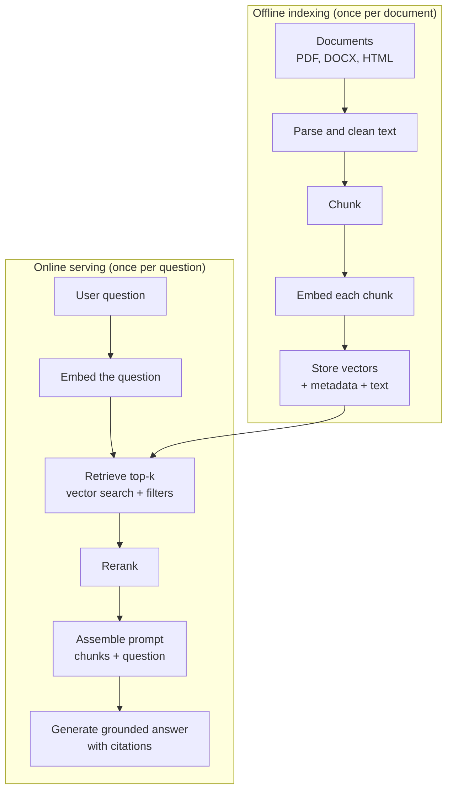

# RAG Architecture

> **Interview answer (say this first).** Retrieval-augmented generation (RAG) is a pattern that gives a language model knowledge it was never trained on. You retrieve the most relevant text from your own corpus and place it in the prompt, so the model answers from the text in front of it instead of from its parameters. The model is rarely the weak link; retrieval is.

## Why this exists

A language model has three hard limits, and they are all about knowledge, not intelligence.

1. **It does not know your private data.** It was trained on public text. Your contracts, tickets, handbooks, and code were never in that text.
2. **It is frozen at its training cutoff.** Anything that changed after training is invisible to it.
3. **It will still answer.** When a model does not know, it often produces a fluent, confident, wrong answer. That is a **hallucination**.

Here is the failure in one example:

```text
Employee:  How many days of annual leave do I get?
Model:     You get 25 days per year.
Truth:     The handbook says 20 days. The model invented 25.
```

The model did not lie on purpose. It has no access to the handbook, so it produced the most plausible-sounding number. Prompting it to "be accurate" does not give it the handbook.

There are three common reactions, and two of them are traps:

- **Fine-tune the model on the handbook.** Possible, but slow and expensive. The facts go stale the moment the handbook changes, and fine-tuning teaches style and format far better than it teaches recall of specific facts.
- **Paste the whole handbook into the prompt.** Works for one small document. Breaks as the corpus grows: 200 pages is already about 130,000 tokens, which does not fit in many context windows, and you pay for every token on every question.
- **Retrieve only the relevant passage and paste that.** This is RAG. It is cheap, fresh, and selective, and it does not change the model at all.

> **Note:**
>
> **The one-sentence purpose.** RAG moves a fact from your corpus into the model's context at question time, so the model reasons over text instead of guessing.


## Start from zero

Assume you have never built a search system. Here are the words this page keeps using.

| Word | Plain meaning |
| --- | --- |
| **LLM** | Large language model. A model that predicts the next token, used here to write the answer. |
| **Token** | A small piece of text, roughly ¾ of an English word. Models read and bill in tokens. |
| **Context window** | The maximum number of tokens a model can read at once: prompt plus answer. |
| **Prompt** | The text you send to the model. |
| **Corpus** | Your whole collection of documents. |
| **Retrieval** | Finding the most relevant pieces of the corpus for a question. |
| **Embedding** | A list of numbers that represents the meaning of text, so similar text has similar numbers. |
| **Vector** | A list of numbers. An embedding is a vector. |
| **Chunk** | A small piece of a document, short enough to embed and to fit in a prompt. |
| **Index** | A data structure that makes "find the nearest vectors" fast. |
| **Vector database** | A database that stores vectors and answers nearest-neighbour queries, such as pgvector. |
| **Ingestion** | Reading raw files, extracting text, cleaning it, and cutting it into chunks. |
| **Top-k** | The k best results returned by a search. "k" is just a count. |
| **Reranker** | A slower, more accurate model that re-sorts the top results from a first search. |
| **Grounding** | Forcing the answer to be based on supplied text, usually with citations. |
| **Hallucination** | Text that sounds true but is not supported by any source. |
| **Offline indexing** | All the work done before a user asks anything: parse, chunk, embed, store. |
| **Online serving** | All the work done per user question: retrieve, rerank, generate. |
| **ANN** | Approximate nearest neighbour. A fast search that usually, not always, finds the true nearest vectors. |
| **Recall@k** | Of the truly relevant chunks, the fraction that appear in the top k results. |

Two of these words carry most of the topic, so pin them down now:

- **Offline vs online** is about *when* work happens. Offline happens once per document; online happens once per question.
- **Retrieve vs generate** is about *who* provides the knowledge. Retrieval supplies facts; generation supplies language and reasoning.

Most RAG bugs are in one of those two splits, and the first debugging question is always: **is this an indexing problem or a serving problem?**

## The core idea

Think of an **open-book exam**. A closed-book exam tests memory. An open-book exam tests reasoning: the student may look up the right page, then must read it and answer. An LLM is a brilliant student with no memory of your specific book, so RAG simply lets it open the book.

The mental model is a librarian with a perfect index:

1. Before opening, the librarian files every page by topic (**offline indexing**).
2. A visitor asks a question (**the query**).
3. The librarian finds the few most relevant pages (**retrieval**).
4. The visitor reads those pages and answers (**generation**).

If the librarian brings the wrong pages, even a perfect reader gives a wrong answer. That is why retrieval quality decides most of RAG's quality.

The full pipeline, with the offline/online boundary drawn in the middle:



A first RAG system is called **naive RAG**: embed, search, paste the top-k, generate. It works surprisingly well on small clean corpora and fails in predictable ways at scale. **Advanced RAG** adds a stage wherever naive RAG fails.

| Stage | Naive RAG | Advanced RAG |
| --- | --- | --- |
| Ingest | Dump raw text | Parse by format, OCR scans, normalise |
| Chunk | Fixed size | Structure-aware, recursive, parent-child |
| Embed | One general model | Domain-tuned model, multiple representations |
| Index | One flat vector list | ANN index plus keyword index, filters |
| Retrieve | Top-k by cosine | Hybrid dense + sparse, metadata filters, query rewriting |
| Rank | Trust the vector score | Cross-encoder reranker, diversity, dedup |
| Context | Paste everything | Compress, select, order, budget tokens |
| Generate | "Answer the question" | Grounded prompt, citations, refuse when unsupported |
| Measure | None | Recall@k, MRR, NDCG (ranking metrics), faithfulness (answer supported by context) |

Now the comparison everyone asks about in interviews. RAG, fine-tuning, and long context solve different problems:

| | RAG | Fine-tuning | Long context |
| --- | --- | --- | --- |
| What it changes | The prompt (context) | The model's weights | The prompt (context) |
| Best for | Facts that change, private data | Style, format, narrow skills | A few large documents at once |
| Freshness | Minutes (re-index) | Days (retrain) | Minutes (re-read) |
| Cost per query | Low: only retrieved tokens | Low after training, high to train | High: every token every query |
| Cost to update | Re-embed the changed docs | Retrain the model | Nothing |
| Handles 200-page corpus | Yes, selectively | Yes, but stale | Only if it fits, and you pay for all of it |
| Main risk | Retrieval misses the answer | Forgetting, overfitting, staleness | Cost, latency, "lost in the middle" |

They combine. A common production answer is: fine-tune for format and tone, retrieve for facts, and use a long context only when a task genuinely needs several full documents at once.

## How it works

**Offline indexing**

1. **Collect documents.** Point the pipeline at a folder, a bucket, a wiki, or a database.
2. **Parse each document into text.** PDFs may have a text layer or be scans; DOCX and HTML need their own parsers. This stage is covered in the next page.
3. **Normalise the text.** Fix unicode, collapse whitespace, drop repeated headers and footers, join hyphenated line breaks.
4. **Chunk the text.** Split into pieces of a target size with some overlap, preferably on natural boundaries. This is covered in the chunking page.
5. **Attach metadata to each chunk.** Source file, title, section, page, date, tenant, and access-control tags. This is covered in the metadata page.
6. **Embed each chunk.** Run every chunk through an embedding model to get one vector.
7. **Store vectors, text, and metadata.** A vector database holds the vector; the row also holds the chunk text and its metadata so retrieval can return them.
8. **Build an index.** An ANN index (for example HNSW, a graph-based index that links nearby vectors) makes nearest-neighbour search fast without comparing to every vector.

**Online serving**

9. **Embed the question** with the *same* embedding model used for the chunks.
10. **Retrieve the top-k.** Ask the index for the nearest chunk vectors, after applying metadata filters.
11. **Rerank.** A cross-encoder reads the question and each candidate together and re-sorts them. It is accurate but too slow to run over the whole corpus, so it only touches the short candidate list.
12. **Assemble the prompt.** Put the best chunks and the question into a template, with a token budget.
13. **Generate a grounded answer.** The model answers from the supplied text and cites the sources. If the text does not support an answer, the system should say so.

Every stage has a characteristic failure. Learn this table; it is the fastest way to debug:

| Stage | Typical failure | Symptom |
| --- | --- | --- |
| Parse | OCR errors, lost tables, boilerplate kept | Correct answer is not in the corpus at all |
| Chunk | Cut through the sentence that held the answer | Retrieved chunk is close but incomplete |
| Embed | Wrong model, or query and docs differ | Neighbours are topical but not useful |
| Index | Approximate search misses a true neighbour | The right chunk exists but is never returned |
| Retrieve | Top-k too small, no keyword search, filters wrong | An easy answer is missed |
| Rerank | Reranker unfiltered and too slow | Latency spikes, or good results get demoted |
| Assemble | Answer chunk placed in the middle of a long prompt | "Lost in the middle": the model ignores it |
| Generate | Prompt invites outside knowledge | Fluent answer that cites nothing |

## The syntax you will use

The pieces below are the shapes you will see in real code. They are framework-neutral: the same steps appear in every RAG library.

**A configuration object.** Everything that affects retrieval is a decision you should name in one place.

```python
from dataclasses import dataclass

@dataclass
class RagConfig:
    chunk_size: int = 512        # tokens per chunk
    chunk_overlap: int = 64      # tokens shared by neighbours
    top_k: int = 20              # candidates from vector search
    rerank_top_n: int = 5        # chunks kept after reranking
    embedding_model: str = "text-embedding-3-small"
```

Keeping these in one object means you can change retrieval quality without hunting through the code.

**The indexing loop.** This is the whole offline half in five lines. It is idempotent because storing by a deterministic chunk id overwrites instead of duplicating.

```python
def index_document(doc: dict, store, embedder, config: RagConfig) -> None:
    for i, chunk in enumerate(chunk_text(doc["text"], config)):
        record = {
            "id": f'{doc["id"]}:{i}',
            "text": chunk,
            "vector": embedder.embed(chunk),
            "metadata": {**doc["metadata"], "chunk_index": i},
        }
        store.upsert(record)          # replace by id, so re-runs are safe
```

**The query path.** Retrieval, rerank, and prompt assembly are separate functions so you can measure each one.

```python
def answer(question: str, store, embedder, reranker, llm, config: RagConfig) -> str:
    q = embedder.embed(question)
    candidates = store.search(q, top_k=config.top_k)          # first stage
    best = reranker.rerank(question, candidates)[:config.rerank_top_n]
    prompt = build_prompt(question, best)                      # includes sources
    return llm.generate(prompt)
```

**A vector search in SQL.** `<=>` is pgvector's cosine-distance operator; smaller distance means more similar.

```sql
SELECT id, text, metadata, embedding <=> :query_vector AS distance
FROM chunks
ORDER BY distance
LIMIT 20;
```

**Metadata filters in the same query.** Never retrieve chunks the caller is not allowed to see.

```sql
SELECT id, text, metadata, embedding <=> :query_vector AS distance
FROM chunks
WHERE tenant_id = :tenant AND allowed_roles && :roles
ORDER BY distance
LIMIT 20;
```

**A grounded prompt with citations.** Numbering the sources is what makes citations possible.

```python
PROMPT = """Answer the question using only the sources below.
If the sources do not contain the answer, say you do not know.
Cite each claim as [1], [2], and so on.

Sources:
{context}

Question: {question}
"""

def build_prompt(question, chunks):
    context = "\n\n".join(f"[{i+1}] {c.text}" for i, c in enumerate(chunks))
    return PROMPT.format(context=context, question=question)
```

**A retrieval metric you can run offline.** Recall@k answers "did we even fetch the right chunk?"

```python
def recall_at_k(retrieved_ids: list[str], relevant_ids: set[str], k: int) -> float:
    if not relevant_ids:
        return 1.0
    hits = set(retrieved_ids[:k]) & relevant_ids
    return len(hits) / len(relevant_ids)
```

**A fake embedder for tests.** Real provider calls are slow and cost money, so production code injects the embedder and tests use a deterministic stand-in.

```python
class FakeEmbedder:
    def embed(self, text: str) -> list[float]:
        return [text.count(c) for c in "abcdefghij"]   # deterministic, no network
```

## Examples: simple to real

**Example 1 — the model cannot answer without context.** This is the problem, not the solution.

```text
Question: How many days of annual leave do I get?
Without retrieval:  "You get 25 days per year."     # invented
With this chunk:    "Employees get 20 days of annual leave. Up to 5 days may carry over."
Correct answer:     "20 days, with up to 5 days of carryover."
```

The model did not get smarter between the two lines. It got the fact.

**Example 2 — the pipeline with no model at all.** To see retrieval clearly, build it with deterministic toy vectors. No API key is needed.

```python
import hashlib
import numpy as np

docs = {
    "leave.pdf": "Employees get 20 days of annual leave. Up to 5 days may carry over.",
    "expenses.pdf": "Submit receipts within 30 days. Meals are capped at 75 dollars.",
    "security.pdf": "Your password length must be at least 12 characters.",
    "travel.pdf": "Book flights 14 days ahead. Economy class is the default.",
}

STOP = {"what", "is", "the", "do", "i", "a", "of", "to", "get", "how", "many"}

def embed(text: str, dim: int = 256) -> np.ndarray:
    vec = np.zeros(dim)
    tokens = [t for t in text.lower().replace(".", " ").split() if t not in STOP]
    for token in tokens:
        vec[int(hashlib.sha256(token.encode()).hexdigest(), 16) % dim] += 1.0
    norm = np.linalg.norm(vec)
    return vec / norm if norm else vec

matrix = np.vstack([embed(t) for t in docs.values()])
names = list(docs)

def retrieve(query: str, k: int = 2):
    sims = matrix @ embed(query)                 # cosine: vectors are normalised
    return [(names[i], round(float(sims[i]), 4)) for i in np.argsort(-sims)[:k]]
```

Run it and the correct document wins for each question:

```text
>>> retrieve("How many annual leave days do I get?")
[('leave.pdf', 0.5547), ('travel.pdf', 0.1768)]

>>> retrieve("What is the minimum password length?")
[('security.pdf', 0.1925), ('leave.pdf', 0.0)]
```

The correct document ranks first in both cases. The runner-up in the first query only shares the word "days", which shows how fragile a raw score threshold can be.

This is a bag-of-words stand-in, not a real embedding model. It shows the mechanic: turn text into vectors, compare, take the top k. A real system swaps `embed()` for a sentence embedding model.

**Example 3 — why selectivity matters.** A 200-page handbook is about 130,000 tokens (200 pages × 500 words × ~1.3 tokens per word). Retrieve only five 512-token chunks instead and you send about 2,560 tokens:

```text
whole corpus in prompt: 130,000 tokens   ~ $0.0195 per query
top-5 chunks:             2,560 tokens   ~ $0.00038 per query
reduction: 50.8x
cost per 1,000 queries:  $19.50  vs  $0.38     (at an example $0.15 / 1M input tokens)
```

The same arithmetic applies to context limits: 130,000 tokens cannot fit in an 8k or 32k window, and even in a 128k window (131,072 tokens) it leaves no room for the answer, while the top-5 always fits. Bigger context windows reduce the pressure, not the argument.

**Example 4 — chunk count and vector storage.** The same corpus at three chunk settings, and what the vectors cost:

```text
256 tokens / 32 overlap   -> 581 chunks
512 tokens / 64 overlap   -> 291 chunks
1024 tokens / 128 overlap -> 146 chunks

291 chunks x 1536 dims -> 1.71 MB as float32, 873 KB as float16
1,000,000 chunks x 1536 dims -> 5.72 GB as float32, 2.86 GB as float16
```

A small corpus is tiny. At a million chunks you start making real decisions about half precision and index type.

**Example 5 — the latency budget.** A p50 estimate per stage for one question, with a 400-token answer:

```text
embed query                 8 ms
vector search (ANN)         5 ms
metadata filter             2 ms
rerank 20 candidates       40 ms
assemble prompt             1 ms
LLM generation            600 ms
------------------------------
p50 total                 656 ms    (retrieval is 56 ms, about 8.5%)
```

Generation dominates. Reranking is the largest retrieval-side cost, and it is usually worth it. Optimising the vector search before the reranker is optimising the wrong 8%.

## In production

- **Measure retrieval before blaming the model.** If the answer is wrong, first check whether the correct chunk was in the top-k. If it was not, no prompt change helps. If it was, the failure is in generation.
- **Keep offline and online strictly separate.** Indexing is a batch job; serving is a request path. Mixing them (embedding documents during a request) creates latency spikes and inconsistent indexes.
- **Chunking dominates retrieval quality.** A badly cut chunk embeds into a vague vector and can never be retrieved well. This is the highest-leverage stage and the one most teams rush.
- **Use the same embedding model on both sides.** Query and documents must share one vector space. A mismatch returns plausible but wrong neighbours with no error.
- **Retrieve wide, then rank narrow.** Fetch 20–100 candidates cheaply, then let a cross-encoder reranker choose the best 3–5. Reranking fixes many recall-to-precision problems.
- **Give the model an escape hatch.** The prompt must allow "the sources do not say." Without it, the model fills gaps from its own weights, which is exactly the hallucination RAG was meant to stop.
- **Grounding is not correctness.** RAG reduces hallucination when the right text is retrieved; it does not remove the model's tendency to overreach. Citations and supported-claim checks are separate defences.
- **Version the index with the corpus.** Store the embedding model name, chunk config, and parser version next to the index. Changing any of them means re-indexing, and without versioning you will not know why old vectors behave differently.
- **Budget context deliberately.** Order matters: models attend best to the start and end of a long prompt. Put the strongest evidence first and never bury the answer in the middle of 20 chunks.
- **Plan for freshness.** Index lag is a product decision. A nightly job means answers can be a day stale; streaming ingestion means minutes. Say which one you have.
- **Filter before you search, not after.** Post-filtering a top-k list can return fewer results than requested, or leak forbidden rows if done in application code. Pre-filtering is also what makes multi-tenant RAG safe.
- **Long context is not a RAG replacement for a large corpus.** It is a replacement for retrieval only when the whole corpus fits, changes rarely, and is worth paying for on every single query.

## Interview questions

### 1. What is RAG, and why is it used?

**Answer.** RAG retrieves relevant passages from a corpus and places them in the model's prompt, so the model answers from supplied text rather than from its parameters. It is used to give a model private, fresh, or niche knowledge without retraining it. It is cheap per query, updates in minutes by re-indexing, and keeps the facts auditable through citations.

**Follow-up: "Why not just fine-tune?"** Fine-tuning changes behaviour and style well, and fact recall poorly. Facts also go stale. RAG keeps facts outside the model, where they can be updated and cited. Most production systems use retrieval for facts and fine-tuning, if at all, for format and tone.

**Trap.** Calling RAG "a way to make the model smarter." It changes the context, not the model's abilities. It can only help if retrieval finds the right passage.

### 2. Explain the RAG pipeline end to end.

**Answer.** Offline, you ingest documents, parse and clean them, chunk them, embed each chunk, and store the vectors with text and metadata in an index. Online, you embed the question with the same model, retrieve the top-k nearest chunks with filters, rerank them, assemble a prompt, and generate a grounded answer with citations.

**Follow-up: "Which half causes most bugs?"** Retrieval. Models are strong enough to answer from a good passage; the common failure is that the passage was never fetched, or was fetched but cut badly.

**Trap.** Listing only the generation step. An answer that names "embed, search, generate" but skips parsing, chunking, and metadata cannot explain why retrieval fails.

### 3. What is the difference between naive and advanced RAG?

**Answer.** Naive RAG is embed-search-paste: fixed chunks, one vector search, top-k straight into the prompt. Advanced RAG adds a fix at each weak stage: better parsing and chunking, hybrid dense plus keyword retrieval, metadata filters, query rewriting, cross-encoder reranking, context compression, and citations. Each addition should be justified by a measured failure.

**Follow-up: "Would you start with advanced RAG?"** No. Start naive, measure recall on a labelled set, then add the smallest fix for the biggest failure. Adding every technique at once makes it impossible to know what helped.

**Trap.** Believing advanced equals better. Every extra stage adds latency, cost, and a new way to fail.

### 4. RAG versus fine-tuning versus long context?

**Answer.** RAG supplies facts at query time from an external corpus, so it is fresh, cheap to update, and citeable. Fine-tuning bakes behaviour and style into weights, so it is good for format and narrow skills but a poor way to store changing facts. Long context skips retrieval and reads whole documents, which is simple but costs every token on every query and degrades when the answer is buried in the middle.

**Follow-up: "Can you combine them?"** Yes, and that is common: fine-tune for behaviour, retrieve for facts, and use long context for the few tasks that need several complete documents.

**Trap.** Saying "long context makes RAG obsolete." A corpus of 10 million tokens still does not fit, cost and latency still scale with tokens, and retrieval is what makes permissions and citations possible.

### 5. Where does RAG fail?

**Answer.** At every stage, and each has a signature. Parsing loses text; chunking cuts the answer in half; embedding puts the right chunk far from the question; the ANN index misses a true neighbour; retrieval returns the wrong top-k; reranking demotes a good chunk; prompt assembly buries it; generation ignores the context. Debug in that order, from the corpus forward.

**Follow-up: "How do you tell a retrieval failure from a generation failure?"** Look at the retrieved chunks. If the answer is not in them, it is retrieval. If it is there but the answer is wrong, it is generation.

**Trap.** Jumping to the model or the prompt. Most "the LLM is bad at RAG" reports are retrieval failures wearing a disguise.

### 6. Why split the system into offline indexing and online serving?

**Answer.** They have different cost profiles and different failure modes. Indexing is a batch job: throughput matters, latency does not, and it runs once per document. Serving is a request path: latency and cost per query matter, and it runs on every question. Splitting them lets you scale, cache, monitor, and debug each half independently.

**Follow-up: "What can go wrong in the split?"** The two halves drift: someone changes the embedding model or chunker on one side and the index no longer matches the query path. Versioning the embedding model and chunk config next to the index prevents that.

**Trap.** Embedding documents inside the request path. It looks simpler, but it makes the first request after an upload slow and the index state unpredictable.

### 7. How would you debug a RAG system that gives a wrong answer?

**Answer.** Reproduce the query, then inspect the retrieved chunks. If the answer chunk is absent, work backwards: was it in the index, was it parsed correctly, was it chunked at a sensible boundary, is the query embedded in the same space? If the answer chunk is present, the problem is in generation: the prompt, the context order, or the model ignoring instructions.

**Follow-up: "What do you measure to catch this early?"** A labelled question set with recall@k, MRR, or NDCG for retrieval, plus faithfulness for generation. Run it in CI so a chunking or model change cannot silently regress.

**Trap.** Retrying the query and declaring it fixed. Flaky retrieval is a signal, not noise; a nondeterministic index setting or an overloaded reranker may be the cause.

### 8. How do you control RAG cost and latency?

**Answer.** Reduce tokens and stages. Retrieve fewer, better chunks with a reranker; cache embeddings by content hash; cache answers for repeated questions; use a smaller embedding model or lower dimension; use half precision for vectors; and stream the answer so the first token arrives early. Measure the budget: generation usually dominates, retrieval is a small fraction.

**Follow-up: "Where is the first place you would look?"** The context size sent to the model. Top-k of 20 chunks is 10,000 tokens on every query; reranking down to 5 cuts that by 75% and often improves quality.

**Trap.** Optimising the vector search first. If retrieval is about 8% of p50 latency, halving it saves little; the reranker and the model are where the time goes.

## Remember this

- RAG moves **facts into the prompt at question time**. It does not change the model.
- **Offline indexing** is parse → chunk → embed → store. **Online serving** is embed → retrieve → rerank → generate.
- **Retrieval is the usual weak link.** Check whether the right chunk was fetched before changing the prompt.
- **RAG, fine-tuning, and long context solve different problems** and are often combined.
- **Retrieve wide, rank narrow, and budget context.** Put the best evidence first and let the model say "I do not know."
