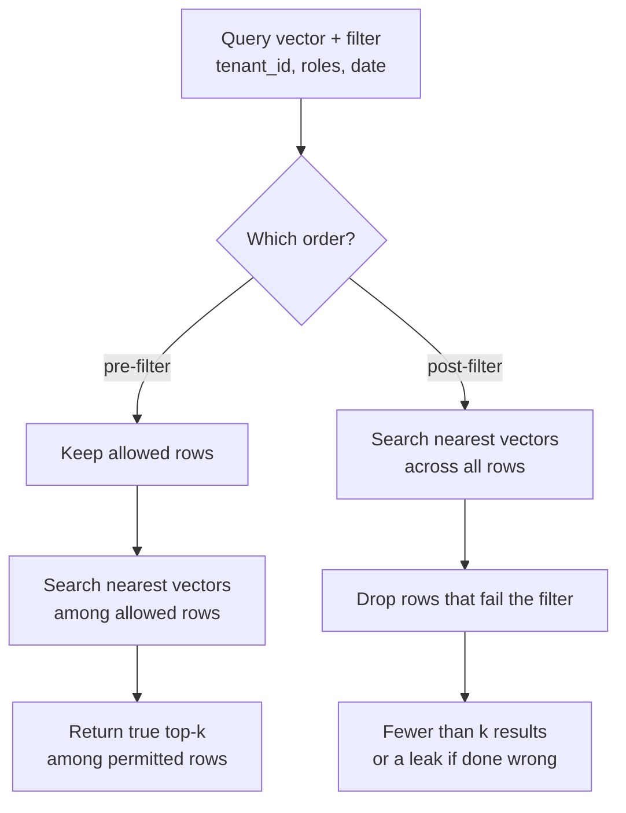

# Metadata Extraction and Filtering

> **Interview answer (say this first).** Metadata is the structured data attached to every chunk: source, title, section, page, date, author, tags, tenant, and access-control tags. It is how you filter before search, cite sources, isolate tenants, and debug results. Filtering must happen **before** the vector search, because a shared index will otherwise return rows the caller is not allowed to see and too few rows after the fact.

## Why this exists

A vector index answers one question well: *which stored vectors are closest to this query vector?* It knows nothing else. It does not know who is asking, which company they work for, whether a document is current, or whether a page is confidential.

That gap causes two distinct failures.

**The correctness failure.** A user asks a question, and the nearest chunk belongs to another tenant or a document they cannot access.

```text
Query: "What is our refund policy?"
Index:  customer_a policy, customer_b policy, internal legal memo, public FAQ
Top-3 by similarity: customer_b policy, internal memo, customer_a policy
Result: the model answers with another company's policy
```

The vectors were correct. The system was wrong. Similarity has no concept of permission.

**The precision failure.** You need only documents from 2026, or only the security section, or only PDFs. Without metadata there is no way to express that, so the retriever fetches topically similar but ineligible chunks and the model answers from stale or off-topic text.

There is also a practical failure that hits every team: **you cannot debug without metadata.** When an answer is wrong you need to know which file, which page, which section, and which version produced the chunk. Without that, you are guessing.

Metadata exists to answer the questions similarity cannot:

| Question | Field that answers it |
| --- | --- |
| Which document is this from? | `source`, `document_id` |
| Where in the document? | `page`, `section`, `chunk_index` |
| Who is allowed to see it? | `tenant_id`, `allowed_roles` |
| Is it current? | `date`, `version`, `ingested_at` |
| What kind of content is it? | `doc_type`, `tags`, `language` |

## Start from zero

| Word | Plain meaning |
| --- | --- |
| **Metadata** | Structured fields attached to a chunk, stored beside its vector. |
| **Field** | One named piece of metadata, such as `tenant_id` or `page`. |
| **Filter** | A condition that keeps only rows matching it, like `tenant_id = 'a'`. |
| **Pre-filter** | Apply the filter first, then search the remaining rows. |
| **Post-filter** | Search first, then drop results that fail the filter. |
| **Selectivity** | How much a filter removes. High selectivity keeps few rows. |
| **Cardinality** | How many distinct values a field has. Low cardinality means few values. |
| **ACL** | Access control list: tags naming who may read a chunk. |
| **Tenant** | One customer or organisation sharing infrastructure with others. |
| **JSONB** | A binary JSON column type in PostgreSQL, queryable and indexable. |
| **Payload** | The non-vector fields stored with a vector in a vector database. |
| **GIN index** | A PostgreSQL index type for arrays and JSONB. |
| **Partial index** | An index that covers only rows matching a condition. |
| **Operator class** | The index configuration for a type and distance, such as `vector_cosine_ops`. |

The two words worth pinning down are **pre-filter and post-filter**, because they look equivalent and are not.

- **Pre-filter**: "give me the nearest vectors *among rows you are allowed to see*."
- **Post-filter**: "give me the nearest vectors, *then* remove rows you are not allowed to see."

Only the first one guarantees safety, and it returns the true top-k among the permitted rows — fewer than k only when fewer than k permitted rows exist.

**Selectivity** matters because it determines which approach is cheap. A filter that keeps 1% of rows is highly selective; a filter that keeps 90% is barely selective. The highly selective case is exactly where pre-filtering matters most.

## The core idea

Think of a **library**. The vector index is a librarian who is brilliant at "find me books similar to this question," but blind to everything else. The catalogue cards are the metadata: shelf, author, year, and who is allowed to borrow.

You would never let the librarian hand a restricted book to the wrong person and then try to take it back. You tell the librarian the rules first.



This table is the whole argument:

| | Pre-filter | Post-filter |
| --- | --- | --- |
| Safe by construction | Yes | Only if you never expose the raw list |
| Returns top-k | Yes, among permitted | Often fewer |
| Works when filter is selective | Yes | Poorly |
| Cost | Filter runs first, may scan many rows | Vector search over everything, then a cheap drop |
| Good for | Tenant and ACL isolation, dates | Broad, low-selectivity tags |

There is a third option that production systems use: **filter inside the database**. The filter and the vector search run in one SQL query, so the planner can combine an index on the filter column with the vector index. That is the pgvector pattern shown below.

## How it works

1. **Decide the schema before ingesting.** Every field you might filter on later must be captured at chunk time. Adding a field later means re-embedding the corpus.
2. **Extract what is derivable.** Source path, filename, title, type, and date often come free from the file path and contents.
3. **Extract what requires parsing.** Section and page come from the parser; author and tags may come from document properties or a model.
4. **Assign what comes from the request.** Tenant and ACL tags are not in the document; the upload context supplies them.
5. **Normalise the values.** Lowercase tags, use ISO dates (YYYY-MM-DD), and keep tenant IDs as exact strings. Inconsistent casing makes filters silently wrong.
6. **Store metadata beside the vector.** In pgvector that is a mix of typed columns and a `JSONB` payload; in a vector database it is the payload object.
7. **Index the filter columns.** A B-tree for equality, a GIN index for arrays and JSONB, and the vector index for distance. Without a filter index, a selective filter forces a scan.
8. **Filter in the same query as the search.** This lets the planner use both indexes and keeps permissions out of application code.
9. **Return metadata with the results** so the answer can cite the source and the system can log it.
10. **Test with an adversarial case.** Ask a question whose best answer belongs to another tenant and confirm it never appears.

## The syntax you will use

**Extract metadata from a path and a document head.** Most fields are free; only normalisation is work.

```python
import hashlib
import re
from datetime import datetime

def extract_metadata(path: str, text_head: str) -> dict:
    name = path.rsplit("/", 1)[-1]
    stem = name.rsplit(".", 1)[0]
    year = re.search(r"(20\d{2})", stem)
    return {
        "source": path,
        "filename": name,
        "title": stem.replace("-", " ").replace("_", " ").title(),
        "doc_type": name.rsplit(".", 1)[-1].lower(),
        "year": int(year.group(1)) if year else None,
        "ingested_at": datetime.now().isoformat(timespec="seconds"),
        "content_hash": hashlib.sha256(text_head.encode()).hexdigest()[:16],
    }
```

**A pgvector schema with typed columns plus JSONB.** Typed columns for the fields you always filter on, JSONB for the rest.

```sql
CREATE EXTENSION IF NOT EXISTS vector;

CREATE TABLE chunks (
    id            bigserial PRIMARY KEY,
    document_id   text NOT NULL,
    content       text NOT NULL,
    embedding     vector(1536),
    tenant_id     text NOT NULL,
    doc_type      text,
    doc_date      date,
    allowed_roles text[] NOT NULL DEFAULT '{}',
    metadata      jsonb NOT NULL DEFAULT '{}'::jsonb
);
```

**The filtered search: filter and vector search in one query.** `&&` is array overlap: it is true when the two arrays share an element.

```sql
SELECT id, content, metadata, embedding <=> :query_vector AS distance
FROM chunks
WHERE tenant_id = :tenant_id
  AND allowed_roles && :roles
  AND (doc_date IS NULL OR doc_date >= :since)
ORDER BY distance
LIMIT 5;
```

**Index what you filter on, or the filter becomes a scan.** B-tree for equality and range, GIN for arrays and JSONB.

```sql
CREATE INDEX ON chunks (tenant_id, doc_date);
CREATE INDEX ON chunks USING gin (allowed_roles);
CREATE INDEX ON chunks USING gin (metadata jsonb_path_ops);
```

**The vector index for the distance operator.** HNSW is a graph-based approximate index. The operator class must match the operator you query with.

```sql
CREATE INDEX ON chunks USING hnsw (embedding vector_cosine_ops);
```

**Query inside JSONB** when a field lives in the payload rather than a typed column.

```sql
SELECT id, content
FROM chunks
WHERE metadata @> '{"language": "en"}'      -- contains this JSON
  AND tenant_id = :tenant_id
ORDER BY embedding <=> :query_vector
LIMIT 5;
```

**Enable iterative scans for filtered approximate search.** Documented pgvector behaviour: with an approximate index, the filter is applied *after* the index is scanned. At 10% selectivity with the default `hnsw.ef_search = 40`, only about 4 rows match on average.

```sql
SET hnsw.iterative_scan = strict_order;   -- pgvector 0.8.0+
```

**Filter in Python when the store is not SQL.** Keep permission logic in one place so it cannot drift between queries.

```python
def visible(chunk: dict, tenant: str, roles: list[str]) -> bool:
    same_tenant = chunk["tenant_id"] == tenant
    acl_ok = bool(set(chunk["allowed_roles"]) & set(roles))   # array overlap
    return same_tenant and acl_ok
```

**A pre-filter helper.** Filter first, then rank the permitted rows. This is the shape you want at the application layer too.

```python
def pre_filter(rows, scores, tenant, roles, k):
    allowed = [i for i, r in enumerate(rows)
               if r["tenant_id"] == tenant and set(r["allowed_roles"]) & set(roles)]
    allowed.sort(key=lambda i: -scores[i])
    return [rows[i] for i in allowed[:k]]
```

## Examples: simple to real

**Example 1 — extraction is mostly free.** From a file path you get source, title, type, and year in one pass:

```text
extract_metadata("/data/policies/leave-policy-2026.pdf", "Leave policy")
->
{'source': '/data/policies/leave-policy-2026.pdf',
 'filename': 'leave-policy-2026.pdf',
 'title': 'Leave Policy 2026',
 'doc_type': 'pdf',
 'year': 2026,
 'ingested_at': '2026-09-13T17:49:01',
 'content_hash': '6d08e18c96240b12'}
```

Date extraction from the filename is a heuristic. Prefer document metadata or a dedicated date field when you have one.

**Example 2 — selectivity, not cardinality, decides how you filter.** A field with few distinct values is low cardinality; a field with many is high cardinality.

```text
tenant_id  distinct values = 3     low cardinality, always filter on it
roles      distinct values = 2     low cardinality, array overlap
doc_id     distinct values = 12    high cardinality, exact lookup
public     distinct values = 2     very low cardinality, poor filter
```

Cardinality (how many distinct values a field has) is not the same as selectivity (how many rows a condition keeps). A low-cardinality field can be a strong filter when one value covers only a small group, such as a single `tenant_id`, and a weak one when the condition keeps almost everything. The boolean `public` flag is the classic low-cardinality, low-selectivity case: very few distinct values, but `public = true` may still match 11 of 12 rows. What matters for performance is selectivity, not cardinality.

**Example 3 — ACL overlap, including the empty case.** Permission checks are set intersection, and the empty cases are the ones that cause incidents.

```text
chunk=[employee]  viewer=[employee, finance] -> visible
chunk=[hr_admin]  viewer=[employee, finance] -> hidden
chunk=[]          viewer=[employee]          -> hidden
chunk=[public]    viewer=[]                  -> hidden
```

An empty ACL should mean "nobody," not "everybody." Getting that default backwards is a classic data leak.

**Example 4 — the post-filter trap, simulated.** Twelve chunks across three tenants, each with its own leave policy, so similarity alone cannot separate them. Ranked by similarity to a leave question:

```text
c-leave-2  tenant_c  employee   0.9994
a-leave-1  tenant_a  employee   0.9949
b-leave-1  tenant_b  employee   0.9752
b-leave-2  tenant_b  employee   0.9572
a-leave-2  tenant_a  employee   0.9436
a-hr-1     tenant_a  hr_admin   0.9434
c-leave-1  tenant_c  employee   0.8548
...
```

Now ask as a **tenant_a employee** for the top 3:

```text
post-filter: ['a-leave-1']              -> 1 result (asked for 3)
pre-filter : ['a-leave-1', 'a-leave-2', 'a-exp-1'] -> 3 results
```

Post-filtering returned one result instead of three, because the other two in the global top-3 were filtered away. The system silently delivered a worse answer.

**Example 5 — the same trap, worse for restricted roles.** Ask as a **tenant_a hr_admin**:

```text
post-filter: []                          -> 0 results (asked for 3)
pre-filter : ['a-hr-1']                  -> 1 result
```

The global top-3 contained no HR-admin chunks at all, so post-filtering returned nothing. This is why selectivity matters:

```text
tenant_a / employee : 3/12 = 25% of rows survive
tenant_a / hr_admin : 1/12 = 8% of rows survive
tenant_b / employee : 4/12 = 33% of rows survive
```

At 8% selectivity, a top-3 from a shared index rarely contains even one eligible row. Pre-filtering searches only the 8% that are allowed, so it returns as many permitted rows as exist, up to k.

**Example 6 — the same thing in SQL.** The pre-filter version is one query, and the filter columns are indexed:

```sql
-- pre-filter: the database keeps only permitted rows, then ranks them
SELECT id, content, embedding <=> :q AS distance
FROM chunks
WHERE tenant_id = 'tenant_a' AND allowed_roles && ARRAY['employee']
ORDER BY distance
LIMIT 3;
```

pgvector's own guidance: with an approximate index, filtering happens after the index scan, so a 10% filter with the default `ef_search` of 40 matches only about 4 rows on average. Iterative scans (`SET hnsw.iterative_scan = strict_order;`) let the engine keep scanning until it has enough. For a fixed set of filter values, a partial index or per-tenant partition is even better.

## In production

- **Pre-filter for anything security-related.** Tenant and ACL filters are not performance optimisations; they are correctness and safety requirements. Never rely on the application to drop forbidden rows after the fact.
- **Filter in the database, not in a loop.** Pulling top-100 and filtering in Python wastes bandwidth, can leak, and returns fewer than requested. Do it in one query.
- **Index every filter column.** A selective filter without an index forces a sequential scan. Use B-tree for equality and range, GIN for arrays and JSONB.
- **Know pgvector's approximate-index behaviour.** With HNSW, filtering is applied after the index scan. Selective filters under-return unless you enable `hnsw.iterative_scan` or use a partial index or partition.
- **Do not share one approximate index across tenants if you can avoid it.** pgvector documents that vectors from one tenant can affect recall for others. Prefer list partitioning by `tenant_id` or separate tables.
- **Use typed columns for hot filters and JSONB for the long tail.** Equality on a typed `tenant_id` is faster and safer than a JSONB lookup. Keep flexible, low-traffic fields in JSONB.
- **Watch cardinality.** A very low-cardinality field such as a boolean public flag barely filters anything; a very high-cardinality field is a lookup, not a filter. Choose fields that slice the corpus usefully.
- **Normalise values at write time.** `"HR"`, `"hr"`, and `"Hr"` become three access groups and one of them will be missing from the filter. Lowercase tags and enforce a controlled vocabulary.
- **Default-deny ACLs.** An empty or missing `allowed_roles` must mean no access. Treat a missing tenant as an error, not a wildcard.
- **Store provenance for citations.** `source`, `page`, and `section` are what make "the handbook says X on page 12" possible. Without them, grounding is unverifiable.
- **Version metadata with the corpus.** A `parser_version` or `schema_version` field lets you find and re-process rows written under old rules.
- **Test filters adversarially.** Write a test where the globally most similar chunk belongs to another tenant, and assert it is never returned. That single test catches most isolation regressions.

## Interview questions

### 1. Why is metadata necessary in a RAG system?

**Answer.** Vector similarity knows nothing but distance. Metadata supplies everything else: which document and page a chunk came from, when it was written, what type it is, and who may see it. It enables pre-filtering for permissions and freshness, citations for grounding, and provenance for debugging. Without it, a search cannot respect tenancy or dates, and a wrong answer cannot be traced.

**Follow-up: "Could you put all of that in the text instead?"** You could, but the filter then depends on the model reading and respecting it, which is unreliable and unindexable. Structured fields are queryable, cheap, and enforceable.

**Trap.** Treating metadata as nice-to-have. Permissions and citations are impossible to add reliably after the corpus is indexed.

### 2. What is the difference between pre-filtering and post-filtering?

**Answer.** Pre-filtering restricts the rows before the vector search, so every returned result is allowed and you get the true top-k among permitted rows (fewer only when fewer permitted rows exist). Post-filtering searches everything and then drops disallowed rows, which can return fewer than k results and is unsafe if the raw list is ever exposed. Pre-filtering is the correct default for tenant and ACL isolation.

**Follow-up: "Why would anyone post-filter?"** When the filter is barely selective, post-filtering can be simpler and the loss is small. It is a performance choice on low-selectivity filters, never a security choice.

**Trap.** Thinking they return the same rows. They return different sets whenever the filter removes anything from the global top-k.

### 3. How does pgvector handle filtering with an approximate index?

**Answer.** With HNSW or IVFFlat, the filter is applied after the index scan. That means a selective filter can return fewer rows than the limit, because most of the scanned neighbours were filtered out. pgvector documents that a filter matching 10% of rows with the default `hnsw.ef_search = 40` yields only about 4 matches on average.

**Follow-up: "What are the fixes?"** Enable iterative index scans (`SET hnsw.iterative_scan = strict_order;`, pgvector 0.8.0+), create a partial index for the common filter value, or partition by tenant. Also index the filter column so exact search stays fast.

**Trap.** Assuming `LIMIT 5` always returns five rows. With a filtered approximate index, it may return fewer, and the bug looks like missing data rather than a filter problem.

### 4. How would you store metadata in pgvector?

**Answer.** A mix. Typed columns for the fields you always filter on, such as `tenant_id`, `doc_type`, and `doc_date`, plus a `jsonb` column for flexible payload fields. Index the typed columns with B-tree, the array ACL with GIN, and the JSONB with GIN. Then filter and search in one SQL statement.

**Follow-up: "Why not put everything in JSONB?"** Typed columns are faster, enforce types, and make queries readable. JSONB is for fields that vary by document type and are not hot filters.

**Trap.** Only indexing the vector column. A filtered query without a filter index degrades to a sequential scan.

### 5. How do you model tenant isolation?

**Answer.** Every chunk carries a `tenant_id`, the filter includes it in every query, and the vector index is not blindly shared. Partition by tenant or use separate tables, because a shared approximate index lets one tenant's vectors affect another tenant's recall. Default-deny on a missing tenant.

**Follow-up: "What about a shared index for many small tenants?"** It can be acceptable if the filter is applied in the database and recall (the fraction of relevant chunks actually returned) is measured per tenant. Still, test adversarially and monitor recall, because cross-tenant interference is a real effect.

**Trap.** Filtering in the application after retrieval. One missed code path leaks one tenant's data, and the mistake is invisible in normal tests.

### 6. What is selectivity, and why does it matter?

**Answer.** Selectivity is the fraction of rows a filter keeps. A filter that keeps 1% is highly selective; one that keeps 90% barely filters. Highly selective filters are exactly where post-filtering fails, because the global top-k contains almost no eligible rows. They are also where a filter index matters most, since a scan of the whole table is expensive.

**Follow-up: "Give an example of a bad filter."** A boolean `is_public` flag that is true for 92% of rows removes almost nothing. It is better used as a stored field for display than as the primary retrieval filter.

**Trap.** Confusing selectivity with cardinality. Cardinality is how many distinct values exist; selectivity is how many rows a particular condition keeps. A high-cardinality field can have a low-selectivity condition.

### 7. How do you handle access control lists per chunk?

**Answer.** Store the allowed roles or groups as an array on each chunk, and filter with array overlap (`allowed_roles && :viewer_roles`) in the same query as the vector search. Index the array with GIN. Empty must mean no access, and missing fields should fail closed.

**Follow-up: "What about group hierarchies?"** Flatten the hierarchy at write time: resolve a role to all its inherited groups when the chunk is indexed. Checking a hierarchy at query time adds latency and a place for bugs.

**Trap.** Comparing a single role string instead of intersecting sets. Real access is many-to-many, and a single string cannot express it.

### 8. How do you keep metadata accurate over time?

**Answer.** Treat metadata like content: version it, hash it, and re-index when it changes. Give each document a stable ID, store a schema or parser version, and normalise values on write. When permissions change, update the metadata rows rather than re-embedding, because the text has not changed.

**Follow-up: "What happens when a filter field is renamed?"** Old rows keep the old key and silently disappear from filtered queries. A schema version plus a backfill job is the safe path.

**Trap.** Editing metadata by hand in the database. It drifts from the source of truth and is impossible to reproduce on a rebuild.

## Remember this

- **Similarity is not permission.** Every chunk needs `tenant_id` and ACL fields, filtered in the same query as the search.
- **Pre-filter, never post-filter, for security.** Post-filtering can return fewer than k results and can leak.
- **Selectivity decides the approach.** The more selective the filter, the more pre-filtering matters.
- **pgvector filters after the approximate index scan**, so enable `hnsw.iterative_scan`, use partial indexes, or partition by tenant.
- **Metadata is what makes citations and debugging possible.** Capture it at chunk time and version it.
