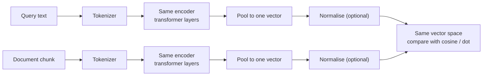

# Embedding Models and Dimensions

> **Interview answer (say this first).** An embedding model is a **bi-encoder**: it reads one piece of text on its own and returns a single fixed-length dense vector. The **dimension** is the number of floats in that vector, and it fixes the size, cost, and speed of the whole vector index. Every model has its own vector space and its own maximum input length, so a query and the documents must always be embedded by the same model, and long text is silently truncated.

## Why this exists

RAG needs to answer one question over and over: *which stored chunk is most related to this user question?* You cannot compare two pieces of text directly, so you convert each into a vector of numbers and compare the numbers.

That conversion is the job of an **embedding model**. It is a separate model from the chat LLM. It is usually small, cheap, and runs once at indexing time plus once per query.

Two teams get burned by the same mistakes:

- **Model swap without re-indexing.** A team changes from `all-MiniLM-L6-v2` to `bge-base-en-v1.5` for "better quality" and only changes the query side. Both models return 384- and 768-number vectors that look fine, but they live in unrelated coordinate systems. Retrieval now returns plausible-looking garbage, and nothing raises an error.
- **Silent truncation.** `all-MiniLM-L6-v2` reads at most **256 tokens**. A team feeds it a 2,000-token chunk. The model does not complain — it embeds only the first part, and the rest of the chunk is invisible to search.

There is also a budget problem. Storing one vector is cheap; storing ten million is not. The dimension decides the bill:

```text
1,000,000 chunks, single-precision (4 bytes per float)
  dim= 384 ->  1.54 GB
  dim=1536 ->  6.14 GB
  dim=3072 -> 12.29 GB
```

Choosing an embedding model is therefore a design decision with a price tag, not a detail.

## Start from zero

| Word | Plain meaning |
| --- | --- |
| **Embedding model** | A model that turns text into a dense numeric vector for search and clustering. |
| **Bi-encoder** | An encoder that reads each text **alone** and produces its vector. Fast enough to run over a whole corpus. |
| **Cross-encoder** | A model that reads a query and a document **together** and scores the pair. More accurate, far slower; used only to re-rank a short list. |
| **Encoder** | The transformer half that reads text and produces hidden states, which are then pooled into one vector. |
| **Dimension** | How many floats are in the vector. `384`, `768`, `1536`, `3072`. Written `D`. |
| **Pooling** | Turning many token vectors into one sentence vector. Common ways: mean pooling, CLS-token pooling, max pooling. |
| **Normalisation** | Scaling a vector to length 1 so that only direction matters. Length is called the **norm**. |
| **Norm** | `sqrt(sum(x[i]**2))`. The length of the vector. |
| **Max sequence length** | The largest number of tokens the model will read. Extra tokens are dropped without warning. |
| **Token** | A chunk of text, roughly a word piece. `"embedding"` might be 2–3 tokens. |
| **Truncation** | Cutting input down to the max sequence length. Usually silent. |
| **Multilingual model** | A model trained on many languages, so one index can serve them all. |
| **Instruction-prefixed model** | A model that expects a task prefix such as `"query: "` or `"passage: "` before the text. |
| **Matryoshka / MRL** | A model trained so that the first `k` dimensions are themselves a usable embedding, letting you store fewer floats. |
| **Quantisation** | Storing each float in fewer bits (fp16, int8, binary) to shrink the index. |
| **Vector space** | The coordinate system a model's vectors live in. Two models have different spaces. |
| **Latency** | How long one embedding call takes. At query time this is on the critical path. |
| **Throughput** | How many texts per second the model can embed. It drives indexing time. |

Two ideas cause most mistakes, so pin them down now:

- **A model defines its own space.** Vectors from two models are not comparable, even if both have the same dimension.
- **A model defines its own limit.** Text beyond the max sequence length is dropped, not rejected.

## The core idea

Think of each embedding model as a **language**. English and French both have words, but an English sentence and a French sentence do not line up word for word. Two embedding models are the same: `all-MiniLM-L6-v2` vectors and `bge-base` vectors both look like lists of floats, but they are different languages. You may only compare within one language.

Now think of the dimension as the **size of the fingerprint**. A 384-number fingerprint can still tell cats from markets, but two very similar documents get fingerprints that overlap. A 3072-number fingerprint can separate them more finely — at four to eight times the storage.

A bi-encoder works like this:



The two sides never meet until comparison time. That is what makes a bi-encoder cheap: every document is embedded **once**, offline, and a query only needs one forward pass.

Here is a comparison of common retrieval models. Dimension and max length are from each model's published config:

| Model | Dimension | Max tokens | Notes |
| --- | --- | --- | --- |
| `sentence-transformers/all-MiniLM-L6-v2` | 384 | 256 | Small, fast, great prototype default. Already normalises its output. |
| `sentence-transformers/all-mpnet-base-v2` | 768 | 384 | Stronger general English sentence model. |
| `BAAI/bge-small-en-v1.5` | 384 | 512 | Retrieval-trained, instruction prefix optional. |
| `BAAI/bge-base-en-v1.5` | 768 | 512 | Common production middle ground. |
| `BAAI/bge-large-en-v1.5` | 1024 | 512 | Higher quality, larger index. |
| `intfloat/e5-base-v2` | 768 | 512 | Needs `"query: "` / `"passage: "` prefixes. |
| `intfloat/e5-large-v2` | 1024 | 512 | Same, larger. |
| `mixedbread-ai/mxbai-embed-large-v1` | 1024 | 512 | Strong open retrieval model. |
| `nomic-ai/nomic-embed-text-v1.5` | 768 | 8192 | Matryoshka: truncatable to fewer dimensions. |
| OpenAI `text-embedding-3-small` | 1536 | 8191 | Hosted, cheap, supports the `dimensions` parameter. |
| OpenAI `text-embedding-3-large` | 3072 | 8191 | Hosted, highest quality; supports shortening. |
| Cohere `embed-english-v3.0` | 1024 | 512 | Hosted; uses `input_type` instead of text prefixes. |

Bigger is not automatically better. A small model on a small, clean corpus often beats a large model plus bad chunking.

## How it works

1. **Tokenise.** A tokeniser splits the text into sub-word tokens and maps each to an integer ID. This is the same tokeniser the encoder was trained with.
2. **Add special tokens.** Encoder models wrap the input with markers such as `[CLS]` and `[SEP]`, which the pooling step may use.
3. **Cut to the limit.** If the token count exceeds the max sequence length, extra tokens are dropped. This is truncation, and it is silent.
4. **Run the encoder.** A stack of transformer layers mixes the tokens with self-attention. The output is one vector *per token*, not per sentence.
5. **Pool.** Pooling reduces `[tokens, hidden]` to one `[hidden]` vector. Mean pooling averages the token vectors; CLS pooling takes the first token's vector.
6. **Normalise (optional).** Divide by the norm so the vector has length 1. Then dot product equals cosine similarity and the index can be faster.
7. **Return one vector.** Its length is the model's dimension, e.g. 384 or 1536. That number is fixed by the model, not by your input.
8. **Store it.** The vector goes into a vector column or index, together with the model name and version that produced it.
9. **Repeat for the query.** At query time the same model embeds the user question into the same space.
10. **Compare.** A similarity metric ranks stored vectors against the query vector. Because scores are comparable, the top `k` are retrieved and put into the prompt.

Two optional refinements sit inside this loop:

- **Instruction prefixes.** Some models were trained with a fixed prefix such as `"query: "` or `"passage: "`. Adding it at the right time shifts the vector into the task-specific region the model expects.
- **Matryoshka truncation.** Matryoshka Representation Learning trains the model so the first `k` dimensions carry a usable embedding. You may store `k` floats instead of `D`. You must re-normalise after truncating.

## The syntax you will use

**Encode text with a local model.** One call returns one vector per input.

```python
from sentence_transformers import SentenceTransformer

model = SentenceTransformer("sentence-transformers/all-MiniLM-L6-v2")
vectors = model.encode(["a cat sat on the mat", "a dog slept on the rug"])
# shape (2, 384) — one 384-float vector per sentence
```

**Read the model's fixed facts.** Dimension and max length are properties you must know.

```python
model.get_embedding_dimension()   # 384
model.max_seq_length              # 256
```

**Normalise embeddings.** Normalisation is what lets you use dot product as cosine.

```python
import numpy as np

vecs = model.encode(sentences, normalize_embeddings=True)
norms = np.linalg.norm(vecs, axis=1)   # [1.0, 1.0, ...]
```

**Add an instruction prefix when the model expects one.**

```python
query_vec = model.encode("query: how do refunds work?")
doc_vecs = model.encode(["passage: " + c for c in chunks])
```

E5 was trained with these exact prefixes. Omitting them costs accuracy without raising an error. `nomic-embed-text-v1.5` also expects task prefixes — `search_query:` for queries and `search_document:` for documents — and if you truncate it to a Matryoshka dimension you must layer-normalise first, then truncate, then normalise again.

**Shorten a hosted embedding with the `dimensions` parameter.** OpenAI's `text-embedding-3` models support this.

```python
resp = client.embeddings.create(
    model="text-embedding-3-large",
    input="a cat sat on the mat",
    dimensions=1024,          # the model's trained shortening, 3072 -> 1024
)
```

These models were trained with Matryoshka Representation Learning, so `dimensions` performs the model's own trained shortening and the vector that comes back is already unit length. Slicing `v[:k]` yourself is the client-side equivalent, and that manual step does need re-normalisation.

**Do the dimension arithmetic yourself.**

```python
def index_bytes(n_vectors: int, dim: int, bytes_per_float: int) -> float:
    return n_vectors * dim * bytes_per_float / 1e9   # GB

index_bytes(1_000_000, 384, 4)     # 1.536 GB
index_bytes(1_000_000, 3072, 4)    # 12.288 GB
index_bytes(1_000_000, 3072, 2)    # 6.144 GB in fp16
```

**Declare the dimension in the database.** The column pins the dimension so a wrong-size vector is rejected.

```sql
CREATE TABLE chunks (
    id          bigserial PRIMARY KEY,
    content     text NOT NULL,
    embedding   vector(384) NOT NULL,
    model_name  text NOT NULL
);
```

**Record which model made each vector.** Without this, mixes are invisible.

```sql
INSERT INTO chunks (content, embedding, model_name)
VALUES (:content, :vector, 'all-MiniLM-L6-v2@1.0');
```

**Truncate to a Matryoshka dimension, then re-normalise.**

```python
def truncate_and_normalise(v: np.ndarray, k: int) -> np.ndarray:
    t = v[:k]
    return t / np.linalg.norm(t)
```

## Examples: simple to real

**Example 1 — the output shape is fixed by the model, not the text.**

```python
from sentence_transformers import SentenceTransformer

model = SentenceTransformer("sentence-transformers/all-MiniLM-L6-v2")
v = model.encode(["a cat sat on the mat", "a dog slept on the rug",
                  "the stock market fell sharply", "the S&P 500 dropped today"])
v.shape                 # (4, 384)
model.max_seq_length    # 256
```

Four sentences of different lengths all become 384 numbers. A five-word sentence and a fifty-word sentence produce the same dimension.

**Example 2 — some models normalise for you.**

```python
sentences = ["a cat sat on the mat", "a dog slept on the rug",
             "the stock market fell sharply", "the S&P 500 dropped today"]
raw = model.encode(sentences, normalize_embeddings=False)
np.linalg.norm(raw, axis=1)     # [1. 1. 1. 1.] still unit length
```

`all-MiniLM-L6-v2` ships with a `Normalize` step inside its pipeline (`Transformer → Pooling → Normalize`). So its output is already unit length, and `normalize_embeddings=True` is harmless. Check `model` rather than assuming; models that do not normalise will show norms above 1.

**Example 3 — truncation is silent.**

```python
long_text = "alpha " * 400          # far more than 256 tokens
a = model.encode([long_text], normalize_embeddings=True)[0]
b = model.encode(["alpha"], normalize_embeddings=True)[0]

float(a @ b)                        # 0.371
```

The call succeeds. There is no error and no warning. The vector describes only the beginning of the text, so the tail of a long chunk can never match a query.

**Example 4 — dimension drives the storage bill.** One million chunks, measured in gigabytes:

```text
dim= 384, int8  0.38 GB     dim=1536, int8  1.54 GB     dim=3072, int8  3.07 GB
dim= 384, fp16  0.77 GB     dim=1536, fp16  3.07 GB     dim=3072, fp16  6.14 GB
dim= 384, fp32  1.54 GB     dim=1536, fp32  6.14 GB     dim=3072, fp32 12.29 GB
```

Moving from 384 to 3072 multiplies storage by eight. That is the real cost of "just use a bigger model."

**Example 5 — truncating dimensions without re-normalising changes the score.** Using real vectors for `"a cat sat on the mat"` and `"a dog slept on the rug"`:

```text
full 384 dims:  cosine = 0.4794
keep  64 dims:  raw dot = 0.0971   cosine after re-normalising = 0.5065
keep 128 dims:  raw dot = 0.1523   cosine after re-normalising = 0.4764
keep 192 dims:  raw dot = 0.2264   cosine after re-normalising = 0.4729
```

If you keep a prefix and forget to re-normalise, the dot product shrinks with the prefix length. The score stops being comparable across documents of different stored dimensions.

**Example 6 — choosing a model is a small decision tree.**

```text
Prototype or small corpus (< 100k chunks)?      -> all-MiniLM-L6-v2 (384, fast, free)
English production, self-hosted?                -> bge-base-en-v1.5 (768, 512 tokens)
Long documents or many languages, self-hosted?  -> nomic-embed-text-v1.5 (768, 8192)
No ops burden, budget available?                -> text-embedding-3-small (1536)
Need the best hosted quality?                   -> text-embedding-3-large (3072)
Multilingual at scale with a vendor contract?   -> Cohere embed (1024)
```

Whichever you pick, write the name and version next to the index and never mix two models in one column.

## In production

- **Version the embedding model with the index.** Store `model_name` and a version on every row. A model change means a full re-embed; without the label, you cannot tell when that happened.
- **Never mix models in one search.** Two models can share a dimension and still have unrelated spaces. The failure is silent: you get plausible neighbours that are simply wrong.
- **Budget for the dimension.** 384 dims is 1.54 GB per million chunks in fp32; 3072 is 12.29 GB. Half-precision or int8 cuts that by 2–4× and is often nearly free in quality.
- **Set chunk size below the max tokens.** `all-MiniLM-L6-v2` reads 256 tokens, so 512-token chunks lose half their content silently. Either chunk smaller or pick a model with a larger limit.
- **Count tokens, not characters.** A rough English rule is one token per four characters, but code, URLs, and non-Latin scripts differ. Measure with the model's own tokeniser.
- **Re-normalise after any truncation.** Matryoshka prefix vectors are not unit length. Skipping normalisation makes scores incomparable across dimensions.
- **Respect instruction prefixes.** E5-style models expect `"query: "` and `"passage: "`; BGE models may expect `"Represent this sentence for searching relevant passages: "`. Wrong or missing prefixes quietly lower recall.
- **Query latency is on the critical path.** A 3072-dim model may add tens of milliseconds per query versus a 384-dim model. Index size and query cost both grow with dimension.
- **Re-embedding is expensive and disruptive.** Plan for a parallel index: build the new one, validate it, then switch traffic. Do not overwrite the live vectors in place.
- **Do not embed empty or whitespace-only chunks.** Zero vectors are not useful and some stores refuse to index them for cosine search.
- **Evaluate the model on your data, not a leaderboard.** A benchmark win does not guarantee a win on your documents. Measure Recall@K on a labelled sample before switching.
- **The chat LLM and the embedding model are independent choices.** A better generator cannot fix retrieval that never found the right chunk.

## Interview questions

### 1. What is a bi-encoder, and how does it differ from a cross-encoder?

**Answer.** A bi-encoder reads each text separately and returns one vector per text. Because documents are embedded once, a bi-encoder can serve a corpus of millions at low latency. A cross-encoder reads a query and a document together and outputs a relevance score. It sees both sides at once and is usually more accurate, but it must run once per candidate pair, so it is used only to re-rank a shortlist. RAG uses a bi-encoder for retrieval and often a cross-encoder for re-ranking.

**Follow-up: "Why not use a cross-encoder for everything?"** Cost. Scoring a million documents per query is a million forward passes. A bi-encoder reduces that to one lookup over precomputed vectors.

**Trap.** Saying a bi-encoder is "less accurate, so avoid it." It is the only option that scales to a full corpus; the cross-encoder is a second stage, not a replacement.

### 2. What does the dimension of an embedding actually control?

**Answer.** The dimension is how many floats represent each text. It controls how much detail the vector can encode, how much memory the index uses, and how much compute each comparison costs. Four hundred and upward is typical; 384 for small models, 1536 to 3072 for large hosted models. The dimension is fixed by the model and must match the database column exactly.

**Follow-up: "Does a larger dimension always retrieve better?"** No. It costs more and can add noise if the model is small or the data is thin. Model quality and chunking matter more than dimension alone.

**Trap.** Assuming dimension and quality are the same axis. They are related but separate; a well-trained 384-dim model can beat a poorly used 1536-dim one.

### 3. Why can you not compare vectors from two different embedding models?

**Answer.** Each model learns its own coordinate system during training. The same direction means different things in different spaces, so a vector from model A has no defined relationship to a vector from model B. Comparing them returns near-random neighbours with no error. Dimension does not help — two 768-dim models are still incompatible.

**Follow-up: "What if we re-embed only new documents?"** Then old and new vectors come from different models and the index is poisoned. You must re-embed the entire corpus or keep two separate columns and two separate indexes.

**Trap.** Believing matching dimensions make vectors comparable. Dimensions are sizes, not namespaces.

### 4. What happens when the input is longer than the model's max sequence length?

**Answer.** The tokeniser truncates it to the limit and the model embeds only that part. There is no error and usually no warning. The tail of the text is invisible to retrieval, so a query about content near the end of a long chunk will never match it.

**Follow-up: "How do you handle long documents?"** Chunk below the limit so no content is dropped, or choose a model with a larger limit such as `nomic-embed-text-v1.5` at 8192 tokens. Either way, verify with the model's own tokeniser.

**Trap.** Trusting a character count. One token is roughly four characters in English, but much less for code or some languages.

### 5. What does normalisation change, and when does it matter?

**Answer.** Normalisation divides a vector by its norm so it has length 1. It leaves direction unchanged but removes magnitude. Once vectors are unit length, the dot product equals cosine similarity, and Euclidean ranking becomes equivalent to cosine ranking. That makes scores consistent and lets the index use the faster inner-product path.

**Follow-up: "Can normalising hurt?"** Only if magnitude genuinely carried information, which is rare for text embeddings. For most retrieval models, normalising is safe and usually beneficial.

**Trap.** Normalising at index time but not at query time. One query vector with a large norm then distorts every dot-product score.

### 6. What is a Matryoshka embedding?

**Answer.** Matryoshka Representation Learning trains a model so that a prefix of the vector — the first 64, 128, or 256 dimensions — is itself a usable embedding. You can store fewer dimensions and get a smaller index with only a small quality loss, and you can re-normalise the prefix for search. Nomic's `nomic-embed-text-v1.5` is a common example.

**Follow-up: "How is that different from just cutting the vector?"** A normal model was never trained for prefixes, so cutting it damages quality unpredictably. Matryoshka models are explicitly optimised for prefixes, so the loss is deliberate and measured.

**Trap.** Forgetting to re-normalise the prefix. Prefix vectors are shorter, so raw dot products are not comparable to full-length ones.

### 7. How do you choose an embedding model?

**Answer.** Start from constraints: language coverage, document length, whether data can leave your infrastructure, and budget. Then shortlist two or three models, embed a labelled sample, and compare Recall@K and MRR. Only then factor in dimension, index size, and latency. Never switch on benchmark reputation alone.

**Follow-up: "What are the strongest defaults?"** For a quick prototype, `all-MiniLM-L6-v2`; for self-hosted English retrieval, a BGE base model; for zero ops, a hosted API model.

**Trap.** Choosing only on dimension or price. A model that is cheap but misses your language or truncates your documents costs more later.

### 8. How would you migrate a live index to a new embedding model?

**Answer.** Build a second index in parallel with the new model, backfill the corpus while the old index serves traffic, evaluate the new index on a labelled query set, then cut over and keep the old one for rollback. Do not overwrite vectors in place, because a half-migrated index is worse than either endpoint.

**Follow-up: "How much does re-embedding cost?"** Time and money proportional to corpus size. Rate-limit API models and batch local models; for ten million chunks, embedding throughput, not query latency, becomes the bottleneck.

**Trap.** Migrating in place and discovering the mix only when recall drops. Version and label every vector so the mix can never happen silently.

## Remember this

- An embedding model is a **bi-encoder**: text goes in alone, one fixed-length vector comes out.
- **Dimension** fixes index size, cost, and comparison speed; 1M chunks at 384 dims is 1.54 GB in fp32, at 3072 dims it is 12.29 GB.
- **Every model has its own space** — never compare vectors from two models, even if dimensions match.
- **Max sequence length is silent**: text past the limit is dropped, not rejected.
- **Normalise before comparing**, and re-normalise after any Matryoshka truncation.
