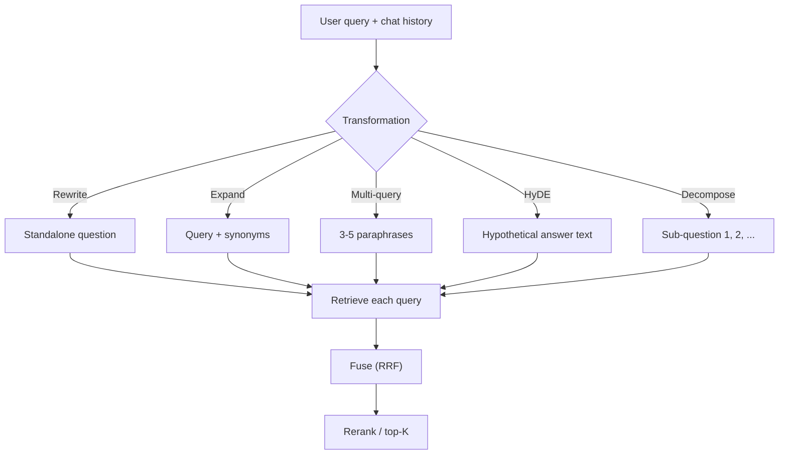

# Query Transformation

> **Interview answer (say this first).** Query transformation rewrites the user's input before retrieval. It turns a follow-up into a standalone question, expands a query with synonyms or related terms, generates several alternative queries, or invents a hypothetical answer to embed (HyDE). Each technique trades extra latency and LLM cost for better recall, so you add one only when your measured recall justifies it.

## Why this exists

Users do not write queries that retrieval likes.

They write follow-ups that only make sense in context:

```text
User: How do I configure SSO?
Bot:  You can set it up under Settings > Security.
User: and what about the second one?
```

The string `and what about the second one` has no searchable content. Embedded alone, it retrieves random "second" documents. The retrieval failure is not the index's fault; the query lost its context when it became a standalone string.

They write short, ambiguous queries:

```text
service dying
```

The document that answers it says `uncaught exceptions terminate the process`. Zero shared words, so sparse retrieval finds nothing and dense retrieval is doing all the work with a three-word query.

They write multi-part questions:

```text
How does our retry policy differ from the vendor's, and which one should I use for batch jobs?
```

One embedding for both parts is a blur of two topics. The batch-jobs document may lose to the retry-policy document, even though the user needs both.

And they use different vocabulary from the corpus. The user says `sign-in failed`; the document says `authentication error`. Dense retrieval may cross this, but sparse will not.

**Query transformation is the stage that fixes the query.** Retrieval can only be as good as the text you hand it. A five-cent LLM call that rewrites the query often improves recall more than a much more expensive embedding model.

Agent loops live and die by this. A ReAct-style agent turns its own reasoning into a search string, and its second action (`and the second endpoint?`) only makes sense with the first turn's context. Without rewriting and decomposition, the agent retrieves noise on every step after the first.

> **Note:**
>
> **The one-sentence purpose.** Transform the query into the best possible search input — usually more than one query — and retrieve with all of them.


## Start from zero

| Word | Plain meaning |
| --- | --- |
| **Query transformation** | Any step that changes the user's query before retrieval. |
| **Query rewriting** | Restating the query in clearer or more searchable words, keeping the same intent. |
| **Standalone question** | A rewrite that includes the context a follow-up omitted, so it makes sense without the chat history. |
| **Conversational RAG** | RAG over a chat, where every turn depends on earlier turns. Requires standalone rewrites. |
| **Query expansion** | Adding synonyms or related terms to the query. |
| **Synonym** | A different word with the same or similar meaning. |
| **Multi-query** | Generating several alternative queries for one user question, then merging the results. |
| **HyDE** | "Hypothetical Document Embeddings": make the LLM write a fake answer, then embed the fake answer instead of the query. |
| **Hypothetical document** | That fake answer. It uses document-like language, which embeds closer to real documents. |
| **Decomposition** | Splitting a multi-part question into independent sub-questions. |
| **Sub-query** | One part of a decomposed question. |
| **Fusion** | Merging the results of several queries into one ranked list. Usually RRF. |
| **RRF** | Reciprocal Rank Fusion, from the hybrid search chapter. |
| **Recall** | The fraction of truly relevant documents that were retrieved. Transformation mainly targets recall. |
| **Precision** | The fraction of retrieved documents that are relevant. Careless expansion lowers it. |
| **TTFT** | Time to first token: how long until an LLM starts replying. Adds to every transformation's latency. |
| **Guardrail** | A rule that keeps a transformation from hurting, e.g. always keep the original query too. |

Two ideas cause most confusion:

- **Transformation is not retrieval.** It changes the input text only. You still need a retriever and an index.
- **More queries means more recall but not automatically more precision.** Five rewrites find more relevant documents, and potentially more junk. Fusion and reranking control the junk.

## The core idea

Think of a reference librarian. A visitor mumbles "the thing about the second one" and the librarian does not run to the shelves. She first asks clarifying questions and rephrases: "You mean the second SSO option, the SAML setup?" Then she searches. Good query transformation is that rephrasing step, done automatically.

A second analogy: **translation**. Users speak user-language; the index speaks document-language. Rewriting, expansion, and HyDE are all ways to translate the query into the language the index understands.



| Technique | What it fixes | Extra cost | Worth it when |
| --- | --- | --- | --- |
| **Rewrite** | Vague or context-less queries | 1 LLM call | Always for conversational or messy input |
| **Expansion** | Vocabulary mismatch | 1 call or a lookup table | Sparse retrieval misses synonyms |
| **Multi-query** | One phrasing misses documents | 1 call + N retrievals | Recall matters more than latency |
| **HyDE** | Short query embeds poorly | 1 generation call | Queries are terse and documents are long |
| **Decomposition** | Multi-part questions | 1 call + N retrievals | Questions ask for comparisons or several facts |

That table is the decision map. The rest of the page explains each row.

## How it works

### Rewriting into a standalone question

1. **Send the chat history and the new message to a small LLM.**
2. **Ask it to rewrite the newest message into a question that stands alone**, resolving pronouns (`it`, `the second one`) and omitted nouns.
3. **Retrieve with the rewritten question.** Keep the original for logging and for the final answer generation.

### Query expansion

1. **Find terms related to the query's words.** A synonym dictionary, a thesaurus, or an LLM.
2. **Append them to the query**, usually with a lower weight or with `OR` in the boolean query.
3. **Retrieve.** Expansion mainly helps sparse retrieval, because dense already handles synonymy internally.

### Multi-query

1. **Ask the LLM for 3–5 paraphrases** of the user's question, or for different keyword formulations.
2. **Retrieve with each query** against the same index.
3. **Fuse the ranked lists with RRF**, exactly as in hybrid search. A document found by several phrasings rises to the top.
4. **Deduplicate and cut to top-K.**

### HyDE

1. **Ask the LLM to write a short answer to the question**, ignoring whether it is correct. The point is style, not truth: the fake answer uses document-like words.
2. **Embed the hypothetical answer** with the document embedding model instead of embedding the raw query.
3. **Search with that vector.** A paragraph about "uncaught exceptions terminating the process" lands near real documents about that topic, while the three-word query `service dying` does not.
4. **You may still mix in the raw query's results** by fusing both lists.

### Decomposition

1. **Detect that the question has several parts** (an LLM prompt can do this).
2. **Write one self-contained sub-question per part.**
3. **Retrieve each sub-question separately**, so each part gets its own context.
4. **Fuse or keep separate**, depending on whether the final answer needs all parts together. For a comparison, retrieve both sides and pass both contexts to the model.

> **Tip:**
>
> **The universal guardrail.** Always retrieve with the **original** query as well, and fuse. A transformation can drift, and the original is your only unbiased evidence of what the user asked.


## The syntax you will use

**Rewrite a follow-up into a standalone question.** This is the standard conversational-RAG prompt. It makes one LLM call before retrieval.

```python
from openai import OpenAI
client = OpenAI()

def standalone(history: list[dict], newest: str) -> str:
    prompt = (
        "Rewrite the user's newest message as a standalone question. "
        "Resolve pronouns using the chat history. "
        "Return only the question."
    )
    msgs = [{"role": "system", "content": prompt}, *history,
            {"role": "user", "content": newest}]
    out = client.chat.completions.create(model="gpt-4o-mini", messages=msgs, temperature=0)
    return out.choices[0].message.content.strip()
```

Use a small, cheap model. The task is a mechanical rewrite; it does not need a frontier model.

**Query expansion with a synonym map.** A dictionary is free, deterministic, and easy to test. An LLM is broader but adds latency.

```python
SYNONYMS = {
    "died":  ["crashed", "failed", "stopped"],
    "slow":  ["latency", "sluggish", "performance"],
    "login": ["sign-in", "authentication"],
}

def expand(query: str) -> tuple[str, list[str]]:
    words = query.lower().split()
    added = [syn for w in words for syn in SYNONYMS.get(w, [])]
    return " ".join(words + added), added
```

The returned `added` list is useful for logging: you can see which terms the expansion injected.

**Multi-query retrieval with RRF.** The fusion function is the same one from hybrid search.

```python
def reciprocal_rank_fusion(rankings: list[list[str]], k: int = 60) -> list[tuple[str, float]]:
    scores: dict[str, float] = {}
    for ranking in rankings:
        for rank, doc_id in enumerate(ranking, start=1):
            scores[doc_id] = scores.get(doc_id, 0.0) + 1.0 / (k + rank)
    return sorted(scores.items(), key=lambda pair: -pair[1])

queries = [user_query, *paraphrases]          # original first, always
rankings = [retrieve(q, top=20) for q in queries]
fused = reciprocal_rank_fusion(rankings)
```

**HyDE: generate, then embed the fake answer.** The generation prompt asks for an answer, not for a search query.

```python
def hyde(question: str, embed) -> list[float]:
    fake = client.chat.completions.create(
        model="gpt-4o-mini", temperature=0,
        messages=[{"role": "user",
                   "content": f"Write a short factual passage that answers: {question}"}],
    ).choices[0].message.content
    return embed(fake)          # embed the passage, not the question
```

You may fuse the results from `embed(fake)` and `embed(question)` so a bad hallucination cannot dominate.

**Decomposition prompt.** Ask for a JSON list so the output is machine-readable.

```python
prompt = (
    "Split the question into independent sub-questions. "
    'Return JSON: {"sub_questions": ["...", "..."]}. '
    "If it is already atomic, return one item."
)
```

Then parse with a validator (Pydantic) before using it, because LLM output is untrusted data.

**Fuse and cut.** After retrieval, take the top-K for the next stage.

```python
fused = reciprocal_rank_fusion(rankings)
top_k = [doc_id for doc_id, _ in fused[:10]]
```

## Examples: simple to real

**Example 1 — expansion bridges a lexical gap.** A five-document corpus, TF-IDF retrieval, query with no shared words:

```text
original: the service keeps dying unexpectedly
  top 3: d4 0.0000, d3 0.0000, d2 0.0000      # nothing matched

expanded: ... + "exceptions errors crash failure"
  top 3: d0 0.4082, d4 0.0000, d3 0.0000      # d0 = "handle uncaught exceptions..."
```

The original query and the right document share zero terms, so no amount of ranking helps. Adding related terms from a synonym or LLM pass creates the overlap. Dense retrieval would fix this too; expansion is the sparse-side fix.

**Example 2 — expansion with a synonym map.** Run the small dictionary above:

```text
original : the service died and login is slow
added    : ['crashed', 'failed', 'stopped', 'sign-in', 'authentication',
            'latency', 'sluggish', 'performance']
expanded : the service died and login is slow crashed failed stopped
           sign-in authentication latency sluggish performance
```

Now a document that says `authentication latency` will match, even though the user never used those words. Deterministic, cheap, testable.

**Example 3 — multi-query fusion rewards agreement.** Three ranked lists for the same question, fused with RRF at `k=60`:

```text
original: [d0, d4, d2]
rewrite : [d0, d2, d7, d4]
expand  : [d2, d0, d4, d9]

fused:
  d0: 0.048916   from ['original', 'rewrite', 'expand']   # found by all three
  d2: 0.048395   from ['original', 'rewrite', 'expand']
  d4: 0.047627   from ['original', 'rewrite', 'expand']
  d7: 0.015873   from ['rewrite']
  d9: 0.015625   from ['expand']
```

`d0` is the top of the original list, and it stays top because two other phrasings also found it. `d7` and `d9` were each found by only one query, so they sink. Agreement across rephrasings is exactly the signal you want.

**Example 4 — HyDE moves the vector toward the documents.** A geometric illustration with two-dimensional vectors:

```text
doc vector              = [1.00, 0.00]
cos(query, doc)         = 0.6000    # short query sits at an angle
cos(hypothetical, doc)  = 0.9507    # document-style passage is much closer
improvement             = +0.3507
```

The hypothetical answer is not factually checked; it is used only as a **better-shaped query**. If the LLM's fake answer is confidently wrong, though, it can pull the search toward the wrong topic — which is why you fuse with the raw query.

**Example 5 — rewriting a follow-up.** Given history about SSO and the message `and what about the second one?`, a rewrite step should output something like:

```text
standalone: "What are the configuration steps for the second SSO option, SAML?"
```

That string now retrieves the SAML document. Without the rewrite, the query is mostly stop words plus the ordinal `second`, with no searchable noun to match.

**Example 6 — decomposition for a comparison.** The compound question:

```text
How does our retry policy differ from the vendor's, and which should I use for batch jobs?
```

decomposes into:

```text
1. What is our retry policy?
2. What is the vendor's retry policy?
3. Which retry policy should be used for batch jobs?
```

Retrieving all three gives the model both policies and the batch-jobs context. One embedding for the whole sentence would probably surface only the retry-policy documents.

## In production

- **Always retrieve with the original query too, and fuse.** A rewrite can drop the user's actual words. Keeping the original costs one extra retrieval and prevents the worst failures.
- **Cap the number of transformed queries.** Three to five is typical. Each extra query multiplies retrieval latency and inflates the candidate list; ten rewrites usually hurt latency more than they help recall.
- **Use a cheap model for transformation.** Rewriting and expansion are mechanical. A small model with `temperature=0` is faster, cheaper, and more stable than a frontier model.
- **Cache transformations.** The same question from many users should not pay for a rewrite each time. Cache by normalized query text.
- **Do not transform self-contained short queries.** A direct search for `ERR-4032` should not be rewritten into a paragraph. Gate transformation on query features: length, pronouns, conjunctions, and chat history.
- **Beware expansion drift.** Adding wrong synonyms lowers precision. Measure expansion on labelled queries, and log the added terms so you can see the drift.
- **HyDE costs a full generation.** It is slower than a rewrite because it produces many tokens. Use it when queries are very short and documents are long, not as a default.
- **Decomposition changes the answer shape.** For comparisons, the model needs all sub-results together. Fusing them into one blob can lose which fact answers which part.
- **Validate LLM output.** A decomposition or rewrite is untrusted text. Parse JSON with a schema and fall back to the original query on failure.
- **Watch the total latency budget.** Rewrite plus N retrievals plus reranking can turn a 200 ms lookup into several seconds. Decide the budget before adding techniques.
- **Log every transformation.** Store the original query, the transformed queries, and each result list. Without this, you cannot tell whether a bad answer came from the rewrite or the retrieval.
- **A no-op is a valid transformation.** When the query is already clear and standalone, the correct rewrite is the query itself. Make the prompt allowed to say so.

> **Warning:**
>
> **The trap of always transforming.** Every LLM call adds latency, cost, and a new failure mode. If a plain query already retrieves the right document, transformation is pure overhead. Add it in response to a measured recall problem, not by default.


## Interview questions

### 1. What is query transformation, and why is it needed?

**Answer.** It is any step that rewrites the user's input before retrieval: making a follow-up standalone, adding synonyms, generating multiple paraphrases, writing a hypothetical answer, or splitting a multi-part question. It is needed because user text is messy and short, while retrieval needs clear, document-like input. Fixing the query often improves recall more cheaply than upgrading the embedding model.

**Follow-up: "Does it replace a good retriever?"** No. It improves the input to the retriever. A bad index still returns bad results from a perfect query.

**Trap.** Saying transformation is always worth it. Each step adds a model call and a failure mode. It should be justified by measured recall.

### 2. How do you handle a follow-up question in conversational RAG?

**Answer.** Rewrite the newest message into a standalone question using the chat history, then retrieve with that. For example, `and the second one?` becomes a full question naming the second option. Keep the original message for logging and fuse if you want extra safety.

**Follow-up: "What if the rewrite is wrong?"** Retrieve with the original as well and fuse, or check the rewrite with a cheap validator. Also cap the history you pass so stale context does not leak in.

**Trap.** Embedding the raw follow-up. It has no searchable content and retrieves essentially noise.

### 3. What is HyDE, and what problem does it solve?

**Answer.** HyDE asks an LLM to write a hypothetical answer to the question, then embeds that fake answer instead of the query. The fake answer uses document-like language, so its vector lands closer to real documents than a short query vector does. It solves the asymmetry between short queries and long documents.

**Follow-up: "Does the hypothetical answer need to be correct?"** No, it is used only as a query representation. But a confidently wrong answer can misdirect retrieval, so fuse its results with the raw query's results.

**Trap.** Thinking HyDE is a new retriever. It is a query-vector construction trick; the retriever and index are unchanged.

### 4. What is multi-query retrieval, and how do you combine the results?

**Answer.** Generate several paraphrases of the question, retrieve with each, then fuse the ranked lists — usually with RRF. Documents found by multiple paraphrases rise, because agreement across independent phrasings is evidence of relevance. It trades extra retrievals for higher recall.

**Follow-up: "How many queries?"** Three to five is the common range. More queries raise recall slowly and latency quickly, and the candidate list grows.

**Trap.** Summing raw similarity scores across paraphrases. Different queries produce different score scales; use ranks or normalise first.

### 5. When is decomposition the right transformation?

**Answer.** When the question contains several independent parts, especially comparisons or multi-hop questions. Splitting into self-contained sub-questions gives each part its own retrieval, so one topic does not crowd out the other. The final generation then gets all the retrieved contexts.

**Follow-up: "What is the risk?"** The model must reassemble the answers correctly, and a bad split can drop a part of the question. Validate the JSON and keep the original question for the final answer.

**Trap.** Decomposing simple atomic questions. It adds calls and can fragment a query that was already good.

### 6. What are the latency and cost costs of each technique?

**Answer.** Rewrite, expansion, and decomposition each cost roughly one LLM round trip. Multi-query costs one LLM call plus N retrievals. HyDE costs a full generation, so it is the slowest because it produces the most tokens. All of them push more candidates into the next stage.

**Follow-up: "How do you control it?"** Use a small model with `temperature=0`, cap the number of queries, cache transformations, gate them on query features, and set a total latency budget before adding anything.

**Trap.** Quoting a fixed millisecond number for an LLM call. Latency depends on the model, prompt length, load, and whether it is cached. Measure your own.

### 7. How do you know a transformation helped?

**Answer.** Compare Recall@K and NDCG with and without it on a labelled query set, and watch precision too. Transformation should raise recall without collapsing precision. Also segment by query type: a rewrite may help conversational queries and do nothing for keyword lookups.

**Follow-up: "What if precision drops?"** The transformation is drifting. Tighten the prompt, reduce expansion, or fuse with the original so the untransformed results still count.

**Trap.** Judging by a few hand-picked examples. Transformation effects are statistical and show up across a query set.

### 8. Expand the query "sign-in failed" for a corpus that says "authentication error".

**Answer.** Add the corpus's vocabulary: `sign-in failed login authentication error credentials`. In a boolean store, join them with `OR` and let ranking sort it out; in a dense store, you may not need expansion at all. Log which terms were added so you can tune.

**Follow-up: "What is the danger?"** `error` is common, so adding it can pull in every error document. Weight injected terms lower, or require at least one original term.

**Trap.** Expanding with generic words such as `error`, `help`, or `issue`. They have low IDF and mostly add noise.

## Remember this

- **Fix the query before fixing the retriever.** Transformation is often the cheapest recall win.
- **Follow-ups need a standalone rewrite**; otherwise they have no searchable content.
- **Multi-query + RRF rewards agreement** across phrasings. Use the original query as one of them, always.
- **HyDE embeds a fake document-style answer** to close the query-document length gap; fuse with the raw query.
- **Every transformation costs a model call and a retrieval.** Add one only when measured recall asks for it.
