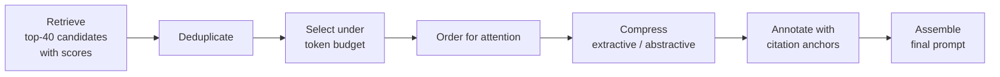

# Context Construction

> **Interview answer (say this first).** Context construction is the stage between retrieval and generation. Retrieval hands you a ranked list of candidate chunks; context construction decides which of them actually go into the prompt, in what order, at what size, and with what citation labels. It deduplicates, compresses, fits a token budget, and places the strongest evidence where the model attends best.

## Why this exists

Retrieval returns **candidates**, not a prompt. The model never sees a relevance score or a vector. It sees one block of text. Something has to turn "here are 40 chunks with scores" into "here are the 4 passages you should read, in this order, under this token limit, labelled `[S1]` to `[S4]`." That something is context construction, and it is where a good retrieval result can still become a bad answer.

Three failures show up again and again.

**Failure 1: the best chunk is buried.** Retrieval ranks chunk A first, but the pipeline dumps all 20 results in database order. The model reads a long middle of weak text and misses A. This is the **lost in the middle** effect: models use information at the start and end of the context more reliably than information in the middle.

**Failure 2: duplicates crowd out the answer.** The same refund policy appears in five places, so five near-identical chunks fill the budget. The answer is right, but there is no room for the shipping exception the user also asked about.

**Failure 3: the context overflows and truncates.** You retrieve 30 chunks of 400 tokens each — 12,000 tokens — into an 8,192-token window. The client silently cuts the tail, and the answer is generated without the evidence it needed.



Everything on the left is cheap. Everything on the right reaches the model, and mistakes there are expensive.

> **Note:**
>
> **The one-sentence purpose.** Context construction turns a ranked list of candidates into the smallest prompt that still contains the evidence the answer needs.


## Start from zero

| Word | Plain meaning |
| --- | --- |
| **Retrieval** | Searching a store for text relevant to the query. It returns a ranked list. |
| **Candidate** | One retrieved chunk being considered for the prompt. Not every candidate is used. |
| **Chunk** | A small piece of a document, usually a paragraph or a few sentences. |
| **Context window** | The maximum number of tokens a model can read and write in one call. |
| **Token** | A small piece of text, roughly 3–4 characters of English. Models count in tokens. |
| **Token budget** | The number of tokens you allow a part of the prompt, for example 4,000 for documents. |
| **Headroom** | Space deliberately left unused so the answer fits and quality stays high. |
| **Selection** | Choosing which candidates go into the prompt. |
| **Top-k** | How many candidates retrieval returns, for example the best 20. |
| **Relevance score** | A number, usually 0 to 1, saying how well a chunk matches the query. |
| **Deduplication** | Removing repeated or near-identical chunks. |
| **Near-duplicate** | Two chunks that say almost the same thing in slightly different words. |
| **Jaccard similarity** | Shared items divided by total items. Used to detect near-duplicates cheaply. |
| **Extractive compression** | Keeping only the most relevant sentences from a chunk, word for word. |
| **Abstractive compression** | Rewriting a chunk into a shorter summary in new words. |
| **Citation anchor** | A short label such as `[S1]` that points from the answer back to a source chunk. |
| **Metadata** | Extra fields attached to a chunk, such as document id, section, or date. |
| **Prompt assembly** | Joining system prompt, evidence, instructions, and question into one string. |
| **Lost in the middle** | The finding that facts in the middle of a long context are used less reliably. |

Two distinctions matter for the rest of the page: **selection is not ranking** (ranking says which chunk is most relevant; selection says which chunks fit the budget together), and **compression is not truncation** (cutting a chunk in half can remove the sentence that answered the question).

## The core idea

Think of a news editor laying out a front page. The wire service sends forty stories. The editor cannot print them all, so they:

1. drop the duplicates from the same press release,
2. keep the biggest story **above the fold**,
3. cut long stories down to the important paragraphs,
4. put a strong story at the bottom of the page too, because readers see the top and bottom first,
5. label every story with its source.

The editor is not changing the news. They are choosing what the reader can actually see. Context construction is that editor.

The two compression styles are genuinely different choices:

| | Extractive | Abstractive |
| --- | --- | --- |
| What it does | Keeps original sentences | Rewrites in new words |
| Risk | May leave out a needed sentence | May invent or distort facts |
| Cost | Cheap, local, deterministic | Needs an extra model call |
| Citations | Exact, easy to quote | Harder, quote may not exist verbatim |
| Use when | Precision and auditability matter | Chunks are long and mostly irrelevant |
| RAG default | **Yes** | Sparingly, with verification |

For a citable RAG system, **extractive is the safer default**. Abstractive compression is fine for summarising history or for chunks that are mostly noise, but it should never silently change a number or a policy.

## How it works

1. **Fix the document budget first.** Take the model window, subtract `max_tokens` for the answer, subtract the system prompt and safety margin, then split what remains between history and documents. Documents do not get the whole window.
2. **Count tokens, not characters.** Use the model's tokenizer. Character counts are wrong by large factors across languages and code.
3. **Remove exact duplicates by hash.** Hash each chunk's text with SHA-256 and keep the first occurrence.
4. **Remove near-duplicates by similarity.** Compare token or character overlap (Jaccard) and drop anything above a threshold, for example 0.8.
5. **Score candidates.** Use the reranker score, not raw vector distance. Reranking is a separate stage that has already improved the ordering.
6. **Select under the budget.** Walk the ranked list and add a chunk only if it fits. This greedy pass never exceeds the budget. A cost-aware variant sorts by score per token instead of score alone.
7. **Order for attention.** Put the strongest chunk first and the second strongest last. The middle is the weakest position, so the weakest evidence belongs there.
8. **Compress if needed.** If the selected set still exceeds the budget, shrink low-priority chunks. Prefer extracting the relevant sentences verbatim.
9. **Annotate.** Give every chunk a stable label (`[S1]`, `[S2]`) and attach metadata such as document id, section, and date. The label is what citations reference later.
10. **Assemble the prompt.** System instructions first, then the evidence block, then the citation rule, then the question last so it is fresh when generation starts.
11. **Log the selection.** Record which chunks were kept, dropped, and why, plus the final token count. When an answer is wrong, the first question is "what did the model not see?"

## The syntax you will use

**Count tokens with the real tokenizer.**

```python
import tiktoken

enc = tiktoken.get_encoding("cl100k_base")
count = lambda s: len(enc.encode(s))

print(count("Refunds are processed within five business days."))   # 9
```

The API bills and limits in tokens, so budget in tokens.

**Compute the document budget from the window.**

```python
def budget(context_window, max_output, fixed, safety=0.05, history_share=0.40):
    safe_input = int((context_window - max_output) * (1 - safety))
    remaining = safe_input - fixed
    history = int(remaining * history_share)
    return {"safe_input": safe_input, "history": history, "docs": remaining - history}

print(budget(8192, 1024, fixed=65))
# {'safe_input': 6809, 'history': 2697, 'docs': 4047}
```

Reserve the answer first, keep a safety margin, subtract the fixed prompt cost, then split the rest.

**Deduplicate exactly with a content hash.**

```python
import hashlib

seen, unique = set(), []
for c in chunks:
    h = hashlib.sha256(c["text"].encode()).hexdigest()
    if h not in seen:
        seen.add(h)
        unique.append(c)
```

Hash dedup is exact, fast, and catches copy-paste repetition.

**Detect near-duplicates with Jaccard similarity.**

```python
import re

def toks(s):
    return set(re.findall(r"[a-z0-9]+", s.lower()))

def jaccard(a, b):
    A, B = toks(a), toks(b)
    return len(A & B) / len(A | B)

print(round(jaccard("Refunds are processed within five business days to the original payment method.",
                    "Refunds are processed within 5 business days to the original payment method."), 3))
# 0.846
```

Above a threshold such as 0.8, keep only the higher-scored chunk. The loop below assumes the input list is already in descending score order, so the first copy seen is the one worth keeping; if the order is not guaranteed, compare the two scores explicitly.

**Select greedily under a budget.**

```python
def select(items, budget_tokens, key):
    out, used = [], 0
    for c in sorted(items, key=key, reverse=True):
        if used + c["tokens"] <= budget_tokens:
            out.append(c["id"])
            used += c["tokens"]
    return out, used
```

Pass `key=lambda c: c["score"]` for relevance, or `key=lambda c: c["score"] / c["tokens"]` for value per token.

**Compress extractively by sentence relevance.**

```python
def split_sentences(text):
    return [s.strip() for s in re.split(r"(?<=[.!?])\s+", text) if s.strip()]

def keep_relevant(text, query_tokens, keep=1):
    scored = [(len(query_tokens & toks(s)), i, s)
              for i, s in enumerate(split_sentences(text))]
    scored.sort(key=lambda x: (-x[0], x[1]))
    return " ".join(s for _, _, s in sorted(scored[:keep], key=lambda x: x[1]))
```

It keeps the original words, so the quote in the answer is still exact.

**Order for attention.** Best first, second best last.

```python
def order_for_attention(items):
    ranked = sorted(items, key=lambda c: c["score"], reverse=True)
    if len(ranked) <= 2:
        return ranked
    return [ranked[0]] + ranked[2:] + [ranked[1]]
```

The weak middle is now filled with the least useful evidence, not the best.

**Assemble the prompt with anchors.**

```python
def assemble(question, items, system):
    lines = []
    for i, c in enumerate(items, start=1):
        lines.append(f"[S{i}] source={c['id']} score={c['score']:.2f}")
        lines.append(c["text"])
        lines.append("")
    docs = "\n".join(lines)
    return (f"{system}\n\n<documents>\n{docs}</documents>\n\n"
            f"Cite sources as [S#]. If the documents do not answer the question, say so.\n\n"
            f"Question: {question}")
```

Each chunk carries a stable label and its metadata, and the question is the last thing the model reads.

## Examples: simple to real

**Example 1 — the document budget.** Same window math as the context-engineering chapter, applied to documents.

```python
print(budget(8192, 1024, fixed=65))
```

Measured output:

```text
{'safe_input': 6809, 'history': 2697, 'docs': 4047}
```

Documents get **4,047 tokens** here. That is the ceiling for retrieved evidence, not a target. One short policy sentence is 9 tokens, so a 400-token chunk is roughly 45 such sentences.

**Example 2 — deduplicate exact and near copies.** The candidate list contains one exact copy and one near copy of the refund policy. Exact dedup runs first, then Jaccard catches the rewording.

```python
chunks = [
    {"id": "policy-returns", "text": "Refunds are processed within five business days to the original payment method."},
    {"id": "policy-returns-copy", "text": "Refunds are processed within five business days to the original payment method."},
    {"id": "policy-returns-near", "text": "Refunds are processed within 5 business days to the original payment method."},
    {"id": "policy-shipping", "text": "Standard shipping is free for orders over 50 dollars and arrives in three to five days."},
    {"id": "blog-holiday", "text": "During the holiday season our warehouse team works around the clock to pack every order with care and joy."},
    {"id": "faq-tracking", "text": "You can track your order with the tracking number in your confirmation email."},
    {"id": "policy-warranty", "text": "Electronics carry a twelve month warranty covering manufacturing defects only."},
]

seen, exact = set(), []
for c in chunks:
    h = hashlib.sha256(c["text"].encode()).hexdigest()
    if h not in seen:
        seen.add(h)
        exact.append(c)
print("exact dedup dropped:", [c["id"] for c in chunks if c not in exact])

scores = {"policy-returns": 0.91, "policy-shipping": 0.55,
          "blog-holiday": 0.50, "faq-tracking": 0.65, "policy-warranty": 0.71}

kept = []
for c in exact:
    t = toks(c["text"])
    dup = None
    for k in kept:
        j = jaccard(c["text"], k["text"])
        if j >= 0.8:
            dup = (k["id"], round(j, 3))
            break
    if dup:
        print(f"near dup {c['id']} ~ {dup[0]} jaccard={dup[1]}")
    else:
        c["score"] = scores[c["id"]]
        kept.append(c)
print("final unique:", [c["id"] for c in kept])
```

Measured output:

```text
exact dedup dropped: ['policy-returns-copy']
near dup policy-returns-near ~ policy-returns jaccard=0.846
final unique: ['policy-returns', 'policy-shipping', 'blog-holiday', 'faq-tracking', 'policy-warranty']
```

Two copies removed, five useful chunks left. Dedup happens **before** selection so duplicates do not consume budget.

**Example 3 — selection under a tight budget.** With a 60-token document budget, the selector keeps four chunks and drops the long blog post.

```python
for c in kept:
    c["tokens"] = count(c["text"])

chosen, used = select(kept, 60, lambda c: c["score"])
print("selected:", chosen, "used:", used)
print("dropped :", [c["id"] for c in kept if c["id"] not in chosen])
```

Measured output:

```text
selected: ['policy-returns', 'policy-warranty', 'faq-tracking', 'policy-shipping'] used: 58
dropped : ['blog-holiday']
```

The 20-token blog chunk was dropped because higher-scored chunks claimed the space. The choice is explicit and logged.

**Example 4 — relevance per token changes the winner.** Score-only selection picks one big, expensive chunk. Value-per-token selection picks two smaller chunks instead.

```python
cands = [{"id": "big", "score": 0.99, "tokens": 35},
         {"id": "small1", "score": 0.90, "tokens": 12},
         {"id": "small2", "score": 0.85, "tokens": 12}]
print("score-only  :", select(cands, 40, lambda c: c["score"]))
print("score/token :", select(cands, 40, lambda c: c["score"] / c["tokens"]))
print("big density :", round(cands[0]["score"] / cands[0]["tokens"], 4),
      "small1 density:", round(cands[1]["score"] / cands[1]["tokens"], 4))
```

Measured output:

```text
score-only  : (['big'], 35)
score/token : (['small1', 'small2'], 24)
big density : 0.0283 small1 density: 0.075
```

Score-only protects the single best passage; value-per-token covers more ground. Choose on purpose and measure which wins on your task.

**Example 5 — compress a long chunk to the sentence that matters.** A 43-token chunk becomes 9 tokens by keeping only the sentence that overlaps the query.

```python
long = ("Refunds are processed within five business days. "
        "The refund goes back to the original payment method. "
        "During the holiday season our warehouse team works around the clock. "
        "Contact support if the refund has not arrived after ten days.")
comp = keep_relevant(long, toks("how long do refunds take"), keep=1)
print("compress:", count(long), "->", count(comp), "|", comp)
```

Measured output:

```text
compress: 43 -> 9 | Refunds are processed within five business days.
```

The remaining sentence is word-for-word from the source, so a citation can quote it exactly. The holiday-warehouse sentence was dropped as irrelevant.

**Example 6 — order and assemble the final prompt.** Best chunk first, second-best last, question at the end.

```python
selected = [c for c in kept if c["id"] in set(chosen)]
ordered = order_for_attention(selected)
prompt = assemble("how long do refunds take", ordered,
                  "You are a support agent. Answer only from the documents.")
print("ordered :", [c["id"] for c in ordered])
print("prompt tokens:", count(prompt), "chars:", len(prompt))
```

Measured output:

```text
ordered : ['policy-returns', 'faq-tracking', 'policy-shipping', 'policy-warranty']
prompt tokens: 158 chars: 674
```

The two strongest chunks (`policy-returns` at 0.91 and `policy-warranty` at 0.71) sit at the edges. The two weaker chunks sit in the middle. The whole prompt is 158 tokens — well inside budget, and already labelled `[S1]` to `[S4]` for citation.

## In production

- **Deduplicate before you select, not after.** Duplicates consume budget and make the model over-weight one repeated claim. Hash exact matches, Jaccard or embedding similarity for near ones.
- **Use the reranker score, not the raw vector distance.** Vector distance is only good enough to fetch candidates; it is not calibrated for the final cut. Select on the rerank score.
- **Place the best evidence first and second-best last.** The middle of a long context is the weakest position. Putting your best chunk there is a self-inflicted wound.
- **Never fill the budget just because it is there.** Every weak chunk is a distractor. A relevance threshold with an abstention path beats always filling the window.
- **Prefer extractive compression for citable content.** Abstractive summaries can change numbers and policies, and then your citation points at text that does not say what the answer says.
- **Keep anchors stable within a request.** `[S1]` must always mean the same chunk for that answer. Renumbering mid-generation breaks citations.
- **Attach metadata, do not just concatenate text.** Document id, section, date, and version let you render a citation, filter stale content, and debug later.
- **Count tokens with the target model's tokenizer.** A budget computed with another model's tokenizer can be off by enough to truncate.
- **Watch the number of chunks, not only the token count.** Many tiny chunks add separators, labels, and attention load. Five 100-token chunks are not equivalent to one 500-token chunk.
- **Compression can break coreference.** "It shipped yesterday" alone loses what "it" refers to. Keep the subject sentence or rewrite carefully.
- **Treat retrieved text as untrusted data.** A chunk can contain instructions. Delimit it, and never let retrieved content change the system rules.

## Interview questions

### 1. What is context construction, and how is it different from retrieval?

**Answer.** Retrieval finds and ranks relevant chunks. Context construction decides which of those chunks actually enter the prompt, in what order, at what size, and with what labels. It handles deduplication, selection under a token budget, compression, ordering, metadata, and final assembly. It is the last stage before generation.

**Follow-up: "Why not just pass the top 20 chunks?"** Cost, latency, and accuracy all suffer. Weak chunks are distractors, duplicates waste budget, and the best chunk may land in the weak middle of the context.

**Trap.** Treating context construction as string concatenation. Every choice here changes the answer, and it is testable.

### 2. What is "lost in the middle", and how does it change your ordering?

**Answer.** Models use information at the beginning and end of the context more reliably than information in the middle. So you put the strongest evidence first and the second strongest last, and let weaker evidence occupy the middle. You also restate the question or key rule at the end.

**Follow-up: "Does a bigger window fix it?"** No. The middle is still the weakest position even with a much larger window. Retrieve less, order better.

**Trap.** Dumping chunks in database order or ascending score order, which puts the best chunk at the end of a long preamble — or worse, in the middle.

### 3. How do you detect near-duplicate chunks?

**Answer.** Exact duplicates by SHA-256 content hash. Near-duplicates by similarity — token-set Jaccard, character n-gram overlap, or embedding cosine — keeping only the highest-scored copy above a threshold such as 0.8.

**Follow-up: "What is the risk of a low threshold?"** You delete genuinely different chunks that share boilerplate wording, like two policies with the same header. Tune the threshold on labelled data.

**Trap.** Only hashing exact strings and assuming that is deduplication. Real corpora repeat the same content with small wording changes.

### 4. Extractive versus abstractive compression — which do you use and why?

**Answer.** Extractive keeps original sentences verbatim; abstractive rewrites them. For citable RAG, extractive is the default because the quote in the answer really exists in the source and numbers cannot be silently changed. Abstractive compression is useful for long, mostly irrelevant text or for summarising history, but it needs verification.

**Follow-up: "When is abstractive worth it?"** When a chunk is mostly boilerplate and a faithful short summary saves a lot of budget, and when you can check the summary against the source.

**Trap.** Summarising a policy chunk and then citing it, when the summary no longer matches the wording the citation points to.

### 5. How do you fit the evidence into a token budget?

**Answer.** Reserve the output tokens and a safety margin, subtract the system prompt, then give documents a share of what remains. Count each candidate with the real tokenizer, rank by reranker score, and greedily add chunks while they fit. If it still overflows, compress low-priority chunks or lower top-k.

**Follow-up: "What goes into the budget besides retrieval?"** The system prompt, tool schemas, conversation history, memory, few-shot examples, the citation instructions, and the reserved answer space.

**Trap.** Budgeting top-k by average chunk size with no hard cap. One unusually large chunk blows the budget and truncation cuts the tail.

### 6. What metadata do you attach to a chunk, and why?

**Answer.** At minimum a stable source id and chunk id, plus document title, section or heading, date or version, and the relevance score. The id makes citations and auditability possible; the section and title make the citation readable; the date and version let you drop stale content.

**Follow-up: "How does that affect the prompt?"** Metadata can be rendered as a short header per chunk, for example `[S1] doc=returns-v3 section=Refunds`. It costs a few tokens and pays back in citation quality and debugging.

**Trap.** Storing only the chunk text. Then you cannot cite it, filter it, or find its origin when the answer is wrong.

### 7. How do you decide how many chunks to include?

**Answer.** Start from the token budget and average chunk size as a ceiling, then tune down using task accuracy. More chunks add distractors and latency. Rerank and keep only those above a relevance threshold, and abstain when nothing clears it.

**Follow-up: "What if the answer needs two sources?"** Coverage matters as well as score. Diversity-aware selection such as maximal marginal relevance (MMR), which trades a little relevance for less redundancy, avoids picking five near-identical chunks that all say the same thing.

**Trap.** Using the window size to set top-k. Fitting is not the same as being useful.

### 8. How would you debug an answer that missed evidence present in retrieval?

**Answer.** Log the full selection: candidates with scores, kept and dropped ids, final order, per-chunk tokens, and the assembled prompt. Check whether the needed chunk was deduplicated away, outranked, dropped for budget, compressed badly, or placed in the weak middle. Then re-run with only that chunk to confirm context construction was the cause.

**Follow-up: "What would you change first?"** Reorder so the best evidence is first, and remove distractors. Most of these bugs are ordering and relevance problems before they are size problems.

**Trap.** Adding more chunks to fix it. Extra text usually makes the answer worse, not better.

## Remember this

- Context construction is the step that turns **candidates into the prompt**: select, dedupe, order, compress, label, assemble.
- **Deduplicate before selecting.** Duplicates waste budget and distort attention.
- **Order matters:** best evidence first, second best last, weak evidence in the middle, question at the end.
- **Budget is a ceiling, not a target.** Use the real tokenizer, reserve output space, and do not fill the window.
- **Prefer extractive compression for cited content** so every quote is exact and every number is traceable.
