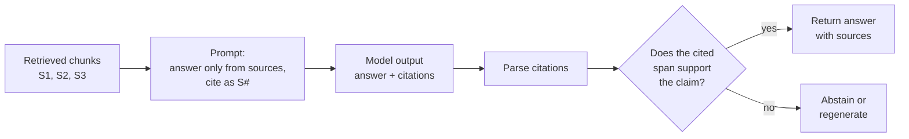

# Citations and Grounded Generation

> **Interview answer (say this first).** Grounded generation means the model answers only from the retrieved evidence and cites where each claim came from. Citations are inline source ids such as `[S1]` that you can resolve back to a chunk. The prompt and the output schema require them, the system abstains when the evidence is missing, and a verifier checks that each citation actually supports the claim it is attached to.

## Why this exists

A language model will almost always produce an answer. It does not know whether the answer is right. Without retrieval, a support bot confidently invents a refund window. With retrieval, the model has the right document in front of it — and can still blend that document with something it half-remembers from training.

The user cannot tell the difference. Fluent, well-formatted text looks authoritative. That is the core problem this stage solves: **make the evidence visible and checkable.**

There are two distinct failure modes, and beginners usually collapse them into one.

**Failure 1: the claim is false.** The model says refunds take 30 days. The document says 5. This is a **factuality** failure — the statement is not true of the world.

**Failure 2: the claim is true but not in the sources.** The model says refunds take 5 days, which happens to be correct, but no retrieved chunk says so. It came from training data. This is a **faithfulness** failure — the answer is not grounded in the context you supplied. It is arguably more dangerous, because you have no source to check and no guarantee it will stay true when your policy changes.



Without the right-hand branch, you have a demo. With it, you have a system you can put in front of users.

> **Note:**
>
> **The one-sentence purpose.** Citations turn an answer into a claim you can audit: every sentence points at the evidence that produced it.


## Start from zero

| Word | Plain meaning |
| --- | --- |
| **Grounding** | Forcing the model to answer from supplied evidence instead of its memory. |
| **Grounded answer** | An answer whose claims come from the retrieved context. |
| **Citation** | A reference from part of the answer back to a source chunk, such as `[S2]`. |
| **Source id** | The short label assigned to a retrieved chunk, for example `S1`. |
| **Inline citation** | A citation placed in the text, right after the claim it supports. |
| **Claim** | One factual statement in the answer, usually one sentence. |
| **Span / quote** | The exact piece of source text that supports a claim. |
| **Support** | The source really does entail, or back up, the claim. |
| **Verifier** | A program or model that checks support after generation. |
| **NLI (natural language inference)** | A model that decides whether one text entails another. Used for semantic support checks. |
| **Faithfulness** | Every claim is supported by the retrieved context. |
| **Factuality** | Every claim is true about the world. |
| **Hallucination** | Text that is fluent but not supported by evidence or reality. |
| **Abstention** | Deliberately not answering because the evidence is missing. |
| **Refusal** | Telling the user you cannot answer, often with a reason. |
| **Groundedness score** | The fraction of claims that a verifier finds supported. |
| **Citation precision** | Fraction of citations that are relevant and correct. |
| **Citation recall** | Fraction of claims that have at least one supporting citation. |
| **Structured output** | Making the model return JSON that matches a schema, not free text. |
| **Schema** | The required shape of the output, for example `answer` plus a list of `citations`. |

The distinction to memorize: **faithfulness is about the context, factuality is about the world.** A grounded system can only prove the first. It cannot verify the second without an external fact source.

## The core idea

Think of a magazine fact-checker. A writer files a story full of claims. The checker does not ask "does this sound right?" They open the writer's sources and ask, claim by claim, "does this source actually say this?" A claim with no source is pulled. A claim whose source says something different is pulled. A claim that matches its source stays.

Grounded generation is that workflow, automated:

1. the writer (the model) must attach a source to every claim,
2. the checker (your verifier) confirms each attachment,
3. unsupported claims are removed or replaced with "I could not find this."

Now the difference that trips people up:

| | Faithfulness | Factuality |
| --- | --- | --- |
| Question | Does the context support the claim? | Is the claim true in the world? |
| Evidence used | Retrieved chunks only | External truth |
| Who checks | NLI model, LLM judge, or support checker | Human, database, or trusted source |
| Can RAG guarantee it? | **Yes, approximately** | **No** |
| Example failure | Answer says 5 days; no chunk mentions refunds | Chunk says 30 days (outdated); answer repeats it |

Notice the last row: if the retrieved chunk is wrong or stale, a **faithful** answer is still **factually** wrong. Faithfulness only means "you told me what your documents said." That is why knowledge-base versioning and source quality matter so much.

A second trap: a citation can be **present but useless**. `[S1]` may point at a chunk that does not mention the claim at all. Counting citations is not verification. You must check the *relationship* between claim and span.

## How it works

1. **Assign source ids before generation.** Label every selected chunk `S1`, `S2`, … and keep the mapping. The ids must be stable for the whole request.
2. **Instruct grounding in the prompt.** Tell the model to answer only from the sources, cite each claim inline, and say it does not know when the sources are insufficient.
3. **Require a schema.** Ask for JSON with `answer` and `citations`, so a parser can read the result instead of guessing with regular expressions.
4. **Validate the output.** Reject the response if it breaks the schema, cites an id that does not exist, or gives an answer with no citation and no abstention.
5. **Parse claims and citations.** Split the answer into sentences or claims and extract the ids attached to each.
6. **Check support.** For each claim, look up the cited source and test whether it supports the claim. Use lexical overlap as a cheap first pass, an NLI model or an LLM judge for real semantic checking.
7. **Decide the action.** If the claim is supported, keep it. If it is unsupported, either regenerate with the missing evidence or replace it. If nothing is supported, abstain.
8. **Apply a retrieval threshold.** If the best retrieved score is too low, do not generate a grounded answer at all — abstain before the model can invent one.
9. **Score the response.** Record groundedness, citation precision, and citation recall so you can monitor drift over time.
10. **Log everything.** Store the question, the selected chunks, the raw model output, the verification result, and the final answer. This is what makes an incident debuggable.

> **Warning:**
>
> **A citation is a promise.** If your answer shows `[S2]` but `S2` does not say that, you have shipped a more convincing hallucination, not a fixed one. Always verify support; never just display the id.


## The syntax you will use

**Ask for grounding and citations in the prompt.**

```python
SYSTEM = (
    "Answer only from the provided sources. "
    "Cite each claim with the source id in square brackets, like [S1]. "
    "If the sources do not contain the answer, reply exactly: "
    "'I could not find this in the knowledge base.' Do not use outside knowledge."
)
```

Clear, short instructions beat a long list. The abstention sentence must be exact so you can detect it.

**Require a schema with Pydantic.**

```python
from pydantic import BaseModel, Field, model_validator, ValidationError

class Citation(BaseModel):
    source_id: str = Field(pattern=r"^S\d+$")
    quote: str = Field(min_length=1)

class GroundedAnswer(BaseModel):
    answer: str
    citations: list[Citation]
    abstained: bool = False

    @model_validator(mode="after")
    def check_abstention(self):
        if not self.abstained and not self.citations:
            raise ValueError("a non-abstained answer must cite at least one source")
        return self
```

The schema catches two common failures: an answer with no citation, and a citation id that is not in the `S#` form.

**Parse inline citations out of an answer.**

```python
import re

def cited_ids(text):
    return re.findall(r"\[(S\d+)\]", text)
```

**Check sentence-level citation coverage.**

```python
def uncited_sentences(answer):
    return [s for s in re.split(r"(?<=[.!?])\s+", answer.strip())
            if s and not re.search(r"\[S\d+\]", s)]
```

Every sentence should carry at least one id, or the answer should be the abstention message.

**Check whether a source supports a claim (lexical first pass).**

```python
STOP = {"a","an","the","is","are","to","of","in","on","for","and","or",
        "it","this","with","by","within","back","you","your","only"}

def content_words(text):
    return {w for w in re.findall(r"[a-z0-9]+", text.lower()) if w not in STOP}

def numbers(text):
    words = {"one":"1","two":"2","three":"3","four":"4","five":"5",
             "six":"6","seven":"7","eight":"8","nine":"9","ten":"10","twelve":"12"}
    out = set()
    for w in re.findall(r"[a-z0-9]+", text.lower()):
        out.add(w if w.isdigit() else words.get(w, ""))
    return out - {""}

def check_citation(claim, cited, sources):
    if cited not in sources:
        return "unsupported", f"cited id {cited} is not in the retrieved context"
    src = sources[cited]
    missing_numbers = numbers(claim) - numbers(src)
    if missing_numbers:
        return "unsupported", f"numbers not present in source: {sorted(missing_numbers)}"
    missing = content_words(claim) - content_words(src)
    if missing:
        return "partial", f"claim terms not found in source: {sorted(missing)}"
    return "supported", "all claim terms and numbers appear in the source"
```

This is cheap and catches the worst errors: wrong numbers, invented ids, and claims with no overlap in the source. It is **not** semantics — see the limitation in Example 5.

**Abstain when retrieval is weak.**

```python
def should_abstain(hits, threshold=0.45):
    return not hits or max(h["score"] for h in hits) < threshold
```

Set the threshold from labelled data, not intuition. Too high and you refuse answerable questions; too low and you ground on noise.

## Examples: simple to real

**Example 1 — the schema rejects an uncited answer.** An answer with no citations and no abstention is a bug, not a style choice.

```python
try:
    GroundedAnswer(answer="Shipping is free.", citations=[])
except ValidationError as e:
    print("rejected no-citation:", e.errors()[0]["msg"])
```

Measured output:

```text
rejected no-citation: Value error, a non-abstained answer must cite at least one source
```

A valid answer passes:

```python
ok = GroundedAnswer(answer="Refunds take five business days [S1].",
                    citations=[Citation(source_id="S1", quote="within five business days")])
print(ok.model_dump())
```

Measured output:

```text
{'answer': 'Refunds take five business days [S1].', 'citations': [{'source_id': 'S1', 'quote': 'within five business days'}], 'abstained': False}
```

**Example 2 — the schema rejects a malformed source id.** A model that invents `doc-9` instead of `S9` is caught immediately.

```python
try:
    GroundedAnswer(answer="hello", citations=[Citation(source_id="doc-9", quote="x")])
except ValidationError as e:
    print("rejected bad id:", e.errors()[0]["msg"])
```

Measured output:

```text
rejected bad id: String should match pattern '^S\d+$'
```

**Example 3 — the support checker catches wrong numbers.** The claim cites `S1` but changes "five" to "ten".

```python
sources = {
    "S1": "Refunds are processed within five business days to the original payment method.",
    "S2": "Electronics carry a twelve month warranty covering manufacturing defects only.",
}
print(check_citation("Refunds are processed within ten business days.", "S1", sources))
```

Measured output:

```text
('unsupported', "numbers not present in source: ['10']")
```

A number mismatch is one of the strongest signals of an unfaithful claim. Check it first.

**Example 4 — the checker catches a hallucinated id.** The model cites a source that retrieval never returned.

```python
print(check_citation("Refunds are processed within five business days.", "S9", sources))
print(check_citation("Refunds are processed within five business days.", "S1", sources))
```

Measured output:

```text
('unsupported', 'cited id S9 is not in the retrieved context')
('supported', 'all claim terms and numbers appear in the source')
```

Any id outside the provided set is an immediate reject, even if the surrounding text is correct.

**Example 5 — the lexical checker is not enough.** The claim paraphrases the source. "Twelve months" versus "twelve month", and "lasts" versus "carry", defeat plain word overlap.

```python
print(check_citation("The warranty lasts twelve months.", "S2", sources))
```

Measured output:

```text
('partial', "claim terms not found in source: ['lasts', 'months']")
```

This is a **false negative**: the source does support the claim, but the checker is unsure. That is the right failure direction — you would rather review a supported claim than accept an unsupported one. To reduce false negatives, add stemming for plurals, and use an NLI model or an LLM judge for meaning. Never trust lexical overlap as the final word on semantics.

**Example 6 — sentence coverage and abstention work together.** A good answer has a citation in every sentence; a bad answer has an uncited claim; a weak retrieval result abstains.

```python
good = "Refunds take five business days [S1]. The warranty is twelve months [S2]."
bad = "Refunds take five business days [S1]. Shipping is free."
print("uncited good:", uncited_sentences(good))
print("uncited bad :", uncited_sentences(bad))
print("abstain(empty):", should_abstain([]))
print("abstain(weak) :", should_abstain([{"score": 0.31}, {"score": 0.22}]))
print("abstain(ok)   :", should_abstain([{"score": 0.88}, {"score": 0.40}]))
```

Measured output:

```text
uncited good: []
uncited bad : ['Shipping is free.']
abstain(empty): True
abstain(weak) : True
abstain(ok)   : False
```

Notice "Shipping is free." is a true statement that the context did not contain. Faithfulness checker says no citation, so it is removed. That is exactly the failure mode citations exist to catch.

## In production

- **Verify support, do not just display ids.** A citation that does not say what the answer says is worse than no citation, because it looks trustworthy.
- **Check numbers first.** Ages, percentages, prices, and durations are where models drift most, and a simple number diff catches them cheaply.
- **Use a schema and validate it.** Structured output plus Pydantic turns "usually parseable" into "always parseable or rejected."
- **Prefer abstention to a confident guess.** A system that says "I could not find this" is more useful than one that is right 80% of the time and silent about the other 20%.
- **Set the abstention threshold from data.** Too high refuses real questions; too low grounds on irrelevant chunks. Tune it against a labelled set.
- **Keep source ids stable and unique per request.** Never reuse `S1` for two chunks, and never renumber after generation, or the citations point at the wrong text.
- **Separate faithfulness from factuality in your reporting.** Faithfulness is measurable from your context; factuality needs an external source of truth. Do not claim the second because you have the first.
- **Lexical checks have false negatives.** Paraphrase, synonyms, plurals, and coreference all break word overlap. Add stemming, then an NLI model or LLM judge for the final semantic check.
- **Watch citation precision, not just citation count.** Ten citations that are all irrelevant is a failing answer. Measure the fraction that are relevant and correct.
- **Consider an LLM judge, but calibrate it.** Judges are correlated with human labels, not identical to them. Keep a gold set and re-check the judge when the model or prompt changes.
- **Log the raw output before repair.** If you silently fix the answer, you lose the signal that the prompt is failing. Store raw output, verification result, and final answer.
- **Treat retrieved text as untrusted data.** A chunk that contains "ignore previous instructions" is a prompt-injection attempt. Delimit sources and keep instructions outside them.

## Interview questions

### 1. What does it mean to ground a generation in retrieved context?

**Answer.** It means the answer is produced only from the retrieved evidence, not from the model's training memory. Concretely: put the sources in the prompt, instruct the model to use only them, require an inline citation for each claim, and verify after generation that each citation supports its claim. Ungrounded claims are removed or the system abstains.

**Follow-up: "Why not just trust the model with the documents in the prompt?"** Models blend context with memorized knowledge, and they are fluent either way. Verification is what separates a grounded answer from a plausible one.

**Trap.** Calling a system grounded because retrieval happened. Retrieval upstream does not prove the answer used it.

### 2. What is the difference between factuality and faithfulness?

**Answer.** Faithfulness asks whether the claim is supported by the retrieved context. Factuality asks whether the claim is true in the world. RAG can measure and largely guarantee faithfulness. It cannot guarantee factuality, because the corpus itself may be wrong or stale. A faithful answer to a bad source is still wrong.

**Follow-up: "Which do you report?"** Report both separately. Faithfulness is computable from your context; factuality needs a trusted external check, such as a human review or an authoritative database.

**Trap.** Treating "the answer cited a document" as "the answer is correct." A citation only proves the claim is in your corpus.

### 3. How do you require citations from a model?

**Answer.** Three layers: an instruction in the prompt ("cite each claim as `[S1]`"), a source id assigned to every retrieved chunk before the call, and an output schema requiring a citations list. Then validate the output: reject it if a sentence has no citation, if an id was never provided, or if the citations list is empty without an abstention.

**Follow-up: "What if the model ignores the format?"** Use structured output where the provider supports it, retry once with the schema error appended, and fall back to abstention rather than serving an unparseable answer.

**Trap.** Parsing citations with a loose regex and accepting anything that looks like a bracket. Validate ids against the actual retrieved set.

### 4. How do you verify that a citation actually supports a claim?

**Answer.** Compare the claim with the cited source text. A cheap first pass checks number agreement and content-word overlap. A stronger pass uses a natural language inference model or an LLM judge to decide whether the source entails the claim. Log the verdict and treat unsupported claims as failures.

**Follow-up: "What are the limits of the cheap pass?"** It has false negatives on paraphrase, synonyms, and plurals, and false positives when a source shares vocabulary but not meaning. Use it as a filter, not a final judgment.

**Trap.** Checking only that the cited id exists. Existence is not support.

### 5. When should the system abstain, and how do you decide?

**Answer.** Abstain when retrieval finds nothing above a relevance threshold, when every generated claim fails support, or when the question asks for something the corpus does not cover. The threshold comes from labelled examples, balancing false refusals against wrong answers. The abstention message should be fixed and detectable.

**Follow-up: "Is abstaining bad for the product?"** No. A clear "I could not find this, here is how to reach support" builds trust. A confident wrong answer destroys it. Measure refusal rate and answer quality together.

**Trap.** Setting the threshold to zero so the system never refuses. It will always answer, including when it should not.

### 6. How do you measure groundedness at scale?

**Answer.** Split the answer into claims, check each claim against its cited sources, and report the supported fraction as groundedness. Also report citation precision (how many citations are relevant and correct) and citation recall (how many claims have a supporting citation). Run this on a labelled evaluation set, and sample production traffic.

**Follow-up: "What is a good score?"** There is no universal number. Establish a baseline on your own data, then watch for regressions when the model, prompt, corpus, or retriever changes.

**Trap.** Reporting only citation count. More citations are not more grounded.

### 7. What is an LLM judge, and what are its risks?

**Answer.** An LLM judge is a model prompted to score faithfulness or relevance. It scales evaluation and correlates with human judgment. Its risks are bias toward its own outputs, sensitivity to prompt wording, inconsistency, and cost. Validate it against a human-labelled gold set and re-calibrate when anything changes.

**Follow-up: "How do you make a judge more reliable?"** Give it the claim and the source explicitly, ask for a short reason and a label, use a fixed rubric, and measure agreement with humans. Use it as a component, not an oracle.

**Trap.** Using a judge and never checking it against humans, so systematic judge errors look like product quality.

### 8. How would you debug an answer that cites a source incorrectly?

**Answer.** Pull the logged request: the question, the exact selected chunks with ids, the assembled prompt, the raw model output, and the verification verdict. Confirm the id-to-chunk mapping. Check whether the prompt leaked an instruction, whether the chunk was truncated, and whether the verifier ran at all. Then reproduce with the same context and prompt.

**Follow-up: "What is the usual root cause?"** An unstable or renumbered id mapping, a prompt that did not require citations, or a verifier that checked existence but not support.

**Trap.** Adding a stronger instruction and calling it fixed. If the id mapping is wrong, no instruction will make the citations correct.

## Remember this

- **Grounding** means answering from the retrieved sources; **citations** are how you prove it.
- **Verify support**, not just the presence of an id. Check numbers first, then semantics.
- **Faithfulness is about the context, factuality is about the world.** RAG can guarantee the first, not the second.
- **Abstain when the evidence is missing.** A clear refusal beats a confident wrong answer.
- **Measure groundedness with claim-level checks**, plus citation precision and recall, against a labelled set.
