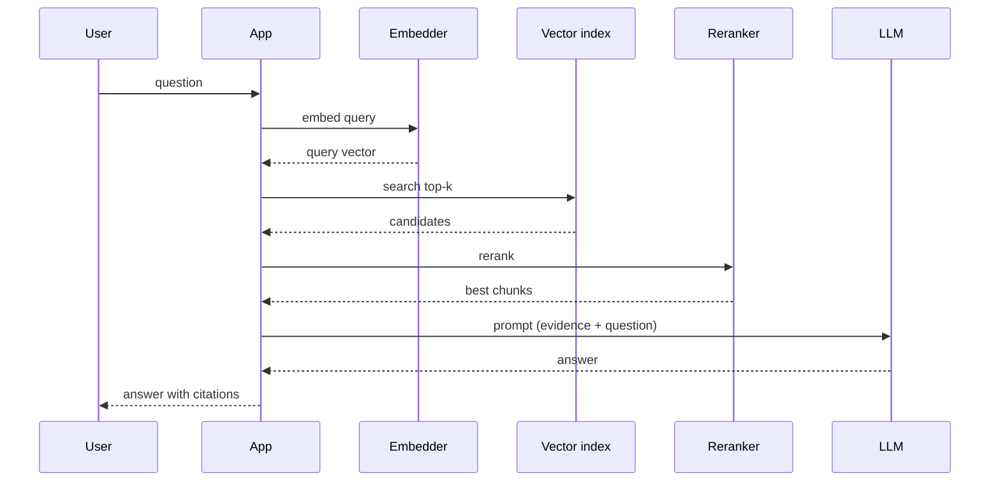

# RAG Caching and Latency

> **Interview answer (say this first).** RAG latency is the sum of four stages: embedding the query, searching the index, reranking, and generating the answer. Generation usually dominates, so you budget each stage, measure p50 and p95 rather than the mean, and cut the tail with caching and parallelism. Cache embeddings by text hash, cache results by exact query, add a semantic cache for near-duplicates, precompute the corpus offline, and run independent retrievals in parallel.

## Why this exists

A RAG answer feels fast or slow to a user long before a dashboard says so. People notice a two-second pause and abandon sooner. The engineering problem is not "make it fast on average"; it is "make almost every request fast, and keep the slow ones bounded."

Four stages sit between the question and the answer:



Two mistakes make this slow.

**Mistake 1: optimizing the mean.** Suppose the average request takes 900 ms. That sounds fine, but the p95 is 4 seconds, and 1 in 20 users waits that long — often on the complex, important questions. The mean hides them. **Measure the tail.**

**Mistake 2: paying for the same work twice.** Users ask the same question repeatedly. "How do I reset my password?" is asked thousands of times. Embedding it and generating an answer each time is wasted money and latency. The corpus side is worse: unchanged chunks should never be re-embedded.

```text
request breakdown (example)
embed query      40 ms
vector search    25 ms
rerank          120 ms
generate      1,200 ms   <- dominates
--------------------------------
total         1,385 ms
```

The generation call is the biggest line item and the hardest to change, so the cheap wins are everywhere else.

> **Note:**
>
> **The one-sentence purpose.** Set a latency budget per stage, measure the slow tail, and cache or precompute everything that does not change between requests.


## Start from zero

| Word | Plain meaning |
| --- | --- |
| **Latency** | How long a request takes, from send to answer. |
| **p50 (median)** | Half of requests finish faster than this. The typical case. |
| **p95** | 95% of requests finish faster than this. The tail users feel. |
| **p99** | 99% finish faster. Matters at high traffic and in SLAs. |
| **Tail latency** | The slow requests at p95 and beyond. |
| **SLO** | Service level objective: the latency target you set for yourself (an SLA is one you promise a customer). |
| **Latency budget** | A planned time allowance per stage that must sum under the SLO. |
| **Headroom** | Space left in the budget for variance and retries. |
| **Cache** | A store of work you already did, keyed so you can find it again. |
| **Cache hit / miss** | The value was found / not found, so you compute and store it. |
| **Hit rate** | Hits divided by total requests. |
| **TTL** | Time to live: how long a cached value stays valid. |
| **Exact cache** | Key is the exact query text or its hash. |
| **Semantic cache** | Key is the meaning of the query, found by embedding similarity. |
| **Embedding cache** | Reuse the vector for text you have embedded before. |
| **Prompt cache** | Provider feature that reuses work for a repeated prompt prefix. |
| **Precomputation** | Doing work ahead of time, offline, so serving does less. |
| **ANN** | Approximate nearest neighbour search: faster than exact, slightly less precise. |
| **nprobe / ef_search** | ANN knobs. Higher values scan more and raise recall, at higher latency. |
| **Recall@k** | Fraction of the true top-k results the approximate search actually found. |
| **Invalidation** | Removing cached entries when the source changes. |
| **Cold start** | The first requests after a deploy or cache flush have no cached data. |
| **Thundering herd** | Many requests miss the cache at once and stampede the backend. |

Two terms decide most designs: **manage p95, not the mean** (the tail is what users feel), and **treat cache-key design as correctness** (omit tenant, filters, or index version and a hit can return someone else's data — a security bug, not a performance bug).

## The core idea

Think of a busy restaurant kitchen. Some dishes are cooked to order, but the prep that never changes — chopped onions, stock, sauces — is done once in the morning. When a popular dish is ordered, the base is already ready, and the kitchen only does final assembly.

RAG caching is the same:

- **Precompute offline:** document embeddings, chunks, and index structures. These never change per request.
- **Cache at serving time:** query embeddings, retrieval results, and answers for repeated questions.
- **Cook fresh:** the final generation, because it depends on the exact question and evidence.

Where the time usually goes, and the standard fix:

| Stage | Typical share | How to cut it |
| --- | --- | --- |
| Embed query | Small (tens of ms) | Embedding cache, smaller model, batch |
| Vector search | Small to medium | ANN tuning, metadata filters, replicas |
| Rerank | Medium | Rerank fewer candidates, smaller cross-encoder |
| Generate | **Largest** | Prompt caching, shorter context, streaming, semantic cache |

The two caching layers that pay off most trade off differently:

| | Exact cache | Semantic cache |
| --- | --- | --- |
| Key | Query text or hash | Query embedding / similarity |
| Hits on | Identical strings | Paraphrases |
| Risk | Low | **False hits on different meaning** |
| Lookup speed | Very fast | Needs an embedding plus similarity search |
| Use when | FAQ, repeated literal queries | High paraphrase volume, with a good threshold |

## How it works

1. **Measure before optimizing.** Instrument every stage with a timer and a request id. You cannot budget what you do not measure.
2. **Set an SLO in percentiles.** For example: p95 under 2 seconds, p50 under 800 ms. Percentiles, not averages.
3. **Split the SLO into a budget.** Assign each stage a p95 allowance that sums, with headroom, under the SLO.
4. **Precompute the corpus side.** Chunk embeddings and index structures are built offline, not per request.
5. **Cache query embeddings by text hash.** Invalidate by embedding-model version, because vectors from different models are not comparable.
6. **Cache exact results.** The key includes the normalized query, tenant, filters, and index version. Set a TTL.
7. **Add a semantic cache carefully.** Embed the query, search the cache, and accept a hit only above a high threshold. Log and verify hits.
8. **Parallelize independent work.** Multi-query retrieval, dense plus sparse search, and multiple index lookups can run concurrently.
9. **Batch where possible.** Embed many chunks per call during ingest instead of one HTTP round trip each.
10. **Tune ANN to the recall you need.** Lower `nprobe` or `ef_search` for speed, and measure the recall loss against exact search.
11. **Protect the backend on misses.** Use single-flight so one request computes and the rest wait, instead of a stampede.
12. **Warm the cache after deploys.** Pre-load frequent queries and the live index so a cold start does not hit every user.
13. **Re-measure and alert on p95.** Track per-stage latency and hit rate over time. A rising tail usually means a growing context or a shrinking cache.

> **Warning:**
>
> **A cache key must include everything that changes the answer.** Tenant id, metadata filters, document version, and model version all belong in the key. Omitting them turns a performance optimization into a data-leak or stale-answer incident.


## The syntax you will use

**Time a stage.** `perf_counter` is monotonic and high-resolution.

```python
import time

t0 = time.perf_counter()
vector = embed(query)
embed_ms = (time.perf_counter() - t0) * 1000
```

**Compute p50 and p95 with a stated definition.** `numpy.percentile` interpolates and can report a higher p95 than nearest-rank, so pick one definition and use it everywhere.

```python
import math

def nearest_rank(values, p):
    s = sorted(values)
    return s[max(1, math.ceil(p / 100 * len(s))) - 1]
```

**Budget the stages.** The safety factor reserves room for variance, retries, and network jitter.

```python
def budget_p95(components, total_slo_ms=2000, safety=0.20):
    spent = sum(components.values())
    allowed = total_slo_ms * (1 - safety)
    return {"spent_ms": spent, "allowed_ms": round(allowed, 1),
            "headroom_ms": round(allowed - spent, 1), "fits": spent <= allowed}
```

**Cache embeddings in-process.**

```python
from functools import lru_cache

@lru_cache(maxsize=10_000)
def embed_cached(text, model="embed-v1"):
    return embed(text, model)      # your real embedder
```

In a multi-process service, use a shared cache such as Redis so workers share hits.

**Add a TTL so entries expire.**

```python
class TTLCache:
    def __init__(self, ttl):
        self.ttl, self.store = ttl, {}

    def get(self, key, now):
        item = self.store.get(key)
        return item[0] if item and now - item[1] < self.ttl else None

    def put(self, key, value, now):
        self.store[key] = (value, now)
```

Every cached value needs a reason to expire: a corpus change, a policy update, or simply bounding staleness.

**Look up a semantic cache with a threshold.** Character n-grams stand in for embeddings so the check is cheap and reproducible.

```python
def char_ngrams(text, n=3):
    t = " ".join(text.lower().split())
    return {t[i:i + n] for i in range(max(0, len(t) - n + 1))}

def jaccard(a, b):
    A, B = char_ngrams(a), char_ngrams(b)
    return len(A & B) / len(A | B)

def semantic_lookup(query, cache, threshold=0.6):
    best, best_sim = None, 0.0
    for key, answer in cache.items():
        sim = jaccard(query, key)
        if sim > best_sim:
            best, best_sim = answer, sim
    return (best, best_sim) if best_sim >= threshold else (None, best_sim)
```

The threshold is the safety story: too low returns wrong answers, too high never hits.

**Run independent retrievals in parallel.** `gather` overlaps the calls; sequential awaits add the latencies together.

```python
import asyncio

async def retrieve_all(queries):
    return await asyncio.gather(*[dense_search(q) for q in queries])
```

**Tune ANN scan size.** Higher `nprobe` (or `ef_search` in HNSW) means more candidates scanned, higher recall, higher latency.

```python
results = index.search(query_vector, k=10, params={"nprobe": 8})
```

**Log per-stage latency.** Per-stage numbers are what make a regression debuggable.

```python
log = {"embed_ms": embed_ms, "search_ms": search_ms,
       "rerank_ms": rerank_ms, "generate_ms": generate_ms,
       "cache": "miss", "index_version": "kb-2026-09-13-002"}
```

## Examples: simple to real

**Example 1 — the budget either fits or it does not.** Four stages against a 2-second p95 SLO with 20% headroom reserved.

```python
print("fits :", budget_p95({"embed_query": 40, "vector_search": 25, "rerank": 120, "generate": 1200}))
print("tight:", budget_p95({"embed_query": 40, "vector_search": 25, "rerank": 120, "generate": 1700}))
```

Measured output:

```text
fits : {'spent_ms': 1385, 'allowed_ms': 1600.0, 'headroom_ms': 215.0, 'fits': True}
tight: {'spent_ms': 1885, 'allowed_ms': 1600.0, 'headroom_ms': -285.0, 'fits': False}
```

The first plan leaves 215 ms of headroom. The second overspends by 285 ms, so generation must shrink, context must shrink, or the SLO must change. A budget makes that conversation concrete.

**Example 2 — the mean hides the tail.** Twenty latencies, one of which is a 2-second outlier.

```python
import numpy as np

lat = [120,128,131,135,140,144,150,158,165,170,175,182,190,200,210,225,240,260,300,2000]
print("mean", round(sum(lat)/len(lat),1), "p50", nearest_rank(lat,50),
      "p90", nearest_rank(lat,90), "p95", nearest_rank(lat,95),
      "np95", round(float(np.percentile(lat,95)),1))
```

Measured output:

```text
mean 271.1 p50 170 p90 260 p95 300 np95 385.0
```

The p50 is 170 ms, so most users are happy. One slow request drags the mean to 271 ms, which describes nobody. And `np95` is 385 ms while nearest-rank p95 is 300 ms: interpolation lands between the 19th value and the 2,000 ms outlier. **Always state which percentile definition you use.**

**Example 3 — cache hit rate changes the experience.** If a hit costs 30 ms and a miss costs 1,500 ms, expected latency is a weighted average.

```python
def expected_ms(hit_rate, cached_ms, miss_ms):
    return hit_rate * cached_ms + (1 - hit_rate) * miss_ms

for hr in (0.0, 0.5, 0.8, 0.95):
    print(f"hit={hr:.2f} embed expected={expected_ms(hr, 2, 40):.1f}ms "
          f"answer expected={expected_ms(hr, 30, 1500):.1f}ms")
```

Measured output:

```text
hit=0.00 embed expected=40.0ms answer expected=1500.0ms
hit=0.50 embed expected=21.0ms answer expected=765.0ms
hit=0.80 embed expected=9.6ms answer expected=324.0ms
hit=0.95 embed expected=3.9ms answer expected=103.5ms
```

At a 95% hit rate the expected answer latency is 103 ms instead of 1,500 ms, so **hit rate is a first-class product metric**. Track it by cache type on the same dashboard as p95.

**Example 4 — parallel retrieval beats sequential.** Four queries of 40 ms embedding plus 25 ms search: sequential adds them, parallel overlaps them.

```python
seq = lambda n, e, s: n * (e + s)
par = lambda n, e, s: e + s
print("multi-query seq:", seq(4, 40, 25), "par:", par(4, 40, 25))
```

Measured output:

```text
multi-query seq: 260 par: 65
```

A live run of the same pattern confirms the overlap:

```text
sequential=0.153s parallel=0.051s speedup=3.0x
```

Four queries take 260 ms sequentially and 65 ms in parallel — the duration of the longest query (embed + search), not the sum of all four queries. The limit is the slowest single query plus a little overhead.

**Example 5 — a semantic cache threshold decides correctness.** A true paraphrase and a different question can score almost the same.

```python
base = "how long do refunds take"
for other, meaning in [("how long do refunds take to process", "same"),
                       ("how long do refunds last", "different"),
                       ("how long does delivery take", "different"),
                       ("how do i track my order", "different")]:
    print(f"{jaccard(base, other):.3f} {meaning:9} {other!r}")
```

Measured output:

```text
0.667 same      'how long do refunds take to process'
0.692 different 'how long do refunds last'
0.343 different 'how long does delivery take'
0.103 different 'how do i track my order'
```

This is the danger in one table. At a threshold of 0.6, the true paraphrase (`0.667`) hits **and** the different question "how long do refunds last" (`0.692`) also hits. Real semantic caches embed the query, but the principle holds: **a paraphrase scores high, and a different question sharing words can too.** Use a high threshold, verify hits with a cheap entailment check, and measure the false-hit rate.

**Example 6 — ANN trades recall for latency.** A deterministic IVF index over 2,000 vectors, with exact search as ground truth. The loop prints one line per scan setting. The helpers (`ivf_search`, `exact_top_k`, `mean_overlap`, `candidates_scanned`, `X`, `Q`) are pseudocode for the benchmark, not runnable as written, and the index uses `nlist=32` partitions, so `candidates_scanned(nprobe) / len(X)` approximates `nprobe / 32`.

```python
for nprobe in (1, 2, 4, 8, 16, 32):
    top_k = ivf_search(X, Q, nprobe)
    recall = mean_overlap(top_k, exact_top_k)
    scanned = candidates_scanned(nprobe) / len(X)
    print(f"nprobe={nprobe:2d} recall@10={recall:.3f} scanned={scanned:.3f}")
```

Measured output from that benchmark:

```text
nprobe= 1 recall@10=0.155 scanned=0.031
nprobe= 2 recall@10=0.260 scanned=0.062
nprobe= 4 recall@10=0.406 scanned=0.124
nprobe= 8 recall@10=0.617 scanned=0.249
nprobe=16 recall@10=0.842 scanned=0.499
nprobe=32 recall@10=1.000 scanned=1.000
```

Full scan (`nprobe=32`) is exact and finds everything — and scans 100% of vectors. `nprobe=8` scans 25% for 62% recall. The right setting depends on the task: if the reranker fixes ranking anyway, trade some recall for latency. If recall matters more, scan more. **Measure the curve on your own data; do not copy a default.**

## In production

- **Manage p95, not the mean.** A good average with a fat tail still produces angry users. Alert on p95 and p99 per stage.
- **Budget each stage separately.** When the tail regresses, per-stage numbers show which stage moved; one total number does not.
- **Cache keys must include tenant, filters, and index version.** Omitting any of them returns the wrong answer or leaks data across customers.
- **Invalidate on corpus change.** A versioned index plus a cache key containing the version makes invalidation automatic. TTL alone leaves stale answers for the whole TTL.
- **Semantic caches need a high threshold and monitoring.** Log every hit, sample-review them, and measure the false-hit rate. A wrong cache hit is invisible and confident.
- **Protect against cache stampedes.** Use single-flight or a lock so one miss computes and the rest wait instead of thousands of identical model calls.
- **Parallelize independent work only.** Embedding must finish before search, and search before rerank. Parallelizing dependent stages returns wrong results, not faster ones.
- **Tune ANN against measured recall.** Ship the smallest scan that meets the target, and re-check when the data distribution changes.
- **Warm caches after every deploy.** Cold starts show up as a p95 spike for the first minutes. Pre-load frequent queries and the live index.

## Interview questions

### 1. Where does RAG latency come from, and how do you budget it?

**Answer.** Four stages: embed the query, search the index, rerank the candidates, and generate. Generation usually dominates. I set an SLO in percentiles, reserve around 20% for variance, then give each stage a p95 allowance that sums under the SLO. The budget makes trade-offs explicit, and per-stage metrics show which stage regressed.

**Follow-up: "Is the p95 of the total the sum of the stage p95s?"** No. Percentiles do not add. Summing stage p95s is a conservative planning approximation; the real total must be measured end to end.

**Trap.** Budgeting only the LLM call. Embedding, search, and rerank can each be slow, and they add up.

### 2. Why measure p95 instead of the average?

**Answer.** The average hides the tail. A pipeline can average 271 ms and still have a p95 of 300 ms and a p99 of 2 seconds. Slow requests are felt most, and they are often the complex questions at busy moments. Managing a percentile forces you to fix the worst case, not the typical case.

**Follow-up: "p95 or p99?"** Depends on volume. At high request rates, p99 affects many users per minute. For low-volume internal tools, p95 may be enough. Define it explicitly.

**Trap.** Quoting an average in a latency review and declaring success while users complain about freezes.

### 3. What caching layers would you add to a RAG system?

**Answer.** Four practical ones: an embedding cache keyed by text hash, an exact result cache keyed by normalized query plus tenant, filters, and index version, a semantic cache for paraphrases with a high threshold, and provider prompt caching for a stable prompt prefix. Precomputation covers the corpus side offline.

**Follow-up: "Which gives the biggest win?"** Depends on traffic. FAQ-heavy systems win on the exact cache; high-paraphrase systems win on the semantic cache. Measure hit rate per layer before adding more.

**Trap.** Caching before measuring, so you cannot tell whether the cache helped or hurt.

### 4. How do you design a cache key for RAG?

**Answer.** Include everything that can change the answer: the normalized query, tenant or user scope, metadata filters, the index version, and the model and prompt versions. Then a hit is valid by construction, and a new index version invalidates old entries automatically.

**Follow-up: "What if a user's permissions change?"** The key or the stored value must reflect access scope, and permission changes must invalidate affected entries. The safest default is to key by the effective permission set.

**Trap.** Keying only on the query text. That is how one tenant sees another tenant's answer.

### 5. What is a semantic cache, and what is its main risk?

**Answer.** A semantic cache stores past answers keyed by query embedding and serves a hit when a new query is semantically close enough. It catches paraphrases the exact cache misses. Its main risk is a false hit: a similar-looking query with a different meaning returns a wrong answer, confidently and invisibly.

**Follow-up: "How do you mitigate it?"** Use a high threshold, verify candidate hits with an entailment check, scope keys by tenant and filters, and monitor the false-hit rate with sampled review.

**Trap.** Lowering the threshold to raise the hit rate. A higher hit rate with wrong answers is a worse product.

### 6. How does ANN tuning affect latency and quality?

**Answer.** ANN search skips most vectors to be fast. Parameters like `nprobe` for IVF or `ef_search` for HNSW control how much it scans. More scanning means higher recall and higher latency. I plot recall against latency on my own data and pick the smallest scan that meets the recall target, then verify end-to-end answer quality.

**Follow-up: "How do you get recall without exact ground truth?"** Run exact search on a query sample offline to build ground truth, then compare ANN results against it. Keep the sample fresh.

**Trap.** Raising recall by scanning everything, which defeats the point of an ANN index, or copying a default parameter from a blog post.

### 7. How do you parallelize and batch retrieval?

**Answer.** Parallelize independent work: dense and sparse search, multi-query retrieval, and multiple index lookups can run with `asyncio.gather` or a thread pool. Dependent stages stay sequential because each needs the previous result. Batch embeddings during ingest — many texts per call — and batch where the model supports it.

**Follow-up: "Why not parallelize the rerank and generation?"** Generation depends on the reranked context. Parallelizing dependent work returns wrong results, not faster ones.

**Trap.** Unbounded concurrency, so a traffic spike opens thousands of connections and overloads the vector store or the model API.

### 8. How do you keep latency low after a deploy or index swap?

**Answer.** Warm the caches and the index before taking traffic. Pre-load frequent queries, re-run representative requests, and verify the new index version responds. Then watch p95 and hit rate for the first minutes. Both a cold start and a version switch cause spikes if you do not warm.

**Follow-up: "How do you detect a latency regression caused by a cache problem?"** Compare hit rate and p95 on the same timeline. A hit-rate drop that precedes a p95 rise points at cache invalidation, TTL, or a key change, not at the model.

**Trap.** Swapping the index without warming it, then blaming the model for the resulting spike.

## Remember this

- **Generation dominates latency**, but the cheap wins are embedding, search, reranking, and caching.
- **Measure p50, p95, and p99 per stage.** The mean hides the tail that users feel.
- **Set a per-stage budget** that sums, with headroom, under the SLO.
- **Cache in layers:** embedding, exact result, semantic, and prompt — with keys that include tenant, filters, and index version.
- **Tune ANN scan size to measured recall**, and warm caches after every deploy or index swap.
