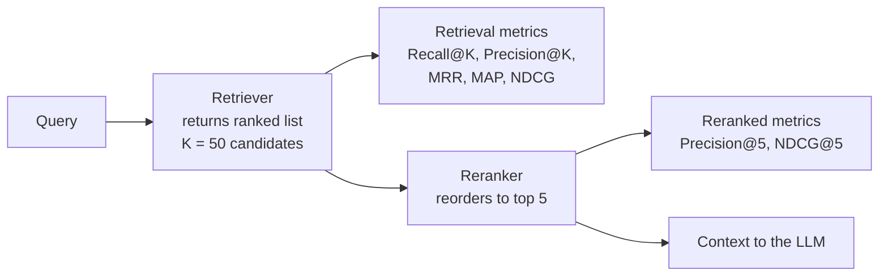

# Retrieval Metrics

> **Interview answer (say this first).** Retrieval metrics score how well search returns the right documents. **Recall@K** asks "did we get all the relevant documents into the top K?"; **Precision@K** asks "how many of the top K were relevant?"; **MRR** scores where the *first* relevant document appears; **MAP** and **NDCG** score the whole ranking. For RAG, recall comes first: if the evidence is not in the retrieved context, no prompt engineering can save the answer.

## Why this exists

You change the chunk size, swap the embedding model, add hybrid search, or turn on a reranker. Did the system get better or worse? Without a number, you are guessing.

Guessing fails in a specific way. The demo query looks fine, so you ship. Then a user asks something slightly different, retrieval returns a document about the wrong product, and the model confidently answers from it. Nobody notices until a customer does.

Consider a tiny failure. A user asks "how long is the refund window?" Your retriever returns five chunks in this order:

```text
1. shipping policy
2. refund policy          <- relevant, but second
3. contact page
4. warranty terms
5. privacy policy
```

The relevant chunk is at rank 2. The model may still answer correctly, but the correct evidence is competing with four irrelevant chunks. If the context window only fits the first chunk, the answer is wrong. **Rank matters, not just presence.**

A single metric cannot describe this. You need a family:

- Did the relevant document appear at all? (**Recall**)
- Was it near the top, or buried? (**MRR**, **NDCG**)
- How much noise came with it? (**Precision**)
- Across many questions, or just this one? (**Mean** of the above)

Retrieval metrics exist to turn "it seems better" into a repeatable number you can put in a pull request.

> **Note:**
>
> **The one-sentence purpose.** Retrieval metrics measure whether the right evidence reached the model's context, and where in the ranking it sat.


## Start from zero

Every word below is used later on this page. Read this table first.

| Word | Plain meaning |
| --- | --- |
| **Retrieval** | Finding documents that answer a query. The search half of RAG. |
| **Corpus** | The full collection of documents you can search. |
| **Document** | One item in the corpus, usually a chunk of a larger file. |
| **Query** | The user's question, or a transformed version of it. |
| **Ranking** | The retriever's output: documents in order, best guess first. |
| **Rank** | The position in that list. Rank 1 is the first result, rank 5 is the fifth. |
| **K** | How many top results you look at. `@5` means "in the first five". |
| **Relevant** | A document that truly contains the evidence needed to answer. |
| **Golden set** | A labelled list of queries, each with its known relevant documents. Also called a *ground-truth set*. |
| **Label** | The human (or carefully checked) judgement that a document is relevant to a query. |
| **Binary relevance** | The label is only relevant (1) or not (0). |
| **Graded relevance** | The label is a level, such as 0 = irrelevant, 1 = useful, 2 = highly relevant. |
| **True positive** | A relevant document that the retriever returned in the top K. |
| **False positive** | An irrelevant document that the retriever returned in the top K. |
| **False negative** | A relevant document that the retriever missed from the top K. |
| **Metric** | A formula that turns a ranking into a single number. |
| **Macro-average** | Compute the metric per query, then average those numbers. Every query counts equally. |
| **Micro-average** | Pool all hits and misses across queries first, then compute once. Bigger queries dominate. |
| **Candidate set** | The larger list (say 50 documents) that a reranker later narrows down. |
| **Reranker** | A second model that reorders the candidate set for better precision. |

Two ideas cause most confusion, so fix them now:

- **Recall vs precision is about direction.** Recall asks "of all relevant documents, how many did we find?" Precision asks "of the documents we returned, how many were relevant?" Recall cares about misses; precision cares about noise.
- **Binary vs graded is about the label.** Binary says relevant or not. Graded says *how* relevant, which lets a metric reward putting the best document first.

## The core idea

Think of a librarian asked for books on a topic. She walks into the stacks and brings back a pile.

- **Recall** is whether the important books are somewhere in the pile.
- **Precision** is what fraction of the pile is actually on topic.
- **Rank** is whether the best book is on top or under the pile.
- **NDCG** is a score that rewards putting the *most* relevant books highest.

This is exactly the RAG situation. The retriever is the librarian. The pile is the context sent to the model. A short context window plus a badly ranked pile equals a wrong answer.

The pipeline is short but has two distinct places to measure:



The crucial rule is the one the diagram shows: **the reranker can only reorder what the retriever already found.** If the relevant document is not in the candidate set, reranking cannot invent it. So measure **recall@candidate_K** first, before you ever tune the reranker.

Each metric answers a different question:

| Metric | Question it answers | Cares about order? | Uses grades? |
| --- | --- | --- | --- |
| Recall@K | Did we find all relevant documents in the top K? | No | No |
| Precision@K | What fraction of the top K was relevant? | No | No |
| MRR | How high is the *first* relevant document? | Yes, only the first | No |
| MAP | How good is precision at every relevant hit? | Yes | No |
| NDCG@K | Is the ranking ordered best-first? | Yes, fully | Yes (binary or graded) |

## How it works

The mechanism is the same for every retrieval metric. Only step 4 changes.

1. **Build a golden set.** Collect real questions. For each, decide which documents are relevant. Store them as document IDs, not raw text, so you can compare them to retrieved IDs.

2. **Run the retriever.** For each question, get the ranked list of document IDs. Keep the full list; you will slice it at different K values.

3. **Convert the ranking into labels.** Walk the ranking from rank 1. For each document, mark it `1` if it is in the relevant set, else `0`. For NDCG, replace `1` with the document's grade.

4. **Compute the per-query metric.** Apply the formula for the metric you want (below). A query with zero relevant documents has no denominator, so the metric is undefined: the convention used here is to return `None` and skip that query when averaging. Decide your convention and write it down.

5. **Average across queries.** Take the mean of the per-query scores. This is the macro-average, and it is the number you report. One hard query should not be hidden by many easy ones.

6. **Report at several K values.** A retriever often has high Recall@50 and low Recall@5. Both are true and both are useful: the first says "the evidence is reachable", the second says "the evidence is near the top".

7. **Act on the weakest number.** Low recall means fix indexing or candidate generation. Low precision means add a reranker or filter. Low NDCG with good recall means the ranking order is wrong.

Here are the formulas. `retrieved[:k]` means the first `k` items. `relevant` is the set of all relevant documents. `rel(i)` is 1 if the document at rank `i` is relevant, else 0.

**Recall@K**

```text
Recall@K = |relevant ∩ retrieved[:K]| / |relevant|
```

**Precision@K**

```text
Precision@K = |relevant ∩ retrieved[:K]| / K
```

**Reciprocal rank (per query), then mean = MRR**

```text
RR = 1 / rank of the first relevant document   (0 if none is found)
MRR = mean(RR) over all queries
```

**Average precision (per query), then mean = MAP**

```text
AP = (1 / |relevant|) * Σ over ranks i where rel(i)=1 of Precision@i
MAP = mean(AP) over all queries
```

**Discounted cumulative gain and its normalised form**

```text
DCG@K  = Σ from i=1 to K of (2^grade(i) - 1) / log2(i + 1)
IDCG@K = DCG@K of the best possible ordering (highest grades first)
NDCG@K = DCG@K / IDCG@K
```

Two details worth knowing. First, the denominator of AP is the **total** number of relevant documents, even ones that were never retrieved. Missing a relevant document therefore lowers AP, which is why AP feels recall-like. Second, for binary relevance `(2^1 - 1) = 1`, so DCG becomes the simpler `Σ rel(i) / log2(i + 1)`. The `log2(i + 1)` term is the "discount": a hit at rank 10 is worth far less than a hit at rank 1.

## The syntax you will use

There is no library syntax for the formulas. These are short functions you own. The shapes below are the real forms used in evaluation code.

**Recall@K.** Count hits in the top K, divide by the number of relevant documents.

```python
def recall_at_k(retrieved, relevant, k):
    if not relevant:
        return None                 # zero-relevant query: skip, do not divide by zero
    hits = sum(1 for d in retrieved[:k] if d in relevant)
    return hits / len(relevant)
```

**Precision@K.** Same numerator, but divide by K instead of by the number of relevant documents.

```python
def precision_at_k(retrieved, relevant, k):
    hits = sum(1 for d in retrieved[:k] if d in relevant)
    return hits / k
```

**Reciprocal rank.** Return as soon as you see the first relevant document. Return `0.0` when none is found, so the average is not skewed up.

```python
def reciprocal_rank(retrieved, relevant):
    for i, d in enumerate(retrieved, start=1):
        if d in relevant:
            return 1.0 / i
    return 0.0
```

**Average precision.** Add `Precision@i` at every rank `i` that is a relevant hit, then divide by the total number of relevant documents.

```python
def average_precision(retrieved, relevant, k):
    if not relevant:
        return None                 # zero-relevant query: skip, do not divide by zero
    hits = 0
    total = 0.0
    for i, d in enumerate(retrieved[:k], start=1):
        if d in relevant:
            hits += 1
            total += hits / i          # Precision@i at this hit
    return total / len(relevant)
```

**NDCG@K.** Build the actual grade list and the ideal grade list (sorted descending), then divide the two DCGs. Reusing one `dcg` function guarantees the actual and ideal scores use the same formula.

```python
import math

def dcg(grades):
    return sum((2 ** g - 1) / math.log2(i + 1) for i, g in enumerate(grades, 1))

def ndcg_at_k(retrieved, grades, k):
    if not grades:
        return None                 # no relevant documents: IDCG would be zero
    actual = [grades.get(d, 0) for d in retrieved[:k]]
    ideal = sorted(grades.values(), reverse=True)[:k]
    return dcg(actual) / dcg(ideal)
```

`grades` is a dictionary from document ID to relevance level. For binary relevance, build it as `{d: 1 for d in relevant}`. Documents that were retrieved but are not in `grades` get `0`. With no relevant documents the ideal gain is zero, so `ndcg_at_k` returns `None` rather than dividing by zero.

**Average the per-query scores.** Macro-averaging is one call to `mean`.

```python
from statistics import mean

mrr = mean(reciprocal_rank(q["retrieved"], q["relevant"]) for q in golden)
```

All of this is standard library. No evaluation framework is required to start.

## Examples: simple to real

**Example 1 — one query, by hand.**

Relevant documents are `{A, C}`. The retriever returns `[A, B, C, D, E]`.

```text
Recall@5    = 2 / 2 = 1.0        (both relevant documents found)
Precision@5 = 2 / 5 = 0.4        (two of five returned were relevant)
Precision@1 = 1 / 1 = 1.0        (the top result was relevant)
```

Recall is perfect because both documents are in the top five. Precision is low because three irrelevant documents came along. This is the normal trade-off: larger K raises recall and lowers precision.

**Example 2 — where the first relevant document sits.**

Same relevant set `{A, C}`, but this time `A` is at rank 3:

```text
rank 1: X   (irrelevant)
rank 2: Y   (irrelevant)
rank 3: A   (relevant)  -> RR = 1/3 = 0.3333
rank 4: C   (relevant)
```

`Recall@4` is still `2 / 2 = 1.0`, but `RR` dropped from `1.0` to `0.3333`. Recall cannot see rank; MRR can. This is exactly why you report more than one metric.

**Example 3 — binary NDCG rewards the top position.**

Relevant set `{A, C}`, retrieved `[A, B, C, D, E]`. Using binary grades (`A = 1`, `C = 1`):

```text
DCG@5  = 1/log2(2) + 0/log2(3) + 1/log2(4) + 0 + 0 = 1.0 + 0.5 = 1.5
IDCG@5 = 1/log2(2) + 1/log2(3)                      = 1.0 + 0.6309 = 1.6309
NDCG@5 = 1.5 / 1.6309 = 0.9197
```

An NDCG of `0.92` means the ranking is close to ideal. If the retriever had returned `[B, A, C, D, E]` instead — pushing a relevant document down to rank 3 — the score would fall to `0.6934`: the discount is harsher at lower ranks, so order matters. Note that swapping the two equally-relevant documents, `[C, B, A, D, E]`, leaves NDCG unchanged at `0.9197`; NDCG only falls when a relevant document moves to a *lower* rank.

**Example 4 — graded NDCG.**

Graded labels say how relevant each document is: `A = 3` (best), `B = 2`, `D = 1`, `C = 0`. Retrieved order is `[A, B, C, D]`.

```text
DCG@4  = (2^3-1)/log2(2) + (2^2-1)/log2(3) + (2^0-1)/log2(4) + (2^1-1)/log2(5)
       = 7/1.0 + 3/1.585 + 0/2.0 + 1/2.322
       = 9.3235
IDCG@4 = (2^3-1)/log2(2) + (2^2-1)/log2(3) + (2^1-1)/log2(4) + (2^0-1)/log2(5)
       = 9.3928
NDCG@4 = 9.3235 / 9.3928 = 0.9926
```

The only difference from the ideal is that grades 1 and 0 are swapped, which barely changes the score. Graded NDCG is the right metric when "somewhat relevant" is a real category, which is common in enterprise search.

**Example 5 — a three-query golden set, end to end.**

This is the script to run. It prints one row per query and the macro-average.

```python
import math
from statistics import mean

def recall_at_k(retrieved, relevant, k):
    if not relevant:
        return None
    return sum(1 for d in retrieved[:k] if d in relevant) / len(relevant)

def precision_at_k(retrieved, relevant, k):
    return sum(1 for d in retrieved[:k] if d in relevant) / k

def reciprocal_rank(retrieved, relevant):
    for i, d in enumerate(retrieved, start=1):
        if d in relevant:
            return 1.0 / i
    return 0.0

def average_precision(retrieved, relevant, k):
    if not relevant:
        return None
    hits, total = 0, 0.0
    for i, d in enumerate(retrieved[:k], start=1):
        if d in relevant:
            hits += 1
            total += hits / i
    return total / len(relevant)

def dcg(grades):
    return sum((2 ** g - 1) / math.log2(i + 1) for i, g in enumerate(grades, 1))

def ndcg_at_k(retrieved, grades, k):
    if not grades:
        return None
    actual = [grades.get(d, 0) for d in retrieved[:k]]
    ideal = sorted(grades.values(), reverse=True)[:k]
    return dcg(actual) / dcg(ideal)

golden = [
    {"retrieved": ["A", "B", "C", "D", "E"], "relevant": {"A", "C"}},
    {"retrieved": ["C", "D", "B", "E", "A"], "relevant": {"B"}},
    {"retrieved": ["A", "B", "C", "D", "E"], "relevant": {"D", "E"}},
]
K = 5
for q in golden:
    r, rel = q["retrieved"], q["relevant"]
    grades = {d: 1 for d in rel}
    print(round(recall_at_k(r, rel, K), 4), round(precision_at_k(r, rel, K), 4),
          round(reciprocal_rank(r, rel), 4), round(average_precision(r, rel, K), 4),
          round(ndcg_at_k(r, grades, K), 4))

print("MEAN",
      round(mean(recall_at_k(q["retrieved"], q["relevant"], K) for q in golden), 4),
      round(mean(precision_at_k(q["retrieved"], q["relevant"], K) for q in golden), 4),
      round(mean(reciprocal_rank(q["retrieved"], q["relevant"]) for q in golden), 4),
      round(mean(average_precision(q["retrieved"], q["relevant"], K) for q in golden), 4),
      round(mean(ndcg_at_k(q["retrieved"], {d: 1 for d in q["relevant"]}, K) for q in golden), 4))
```

Output (verified):

```text
1.0 0.4 1.0 0.8333 0.9197
1.0 0.2 0.3333 0.3333 0.5
1.0 0.4 0.25 0.325 0.5013
MEAN 1.0 0.3333 0.5278 0.4972 0.6403
```

Read it like this. **Recall@5 is 1.0 for every query**, so the candidate set always contains the evidence; the retriever is not the bottleneck here. **Precision@5 is 0.33**, so two thirds of the context is noise, and a reranker would help. **MRR is 0.53** because in two of three queries the first relevant document is at rank 3 and 4. **NDCG@5 is 0.64**, the same story with a full-ranking penalty. **MAP is 0.50**, pulled down by query 3, where both relevant documents sit near the bottom.

That is the whole point of the metric family: each number points at a different fix.

## In production

- **Recall first, precision second.** A missing document is unfixable by the model; an extra document is noise the model can often ignore. Tune recall on the candidate set, then tune precision with a reranker.
- **Measure recall at the candidate K, not just the final K.** If you retrieve 50 and rerank to 5, compute Recall@50. Recall@5 after reranking is bounded by Recall@50 and hides retriever misses.
- **Golden sets rot.** Documents are re-indexed, IDs change, and old labels go stale. Version the golden set with the corpus and re-check it on every index rebuild.
- **You need enough queries for the mean to be stable.** Five queries cannot distinguish two retrievers; differences of a few points are noise. Aim for dozens to hundreds, with hard and easy questions mixed.
- **Keep a hard slice.** Average hides failures. Report the overall number **and** a breakdown by query type (exact lookup, multi-hop, acronym, no-answer) so a regression in one slice is visible.
- **Do not label with the system you are testing.** Using retriever output to build the golden set guarantees a high score and proves nothing. Labels must be independent, ideally human-checked.
- **Beware duplicate documents.** Near-identical chunks mean the "second" relevant result may be the same text again. Deduplicate before scoring, or Precision and NDCG will look better than the context really is.
- **Decide how to treat no-answer queries.** Some questions have no relevant document, so recall, AP, and NDCG have no denominator. The guarded functions above return `None` for these and the evaluation loop skips them; alternatively define them as always-correct. Either way, be consistent, because the convention changes the score.
- **Micro vs macro matters with uneven labels.** If one query has 20 relevant documents, micro-averaging lets it dominate. For RAG, macro-average is usually the honest choice.
- **Recall has a ceiling that is not 1.0.** If your labels are incomplete, recall is capped and you will chase a phantom. Audit a sample of "misses" by hand before believing a low score.
- **Test both the recovered ranking and the final one.** Log metrics at the retriever and at the reranker so you can attribute a change to the right stage.
- **Never tune on the test set.** Split the golden set into a tuning part and a held-out part, or the reported number becomes a memory of your own choices.

## Interview questions

### 1. Why is recall usually the most important retrieval metric for RAG?

**Answer.** Because generation can only use what retrieval returns. If the relevant document is not in the context, the model either says it does not know or hallucinates. Recall directly measures the presence of evidence. Precision affects how much noise competes for attention, which matters, but a precision problem is survivable while a recall problem is usually fatal.

**Follow-up: "Can high precision compensate for low recall?"** No. Precision only describes the documents you did return. A retriever that returns one correct document and nothing else has perfect precision and terrible recall on a query with five relevant documents.

**Trap.** Optimising precision because it is easy to move with a reranker, then declaring success while recall stays low. Always check the candidate-set recall before trusting the reranked result.

### 2. What is the difference between Recall@K and Precision@K?

**Answer.** Recall@K is hit count divided by the *total number of relevant documents*, so it measures coverage. Precision@K is hit count divided by *K*, so it measures how clean the returned list is. Recall rises as K grows; precision usually falls. Report both because they can move in opposite directions.

**Follow-up: "Which one does the user feel?"** Precision, in a single-result UI. A user who sees one answer cares that it is correct, not that four other relevant documents existed. Recall matters for the downstream model that needs complete evidence.

**Trap.** Dividing recall by K. That denominator is the number of relevant documents, which can be larger or smaller than K. Using K by mistake makes Recall@10 of a query with three relevant documents look artificially low.

### 3. What does MRR measure, and when is it the wrong metric?

**Answer.** MRR is the mean of `1 / rank` of the first relevant document per query. It rewards putting *some* relevant result high. It is right for a single-answer task, like a question-answering bot that reads only the top result. It is wrong for RAG that needs several documents, because it ignores all relevant documents after the first.

**Follow-up: "How do MRR and MAP differ?"** MRR only looks at the first hit. MAP looks at every relevant hit and rewards having all of them high in the list. For multi-document context, MAP or NDCG is more informative.

**Trap.** Forgetting the zero case. If no relevant document is retrieved, the reciprocal rank is `0.0`. Dividing by 1 or skipping the query would inflate the average.

### 4. Explain NDCG and why the logarithm is there.

**Answer.** NDCG is discounted cumulative gain divided by the ideal gain. You gain for each document based on its relevance grade, discounted by `log2(rank + 1)`, because a relevant document near the top is more useful than the same document at rank 20. Dividing by the ideal ordering normalises the score to between 0 and 1 so queries with different labels are comparable.

**Follow-up: "Why `2^grade - 1` instead of just grade?"** The exponential gain makes high grades disproportionately valuable, which matches tasks where the single best document matters much more than several mildly useful ones. With binary grades the two forms are identical.

**Trap.** Forgetting to normalise. Raw DCG is not comparable across queries because a query with many relevant documents has a larger maximum. Always divide by IDCG.

### 5. What is MAP, and how is it different from MRR?

**Answer.** Average precision averages `Precision@i` over every rank where a relevant document appears, then divides by the total number of relevant documents. MAP is the mean of AP across queries. Unlike MRR, it accounts for all relevant documents and their positions, so it is a ranking-quality metric for multi-document retrieval.

**Follow-up: "Why divide AP by the total relevant count rather than the number retrieved?"** Because unretrieved relevant documents must count as misses. Dividing by the number found would let a retriever score perfectly by returning only one document out of five.

**Trap.** Computing AP over only the top K and forgetting that `|relevant|` may exceed K. With K smaller than the relevant count, even a perfect top K cannot reach AP of 1.0, which is correct and important.

### 6. How do you choose K?

**Answer.** Match K to the context budget and the task. For a question-answering system, the final K is however many chunks fit the prompt, often 3 to 10. For candidate generation before reranking, use a larger K, often 50 to 100, and measure recall there. Pick the smallest candidate K that keeps recall high; anything beyond that is reranker work that a reranker can do better.

**Follow-up: "What does the recall curve look like as K grows?"** It rises quickly, then flattens at a ceiling set by your retriever and labels. If recall is still climbing steeply at your K, increase K or improve the candidate retriever. If it has flattened and is below target, the problem is in indexing or the query, not K.

**Trap.** Reporting only one K. A single number hides whether the evidence is absent or merely ranked low. Always report at least a small K and a large K.

### 7. Binary versus graded relevance: when do you use each?

**Answer.** Use binary when a document either answers the question or does not, which is typical for a single-fact lookup. Use graded relevance when quality is a spectrum, typically 0 to 3, which is typical for enterprise search where a document can be partly on topic. Graded labels carry more information, so NDCG can reward the best document; binary labels are cheaper to collect and easier to agree on.

**Follow-up: "What is the cost of graded labels?"** Annotators disagree more, so you need clear guidelines and more than one labeller for the tricky levels. Binary labels converge faster and cost less.

**Trap.** Using graded NDCG with binary labels and then wondering why it behaves like a simple hit count. The gain formula only shows its value when grades differ.

### 8. How do these metrics help you debug a bad RAG answer?

**Answer.** They localise the fault. If Recall@candidate_K is low, the evidence never reached the model: fix the index, chunking, embeddings, or query transformation. If recall is high but Precision@K or NDCG is low, the evidence is present but buried among noise: add a reranker. If retrieval metrics are good and answers are still wrong, the fault is in generation, not retrieval. That single split is the most valuable debugging step.

**Follow-up: "What if recall is high but users still complain?"** Then the answer is a generation or context-assembly problem: the model is ignoring the evidence, the context is too long, or the prompt is unclear. Move to generation metrics like faithfulness and answer relevance.

**Trap.** Starting with prompt changes when the retrieved context never contained the answer. Always check retrieval first, because it is cheaper to measure and easier to fix.

## Remember this

- **Recall = coverage, precision = cleanliness.** Recall asks "did we find it?", precision asks "was the list clean?".
- **Rank matters.** MRR, MAP, and NDCG reward putting relevant documents near the top; Recall@K cannot see order.
- **Measure recall at the candidate K.** A reranker can only reorder what retrieval already found.
- **NDCG = DCG / IDCG**, with gain `2^grade - 1` discounted by `log2(rank + 1)`.
- **Average over queries (macro), report several K, and keep a held-out set** so the number means something.
