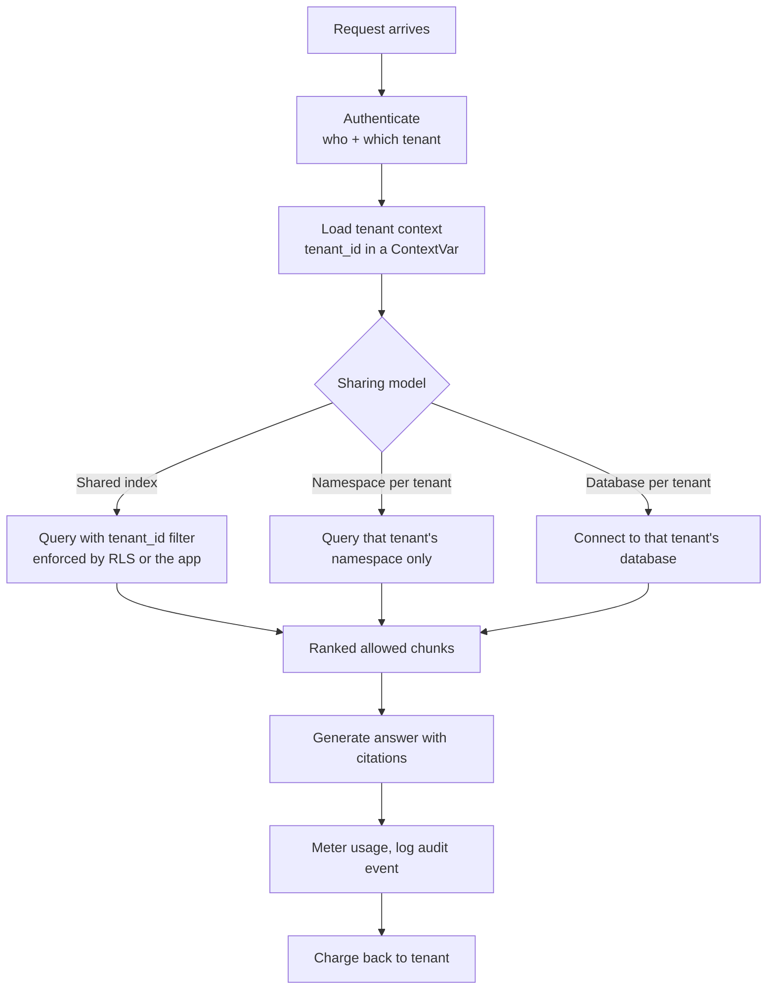

# Multi-Tenant RAG

> **Interview answer (say this first).** Multi-tenant RAG serves many customers (*tenants*) from one system. The central design choice is **isolation**: either share one index and filter every query by `tenant_id`, or give each tenant its own index, namespace, schema, or database. Shared storage is cheaper but relies on the filter never being forgotten; isolated storage is safer but costs more. You pick a point between the two, enforce it in the data layer (for example PostgreSQL row-level security), and prove it with cross-tenant tests.

## Why this exists

A single-tenant RAG system serves one organisation. Everything in the index belongs to that organisation, so any query may see anything. Life is simple.

A **multi-tenant** system serves many organisations from the same code, the same model, and often the same database. Now every query must answer a hidden second question: **"Which tenant is asking, and which rows are they allowed to see?"**

Miss that question and you get the worst class of production bug: **cross-tenant leakage**. One customer's private document appears in another customer's answer. This is not a small embarrassment. It is a breach, a contract violation, and sometimes a regulatory event.

Here is the failure in its most common form. A retrieval function searches the whole index and forgets the tenant filter:

```python
def search(query_embedding, k=3):
    # BUG: no tenant filter
    return index.search(query_embedding, k=k)
```

The function works perfectly in development, because the developer's test data has one tenant. In production it returns whatever is closest — including another tenant's text. The model then summarises it, cites it, and emails it to the wrong customer.

This happens because multi-tenancy is a **property of every layer**, not one feature you add. Identity, indexes, queries, caches, logs, quotas, and cost accounting all carry a tenant dimension. This page shows how to keep that dimension from the request to the vector.

## Start from zero

| Word | Plain meaning |
| --- | --- |
| **Tenant** | One customer or organisation using your system. One tenant may contain many users. |
| **Multi-tenancy** | Serving many tenants from one shared deployment. |
| **Isolation** | Making sure one tenant cannot see or affect another tenant's data. |
| **Shared index** | One vector index holds all tenants' chunks, each tagged with `tenant_id`. |
| **Isolated index** | A separate index (or namespace, collection, schema, or database) per tenant. |
| **Namespace / collection** | A named partition inside one vector database. Same server, separate data. |
| **Metadata filter** | An extra condition on a search, such as `tenant_id = "acme"`. |
| **Pre-filter** | Filter first, then rank. Restricted rows are never scored. |
| **Post-filter** | Rank first, then filter the top results. Restricted rows were already fetched. |
| **Row-level security (RLS)** | A PostgreSQL feature. The database itself hides rows that fail a policy, even if the query forgets a `WHERE` clause. |
| **tenant_id** | The column or field that records which tenant owns a row. |
| **Noisy neighbour** | One tenant's heavy use slows or starves other tenants sharing the same resource. |
| **Quota** | A per-tenant limit: requests per minute, tokens per month, storage, spend. |
| **Cost allocation** | Attributing each request's cost to the tenant that caused it. Also called showback or chargeback. |
| **Partition** | Splitting one big table into smaller physical pieces, usually by a key such as tenant. |
| **Canary** | A unique, harmless test document planted so a leak becomes visible immediately. |
| **Data residency** | A rule that some tenants' data must stay in a specific country or region. |

Three pairs are easy to mix up:

- **Shared vs isolated** is about *where the data lives*. Shared = one index plus a filter. Isolated = separate stores.
- **Pre-filter vs post-filter** is about *when the tenant check happens*. Pre = before ranking. Post = after. Only pre-filter is safe.
- **Isolation vs access control** is related but not the same. Isolation keeps tenants apart. Access control (next page) also keeps *users inside one tenant* apart. You need both.

## The core idea

Picture a large office building. Every company rents a floor. Some buildings give each company its own locked floor with its own elevator (**isolated**). Others share one open-plan floor, and every desk has a nameplate; you are trusted to only read desks with your name (**shared with a filter**).

The open-plan building is cheaper and easier to run. But if the nameplate rule is forgotten, one company reads another's mail. The locked-floor building is safer, but empty floors cost money even when the tenant is small.

That is the whole trade-off. Now the technical version:



The important detail is that the tenant identity enters at the top and must survive every step. A filter added only at the end (post-filter) is too late, because the restricted data already left the store.

Here are the three common sharing models, from cheapest to safest:

| Model | How it stores | Isolation strength | Cost | Best for |
| --- | --- | --- | --- | --- |
| Shared table + `tenant_id` filter | One table, one index, `tenant_id` column | Weak unless enforced in the database (RLS) | Lowest | Many small tenants, low sensitivity |
| Namespace / schema / partition per tenant | Shared server, separate logical store | Medium | Medium | Mid-size tenants, clearer boundaries |
| Database or cluster per tenant | Fully separate store | Strong | Highest | Regulated, large, or high-risk tenants |

Most real systems are **hybrid**: shared by default, dedicated namespaces for paying tiers, and a dedicated database for a customer with strict compliance needs.

> **Note:**
>
> **The one-sentence rule.** Filtering by tenant is not an optimisation you add later — it is a correctness requirement, and it belongs in the data layer where a buggy caller cannot skip it.


## How it works

1. **Authenticate and resolve the tenant.** The request carries a credential (token, session, API key). A verified token maps to exactly one tenant. Never let the client send an arbitrary `tenant_id`; derive it from the credential.

2. **Put the tenant in request context.** Store it once, in a `ContextVar` in Python or an equivalent request-scoped value. Every function reads it from there. This removes the chance that one code path forgets to pass it down.

3. **Tag every chunk at index time.** When you ingest a document, write `tenant_id` onto the document, every chunk, and every vector. If the tag is missing, the chunk must be rejected, not stored with a default.

4. **Enforce the filter in the data layer.** Prefer enforcement a buggy query cannot silently skip: a per-tenant namespace, a separate database, or PostgreSQL row-level security, whose policy still applies when a query forgets its `WHERE` clause. That is defence in depth, not a boundary the application cannot influence: the `app.tenant_id` value RLS reads is an app-supplied, trusted custom GUC, and any role that can execute SQL can change it with `SET` or `set_config`. A SQL-execution path — especially one that interpolates values — can therefore defeat the policy, so never build SQL by string interpolation. An app-level `WHERE` clause is a fallback, not the only defence.

5. **Pre-filter, never post-filter.** Apply the tenant condition in the query that ranks the vectors. Fetching global top-K and filtering afterwards both loses results and risks exposing the unfiltered set to later code.

6. **Keep per-tenant indexing settings when quality demands it.** Different tenants may need different chunk sizes, normalisation rules, or even embedding models. Embeddings from different models live in **different vector spaces** and cannot share one index.

7. **Absorb noisy neighbours.** One tenant can dominate CPU, memory, and index traffic. Use per-tenant namespaces, rate limits, request queues, and (for the largest tenants) dedicated indexes or read replicas.

8. **Meter and allocate cost.** Every model call, embedding call, and storage byte is tagged with `tenant_id`. Aggregate into per-tenant usage, apply quotas, and produce a chargeback report.

9. **Prove isolation with tests.** Insert canary documents, run queries as each tenant, and assert that no response ever contains another tenant's canary. Run this in CI and after every change to the retrieval path.

## The syntax you will use

These are the real production forms, smallest to largest. The SQL is PostgreSQL with pgvector; the Python is plain standard library.

**1. The tenant column and a filtered vector query.** The `WHERE` clause is the safety line.

```sql
SELECT id, content, 1 - (embedding <=> $1) AS score
FROM chunks
WHERE tenant_id = $2
ORDER BY embedding <=> $1
LIMIT $3;
```

`<=>` is pgvector's cosine distance. `$2` is the tenant id, and it must always be present.

**2. Row-level security: the database enforces the tenant for you.**

```sql
ALTER TABLE chunks ENABLE ROW LEVEL SECURITY;

CREATE POLICY tenant_isolation ON chunks
  USING      (tenant_id = current_setting('app.tenant_id')::uuid)
  WITH CHECK (tenant_id = current_setting('app.tenant_id')::uuid);
```

Now a query with no tenant clause still returns only the current tenant's rows.

This is not an application-proof boundary: `app.tenant_id` is just a custom GUC the application supplies, and `current_setting` will happily return whatever any SQL-executing role last set it to. The policy is only as trustworthy as the code and roles that can run SQL, which is why values must be bound as parameters rather than interpolated into statements.

**3. Set the tenant for the transaction.** `SET LOCAL` scopes the value to the current transaction.

```sql
SELECT set_config('app.tenant_id', $1, true);   -- true = local to transaction
```

Run it at the start of every request. `true` means the setting resets when the transaction ends, so a pooled connection cannot leak it to the next request. It must run in the **same transaction** as the retrieval query: `set_config(..., true)` and `SET LOCAL` last only until the transaction ends, so in autocommit mode each statement is its own transaction and the setting is discarded before the query runs.

**4. Force RLS even for the table owner.** Owners bypass their own policies by default.

```sql
ALTER TABLE chunks FORCE ROW LEVEL SECURITY;
```

This matters when your app connects as the table owner. Without it, policies are skipped.

**5. Partition by tenant for large shared tables.** Each partition can carry its own index.

```sql
CREATE TABLE chunks (
    id        bigserial,
    tenant_id uuid NOT NULL,
    content   text,
    embedding vector(1536)
) PARTITION BY LIST (tenant_id);

CREATE TABLE chunks_acme PARTITION OF chunks FOR VALUES IN ('<acme-uuid>');
```

RLS is per table. A policy on the parent `chunks` applies to queries routed through the parent, but a direct reference to a partition (`SELECT ... FROM chunks_acme`) is checked against that partition's own policies. Enable row-level security and create the policy on every partition as well, or make all queries go through the parent so the parent policy applies.

**6. A per-tenant namespace in a vector database.** The shape differs by product, but the idea is the same: the tenant is part of the addressing, not a filter you might forget.

```python
# Generic shape: choose the namespace from the request's tenant
results = client.search(
    namespace=f"tenant-{tenant_id}",   # separate logical store
    vector=query_embedding,
    top_k=5,
)
```

**7. Carry the tenant through the request with `contextvars`.**

```python
from contextvars import ContextVar

current_tenant: ContextVar[str] = ContextVar("current_tenant")
```

Every query function calls `current_tenant.get()` and **fails closed** if it is unset.

## Examples: simple to real

These examples share one tiny, dependency-free setup: a bag-of-words embedding, a cosine score, and four documents owned by two tenants.

```python
import math

VOCAB = ["refund", "policy", "finance", "report", "vacation", "days"]
DOCS = [
    ("tenant-a", "a1", "refund policy for tenant a"),
    ("tenant-b", "b1", "refund policy finance report"),
    ("tenant-b", "b2", "refund policy finance report"),
    ("tenant-b", "b3", "refund policy finance report"),
]
QUERY = "refund policy finance report"

def embed(text: str) -> list[float]:
    vec = [float(text.lower().split().count(w)) for w in VOCAB]
    norm = math.sqrt(sum(v * v for v in vec)) or 1.0
    return [v / norm for v in vec]

def cosine(a, b):
    return sum(x * y for x, y in zip(a, b))   # both vectors are unit length
```

**Example 1 — the leak: a shared index with no filter.**

```python
def shared_index_naive(query, k=3):
    q = embed(query)
    scored = [(cosine(q, embed(t)), tid, did, t) for tid, did, t in DOCS]
    scored.sort(key=lambda row: row[0], reverse=True)
    return scored[:k]
```

Illustrative output for a `tenant-a` user asking about the refund policy:

```text
1.000  tenant=tenant-b  doc=b1  'refund policy finance report'
1.000  tenant=tenant-b  doc=b2  'refund policy finance report'
1.000  tenant=tenant-b  doc=b3  'refund policy finance report'
```

Every result belongs to `tenant-b`. The query was valid; the missing filter was the bug.

**Example 2 — pre-filter by `tenant_id`.**

```python
def shared_index_filtered(query, tenant_id, k=3):
    q = embed(query)
    scored = [(cosine(q, embed(t)), tid, did, t)
              for tid, did, t in DOCS if tid == tenant_id]
    scored.sort(key=lambda row: row[0], reverse=True)
    return scored[:k]
```

Illustrative output:

```text
0.707  tenant=tenant-a  doc=a1  'refund policy for tenant a'
```

The filter runs *inside* the search, so the other tenant's rows are never scored.

**Example 3 — isolated index (namespace per tenant).**

```python
def isolated_indexes(query, tenant_id, k=3):
    per_tenant = {}
    for tid, did, t in DOCS:
        per_tenant.setdefault(tid, []).append((did, t))
    q = embed(query)
    scored = [(cosine(q, embed(t)), tenant_id, did, t)
              for did, t in per_tenant.get(tenant_id, [])]
    scored.sort(key=lambda row: row[0], reverse=True)
    return scored[:k]
```

Illustrative output:

```text
0.707  tenant=tenant-a  doc=a1  'refund policy for tenant a'
```

The other tenant's documents are not present in the searched structure at all, so no filter can be forgotten.

**Example 4 — the noisy neighbour: post-filtering starves the small tenant.**

A big tenant fills the global top-K with near-identical documents. A small tenant asks the same question and gets nothing, because the filter is applied after ranking.

```python
def post_filter_global_topk(query, tenant_id, k=3):
    return [row for row in shared_index_naive(query, k) if row[1] == tenant_id]

print(len(post_filter_global_topk(QUERY, "tenant-a", k=3)))
print(len(shared_index_filtered(QUERY, "tenant-a", k=3)))
```

Illustrative output:

```text
global top-3 then filter -> tenant-a results: 0
pre-filter top-3 for tenant-a -> results:     1
```

Post-filtering turned a valid query into an empty answer. Pre-filtering returned the one document that tenant owns.

**Example 5 — tenant context that fails closed.**

```python
from contextvars import ContextVar

current_tenant: ContextVar[str] = ContextVar("current_tenant")

def require_tenant() -> str:
    try:
        return current_tenant.get()
    except LookupError:
        raise RuntimeError("no tenant in context: refuse to query") from None

def search(query: str) -> tuple[str, tuple[str, str]]:
    # Parameterized statement: the tenant id and the query are bound, not interpolated.
    return (
        "SELECT ... WHERE tenant_id = $1 AND query = $2",
        (require_tenant(), query),
    )
```

Illustrative output:

```text
unset  -> RuntimeError: no tenant in context: refuse to query
set    -> ('SELECT ... WHERE tenant_id = $1 AND query = $2', ('tenant-a', 'refund'))
reset  -> RuntimeError: no tenant in context: refuse to query
```

"Fail closed" means missing context causes a refusal, not an unfiltered query. Returning the statement and its parameters as a pair lets the driver bind them safely; building the same string with an f-string would reintroduce SQL injection, which is exactly why the tenant id and the query text are parameters rather than literals.

**Example 6 — quotas and cost allocation per tenant.**

```python
from dataclasses import dataclass

PRICE_PER_1K_TOKENS = 0.0004  # illustrative

@dataclass
class Usage:
    tenant_id: str
    requests: int = 0
    tokens: int = 0

usages: dict[str, Usage] = {}
def record(tenant_id: str, tokens: int) -> None:
    usage = usages.setdefault(tenant_id, Usage(tenant_id))
    usage.requests += 1
    usage.tokens += tokens

record("tenant-a", 2000)
record("tenant-a", 1000)
record("tenant-b", 500)
for u in usages.values():
    print(u.tenant_id, u.requests, u.tokens, round(u.tokens / 1000 * PRICE_PER_1K_TOKENS, 4))
```

Illustrative output:

```text
tenant-a 2 3000 0.0012
tenant-b 1 500 0.0002
```

Metering turns "the AI bill" into a per-customer number, which is what quotas and finance need.

## In production

- **Derive `tenant_id` from the credential, never from request input.** If the client can send `tenant_id`, an attacker can simply send someone else's. Tie it to the authenticated token and treat any mismatch as a security incident.
- **Enforce isolation in the data layer, not only the app.** Row-level security, namespaces, or separate databases keep working even when a developer writes a query with no filter. App-level `WHERE` clauses are a second line of defence.
- **Never post-filter.** It loses recall under load (Example 4) and moves restricted data closer to the model, the cache, and the logs. Push the tenant predicate into the ranking query.
- **Turn missing tenant context into an error.** A default of "all tenants" is a breach waiting to happen. Fail closed: no tenant, no query.
- **Store `tenant_id` on the vector and every chunk, and validate it at ingest.** One untagged chunk in a shared index can surface in the wrong tenant's answer forever.
- **Watch the noisy neighbour.** A large tenant can fill the ANN (approximate nearest neighbour) candidate list, consume embedding workers, and raise p99 latency (the 99th-percentile latency — the slowest 1% of requests; p95 is the same idea at the slowest 5%) for everyone. Mitigate with per-tenant namespaces, per-tenant rate limits, a request queue, and dedicated read replicas for heavy tenants.
- **Reconcile per-tenant indexing choices.** Chunk size, language normalisation, and embedding model quality can differ by tenant. Different embedding models produce incompatible vector spaces, so you cannot mix them in one index — separate the index or store the model id and query only matching rows.
- **Budget and meter every call.** Tag LLM, embedding, reranking, and storage usage with `tenant_id`. Enforce quotas at the edge and in the app, and produce a chargeback report so the loudest tenant pays for their load.
- **Test isolation continuously.** Plant one canary document per tenant, query as every tenant with adversarial prompts, and assert that no response, citation, cache entry, or log line contains another tenant's data. Run it in CI.
- **Protect the caches too.** A response cache keyed only by query text will serve tenant A's answer to tenant B. Include tenant, user, ACL version, and model version in cache keys.
- **Respect data residency.** A tenant may require storage in one region. That requirement can force a separate database even when sharing would be cheaper.
- **Plan for deletion and migration.** "Delete tenant X" must remove documents, chunks, vectors, caches, and backups. "Move tenant X" must re-embed if the destination uses a different model.

## Interview questions

### 1. What is multi-tenant RAG, and what is the core design choice?

**Answer.** It is one RAG system serving many customers, called tenants. The core choice is how much to share and how much to isolate. You can share one index with a `tenant_id` filter, give each tenant a namespace or schema, or give each a database. Sharing is cheaper; isolation is safer. Most systems use a hybrid.

**Follow-up: "What decides the choice?"** Sensitivity, regulation, data residency, tenant size, and cost. A regulated bank with strict residency gets its own database. A thousand tiny free-tier users share one index with strong RLS.

**Trap.** Treating multi-tenancy as only a database concern. Identity, caches, logs, quotas, and cost all carry the tenant dimension.

### 2. Shared index with a filter, or an index per tenant — how do you choose?

**Answer.** Start with the threat and the scale. If a leak is catastrophic or legally restricted, isolate. If there are many small tenants and the data is low-sensitivity, share one index and enforce `tenant_id` in the database. In between, use a namespace or partition per tenant. Tenant size also matters: a huge tenant deserves its own index to avoid noisy-neighbour problems.

**Follow-up: "What is the hybrid pattern?"** Shared by default, dedicated namespaces for paid tiers, and a fully dedicated database for the few tenants with the strictest contracts.

**Trap.** Saying "isolated is always better." It is not: it multiplies cost, operational work, and migration effort, and can make the long tail of tiny tenants unprofitable.

### 3. Why is pre-filtering required instead of post-filtering?

**Answer.** Pre-filtering applies the tenant condition before ranking, so restricted rows are never fetched or scored. Post-filtering ranks the whole corpus first, then removes rows. It loses recall — a big tenant can occupy the whole top-K and leave a small tenant with zero results — and it moves restricted data into the process, where it can reach the model, caches, or logs.

**Follow-up: "Can post-filtering itself leak data even if the code never prints it?"** Yes, through side channels: result counts, scores, and rank changes can reveal that a restricted document exists. And any later code that touches the pre-filter list is a risk.

**Trap.** Believing post-filtering is "safe enough if the filter is correct." Correctness is not the only issue; latency, recall, and side channels are.

### 4. How does PostgreSQL row-level security help?

**Answer.** RLS attaches a policy to a table. The database compares each row to the policy and hides rows that fail, even if the query has no `WHERE` clause. You enable it, create a policy using `current_setting('app.tenant_id')`, and set that value per transaction with `set_config(..., true)`. It is defence in depth: a buggy query is still constrained.

**Follow-up: "What is the classic RLS gotcha?"** The table owner bypasses policies unless you run `ALTER TABLE ... FORCE ROW LEVEL SECURITY`. Also, a setting made with `SET` instead of `SET LOCAL` can persist on a pooled connection and leak to the next request.

**Trap.** Assuming RLS covers every path. Admin tools, replicas, exports, and analytics jobs may connect with different roles or bypass policies entirely.

### 5. What is a noisy neighbour in RAG, and how do you handle it?

**Answer.** One tenant's traffic degrades another's. A large tenant can fill the ANN candidate list, saturate embedding workers, occupy the reranker, or push up p99 latency. Handle it with per-tenant namespaces or indexes, per-tenant rate limits and quotas, request queues with fair scheduling, and dedicated replicas for the largest tenants.

**Follow-up: "Give a retrieval-specific example."** In a shared index with post-filtering, a tenant with thousands of near-identical chunks fills the global top-K, so a small tenant's one relevant chunk never reaches the reranker. Pre-filtering or namespaces fixes it.

**Trap.** Only measuring average latency. Noisy-neighbour problems hide in the tail: p95 and p99 for the small tenant, not the mean across all tenants.

### 6. How do you allocate cost across tenants?

**Answer.** Tag every billable unit with `tenant_id`: embedding calls, LLM tokens, reranking, vector storage, and search compute. Store usage events, aggregate them per tenant and per period, and apply per-tenant quotas and budgets. This produces showback (visibility) or chargeback (an actual internal bill).

**Follow-up: "Why is per-tenant cost hard in a shared index?"** Shared compute does not naturally split. You approximate: attribute the query's token and embedding cost directly, and allocate shared index cost by storage share or query share.

**Trap.** Forgetting retrieval cost. Embedding a large corpus and running ANN queries are real expenses, not just the final LLM call.

### 7. How do you prove tenants are isolated?

**Answer.** Use canaries and negative tests. Give every tenant a unique canary document. Then, as each tenant, run a large, adversarial query set and assert that no result, citation, cache entry, log, or export ever contains another tenant's canary or document ids. Add permission-change and deletion-propagation tests. Run the suite in CI.

**Follow-up: "Where do leaks hide even when the database is correct?"** Application caches keyed without the tenant, logs and metrics that store raw queries, admin and analytics tools, exports, and backups restored into a shared environment.

**Trap.** Testing only the happy path with well-behaved queries. Isolation must hold for adversarial phrasing, pagination, reruns, and error paths.

### 8. A tenant asks you to delete all their data. What does that involve in multi-tenant RAG?

**Answer.** Remove the source documents, all chunks and vectors, any cached answers and embeddings, derived summaries, logs that contain their text, and backups according to policy. Verify with a canary that nothing is retrievable. If data was shared into a global model, note that fine-tuning data cannot be surgically removed, which is one reason to keep tenant data out of training.

**Follow-up: "Why is deletion harder than it sounds?"** Data is copied: caches, search indexes, analytics copies, and backups. You need a data map that lists every place a tenant's text can live.

**Trap.** Deleting only the rows in the main table and forgetting the vector index, the response cache, and the object store holding the originals.

## Remember this

- **Sharing and isolation are a dial, not a switch.** Choose your point from sensitivity, regulation, scale, and cost.
- **The tenant filter belongs in the data layer.** RLS, namespaces, or separate databases beat an app-level `WHERE` that someone can forget.
- **Pre-filter; never post-filter.** Post-filtering loses recall and brings restricted data too close to the model.
- **No tenant context means no query.** Fail closed, and derive `tenant_id` from the credential, never from the request body.
- **Test isolation with canaries in CI.** One leaked canary is a breach; a passing suite is your evidence.
