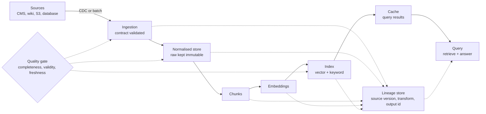

# Data Contracts, Lineage, and Quality

> **Interview answer (say this first).** A data contract is a versioned agreement about the shape, meaning, and quality of data at a boundary, and you enforce it by validating on ingest. You attach lineage (where the data came from and how it was built) and provenance (which exact source version and transform produced a record) to everything you derive. Freshness and quality are service-level objectives with alerts, not afterthoughts. In RAG this matters because stale or malformed documents are worse than missing ones: retrieval serves them confidently and quietly.

## Why this exists

A RAG pipeline is only as trustworthy as the data flowing into it. The dangerous failures are not crashes. They are changes that leave the pipeline reporting success while the index quietly fills with bad content.

Here is a realistic sequence. A producer team owns the `documents` table that feeds ingestion. On Monday they rename the `body` column to `content`. The ingestion code reads `row.get("body", "")`, so it does not raise; it returns an empty string. Every document chunked that day has no text, but it still gets an embedding and an index row.

```text
Day 1   producer renames column  body -> content
Day 1   ingestion: row.get("body", "") -> ""      # no exception
Day 1   pipeline: status = success, error rate = 0%
Day 2   index: 4,812 empty chunks embedded and searchable
Day 2   users: "the assistant invents answers about refunds"
Day 9   someone notices; nobody can say which records are affected
```

The code worked. The data was wrong. Nothing in the pipeline was watching the *data*, only the *code*.

A second, quieter failure is staleness. The source feed stopped updating nine days ago. The ingestion job still runs on schedule, finds no new documents, and reports success. Retrieval keeps answering from a superseded policy, and the model cites it with confidence. Nobody set a freshness target, so nobody got an alert.

```text
Source last changed: 9 days ago
Index last updated:  9 days ago
Job status:          green (there was simply nothing to ingest)
Freshness alert:     none (no SLO existed)
```

A third failure is blindness. A user reports a wrong answer. You can see the chunk that was retrieved, but not which document version produced it, which parser read it, or which chunking rule split it. Without that trail you cannot tell a bad *source* from a bad *transform*, so you cannot fix the right thing.

This page covers the three jobs that prevent these failures:

- **Contract** — make the boundary between producer and consumer explicit, and validate it.
- **Lineage** — make every derived record traceable back to its source and forward to its uses.
- **Quality** — make freshness and correctness measurable, with alerts when they slip.

These are the data-plane concerns behind every RAG system. The model and the retriever get the attention; the data contract and the freshness alert are what keep the answers honest.

## Start from zero

| Word | Plain meaning |
| --- | --- |
| **Data contract** | A versioned, tested agreement about the shape, meaning, and quality of data crossing a boundary. |
| **Schema** | The structure of a record: field names, types, and which fields are required. |
| **Schema evolution** | Changing a schema over time, ideally without breaking the consumers already running. |
| **Validation** | Checking each record against the contract and rejecting or quarantining the ones that fail. |
| **Freshness** | How old the newest data is, usually compared against a target such as "no older than 24 hours". |
| **Lineage** | The full graph of where data came from and how each derived record was produced. |
| **Provenance** | The origin details of one record: the exact source version, tool, and run that created it. |
| **Data quality** | The measurable properties of a dataset: complete, valid, unique, fresh, consistent, accurate. |
| **Nullability** | Whether a field may be empty or missing. A field that was optional and becomes required is a breaking change. |
| **Idempotency (data)** | Running the same job twice on the same input produces the same state, not duplicates. |
| **Backfill** | Reprocessing historical data, often after a fix, to correct or fill in past periods. |
| **Replay** | Feeding the same recorded events through the same pipeline again to rebuild state. |
| **Retention** | A policy for how long data is kept and when it is removed automatically. |
| **Deletion** | Removing data on request or policy, including every derived copy. |
| **PII** | Personally identifiable information: names, emails, addresses, anything tied to a person. |
| **CDC (change data capture)** | Streaming row-level changes (inserts, updates, deletes) out of a database as they happen. |
| **Watermark** | A marker of how far a stream has advanced, used to decide when a window is complete. |
| **SLO** | Service-level objective: a target such as "99% of queries see data no older than one hour". |
| **Data catalogue (data catalog)** | A searchable inventory of datasets: owners, schemas, lineage, and quality notes. |
| **Partition** | A slice of a dataset, usually by date, so you process and replace data in small units. |

Three pairs are easy to confuse, and interviewers probe them:

- **Lineage vs provenance.** Provenance is about *one* record: this chunk came from `handbook.pdf` version `5c67ae56`, read by `pdf-parser@2.1`. Lineage is the *graph* of all such links, letting you walk from a source to every downstream record and back again.
- **Backfill vs replay.** A backfill fills or corrects historical data, often with new logic. A replay re-runs the same recorded events through the same logic to rebuild state. Backfill changes what the answer is; replay reproduces it.
- **Retention vs deletion.** Retention is a time policy applied to everyone. Deletion is an obligation to remove a specific item, and it must reach every derived copy, not just the source table.

## The core idea

Think of a water utility. Water arrives from a reservoir, passes through treatment stages, and is tested at each stage. Every batch gets a batch number and a use-by date. Nobody pours untreated water into the mains and assumes it is fine, and when contamination is found, operators trace it both back to the source and forward to every tap it reached.

Data in a RAG system is the same. It has a source, a treatment path, a batch identity, and a freshness date. The contract is the water-quality standard. Validation is the test at each stage. Lineage is the batch log. Freshness is the use-by date.

The pipeline below shows the flow of data (solid arrows) and the flow of lineage (dotted). A quality gate sits on the ingest and normalise stages, because catching a bad record there is far cheaper than catching it in a user's answer.



The same chunk is described by two kinds of metadata. Its **quality** says whether it is fit to serve. Its **lineage** says where it came from. You need both: quality without lineage tells you a record is wrong but not why, and lineage without quality tells you where a wrong record came from but not that it is wrong.

Quality is not one number. It is a small set of dimensions, and each has its own check:

| Dimension | Question it answers | RAG example | Typical check |
| --- | --- | --- | --- |
| **Completeness** | Is anything missing? | A document's text is empty after parsing | Non-null ratio and non-empty ratio per field |
| **Validity** | Does each value obey the rules? | `content_hash` is 16 hex characters | Regex, range, and enum checks |
| **Uniqueness** | Are there duplicates? | The same document ingested twice | Count distinct keys; idempotent upserts |
| **Freshness** | Is it recent enough? | The newest chunk is 9 days old | Max `ingested_at` versus an SLO |
| **Consistency** | Do related values agree? | `chunk_count` does not match the chunks stored | Cross-field and cross-table checks |
| **Accuracy** | Does it match reality? | The extracted text differs from the source | Sampling, re-derivation, or human review |

Freshness and validity can be checked automatically on every batch. Accuracy usually cannot: you verify it on a sample, because comparing data to the world is expensive.

## How it works

1. **Define a contract at the boundary.** Write down the fields, types, required fields, allowed ranges, and the freshness target for the dataset. Give the contract a version. Publish it where producers can see it, and treat a change to it like an API change.
2. **Validate on ingest.** Parse each record into a typed model. Reject anything that violates the contract, and quarantine it with the reason. A record that fails validation must never reach the normalised store or the index.
3. **Attach lineage and provenance.** For every output you produce, record its input id, the transform name and version, the contract version, and the time. This is one row per produced record, written as part of the same job that produced it.
4. **Monitor freshness and quality.** Compute the lag between the newest source change and now, plus the quality dimensions for the batch. Compare both against targets and alert when a target is missed. Alert on the data, not only on whether the job exited zero.
5. **Version the schema.** Every record carries the contract version that produced it, and every derived record carries the transform version. Versions are what let you tell old data from new data after a change.
6. **Evolve the schema compatibly.** Prefer additive, optional changes: add a nullable field, let it populate, then start relying on it. Never rename or remove a field that a consumer still reads in the same release. When a breaking change is unavoidable, version the dataset and migrate consumers deliberately.
7. **Enforce retention and deletion.** Define how long each dataset is kept. When a source document is deleted, propagate that deletion to the normalised text, the chunks, the embeddings, the index, the cache, and the logs. A deletion that stops at the source is not a deletion.

The order matters. Contracts and validation come first because everything downstream inherits their mistakes. Lineage comes next because without it, no later fix can be scoped. Monitoring and evolution come last because they depend on the contract and the versions existing.

## The syntax you will use

**A Pydantic contract for one document.** This is the Python form you will write most often. The model declares the shape, and the validators encode the rules that matter for retrieval.

```python
from datetime import datetime
from pydantic import BaseModel, Field, field_validator

class DocumentRecord(BaseModel):
    contract_version: str = "1.2.0"
    document_id: str = Field(min_length=1)
    source_uri: str
    tenant_id: str
    text: str = Field(min_length=1)                       # empty extraction is a violation
    content_hash: str = Field(pattern=r"^[0-9a-f]{16}$")
    effective_date: datetime | None = None                 # optional: not every source has one
    ingested_at: datetime
    pii_class: str = "unknown"   # fail closed: a producer that omits the field is flagged, not trusted

    @field_validator("text")
    @classmethod
    def text_must_have_content(cls, v: str) -> str:
        if not v.strip():
            raise ValueError("text is empty after normalisation")
        return v
```

The `pattern` argument on `Field` rejects a malformed hash, and the validator rejects whitespace-only text, which `min_length=1` alone would allow. Both failures are caught before the record reaches the index.

**Put the contract version on every record.** `contract_version` is not decoration. It is how you later answer "which records were written under the old, broken schema?". Store it alongside the data and include it in your monitoring queries.

**A batch data-quality check.** Contracts validate one record; a batch check looks across the whole batch for completeness, uniqueness, and classification problems. This hand-rolled version works on a list of rows and returns one message per problem. Tools such as Pandera do the same thing declaratively for pandas dataframes; the logic is identical.

```python
from collections import Counter

def check_batch(rows: list[dict]) -> list[str]:
    """Return one message per violation; an empty list means the batch passed."""
    problems: list[str] = []
    seen = Counter(row.get("document_id", "") for row in rows)
    for row in rows:
        doc = row.get("document_id", "?")
        if not (row.get("text") or "").strip():
            problems.append(f"{doc}: empty text")
        if len(row.get("content_hash") or "") != 16:
            problems.append(f"{doc}: bad content_hash")
        if seen[row.get("document_id", "")] > 1:
            problems.append(f"{doc}: duplicate document_id")
        if row.get("pii_class", "unknown") == "unknown":
            problems.append(f"{doc}: unclassified PII")
    good = [r for r in rows if (r.get("text") or "").strip()]
    if rows and len(good) / len(rows) < 0.99:
        problems.append(f"completeness {len(good) / len(rows):.1%} below 99%")
    return problems
```

The completeness rule is the important one for RAG: if even 1% of a batch has empty text, that is a signal about the parser or the producer, not noise.

**A freshness check.** Freshness is a comparison between the newest data you have and the current time. Keep the target as a named constant so it appears in one place and can be alerted on.

```python
from datetime import datetime, timedelta

FRESHNESS_SLO = timedelta(hours=24)

def freshness_lag(now: datetime, newest_ingested_at: datetime) -> timedelta:
    return now - newest_ingested_at

def is_fresh(now: datetime, newest_ingested_at: datetime,
             slo: timedelta = FRESHNESS_SLO) -> bool:
    return freshness_lag(now, newest_ingested_at) <= slo
```

Use timezone-aware timestamps everywhere. Comparing an aware timestamp to a naive one raises `TypeError` on Python 3.12+, which is a good failure but an avoidable one.

**A lineage event per document.** One small record links an output to its input, the transform that produced it, and the contract it was validated against. Emit it from the same code that produces the output, so it can never drift.

```python
from dataclasses import dataclass, asdict
import json

@dataclass(frozen=True)
class LineageEvent:
    document_id: str
    content_hash: str
    source_uri: str
    transform: str                  # "pdf-parser" or "recursive-chunker"
    transform_version: str
    inputs: list[str]
    outputs: list[str]
    contract_version: str
    recorded_at: str

def emit_lineage(event: LineageEvent) -> str:
    return json.dumps(asdict(event), sort_keys=True)
```

Because the event is frozen and serialised deterministically, the same run always produces the same string, which makes it diffable and testable.

## Examples: simple to real

**Example 1 — a validated contract rejects a bad record.** This is the smallest useful contract. It accepts a good document and rejects an empty one plus a malformed hash.

```python
record = DocumentRecord(
    document_id="doc-42",
    source_uri="s3://corpus/handbook.pdf",
    tenant_id="acme",
    text="The Pro plan includes SSO and audit logs.",
    content_hash="5c67ae5661291d49",
    ingested_at=datetime(2026, 9, 14, 9, 0, tzinfo=timezone.utc),
)

bad = DocumentRecord(
    document_id="doc-43",
    source_uri="s3://corpus/handbook.pdf",
    tenant_id="acme",
    text="   ",                                   # whitespace only
    content_hash="NOT-A-HASH",                   # not 16 hex characters
    ingested_at=datetime(2026, 9, 14, 9, 0, tzinfo=timezone.utc),
)   # raises pydantic.ValidationError on both fields
```

A record with whitespace-only text and a bad hash fails with two errors, and the failing field paths are `text` and `content_hash`. That path list is exactly what you log and count:

```text
rejected: [('text',), ('content_hash',)]
```

The key design choice is that this happens *before* the record is written anywhere. A contract that only checks data after it is indexed is a report, not a control.

**Example 2 — a freshness check with an alert threshold.** Freshness is measured in the monitoring query, not guessed. Compute the lag, compare it to the SLO, and alert on the result.

```python
now = datetime(2026, 9, 14, 12, 0, tzinfo=timezone.utc)

freshness_lag(now, now - timedelta(hours=2))    # -> 2:00:00
is_fresh(now, now - timedelta(hours=2))         # -> True
is_fresh(now, now - timedelta(hours=30))        # -> False
```

Two thresholds are better than one. A *warning* at 80% of the SLO gives the owner time to act. A *page* at 100% means users are already seeing stale answers. Alert on the lag value and on its trend, because a lag that grows steadily is a failing feed even before it crosses the line.

**Example 3 — compatible versus breaking schema evolution.** The safe change is additive and optional. This function encodes the rule so a schema change can be checked in review and in CI.

```python
def evolution_is_safe(old: dict[str, bool], new: dict[str, bool]) -> bool:
    """True only when a change is additive, optional, and keeps every old field."""
    for name, required in old.items():
        if name not in new:
            return False                      # removing a field is breaking
        if not required and new[name]:
            return False                      # optional -> required is breaking
    for name, required in new.items():
        if name not in old and required:
            return False                      # new required field is breaking
    return True

v1 = {"document_id": True, "text": True, "ingested_at": True}
```

Running the checks makes the pattern concrete:

```text
add optional   : True    # {"effective_date": False} added
rename field   : False   # body -> content, old field disappears
new required   : False   # tenant_id added as required
drop field     : False   # text removed
optional->req  : False   # effective_date became required
```

The function only sees field names and required flags. It cannot catch a **type** change (`str` to `list[str]`) or a **meaning** change (a date moving from UTC to local time). Those need human review and are exactly why a contract is a written agreement, not just a validator.

**Example 4 — a lineage query: where did this chunk come from, and what transformed it?** Assume each transform writes one row to a `lineage_events` table.

```sql
CREATE TABLE lineage_events (
    event_id          BIGSERIAL PRIMARY KEY,
    output_id         TEXT        NOT NULL,   -- 'chunk:doc-42:0007'
    input_id          TEXT,                   -- 's3://corpus/handbook.pdf@5c67ae56'
    transform         TEXT        NOT NULL,   -- 'recursive-chunker'
    transform_version TEXT        NOT NULL,
    contract_version  TEXT        NOT NULL,
    recorded_at       TIMESTAMPTZ NOT NULL DEFAULT now()
);
```

A recursive query walks backwards from a chunk to its source, through every intermediate step:

```sql
WITH RECURSIVE ancestry AS (
    SELECT output_id, input_id, transform, transform_version, 0 AS depth
    FROM lineage_events
    WHERE output_id = 'chunk:doc-42:0007'
    UNION ALL
    SELECT e.output_id, e.input_id, e.transform, e.transform_version, a.depth + 1
    FROM lineage_events e
    JOIN ancestry a ON e.output_id = a.input_id
    WHERE a.input_id IS NOT NULL
)
SELECT depth, output_id, input_id, transform, transform_version
FROM ancestry
ORDER BY depth;
```

The result reads bottom-up as an explanation:

```text
depth  output_id              input_id                                transform
0      chunk:doc-42:0007      s3://corpus/handbook.pdf@5c67ae56       recursive-chunker
1      s3://corpus/handbook.pdf@5c67ae56   s3://raw/handbook.pdf   pdf-parser
```

This is the answer to "why is this answer wrong?". You can see the exact source version and the parser that read it. Reverse the `JOIN` direction and you get the *forward* query: "this source document changed, which chunks and caches are now stale?". That forward query is what scopes a backfill or a deletion.

## In production

- **Put contracts at producer boundaries, not only at ingest.** A contract inside your own pipeline is a unit test. A contract at the boundary where another team's system hands you data is the thing that prevents silent breakage. Agree it with the producer and version it.
- **Validate early and fail loud.** Reject the record, quarantine it with the reason, and count it. A validation failure that logs a warning and continues is a silent drop with extra steps.
- **Freshness is an SLO with an owner and an alert.** "Data should be reasonably fresh" is not testable. "The newest chunk is under 24 hours old; warn at 19 hours; page at 24" is. A pipeline can be green and still be failing its freshness SLO.
- **Bad data is worse than no data in RAG.** A missing document makes retrieval return something else. An empty or malformed document gets embedded, retrieved, and cited. The system answers from garbage with the same confidence as from truth.
- **Make schema evolution additive and optional.** Add nullable fields, backfill them, then start using them. Renaming, removing, or making a field required breaks a running consumer even if your code "works on the new data".
- **Lineage is required for audits and incident debugging.** In a regulated setting you must show where a claim came from. In an incident you must separate a bad source from a bad transform. Storing the source id, version, and transform on every derived record is the cheapest insurance in the system.
- **Quality dimensions are not the same thing.** A batch can be 100% complete and 0% fresh, or perfectly fresh and full of duplicates. Track each dimension separately; a single "quality score" hides which one is failing.
- **Retention and deletion must reach derived stores.** Deleting a document from the source leaves chunks, embeddings, index entries, cache keys, and logs holding its content. Deletion is a fan-out job with a checklist, not a single `DELETE`.
- **Use partitions and watermarks for late data.** Partition by date so a corrected day can be reprocessed and replaced without touching the rest. A watermark tells you when a time window is complete, so a late-arriving document updates the right partition instead of being dropped.
- **Silent drops are the worst failure.** A record that is skipped without a counter is indistinguishable from a record that never existed. Count every skip, every rejection, and every quarantine, and alert when the counts move.
- **Alert on quality, not just on errors.** Job success means the code ran. Alert on empty-text ratio, duplicate rate, freshness lag, and ingestion volume dropping to zero. A feed that goes quiet rarely raises an exception.
- **Pin the versions of both the contract and the transform.** When a parser improves, old chunks and new chunks have different quality. Storing `transform_version` on every record lets you find and re-derive the affected chunks instead of rebuilding everything.

## Interview questions

### 1. What is a data contract, and why not just a schema?

**Answer.** A schema describes structure: fields, types, required flags. A contract adds meaning, quality rules, ownership, and a version, and it is enforced. It says "`content_hash` is 16 lowercase hex characters and must match the text", "text is never empty", and "the newest record is under 24 hours old". It has an owner who is accountable when a rule breaks. A schema alone will happily accept an empty string in a required text field, which is exactly the RAG failure you are trying to prevent.

**Follow-up: "Who owns the contract?"** The producer owns the data and the contract; the consumer owns the validation that enforces it. The contract is the shared artefact that makes the handover testable. A contract nobody enforces is documentation.

**Trap.** Treating the contract as a Pydantic model inside your own service. That is a consumer-side parser. A real contract is agreed at the boundary and versioned, so a producer knows what will break you.

### 2. Why is an empty or malformed document worse than a missing one in RAG?

**Answer.** A missing document causes retrieval to return other results, so the model has real text or admits it does not know. An empty document still gets embedded, stored, and retrieved, and the model may answer from an empty context or cite a blank passage. It also pollutes evaluation, because the failure looks like a retrieval quality problem. The pipeline reports success throughout, so the failure can persist for days.

**Follow-up: "How do you detect it?"** Validate at ingest, reject empty text, and track the empty-text ratio as a metric with an alert. Retrospectively, query the index for chunks whose text is empty or below a minimum length.

**Trap.** Assuming a parser error will raise. Empty extraction usually returns `""` with no exception, so only an explicit check catches it.

### 3. How do you measure and alert on freshness?

**Answer.** Track a `source_updated_at` timestamp (from the source system) on every record and compare the newest to now. Compare the lag to a freshness SLO expressed as a duration, warning at about 80% and paging at 100%. Alert on the trend as well as the absolute value, because a lag that grows steadily is failing before it crosses the threshold. A timestamp check alone cannot catch a feed that stops silently — if no change was due, the lag stays low while nothing arrives — so also alert when ingestion volume falls below its expected floor, and track the age of the last successful run separately.

**Follow-up: "What if the source genuinely has no new data?"** Freshness should measure the newest *source change*, not the newest ingestion run. If the source has not changed, the data is not stale. Distinguish "no new data exists" from "new data exists but was not ingested".

**Trap.** Measuring freshness from the job's last successful run. A green job that finds nothing reports perfect freshness while the data ages.

### 4. What is the difference between lineage and provenance?

**Answer.** Provenance is the origin of a single record: the exact source version, the tool, and the run that created it. Lineage is the graph formed by all those links, which lets you walk from any source to every downstream record and back. Provenance answers "where did this chunk come from?"; lineage answers "if this source changes, what else is affected?".

**Follow-up: "How do you capture it?"** Emit a lineage event from the same code that produces each output, recording the input id, transform name and version, and contract version. Capture it during the run, never reconstruct it afterwards.

**Trap.** Reconstructing lineage after an incident from logs and memory. If the source id and transform version were not stored on the record, you are guessing, and the guess will be wrong.

### 5. How do you evolve a schema without breaking consumers?

**Answer.** Make changes additive and optional: add a nullable field, backfill it in the background, then deploy code that reads it. Never rename, remove, or newly require a field that a running consumer still relies on. Version the contract and stamp every record with the version that produced it. When a breaking change is unavoidable, publish a new dataset version and migrate consumers deliberately while the old version keeps serving.

**Follow-up: "How do you test compatibility?"** Compare the old and new field sets and required flags in CI, and reject a change that removes a field, makes an optional field required, or adds a new required field. Type and meaning changes still need human review.

**Trap.** Believing a change is safe because your code passes on the new data. The break happens when an old consumer reads new data, or a new consumer reads old data, not when your test runs on one version.

### 6. How do you delete a document that has been chunked, embedded, cached, and logged?

**Answer.** Treat deletion as a fan-out job with a checklist: source record, raw copy, normalised text, chunks, embeddings, index entries, cache keys, and lineage or log records that contain the content. Run it by a stable id that is carried through every derived store, and verify afterwards that no copy remains. Log the deletion itself, but not the deleted content.

**Follow-up: "Why not just reindex everything?"** A full reindex is expensive and slow, and it does not help if the deleted text is still in the cache or the logs. Deletion needs a targeted path; a rebuild is a blunt fallback.

**Trap.** Deleting only the source row. The embedding and the cached answer still contain the content, so the deletion is not real and can fail an audit.

### 7. What are watermarks and partitions for, and how do they handle late data?

**Answer.** A partition is a slice of a dataset, usually by date, so a corrected period can be reprocessed and replaced in isolation. A watermark is a marker of how far a stream has advanced, used to decide when a window is complete. Together they let a late-arriving document update the correct historical partition instead of being dropped or landing in the wrong day. In RAG this means a correction to last week's policy backfills last week, not today.

**Follow-up: "What happens without them?"** You either reprocess the entire corpus or silently lose late data. Both are common causes of a corpus that disagrees with its source.

**Trap.** Assuming events always arrive in order. Mobile clients, CDC streams, and batch retries all deliver late data; the pipeline must expect it.

### 8. Backfill versus replay: what is the difference, and when do you use each?

**Answer.** A replay re-runs the same recorded events through the same logic to rebuild state, so the output should be identical. A backfill reprocesses historical data, often with new logic, to correct or fill in past periods, so the output changes. Use replay to recover from a bug in state handling, and backfill to apply an improved parser or chunker to old documents.

**Follow-up: "What makes a backfill safe?"** Idempotent writes keyed on a deterministic id, so reprocessing replaces records instead of duplicating them, plus a version stamp so you can tell which records used the new logic.

**Trap.** Confusing correction with duplication. A backfill without idempotent upserts doubles the corpus at best, and produces contradictory chunks at worst.

## Remember this

- **Contract at the boundary, validate on ingest, fail loud.** Reject and quarantine bad records before they are indexed; count every rejection.
- **Freshness and quality are SLOs with alerts.** A green job proves the code ran, not that the data is good or current.
- **Lineage is captured during the run**, on every derived record: source id, source version, transform, transform version, contract version.
- **Evolve schemas additively and optionally.** Add nullable fields, never rename or newly require one in the same release.
- **Bad data is worse than no data in RAG.** An empty or stale document is retrieved and cited just as confidently as a correct one.
