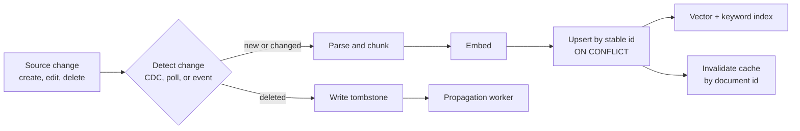
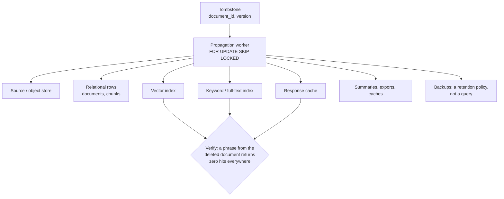

# Incremental Ingestion, Backfills, and Deletion

> **Interview answer (say this first).** Incremental ingestion keeps a knowledge base correct over time by giving every document a stable id and a content hash, then upserting only what changed, so a re-run never duplicates chunks. A backfill replays a corrected document through that same idempotent path, guarded by a source version. Deletion is a propagated and verified operation: a tombstone fans out to the source, chunks, vectors, keyword index, and caches, and you prove zero hits before calling it done.

## Why this exists

A knowledge base is not built once. Documents are edited, replaced, moved, and deleted every day. If the pipeline cannot handle those events, the index slowly diverges from reality. Two failures show the cost.

**Failure 1: duplicates that drown out everything else.** A nightly job re-ingests a shared folder. One `refund-policy.pdf` is re-parsed every night because the poller watches the file's modified time, and that timestamp never settles. Each run inserts new chunk rows, because chunk ids are random UUIDs. After thirty nights:

```text
source:       refund-policy.pdf
indexed rows: 30 copies of every chunk
search "how long do refunds take":
  1. refunds within 5 business days   (score 0.91)
  2. refunds within 5 business days   (score 0.91)
  3. refunds within 5 business days   (score 0.91)
  ...                                  (27 more copies)
  30. shipping takes 3 to 5 days       (score 0.62)
```

The duplicate copies fill the top of the ranking. The genuine shipping answer is pushed out of the context window. The model repeats one sentence because all of its evidence is the same sentence.

**Failure 2: a deletion that does not stick.** A customer asks you to erase their data. You delete the source file from the bucket. The chunks and vectors are still in the index, because nothing told them the source was gone. Search still returns the deleted text, and the model still quotes it back. The same thing happens for a revoked policy, a retracted price, or a leaked secret. Deleting the source deleted nothing that retrieval can see.

Both failures share one root cause: ingestion is treated as a one-off write instead of a reconciliation between a source that changes and derived stores that must follow it. This page is how to reconcile.

## Start from zero

| Word | Plain meaning |
| --- | --- |
| **Incremental ingestion** | Indexing only what changed since the last run, instead of the whole corpus. |
| **Full reindex** | Rebuilding the whole index from the corpus. Expensive but always correct. |
| **Upsert** | Insert if the id is new, update if it already exists. One operation, no duplicates. |
| **Idempotency** | Running an operation twice has the same effect as running it once. |
| **Deduplication** | Detecting identical content so it is stored once, not many times. |
| **Content hash** | A short fingerprint of the normalised text. Same text, same hash; changed text, changed hash. |
| **Watermark / cursor** | A saved position ("I have processed up to here") so the next run resumes without redoing work. |
| **Backfill** | Recomputing derived data after a change: re-embedding a corrected document, or filling a new field. |
| **Replay** | Re-processing an event or a batch you already handled. Safe only if the write is idempotent. |
| **Tombstone** | A marker that says "this document is deleted", kept so the deletion can propagate. |
| **Soft delete** | Marking a row deleted (for example `deleted_at`) but keeping the row for audit or undo. |
| **Hard delete** | Physically removing the row and its derived data. |
| **Deletion propagation** | Pushing one deletion into every store that copied the data. |
| **Derived store** | Any store built from the source: chunks, vectors, keyword index, cache, summaries. |
| **Cache invalidation** | Removing cached answers that were computed from data that has since changed. |
| **Eventual consistency** | A short window where old and new data both exist after a change. |
| **Exactly-once effect** | The result happens once even though the work may be attempted many times. |
| **Checkpoint** | A durable record of how far a job has progressed, used to resume after a crash. |
| **Change data capture (CDC)** | Reading the database's own write log to detect inserts, updates, and deletes. |

Three ideas carry the whole topic:

- **Identity is not content.** A document's id comes from *where it lives* (its canonical source path), so an edit keeps the same id. The content hash comes from *what it says*, so you can detect the edit without comparing bytes. Mixing these up is the duplicate-chunk bug.
- **Delivery is usually at-least-once.** Queues, webhooks, and retries deliver the same event more than once. You rarely get exactly-once delivery. You get the *effect* of exactly-once by making the write idempotent and recording a checkpoint.
- **The source is truth; everything else is a copy.** A copy is only as correct as the last propagation that reached it. Deletion is the propagation people forget.

## The core idea

Picture a librarian reconciling a catalogue against a stream of notices. The shelves are the source of truth; the catalogue is the index. Notices arrive all day: a new book, a corrected edition, a withdrawal. The librarian does not re-copy the whole library. They copy only the changed books and remove the withdrawn ones.

Two details make it work. First, a catalogue number is assigned by shelf position, not by the book's text, so a corrected edition keeps its number. Second, a withdrawal is not one action; it is a list — remove the card, the shelf copy, the reading-room copy, the index entry, and the reservation. If any copy survives, someone can still read a book that should be gone.

Ingestion is the same reconciliation. A change is detected, parsed, chunked, embedded, and written by a stable id. Deletion is a fan-out to every copy.



A delete is not complete when the source row is gone. It is complete when every derived store agrees.



The same decision applies to every change. Pick the tool from the situation:

| Situation | Right tool | Why |
| --- | --- | --- |
| New document | Incremental insert | Only the new chunks are embedded. |
| Edited document (or metadata-only change) | Incremental upsert | Unchanged documents are skipped; if only metadata changed, the text hash is unchanged, so the vectors stay valid. |
| Deleted document | Tombstone plus propagation | One marker must reach every derived store. |
| Chunker or embedding-model change | Full reindex into a new index | Every chunk id or vector changes. |
| Suspected drift or corruption | Full reindex | Rebuild from the source of truth, then compare. |

> **Tip:**
>
> **The mental shortcut.** Upsert by a stable id, guard by a source version, and treat deletion as a fan-out you must verify. If you can replay the whole pipeline twice and get the same index, you have built the right thing.

## How it works

1. **Detect the change.** Three signals are common. **CDC** reads the source database's write log (for example Postgres logical replication) and emits an event for each insert, update, and delete. A **poll** queries for rows or files newer than a saved cursor. An **event** is a webhook or a message the source pushes when something changes. CDC and events are fast and give deletes; a poll is simpler and often misses deletes unless the source tracks them.
2. **Compute a stable document id.** Derive it from the document's canonical location, such as `tenant + source_uri`, and hash that. The id must not change when the content changes. If the id is derived from content, an edit looks like a new document and the old chunks are orphaned.
3. **Compute a content hash.** Normalise the text (unicode, whitespace) and hash it. The hash decides whether to re-embed. Compare normalised text, not raw bytes, or a metadata-only change triggers pointless work.
4. **Upsert and skip unchanged content.** Write the document row and its chunks with `ON CONFLICT DO UPDATE`. If the incoming content hash equals the stored one, advance the version and skip embedding. If it differs, replace the document's chunks in the same transaction.
5. **Handle late and out-of-order events with a version and a watermark.** Every event carries a source version: a monotonic revision number or `updated_at` plus a tie-breaker. Apply an event only when its version is greater than the stored version. Ignore older events, because applying them would overwrite newer content with stale text. A watermark (or cursor) records how far a consumer has processed, so a restart resumes instead of restarting.
6. **Delete orphan chunks when a document shrinks.** Upsert alone never removes chunks. If a 40-chunk document is corrected down to 30 chunks, chunks 30–39 survive and keep serving deleted text. Delete rows with `ordinal >= new_chunk_count`, or replace the whole chunk set, in the same transaction as the document write.
7. **Backfill a corrected document through the identical path.** A backfill is just a re-ingest with a higher version. It replaces the document's chunk set atomically, so a concurrent reader sees either the old document or the new one, never a half-replaced mixture. Large backfills run in batches with a cursor and a checkpoint.
8. **Fan out a deletion with a tombstone.** Write the tombstone first. It stops the document from being served immediately and records the version so a late create for the same document cannot resurrect it. A worker claims unpropagated tombstones and deletes from every derived store: relational rows, chunks, vectors, keyword index, caches, and summaries.
9. **Prove the deletion.** Search each store for a distinctive phrase from the deleted document and assert zero hits. Record the check and its timestamp. Deletion from backups is a separate policy decision: you cannot query a backup, so you document that the data expires with the backup retention window.
10. **Keep in-flight queries consistent during a backfill.** Point serving at a versioned index, or build a shadow index and swap a pointer. Never delete and re-insert the live rows in a way that leaves a visible gap.

## The syntax you will use

**A stable id and a content hash.** The id comes from identity; the hash comes from content. Keeping them separate is the whole trick.

```python
import hashlib
import re
import unicodedata


def normalise(text: str) -> str:
    text = unicodedata.normalize("NFKC", text)      # one canonical unicode form
    return re.sub(r"\s+", " ", text).strip()        # one canonical whitespace


def document_id(tenant: str, source_uri: str) -> str:
    # Identity comes from where the document lives, not from its bytes.
    key = f"{tenant}\x00{source_uri}".encode("utf-8")
    return "doc_" + hashlib.sha256(key).hexdigest()[:32]   # 128 bits; a 12-hex-char id collides in large corpora


def content_hash(text: str) -> str:
    return hashlib.sha256(normalise(text).encode("utf-8")).hexdigest()[:16]
```

**The tables that make idempotency possible.** A unique `document_id` and a unique `chunk_id` let the database enforce "one row per thing".

```sql
CREATE TABLE documents (
    document_id  text PRIMARY KEY,
    tenant_id    text NOT NULL,
    source_uri   text NOT NULL,
    version      bigint NOT NULL,          -- the source revision
    content_hash text NOT NULL,
    updated_at   timestamptz NOT NULL DEFAULT now(),
    deleted_at   timestamptz
);

CREATE TABLE chunks (
    chunk_id    text PRIMARY KEY,          -- e.g. doc_ab12:0
    document_id text NOT NULL REFERENCES documents(document_id) ON DELETE CASCADE,
    ordinal     integer NOT NULL,
    content     text NOT NULL,
    embedding   vector(1536) NOT NULL,
    UNIQUE (document_id, ordinal)
);
```

**An idempotent document upsert with a version guard.** The `WHERE` clause is what makes late and duplicate events harmless: a lower or equal version updates nothing.

```sql
INSERT INTO documents (document_id, tenant_id, source_uri, version, content_hash, updated_at)
SELECT $1, $2, $3, $4, $5, now()
WHERE NOT EXISTS (                       -- never insert over an erasure
    SELECT 1 FROM tombstones t
    WHERE t.document_id = $1 AND $4 <= t.deleted_version
)
ON CONFLICT (document_id) DO UPDATE
SET source_uri   = EXCLUDED.source_uri,
    version      = EXCLUDED.version,
    content_hash = EXCLUDED.content_hash,
    updated_at   = now(),
    deleted_at   = NULL
WHERE EXCLUDED.version > documents.version   -- ignore late and duplicate events
  AND NOT EXISTS (                           -- and never resurrect an erased document
      SELECT 1 FROM tombstones t
      WHERE t.document_id = EXCLUDED.document_id
        AND EXCLUDED.version <= t.deleted_version
  );
```

The `WHERE` clause makes late and duplicate events harmless: an older or equal version updates nothing. The `NOT EXISTS` guards matter because a hard delete leaves no row to conflict with, so without them a later event would simply re-insert the document and resurrect content the user erased.

**Replace a document's chunks atomically.** Upsert the chunks the new version produced, then remove surplus ordinals when the document shrank. Run it in the same transaction as the document upsert, so a reader sees the old document or the new one, never a mixture.

```sql
BEGIN;

-- Upsert the new chunks; chunk_id is stable, so this is idempotent.
INSERT INTO chunks (chunk_id, document_id, ordinal, content, embedding)
VALUES ($2, $1, $3, $4, $5)
ON CONFLICT (chunk_id) DO UPDATE
SET content   = EXCLUDED.content,
    embedding = EXCLUDED.embedding;

-- If the corrected document is shorter, drop the surplus ordinals.
DELETE FROM chunks WHERE document_id = $1 AND ordinal >= $6;

COMMIT;
```

**A tombstone table.** The tombstone is written before any cleanup, so the document stops being served even if the cleanup job is slow or crashes. A **lease** lets a crashed worker's claim be retried instead of being lost.

```sql
CREATE TABLE tombstones (
    document_id      text PRIMARY KEY,
    deleted_version  bigint NOT NULL,
    deleted_at       timestamptz NOT NULL DEFAULT now(),
    claimed_at       timestamptz,
    lease_expires_at timestamptz,
    propagated_at    timestamptz
);
```

**A worker claims unpropagated tombstones safely.** `FOR UPDATE SKIP LOCKED` lets several workers run at once without stepping on each other, and the lease (not `propagated_at`) records the claim.

```sql
WITH claimed AS (
    SELECT document_id
    FROM tombstones
    WHERE propagated_at IS NULL
      AND (lease_expires_at IS NULL OR lease_expires_at < now())   -- free or expired lease
    ORDER BY deleted_at
    LIMIT 100
    FOR UPDATE SKIP LOCKED
)
UPDATE tombstones t
SET claimed_at       = now(),
    lease_expires_at = now() + interval '1 minute'   -- claim only; do not mark done
FROM claimed c
WHERE t.document_id = c.document_id
RETURNING t.document_id, t.deleted_version;
```

Mark the tombstone **propagated only after** the worker has removed the document from every derived store and verified it:

```sql
UPDATE tombstones SET propagated_at = now() WHERE document_id = $1;
```

This ordering is the whole point. The vector store and the cache are external and cannot be rolled back with the database transaction, so marking `propagated_at` at claim time would mark work as done that never happened — and the `WHERE propagated_at IS NULL` filter would never retry it.

**A backfill loop with a keyset cursor and a checkpoint.** Keyset pagination is stable under concurrent inserts *only if the key is immutable*. This job writes `updated_at`, so paging on `(updated_at, document_id)` revisits rows it just touched; page on an immutable key, or mark scanned rows, and save the checkpoint after each batch.

```sql
-- Next batch: take the rows after the last cursor you saw.
SELECT document_id, source_uri
FROM documents
WHERE deleted_at IS NULL
  AND (updated_at, document_id) > ($1, $2)     -- row-value comparison
ORDER BY updated_at, document_id
LIMIT $3;
```

A checkpoint is the same idea persisted: `INSERT INTO ingest_checkpoints (job, cursor, saved_at) VALUES ($1, $2, now()) ON CONFLICT (job) DO UPDATE SET cursor = EXCLUDED.cursor, saved_at = now();`. Write the effect and the checkpoint in the same transaction, or make the effect idempotent so replay is always safe. The second option is what this page teaches.

**Cache invalidation by key.** A response cache must know which documents produced each answer. The writer records a reverse index (a set of cache keys per document) so deletion can find and remove them.

```python
def cache_key(query: str, index_version: str) -> str:
    q = hashlib.sha256(query.strip().lower().encode("utf-8")).hexdigest()[:16]
    return f"rag:{index_version}:{q}"

def invalidate_document(redis, document_id: str) -> int:
    tag = f"doc:{document_id}:cache_keys"
    keys = redis.smembers(tag)
    if keys:
        redis.delete(*keys)
    redis.delete(tag)
    return len(keys)
```

## Examples: simple to real

These examples share one small in-memory store that mirrors the SQL above. It reuses `normalise`, `document_id`, and `content_hash` from the previous section. The store is a teaching model, not production code: it keeps chunks in a dict and replaces a document's chunk set on every content change.

```python
class Store:
    def __init__(self) -> None:
        self.docs: dict[str, dict] = {}
        self.chunks: dict[str, dict] = {}
        self.tombs: dict[str, int] = {}
        self.applied: set[str] = set()          # idempotency keys already applied
        self.cache: dict[str, set[str]] = {}     # query -> source document ids

    def chunk_ids(self, d: str) -> list[str]:
        return sorted(c for c, meta in self.chunks.items() if meta["doc"] == d)

    def ingest(self, *, d, uri, text, version, event, chunk_words=6) -> str:
        if event in self.applied:                          # replayed event
            return "skipped:event-replay"
        if d in self.tombs and version <= self.tombs[d]:   # event older than the delete
            return "ignored:stale-after-delete"
        current = self.docs.get(d)
        if current is not None and version <= current["version"]:
            return "ignored:late-event"                    # out-of-order or duplicate event
        h = content_hash(text)
        if current is not None and h == current["hash"]:    # content unchanged
            current["version"] = max(current["version"], version)
            current["uri"] = uri                            # metadata may still have changed
            self.applied.add(event)
            return "skipped:unchanged"
        for c in self.chunk_ids(d):                         # replace the chunk set
            del self.chunks[c]
        words = normalise(text).split()
        ids = [f"{d}:{i}" for i in range((len(words) + chunk_words - 1) // chunk_words)]
        for i, cid in enumerate(ids):
            self.chunks[cid] = {"doc": d, "text": " ".join(words[i * chunk_words:(i + 1) * chunk_words])}
        self.docs[d] = {"uri": uri, "version": version, "hash": h, "chunks": ids}
        self.applied.add(event)
        return f"upserted:{len(ids)}-chunks"

    def delete(self, d: str, version: int) -> dict:
        self.tombs[d] = version                             # tombstone first
        gone = self.chunk_ids(d)
        for c in gone:
            del self.chunks[c]
        self.docs.pop(d, None)
        keys = sorted(q for q, sources in self.cache.items() if d in sources)
        for q in keys:
            del self.cache[q]
        return {"chunks_removed": len(gone), "cache_keys_invalidated": keys}
```

**Example 1 — ingest the same document twice and prove no duplicate chunks.** The second event has a new event id and a higher version but identical content. The content hash matches, so the store skips embedding and keeps two chunks, not four.

```python
s = Store()
uri = "s3://kb/refunds.md"
d = document_id("tenant-a", uri)
text = "Refunds take five business days to the original payment method."

print("id:", d, "hash:", content_hash(text))
print("1st :", s.ingest(d=d, uri=uri, text=text, version=1, event="e1"))
print("2nd :", s.ingest(d=d, uri=uri, text=text, version=2, event="e2"))
print("replay:", s.ingest(d=d, uri=uri, text=text, version=2, event="e1"))
print("docs:", len(s.docs), "chunks:", s.chunk_ids(d))
```

Measured output:

```text
id: doc_a2daeb9e6be4 hash: 9c3268559fd6ad53
1st : upserted:2-chunks
2nd : skipped:unchanged
replay: skipped:event-replay
docs: 1 chunks: ['doc_a2daeb9e6be4:0', 'doc_a2daeb9e6be4:1']
```

Three runs, one document, two chunks. The `skipped:unchanged` path avoided a re-embed, and the replay was recognised by its event id. Compare this with the opening failure: thirty runs would still leave two chunks.

**Example 2 — backfill a corrected document atomically.** The refund window changed from five days to ten. The content hash changes, so the store deletes the old chunk set and writes the new one in one step. No stale chunk survives.

```python
old = s.docs[d]["hash"]
print("before:", [s.chunks[c]["text"] for c in s.chunk_ids(d)])
print("backfill:", s.ingest(d=d, uri=uri, version=3, event="e3",
                            text="Refunds take ten business days to the original payment method."))
print("after :", [s.chunks[c]["text"] for c in s.chunk_ids(d)])
print("hash:", old, "->", s.docs[d]["hash"])
print("stale chunks left:", [c for c in s.chunk_ids(d) if "five" in s.chunks[c]["text"]])
```

Measured output:

```text
before: ['Refunds take five business days to', 'the original payment method.']
backfill: upserted:2-chunks
after : ['Refunds take ten business days to', 'the original payment method.']
hash: 9c3268559fd6ad53 -> be742cf9b02db810
stale chunks left: []
```

The unchanged second chunk was still re-written here because the store replaces the whole set. A smarter pipeline hashes each chunk and skips the unchanged ones, but correctness comes first: after the backfill, searching "five business days" returns nothing.

**Example 3 — delete propagated to source, chunks, vectors, and cache.** The refunds document is erased. The store records a tombstone, removes its chunks (the vector and keyword copies live in the same structure here), and invalidates every cache entry that cited it. The shipping answer survives.

```python
s2 = Store()
a = document_id("tenant-a", "s3://kb/refunds.md")
b = document_id("tenant-a", "s3://kb/shipping.md")
s2.ingest(d=a, uri="s3://kb/refunds.md", text="Refunds take five business days.", version=1, event="a1")
s2.ingest(d=b, uri="s3://kb/shipping.md", text="Shipping is free over fifty dollars.", version=1, event="b1")
s2.cache = {"how long do refunds take": {a}, "is shipping free": {b}, "refund and shipping": {a, b}}

print("before:", {k: sorted(v) for k, v in sorted(s2.cache.items())})
print("report:", s2.delete(a, version=2))
print("after :", {k: sorted(v) for k, v in sorted(s2.cache.items())})
print("chunks left:", s2.chunk_ids(a), "| tombstones:", s2.tombs)
print("late v1 after delete:", s2.ingest(d=a, uri="s3://kb/refunds.md",
                                         text="Refunds take five business days.", version=1, event="a0"))
print("resurrect v3:", s2.ingest(d=a, uri="s3://kb/refunds.md",
                                 text="Refunds take five business days.", version=3, event="a3"))
```

Measured output:

```text
before: {'how long do refunds take': ['doc_a2daeb9e6be4'], 'is shipping free': ['doc_98c7fd6a5911'], 'refund and shipping': ['doc_98c7fd6a5911', 'doc_a2daeb9e6be4']}
report: {'chunks_removed': 1, 'cache_keys_invalidated': ['how long do refunds take', 'refund and shipping']}
after : {'is shipping free': ['doc_98c7fd6a5911']}
chunks left: [] | tombstones: {'doc_a2daeb9e6be4': 2}
late v1 after delete: ignored:stale-after-delete
resurrect v3: upserted:1-chunks
```

Three things happened. The deleted document's chunks are gone, so retrieval cannot return them. Both cache entries that cited it were invalidated, while the shipping-only entry stayed. And an old event (version 1) arriving after the delete was refused, because the tombstone recorded version 2; only a genuinely higher version (3) can re-create the document. In production, the same fan-out must also reach the separate vector store and keyword index, and a verification query must confirm zero hits in each.

> **Deletion is not the same as erasure.** Letting a genuinely higher version (3) re-create a withdrawn document is correct when a source was removed temporarily and later restored. For a **legal erasure** — a data-subject deletion request — recreation must be impossible: keep a permanent suppression record that no future version can override, and verify it in every derived store.

**Example 4 — a late event must not regress newer content.** A queue redelivers an old edit. The stored document is at version 7 and says ten days; the late event is version 5 and says five days. The version guard rejects it, so the newer content stays.

```python
s3 = Store()
d3 = document_id("tenant-a", "s3://kb/refunds.md")
s3.ingest(d=d3, uri="s3://kb/refunds.md", text="Refunds take ten business days.", version=7, event="v7")
print("stored:", s3.docs[d3]["version"], s3.chunks[s3.chunk_ids(d3)[0]]["text"])
print("late v5:", s3.ingest(d=d3, uri="s3://kb/refunds.md",
                            text="Refunds take five business days.", version=5, event="v5-late"))
print("stored:", s3.docs[d3]["version"], s3.chunks[s3.chunk_ids(d3)[0]]["text"])
print("hash:", s3.docs[d3]["hash"])
```

Measured output:

```text
stored: 7 Refunds take ten business days.
late v5: ignored:late-event
stored: 7 Refunds take ten business days.
hash: a0b527c51a16f362
```

Without the guard, this late event would silently revert the policy to five days. The version need not be a number: a timestamp plus a tie-breaker works, as long as it is monotonic per document. Store the version with the document and compare on every write.

**Example 5 — a checkpointed backfill resumes without double-applying.** Five documents need a corrected field. The job pages by source URI, applies two at a time, and saves the cursor after each batch. After a simulated crash it retries the first batch; the event ids make that a no-op.

```python
s4 = Store()
uris = sorted(f"s3://kb/{n}.md" for n in ["alpha", "beta", "gamma", "delta", "epsilon"])
for i, u in enumerate(uris, 1):
    s4.ingest(d=document_id("t", u), uri=u, text=f"{u} policy one two three four", version=1, event=f"e{i}")


def backfill_batch(store, after, size=2):
    order = sorted((v["uri"], k) for k, v in store.docs.items())
    keys = [(u, k) for u, k in order if after is None or u > after][:size]
    done = [(u, store.ingest(d=k, uri=u, version=2, event=f"backfill-{u}",
                             text=f"{u} policy one two three four revised")) for u, k in keys]
    return (keys[-1][0] if keys else after), done


checkpoint = None
applied = []
checkpoint, results = backfill_batch(s4, None)
applied += [u for u, _ in results]
print("batch 1:", results, "| checkpoint:", checkpoint)
print("retry after crash:", backfill_batch(s4, None)[1])
for _ in range(2):
    checkpoint, results = backfill_batch(s4, checkpoint)
    applied += [u for u, _ in results]
    print("next batch:", results, "| checkpoint:", checkpoint)
print("effects applied:", len(applied), "unique docs:", len(set(applied)))
```

Measured output:

```text
batch 1: [('s3://kb/alpha.md', 'upserted:2-chunks'), ('s3://kb/beta.md', 'upserted:2-chunks')] | checkpoint: s3://kb/beta.md
retry after crash: [('s3://kb/alpha.md', 'skipped:event-replay'), ('s3://kb/beta.md', 'skipped:event-replay')]
next batch: [('s3://kb/delta.md', 'upserted:2-chunks'), ('s3://kb/epsilon.md', 'upserted:2-chunks')] | checkpoint: s3://kb/epsilon.md
next batch: [('s3://kb/gamma.md', 'upserted:2-chunks')] | checkpoint: s3://kb/gamma.md
effects applied: 5 unique docs: 5
```

The retry after the crash did nothing, because the idempotency keys were already in `applied`. The backfill still finished all five documents. That combination — at-least-once delivery plus an idempotent write plus a checkpoint — is what people mean by an exactly-once effect.

## In production

- **Re-ingestion must be idempotent.** Assume every job runs twice: once for real, once on retry. A second run must replace rows, not append copies. This is the single most common cause of duplicate chunks.
- **Stable ids and content hashes prevent duplicates.** The id comes from the source location; the hash comes from normalised text. Deriving the id from content turns every edit into a new document and orphans the old chunks forever.
- **Deletes must reach every derived store or you have a data-protection problem.** Chunks, vectors, keyword index, response caches, summaries, and exports are all copies. A deletion that stops at the source is not a deletion.
- **A tombstone is the ordering device.** Write it before cleanup, keep the deleted version, and refuse later events at or below that version. It both stops serving immediately and prevents a stale re-create.
- **`ON CONFLICT` is necessary but not sufficient.** Upserting chunks never removes surplus ones. When a document shrinks, delete `ordinal >= new_count`, or replace the whole chunk set in one transaction.
- **Late events cause stale overwrites.** Compare a monotonic source version on every write. Without it, an old message redelivered by a queue silently reverts a corrected policy.
- **Backfills need a shadow or versioned index to keep queries consistent.** Replacing a live document's rows one statement at a time exposes a partial state. Do the replacement in a transaction, or build the new index beside the old one and swap a pointer.
- **Caches key on content version.** A response cache with no version in the key keeps serving a deleted or corrected answer until its TTL expires. Invalidate on change, or include the version in the key so a new version is a new entry.
- **Deletion from backups is a policy, not a query.** You cannot search a backup on demand. State how long erased data may persist in backups, encrypt them, and let the retention window expire it.
- **Verify deletion with a test, not a hope.** After fan-out, search every store for a distinctive phrase from the deleted document and assert zero results. Record the check with a timestamp; compliance wants evidence.
- **Exactly-once effects need idempotency keys and checkpoints.** Deduplicate on an event id, write the effect and the checkpoint together (or make the effect idempotent), and make retries safe.
- **Reindexing at scale is a cost and latency trade-off.** Full reindexing is simple and always correct but re-embeds everything; incremental is cheap but needs stable ids and a diff. Start incremental, keep a full-reindex path for model and chunker changes.

## Interview questions

### 1. How do you make ingestion idempotent?

**Answer.** Give each operation a deterministic key and make the write an upsert. The document id is derived from the source location, the chunk id from the document id and ordinal, and the event id from the source event. Writing the same event twice hits `ON CONFLICT` and updates the same row instead of inserting a new one. If the content hash is unchanged, skip the embedding entirely.

**Follow-up: "What if the pipeline crashes halfway?"** Replay the batch from its checkpoint. Because every write is keyed, the replay overwrites the rows it already wrote and skips the rest. That is why idempotency and checkpoints are always discussed together.

**Trap.** Using random UUIDs as chunk ids. They make every run insert fresh rows, which is exactly the duplicate-chunk failure.

### 2. How do you detect what changed, and why do you need a watermark?

**Answer.** Three signals: CDC from the source's write log, a poll against a saved cursor, or an event pushed by the source. All three need a watermark — a durable record of how far you have processed — so a restart resumes rather than reprocessing or skipping. A watermark on a monotonic column like `(updated_at, id)` is easy to reason about; a bare `updated_at` is not unique and can skip rows that share a timestamp.

**Follow-up: "Why can a poll miss deletions?"** A poll usually asks for rows that still exist and are newer than the cursor. A deleted row is gone, so it never appears. You need the source to keep a soft delete, a change log, or a CDC feed to see deletions.

**Trap.** Using a single non-unique timestamp as the cursor. Two rows updated in the same millisecond can cause one to be skipped forever.

### 3. When do you upsert incrementally, and when do you run a full reindex?

**Answer.** Incremental when the identity and meaning of chunks and vectors stay the same: content edits, metadata changes, new and deleted documents. Full reindex when every chunk or vector changes: a new embedding model, a different chunker or chunk size, a normalisation change, or a migration between stores. Also reindex when you suspect drift between the source and the index.

**Follow-up: "Why not always reindex everything?"** Cost and time. Re-embedding a large corpus takes hours and real money, and it rebuilds vectors that did not change. Incremental work scales with what changed; a full reindex scales with the corpus.

**Trap.** Running a full reindex in place over the live index. If it fails halfway, you serve a mixture of old and new vectors, which is worse than the state you started in.

### 4. How do you delete a document completely?

**Answer.** Write a tombstone first so it stops being served, then fan out to every derived store: relational rows and chunks, the vector index, the keyword index, response caches, and any summaries or exports. Verify by searching each store for a distinctive phrase and asserting zero hits. Backups are handled by retention policy, not by a query: you document how long erased data may remain and let it expire.

**Follow-up: "What is the hardest part?"** Finding every copy. Data is duplicated into indexes, caches, traces, and exports, and each copy has its own delete mechanism. Keeping a registry of derived stores and invalidation tags is the practical answer.

**Trap.** Deleting the source and assuming the index follows. Nothing propagates unless a job does it.

### 5. What is a tombstone, and why not just delete the row?

**Answer.** A tombstone is a durable marker that an id is deleted, with the version at which it was deleted. It lets you stop serving the document immediately, then propagate to slow stores asynchronously. It also blocks late events: an event whose version is at or below the tombstone's version is ignored, so a redelivered old create cannot resurrect deleted content.

**Follow-up: "When do you remove the tombstone?"** Only after every derived store has acknowledged the deletion and any relevant retention window has passed. If you remove it too early, a late event can recreate the document.

**Trap.** Treating deletion as an event instead of a state. A one-shot delete message that is lost leaves the data in place; a tombstone is a fact workers can retry against.

### 6. How do late or out-of-order events corrupt a knowledge base?

**Answer.** An event that describes older content overwrites newer content if the write has no version guard. A queue redelivery, a retry, or two workers racing can all deliver an old edit after a new one. The result is a document that silently reverts: the index shows a superseded price, policy, or name. The fix is a monotonic version per document and a conditional write that only applies when the incoming version is greater.

**Follow-up: "How do you build a monotonic version?"** Use the source's revision number if it has one. Otherwise use `updated_at` plus a tie-breaker such as a sequence id, and compare the tuple. Make the ordering rule explicit and tested.

**Trap.** Comparing timestamps from different clocks. Clock skew between services can make a newer event look older, so prefer a version generated by the source of truth.

### 7. How do you keep queries consistent during a backfill or large reindex?

**Answer.** Never mutate the live index in place in a way that leaves a visible gap. Either do each document's replacement in a single transaction so readers see the old or the new version, or build a shadow copy and swap an alias when it is complete and validated. Warm the new copy and keep the old one for rollback. Document the short eventual-consistency window.

**Follow-up: "What about changes that arrive during the backfill?"** Snapshot the corpus at the start and queue changes that arrive during the run, then replay them after the swap, or run a short incremental catch-up before switching. Version guards make the catch-up safe.

**Trap.** Forgetting the caches. A response cache keyed only on the query keeps returning old answers after the index has moved on.

### 8. What does "exactly-once effect" mean, and how do you get it?

**Answer.** Delivery is usually at-least-once, so an operation may be attempted many times. The *effect* can still happen once if the write is idempotent and the job records progress. In practice: deduplicate on an event id, write the effect and the checkpoint in the same transaction, or make the effect an upsert keyed by a stable id so replay is harmless. Then a crash and retry produce the same index.

**Follow-up: "Can you get true exactly-once delivery?"** Not across a network with retries. You get at-least-once delivery plus idempotent processing, which is what people actually build when they say exactly-once.

**Trap.** Recording the checkpoint before the effect is durable. A crash in between marks work as done that never happened, and the data is silently missing. Record the checkpoint after the effect, or in the same transaction.

## Remember this

- **Identity is not content.** Derive the document id from the source location and the content hash from normalised text, so edits keep their id and unchanged content is skipped.
- **Upsert by stable id and guard by source version.** Idempotent writes make retries safe, and the version guard stops late events overwriting newer content.
- **A backfill is just a re-ingest with a higher version.** Replace the chunk set atomically, run it in batches with a checkpoint, and keep serving consistent with a versioned or shadow index.
- **Deletion is a fan-out you must verify.** Write a tombstone first, propagate to every derived store including caches, and prove zero hits before you call it done.
- **Exactly-once effect = at-least-once delivery + idempotent writes + checkpoints.** Backups expire by retention policy, not by a delete query.
