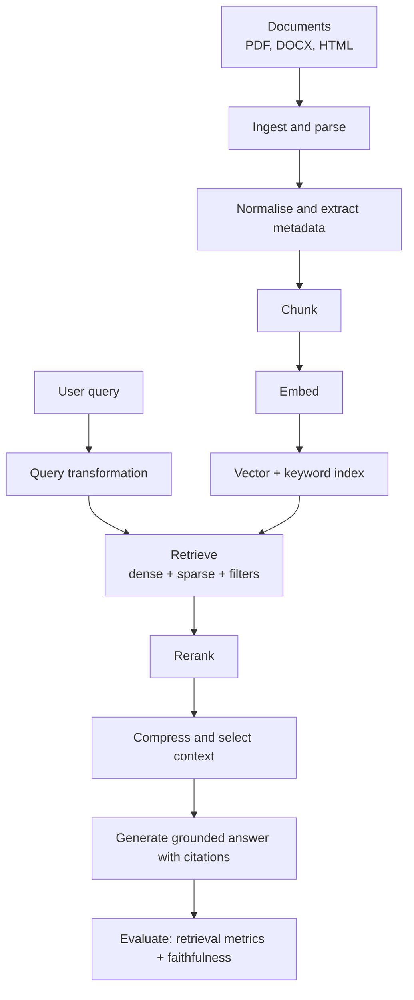

# Phase 3 — RAG Engineering

Retrieval-augmented generation (RAG) is how you give a language model knowledge it was never trained on: your documents, your policies, your code. Instead of hoping the model remembers, you retrieve the relevant text and put it in the prompt.

RAG is the most common production AI pattern after plain chat, and it is where many AI systems succeed or fail. The model is rarely the weak link; retrieval is. This phase builds retrieval from the ground up: ingesting documents, chunking them, embedding them, searching them, ranking the results, and measuring whether any of it actually works.

## What you will be able to do

By the end of this phase you should be able to:

- Explain the full RAG pipeline and where each stage fails.
- Ingest and normalise PDFs, DOCX, and HTML into clean text.
- Choose and justify a chunking strategy, and attach useful metadata.
- Explain embeddings, similarity metrics, vector indexes, and ANN trade-offs.
- Implement dense, sparse, and hybrid retrieval, and apply metadata filters.
- Improve recall with query transformation (rewriting, expansion, multi-query, HyDE).
- Rerank, compress, and select context before generation.
- Generate grounded, cited answers and version a knowledge base safely.
- Measure retrieval and generation with Recall@K, Precision@K, MRR, NDCG, faithfulness, and relevance.
- Operate RAG securely across tenants with access-controlled retrieval.

## The pipeline

Everything before the user's query is **offline indexing**; everything from the query onward is **online serving**. Most RAG bugs are in one of the two, and the first job in debugging is deciding which.

## Topic order

1. [RAG architecture](01-rag-architecture.md) — the whole pipeline end to end.
2. [Document ingestion and parsing](02-document-ingestion-and-parsing.md) — getting clean text out of PDFs, DOCX, and HTML.
3. [Chunking strategies](03-chunking-strategies.md) — fixed, recursive, semantic, and parent-child.
4. [Metadata extraction and filtering](04-metadata-extraction-and-filtering.md) — attaching and using structure.
5. [Embedding models and dimensions](05-embedding-models-and-dimensions.md) — choosing what turns text into vectors.
6. [Similarity metrics](06-similarity-metrics.md) — cosine, dot product, and when they differ.
7. [Vector databases and ANN indexes](07-vector-databases-and-ann-indexes.md) — HNSW and approximate search.
8. [PostgreSQL pgvector](08-postgresql-pgvector.md) — vector search in a database you already run.
9. [Dense and sparse retrieval](09-dense-and-sparse-retrieval.md) — embeddings versus BM25 and full-text search.
10. [Hybrid search](10-hybrid-search.md) — combining dense and sparse results.
11. [Query transformation](11-query-transformation.md) — rewriting, expansion, multi-query, and HyDE.
12. [Reranking](12-reranking.md) — cross-encoders and the second stage.
13. [Context construction](13-context-construction.md) — compression and selection.
14. [Citations and grounded generation](14-citations-and-grounded-generation.md) — answers you can verify.
15. [Knowledge-base versioning](15-knowledge-base-versioning.md) — changing the corpus safely.
16. [RAG caching and latency](16-rag-caching-and-latency.md) — making retrieval fast and affordable.
17. [Retrieval metrics](17-retrieval-metrics.md) — Recall@K, Precision@K, MRR, NDCG.
18. [Generation quality metrics](18-generation-quality-metrics.md) — faithfulness, answer relevance, context relevance.
19. [RAG evaluation and testing](19-rag-evaluation-and-testing.md) — offline suites, regression, and CI gates.
20. [Multi-tenant RAG](20-multi-tenant-rag.md) — isolation and shared infrastructure.
21. [RAG security and access control](21-rag-security-and-access-control.md) — retrieval that respects permissions.
22. [Data contracts, lineage, and quality](22-data-contracts-lineage-and-quality.md) — making the data behind retrieval trustworthy and traceable.
23. [Incremental ingestion, backfills, and deletion](23-incremental-ingestion-backfills-and-deletion.md) — keeping the knowledge base correct over time.

> **Tip:**
>
> **How to study this phase.** Keep asking "which stage is this?" Every technique here improves one of four things: the quality of the corpus, the quality of retrieval, the quality of the context, or your ability to measure the first three. If you cannot say which, the technique is not worth adding.

## Checkpoint project

At the end of the phase, build [Project 1 — Production Enterprise RAG Engine](../projects/01-production-enterprise-rag-engine.md): ingest PDFs and DOCX, chunk and embed them, serve hybrid search over PostgreSQL with pgvector, rerank, answer with citations, and evaluate retrieval and faithfulness on a labelled dataset. The exact scope lives in the projects part of the book.

## Checkpoint and evidence

Complete this checkpoint before moving on. It follows the [competency and evidence contract](../projects/competency-evidence.md) — **learn → build → measure → break → explain**. The artifact is the proof; the explanation is the interview rehearsal.

| Step | Artifact | Pass condition |
| --- | --- | --- |
| **Build** | `artifacts/phase-03/ingestion/` — an incremental ingestion pipeline with a data contract, lineage, quality checks, and deletion. | A document ingested twice produces no duplicate chunks. |
| **Measure** | A freshness and data-quality report; duplicate-chunk count. | Freshness meets the stated SLO and quality checks pass. |
| **Break** | Delete a document and run an in-flight query; backfill a corrected document. | Deletion reaches source, chunks, vectors, cache, and logs, and live queries stay consistent. |
| **Explain** | What happens when source truth changes after indexing. | You can defend the backfill and deletion design and answer “why not just reindex everything?”. |

> **Evidence tip.** Keep the artifact in your own repository and record it in the [checkpoint record](../projects/competency-evidence.md#the-checkpoint-record). If the artifact does not exist, the phase is not finished.
