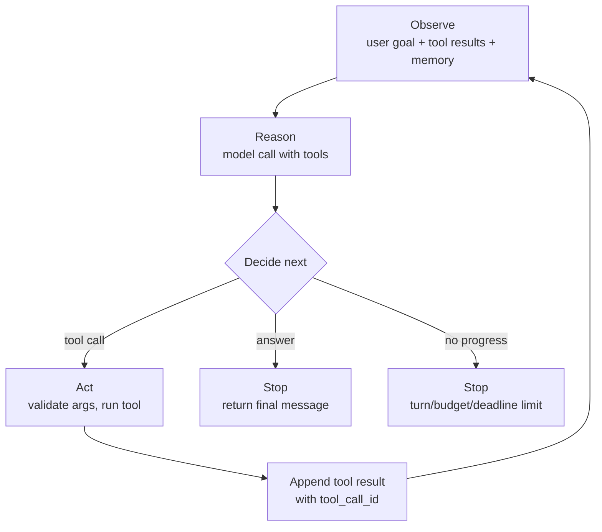

# The Agent Loop

> **Interview answer (say this first).** The agent loop is the repeated cycle of observe, reason, and act: your code sends the conversation and tool schemas to the model, the model decides either to answer or to call a tool, your code validates and runs that tool, and the result goes back into the conversation for the next turn. It ends when the model answers without a tool call or a limit stops it. Every turn resends the growing context, so cost and latency rise with each pass.

## Why this exists

A single model call has no feedback. The model produces text and never learns what happened next. That is fine for drafting and summarising, but it cannot run a task that depends on live results.

Imagine the instruction: *"If the customer's order is late, refund it."* The model cannot know whether the order is late. It has no access to the order system, and even if you paste an order status into the prompt, a fixed prompt cannot chase the next question — what if the lookup returns two orders, or the refund fails, or the customer has a second late order?

The naive "fix" is to write a long prompt that asks the model to describe its next action in prose:

```text
Model: First I would check the order status, then if late, call refund.
```

Now your program has to parse an English plan. That is fragile and it does not actually act. The model described work; nobody did it.

A second naive fix is a fixed chain: check status, then always refund, then always email. That works until the order is not late, or the refund needs a manager, or the email address is missing.

The **agent loop** fixes both. The model chooses one action at a time; your code performs it; the result becomes part of the conversation; the model sees what happened and chooses again. The task is now driven by real observations instead of a script.

This page is the mechanism behind every framework you will meet. LangGraph, the OpenAI Agents SDK, and CrewAI are, at heart, ways to run and inspect this loop. Learn it once and the frameworks become conveniences rather than mysteries.

> **Note:**
>
> **The one-sentence purpose.** The loop gives the model feedback, so it can choose a different next step after seeing what actually happened.


## Start from zero

| Word | Plain meaning |
| --- | --- |
| **Turn** | One model call plus the tool work that follows, before the next model call. |
| **Observe** | Read the current state: the user request and every tool result so far. |
| **Reason** | Interpret the observations and decide what to do next. The model does this internally. |
| **Act** | Perform the chosen action, usually running one or more tools. |
| **Tool call** | The model's structured request: a tool name plus JSON arguments. |
| **Tool result** | The output of running the tool, appended to the conversation. |
| **Observation** | A tool result as seen by the model on the next turn. |
| **Stopping condition** | The rule that ends the loop, such as "no tool call" or "turn limit reached". |
| **Trajectory** | The full ordered record of turns, tool calls, arguments, results, and errors. |
| **Scratchpad** | A place where the agent writes intermediate notes it will need later. |
| **Context window** | The maximum text, in tokens, the model can consider in one call. |
| **Token** | A chunk of text, roughly three-quarters of a word in English. The unit of cost and limits. |
| **Budget** | A cap on tokens, money, turns, or wall-clock time. |
| **ReAct** | A pattern that alternates a reasoning note with an action, then observes the result. |
| **Thought** | The short reasoning text in a ReAct transcript; often hidden from the user. |
| **Loop detection** | Spotting that the agent is repeating the same action and breaking out. |
| **Retry** | Running a failed step again, often after a short delay called **backoff**. |
| **Parallel tool calls** | Several independent tool calls returned in one turn and run together. |
| **Dependency** | When one action needs another action's result, so it must wait for a later turn. |

Two clarifications that matter:

- **A turn is not a tool call.** One turn can contain several parallel tool calls. Turn count and tool-call count are separate budgets.
- **Observation is data, not instruction.** The text a tool returns can contain anything, including text that looks like a command. Treat it as untrusted input.

## The core idea

Think of a **cook tasting a dish**. The recipe (the goal) says "make it taste right." The cook tastes (observe), decides "too bland" (reason), adds salt (act), and tastes again. That last part is the loop. A cook who adds salt once, without tasting, is following a script — a workflow. A cook who tastes after every change is running an agent loop.

The mental model is a **control loop**, the same shape as a thermostat: measure, compare to the goal, adjust, measure again. The model is the controller. The tools are the actuators. The conversation is the sensor reading.



The arrow from `E` back to `A` is the whole point. Remove it and you are back to a single call.

Single call versus loop, side by side:

| Question | Single model call | Agent loop |
| --- | --- | --- |
| Can it use live data? | No, unless you fetched it first | Yes, through tools |
| Can it recover from a failure? | No, it never sees one | Yes, the next turn sees the error |
| Can it choose the next step? | No, there is only one step | Yes, based on results |
| How many model calls? | One | One per turn |
| Cost behaviour | Fixed per request | Grows with the conversation |
| Failure mode | Wrong answer | Loop, wrong tool, runaway cost |
| Stopping | Automatic | You must define it |

The last row is the one interviewers care about. A single call always terminates. A loop is only as safe as its stopping conditions.

## How it works

1. **Assemble the context.** Build the message list: the system prompt, the user goal, and any memory (recent turns, scratchpad, retrieved documents). Include the tool schemas.
2. **Call the model.** One request containing messages plus tools. Start the turn timer and record the input token count.
3. **Read the reply.** The model returns either final content or one or more tool calls. If there are no tool calls, this is the natural stopping condition — return the answer.
4. **Append the assistant message first.** The tool-call request must be in the conversation before its results, or the provider cannot pair them.
5. **For each tool call, parse the arguments.** They arrive as a JSON string in the OpenAI shape, so parse before use.
6. **Validate against the schema.** Reject wrong types or missing fields. A bad argument becomes an error result, not a crash.
7. **Execute through the registry.** Look up the allowed function and run it. Unknown names return an error.
8. **Append one tool result per call, carrying the matching id.** The model uses the id to match a result to its request, which matters most with parallel calls.
9. **Check the limits.** Before looping, test turns, tokens, money, and wall-clock time. If any is exhausted, stop and report rather than continuing.
10. **Loop back to step 1.** The conversation is now longer by two messages, so the next context is bigger.
11. **Watch for no progress.** If the same tool is called with the same arguments repeatedly, break out. Loops that repeat are usually stuck, not thinking.
12. **Return and log.** Emit the final answer and the full trajectory: every turn, tool, argument, result, token count, and latency.

**How context grows.** Every turn appends the assistant message and one tool message per call, and every turn resends everything before it. Context grows roughly linearly with turns. Here are real numbers from this page's verified mock loop:

| Turn | Action | Context tokens sent |
| --- | --- | --- |
| 1 | `get_weather(paris)`, `get_weather(atlantis)` | 31 |
| 2 | `get_weather(tokyo)` after the error | 170 |
| 3 | `convert(18)` | 248 |
| 4 | final answer | 319 |

Total input tokens billed across the run: `31 + 170 + 248 + 319 = 768`, even though the final context is only 319. **You pay for the whole history again on every turn.**

**Cost and latency per turn.**

- **Input cost grows.** The model is billed for the full context each turn, so total input cost is the sum of the growing contexts, not the final size.
- **Output cost is per turn too.** Reasoning text and tool-call arguments are output tokens.
- **Latency is the number of turns times the per-turn round trip.** Ten short turns usually feel slower than two long ones, because each turn waits for a network round trip.
- **Parallel calls flatten the curve.** Two independent tools in one turn cost one round trip instead of two, though the same tokens are still sent.

**Stopping conditions.** A production loop needs several, not one:

| Condition | Why it exists |
| --- | --- |
| Model returns no tool call | Natural success: the agent is done |
| Maximum turns reached | Prevents an endless conversation |
| Token or cost budget exhausted | Prevents runaway spend |
| Wall-clock deadline passed | Protects the user's request timeout |
| Repeated identical action | Detects a stuck loop |
| Permission denied or approval rejected | Respects human control |
| Unrecoverable error | Some failures should end the run |

**The ReAct loop.** ReAct stands for Reason plus Act. The model writes a short thought, chooses an action, the runtime returns an observation, and the cycle repeats. Old implementations parsed `Thought:` and `Action:` out of the text. Modern tool calling implements the same idea natively: the model's hidden reasoning is the thought, the tool call is the action, and the tool result is the observation. You do not need to parse anything if you use the provider's tool API.

## The syntax you will use

**The message list.** The loop mutates one list. Each role has a job.

```python
messages = [
    {"role": "system", "content": "You are a careful billing agent."},
    {"role": "user", "content": "Why did order 42 fail?"},
]
# after a tool call you append two kinds of message:
messages.append({"role": "assistant", "content": None, "tool_calls": [...]})
messages.append({"role": "tool", "tool_call_id": "c1", "content": "{\"status\":\"failed\"}"})
```

**The loop with a turn limit.** This is the smallest complete agent loop. The `for ... else` makes the limit explicit.

```python
for turn in range(1, MAX_TURNS + 1):
    reply = call_model(messages, tools=TOOL_SCHEMAS)
    messages.append(reply)
    if not reply.get("tool_calls"):
        break                                   # natural stop
    for call in reply["tool_calls"]:
        messages.append(execute_and_pack(call))
else:
    raise RuntimeError("turn limit reached")    # safety stop
```

**A budget check inside the loop.** Turns are not enough; a single turn can be enormous.

```python
import json
import tiktoken
ENC = tiktoken.get_encoding("cl100k_base")

def context_tokens(messages):
    return len(ENC.encode(json.dumps(messages)))

def check_budget(messages, turn):
    if context_tokens(messages) > TOKEN_BUDGET:
        return {"status": "budget_exceeded", "turn": turn}
    return None
```

**Measuring latency per turn.** Instrument the loop; never guess where the time goes.

```python
t0 = time.perf_counter()
reply = call_model(messages, tools=TOOL_SCHEMAS)
latency_ms = (time.perf_counter() - t0) * 1000
```

**Detecting a stuck loop.** Hash the action signature and count repeats.

```python
def action_signature(name, args):
    return f"{name}:{json.dumps(args, sort_keys=True)}"

def is_stuck(seen, signature, limit=2):
    seen[signature] = seen.get(signature, 0) + 1
    return seen[signature] > limit
```

**The ReAct prompt shape.** With a text-only model you ask for a thought before each action. With tool calling this is usually a system instruction, not a parser.

```text
Think briefly, then act.
When you need data, call a tool. When you can answer, stop.
Never repeat the same tool call with the same arguments.
```

**Handling parallel calls.** Iterate over all calls and append one result each. Do not assume there is only one.

```python
for call in reply.get("tool_calls") or []:
    result = dispatch(call)                        # validate, then run
    messages.append({"role": "tool",
                     "tool_call_id": call["id"],
                     "content": json.dumps(result)})
```

**Streaming, in one line.** Providers stream tool-call arguments in pieces, so accumulate the argument string and parse only when the call is marked complete.

```python
# tool_calls[i]["function"]["arguments"] += delta.arguments   # parse at the end
```

## Examples: simple to real

**Example 1 — the smallest working loop.** A scripted model calls `add(2,3)`, then `add(5,4)`, then answers. This was executed on this page; the loop took three turns and the context grew each time.

```text
turn 1  add({'a': 2, 'b': 3})  -> {'sum': 5}    context: 43 tokens
turn 2  add({'a': 5, 'b': 4})  -> {'sum': 9}    context: 125 tokens
turn 3  final: "The total is 9."                context: 206 tokens
```

The second call depended on the first result, so it had to wait for a later turn. That is a dependency, and it is why not all steps can be parallel.

**Example 2 — observe, reason, act, and recover.** This run (also executed here) shows the full cycle plus recovery and a dependent step.

```text
turn 1  get_weather(paris)     -> {'temp_c': 18}                 context: 31
        get_weather(atlantis)  -> {'error': 'unknown city'}      context: 31
turn 2  get_weather(tokyo)     -> {'temp_c': 27}                 context: 170
turn 3  convert(celsius=18)    -> {'fahrenheit': 64.4}           context: 248
turn 4  final: "Paris 18C, Tokyo 27C."                           context: 319
```

Turn 1 made two calls at once, one of which failed. Turn 2 shows recovery: the model saw `"error": "unknown city: atlantis"` and tried a valid city instead. Turn 3 shows a dependency: `convert` needed the `18` that turn 1 produced, so it could not be parallel with the weather calls.

**Example 3 — the turn limit stops a looping model.** A model that always calls a tool never reaches the natural stop. With `max_turns=3` the loop ends cleanly instead of running forever.

```text
loop status: turn_limit at turn 3
```

Without that cap, this run would have continued indefinitely.

**Example 4 — a budget stop beats a turn limit.** A one-turn context can already be too big. With a token budget of `1`, the loop stops before the first call.

```text
budget status: budget_exceeded at turn 1
```

This is why you check tokens, not just turns. A single tool result containing a large document can blow the window in one step.

**Example 5 — what the model sees as an observation.** The tool result is appended as a plain message. The model reads it as an observation on the next turn.

```json
{"role": "tool", "tool_call_id": "c1",
 "content": "{\"city\": \"paris\", \"temp_c\": 18}"}
```

The model now knows Paris is 18 degrees. If the content had been a 5,000-line table, the model would still read it — and you would pay for every line on every later turn. Keep results small and structured.

**Example 6 — a ReAct transcript at the text level.** Before native tool calling, the loop looked like this. The shape still explains the idea.

```text
Thought: I need the order status before deciding.
Action: lookup_order
Action Input: {"id": "42"}
Observation: {"status": "payment_failed", "code": "insufficient_funds"}

Thought: The card was declined, so retrying immediately will fail.
Action: page_team
Action Input: {"team": "billing", "note": "order 42 declined"}
Observation: {"paged": true}

Thought: I have handled it.
Final Answer: Payment failed for insufficient funds; billing has been paged.
```

Every modern loop is this, with the `Thought` kept inside the model and the actions expressed as structured tool calls.

## In production

- **Always set a turn limit.** It is the cheapest insurance in the whole system. Pick a number based on the task, not on optimism.
- **Budget in more than one dimension.** Turns, tokens, dollars, and wall-clock time all need caps. A single huge turn can blow a token budget without touching the turn limit.
- **Check limits before the call, not after.** If you check after the model call, you have already paid for it.
- **Expect context to grow quadratically in cost.** Total input spend is the sum of every turn's context. With steady per-turn growth the sum is about `(T + 1) / 2` times the final context, so ten turns bill roughly five times the final context, not one times.
- **Keep tool results small.** Trim, summarise, or select fields before appending. Large results are paid for on every subsequent turn.
- **Treat a repeated action as stuck.** Identical tool and arguments more than twice almost always means no progress. Break and escalate.
- **Return errors as results so recovery is possible.** An exception kills the loop; an error message lets the model choose differently.
- **Use parallel calls only for genuinely independent work.** Dependencies must wait. If order matters, say so in the tool descriptions or force one call per turn.
- **Distinguish transient from permanent failures.** Retry timeouts with backoff in your code; send bad-argument errors back to the model.
- **Log the trajectory with ids.** Turns, tool names, arguments, results, tokens, latency, and errors. Without ids, parallel calls are impossible to follow.
- **Do not let the model narrate hidden reasoning to the user.** Expose a clean answer; keep the scratchpad in the logs.
- **Test the loop with a fake model.** Scripted replies let you test turn limits, recovery, and budget stops deterministically.

## Interview questions

### 1. Walk me through the agent loop.

**Answer.** Build the context from system prompt, user goal, memory, and tool schemas. Call the model. If it returns no tool calls, return its answer and stop. Otherwise append the assistant message, and for each tool call parse the arguments, validate them, execute through the registry, and append a tool result with the matching id. Check the limits, then call the model again with the longer conversation. Repeat until a stopping condition.

**Follow-up: "What is the natural stopping condition?"** The model returning content with no tool calls. Every other stop is a safety limit.

**Trap.** Forgetting to append the assistant's tool-call message before the results. Providers need both sides of the exchange.

### 2. How does context change across turns?

**Answer.** It grows every turn. Each turn appends the assistant message and one tool message per call, and each new model call resends everything before it. Context grows roughly linearly with turns, and total input cost is the sum of the per-turn contexts, so cost grows faster than the final context size.

**Follow-up: "How do you keep it bounded?"** Trim old turns, summarise or compact the history, cap tool-result size, and put durable state outside the conversation.

**Trap.** Thinking one long context costs the same as several short ones. It does not, because of resending.

### 3. What is ReAct, and how does it relate to tool calling?

**Answer.** ReAct is a pattern that alternates reasoning and acting: a thought, an action, an observation, repeated until an answer. Early versions parsed thought and action labels from text. Modern tool calling implements the same loop natively — the model's hidden reasoning is the thought, the tool call is the action, and the tool result is the observation — so no text parsing is needed.

**Follow-up: "Does the model need to expose its reasoning?"** Not to the user, and often not at all. Some models expose reasoning tokens; others keep it internal. What matters is that the model can act and observe.

**Trap.** Believing ReAct requires a specific prompt string. The pattern is the loop, not the wording.

### 4. What stopping conditions would you put on a production loop?

**Answer.** At least: the model returns no tool call; a maximum turn count; a token or cost budget; a wall-clock deadline; detection of a repeated action; a denied approval; and an unrecoverable error. They are layered, because each catches a failure the others miss.

**Follow-up: "Which one fires most often in practice?"** The turn limit and repeated-action detector. Budgets fire on unusually large contexts.

**Trap.** Relying on the model to decide when to stop. It is one condition, not a guarantee.

### 5. Why does an agent cost more than a single call?

**Answer.** It makes many model calls, and each call resends the whole conversation. Input tokens are charged on every turn, so total input cost is the sum of growing contexts. Tool results, reasoning text, and tool-call arguments add output tokens too. Latency also compounds, because each turn is another round trip.

**Follow-up: "How do you control it?"** Fewer and better tools, smaller results, context compaction, caching stable prefixes, and hard budgets. Also choose a workflow when the task does not need the loop.

**Trap.** Assuming more turns means better answers. Beyond a point, extra turns add cost without quality.

### 6. How do you stop an agent that is going in circles?

**Answer.** Detect repeated actions by hashing the tool name and arguments, count repeats, and break after a small threshold. Also cap turns, detect no-change in state, and add a deadline. Then surface a clear failure instead of looping silently.

**Follow-up: "What causes loops?"** Ambiguous tools, missing information the model cannot obtain, an unhelpful error result, or a goal it cannot satisfy. The loop is a symptom; fix the cause.

**Trap.** Just raising the turn limit. That converts an infinite loop into an expensive one.

### 7. How do you debug an agent?

**Answer.** Read the trajectory. For each turn, check the context size, the model decision, the tool arguments, the validation result, the tool output, and the latency. Most bugs are visible as a wrong argument, a malformed result, or an error that never reached the model. Replay the trajectory with a fake model to isolate loop logic from model behaviour.

**Follow-up: "What do you log for parallel calls?"** The `tool_call_id` of every request and result, so each result can be matched to its call.

**Trap.** Logging only the final answer. The interesting failure is always in the middle turns.

### 8. What can go wrong with parallel tool calls?

**Answer.** The model may issue calls that look independent but are not, so one uses stale or missing data. It may also issue a write and a read of the same resource in one turn, where order matters. Parallel calls are safe only for truly independent work; dependencies must move to a later turn.

**Follow-up: "How do you enforce ordering?"** Describe the dependency in the tool descriptions, restrict to one call per turn for that workflow, or split the tools so the dependency is structural.

**Trap.** Assuming the model always understands ordering. Treat it as a design concern in your tool set.

## Remember this

- The loop is **observe → reason → act → observe**, with a model call and tool execution on every turn.
- **Context grows every turn**, and you pay for the whole history each time, so cost is the sum of contexts.
- **Stopping is your job**: no-tool-call, turn limit, token/cost budget, deadline, and no-progress detection.
- **Parallel calls are only for independent work**; dependencies wait for a later turn.
- **Log the trajectory.** Turns, tools, arguments, results, ids, tokens, and latency are the debugging surface.
