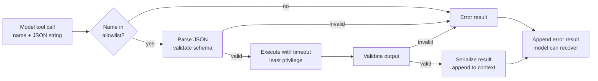

# Tool Execution and Result Validation

> **Interview answer (say this first).** Tool execution is the step where the model's request becomes a real function call, and it is a trust boundary. The model returns a tool name and a JSON argument string; your code checks the name against an allowlist, parses and validates the arguments against a schema, runs the function with a timeout, validates the output, and returns errors as data so the model can recover. The model never executes anything, and its output is treated exactly like untrusted input from the internet.

## Why this exists

The model produces a structured request, but it is still just text. It can name a tool that does not exist, send the wrong types, omit a required field, invent a plausible-looking value, or repeat a call. If you pass that straight into your code, the failure is a crash deep inside a function — far from the model output that caused it.

The most dangerous version is treating model output as code:

```python
# NEVER DO THIS
fn = eval(call["function"]["name"])          # model controls the name
fn(**json.loads(call["function"]["arguments"]))
```

`eval` executes whatever string it is given. If the model is tricked by injected text into naming `__import__('os').remove`, that code runs with your process's full permissions. The name came from a model, but it is not more trustworthy because of it.

There is a second, quieter problem: **tool output is also untrusted**. A tool that reads a web page, an email, or a database row can return text containing instructions aimed at the model. If the agent treats that text as commands, a malicious page can hijack the loop. This is prompt injection through a tool result.

A third problem is side effects. If a payment tool runs, times out, and your loop retries, the customer may be charged twice. A tool that sends an email may send it twice. A delete may run twice. Validation alone does not fix this; **idempotency** does.

This page makes the execution step safe: parse, validate, allowlist, time out, validate the output, make writes idempotent, and return every failure as a result the model can read.

> **Note:**
>
> **The one-sentence purpose.** Tool execution is where model output crosses into your program, so it gets the same treatment as any untrusted external input: allowlist, validate, sandbox, limit, and log.


## Start from zero

| Word | Plain meaning |
| --- | --- |
| **Tool execution** | Turning a tool call into a real function call and running it. |
| **Dispatch** | Looking up the named tool in a fixed registry and calling it. |
| **Allowlist** | A fixed list of tools that may run. Anything not on it is refused. |
| **Argument parsing** | Converting the JSON string the model produced into a Python value. |
| **Schema validation** | Checking that value against a declared shape: types, required fields, ranges. |
| **Output validation** | Checking the tool's return value before putting it into the conversation. |
| **Error as data** | Returning an error message as the tool result instead of raising an exception. |
| **Timeout** | A maximum time an operation may take before it is abandoned. |
| **Retry** | Running a failed operation again, usually a limited number of times. |
| **Backoff** | Waiting longer between retries, often doubling the delay each time. |
| **Idempotent** | Running it twice has the same effect as running it once. |
| **Idempotency key** | A unique id for one intended action, so a retry can be recognised and not repeated. |
| **Side effect** | An action that changes the world: charging, sending, deleting, writing. |
| **At-least-once** | A delivery guarantee where duplicates are possible, so tools must be idempotent. |
| **Prompt injection** | Text that tries to make the model do something the developer did not intend. |
| **Sandbox** | An isolated environment that limits what running code can touch. |
| **Circuit breaker** | A switch that stops calling a failing dependency for a while. |
| **Serialization** | Turning a Python result into JSON so it can go back into the conversation. |

Three distinctions to keep straight:

- **Validation is not authorisation.** A valid argument can still be a forbidden action. Validate the shape, then check permissions.
- **Retry safely means at-least-once.** If you retry, a duplicate may reach the tool. Only an idempotency key makes that safe.
- **A tool error is not an agent failure.** Most tool errors should go back to the model as data so it can adapt. Only unrecoverable faults should stop the loop.

## The core idea

Picture a **customs checkpoint**. Goods (the tool call) arrive from outside. The officer checks the paperwork: is this a permitted item (allowlist), does the form match the rules (schema), and is the declared value plausible (output validation)? Only then does the item enter the country. A suspicious item is refused with a note explaining why, and the sender can correct it.

The tool box in the middle is the only place real work happens, and the model is always outside it.



Every arrow from `B`, `C`, and `F` to `E` is a place where untrusted data is stopped before it can do harm. There are three validation layers, and each catches a different class of bug:

| Layer | Checks | Catches | Does not catch |
| --- | --- | --- | --- |
| Name allowlist | Is this tool registered? | Hallucinated tools, injection via tool name | Wrong arguments |
| Argument schema | Types, required fields, ranges | Wrong types, missing fields, bad values | Wrong but valid values |
| Output schema | Shape and range of the result | Broken tools, impossible values | Semantically wrong but valid output |

You also need a permission check that is separate from all three: "this caller may refund up to $50." That is authorisation, and it belongs in the tool or in a policy layer, not in the schema.

## How it works

1. **Receive the tool call.** It has an id, a name, and an argument string. Do not assume there is only one call.
2. **Check the name against the allowlist.** A fixed dictionary is enough. Unknown name means error result, no execution.
3. **Parse the arguments.** Use `json.loads` or better, let Pydantic parse and validate in one step. A JSON syntax error is an error result, not a crash.
4. **Validate against the argument schema.** Check types, required fields, and constraints. Pydantic collects all the problems, not just the first.
5. **Check authorisation.** Does this identity have permission for this tool and these values? Enforce limits such as maximum amount.
6. **Execute with a timeout.** Pass a timeout to network clients and wrap the call in a wall-clock guard. Never run an unbounded tool inside the loop.
7. **Catch tool exceptions.** A `ValueError`, `KeyError`, or `TypeError` is a tool result, not a reason to kill the run. Format it briefly and clearly.
8. **Validate the output.** Check the result against an output schema. A tool returning `temp_c: 999` is a sensor bug the model should not trust.
9. **Make writes idempotent.** Pass an idempotency key derived from the action, and have the tool ignore a repeated key. This is what makes retries safe.
10. **Serialize and append.** `json.dumps` the result into a `tool` message with the matching `tool_call_id`.
11. **Log everything.** Name, arguments, validation outcome, duration, result size, and any error. Redact secrets.
12. **Return control to the loop.** The model now sees either the result or the error and chooses the next step.

**On timeouts, honestly:** a Python thread cannot be forcibly killed. `future.result(timeout=...)` raises for the caller, but the worker may keep running in the background. For real isolation, use a client timeout on every network call, and for truly dangerous work run it in a subprocess or sandbox that can be terminated. Layer both.

## The syntax you will use

**Define the argument schema.** The tool's contract, in one place.

```python
from pydantic import BaseModel, Field

class RefundArgs(BaseModel):
    order_id: str = Field(min_length=1, description="Order id, e.g. 'A100'")
    amount: float = Field(gt=0, le=500, description="Refund amount in USD")
```

**Validate the raw JSON string in one step.** No separate `json.loads` needed.

```python
args = RefundArgs.model_validate_json(call["function"]["arguments"])
```

**A registry with schemas.** The allowlist, the argument schemas, and the output schemas together.

```python
from pydantic import BaseModel, Field

class OutputSchema(BaseModel):
    """Base class for each tool's declared result model."""

class AddArgs(BaseModel):
    a: float
    b: float

class AddResult(OutputSchema):
    sum: float

class RefundResult(OutputSchema):
    charged: float = Field(ge=0)
    replayed: bool

REGISTRY = {
    "add": (add, AddArgs, AddResult),
    "refund": (refund, RefundArgs, RefundResult),
}
```

**Execute safely and return errors as data.** This is the function everything else calls.

```python
from pydantic import ValidationError

def execute(name: str, raw_args: str) -> dict:
    if name not in REGISTRY:
        return {"error": f"unknown tool: {name}"}
    fn, args_schema, output_schema = REGISTRY[name]
    try:
        args = args_schema.model_validate_json(raw_args)
    except ValidationError as e:
        return {"error": "invalid arguments",
                "details": e.errors(include_url=False)}
    try:
        result = fn(**args.model_dump())
        return output_schema.model_validate(result).model_dump()
    except ValidationError as e:
        return {"error": "invalid tool output",
                "details": e.errors(include_url=False)}
    except Exception as e:
        return {"error": f"{type(e).__name__}: {e}"}
```

**Timeout a tool call.** Pass a timeout to the client, and add a wall-clock guard for the whole call.

```python
from concurrent.futures import ThreadPoolExecutor, TimeoutError as FutureTimeout

def call_with_timeout(fn, args, seconds=5.0):
    pool = ThreadPoolExecutor(max_workers=1)
    future = pool.submit(fn, **args)
    try:
        return future.result(timeout=seconds)
    except FutureTimeout:
        return {"error": f"tool exceeded {seconds}s timeout"}
    finally:
        pool.shutdown(wait=False)   # return promptly; the worker may still run
```

The `finally` shuts the pool down without waiting, so a timeout returns promptly; the worker thread keeps running until it finishes. That is why this guard is a backstop, not a cancellation: a context manager around the pool would call `shutdown(wait=True)` on exit and block for the full tool duration, defeating the timeout.

**Retry transient failures with backoff.** Only retry errors that are safe to retry.

```python
def with_retry(fn, retries=4, base_delay=0.1):
    for attempt in range(retries):
        try:
            return fn()
        except (TimeoutError, ConnectionError) as e:
            if attempt == retries - 1:
                return {"error": f"gave up after {retries} attempts: {e}"}
            time.sleep(base_delay * (2 ** attempt))   # 0.1, 0.2, 0.4, ...
```

**Idempotency for a write.** The same key returns the first result instead of charging twice.

```python
CHARGES: dict[str, dict] = {}

def charge(key: str, amount: float) -> dict:
    if key in CHARGES:                       # a retry, not a new charge
        return {**CHARGES[key], "replayed": True}
    CHARGES[key] = {"charged": amount, "replayed": False}
    return CHARGES[key]
```

**Validate the output before the model sees it.** A broken tool must not poison reasoning.

```python
class WeatherResult(BaseModel):
    city: str
    temp_c: float = Field(ge=-90, le=60)

WeatherResult.model_validate(tool_return_value)   # raises on nonsense
```

**Never eval a model-provided name.** A fixed dict is the whole safeguard.

```python
REGISTRY.get(model_name, missing_tool)   # safe lookup, not eval(model_name)
```

## Examples: simple to real

**Example 1 — a good call and four bad ones, executed.** The `execute` function above returns results for every case, and the tool only runs when the arguments pass.

```text
good     : {'sum': 5.0}
bad type : {'error': 'invalid arguments', 'details': [
             {'type': 'float_parsing', 'loc': ('a',), 'msg': 'Input should be
              a valid number, unable to parse string as a number',
              'input': 'abc'}]}
missing  : {'error': 'invalid arguments', 'details': [
             {'type': 'missing', 'loc': ('b',), 'msg': 'Field required',
              'input': {'a': 1}}]}
bad json : {'error': 'invalid arguments', 'details': [
             {'type': 'json_invalid', 'loc': (), 'msg': 'Invalid JSON:
              trailing comma at line 1 column 9', 'input': '{"a": 1,}',
              'ctx': {'error': 'trailing comma at line 1 column 9'}}]}
unknown  : {'error': 'unknown tool: delete_all'}
```

These are the real Pydantic `ValidationError.errors(include_url=False)` payloads from `model_validate_json`; a JSON syntax error surfaces as `json_invalid`, not as a `json.loads` message.

The model receives each error and can correct itself. None of them crashed the loop.

**Example 2 — a timeout stops one slow tool.** A tool that sleeps for five seconds is given a 0.3-second budget.

```text
timeout : tool exceeded 0.3s timeout
```

The loop continues with an error result. Remember the caveat: the background thread may still be running, so for dangerous work use a cancellable subprocess or a sandbox.

**Example 3 — non-determinism is expected.** The same tool with the same arguments returns different values on two calls. This is normal for clocks, randomness, and live systems.

```text
flaky #1 : 0.7724
flaky #2 : 0.5248
```

Never assume a tool is a pure function. If the agent's logic depends on a stable value, read it once and pass it forward.

**Example 4 — idempotency turns a double charge into a replay.** The same idempotency key is used twice, which is exactly what a retry does.

```text
charge #1  : {'charged': 10.0, 'replayed': False}
charge #2  : {'charged': 10.0, 'replayed': True}
ledger size: 1
```

Two calls, one charge. The key is usually derived from the action, such as `refund:{order_id}:{amount}`, so a genuine second refund with different parameters is still allowed.

**Example 5 — output validation catches a broken tool.** A sensor returns an impossible temperature. The schema rejects it before the model can reason about it.

```text
output rejected: invalid tool output (less_than_equal)
```

Without this check the agent would confidently tell the user it is 999 degrees in Paris.

**Example 6 — why model output is never code.** A string that looks like data is executed by `eval`, and a hostile tool name is refused by the registry.

```text
eval runs data as code: True
registry rejects: {'error': 'unknown tool'}
```

The first line is the danger; the second is the fix. Use a fixed registry and never interpolate a model-provided name into `eval`, `exec`, `getattr` with arbitrary strings, or a shell command.

## In production

- **Allowlist, never `eval`.** A fixed registry is the single most important control. The model names; your dictionary decides.
- **Validate arguments before execution, every time.** Model JSON is untrusted input, even when it looks correct and even when the same call worked last turn.
- **Validate outputs too.** A broken tool must not inject nonsense into the model's reasoning. Output schemas catch sensor bugs, empty results, and shape drift.
- **Return errors as data.** A clear, short error lets the model retry with better arguments or explain the failure. Raising ends the run and loses that chance.
- **Put a timeout on every tool.** Network calls, database queries, and shell commands all need one. A hanging tool stalls the whole agent.
- **Retry only safe failures.** Timeouts and connection errors are usually retryable; validation and permission errors are not. Retry with exponential backoff and jitter.
- **Make every write idempotent.** At-least-once delivery is the realistic guarantee, so duplicates will happen. Use an idempotency key for charges, sends, and deletes, and store the key longer than the retry window so a late retry is recognised.
- **Least privilege per tool.** Give each tool the narrowest credential it needs. A read tool should not carry a write token, and a refund tool should have a hard amount cap.
- **Treat tool output as untrusted text.** Never let a tool result change the agent's permissions or override the system prompt. Delimit it clearly and keep instructions out of it.
- **Bound result size.** Truncate or select fields before appending. A large result is charged on every later turn.
- **Log with redaction.** Record arguments and outcomes for debugging, but mask secrets and personal data. Tool logs often contain both.
- **Watch for partial failure.** A batch tool that succeeds for some items and fails for others must return a structured partial result, not a single success flag.

## Interview questions

### 1. How do you safely turn a model's tool call into a function call?

**Answer.** Check the tool name against an allowlist, parse and validate the arguments against a schema, check permissions, run the function with a timeout, validate the output, and serialize the result. Any failure becomes an error result for the model. Never `eval` the name and never call a function the model invented.

**Follow-up: "Why validate when the model usually gets it right?"** Because "usually" is not a guarantee, and the failure mode is executing the wrong thing. Validation is cheap; a bad side effect is not.

**Trap.** Trusting the arguments because the schema was in the prompt. The schema tells the model what to send; it does not force it to comply.

### 2. What is the difference between validation and authorisation for tools?

**Answer.** Validation checks the shape: is `amount` a positive number within range? Authorisation checks the right: may this user, in this context, perform this action at all? A perfectly valid argument can still be a forbidden action. You need both, and they live in different places.

**Follow-up: "Where does the amount limit belong?"** In the schema for a basic bound, and in the permission layer for the real policy, such as "this role may refund up to $50."

**Trap.** Assuming schema constraints are security. They are correctness checks; a caller can always send a valid but unauthorised request.

### 3. How should a tool failure be handled?

**Answer.** Return it as data. Catch the exception, format a short message, and append it as the tool result so the model can retry, choose another tool, or explain the problem. Distinguish retryable faults, which your code should retry with backoff, from bad-argument faults, which the model can fix.

**Follow-up: "When should the loop stop instead?"** On unrecoverable faults, exhausted retries, permission denials, or an exhausted budget. At that point surface a clear failure.

**Trap.** Letting exceptions escape. That ends the run and discards the context that made the error understandable.

### 4. What is an idempotency key, and why does an agent loop need one?

**Answer.** It is a unique id for one intended action. When a retry arrives with the same key, the tool returns the original result instead of performing the action again. An agent loop needs it because retries are common and at-least-once execution is realistic, so without a key a charge, email, or delete can happen twice.

**Follow-up: "How do you choose the key?"** Derive it from the action's identity, such as `refund:{order_id}:{amount}`, and store it for longer than the retry window.

**Trap.** Using a random key per attempt. That defeats the purpose, because each retry looks like a new action.

### 5. How do you time out a tool call in Python?

**Answer.** Prefer a timeout on the underlying client, such as an HTTP client's `timeout=` argument, because it can actually cancel the work. Add a wall-clock guard with `concurrent.futures` as a backstop. Remember that a thread cannot be forcibly killed, so the guard raises for the caller but may leave the worker running; use a subprocess or sandbox for work that must be terminable.

**Follow-up: "What do you return on timeout?"** An error result saying the tool timed out, so the model can decide whether to retry or proceed without it.

**Trap.** Assuming `future.result(timeout=...)` stops the work. It stops waiting, not the work.

### 6. Why validate tool output?

**Answer.** Because a tool can be buggy or return hostile text. Output validation catches impossible values, missing fields, and shape drift before they enter the model's context, where they would be treated as facts. It also protects against a compromised dependency returning malformed data.

**Follow-up: "What about tool output as prompt injection?"** Validation checks shape, not intent. Keep the result clearly delimited as data, never let it change permissions, and never let it be treated as instructions.

**Trap.** Trusting internal tools unconditionally. Bugs happen in your own code too.

### 7. How do you handle a tool that returns non-deterministic results?

**Answer.** Treat it as expected: the same call may return different values. Read the value once and pass it forward, record the observed value in the trajectory, and design the agent's logic not to depend on repeated calls matching. For tests, inject a fake tool with fixed output.

**Follow-up: "How does this affect retries?"** A retried read may return a newer value, which can be fine. A retried write is the dangerous case, which is why writes need idempotency keys.

**Trap.** Assuming the model will remember a value it saw and not re-call. It often re-calls, and that is another reason to keep the result in context.

### 8. What are the security risks of executing tools?

**Answer.** Model-controlled code execution, prompt injection through tool results, over-broad credentials, unauthorised side effects, and data exfiltration. The controls are an allowlist, schema validation, least-privilege credentials, per-tool permission checks, confirmation for destructive actions, sandboxing, output validation, and full audit logs.

**Follow-up: "Which single control would you add first?"** The allowlist registry, because it turns an arbitrary-code-execution risk into a lookup miss.

**Trap.** Sandboxing code execution but leaving database tools with admin credentials. The blast radius is only as small as the widest tool.

## Remember this

- **Allowlist, validate, then run.** The model names a tool; your registry decides whether it exists.
- **Three checks, three jobs:** name allowlist, argument schema, output schema, plus a separate permission check.
- **Errors are data.** Return them as tool results so the model can recover; only unrecoverable faults stop the loop.
- **Every tool needs a timeout**, and writes need an **idempotency key** because retries are at-least-once.
- **Never `eval` model output**, and treat every tool result as untrusted text that could carry instructions.
