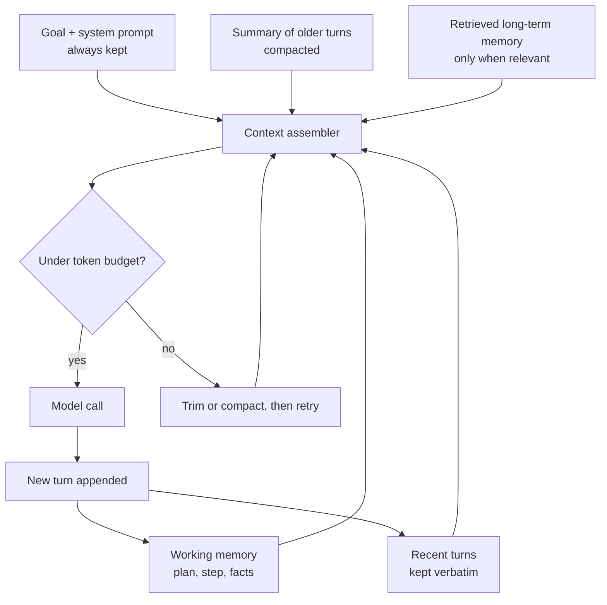

# Agent Memory: Short-Term and Working

> **Interview answer (say this first).** Short-term memory is the conversation buffer — the recent user and assistant messages kept in the context window. Working memory is the scratchpad the agent is actively using right now: its plan, current step, and the facts it has gathered. Both live inside a finite token budget, so the real engineering is measuring that budget and deciding every turn what to keep, what to summarise, and what to drop. Long-term memory is different: it lives outside the context and is retrieved into it when relevant.

## Why this exists

An agent loop only works if the model can see enough of the past to make a good next decision. That sounds trivial until you run a real task. A 40-turn research agent that appends every message and every tool result ends up sending a huge prompt on every turn. Three things break at once:

- **The context window fills up.** Once the prompt exceeds the model's limit, the request errors, or your provider silently truncates and the agent loses instructions.
- **Cost and latency climb.** Input tokens are charged on every turn, so the bill grows with the square of the turns. Latency climbs with prompt length too.
- **Quality drops.** Models attend unevenly to long prompts. Instructions buried in the middle are easier to miss, an effect often called "lost in the middle." Adding more text can make the agent dumber.

There is a second, separate failure. Even when the context fits, the agent loses its **plan**. If the plan exists only as an implicit pattern in the transcript, a long chain of tool results can bury it, and the model starts repeating work or forgetting a constraint. Production agents keep the plan in explicit **working memory** and rewrite it each turn.

So memory is not "store everything." It is a budgeting problem with three questions:

1. What must stay for the task to succeed?
2. What can be summarised without losing the decision-relevant facts?
3. What can be dropped entirely because it can be retrieved again?

This page covers the two memories that live inside the context — short-term and working. Long-term, episodic, and semantic memory live outside the window and get their own page.

> **Note:**
>
> **The one-sentence purpose.** Memory engineering is managing a finite token budget so the model always sees the small amount of information it needs, and never pays for the large amount it does not.


## Start from zero

| Word | Plain meaning |
| --- | --- |
| **Memory** | Information an agent carries forward instead of recomputing or re-fetching. |
| **Short-term memory** | The live conversation: recent user, assistant, and tool messages, in order. |
| **Working memory** | The agent's active scratchpad: current plan, step, and gathered facts. |
| **Long-term memory** | Stored information outside the context, retrieved when relevant. |
| **Episodic memory** | Records of past events and runs, such as "last time we refunded order 42." |
| **Semantic memory** | Durable facts and knowledge, such as policies and product details. |
| **Procedural memory** | How-to knowledge, such as a playbook or a trained skill. |
| **Context window** | The maximum tokens the model can consider in one call. |
| **Token** | A chunk of text, roughly three-quarters of a word in English. The unit of cost and limits. |
| **Token budget** | The number of tokens you allow yourself to send, below the hard limit. |
| **Conversation buffer** | The raw list of messages kept for the current task. |
| **Scratchpad** | A field where the agent writes plan and notes, separate from the chat. |
| **State** | Everything the agent knows: messages, plan, step, gathered facts, results. |
| **Trimming** | Dropping the oldest messages until the context fits the budget. |
| **Eviction** | Removing a specific item from memory, chosen by policy. |
| **Summarisation** | Replacing several messages with one shorter summary. |
| **Compaction** | Summarising older context while keeping recent turns verbatim. |
| **Rolling window** | Keeping only the last N turns, always dropping the oldest. |
| **Memory write** | Deciding that a fact is worth storing outside the context. |
| **Memory read** | Retrieving a stored fact back into the context. |
| **Recency bias** | The tendency to weight the newest text most heavily; useful and dangerous. |
| **Lost in the middle** | The observed drop in attention for content in the middle of a long prompt. |

Two clarifications:

- **Short-term vs working memory.** Short-term memory is the transcript; it is append-only until you trim it. Working memory is structured and deliberately rewritten: a plan, a step counter, a facts table. They overlap, but they are managed differently.
- **Memory vs state.** State is the complete picture, and it can live outside the model in your database. Memory is the part brought into the prompt. Persist state durably; load only a slice of it as memory.

## The core idea

Picture a **desk, a whiteboard, and a filing cabinet**.

- The **desk** is working memory. It holds only what you are using right now: the plan, the current step, the facts you just gathered. A tidy desk makes you fast; a cluttered one slows you down.
- The **whiteboard** is short-term memory. It records the recent back-and-forth so you can follow the conversation. It gets wiped and rewritten as the session goes on.
- The **filing cabinet** is long-term memory. It holds everything, but you fetch a folder only when you need it. You would never staple the whole cabinet to the desk.

The engineering is deciding what belongs on the desk at each moment, and the constraint is the **token budget**. The filing cabinet is cheap; the desk is expensive.



Every block feeding the assembler is a choice. The goal and system prompt are non-negotiable. Working memory is small and high-value. Recent turns are kept verbatim because they are most relevant. Older turns are compressed. Long-term memory is pulled in only on demand.

The memory types and where they live:

| Type | Holds | Lives where | Lifetime | Cost to keep |
| --- | --- | --- | --- | --- |
| Short-term | Recent conversation | Context window | Current task | High, grows each turn |
| Working | Plan, step, facts | State, copied into context | Current task | Low, small and structured |
| Episodic | Past events and runs | Database, retrieved | Long | Low until retrieved |
| Semantic | Durable facts, policies | Vector or keyword store | Long | Low until retrieved |
| Procedural | Playbooks, skills | Prompt or code | Long | Fixed prompt cost |

The key insight: **only short-term memory grows by itself.** Everything else is either fixed or fetched deliberately. So most context-budget work is managing the conversation buffer.

## How it works

1. **Reserve room for the answer.** The output tokens count against the same window. Decide the maximum answer size first, then the input budget is `window - max_output - safety margin`.
2. **Always include the system prompt and goal.** These define the task and the rules. Never let them be trimmed, or the agent forgets its constraints.
3. **Include working memory.** Add the plan, current step, and gathered facts as a compact structured block. Keep it small; it is the highest-value text you will send.
4. **Keep recent turns verbatim.** The last few user and assistant messages are the most relevant, so they stay in full.
5. **Summarise older turns.** When the buffer exceeds the budget, replace the oldest section with one summary message. Keep facts and decisions, drop pleasantries and repeated tool chatter.
6. **Truncate large tool results.** A tool result that is only needed once can be reduced to the fields the model needs. Store the full result outside the context and keep a reference id.
7. **Retrieve long-term memory on demand.** Search for facts relevant to the current step and add only the top few. Do not dump the whole store.
8. **Measure before sending.** Count tokens with the model's tokenizer and compare to the budget. Do this every turn, not once.
9. **Evict in a fixed order.** Drop in this priority: oversized tool results, then old small talk, then summarise old turns, then trim oldest turns. Never evict the system prompt, current goal, or active plan.
10. **Write durable state outside the context.** The full trajectory belongs in your database. The prompt is a view, not the source of truth.
11. **Log what changed.** Record tokens before and after trimming or compaction, and which messages were dropped. Silent compaction hides bugs.
12. **Re-plan after compaction.** After a big context change, ask the model to restate the plan so working memory stays aligned with the new context.

**What to keep and what to drop.** A simple policy that works well:

| Keep | Drop or compress |
| --- | --- |
| System prompt and goal | Repeated greetings and acknowledgements |
| Current plan and step | Old assistant reasoning that did not change the plan |
| Facts and decisions | Raw tool payloads already reduced to facts |
| Errors still being worked on | Resolved errors and their retries |
| Recent turns verbatim | Old turns, compressed into a summary |
| Constraints and permissions | Verbose examples already internalised |

**Measuring token growth.** Use the model's tokenizer, not a character guess.

```python
import tiktoken
ENC = tiktoken.get_encoding("cl100k_base")   # one OpenAI encoding, not universal

def tokens(messages):
    return len(ENC.encode(json.dumps(messages)))
```

Different model families use different tokenizers, so treat the exact number as an estimate and leave a margin. The growth pattern matters more than the last digit: context grows with every turn, and total billed input is the sum of every turn's context.

## The syntax you will use

**Count tokens for a message list.** Encode the JSON form so role and overhead text are included.

```python
def count(messages: list[dict]) -> int:
    return len(ENC.encode(json.dumps(messages)))
```

**Trim the oldest messages to fit a budget.** Keep the system message and the newest turns; drop from the front.

```python
def trim_to_budget(messages, budget, keep_last=6):
    system = [m for m in messages if m["role"] == "system"]
    rest = [m for m in messages if m["role"] != "system"]
    kept = rest[-keep_last:]                     # always keep recent turns
    while count(system + kept) > budget and len(kept) > 1:
        kept = kept[1:]                          # drop oldest first
    return system + kept
```

**Compact older turns into one summary.** Keep the last turns verbatim and replace the rest.

```python
def compact(messages, keep_last=2):
    system = [m for m in messages if m["role"] == "system"]
    rest = [m for m in messages if m["role"] != "system"]
    old, recent = rest[:-keep_last], rest[-keep_last:]
    summary = "Summary: " + " | ".join(
        f"{m['role']}: {str(m.get('content'))[:60]}" for m in old)
    return system + [{"role": "system", "content": summary}] + recent
```

**A structured working-memory scratchpad.** Small, explicit, and rewritten each turn.

```python
state = {
    "goal": "Refund order 42 if it is late.",
    "plan": ["lookup order", "check delivery date", "refund if late"],
    "done": [],
    "facts": {},
    "step": 0,
}
```

**Rebuild the prompt from state, not from the raw transcript.** This keeps the prompt small and stable.

```python
prompt = [
    {"role": "system", "content": "Refund agent."},
    {"role": "user", "content": state["goal"]},
    {"role": "system", "content": "Scratchpad: " + json.dumps(state)},
]
```

**A rolling window with a guaranteed system prompt.** The cheapest useful memory policy.

```python
recent = [m for m in messages if m["role"] != "system"]
window = [SYSTEM] + recent[-6:]            # system + last 6 non-system messages
```

**Retrieve long-term memory only when it matches.** Keyword overlap is enough to show the idea; embeddings scale it.

```python
def retrieve(query, k=2):
    q = set(query.lower().split())
    scored = [(len(q & set(item["text"].lower().split())), item)
              for item in MEMORY_STORE]
    scored = [pair for pair in scored if pair[0] > 0]
    scored.sort(key=lambda pair: (-pair[0], pair[1]["id"]))
    return [item for _, item in scored[:k]]
```

**Persist the whole trajectory outside the context.** The database keeps everything; the prompt keeps a view.

```python
DB.save_run(run_id, messages=messages, state=state, tokens=tokens(messages))
```

## Examples: simple to real

**Example 1 — context growth without management.** Twelve turns of ordinary conversation were generated and measured. The buffer reached **895 tokens**, and every one of those tokens would be resent on the next turn.

```text
tokens after 12 turns : 895
```

At this size it still fits most windows, but the pattern is linear and nothing stops it. Add tool results and the same run can reach six figures.

**Example 2 — trimming to a budget.** The same buffer is trimmed to a 400-token budget, keeping the newest messages.

```text
after trim (budget 400): 238 tokens | messages: 7
trim keeps system      : True
```

The buffer shrank from 895 to 238 tokens, a 73% reduction, and the system prompt survived. The cost is that older turns are gone; if they mattered, they needed to be summarised first.

**Example 3 — compaction instead of deletion.** Compaction replaces old turns with one summary and keeps the last two turns in full.

```text
after compact : 382 tokens | messages: 4
compaction ratio : 0.427
```

The context is 57% smaller and the important facts are still described. Compaction is slower and lossier than a pure window, because it needs a summarisation call, but it preserves decisions that trimming would silently delete.

**Example 4 — the sliding window is the cheapest option.** Keeping only the last six messages, plus the system prompt, gives the same 238-token result as trimming, with no loop or measurement.

```text
sliding window tokens : 238
```

Use it first. Move to budget-aware trimming and compaction only when the fixed window keeps dropping something the agent needs.

**Example 5 — working memory as a scratchpad.** The plan and facts are held in a small structured state, not inferred from chat. This state reached only **66 tokens**; the rebuilt prompt with the goal and scratchpad was **127 tokens**.

```text
scratchpad: {"done": ["lookup order"], "facts": {"order_42": {"days_late": 0,
             "status": "payment_failed"}}, "goal": "Refund order 42...",
             "plan": ["check decline code", "page billing if insufficient_funds"],
             "step": 1}
scratchpad tokens: 66
rebuilt prompt tokens: 127
```

Compare that with a 40-turn transcript. Explicit working memory is a fraction of the size and far more reliable, because the plan is stated rather than buried.

**Example 6 — retrieving long-term memory on demand.** A query pulls only the matching records. The retrieved slice was **42 tokens**, and adding it brought the prompt to **185 tokens**.

```text
retrieved: ['m2', 'm1']
retrieved tokens: 42
with memory tokens: 185
empty query retrieval: []
```

The query "order 42 payment failed refund" matched the two relevant records. An unrelated query matched nothing and added zero tokens, which is the point: long-term memory costs nothing until it is relevant.

## In production

- **Budget the whole window, not just the input.** Output tokens share the window with input. Reserve the maximum answer size plus a safety margin before you fill it.
- **Count with the real tokenizer and leave a margin.** Token counts differ by model family. A rough estimate plus a buffer is safer than trusting an exact number from another model.
- **Keep the system prompt and active plan pinned.** Never let trimming or compaction remove the rules or the current step. They are the cheapest and most important text.
- **Prefer a rolling window first.** It is simple and predictable. Add budget-aware trimming only when the window drops needed information.
- **Summarise before you delete.** Trimming is lossless only if the dropped content did not matter. Compaction keeps decisions at the cost of one summarisation call.
- **Cap every tool result at the source.** Truncate or select fields when the result is created. Large results are paid for on every later turn, not once.
- **Store the full trajectory outside the context.** The database is the source of truth; the prompt is a view. This also makes replay and debugging possible.
- **Retrieve long-term memory with a budget.** A retrieval that returns twenty documents destroys the context budget. Return a few, and rerank if needed.
- **Beware recency bias.** The newest text dominates, so a fresh tool result can override an older constraint. Restate critical rules near the end when it matters.
- **Beware lost in the middle.** Important instructions in the centre of a long prompt are easier to miss. Put the goal and constraints near the start, and the immediate task near the end.
- **Re-plan after compaction.** A summarised context can drift from the real plan. Ask the agent to restate the plan and continue from the scratchpad.
- **Log memory decisions.** Record tokens before and after, which messages were dropped, and what the summary contained. Silent compaction is a debugging nightmare.

## Interview questions

### 1. What is the difference between short-term and working memory?

**Answer.** Short-term memory is the live conversation buffer: recent user, assistant, and tool messages kept in order. Working memory is the agent's active scratchpad: the current plan, step, and gathered facts. Short-term memory grows by appending; working memory is structured and rewritten each turn. Both live in the context window, but they are managed differently.

**Follow-up: "Why not keep the plan in the transcript?"** Because a long transcript buries it. A structured scratchpad keeps the plan small, explicit, and easy to restate.

**Trap.** Treating them as the same thing and just appending everything. That is how a context window fills with noise.

### 2. What is a token budget, and how do you set it?

**Answer.** It is the number of tokens you allow a request, below the model's hard context limit. Set it by subtracting the maximum output tokens and a safety margin from the window size. Check the count before every call, because the budget is spent by input plus output together.

**Follow-up: "Why not just use the full window?"** Output shares the window, provider limits and cost make the full window a trap, and quality often drops before the limit is reached.

**Trap.** Counting only input tokens. The model's answer is billed and limited from the same pool.

### 3. How do trimming, summarisation, and compaction differ?

**Answer.** Trimming drops the oldest messages until the context fits. Summarisation replaces content with a shorter version. Compaction does both: older turns are summarised and recent turns are kept verbatim. Trimming is free but lossy; compaction costs a model call but preserves decisions.

**Follow-up: "When would you use each?"** A rolling window for short tasks, trimming under a hard budget, and compaction for long runs where earlier decisions still matter.

**Trap.** Compacting too aggressively. A summary that drops the reason for a decision causes the agent to undo its own work.

### 4. What should always survive memory management?

**Answer.** The system prompt and rules, the current goal, the active plan and step, unresolved errors, and any permission or safety constraint. These are small and high value. Lose them and the agent loses its task or its limits.

**Follow-up: "What is safe to drop?"** Acknowledgements, repeated reasoning that did not change the plan, resolved errors, and raw tool payloads already reduced to facts.

**Trap.** Dropping constraints because they are old. Age does not make a rule irrelevant.

### 5. How do you measure and control token growth?

**Answer.** Count tokens with the model's tokenizer on the assembled prompt every turn, log the count, and compare it to the budget. Context grows with each turn, and total billed input is the sum of every turn's context, so cost grows faster than the final size. Control it with smaller tool results, a rolling window, compaction, and cached prefixes.

**Follow-up: "What number would worry you?"** A prompt that grows every turn with no cap, or one where tool results dominate the count. Both predict a hard stop or a runaway bill.

**Trap.** Measuring only the final prompt size. The bill is the sum across turns.

### 6. What is long-term memory in an agent?

**Answer.** Information stored outside the context and brought in only when relevant: episodic records of past runs, semantic facts and policies, and procedural playbooks. It is retrieved, not permanently present, so it costs nothing until it is used.

**Follow-up: "How do you decide what to write to long-term memory?"** Write durable facts and decisions that will matter across runs, not raw transcripts. Storing everything makes retrieval worse.

**Trap.** Confusing long-term memory with a bigger context window. Retrieval is selective; a bigger window is just more expensive text.

### 7. What is "lost in the middle," and how does it affect memory design?

**Answer.** It is the observed tendency for models to attend less to information in the middle of a long prompt than to the beginning and end. For memory design it means more context is not automatically better: put the goal and constraints near the start, the immediate task near the end, and keep the middle lean.

**Follow-up: "How do you handle a constraint that keeps getting ignored?"** Restate it close to the current step, or move it into the tool or policy layer so it does not depend on attention at all.

**Trap.** Fixing a forgotten instruction by adding more text. That usually makes attention worse.

### 8. How would you design memory for a long-running agent?

**Answer.** Keep a durable state object outside the model with the goal, plan, step, facts, and full trajectory. Each turn, assemble a prompt from pinned instructions, compact working memory, recent turns, a summary of older turns, and retrieved long-term facts. Enforce a token budget, evict in a fixed order, and log every memory decision. After compaction, re-plan from the scratchpad.

**Follow-up: "What makes it resumable?"** All state is outside the context, so a restarted process can rebuild the prompt from the database and continue.

**Trap.** Keeping the only copy of state inside the conversation. A crash or a compaction then loses it forever.

## Remember this

- **Short-term memory is the transcript; working memory is the scratchpad.** Both live in the context window; only the transcript grows by itself.
- **Budget the whole window**, including output tokens, and measure with the real tokenizer every turn.
- **Evict in a fixed order** and never drop the system prompt, goal, plan, or safety constraints.
- **Summarise before you delete**; compaction preserves decisions that trimming silently loses.
- **Keep the full trajectory outside the context.** The database is the source of truth; the prompt is a view.
