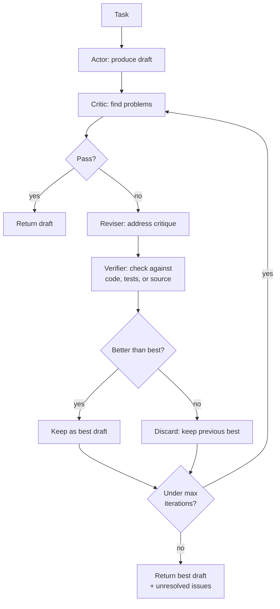

# Reflection and Self-Correction

> **Interview answer (say this first).** Reflection is a loop: generate a draft, **critique** it against a standard, then **revise**. The critique can come from code, rules, tests, a second model call (an **LLM-as-judge**), or a human. **Self-consistency** is a related trick: sample several independent answers and take the majority. Reflection catches mistakes a single pass misses, but every iteration costs model calls and a critic can be wrong — so ground the critique in something checkable, bound the iterations, and never assume the last draft is the best one.

## Why this exists

A language model does not know when it is wrong. It produces a fluent answer and moves on. In a chat this is annoying; in an agent it is dangerous, because a wrong step becomes the input to the next step.

Here is the compounding failure. An agent is asked to compute a total from a report:

```text
Step 1: model reads the report and states the total is 39,800.
Step 2: model uses 39,800 to draft an invoice.
Step 3: agent sends the invoice.
```

If the true total is 39,080, the error was born in step 1 and never checked. Nothing in the loop compares the answer to the source. By step 3 the mistake is in a customer's inbox.

Three facts make this common:

- **Generation is not verification.** The same model that made the mistake is not reliable at spotting it in one pass, because it already believes its answer.
- **Long outputs drift.** The further the model gets from the source, the more a small error propagates.
- **Agents act on their outputs.** A wrong sentence is cheap; a wrong tool call with a wrong argument spends real money.

Reflection exists to insert a check between generation and action. The simplest version is:

```text
draft -> critique -> (revise -> critique)* -> final
```

The critical design question is not "should we reflect?" but **"what is doing the critiquing, and how do we know the critique is right?"** A reflection loop whose critic is the same ungrounded model can confidently "fix" a correct answer into a wrong one. A reflection loop whose critic runs code or tests is far more trustworthy.

> **Note:**
>
> **The one-sentence purpose.** Reflection adds a check step so the agent can catch and correct its own mistakes before acting — but only if the critique is grounded.


## Start from zero

| Word | Plain meaning |
| --- | --- |
| **Reflection** | Reviewing your own output and improving it. |
| **Critique** | A judgement about a draft: what is wrong, and why. |
| **Revision** | A new draft that addresses the critique. |
| **Actor / generator** | The component that produces the first draft. |
| **Critic** | The component that finds problems. It may be code, rules, a model, or a person. |
| **Verifier** | A critic that checks against ground truth, such as a test or a schema. |
| **Grounded critique** | A critique backed by something objective: a test result, a calculation, a source document. |
| **Ungrounded critique** | A critique that is only another model's opinion. |
| **LLM-as-judge** | Using a model to score or judge an output. |
| **Reflexion** | A named pattern: after a failed attempt, the agent writes a short lesson about why it failed, stores it, and uses it on the next attempt. |
| **Self-consistency** | Sampling several independent answers to the same question and taking the most common one. |
| **Majority vote** | Choosing the answer that appears most often across samples. |
| **Iteration** | One pass of draft → critique → revise. |
| **Max iterations** | The hard cap on how many passes are allowed. |
| **Regression** | A revision that makes the output worse than the draft it replaced. |
| **False positive** | The critic rejects something that is actually correct. |
| **False negative** | The critic accepts something that is actually wrong. |
| **Reward hacking** | The output learns to satisfy the critic without being genuinely better. |
| **Cost per iteration** | The extra tokens, latency, and money each loop adds. |

Two distinctions cause most confusion, so pin them down now:

- **Grounded vs ungrounded critique.** A test that fails is a fact. A model that says "this seems wrong" is an opinion. Prefer facts.
- **Reflection vs self-consistency.** Reflection improves one chain by critiquing it. Self-consistency improves reliability by comparing several chains. They solve different problems and compose.

## The core idea

Think of a **newspaper**. A reporter writes the story (the draft). An editor reads it and sends it back with notes: the name is spelled wrong, the number is missing, the headline buries the point (the critique). The reporter rewrites (the revision). A fact-checker then verifies specific claims against sources (the verifier). The editor does not rewrite the story from scratch; they improve the existing one.

An agent's reflection loop works the same way:



The subtle box is **"better than best."** Many reflection implementations return the last draft. That is wrong: a revision can regress. Keep the best-scoring draft and return that, even if it is not the latest.

Different critics have very different reliability and cost:

| Critic | Grounded? | Cost | Catches | Misses |
| --- | --- | --- | --- | --- |
| Unit tests / type checks | Yes | Low | Logic and schema errors | Wrong requirements, style |
| Schema validation (Pydantic) | Yes | Low | Malformed output | Plausible but wrong content |
| Rule/assertion checks | Yes | Low | Known constraints (length, citations) | Novel errors |
| Cross-check against a tool | Yes | Medium | Factual errors it can verify | Claims the tool cannot check |
| Second model (LLM-as-judge) | No | Medium | Reasoning gaps, tone, coverage | Errors it shares with the actor |
| Same model, same prompt | No | Low | Almost nothing reliable | Its own blind spots |
| Human review | Yes | High | Most things | Nothing, but does not scale |

The interview-ready summary: **use the cheapest grounded critic that covers your failure mode, and use a model judge only for things code cannot check.**

## How it works

1. **Produce a draft.** The actor generates an answer or an action.
2. **Critique the draft.** Run the critic and capture specific, actionable issues — not just a score.
3. **Decide whether to revise.** If the draft passes, stop. Do not revise a passing draft; that is where reward hacking starts.
4. **Revise.** The reviser addresses each issue. Give it the original draft and the critique, not the whole history, to keep the prompt small.
5. **Verify the revision.** Run the grounded check again. A revision that fails the verifier is worse, not better.
6. **Track the best draft.** Score every draft and keep the highest. Return the best, not the last.
7. **Repeat within a cap.** Stop after `max_iterations`, when the score stops improving, or when the critic passes.
8. **Report unresolved issues.** If the loop ends without passing, return the best draft plus the open critique. An honest partial answer beats a false pass.
9. **Count the cost.** Every iteration is another model call or tool run. Record iterations and tokens per task; if the loop rarely changes the outcome, remove it.
10. **Feed lessons forward.** In the Reflexion pattern, the critique from a failed attempt becomes a short note attached to the next attempt. The agent does not repeat the same mistake.

## The syntax you will use

**A grounded critic is just a function.** It returns a verdict, concrete issues, and a score.

```python
def critic(answer: str) -> tuple[bool, str, float]:
    expected = str(17 * 24)                 # ground truth computed in code
    if expected in answer:
        return True, "correct", 1.0
    return False, f"expected {expected}, got a different value", 0.0
```

**Structure the critique with a schema.** A model judge that returns free text is hard to act on.

```python
from typing import Literal
from pydantic import BaseModel, Field

class Critique(BaseModel):
    verdict: Literal["pass", "revise"]
    score: float = Field(ge=0, le=1)
    issues: list[str] = Field(default_factory=list)

# {"verdict": "revise", "score": 0.4, "issues": ["missing citation"]}
```

**Ask a model to judge, with an explicit rubric.** Vague judges give noisy verdicts.

```text
You are a strict editor. Score the draft from 0 to 1 on these criteria:
1. Does it answer the question?
2. Is every claim supported by the provided sources?
3. Is anything missing or contradictory?
Return JSON matching the Critique schema. List concrete issues.
Do not rewrite the draft.
```

**Bound the loop and count calls.** A cap is the difference between reflection and a runaway bill.

```python
MAX_ITERS = 3

def reflect(task: str) -> tuple[str, int]:
    calls = 0
    feedback = ""
    best, best_score = None, -1.0
    for _ in range(MAX_ITERS):
        draft = actor(task, feedback)
        calls += 1
        ok, issues, score = critic(draft)
        if score > best_score:
            best, best_score = draft, score
        if ok:
            return best, calls
        feedback = issues
    return best, calls
```

**Sample for self-consistency.** Independent samples, then a vote.

```python
import collections

def self_consistent(task: str, n: int = 5) -> str:
    samples = [actor(task, temperature=0.8) for _ in range(n)]
    votes = collections.Counter(extract_answer(s) for s in samples)
    answer, count = votes.most_common(1)[0]
    return answer
```

**Keep the best, not the last.** Guard against regression.

```python
if new_score > best_score:
    best, best_score = new_draft, new_score
```

**Use a verifier tool where one exists.** Tests are the strongest critic.

```python
def verify_code(code: str, tests: str) -> tuple[bool, str]:
    result = run_python(code + "\n" + tests)   # returns exit code and output
    return result.returncode == 0, result.stderr
```

## Examples: simple to real

**Example 1 — verify then revise fixes a confident wrong answer.** The critic recomputes the arithmetic; the second draft passes:

```text
iter 0: answer='The answer is 398.' verdict=wrong: expected 408, got a different value
iter 1: answer='The answer is 408.' verdict=correct
final: The answer is 408. model calls: 2
```

Two model calls instead of one, and it caught a real error. The critique was **grounded**: the expected value came from code, not from another opinion.

**Example 2 — self-consistency votes across samples.** Three sampled answers, majority wins:

```text
Counter({'408': 2, '398': 1}) -> majority 408
```

This is useful when the model is right more often than wrong but not reliably. Sample several times at higher temperature, extract the final answer, and take the mode. Note the cost: three calls instead of one, and a consistent wrong answer still wins.

**Example 3 — a critic can be wrong.** A brittle critic rejects a correct paraphrase:

```text
strict_critic("Seventeen times twenty-four equals four hundred and eight.")
  -> (False, 'answer must contain the exact result', 0.0)

arithmetic_critic("What is 17 * 24?", "Seventeen times twenty-four equals four hundred and eight.")
  -> (False, 'no numeric answer found', 0.0)
```

Both critics are wrong about a correct answer. The first demanded an exact substring; the second only looked for digits. This is the failure mode people forget: **an ungrounded or badly written critic can drive a correct draft into a wrong revision.** Always test your critic on known-good and known-bad inputs.

**Example 4 — a revision can regress.** Without a "best draft" guard, the loop returns the last, worst output:

```text
round 0: Draft(text='The answer is 42.', score=0.17)
round 1: Draft(text='The answer is 42. (expanded)', score=0.28)
round 2: Draft(text='short', score=0.05)
round 3: Draft(text='short', score=0.05)
returned best: Draft(text='The answer is 42. (expanded)', score=0.28)
```

The scores show the trap: the original scored `0.17`, the first revision `0.28`, then it collapsed to `0.05`. The guarded loop returned the best (`0.28`). A naive loop would have returned `short`.

**Example 5 — bound the iterations and report unresolved issues.** When the cap is reached without passing, say so:

```text
result: "The answer is 408."   status: passed (2 iterations)
result: "draft text"           status: unresolved after 3 iterations
                               open issues: ["missing citation"]
```

A truthful "unresolved" is far more useful than a silent false pass. Downstream code can escalate to a human instead of acting on a bad answer.

**Example 6 — Reflexion turns a failure into a lesson.** After a failed attempt, store a short note and prepend it next time:

```text
attempt 1: called send_email before fetching the attachment -> failed
lesson:    always fetch the attachment before calling send_email
attempt 2: fetched attachment -> send_email -> success (lesson applied)
```

The lesson is a memory (episodic → procedural). This is why reflexion composes with the memory chapter: the reflection output is exactly the kind of durable note worth storing.

## In production

- **Ground the critique.** Prefer code, tests, schemas, and tool cross-checks. Use an LLM judge only for qualities code cannot measure, such as clarity or completeness.
- **Cap the iterations hard.** Two or three passes capture most of the gain. Beyond that, cost grows and quality often flattens or regresses.
- **Keep the best draft, not the last.** Score every candidate and return the best. Without this guard, a bad revision ships.
- **Watch for regression and oscillation.** If the same issues recur or the score bounces, stop and return the best draft with the open issues.
- **Test the critic itself.** Feed it known-good and known-bad examples. A critic with false positives is worse than no critic, because it "fixes" correct answers.
- **Do not reflect on passing drafts.** Revising a correct answer invites reward hacking and burns calls. Stop on pass.
- **Separate the actor and the judge prompts.** Asking the model to critique its own exact output in the same context tends to produce agreement, not scrutiny.
- **Count cost per task, not per call.** Measure how often reflection changes the final outcome. If it rarely does, remove it for that task type.
- **Self-consistency needs an extractor.** Voting only works if you can pull a comparable final answer from each sample. Free-form prose does not vote well.
- **Reflection is not a fix for bad tools.** If the retriever returns the wrong documents, a critic will not invent the right ones. Fix inputs first.
- **Make the critique actionable.** "This is bad" cannot be revised. "Missing the Q3 revenue figure" can. Require concrete issues in the schema.
- **Log every draft and critique.** Reflection multiplies outputs. Without logs, you cannot tell whether the loop helped or hurt, or which critic rejected a good answer.

## Interview questions

### 1. What is reflection in an agent, and why does it help?

**Answer.** Reflection is a loop that generates a draft, critiques it, and revises. It helps because a single forward pass has no check step: the model cannot reliably catch its own error while producing it. A separate critique pass creates a chance to detect a wrong fact, a missing requirement, or a malformed action before the agent acts on it.

**Follow-up: "Does the same model critiquing itself work?"** Sometimes, but weakly. The critic shares the actor's blind spots, and it tends to agree with text it just produced. It works much better with a different prompt, a different model, or — best — a grounded check.

**Trap.** Treating reflection as a guaranteed improvement. An ungrounded critic can turn a correct answer into a wrong one.

### 2. What makes a critique trustworthy?

**Answer.** Grounding. A critique is trustworthy when it is backed by something objective: a test that fails, a calculation that disagrees, a schema that rejects, a source that does not contain the claim. An opinion from another model is weaker because it can be wrong in the same direction. The more the critique depends on checkable reality, the more you can trust it.

**Follow-up: "When is a model judge the right tool?"** For qualities code cannot check — tone, clarity, completeness against a rubric — and usually as a first pass, not the final authority.

**Trap.** Assuming a second model is automatically a better critic. Two correlated models can agree on the same mistake.

### 3. What is self-consistency, and when should you use it?

**Answer.** Self-consistency samples several independent answers to the same task and returns the majority. It uses the idea that the correct answer is more likely to be reached by multiple reasoning paths than a wrong one. Use it when the task has a single comparable answer and the model is right more often than wrong, and when extra latency is acceptable.

**Follow-up: "What is the downside?"** Cost scales with the number of samples, and if the model is consistently wrong the majority is consistently wrong. It also needs a reliable way to extract and compare final answers.

**Trap.** Using it for open-ended generation, where there is no single answer to vote on.

### 4. What is the Reflexion pattern?

**Answer.** Reflexion is a loop where a failed attempt produces a short written reflection on why it failed, the reflection is stored, and the next attempt starts with that lesson in context. It is reflection plus memory: the agent does not just revise once, it remembers the mistake so it does not repeat it across attempts or runs.

**Follow-up: "Where is the reflection stored?"** Usually as an episodic or procedural memory attached to the task. That connects directly to the memory chapter — the lesson is exactly the kind of note worth persisting.

**Trap.** Storing every rambling thought. The reflection must be short, specific, and actionable, or it pollutes the next prompt.

### 5. How many reflection iterations should you allow?

**Answer.** Usually two or three. Most of the gain comes from the first critique; later passes cost calls and increasingly risk regression. Set a hard cap, stop early when the draft passes, and stop when the score stops improving. Return the best draft plus any unresolved issues rather than looping.

**Follow-up: "How do you detect that further iterations will not help?"** Track the score and the issue set. If neither changes, or the same issues recur, stop.

**Trap.** Looping until the critic passes with no cap. A confused or over-strict critic then runs forever at full cost.

### 6. How can reflection make an answer worse?

**Answer.** Three ways: the critic is wrong and forces a change to a correct draft; the reviser introduces a new error while fixing the old one; or the model learns to satisfy the critic's style rather than the task, which is reward hacking. All three are why you keep the best draft, test the critic, and stop on pass.

**Follow-up: "How do you catch reward hacking?"** Judge the final output against the real goal, not just the critic's score, and keep a human sample in the loop for high-stakes tasks.

**Trap.** Assuming a higher critic score always means a better answer. The critic is a proxy, not the goal.

### 7. What is the difference between reflection and self-consistency?

**Answer.** Reflection improves a *single* chain by critiquing and revising it. Self-consistency improves *reliability* by sampling multiple independent chains and voting. Reflection can be applied to each sample, and then the samples can be voted on, so they compose. Reflection is about correcting; self-consistency is about aggregation.

**Follow-up: "Which is more expensive?"** Both add calls. Self-consistency multiplies the whole generation; reflection adds a critique and a revision per pass. Measure cost per task for each.

**Trap.** Confusing them because both are "the model checking itself." One compares drafts, the other compares independent answers.

### 8. Where does reflection fit in an agent loop?

**Answer.** After the agent produces a candidate answer or action and before it commits. For a tool call, run the verifier on the arguments and the result: does the schema validate, do preconditions hold, does the result make sense? For a final answer, run the critic before returning. Reflection sits at the decision boundary, where catching an error is still cheap.

**Follow-up: "Should reflection run on every step?"** No. Run it where errors are costly or irreversible, such as payments or emails. Reflecting on every trivial step wastes money and latency.

**Trap.** Reflecting after the action. Once the email is sent, a critique cannot unsend it. Verify before acting.

## Remember this

- **Reflection = draft → critique → revise**, repeated within a hard cap, returning the **best** draft, not the last.
- **Ground the critique** in code, tests, schema, or source; an ungrounded model judge can "fix" a correct answer into a wrong one.
- **Self-consistency** samples several answers and votes — different from reflection, and composable with it.
- **A critic can be wrong**; test it on known-good and known-bad inputs before trusting it.
- **Reflect before acting**, and only where errors are costly — every iteration is another model call.
