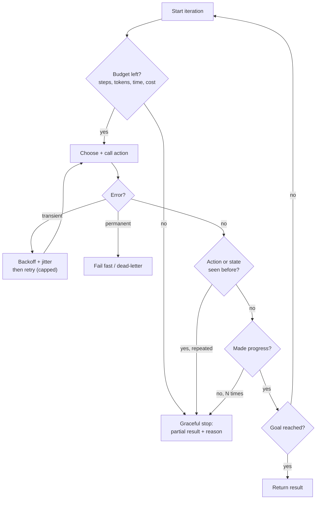

# Retries, Termination, and Loop Detection

> **Interview answer (say this first).** Retries re-attempt failures that are **transient**, using **exponential backoff with jitter** so many clients do not retry in lockstep. **Termination conditions** stop an agent when it succeeds, exhausts its step, token, time, or money budget, or stops making progress. **Loop detection** notices an agent repeating the same action or cycling through the same states by hashing them. When a stop condition wins, the agent should **shut down gracefully** — return the best partial result plus a clear reason, never spin forever or crash without explanation.

## Why this exists

An agent is a loop around a stochastic model, and every loop needs an exit. Without one, two failure modes dominate production bill.

**Failure one: the retry storm.** A downstream API has a bad minute. A thousand agent workers get a timeout. All thousand retry immediately. The API, which was briefly overloaded, is now buried under a thousand simultaneous retries and stays down. The retries caused the outage to continue. This is why backoff and jitter exist: wait longer each time, and add randomness so the herd spreads out.

**Failure two: the infinite agent.** A model keeps calling the same search tool because the result is never quite what it wants. Each call costs tokens and time. Nothing in the loop says "enough." The run continues until someone notices the invoice.

Here is the shape of a stuck agent:

```text
step 1: search("invoice 99") -> no result
step 2: search("invoice 99") -> no result
step 3: search("invoice 99") -> no result
step 4: search("invoice 99") -> no result
...
```

The agent is not crashing. It is not even erroring. It is burning money in a loop that looks, from the inside, like progress.

Termination is not just "stop when done." It is a small set of guards, each answering a different question:

- **Succeeded?** Stop and return the result.
- **Out of budget?** Stop and return the partial result.
- **Repeating itself?** Stop because more iterations will not help.
- **Stuck without progress?** Stop because the loop is no longer learning anything.

A reliable agent checks all of these on every iteration, before spending the next call.

> **Note:**
>
> **The one-sentence purpose.** Retries handle flaky dependencies; termination and loop detection stop the agent when more work cannot help.


## Start from zero

| Word | Plain meaning |
| --- | --- |
| **Retry** | Attempting an operation again after it fails. |
| **Transient error** | A temporary failure that may succeed on a later attempt: a timeout, a rate limit, a dropped connection. |
| **Permanent error** | A failure that will keep failing: bad credentials, a 404, a schema violation. Retrying wastes time. |
| **Idempotent** | Safe to run more than once with the same result. Retrying a non-idempotent action can double-charge or double-email. |
| **Backoff** | Waiting before the next attempt, usually longer each time. |
| **Exponential backoff** | Doubling the wait each attempt: 0.5s, 1s, 2s, 4s. |
| **Cap** | The maximum wait, so backoff does not grow without bound. |
| **Jitter** | Randomness added to the wait so many clients do not retry at the same instant. |
| **Full jitter** | Wait a random amount between 0 and the exponential ceiling. |
| **Decorrelated jitter** | Wait a random amount between the base and a multiple of the previous wait. |
| **Retry storm / thundering herd** | Many clients retrying at once and overwhelming a recovering service. |
| **Circuit breaker** | A switch that stops calling a failing dependency for a while instead of retrying. |
| **Timeout** | A maximum time allowed for one operation. |
| **Deadline** | A maximum time for the whole task; children inherit it. |
| **Termination condition** | A rule that ends the agent loop. |
| **Step budget** | A maximum number of loop iterations. |
| **Token budget** | A maximum number of model tokens for the run. |
| **Cost budget** | A maximum amount of money for the run. |
| **Loop** | Repeating actions without reaching the goal. |
| **Cycle** | Returning to a state the agent has already been in. |
| **Stuck** | Repeating or cycling with no new information or progress. |
| **Action signature** | A hash of the tool name and its arguments, used to spot repeated actions. |
| **State hash** | A hash of the agent's state, used to spot repeated states even when the actions differ. |
| **Progress** | A measurable change toward the goal: a new fact, a completed step, a smaller error. |
| **Graceful shutdown** | Ending cleanly with the best result so far and a reason. |
| **Partial result** | The useful output produced before the stop, even if the goal is incomplete. |
| **Dead-letter** | A place to park work that failed permanently, for later inspection. |

Two distinctions cause most confusion, so pin them down now:

- **Retryable vs permanent.** Retrying a permanent error multiplies the failure. Classify first, retry second.
- **Loop vs slow progress.** A loop repeats without new information. Slow progress still changes state. Only the first should be killed.

## The core idea

Think about **redialing a phone number** that is busy.

You do not redial instantly forever. You wait a little, then longer, then longer still, with a cap. And if a thousand people are all redialing the same switchboard, they should not all call back on the same second — so each adds a random offset. That is exponential backoff with jitter.

Now think about the redialer giving up. They stop when the call connects, when they have tried too many times, or when they realize they are dialing their own number by mistake. The last one is loop detection: the action is identical and pointless.

A reliable agent wraps its loop in four guards:



Every arrow out of the loop either returns a real result or a partial result with a reason. There is no path that spins.

Which errors to retry is a policy, not a guess:

| Error | Retry? | Why |
| --- | --- | --- |
| Timeout, connection reset | Yes | Transient by nature. |
| HTTP 429 (rate limit) | Yes, honour `Retry-After` | The server asked you to slow down. |
| HTTP 500, 502, 503, 504 | Yes, with backoff | Server-side and often temporary. |
| HTTP 408 | Yes | Request timeout. |
| HTTP 400, 401, 403, 404, 422 | No | The request is wrong; it will stay wrong. |
| Schema / validation error | No | The input must change first. |
| Business rule violation ("insufficient funds") | No | A valid answer, not a failure. |
| Unknown tool name | No | A programming error. |

## How it works

1. **Classify the error.** Decide retryable or permanent from the exception type or HTTP status. Permanent errors fail fast and go to the dead-letter path.
2. **Check idempotency.** Only retry an action that is safe to run twice, or that carries an idempotency key. Otherwise a retry can duplicate its effect.
3. **Compute the delay.** Exponential ceiling `base * 2 ** attempt`, capped at a maximum.
4. **Add jitter.** Pick a random delay up to the ceiling (full jitter) or near the previous delay (decorrelated jitter).
5. **Respect `Retry-After`.** If the server says when to retry, wait at least that long.
6. **Sleep and re-attempt within a limit.** Cap total attempts per operation, and keep the timeout and deadline.
7. **Check termination before each loop iteration.** Goal reached, budget exhausted, repeated action, repeated state, or no progress.
8. **Hash actions and states.** `sha256` of the tool name and arguments catches repeated actions; a hash of the state catches cycles with different actions.
9. **Count no-progress iterations.** If several iterations add no new fact and complete no step, stop.
10. **Shut down gracefully.** Return the best partial result, the reason for stopping, and any open issues. Persist a checkpoint so a human or a later run can resume.

Two refinements sit inside this loop:

- **Circuit breaker.** After a threshold of failures to one dependency, stop calling it for a cooldown period. This protects both the agent and the dependency, and it is better than retrying a service that is clearly down.
- **Progress-based budget.** Instead of only counting steps, measure goal progress. An agent that completes half the plan in three steps should get more room than one that has produced nothing in ten.

## The syntax you will use

**Classify retryable errors.** Exception types first, HTTP status second.

```python
import errno

RETRYABLE_EXC = (TimeoutError, ConnectionError)   # network-layer failures
RETRYABLE_STATUS = {408, 429, 500, 502, 503, 504}
TRANSIENT_ERRNOS = {                               # only these OS errors are retryable
    errno.ECONNRESET, errno.ECONNABORTED, errno.ECONNREFUSED,
    errno.ETIMEDOUT, errno.EPIPE, errno.EHOSTUNREACH, errno.ENETUNREACH,
}

def is_retryable(exc: BaseException | None = None, status: int | None = None) -> bool:
    if exc is not None:
        if isinstance(exc, RETRYABLE_EXC):
            return True
        # FileNotFoundError, PermissionError, and other permanent OSErrors are
        # not retryable; only transient errnos are.
        return isinstance(exc, OSError) and exc.errno in TRANSIENT_ERRNOS
    return status in RETRYABLE_STATUS
```

**Compute full jitter.** Random between zero and the exponential ceiling.

```python
import random

def full_jitter(attempt: int, base: float = 0.5, cap: float = 30.0,
                rng: random.Random | None = None) -> float:
    rng = rng or random
    return rng.uniform(0, min(cap, base * 2 ** attempt))
```

**Compute decorrelated jitter.** Random between the base and three times the previous wait.

```python
def decorrelated_jitter(prev: float, base: float = 0.5, cap: float = 30.0,
                        rng: random.Random | None = None) -> float:
    rng = rng or random
    return min(cap, rng.uniform(base, prev * 3))
```

**Retry with a cap and a deadline.** Count attempts and stop.

```python
import time

def call_with_retry(fn, *, max_attempts: int = 5, deadline: float | None = None):
    last: Exception | None = None
    for attempt in range(max_attempts):
        if deadline is not None and time.monotonic() > deadline:
            raise TimeoutError("task deadline exceeded") from last
        try:
            return fn()
        except Exception as exc:
            last = exc
            if not is_retryable(exc=exc):
                raise
        if attempt + 1 < max_attempts:        # do not sleep after the last attempt
            time.sleep(full_jitter(attempt))
    if last is None:
        raise ValueError("max_attempts must be >= 1")
    raise last
```

**Hash an action.** Same tool and arguments produce the same key.

```python
import hashlib, json

def action_key(tool: str, args: dict) -> str:
    payload = json.dumps([tool, args], sort_keys=True)
    return hashlib.sha256(payload.encode()).hexdigest()[:12]
```

**Hash the state.** `sort_keys=True` makes the hash independent of key order.

```python
def state_key(state: dict) -> str:
    return hashlib.sha256(json.dumps(state, sort_keys=True).encode()).hexdigest()[:12]
```

**Count repeats and stop.** Three identical actions in a row means stuck.

```python
class RepeatDetector:
    def __init__(self, max_repeats: int = 3) -> None:
        self.max_repeats = max_repeats
        self.counts: dict[str, int] = {}

    def observe(self, key: str) -> bool:
        self.counts[key] = self.counts.get(key, 0) + 1
        return self.counts[key] >= self.max_repeats
```

**Return a partial result with a reason.** The shutdown contract.

```python
def shutdown(partial: list, reason: str, open_issues: list[str]):
    return {"status": "partial", "result": partial,
            "stopped_because": reason, "open_issues": open_issues}
```

**Mention the library form.** In real code you would often reach for `tenacity` rather than hand-rolling the loop.

```python
from tenacity import retry, stop_after_attempt, wait_exponential_jitter

@retry(stop=stop_after_attempt(5), wait=wait_exponential_jitter(initial=0.5, max=30))
def fetch(url: str) -> bytes: ...
```

## Examples: simple to real

**Example 1 — full jitter spreads retries out.** Seeded output for six attempts, base `0.5s`, cap `30s`:

```text
attempt 0: ceiling=0.5s  sleep=0.162s
attempt 1: ceiling=1.0s  sleep=0.151s
attempt 2: ceiling=2.0s  sleep=1.302s
attempt 3: ceiling=4.0s  sleep=0.290s
attempt 4: ceiling=8.0s  sleep=4.287s
attempt 5: ceiling=16.0s sleep=5.851s
```

The ceiling doubles every attempt, but the actual sleep is random below it. Two workers that fail at the same moment do not wake at the same moment. That randomness is what prevents a retry storm.

**Example 2 — decorrelated jitter.** A smoother variant that grows from the previous wait:

```text
attempt 0: sleep=0.824s
attempt 1: sleep=0.797s
attempt 2: sleep=1.732s
attempt 3: sleep=0.840s
attempt 4: sleep=1.583s
```

Decorrelated jitter is useful when requests are spread over time rather than all starting together. Full jitter is the safer default for a synchronized herd.

**Example 3 — which errors are worth retrying.** Verified classification:

```text
TimeoutError      retryable? True
ValueError        retryable? False
ConnectionError   retryable? True
FileNotFoundError retryable? False

HTTP 400 False    HTTP 404 False    HTTP 408 True
HTTP 429 True     HTTP 500 True     HTTP 503 True
```

Retrying a `400` or a `ValueError` just repeats the failure. Retrying a `429` or a `503` often succeeds. Classifying correctly is the difference between resilience and a retry storm.

**Example 4 — detecting a repeated action.** The same search three times trips the detector:

```text
attempt 0: stuck=False
attempt 1: stuck=False
attempt 2: stuck=True
attempt 3: stuck=True
attempt 4: stuck=True
```

Hashing `(tool, args)` makes "the same action" precise. The agent may phrase its reasoning differently each time, but the action signature is identical, so the detector fires at the configured threshold.

**Example 5 — detecting a state cycle.** Two states alternating forever:

```text
state hash ignores key order: True
cycle at index 2: state {'pos': 'A'} repeats
```

The first line shows `state_key({"a": 1, "b": 2}) == state_key({"b": 2, "a": 1})`, so key order cannot hide a cycle. The agent moves `A -> B -> A`, and the third state repeats a seen hash. State hashing catches loops whose individual actions differ but whose situation is the same.

**Example 6 — graceful shutdown with a partial result.** Three different stop conditions, all returning what was done so far:

```text
loop detected: same action 3x at step 2
partial: ['step 0: tried search', 'step 1: tried search']

time budget exceeded at step 3
partial: ['step 0: tried search', 'step 1: tried search', 'step 2: tried search']

max steps (3) reached
partial: ['step 0: tried search', 'step 1: tried search', 'step 2: tried search']
```

Each run stops for a different reason and returns the work completed. A caller can show the partial result, retry the task with more budget, or escalate to a human — instead of hanging or throwing away everything.

## In production

- **Retry only transient errors.** Classify by exception type and HTTP status. Retrying a `400`, a validation error, or a business rule violation multiplies the failure instead of fixing it.
- **Always add jitter, never plain backoff.** A thousand clients with identical exponential waits still collide. Jitter is what makes backoff work at scale.
- **Cap attempts and total time.** Per-operation attempt caps plus a whole-task deadline. Without a deadline, retries can outlive the user's patience and the server's request window.
- **Respect `Retry-After`.** When a server tells you when to retry, waiting longer is cheaper than hammering and being banned.
- **Make write actions idempotent or do not retry them.** Use an idempotency key so a retried payment or email does not happen twice. This is the most common retry bug.
- **Use a circuit breaker for a dead dependency.** After repeated failures, stop calling for a cooldown. Retrying a service that is clearly down adds load and delays the inevitable.
- **Check termination before spending, not after.** Evaluate budgets and detectors at the top of the iteration so the last expensive call is never made.
- **Detect both repeated actions and repeated states.** Actions catch "same call again." States catch `A -> B -> A` with different actions. Run both.
- **Track progress, not just steps.** Count iterations that add a new fact or complete a step. Many steps with no progress means stuck, even if the actions vary.
- **Never swallow the stop reason.** Return a status: `success`, `partial`, `failed`. A partial result with a reason is debuggable; a silent timeout is not.
- **Persist a checkpoint on stop.** A durable checkpoint lets the next run resume instead of starting over. This pairs with the checkpointing topic in this phase.
- **Dead-letter permanent failures.** Park them with the error and inputs so a human can fix the cause and replay. Silent drops hide systemic problems, and a rising rate of "stuck" stops is a signal that a prompt, a tool, or an upstream API changed.

## Interview questions

### 1. Why use exponential backoff with jitter instead of a fixed retry delay?

**Answer.** A fixed delay means every client retries at the same interval. If a service fails and a thousand workers all wait one second, they all return together and overwhelm the recovering service. Exponential backoff spreads retries over increasing gaps, and jitter randomizes each client's timing so the herd is broken up. The cap keeps the wait from growing without bound.

**Follow-up: "What is the difference between full jitter and decorrelated jitter?"** Full jitter picks a random delay between zero and the exponential ceiling, which spreads a synchronized herd well. Decorrelated jitter picks between the base delay and a multiple of the previous delay, which produces a smoother sequence for unsynchronized clients.

**Trap.** Using backoff without jitter and calling it done. Backoff alone still synchronizes clients that failed together.

### 2. Which errors should you retry?

**Answer.** Retry transient failures: timeouts, connection resets, rate limits (`429`), and server errors (`500`, `502`, `503`, `504`). Do not retry permanent failures: `400`, `401`, `403`, `404`, `422`, schema violations, unknown tools, or business rule violations such as "insufficient funds." The test is whether a later attempt could plausibly succeed with the same input.

**Follow-up: "How do you handle a rate limit specifically?"** Honour `Retry-After` if present, use backoff with jitter, and reduce concurrency. A rate limit is the server asking you to slow down, not a bug.

**Trap.** Retrying everything with a broad `except Exception`. That turns a permanent bug into an expensive loop.

### 3. What does idempotency have to do with retries?

**Answer.** A retry re-runs an operation, so it must be safe to run twice. Read operations usually are. Write operations often are not: a retried payment can double-charge, a retried email can send twice. The fix is an idempotency key — a unique id the server uses to recognize a repeat — or a check-then-write pattern. Never retry a non-idempotent write blindly.

**Follow-up: "What if the provider does not support idempotency keys?"** Make the effect idempotent yourself: check whether the action already happened, or use a state machine that records the transition before retrying.

**Trap.** Assuming a timeout means the operation did not happen. The request may have succeeded and only the response was lost.

### 4. What termination conditions should an agent check?

**Answer.** At least five: the goal is reached; a step budget is exhausted; a token, time, or cost budget is exhausted; a repeated action or state is detected; and no measurable progress has been made for several iterations. Check them before each iteration so you never spend another call once a stop condition is true.

**Follow-up: "Why have more than a step cap?"** A step cap alone lets an agent take a few very expensive steps. Token and cost budgets bound the damage a single large call can do.

**Trap.** Relying on the model to decide when to stop. Models often believe they are almost done; the loop needs its own independent guards.

### 5. How do you detect a loop?

**Answer.** Hash the action as `(tool, arguments)` and count repeats; three identical actions means stuck. Separately, hash the agent's state and keep a set of seen hashes; a repeated state means a cycle even if the actions differ. Stop when either fires, and return the partial result. Hashing is how you compare actions and states cheaply and precisely.

**Follow-up: "Can an agent loop without repeating an exact action?"** Yes, `A -> B -> A` with different actions each time. That is why state hashing is needed in addition to action hashing.

**Trap.** Comparing raw strings or dictionaries. Key order and formatting make them differ; sort keys and hash instead.

### 6. What is graceful shutdown, and why does it matter?

**Answer.** Graceful shutdown means stopping cleanly when a guard fires: return the best partial result, the reason for stopping, and any open issues, and persist a checkpoint. It matters because the alternative — hanging, crashing, or returning nothing — wastes the work already done and hides the cause. A caller can act on a partial result and a clear reason.

**Follow-up: "What should a partial result contain?"** The work completed so far, what remains, and which guard stopped the run. If possible, a checkpoint that lets a later run resume.

**Trap.** Throwing away partial work on timeout. For long tasks, the partial result is often the most valuable output.

### 7. What is a circuit breaker, and how is it different from a retry?

**Answer.** A retry tries one operation again after a failure. A circuit breaker watches a whole dependency and, after a threshold of failures, stops calling it for a cooldown period. Retries handle a blip; the breaker handles an outage. They work together: retry a few times, then open the circuit so the failing service can recover and your agent fails fast instead of queueing.

**Follow-up: "What happens when the circuit closes again?"** Traffic resumes, often gradually. A half-open state lets a few requests through to test whether the dependency is healthy before restoring full load.

**Trap.** Retrying forever against a dependency that is down. That is how a retry mechanism turns one outage into two.

### 8. How do you stop an agent that keeps doing new but useless work?

**Answer.** Measure progress, not activity. Track whether each iteration adds a new fact, completes a plan step, or reduces the goal's error. If several iterations produce nothing measurable, stop with a partial result even though every action was different. Combine this with absolute budgets so "new work" cannot run forever either.

**Follow-up: "How do you define progress for a fuzzy task?"** Use concrete proxies: a new retrieved document, a passing test, a satisfied subgoal, or a smaller diff to the target. Define progress before the run, not after.

**Trap.** Treating "the model is still thinking" as progress. A long chain of novel actions with no measurable change is a stuck agent with better vocabulary.

## Remember this

- **Retry only transient errors**, with **exponential backoff plus jitter**, capped attempts, and a deadline.
- **Jitter is not optional.** Without it, clients that fail together retry together and cause the outage.
- **Retry writes only when idempotent** — use an idempotency key so a retry cannot double the effect.
- **Termination has five guards:** goal, budget, repeated action, repeated state, and no progress.
- **Stop gracefully with a partial result and a reason**; a partial answer plus a checkpoint beats a hang.
